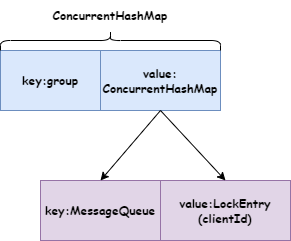

    这是rocketmq系列的第八篇文章，主要介绍的是消息类型。

<style>
.my-code {
   color: orange;
}
.orange {
   color: rgb(255, 53, 2)
}
.red {
   color: red
}
code {
   color: #0ABF5B;
}
</style>

# 一、消息类型
RocketMQ支持多种消息类型，以满足不同业务场景的需求。以下是Rocketmq主要消息类型的详细说明及使用场景
<!-- more -->

# 二、普通消息
最基本的消息类型，无特殊特性，支持高并发、高吞吐量。

代码示例：
```java
// 生产者发送普通消息
Message msg = new Message("TopicTest", "TagA", "Hello RocketMQ".getBytes());
SendResult sendResult = producer.send(msg);
```

# 三、顺序消息（Ordered Message）
保证同一消息组（MessageGroup）内的消息按发送顺序被消费。

代码示例：
```java
// 生产者发送顺序消息（按订单ID选择队列）
producer.send(msg, new MessageQueueSelector() {
    @Override
    public MessageQueue select(List<MessageQueue> mqs, Message msg, Object arg) {
        Long orderId = (Long) arg;
        int index = (int) (orderId % mqs.size());
        return mqs.get(index);
    }
}, orderId);

// 消费者顺序消费
consumer.registerMessageListener(new MessageListenerOrderly() {
    @Override
    public ConsumeOrderlyStatus consumeMessage(List<MessageExt> msgs, ConsumeOrderlyContext context) {
        // 顺序处理逻辑
        return ConsumeOrderlyStatus.SUCCESS;
    }
});
```

## 3.1、特性
- 生产端：通过<code class="my-code">MessageQueueSelector</code>将同一业务ID的消息路由到同一队列
  - 例如将订单消息发送到同一队列
- 消费端：需使用<code class="my-code">MessageListenerOrderly</code>保证顺序处理


## 3.2、生产者发送过程
常用的发送接口如下：
```java
public class DefaultMQProducer extends ClientConfig implements MQProducer {
    public SendResult send(Message msg, MessageQueueSelector selector, Object arg){}
}
```
内部的多个send方法，最终会执行<code class="my-code">sendSelectImpl</code>，代码如下：
```java
public class DefaultMQProducer extends ClientConfig implements MQProducer {
    private SendResult sendSelectImpl(
            Message msg,
            MessageQueueSelector selector,
            Object arg,
            final CommunicationMode communicationMode,
            final SendCallback sendCallback, final long timeout
    ) throws MQClientException, RemotingException, MQBrokerException, InterruptedException {
        long beginStartTime = System.currentTimeMillis();
        this.makeSureStateOK();
        Validators.checkMessage(msg, this.defaultMQProducer);

        TopicPublishInfo topicPublishInfo = this.tryToFindTopicPublishInfo(msg.getTopic());
        if (topicPublishInfo != null && topicPublishInfo.ok()) {
            MessageQueue mq = null;
            try {
                List<MessageQueue> messageQueueList =
                        mQClientFactory.getMQAdminImpl().parsePublishMessageQueues(topicPublishInfo.getMessageQueueList());
                Message userMessage = MessageAccessor.cloneMessage(msg);
                String userTopic = NamespaceUtil.withoutNamespace(userMessage.getTopic(), mQClientFactory.getClientConfig().getNamespace());
                userMessage.setTopic(userTopic);

                mq = mQClientFactory.getClientConfig().queueWithNamespace(selector.select(messageQueueList, userMessage, arg));
            } catch (Throwable e) {
                throw new MQClientException("select message queue throwed exception.", e);
            }

            long costTime = System.currentTimeMillis() - beginStartTime;
            if (timeout < costTime) {
                throw new RemotingTooMuchRequestException("sendSelectImpl call timeout");
            }
            if (mq != null) {
                return this.sendKernelImpl(msg, mq, communicationMode, sendCallback, null, timeout - costTime);
            } else {
                throw new MQClientException("select message queue return null.", null);
            }
        }

        validateNameServerSetting();
        throw new MQClientException("No route info for this topic, " + msg.getTopic(), null);
    }
}
```
可以看到，在发送的时候，使用 <code class="my-code">MessageQueueSelector</code> 选择一个 MessageQueue，然后发送消息到这个 MessageQueue。对于并发消息，这里不传 <code class="my-code">MessageQueueSelector</code>，如果发送方法没有指定 MessageQueue，就会按照默认的策略选择一个。

## 3.3、消费者消费过程

### 3.3.1、consume注册监听
分析<code class="my-code">registerMessageListener</code>的源码逻辑：
```java
public class DefaultMQPushConsumer extends ClientConfig implements MQPushConsumer {
    public void registerMessageListener(MessageListenerOrderly messageListener) {
        this.messageListener = messageListener;
        this.defaultMQPushConsumerImpl.registerMessageListener(messageListener);
    }
}
```
顺序消息监听器 <code class="my-code">MessageListenerOrderly</code>，并且注册到 <code class="my-code">DefaultMQPushConsumer</code>，这个注册同时也注册到了 <code class="my-code">DefaultMQPushConsumerImpl</code>。

### 3.3.2、启动过程
在 <code class="my-code">DefaultMQPushConsumerImpl</code> 启动时候，会判断注册的 <code class="my-code">MessageListener</code> 是不是 <code class="my-code">MessageListenerOrderly</code>，如果是，就把 <code class="my-code">consumeOrderly</code> 变量设置为 `true`，以此来标记是顺序消息拉取还是并发消息拉取。然后把 <code class="my-code">ConsumeMessageService</code> 初始化为 <code class="my-code">ConsumeMessageOrderlyService</code>。
```java
public ConsumeMessageOrderlyService(DefaultMQPushConsumerImpl defaultMQPushConsumerImpl,
    MessageListenerOrderly messageListener) {
    this.defaultMQPushConsumerImpl = defaultMQPushConsumerImpl;
    this.messageListener = messageListener;

    this.defaultMQPushConsumer = this.defaultMQPushConsumerImpl.getDefaultMQPushConsumer();
    this.consumerGroup = this.defaultMQPushConsumer.getConsumerGroup();
    this.consumeRequestQueue = new LinkedBlockingQueue<Runnable>();

    this.consumeExecutor = new ThreadPoolExecutor(
        this.defaultMQPushConsumer.getConsumeThreadMin(),
        this.defaultMQPushConsumer.getConsumeThreadMax(),
        1000 * 60,
        TimeUnit.MILLISECONDS,
        this.consumeRequestQueue,
        new ThreadFactoryImpl("ConsumeMessageThread_"));

    this.scheduledExecutorService = Executors.newSingleThreadScheduledExecutor(new ThreadFactoryImpl("ConsumeMessageScheduledThread_"));
}

```

### 3.3.3、Broker 锁定MQ
要保证消息的顺序性，就需要保证同一个 MessageQueue 只能被同一个 Consumer 消费。

#### 3.3.3.1、消费者注册锁
<code class="my-code">ConsumeMessageOrderlyService start</code>的时候，会启动一个定时任务，周期性（默认 20s）地向 Broker 发送锁定消息（请求类型 LOCK_BATCH_MQ），Broker 收到后，就会把 MessageQueue、group 和 clientId 进行绑定，这样其他客户端就不能从这个 MessageQueue 拉取消息。
```java
public void start() {
    if (MessageModel.CLUSTERING.equals(ConsumeMessageOrderlyService.this.defaultMQPushConsumerImpl.messageModel())) {
        this.scheduledExecutorService.scheduleAtFixedRate(new Runnable() {
            @Override
            public void run() {
                ConsumeMessageOrderlyService.this.lockMQPeriodically();
            }
        }, 1000 * 1, ProcessQueue.REBALANCE_LOCK_INTERVAL, TimeUnit.MILLISECONDS);
    }
}
```
注意：Broker 的锁定是有过期时间的，默认 60s，可以配置，锁定过期后，有可能被其他 Consumer 进行消费。

最终通过定时心跳（RebalanceService）向Broker上报持有的队列锁。
```java
// 消费者端代码：RebalanceImpl#persistConsumerOffset
for (MessageQueue mq : mqs) {
    this.mQClientFactory.getMQClientAPIImpl().lockBatchMQ(
        findBrokerResult.getBrokerAddr(), 
        consumerGroup, 
        Collections.singleton(mq), 
        clientId, 
        3000 // 超时时间
    );
}
```

#### 3.3.3.2、Broker处理心跳
Broker收到心跳请求后更新锁时间戳：
```java
// Broker端处理心跳：ClientHousekeepingService#scanExceptionChannel
for (Channel channel : channels) {
    // 更新锁的最后活跃时间
    rebalanceLockManager.updateLockTimestamp(
        group, 
        mq, 
        clientId, 
        System.currentTimeMillis()
    );
}
```

#### 3.3.3.3、队列锁管理类：RebalanceLockManager
核心数据结构
```java
public class RebalanceLockManager {
    // 锁存储结构: <消费者组, <MessageQueue, LockEntry>>
    private final ConcurrentMap<String/* group */, ConcurrentHashMap<MessageQueue, LockEntry>> lockTable =
        new ConcurrentHashMap<>(1024);
    
    // 锁条目定义
    private static class LockEntry {
        private final String clientId;      // 消费者客户端ID
        private final long lockTimestamp;   // 加锁时间
        private volatile long lastUpdateTimestamp; // 最后更新时间（用于超时判断）
    }
}
```

broker的队列锁机制通过 RebalanceLockManager实现，核心逻辑包括：
1. 锁存储：使用嵌套的ConcurrentHashMap维护消费者组-队列-锁条目的映射。
2. 锁续期：消费者通过心跳定期更新锁的最后活跃时间。
3. 超时清理：Broker后台线程定期扫描并释放超时锁。


Broker 端锁结构如下图：



### 3.3.4、拉取消息
消费者启动时，启动消费拉取线程 PullMessageService，里面死循环不停地从 Broker 拉取消息。这里调用了 DefaultMQPushConsumerImpl 类的 pullMessage 方法。这里拉取消息的逻辑跟并发消息逻辑是一样的。

拉取到消息后，调用 PullCallback 的 onSuccess 方法处理结果，这里调用了 ConsumeMessageOrderlyService 的 submitConsumeRequest 方法，里面用线程池提交了 ConsumeRequest 线程。
```java
class ConsumeRequest implements Runnable {
    private final ProcessQueue processQueue;
    private final MessageQueue messageQueue;

    public ConsumeRequest(ProcessQueue processQueue, MessageQueue messageQueue) {
        this.processQueue = processQueue;
        this.messageQueue = messageQueue;
    }

    @Override
    public void run() {
      //省略部分逻辑
      //1.获取到 MessageQueueLock 对应的锁
      final Object objLock = messageQueueLock.fetchLockObject(this.messageQueue);
      synchronized (objLock) {
        if (MessageModel.BROADCASTING.equals(ConsumeMessageOrderlyService.this.defaultMQPushConsumerImpl.messageModel())
                || (this.processQueue.isLocked() && !this.processQueue.isLockExpired())) {
          final long beginTime = System.currentTimeMillis();
          for (boolean continueConsume = true; continueConsume; ) {
            //省略延后执行的逻辑
            final int consumeBatchSize =
                    ConsumeMessageOrderlyService.this.defaultMQPushConsumer.getConsumeMessageBatchMaxSize();
            //2.从 processQueue 拉取消息
            List<MessageExt> msgs = this.processQueue.takeMessages(consumeBatchSize);
            if (!msgs.isEmpty()) {
              final ConsumeOrderlyContext context = new ConsumeOrderlyContext(this.messageQueue);

              ConsumeOrderlyStatus status = null;
              //省略部分逻辑
              boolean hasException = false;
              try {
                //3.获取处理锁
                this.processQueue.getConsumeLock().lock();
                //4.执行消费处理逻辑
                status = messageListener.consumeMessage(Collections.unmodifiableList(msgs), context);
              } catch (Throwable e) {
                log.warn(String.format("consumeMessage exception: %s Group: %s Msgs: %s MQ: %s",
                        RemotingHelper.exceptionSimpleDesc(e),
                        ConsumeMessageOrderlyService.this.consumerGroup,
                        msgs,
                        messageQueue), e);
                hasException = true;
              } finally {
                //5.释放处理锁
                this.processQueue.getConsumeLock().unlock();
              }
              //省略部分逻辑
              continueConsume = ConsumeMessageOrderlyService.this.processConsumeResult(msgs, status, context, this);
            } else {
              continueConsume = false;
            }
          }
        } else {
          //省略部分逻辑
          ConsumeMessageOrderlyService.this.tryLockLaterAndReconsume(this.messageQueue, this.processQueue, 100);
        }
      }
    }
}
```
上面的代码总结一下，Consumer 消费消息的逻辑如下：
1. 对 MessageQueueLock 进行加锁，这样就保证只有一个线程在处理当前 MessageQueue。
2. 从 ProcessQueue 拉取一批消息。
3. 获取 ProcessQueue 锁，这样保证了只有当前线程可以进行消息处理，同时也可以防止 Rebalance 线程把当前处理的 MessageQueue 移除掉。
4. 执行消费处理逻辑。
5. 释放 ProcessQueue 处理锁；
6. processConsumeResult 方法更新消息偏移量。
> 注意：ProcessQueue 中的锁是 ReentrantLock。


# 四、事务消息（Transactional Message）
通过两阶段提交（2PC）实现分布式事务最终一致性。
- 特点：
  - 消息发送分为 `PREPARED` 和 `COMMIT` 两个阶段。
  - 支持事务状态回查机制。
- 使用场景：
  - 跨系统事务操作（如：扣减库存 + 生成订单）
  - 金融系统中的资金转账。


示例代码：
- 事务日志表
```sql
CREATE TABLE `transaction_log` (
    `id` BIGINT AUTO_INCREMENT PRIMARY KEY,
    `tx_id` VARCHAR(64) NOT NULL UNIQUE COMMENT 'RocketMQ事务ID',
    `biz_id` VARCHAR(64) NOT NULL COMMENT '订单ID',
    `status` TINYINT NOT NULL DEFAULT 0 COMMENT '0:处理中 1:成功 2:失败',
    `create_time` DATETIME NOT NULL,
    `update_time` DATETIME NOT NULL,
    UNIQUE KEY `uk_biz_id` (`biz_id`)
);
```
- 生产者
```java
// 1. 配置RocketMQ事务生产者
TransactionMQProducer producer = new TransactionMQProducer("OrderProducerGroup");
producer.setNamesrvAddr("localhost:9876");
producer.setTransactionListener(new OrderTransactionListener());
producer.start();

// 2. 发送事务消息方法
public void createOrder(OrderDTO orderDTO) {
    // (1) 创建订单（本地事务第一步）
    Order order = orderService.createOrder(orderDTO); // 返回订单ID

    // (2) 构造消息体
    Message msg = new Message("OrderTopic", "TagA", order.toJson().getBytes());
    msg.putUserProperty("biz_id", order.getOrderId());

    // (3) 发送事务消息
    producer.sendMessageInTransaction(msg, null);
}

// 3. 实现TransactionListener
class OrderTransactionListener implements TransactionListener {
    //半消息发送成功后，执行本地事务
    @Override
    public LocalTransactionState executeLocalTransaction(Message msg, Object arg) {
        try {
            // 从消息中解析订单信息
            OrderDTO orderDTO = JSON.parseObject(msg.getBody(), OrderDTO.class);

            // (1) 执行本地事务：扣减库存（假设库存服务通过API调用）
            boolean stockSuccess = stockService.reduceStock(orderDTO.getProductID(), orderDTO.getQuantity());

            // (2) 记录事务状态到事务日志表
            transactionService.logTransaction(
                msg.getTransactionId(), // RocketMQ事务ID
                orderDTO.getOrderId(), // 业务ID
                stockSuccess ? TransactionStatus.SUCCESS : TransactionStatus.FAILED
            );

            return stockSuccess ? LocalTransactionState.COMMIT_MESSAGE : LocalTransactionState.ROLLBACK_MESSAGE;
        } catch (Exception e) {
            // 异常时回滚
            return LocalTransactionState.ROLLBACK_MESSAGE;
        }
    }

    @Override
    public LocalTransactionState checkLocalTransaction(MessageExt msg) {
        // 回查时根据biz_id查询事务状态
        String bizId = msg.getUserProperty("biz_id");
        TransactionStatus status = transactionService.getStatusByBizId(bizId);
        
        if (status == TransactionStatus.SUCCESS) {
            return LocalTransactionState.COMMIT_MESSAGE;
        } else if (status == TransactionStatus.FAILED) {
            return LocalTransactionState.ROLLBACK_MESSAGE;
        } else {
            // 状态未知，可重试或超时处理
            return LocalTransactionState.UNKNOW;
        }
    }
}
```
- 消费者
```java
// 消费者配置（Spring Boot示例）
@RocketMQMessageListener(
        topic = "OrderTopic",
        consumerGroup = "StockConsumerGroup"
)
@Component
public class StockConsumer implements RocketMQListener<MessageExt> {
  @Override
  public void onMessage(MessageExt msg) {
    try {
      // 解析订单信息
      String body = new String(msg.getBody(), "UTF-8");
      OrderDTO orderDTO = JSON.parseObject(body, OrderDTO.class);

      // 执行扣减库存（幂等性设计）
      stockService.reduceStock(orderDTO.getProductID(), orderDTO.getQuantity());

      // 更新库存状态到数据库
      stockService.updateStockStatus(orderDTO.getProductID(), "DEDUCTED");
    } catch (Exception e) {
      // 消息重试或补偿
      throw new RuntimeException("库存扣减失败，消息重试");
    }
  }
}
```

## 4.1、事务流程
1. 发送PREPARED消息（消息对消费者不可见）。
2. 执行本地事务。
3. 根据本地事务结果提交 COMMIT 或 ROLLBACK。
4. 若未提交，Broker会回查事务状态。


## 4.2、生成者发送半消息
核心类<code class="my-code">TransactionMQProducer</code>。发送半消息时，设置消息属性 <code class="my-code">TRAN_MSG</code>标识其为事务消息。
```java
public class DefaultMQProducerImpl implements MQProducerInner {
    public TransactionSendResult sendMessageInTransaction(Message msg, Object arg) {
      // 设置消息属性为事务消息
      MessageAccessor.putProperty(msg, MessageConst.PROPERTY_TRANSACTION_PREPARED, "true");
      MessageAccessor.putProperty(msg, MessageConst.PROPERTY_PRODUCER_GROUP, this.defaultMQProducer.getProducerGroup());
      try {
        // 发送到Broker
        sendResult = this.send(msg);
      } catch (Exception e) {
        throw new MQClientException("send message Exception", e);
      }
      LocalTransactionState localTransactionState = LocalTransactionState.UNKNOW;
      Throwable localException = null;
      switch (sendResult.getSendStatus()) {
        // 处理发送结果
        case SEND_OK: {
          try {
            // 执行本地事务
              localTransactionState = localTransactionExecuter.executeLocalTransactionBranch(msg, arg);
          } catch (Throwable e) {
            log.info("executeLocalTransactionBranch exception", e);
            log.info(msg.toString());
            localException = e;
          }
        }
        break;
        case FLUSH_DISK_TIMEOUT:
        case FLUSH_SLAVE_TIMEOUT:
        case SLAVE_NOT_AVAILABLE:
          localTransactionState = LocalTransactionState.ROLLBACK_MESSAGE;
          break;
        default:
          break;
      }

      try {
        this.endTransaction(sendResult, localTransactionState, localException);
      } catch (Exception e) {
        log.warn("local transaction execute " + localTransactionState + ", but end broker transaction failed", e);
      }
      // 返回事务结果
      return transactionSendResult;
    }
}
```
关键点：
- 消息属性 <code class="my-code">PROPERTY_TRANSACTION_PREPARED</code> 标记为半消息。
- Broker接收到半消息后，存储至 <code class="my-code">RMQ_SYS_TRANS_HALF_TOPIC</code>。

## 4.3、Broker处理半消息
Broker处理生产者的消息请求是在SendMessageProcessor中实现的：
```java
public RemotingCommand processRequest(ChannelHandlerContext ctx,
    RemotingCommand request) throws RemotingCommandException {
    SendMessageContext traceContext;
    switch (request.getCode()) {
        case RequestCode.CONSUMER_SEND_MSG_BACK:
            return this.consumerSendMsgBack(ctx, request);
        default:
            SendMessageRequestHeader requestHeader = parseRequestHeader(request);
            if (requestHeader == null) {
                return null;
            }
            TopicQueueMappingContext mappingContext = this.brokerController.getTopicQueueMappingManager().buildTopicQueueMappingContext(requestHeader, true);
            RemotingCommand rewriteResult = this.brokerController.getTopicQueueMappingManager().rewriteRequestForStaticTopic(requestHeader, mappingContext);
            if (rewriteResult != null) {
                return rewriteResult;
            }
            traceContext = buildMsgContext(ctx, requestHeader);
            String owner = request.getExtFields().get(BrokerStatsManager.COMMERCIAL_OWNER);
            traceContext.setCommercialOwner(owner);
            try {
                this.executeSendMessageHookBefore(ctx, request, traceContext);
            } catch (AbortProcessException e) {
                final RemotingCommand errorResponse = RemotingCommand.createResponseCommand(e.getResponseCode(), e.getErrorMessage());
                errorResponse.setOpaque(request.getOpaque());
                return errorResponse;
            }
            RemotingCommand response;
            if (requestHeader.isBatch()) {
                response = this.sendBatchMessage(ctx, request, traceContext, requestHeader, mappingContext,
                    (ctx1, response1) -> executeSendMessageHookAfter(response1, ctx1));
            } else {
                response = this.sendMessage(ctx, request, traceContext, requestHeader, mappingContext,
                    (ctx12, response12) -> executeSendMessageHookAfter(response12, ctx12));
            }
            return response;
    }
}
```
会调用到SendMessageProcessor.sendMessage()，判断消息类型，进行半消息存储:
```java
public RemotingCommand sendMessage(final ChannelHandlerContext ctx,
    final RemotingCommand request,
    final SendMessageContext sendMessageContext,
    final SendMessageRequestHeader requestHeader,
    final TopicQueueMappingContext mappingContext,
    final SendMessageCallback sendMessageCallback) throws RemotingCommandException {
    //...省略
    String traFlag = oriProps.get(MessageConst.PROPERTY_TRANSACTION_PREPARED);
    boolean sendTransactionPrepareMessage = false;
    if (Boolean.parseBoolean(traFlag)
        && !(msgInner.getReconsumeTimes() > 0 && msgInner.getDelayTimeLevel() > 0)) { //For client under version 4.6.1
        if (this.brokerController.getBrokerConfig().isRejectTransactionMessage()) {
            response.setCode(ResponseCode.NO_PERMISSION);
            response.setRemark(
                "the broker[" + this.brokerController.getBrokerConfig().getBrokerIP1()
                    + "] sending transaction message is forbidden");
            return response;
        }
        sendTransactionPrepareMessage = true;
    }
    long beginTimeMillis = this.brokerController.getMessageStore().now();
    if (brokerController.getBrokerConfig().isAsyncSendEnable()) {
    	//...异步发送
        return null;
    } else {
        PutMessageResult putMessageResult = null;
        if (sendTransactionPrepareMessage) {
        	//存储事务消息
            putMessageResult = this.brokerController.getTransactionalMessageService().prepareMessage(msgInner);
        } else {
        	//存储普通消息
            putMessageResult = this.brokerController.getMessageStore().putMessage(msgInner);
        }
        return response;
    }
}
```
继续看事务半消息存储实现prepareMessage:
```java
public PutMessageResult prepareMessage(MessageExtBrokerInner messageInner) {
    return transactionalMessageBridge.putHalfMessage(messageInner);
}
private MessageExtBrokerInner parseHalfMessageInner(MessageExtBrokerInner msgInner) {
    MessageAccessor.putProperty(msgInner, MessageConst.PROPERTY_REAL_TOPIC, msgInner.getTopic());
    MessageAccessor.putProperty(msgInner, MessageConst.PROPERTY_REAL_QUEUE_ID,
        String.valueOf(msgInner.getQueueId()));
    msgInner.setSysFlag(
        MessageSysFlag.resetTransactionValue(msgInner.getSysFlag(), MessageSysFlag.TRANSACTION_NOT_TYPE));
    msgInner.setTopic(TransactionalMessageUtil.buildHalfTopic());
    msgInner.setQueueId(0);
    msgInner.setPropertiesString(MessageDecoder.messageProperties2String(msgInner.getProperties()));
    return msgInner;
}
```
备份消息的原主题名称与原队列ID，然后取消事务消息的消息标签，重新设置消息的主题为：RMQ_SYS_TRANS_HALF_TOPIC，队列ID固定为0。与其他普通消息区分开，然后完成消息持久化。到这里，broker就初步处理完了 Producer 发送的事务半消息。当客户端TransactionMQProducer执行endTransaction动作时,触发broker事务消息的二阶段提交,broker会执行EndTransactionProcessor的processRequest方法:


# 五、延迟消息
当消息写入到Broker后，不能立刻被消费者消费，需要等待指定的时长后才可被消费处理的消息，称为延时消息。

## 5.1、延迟消息等级
RocketMQ延时消息的延迟时长不支持随意时长的延迟，是通过特定的延迟等级来指定的。默认支持18个等级的延迟消息，延时等级定义在RocketMQ服务端的MessageStoreConfig类中的如下变量中：
```java
// MessageStoreConfig.java
private String messageDelayLevel = "1s 5s 10s 30s 1m 2m 3m 4m 5m 6m 7m 8m 9m 10m 20m 30m 1h 2h";

//发消息时，设置delayLevel等级即可：msg.setDelayLevel(level)。level有以下三种情况：
level == 0，消息为非延迟消息
1<=level<=maxLevel，消息延迟特定时间，例如level==1，延迟1s
level > maxLevel，则level== maxLevel，例如level==20，延迟2h
```

## 5.2、示例
```java
public class DelayProducer {
    public static void main(String[] args) throws Exception {
        SimpleDateFormat sdf = new SimpleDateFormat("HH:mm:ss.SSS");

        // 实例化消息生产者Producer
        DefaultMQProducer producer = new DefaultMQProducer("OneMoreGroup");
        // 设置NameServer的地址
        producer.setNamesrvAddr("localhost:9876");
        // 启动Producer实例
        producer.start();

        Message msg = new Message("OneMoreTopic"
                , "DelayMessage", "This is a delay message.".getBytes());

        //"1s 5s 10s 30s 1m 2m 3m 4m 5m 6m 7m 8m 9m 10m 20m 30m 1h 2h"
        //设置消息延迟级别为3，也就是延迟10s。
        msg.setDelayTimeLevel(3);

        // 发送消息到一个Broker
        SendResult sendResult = producer.send(msg);
        // 通过sendResult返回消息是否成功送达
        System.out.printf("%s Send Status: %s, Msg Id: %s %n"
                , sdf.format(new Date())
                , sendResult.getSendStatus()
                , sendResult.getMsgId());

        // 如果不再发送消息，关闭Producer实例。
        producer.shutdown();
    }
}

public class Consumer {

  public static void main(String[] args) throws MQClientException {
    SimpleDateFormat sdf = new SimpleDateFormat("HH:mm:ss.SSS");

    // 实例化消费者
    DefaultMQPushConsumer consumer = new DefaultMQPushConsumer("OneMoreGroup");

    // 设置NameServer的地址
    consumer.setNamesrvAddr("localhost:9876");

    // 订阅一个或者多个Topic，以及Tag来过滤需要消费的消息
    consumer.subscribe("OneMoreTopic", "*");
    // 注册回调实现类来处理从broker拉取回来的消息
    consumer.registerMessageListener((MessageListenerConcurrently) (msgs, context) -> {
      System.out.printf("%s %s Receive New Messages:%n"
              , sdf.format(new Date())
              , Thread.currentThread().getName());
      for (MessageExt msg : msgs) {
        System.out.printf("\tMsg Id: %s%n", msg.getMsgId());
        System.out.printf("\tBody: %s%n", new String(msg.getBody()));
      }
      // 标记该消息已经被成功消费
      return ConsumeConcurrentlyStatus.CONSUME_SUCCESS;
    });
    // 启动消费者实例
    consumer.start();
    System.out.println("Consumer Started.");
  }
}
```

## 5.3、延迟消息的原理分析
> 以下分析的RocketMQ源码的版本号是4.7.1，版本不同源码略有差别。

### 5.3.1、CommitLog
在<code class="red">org.apache.rocketmq.store.CommitLog</code>中，针对延迟消息做了一些处理：
```java
// 延迟级别大于0，就是延时消息
if (msg.getDelayTimeLevel() > 0) {
    // 判断当前延迟级别，如果大于最大延迟级别，
    // 就设置当前延迟级别为最大延迟级别。
    if (msg.getDelayTimeLevel() > this.defaultMessageStore
            .getScheduleMessageService().getMaxDelayLevel()) {
        msg.setDelayTimeLevel(this.defaultMessageStore
                .getScheduleMessageService().getMaxDelayLevel());
    }
    // 获取延迟消息的主题，
    // 其中RMQ_SYS_SCHEDULE_TOPIC的值为SCHEDULE_TOPIC_XXXX
    topic = TopicValidator.RMQ_SYS_SCHEDULE_TOPIC;
    // 根据延迟级别获取延迟消息的队列Id，
    // 队列Id其实就是延迟级别减1
    queueId = ScheduleMessageService.delayLevel2QueueId(msg.getDelayTimeLevel());
    // 备份真正的主题和队列Id
    MessageAccessor.putProperty(msg, MessageConst.PROPERTY_REAL_TOPIC, msg.getTopic());
    MessageAccessor.putProperty(msg, MessageConst.PROPERTY_REAL_QUEUE_ID, String.valueOf(msg.getQueueId()));
    msg.setPropertiesString(MessageDecoder.messageProperties2String(msg.getProperties()));
    // 设置延时消息的主题和队列Id
    msg.setTopic(topic);
    msg.setQueueId(queueId);
}
```
可以看到，每一个延迟消息的主题都被暂时更改为<code class="red">SCHEDULE_TOPIC_XXXX</code>，并且根据延迟级别延迟消息变更了新的队列Id。接下来，处理延迟消息的就是<code class="red">org.apache.rocketmq.store.schedule.ScheduleMessageService</code>

### 5.3.2、ScheduleMessageService
<code class="red">ScheduleMessageService</code>是由<code class="red">org.apache.rocketmq.store.DefaultMessageStore</code>进行初始化的，初始化包括构造对象和调用load方法。最后，再执行<code class="red">ScheduleMessageService</code>的<code class="red">start</code>方法：
```java
public void start() {
    // 使用AtomicBoolean确保start方法仅有效执行一次
    if (started.compareAndSet(false, true)) {
        this.timer = new Timer("ScheduleMessageTimerThread", true);
        // 遍历所有延迟级别
        for (Map.Entry<Integer, Long> entry : this.delayLevelTable.entrySet()) {
            // key为延迟级别
            Integer level = entry.getKey();
            // value为延迟级别对应的毫秒数
            Long timeDelay = entry.getValue();
            // 根据延迟级别获得对应队列的偏移量
            Long offset = this.offsetTable.get(level);
            // 如果偏移量为null，则设置为0
            if (null == offset) {
                offset = 0L;
            }

            if (timeDelay != null) {
                // 为每个延迟级别创建定时任务，
                // 第一次启动任务延迟为FIRST_DELAY_TIME，也就是1秒
                this.timer.schedule(
                        new DeliverDelayedMessageTimerTask(level, offset), FIRST_DELAY_TIME);
            }
        }

        // 延迟10秒后每隔flushDelayOffsetInterval执行一次任务，
        // 其中，flushDelayOffsetInterval默认配置也为10秒
        this.timer.scheduleAtFixedRate(new TimerTask() {

            @Override
            public void run() {
                try {
                    // 持久化每个队列消费的偏移量
                    if (started.get()) ScheduleMessageService.this.persist();
                } catch (Throwable e) {
                    log.error("scheduleAtFixedRate flush exception", e);
                }
            }
        }, 10000, this.defaultMessageStore
            .getMessageStoreConfig().getFlushDelayOffsetInterval());
    }
}
```

### 5.3.3、定时任务
ScheduleMessageService的start方法执行之后，每个延迟级别都创建自己的定时任务，这里的定时任务的具体实现就在<code class="red">DeliverDelayedMessageTimerTask</code>类之中，它核心代码是<code class="red">executeOnTimeup</code>方法之中，我们来看一下主要部分：
```java
// 根据主题和队列Id获取消息队列
ConsumeQueue cq =
        ScheduleMessageService.this.defaultMessageStore.findConsumeQueue(
                TopicValidator.RMQ_SYS_SCHEDULE_TOPIC
                , delayLevel2QueueId(delayLevel));
```


## 5.4、小结
经过以上对源码的分析，可以总结出延迟消息的实现步骤：
- 如果消息的延迟级别大于0，则表示该消息为延迟消息，修改该消息的主题为SCHEDULE_TOPIC_XXXX，队列Id为延迟级别减1。
- 消息进入SCHEDULE_TOPIC_XXXX的队列中。
- 定时任务根据上次拉取的偏移量不断从队列中取出所有消息。
- 根据消息的物理偏移量和大小再次获取消息。
- 根据消息属性重新创建消息，清除延迟级别，恢复原主题和队列Id。
- 重新发送消息到原主题的队列中，供消费者进行消费。


# 六、死信队列
对于<code class="red">【消费失败】且【重试后依然失败】"</code>的消息，云消息队列 RocketMQ 版不会立丢弃，而是将消息转发至指定的队列中，即死信队列，这些消息即为死信消息。当消费失败的原因排查并解决后，您可以重发这些死信消息，让消费者重新消费；若您暂时无法处理这些死信消息，为避免到期后死信消息被删除，您也可以先将死信消息导出进行保存。

## 6.1、死信队列 特性
死信消息具有以下特性：
1. 不会再被消费者正常消费。
2. 有效期与正常消息相同，默认为3天，3天后会被自动删除。因此，请在死信消息产生后的3天内及时处理。

## 6.2、消息重试
消息队列中的消息消费时并不能保证总是成功的，那失败的消息该怎么进行消息补偿呢？这就用到今天的主角消息重试和死信队列了。

### 6.2.1、生产者消息重试
有时因为网路等原因生产者也可能发送消息失败，也会进行消息重试，生产者消息重试比较简单，在springboot中只要在配置文件中配置一下就可以了。
```
异步消息发送失败重试次数,默认为2
rocketmq.producer.retry-times-when-send-async-failed=2
# 消息发送失败重试次数,默认为2
rocketmq.producer.retry-times-when-send-failed=2
```

也可以通过下面这种方式配置
```
DefaultMQProducer defaultMQProducer = new DefaultMQProducer();
defaultMQProducer.setRetryTimesWhenSendFailed(2);
defaultMQProducer.setRetryTimesWhenSendAsyncFailed(2);
```

### 6.2.2、消费者消息重试
Apache RocketMQ 有两种消费模式：集群消费模式和广播消费模式。消息重试只针对集群消费模式生效；广播消费模式不提供失败重试特性，即消费失败后，失败消息不再重试，继续消费新的消息。
同时RocketMq Push消费提供了两种消费方式：并发消费和顺序消费。

#### 6.2.2.1、并发消费
在并发消费中，可能会有多个线程同时消费一个队列的消息，因此即使发送端通过发送顺序消息保证消息在同一个队列中按照FIFO的顺序，也无法保证消息实际被顺序消费，所有并发消费也可以称之为无序消费。

#### 6.2.2.2、顺序消费
顺序消费是消息生产者发送过来的消息会遵循FIFO队列的思想，先进先出有顺序的消费消息。
对于顺序消息，当消费者消费消息失败后，消息队列 RocketMQ 会自动不断进行消息重试（每次间隔时间为 1 秒），这时，应用会出现消息消费被阻塞的情况。因此，在使用顺序消息时，务必保证应用能够及时监控并处理消费失败的情况，避免阻塞现象的发生。

#### 6.2.2.3、并发消费和顺序消费区别
顺序消费和并发消费的重试机制并不相同，顺序消费消费失败后会先在客户端本地重试直到最大重试次数，这样可以避免消费失败的消息被跳过，消费下一条消息而打乱顺序消费的顺序，而并发消费消费失败后会将消费失败的消息重新投递回服务端，再等待服务端重新投递回来，在这期间会正常消费队列后面的消息。
> 并发消费失败后并不是投递回原Topic，而是投递到一个特殊Topic，其命名为%RETRY%ConsumerGroupName，集群模式下并发消费每一个ConsumerGroup会对应一个特殊Topic，并会订阅该Topic。


## 6.3、死信队列的原理分析
以并发消费为例，处理代码还是在<code class="red">SendMessageProcessor的consumerSendMsgBack</code>方法中，简单来说就是判断重试次数超过16或者延时级别小于0，则将消息设置为新的死信topic为：<code class="red">%DLQ%+consumerGroup</code>
```java
private RemotingCommand consumerSendMsgBack(final ChannelHandlerContext ctx, final RemotingCommand request)
        throws RemotingCommandException {
    final RemotingCommand response = RemotingCommand.createResponseCommand(null);
    final ConsumerSendMsgBackRequestHeader requestHeader =
        (ConsumerSendMsgBackRequestHeader)request.decodeCommandCustomHeader(ConsumerSendMsgBackRequestHeader.class);
    //省略部分代码
    //最大重试次数为16
    if (msgExt.getReconsumeTimes() >= maxReconsumeTimes
        || delayLevel < 0) {
        //死信队列 %DLQ%+consumerGroup
        newTopic = MixAll.getDLQTopic(requestHeader.getGroup());
        queueIdInt = Math.abs(this.random.nextInt() % 99999999) % DLQ_NUMS_PER_GROUP;

        topicConfig = this.brokerController.getTopicConfigManager().createTopicInSendMessageBackMethod(newTopic,
            DLQ_NUMS_PER_GROUP,
            PermName.PERM_WRITE, 0
        );
        if (null == topicConfig) {
            response.setCode(ResponseCode.SYSTEM_ERROR);
            response.setRemark("topic[" + newTopic + "] not exist");
            return response;
        }
    } else {
        if (0 == delayLevel) {
            delayLevel = 3 + msgExt.getReconsumeTimes();
        }

        msgExt.setDelayTimeLevel(delayLevel);
    }

    MessageExtBrokerInner msgInner = new MessageExtBrokerInner();
    msgInner.setTopic(newTopic);
    msgInner.setBody(msgExt.getBody());
    msgInner.setFlag(msgExt.getFlag());
    MessageAccessor.setProperties(msgInner, msgExt.getProperties());
    msgInner.setPropertiesString(MessageDecoder.messageProperties2String(msgExt.getProperties()));
    msgInner.setTagsCode(MessageExtBrokerInner.tagsString2tagsCode(null, msgExt.getTags()));

    msgInner.setQueueId(queueIdInt);
    msgInner.setSysFlag(msgExt.getSysFlag());
    msgInner.setBornTimestamp(msgExt.getBornTimestamp());
    msgInner.setBornHost(msgExt.getBornHost());
    msgInner.setStoreHost(this.getStoreHost());
    msgInner.setReconsumeTimes(msgExt.getReconsumeTimes() + 1);

    String originMsgId = MessageAccessor.getOriginMessageId(msgExt);
    MessageAccessor.setOriginMessageId(msgInner, UtilAll.isBlank(originMsgId) ? msgExt.getMsgId() : originMsgId);

    //消息被持久化到死信队列中
    PutMessageResult putMessageResult = this.brokerController.getMessageStore().putMessage(msgInner);
    //省略部分代码
    return response;
}
```

## 6.4、小结
死信消息需要人为进行处理干预，可以通过RocketMQ控制台等重新发送


参考文章：
https://juejin.cn/post/7151571345199874084


