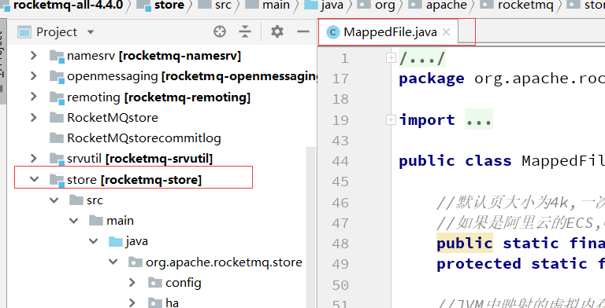

    这是rocketmq系列的第九篇文章，主要介绍的是零拷贝。

<style>
.my-code {
   color: orange;
}
.orange {
   color: rgb(255, 53, 2)
}
.red {
   color: red
}
</style>

# 一、零拷贝
什么是零拷贝？
- <code class="red">零CPU</code>拷贝，减少数据的拷贝。
<!-- more -->

# 二、零拷贝的实现方式
- mmap + write
- sendfile
- sendfile + DMA


# 三、rocketMQ中的零拷贝
RocketMQ源码中，使用MappedFile这个类类进行MMAP的映射

MappedFile源码如下：
```java
public class MappedFile extends ReferenceResource {
    //映射的内存对象（mmap）
    private MappedByteBuffer mappedByteBuffer;
    //最后一条消息保存时间
    private volatile long storeTimestamp = 0;
    private boolean firstCreateInQueue = false;

    public MappedFile() {
    }

    public MappedFile(final String fileName, final int fileSize) throws IOException {
        init(fileName, fileSize);
    }
}
```
init方法
```java
private void init(final String fileName, final int fileSize) throws IOException {
        this.fileName = fileName;
        this.fileSize = fileSize;
        this.file = new File(fileName);
        this.fileFromOffset = Long.parseLong(this.file.getName());
        boolean ok = false;

        ensureDirOK(this.file.getParent());

        try {
            this.fileChannel = new RandomAccessFile(this.file, "rw").getChannel();
            this.mappedByteBuffer = this.fileChannel.map(MapMode.READ_WRITE, 0, fileSize);
            TOTAL_MAPPED_VIRTUAL_MEMORY.addAndGet(fileSize);
            TOTAL_MAPPED_FILES.incrementAndGet();
            ok = true;
        } catch (FileNotFoundException e) {
            log.error("Failed to create file " + this.fileName, e);
            throw e;
        } catch (IOException e) {
            log.error("Failed to map file " + this.fileName, e);
            throw e;
        } finally {
            if (!ok && this.fileChannel != null) {
                this.fileChannel.close();
            }
        }
    }
```
- Java中的 MappedByteBuffer 便是对应 mmap 实现，在Java中一次只能映射1.5~2G 的文件内存。

RocketMQ 会维护一个 MappedFileQueue 队列，在每次消息的写入，会获取队列中最后一个 MappedFile，如果没有则会创建一个，并且把下一个也会创建出来。

这种策略便是 RocketMQ 预分配 MappedFile，也叫 内存预映射机制 。 它的思路很巧妙，能够在下次获取时候直接返回 MappedFile 实例而不用等待 MappedFile 创建分配所产生的时间延迟。

# Kafka中的零拷贝
Kafka两个重要过程都使用了零拷贝技术，且都是操作系统层面的狭义零拷贝，
- 一是Producer生产的数据存到broker
- 二是 Consumer从broker读取数据。

Producer生产的数据持久化到broker，采用mmap文件映射，实现顺序的快速写入；

Customer从broker读取数据，采用sendfile，将磁盘文件读到OS内核缓冲区后，直接转到socket buffer进行网络发送。


