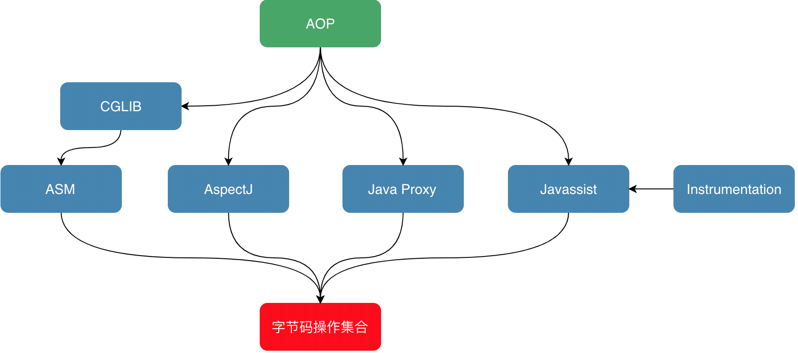

<style>
.my-code {
   color: orange;
}
.orange {
   color: rgb(255, 53, 2)
}
.red {
   color: red
}
code {
   color: #6260ff;
}
</style>

# 一、动态代理
`动态代理（Dynamic proxy）`是一种在`运行时动态生成代理类`的技术，主要用于在不修改原始类代码的前提下，增强对象的功能（如日志记录、事务管理、权限校验等）。

与静态代理不同，动态代理无需手动为每个目标类编写代理类，而是通过`反射机制`自动生成代理对象，极大提升了代码的灵活性和可维护性。

<!-- more -->

动态代理的核心特点：
1. 运行时生成
   1. 代理类在程序运行期间动态生成，而非在编译期预先定义。
2. 代码复用
   1. 可以为多个接口或类生成统一的代理逻辑，避免重复编码。
3. 解耦性
   1. 代理逻辑与业务逻辑分离，符合面向切面编程（AOP思想）。


# 二、静态代理
静态代理通常包含以下角色：
1. `抽象接口（Subject）`：定义目标对象和代理对象的公共方法
2. `目标类（real subject）`：实现接口的具体业务逻辑
3. `代理类（proxy）`：实现相同接口，持有目标对象的引用，并在调用目标方法前后添加增强逻辑。

代码示例：
```java
// 1. 定义抽象接口
public interface UserService {
    void saveUser();
}

// 2. 目标类实现接口
public class UserServiceImpl implements UserService {
    public void saveUser() {
        System.out.println("保存用户");
    }
}

// 3. 静态代理类
public class UserServiceProxy implements UserService {
    private UserService target;  // 持有目标对象

    public UserServiceProxy(UserService target) {
        this.target = target;
    }

    public void saveUser() {
        System.out.println("方法执行前记录日志");
        target.saveUser();  // 调用目标方法
        System.out.println("方法执行后记录日志");
    }
}

// 4. 使用代理类
public class Main {
    public static void main(String[] args) {
        UserService target = new UserServiceImpl();
        UserService proxy = new UserServiceProxy(target);
        proxy.saveUser();  // 输出日志并执行目标方法
    }
}
```


# 三、动态代理的实现

## 3.1、JDK动态代理（基于接口）
`适用场景`：目标类实现了某个接口.

### 3.1.1、代码示例
#### 1、定义一个接口和实现类
```java
//目标接口
interface MyInterface {
    void myMethod();
}
//目标类
class MyInterfaceImpl implements MyInterface {
    @Override
    public void myMethod() {
    System.out.println("执行 MyInterface 中的方法");
    }
}
```

#### 2、创建一个动态代理类
```java
//代理逻辑处理器
class MyInvocationHandler implements InvocationHandler {
    private Object target;//被代理对象

    public MyInvocationHandler(Object target) {
        this.target = target;
    }

    @Override
    public Object invoke(Object proxy, Method method, Object[] args) throws Throwable {
        System.out.println("代理方法执行前");
        Object result = method.invoke(target, args);
        System.out.println("代理方法执行后");
        return result;
    }
}
```

#### 3、使用动态代理
```java
public class DynamicProxyExample {
    public static void main(String[] args) {
        MyInterfaceImpl target = new MyInterfaceImpl();

        MyInterface proxy = (MyInterface) Proxy.newProxyInstance(
                target.getClass().getClassLoader(),
                new Class<?>[]{MyInterface.class},
                new MyInvocationHandler(target));

        proxy.myMethod();
    }
}

```

#### 小结
核心类：
- java.lang.reflect.Proxy：生成代理对象的工具类。
```java
//`主要方法`
static Object  newProxyInstance(
    ClassLoader loader,  //指定当前目标对象使用类加载器
    Class<?>[] interfaces,    //目标对象实现的接口的类型
    InvocationHandler h      //事件处理器
)
```
- java.lang.reflect.InvocationHandler：定义代理逻辑的接口
```java
//主要方法
Object    invoke(Object proxy, Method method, Object[] args)
// 在代理实例上处理方法调用并返回结果。
```

### 3.1.2、代理类的字节码结构
目标接口
```java
public interface UserService {
    void saveUser();
    String getUserById(int id);
}
```
生成的代理类（反编译后）
```java
public final class $Proxy0 extends Proxy implements UserService {
    // 方法对象的静态引用
    private static Method m1; // hashCode()
    private static Method m2; // equals()
    private static Method m3; // toString()
    private static Method m4; // saveUser()
    private static Method m5; // getUserById(int)

    public $Proxy0(InvocationHandler h) {
        super(h);
    }

    // 接口方法实现
    public final void saveUser() {
        try {
            // 调用 InvocationHandler.invoke()
            h.invoke(
                this, 
                m4,  // 对应 saveUser() 的 Method 对象
                null // 方法参数（无参数）
            );
        } catch (Throwable e) {
            throw new UndeclaredThrowableException(e);
        }
    }

    public final String getUserById(int id) {
        try {
            // 调用 InvocationHandler.invoke()
            return (String) h.invoke(
                this, 
                m5,  // 对应 getUserById(int) 的 Method 对象
                new Object[]{id} // 方法参数
            );
        } catch (Throwable e) {
            throw new UndeclaredThrowableException(e);
        }
    }

    // 静态初始化块：通过反射获取接口方法
    static {
        try {
            m1 = Class.forName("java.lang.Object").getMethod("hashCode");
            m2 = Class.forName("java.lang.Object").getMethod("equals", Class.forName("java.lang.Object"));
            m3 = Class.forName("java.lang.Object").getMethod("toString");
            m4 = Class.forName("com.example.UserService").getMethod("saveUser");
            m5 = Class.forName("com.example.UserService").getMethod("getUserById", int.class);
        } catch (NoSuchMethodException | ClassNotFoundException e) {
            throw new NoSuchMethodError(e.getMessage());
        }
    }
}
```

## 3.2、Cglib动态代理
通过继承的方式去代理

`限制`
- 不能代理`final`类和方法
  - 因为：`final`类修饰的类不可继承；`final`修饰的方法不可重写

### 3.2.1、代码示例

#### 1、定义一个目标类
目标类（无需实现接口）
```java
// 目标类（无需实现接口）
public class UserService {
   public void saveUser() {
      System.out.println("保存用户");
   }
}
```

#### 2、创建一个方法拦截器类
代理逻辑处理器
```java
import org.springframework.cglib.proxy.MethodInterceptor;
// 代理逻辑处理器
public class LogInterceptor implements MethodInterceptor {
   public Object intercept(Object obj, Method method, Object[] args, MethodProxy proxy) throws Throwable {
      System.out.println("方法执行前记录日志");
      Object result = proxy.invokeSuper(obj, args); // 调用父类方法
      System.out.println("方法执行后记录日志");
      return result;
   }
}
```

#### 3、使用 CGLIB 动态代理
```java
public class DynamicProxyBasedOnClassExample {
   // 使用CGLIB生成代理
   public class Main {
      public static void main(String[] args) {
         Enhancer enhancer = new Enhancer();
         enhancer.setSuperclass(UserService.class); // 设置父类
         enhancer.setCallback(new LogInterceptor());
         UserService proxy = (UserService) enhancer.create();
         proxy.saveUser(); // 输出日志并执行目标方法
      }
   }
}
```

### 3.2.2、代理类的字节码结构
最终代理对象字节码文件

目标类
```java
public class UserService {
   public void saveUser() {
      System.out.println("保存用户");
   }
}
```
生成的代理类（反编译后）
```java
public class UserService$$EnhancerByCGLIB$$12345 extends UserService implements EnhancerFactory {
    // 方法拦截器（MethodInterceptor）实例
    private MethodInterceptor interceptor;
    // 重写父类方法
    public void saveUser() {
        MethodInterceptor interceptor = this.interceptor;
        if (interceptor == null) {
            super.saveUser(); // 直接调用父类方法
            return;
        }
        // 通过拦截器执行代理逻辑
        interceptor.intercept(
            this, 
            MethodProxy.create(UserService.class, "saveUser"), 
            new Object[0], 
            super_saveUser_Proxy  // 指向父类方法的快速调用引用
        );
    }
    // 父类方法的快速调用（避免反射）
    final void super_saveUser_Proxy() {
        super.saveUser();
    }
    // 其他生成的方法（如 equals、hashCode、toString 等）
}
```

### 3.2.3、主要核心类：<code class="red">MethodInterceptor</code>
最常用的`callback`类型，允许在方法调用前后添加逻辑。它实现了`intercept`方法，该方法会在目标方法调用时被调用。
```java
//我们需要去实现MethodInterceptor接口，并实现其intercept方法
package org.springframework.cglib.proxy;
/**
* @param object 表示要进行增强的对象
* @param method 表示拦截的方法
* @param objects 数组表示参数列表，基本数据类型需要传入其包装类型，如int-->Integer、long-Long、double-->Double
* @param methodProxy 表示对方法的代理，invokeSuper方法表示对被代理对象方法的调用
* @return 执行结果
* @throws Throwable
*/
@Override
public Object intercept(Object object, Method method, Object[] objects, MethodProxy methodProxy) throws Throwable {
   before();
   Object result = methodProxy.invokeSuper(object, objects);   // 注意这里是调用 invokeSuper 而不是 invoke，否则死循环，methodProxy.invokesuper执行的是原始类的方法，method.invoke执行的是子类的方法
   after();
   return result;
}
```
- `Enhancer`：通过字节码技术动态创建委托类的子类实例
  - GCLIB使用的是ASM库
- `callback`：回调，对代理类的方法调用进行拦截和增强。

# 四、字节码技术



## 4.1、ASM库
对于需要手动<code class="red">操纵字节码</code>的需求，可以使用ASM，它可以直接生产 .class字节码文件，也可以在类被加载入JVM之前动态修改类行为（如下图17所示）。ASM的应用场景有AOP（Cglib就是基于ASM）、热部署、修改其他jar包中的类等。当然，涉及到如此底层的步骤，实现起来也比较麻烦。

### 4.1.1、ASM API
#### 4.1.1.1 核心API
`ASM Core API`可以类比解析XML文件中的SAX方式，不需要把这个类的整个结构读取进来，就可以用流式的方法来处理字节码文件。好处是非常节约内存，但是编程难度较大。然而出于性能考虑，一般情况下编程都使用Core API。在Core API中有以下几个关键类：
- `ClassReader`：用于读取已经编译好的`.class`文件。
- `ClassWriter`：用于重新构建编译后的类，如修改类名、属性以及方法，也可以生成新的类的字节码文件。
- `各种Visitor类`：如上所述，CoreAPI根据字节码从上到下依次处理，对于字节码文件中不同的区域有不同的Visitor，比如用于访问方法的MethodVisitor、用于访问类变量的FieldVisitor、用于访问注解的AnnotationVisitor等。为了实现AOP，重点要使用的是MethodVisitor。

#### 4.1.1.2 树形API
`ASM Tree API`可以类比解析XML文件中的DOM方式，把整个类的结构读取到内存中，缺点是消耗内存多，但是编程比较简单。`TreeApi`不同于`CoreAPI`，`TreeAPI`通过各种`Node`类来映射字节码的各个区域，类比`DOM`节点，就可以很好地理解这种编程方式。


### 4.1.2、直接利用ASM实现AOP
首先定义需要被增强的Base类：其中只包含一个process()方法，方法内输出一行“process”。增强后，我们期望的是，方法执行前输出“start”，之后输出”end”。
```java
public class Base {
    public void process(){
        System.out.println("process");
    }
}
```
为了利用ASM实现AOP，需要定义两个类：
- 一个是`MyClassVisitor`类，用于对字节码的`visit`以及修改；
```java
import org.objectweb.asm.ClassVisitor;
import org.objectweb.asm.MethodVisitor;
import org.objectweb.asm.Opcodes;

public class MyClassVisitor extends ClassVisitor implements Opcodes {
    public MyClassVisitor(ClassVisitor cv) {
        super(ASM5, cv);
    }
    @Override
    public void visit(int version, int access, String name, String signature,
                      String superName, String[] interfaces) {
        cv.visit(version, access, name, signature, superName, interfaces);
    }
    @Override
    public MethodVisitor visitMethod(int access, String name, String desc, String signature, String[] exceptions) {
        MethodVisitor mv = cv.visitMethod(access, name, desc, signature,
                exceptions);
        //Base类中有两个方法：无参构造以及process方法，这里不增强构造方法
        if (!name.equals("<init>") && mv != null) {
            mv = new MyMethodVisitor(mv);
        }
        return mv;
    }
    class MyMethodVisitor extends MethodVisitor implements Opcodes {
        public MyMethodVisitor(MethodVisitor mv) {
            super(Opcodes.ASM5, mv);
        }

        @Override
        public void visitCode() {
            super.visitCode();
            mv.visitFieldInsn(GETSTATIC, "java/lang/System", "out", "Ljava/io/PrintStream;");
            mv.visitLdcInsn("start");
            mv.visitMethodInsn(INVOKEVIRTUAL, "java/io/PrintStream", "println", "(Ljava/lang/String;)V", false);
        }
        @Override
        public void visitInsn(int opcode) {
            if ((opcode >= Opcodes.IRETURN && opcode <= Opcodes.RETURN)
                    || opcode == Opcodes.ATHROW) {
                //方法在返回之前，打印"end"
                mv.visitFieldInsn(GETSTATIC, "java/lang/System", "out", "Ljava/io/PrintStream;");
                mv.visitLdcInsn("end");
                mv.visitMethodInsn(INVOKEVIRTUAL, "java/io/PrintStream", "println", "(Ljava/lang/String;)V", false);
            }
            mv.visitInsn(opcode);
        }
    }
}
```
- 另一个是`Generator`类，在这个类中定义`ClassReader`和`ClassWriter`，其中的逻辑是，`classReader`读取字节码，然后交给`MyClassVisitor`类处理，处理完成后由`ClassWriter`写字节码并将旧的字节码替换掉。`Generator`类较简单，我们先看一下它的实现，如下所示，然后重点解释`MyClassVisitor`类。
```java
import org.objectweb.asm.ClassReader;
import org.objectweb.asm.ClassVisitor;
import org.objectweb.asm.ClassWriter;

public class Generator {
    public static void main(String[] args) throws Exception {
		//读取
        ClassReader classReader = new ClassReader("meituan/bytecode/asm/Base");
        ClassWriter classWriter = new ClassWriter(ClassWriter.COMPUTE_MAXS);
        //处理
        ClassVisitor classVisitor = new MyClassVisitor(classWriter);
        classReader.accept(classVisitor, ClassReader.SKIP_DEBUG);
        byte[] data = classWriter.toByteArray();
        //输出
        File f = new File("operation-server/target/classes/meituan/bytecode/asm/Base.class");
        FileOutputStream fout = new FileOutputStream(f);
        fout.write(data);
        fout.close();
        System.out.println("now generator cc success!!!!!");
    }
}
```

## 4.2、Javassist库
`ASM`是在`指令层次`上操作字节码的，阅读上文后，我们的直观感受是在指令层次上操作字节码的框架实现起来比较晦涩。故除此之外，我们再简单介绍另外一类框架：`强调源代码层次`操作字节码的框架`Javassist`。

先看一个demo
```java
import com.meituan.mtrace.agent.javassist.*;

public class JavassistTest {
    public static void main(String[] args) throws NotFoundException, CannotCompileException, IllegalAccessException, InstantiationException, IOException {
        ClassPool cp = ClassPool.getDefault();
        CtClass cc = cp.get("meituan.bytecode.javassist.Base");
        CtMethod m = cc.getDeclaredMethod("process");
        m.insertBefore("{ System.out.println(\"start\"); }");
        m.insertAfter("{ System.out.println(\"end\"); }");
        Class c = cc.toClass();
        cc.writeFile("/Users/zen/projects");
        Base h = (Base)c.newInstance();
        h.process();
    }
}
```
利用`Javassist`实现字节码增强时，可以无须关注字节码刻板的结构，其优点就在于编程简单。直接使用java编码的形式，而不需要了解虚拟机指令，就能动态改变类的结构或者动态生成类。其中最重要的是`ClassPool、CtClass、CtMethod、CtField`这四个类：
- `CtClass（compile-time class）`：编译时类信息，它是一个class文件在代码中的抽象表现形式，可以通过一个类的全限定名来获取一个`CtClass`对象，用来表示这个类文件。
- `ClassPool`：从开发视角来看，`ClassPool`是一张保存`CtClass`信息的`HashTable`，key为类名，value为类名对应的`CtClass`对象。当我们需要对某个类进行修改时，就是通过`pool.getCtClass(“className”)`方法从`pool`中获取到相应的`CtClass`。
- `CtMethod、CtField`：这两个比较好理解，对应的是类中的方法和属性。


参考文章：
https://tech.meituan.com/2019/09/05/java-bytecode-enhancement.html