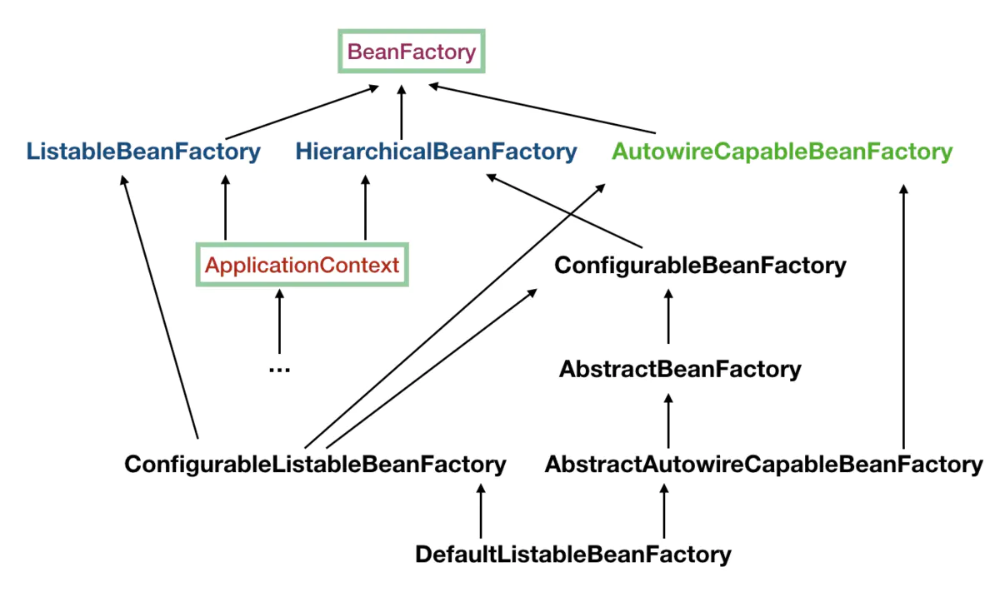

    这是spring系列的第一篇文章，主要介绍的是容器。

<style>
.my-code {
   color: orange;
}
.orange {
   color: rgb(255, 53, 2)
}
.red {
   color: red
}
code {
   color: #6260ff;
}
</style>

# 一、Spring
`spring框架`是Java生态中最主流的轻量级开源应用框架，其核心目标是简化企业级应用开发，通过`IOC（控制反转）`和`AOP（面向切面编程）`两大核心机制实现解耦、模块化和可维护性。

<!-- more -->

# 二、Spring 容器

## 2.1、BeanFactory（基础容器）
<code class="red">BeanFactory</code> 是 `Spring` 底层 `IoC 容器`的实现，完成了 `IoC 容器`的基本功能。
```java
public interface BeanFactory {
    String FACTORY_BEAN_PREFIX = "&";
    Object getBean(String name) throws BeansException;
    <T> T getBean(String name, Class<T> requiredType) throws BeansException;
    Object getBean(String name, Object... args) throws BeansException;
    <T> T getBean(Class<T> requiredType) throws BeansException;
    boolean containsBean(String name);
    boolean isSingleton(String name) throws NoSuchBeanDefinitionException;
    //....
}
```

### 2.1.1、`ListableBeanFactory`：
- 设计目标，扩展BeanFactory的功能，提供批量查询、按类型/注解 筛选Bean的能力，支持对容器中Bean的遍历和统计。
```java
public interface ListableBeanFactory extends BeanFactory {
    boolean containsBeanDefinition(String beanName);
    int getBeanDefinitionCount();
    String[] getBeanDefinitionNames();
    <T> ObjectProvider<T> getBeanProvider(Class<T> requiredType, boolean allowEagerInit);
    <T> ObjectProvider<T> getBeanProvider(ResolvableType requiredType, boolean allowEagerInit);
    String[] getBeanNamesForType(ResolvableType type);
    String[] getBeanNamesForType(ResolvableType type, boolean includeNonSingletons, boolean allowEagerInit);
    String[] getBeanNamesForType(@Nullable Class<?> type);
    String[] getBeanNamesForType(@Nullable Class<?> type, boolean includeNonSingletons, boolean allowEagerInit);
    <T> Map<String, T> getBeansOfType(@Nullable Class<T> type) throws BeansException;
    <T> Map<String, T> getBeansOfType(@Nullable Class<T> type, boolean includeNonSingletons, boolean allowEagerInit)
            throws BeansException;
}
```
主要功能包括：
- 按类型或注解筛选Bean
- 统计和获取Bean的元数据（名称、数量）
- 支持动态操作和容器状态检查

### 2.1.2、`AutowireCapableBeanFactory`：
继承BeanFactory，是spring容器中<code class="red">自动装配（Autowiring）</code>的核心接口。
- 设计目标：提供自动装配Bean属性的能力，支持在spring容器之外或自定义Bean初始化时进行依赖注入
```java
public interface AutowireCapableBeanFactory extends BeanFactory {
    //创建并自动装配Bean
    <T> T createBean(Class<T> beanClass) throws BeansException;
    //对已有Bean进行自动装配
    void autowireBean(Object existingBean) throws BeansException;
}
```


### 2.1.3、`AbstractAutowireCapableBeanFactory`：
- 设计目标：集中管理Bean的<code class="red">实例化、属性注入、后处理器应用、生命周期回调</code>等关键流程，是spring容器中Bean创建和管理的“心脏”。
```java
public abstract class AbstractAutowireCapableBeanFactory extends AbstractBeanFactory
		implements AutowireCapableBeanFactory {
    @Override
    @SuppressWarnings("unchecked")
    public <T> T createBean(Class<T> beanClass) throws BeansException {
        // Use prototype bean definition, to avoid registering bean as dependent bean.
        RootBeanDefinition bd = new RootBeanDefinition(beanClass);
        bd.setScope(SCOPE_PROTOTYPE);
        bd.allowCaching = ClassUtils.isCacheSafe(beanClass, getBeanClassLoader());
        return (T) createBean(beanClass.getName(), bd, null);
    }

    protected Object doCreateBean(String beanName, RootBeanDefinition mbd, Object[] args) {
        // 1. 实例化 Bean
        Object beanInstance = createBeanInstance(beanName, mbd, args);

        // 2. 属性填充（注入依赖）
        populateBean(beanName, mbd, beanInstance);

        // 3. 初始化 Bean（调用 Aware 方法、后处理器、初始化方法）
        Object exposedObject = initializeBean(beanName, beanInstance, mbd);

        // 4. 处理代理（单例模式下）
        registerSingleton(beanName, exposedObject); // 单例注册

        return exposedObject;
    }
    
    
    //属性注入
    protected void populateBean(String beanName, RootBeanDefinition mbd, @Nullable BeanWrapper bw) {
        //忽略上文
        PropertyValues pvs = (mbd.hasPropertyValues() ? mbd.getPropertyValues() : null);

        int resolvedAutowireMode = mbd.getResolvedAutowireMode();
        if (resolvedAutowireMode == AUTOWIRE_BY_NAME || resolvedAutowireMode == AUTOWIRE_BY_TYPE) {
            MutablePropertyValues newPvs = new MutablePropertyValues(pvs);
            // Add property values based on autowire by name if applicable.
            if (resolvedAutowireMode == AUTOWIRE_BY_NAME) {
                autowireByName(beanName, mbd, bw, newPvs);
            }
            // Add property values based on autowire by type if applicable.
            if (resolvedAutowireMode == AUTOWIRE_BY_TYPE) {
                autowireByType(beanName, mbd, bw, newPvs);
            }
            pvs = newPvs;
        }
        //忽略下文
    }
}
```

### 2.1.4、`DefaultListableBeanFactory`
是spring中BeanFactory的默认实现类。

继承关系
```
DefaultListableBeanFactory
│
└── AbstractAutowireCapableBeanFactory (实现 AutowireCapableBeanFactory)
    │
    └── AbstractBeanFactory (实现 BeanFactory、HierarchicalBeanFactory)
        │
        └── FactoryBeanRegistrySupport (处理 FactoryBean)
            │
            └── DefaultSingletonBeanRegistry (实现 SingletonBeanRegistry)
```

实现的接口：
- `ConfigurableListableBeanFactory`：整合配置、列表和自动装配功能。
- `BeanDefinitionRegistry`：管理Bean定义的注册表
- `ListableBeanFactory`：根据类型或注解枚举Bean。
- `HierarchicalBeanFactory`：支持父容器的继承关系。


## 2.2、ApplicationContext（高级容器）
在实际的应用场景中，`BeanFactory` 容器有点简单，它并不适用于生产环境，我们通常会选择 `ApplicationContext`。`ApplicationContext` 就是大名鼎鼎的 `Spring 应用上下文`，它不仅继承了 `BeanFactory` 体系，还提供更加高级的功能，更加适用于我们的正式应用环境
```java
public interface ApplicationContext extends EnvironmentCapable, ListableBeanFactory, HierarchicalBeanFactory,
    MessageSource, ApplicationEventPublisher, ResourcePatternResolver {
    @Nullable
    String getId();
    String getApplicationName();
    String getDisplayName();
    long getStartupDate();
    @Nullable
    ApplicationContext getParent();
    AutowireCapableBeanFactory getAutowireCapableBeanFactory() throws IllegalStateException;
}
```


常见的容器：
- org.springframework.context.support.`AbstractApplicationContext`，Spring 应用上下文的抽象类，实现了大部分功能，提供骨架方法交由子类去实现
- org.springframework.web.context.`ConfigurableWebApplicationContext`，可配置的 Spring 应用上下文接口，支持 Web 应用
- org.springframework.context.support.`AbstractRefreshableConfigApplicationContext`，支持设置 XML 文件
- org.springframework.web.context.support.`AbstractRefreshableWebApplicationContext`，支持 Web 应用
- org.springframework.web.context.support.`AnnotationConfigWebApplicationContext`，支持 Web 应用，可以设置 XML 文件，并可以扫描注解下面的 Bean
- org.springframework.context.annotation.`AnnotationConfigApplicationContext`，支持扫描注解下面的 Bean
- org.springframework.web.context.support.`ClassPathXmlApplicationContext`，支持设置 XML 文件，也可以从 classpath 下面扫描相关资源

### 2.2.1、`AbstractApplicationContext`
是spring容器的核心抽象类，负责<code class="red">应用上下文的初始化、Bean的生命周期管理、事件广播、资源加载</code>等功能
```
AbstractApplicationContext
│
└── DefaultResourceLoader (实现 ResourceLoader 接口)
    │
    └── AbstractRefreshableConfigApplicationContext (实现 ConfigurableApplicationContext)
        │
        └── AbstractApplicationContext (实现 ApplicationContext 接口)
```
```java
public abstract class AbstractApplicationContext extends DefaultResourceLoader
		implements ConfigurableApplicationContext {

    public AbstractApplicationContext() {
        this.resourcePatternResolver = getResourcePatternResolver();
    }
    
    //是spring容器启动的核心方法，负责初始化整个应用上下文
    public void refresh() throws BeansException, IllegalStateException {
        synchronized (this.startupShutdownMonitor) {
            StartupStep contextRefresh = this.applicationStartup.start("spring.context.refresh");
//            1. 准备刷新
//            2. 创建BeanFactory：由子类实现（如ClassPathXmlApplicationContext
//            3. 初始化BeanFactory：配置BeanFactory 的基础属性（如类加载器、作用域）
//            4. 处理BeanFactory后置处理器：如PropertyPlaceholderConfigurer
//            5. 注册 BeanPostProcessor：如 AutowiredAnnotationBeanPostProcessor
//            6. 初始化消息源：支持国际化（MessageSource）
//            7. 初始化事件广播器：ApplicationEventMulticaster
//            8. 注册监听器：如 ApplicationListener
//            9. 实例化剩余单例Bean：完成依赖注入和初始化
//            10. 发布容器刷新事件：ContextRefreshedEvent
        }
    }
}
```

#### 资源加载
通过 `DefaultResourceLoader`实现：支持多种资源协议（如 classpath:, file:, http:）
- `getResource(String location)`：解析资源路径并返回 Resource 对象。
- 协议扩展：通过 `ProtocolResolver` 接口支持自定义协议。

### 2.2.1、`ClassPathXmlApplicationContext`
是`spring`中<code class="red">基于XML配置文件</code>的容器实现类，用于从类路径（`classpath`）加载XML配置文件，并`初始化spring容器`。
```java
public class ClassPathXmlApplicationContext extends AbstractXmlApplicationContext {

    @Nullable
    private Resource[] configResources;

    public ClassPathXmlApplicationContext(
            String[] configLocations, boolean refresh, @Nullable ApplicationContext parent)
            throws BeansException {

        super(parent);
        setConfigLocations(configLocations);
        if (refresh) {
            //调用AbstractApplicationContext的refresh()方法，初始化上下文
            refresh();
        }
    }
}
```

#### 2.2.1.1、使用示例
```java
package com.example;

import org.springframework.context.ApplicationContext;
import org.springframework.context.support.ClassPathXmlApplicationContext;

public class Main {
    public static void main(String[] args) {
        // 1. 加载 XML 配置文件并创建容器
        try (ApplicationContext context = 
                new ClassPathXmlApplicationContext("beans.xml")) {
//          // 加载多个 XML 文件
//          ApplicationContext context =
//                  new ClassPathXmlApplicationContext(new String[]{"beans1.xml", "beans2.xml"});
            // 2. 获取 Bean 实例
            MyService myService = (MyService) context.getBean("myService");
            
            // 3. 调用方法
            myService.serve(); // 输出 "Service is running..."
        }
    }
}
```

#### 2.2.1.2、资源加载机制
- `DefaultResourceLoader`：支持通过 `getResource` 方法加载单个资源（如**classpath:applicationContext.xml**）
```java
public abstract class ResourceUtils {

    /** Pseudo URL prefix for loading from the class path: "classpath:". */
    public static final String CLASSPATH_URL_PREFIX = "classpath:";
}
```
- `PathMatchingResourcePatternResolver`：由`AbstractApplicationContext`构造时创建，支持 Ant风格的路径匹配（如classpath*:*.xml)
  - 作用：解析多个xml文件（如classpath:config/*.xml)
  - 冲突处理：后加载的Bean定义会覆盖同名的前一个定义
    ```java
    public AbstractApplicationContext() {
        this.resourcePatternResolver = getResourcePatternResolver();
    }
    
    protected ResourcePatternResolver getResourcePatternResolver() {
        return new PathMatchingResourcePatternResolver(this);
    }
    ```


### 2.2.2、`AnnotationConfigApplicationContext`
是spring中<code class="red">基于注解配置</code>的容器实现类，继承自 `GenericApplicationContext`，用于通过 Java配置类（非XML）管理Bean的定义和生命周期。
```
AnnotationConfigApplicationContext
│
└── GenericApplicationContext (实现灵活的 Bean 注册)
    │
    └── AbstractApplicationContext (核心容器逻辑)
        │
        └── DefaultResourceLoader (资源加载)
```
主要功能
- 通过 `@Configuration` 和 `@Bean` 注解定义Bean。
- 支持 `组件扫描（@ComponentScan）` 自动注册Bean。
- 管理Bean的实例化、依赖注入、事件广播等


#### 2.2.2.1、使用示例

##### 1. 配置类（使用@Configuration & @Bean)
```java
package com.example;

import org.springframework.context.annotation.Bean;
import org.springframework.context.annotation.Configuration;
import org.springframework.context.annotation.ComponentScan;

@Configuration // 标记为配置类
@ComponentScan(basePackages = "com.example") // 自动扫描包下的 @Component 等注解
public class AppConfig {

    // 通过 @Bean 手动定义一个 Bean
    @Bean
    public AnotherService anotherService() {
        return new AnotherService();
    }
}

class AnotherService {
    public String getMessage() {
        return "Hello from AnotherService!";
    }
}
```
##### 2. 启动类
```java
package com.example;

import org.springframework.context.ApplicationContext;
import org.springframework.context.annotation.AnnotationConfigApplicationContext;

public class Application {
    public static void main(String[] args) {
        // 1. 创建容器并加载配置类（自动调用 refresh() 初始化容器）
        try (ApplicationContext context = 
                new AnnotationConfigApplicationContext(AppConfig.class)) {
            
            // 2. 获取通过 @Component 注解声明的 Bean
            MyService myService = context.getBean(MyService.class);
            System.out.println("UUID: " + myService.getUUID());

            // 3. 获取通过 @Bean 方法定义的 Bean
            AnotherService anotherService = context.getBean(AnotherService.class);
            System.out.println("Message: " + anotherService.getMessage());
        }
    }
}
```


#### 2.2.2.2、关键组件与机制
##### (1). `AnnotatedBeanDefinitionReader`

###### 1. 作用
用于编程式注册带有注解的Bean，例如@Configuration、@Component等注解的类。它允许开发者显示**注册Bean定义**（读取配置类中的 `@Bean` 注解，并将其转换成 `BeanDefinition`），而无需依赖XML配置或组件扫描。

生成<code class="red">BeanDefinition</code>

###### 2. 初始化过程
在构造 `AnnotationConfigApplicationContext`时， 会初始化 `AnnotatedBeanDefinitionReader`，并自动调用 `registerAnnotationProcessors()`注册核心处理器（如 `ConfigurationClassPostProcessor`）。

构造函数如下：
```java
public AnnotationConfigApplicationContext() {
    StartupStep createAnnotatedBeanDefReader = this.getApplicationStartup().start("spring.context.annotated-bean-reader.create");
    this.reader = new AnnotatedBeanDefinitionReader(this);
    createAnnotatedBeanDefReader.end();
    this.scanner = new ClassPathBeanDefinitionScanner(this);
}

public AnnotationConfigApplicationContext(DefaultListableBeanFactory beanFactory) {
    super(beanFactory);
    this.reader = new AnnotatedBeanDefinitionReader(this);
    this.scanner = new ClassPathBeanDefinitionScanner(this);
}

public AnnotationConfigApplicationContext(Class<?>... componentClasses) {
    this();
    register(componentClasses);
    refresh();
}
```

##### (2). `ClassPathBeanDefinitionReader`

###### 1. 作用
扫描指定包路径下的类，注册带有 `@component` 系列注解的Bean。

###### 2. 关键方法
- `scan(String... basePackages)`：启动扫描流程
- `doScan()`：遍历包路径，过滤符合条件的类（如`@Service、@Repository`）。

##### (3). `ConfigurationClassPostProcessor`

###### 1. 作用
处理`@Configuration`类中的主键，例如 `@Bean`、`@ComponentScan`、`@Import`等，将这些注解转换为实际的Bean定义并注册到Spring容器中。它是Spring解析Java配置的核心组件。

###### 2. 关键功能
- 解析`@Configuration`类中的`@Bean`方法，生成对应的Bean定义。
- 处理`@ComponenScan`注解，触发组件扫描
- 处理`@Import`注解，导入其他配置类或Bean定义
- 处理`@propertySource`，加载属性文件。


