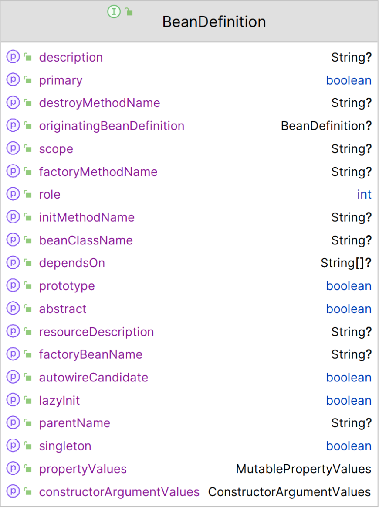

    这是spring系列的第二篇文章，主要介绍的是容器启动中的第2个步骤，加载Bean定义。

<style>
.my-code {
   color: orange;
}
.orange {
   color: rgb(255, 53, 2)
}
.red {
   color: red
}
code {
   color: #6260ff;
}
</style>

# 一、Spring
`spring框架`是Java生态中最主流的轻量级开源应用框架，其核心目标是简化企业级应用开发，通过`IOC（控制反转）`和`AOP（面向切面编程）`两大核心机制实现解耦、模块化和可维护性。

<!-- more -->

# 二、Spring 容器启动
以`ClassPathXmlApplicationContext`作为模板进行解析。

## 2.1、创建容器
```java
ApplicationContext context = new ClassPathXmlApplicationContext("classpath:applicationfile.xml");
```

在构造函数中会调用`refresh()`方法，进行容器的创建及一系列操作。
```
public ClassPathXmlApplicationContext(String[] configLocations, boolean refresh, ApplicationContext parent) throws BeansException {
    super(parent);
    // 解析xml配置文件列表
    setConfigLocations(configLocations);
    if (refresh) {
        //核心方法
        refresh();
    }
}
```

## 2.2、refresh()方法
`AbstractApplicationContext`类中的核心方法，负责初始化`Spring`容器（完成Spring容器的完整生命周期启动，包括环境准备、Bean定义加载、Bean实例化、依赖注入等）。
```
public void refresh() throws BeansException, IllegalStateException {
    synchronized (this.startupShutdownMonitor) {
        // 准备工作，记录下容器的启动时间、标记已启动状态、处理配置文件中的占位符
        prepareRefresh();
        
        /** 这步完成后，配置文件就会解析成一个个BeanDefinition，注册到BeanFactory 中，
          * 当然，这里说的 Bean 还没有初始化，只是配置信息都提取出来了，
          * 注册也只是将这些信息都保存到了注册中心(说到底核心是一个beanName->beanDefinition的map)
        */
        ConfigurableListableBeanFactory beanFactory = obtainFreshBeanFactory();
        
        // 设置BeanFactory的类加载器，添加几个 BeanPostProcessor，手动注册几个特殊的 bean
        prepareBeanFactory(beanFactory);
        try {
            /**【这里需要知道BeanFactoryPostProcessor这个知识点，Bean如果实现了此接口，
              * 那么在容器初始化以后，Spring会负责调用里面的postProcessBeanFactory 方法。】
              * 这里是提供给子类的扩展点，到这里的时候，所有的Bean都加载、注册完成了，但是都还没有初始化
              * 具体的子类可以在这步的时候添加一些特殊的 BeanFactoryPostProcessor 的实现类或做点什么事
            */
            postProcessBeanFactory(beanFactory);

            // 调用BeanFactoryPostProcessor各个实现类的 postProcessBeanFactory(factory) 方法
            invokeBeanFactoryPostProcessors(beanFactory);

            /** 注册 BeanPostProcessor 的实现类，注意看和 BeanFactoryPostProcessor 的区别
              * 此接口两个方法: postProcessBeforeInitialization 和 postProcessAfterInitialization
              * 两个方法分别在 Bean 初始化之前和初始化之后得到执行。注意，到这里 Bean 还没初始化
            */
            registerBeanPostProcessors(beanFactory);

            // Initialize message source for this context.
            initMessageSource();

            // 初始化当前 ApplicationContext 的事件广播器
            initApplicationEventMulticaster();

            /** 从方法名就可以知道，典型的模板方法(钩子方法)，
              * 具体的子类可以在这里初始化一些特殊的 Bean（在初始化 singleton beans 之前）
            */
            onRefresh();

            // 注册事件监听器，监听器需要实现 ApplicationListener 接口
            registerListeners();

            // 重点，重点，重点
            // 初始化所有的  singleton beans
            //（lazy-init 的除外）
            /** <bean id="testBean" class="cn.itcast.test.TestBean" />
              * 该bean默认的设置为:
              * <bean id="testBean" calss="cn.itcast.test.TestBean" lazy-init="false" />
              * lazy-init="false"
              * 立即加载，表示在spring启动时，立刻进行实例化。
            */
            finishBeanFactoryInitialization(beanFactory);

            // 最后，广播事件，ApplicationContext 初始化完成
            finishRefresh();
        }

        catch (BeansException ex) {
            logger.warn("Exception encountered during context initialization - cancelling refresh attempt", ex);

            // 销毁已经初始化的 singleton 的 Beans，以免有些 bean 会一直占用资源
            destroyBeans();

            // Reset 'active' flag.
            cancelRefresh(ex);

            // 把异常往外抛
            throw ex;
        }
    }
}
```
接下来解析`12`个步骤。


# 三、步骤1：准备环境
1. `prepareRefresh()`方法
**作用**：初始化容器运行时的环境和基础配置。
```java
protected void prepareRefresh() {
    // 设置容器启动时间
    this.startupDate = System.currentTimeMillis();
    // Initialize any placeholder property sources in the context environment.
    initPropertySources();

    // Validate that all properties marked as required are resolvable:
    // see ConfigurablePropertyResolver#setRequiredProperties
    getEnvironment().validateRequiredProperties();
    ...
}
```

# 四、步骤2：准备 BeanFactory
`作用`：获取或<code class="red">创建 BeanFactory</code> 并<code class="red">加载 Bean 定义</code>（默认是 `DefaultListableBeanFactory`）

执行`obtainFreshBeanFactory()`方法。

```java
ConfigurableListableBeanFactory beanFactory = obtainFreshBeanFactory();
```
`obtainFreshBeanFactory()`方法内部逻辑
```java
protected ConfigurableListableBeanFactory obtainFreshBeanFactory() {
		refreshBeanFactory();
		return getBeanFactory();
	}
```
执行`AbstractRefreshableApplicationContext.refreshBeanFactory()`方法
- 如果容器已经存在 `BeanFactory`，先销毁旧的，再创建新的BeanFactory
- 调用 <code class="red">loadBeanDefinitions()</code> 加载 `Bean 定义`（如XML、Java配置或组件扫描）
```java
protected final void refreshBeanFactory() throws BeansException {
		if (hasBeanFactory()) {
			destroyBeans();
			closeBeanFactory();
		}
		try {
			DefaultListableBeanFactory beanFactory = createBeanFactory();
			beanFactory.setSerializationId(getId());
			customizeBeanFactory(beanFactory);
			loadBeanDefinitions(beanFactory);
			this.beanFactory = beanFactory;
		}
		catch (IOException ex) {
			throw new ApplicationContextException("I/O error parsing bean definition source for " + getDisplayName(), ex);
		}
	}
```

## 4.1、创建 BeanFactory
```java
protected DefaultListableBeanFactory createBeanFactory() {
    return new DefaultListableBeanFactory(getInternalParentBeanFactory());
}
```
默认是 `DefaultListableBeanFactory`

## 4.2、加载 Bean 定义
`ClassPathXmlApplicationContext`继承了`AbstractXmlApplicationContext`。执行`AbstractXmlApplicationContext`的`loadBeanDefinitions()`方法
```java
public abstract class AbstractXmlApplicationContext extends AbstractRefreshableConfigApplicationContext {
    protected void loadBeanDefinitions(DefaultListableBeanFactory beanFactory) throws BeansException, IOException {
        // 创建一个 xml bean 定义阅读器
        XmlBeanDefinitionReader beanDefinitionReader = new XmlBeanDefinitionReader(beanFactory);
        // 设置 bean 定义阅读器的运行环境
        beanDefinitionReader.setEnvironment(this.getEnvironment());
        beanDefinitionReader.setResourceLoader(this);
        beanDefinitionReader.setEntityResolver(new ResourceEntityResolver(this));
        // 初始化 bean 定义阅读器，子类可以重写该方法进行自定义
        initBeanDefinitionReader(beanDefinitionReader);
        // 开始load xml文件，这一步开始才是真正读取XML文件了
        loadBeanDefinitions(beanDefinitionReader);
    }
}
```

### 4.2.1、流程1：创建 XmlBeanDefinitionReader
在创建`XmlBeanDefinitionReader`时，会把 `4.1 章节`创建的`BeanFactory`传入。
```java
XmlBeanDefinitionReader beanDefinitionReader = new XmlBeanDefinitionReader(beanFactory);

public XmlBeanDefinitionReader(BeanDefinitionRegistry registry) {
    super(registry);
}

protected AbstractBeanDefinitionReader(BeanDefinitionRegistry registry) {
    this.registry = registry;

    // Determine ResourceLoader to use.
    if (this.registry instanceof ResourceLoader) {
        this.resourceLoader = (ResourceLoader) this.registry;
    }
    else {
        this.resourceLoader = new PathMatchingResourcePatternResolver();
    }
}
```
- 构造入参是`beanFactory`：是`DefaultListableBeanFactory`类型，实现了`BeanDefinitionRegistry`接口
- 设置`resourceLoader`：因为`DefaultListableBeanFactory`不是`ResourceLoader`类型
  - 创建`PathMatchingResourcePatternResolver`

### 4.2.2、流程2：加载 bean 定义资源
`loadBeanDefinitions(beanDefinitionReader);`执行逻辑如下
```java
protected void loadBeanDefinitions(XmlBeanDefinitionReader reader) throws BeansException, IOException {
    //获取配置文件资源对象
    Resource[] configResources = getConfigResources();
    if (configResources != null) {
        reader.loadBeanDefinitions(configResources);
    }
    String[] configLocations = getConfigLocations();
    if (configLocations != null) {
        reader.loadBeanDefinitions(configLocations);
    }
}
```

#### 4.2.2.1、获取配置文件
- configResources：此时为null，进入configLocations逻辑
- configLocations：
    - 为`new ClassPathXmlApplicationContext("classpath:applicationfile.xml");`的入参

#### 4.2.2.2、执行`reader`的`loadBeanDefinitions()`方法
`reader`=`XmlBeanDefinitionReader`，实际调用的是`AbstractBeanDefinitionReader`的`loadBeanDefinitions`方法
```java
public abstract class AbstractBeanDefinitionReader implements BeanDefinitionReader, EnvironmentCapable {
    public int loadBeanDefinitions(String location, @Nullable Set<Resource> actualResources) throws BeanDefinitionStoreException {
        ResourceLoader resourceLoader = getResourceLoader();
        if (resourceLoader == null) {
            throw new BeanDefinitionStoreException(
                    "Cannot load bean definitions from location [" + location + "]: no ResourceLoader available");
        }
        ....省略部分代码
        // 将String字符串解析成Resource对象
        Resource resource = resourceLoader.getResource(location);
        int count = loadBeanDefinitions(resource);
        if (actualResources != null) {
            actualResources.add(resource);
        }
        if (logger.isTraceEnabled()) {
            logger.trace("Loaded " + count + " bean definitions from location [" + location + "]");
        }
        return count;
    }
}
```

##### 4.2.2.2.1、获取ResourceLoader
ResourceLoader 接口用于统一加载资源（文件、配置、静态资源等），支持多种资源类型（类路径、文件系统、URL等）。
> 所有Spring应用上下文（如`ApplicationContext、ClassPathXmlApplicationContext`）都实现了 `ResourceLoader`。

在创建`XmlBeanDefinitionReader`的章节中，在创建过程，会为 reader 设置了`resourceLoader`
- 创建`PathMatchingResourcePatternResolver`并设置

##### 4.2.2.2.2、将location转换成 Resource
```java
// 将String字符串解析成Resource对象
Resource resource = resourceLoader.getResource(location);
```

##### 4.2.2.2.2、loadBeanDefinitions（加载bean定义）
继续执行 xmlBeanDefinitionReader的loadBeanDefinitions方法

#### 4.2.2.3、具体加载bean定义（关键代码片段）

##### 1. 封装资源并获取输入流
```java
public int loadBeanDefinitions(EncodedResource encodedResource) throws BeanDefinitionStoreException {
    //....忽略部分代码
    //封装资源并获取输入流
    try (InputStream inputStream = encodedResource.getResource().getInputStream()) {
        InputSource inputSource = new InputSource(inputStream);
        if (encodedResource.getEncoding() != null) {
            inputSource.setEncoding(encodedResource.getEncoding());
        }
        return doLoadBeanDefinitions(inputSource, encodedResource.getResource());
    }
    //....忽略部分代码
}
```
##### 2. 解析XML文档
```java
protected int doLoadBeanDefinitions(InputSource inputSource, Resource resource)
        throws BeanDefinitionStoreException {
    try {
        Document doc = doLoadDocument(inputSource, resource);
        int count = registerBeanDefinitions(doc, resource);
        if (logger.isDebugEnabled()) {
            logger.debug("Loaded " + count + " bean definitions from " + resource);
        }
        return count;
    }
}
```

##### 3. 解析Document并注册BeanDefinition
```java
public int registerBeanDefinitions(Document doc, Resource resource) throws BeanDefinitionStoreException {
    //创建BeanDefinitionDocumentReader实例（默认为 DefaultBeanDefinitionDocumentReader）
    BeanDefinitionDocumentReader documentReader = createBeanDefinitionDocumentReader();
    //解析 Document中的Bean定义
    int countBefore = getRegistry().getBeanDefinitionCount();
    documentReader.registerBeanDefinitions(doc, createReaderContext(resource));
    return getRegistry().getBeanDefinitionCount() - countBefore;
}
```

###### DefaultBeanDefinitionDocumentReader的核心逻辑
`registerBeanDefinitions()`解析下的XML标签，通过`BeanDefinitionParserDelegate`代理来进行。具体工作在`parseBeanDefinitions()`中。这里是比较关键的地方。
```java
public void registerBeanDefinitions(Document doc, XmlReaderContext readerContext) {
  this.readerContext = readerContext;
  logger.debug("Loading bean definitions");
  // root为<beans />标签
  Element root = doc.getDocumentElement();
  doRegisterBeanDefinitions(root);
}

// 采用代理进行解析，代理为BeanDefinitionParserDelegate
protected void doRegisterBeanDefinitions(Element root) {
  // 创建代理
  BeanDefinitionParserDelegate parent = this.delegate;
  this.delegate = createDelegate(getReaderContext(), root, parent);
  if (this.delegate.isDefaultNamespace(root)) {
    String profileSpec = root.getAttribute(PROFILE_ATTRIBUTE);
    if (StringUtils.hasText(profileSpec)) {
      String[] specifiedProfiles = StringUtils.tokenizeToStringArray(
              profileSpec, BeanDefinitionParserDelegate.MULTI_VALUE_ATTRIBUTE_DELIMITERS);
      if (!getReaderContext().getEnvironment().acceptsProfiles(specifiedProfiles)) {
        return;
      }
    }
  }
  // 解析前的处理，DefaultBeanDefinitionDocumentReader没有实现它，子类可以实现，来扩展功能
  preProcessXml(root);
  // 解析root内的XML标签，如<import> <alias> <bean>等
  parseBeanDefinitions(root, this.delegate);
  // 解析后的处理，同样没有实现它，子类可以实现。
  postProcessXml(root);
  this.delegate = parent;
}
```
> <code class="red">**BeanDefinitionParserDelegate**</code>
> - 负责解析和处理XML配置中的各种元素（如<bean>, <alias>, <import>等），并将这些配置转换为Spring容器内部的核心数据结构`BeanDefinition`.

```java
protected void parseBeanDefinitions(Element root, BeanDefinitionParserDelegate delegate) {
   if (delegate.isDefaultNamespace(root)) {
      // 获取<beans>的子节点
      NodeList nl = root.getChildNodes();
      // 遍历子节点
      for (int i = 0; i < nl.getLength(); i++) {
         Node node = nl.item(i);
         if (node instanceof Element) {
            // 子节点是Element对象，默认的子节点，如<import>都是Element对象
            Element ele = (Element) node;
            if (delegate.isDefaultNamespace(ele)) {
               // 在默认的命名空间url中的元素，是默认定义好的节点，采用parseDefaultElement方法解析
               parseDefaultElement(ele, delegate);
            }
            else {
               // 用户自定义的命名空间url中的元素，采用parseCustomElement方法解析
               delegate.parseCustomElement(ele);
            }
         }
      }
   }
   else {
      // 子节点不是标准的Element元素，比如用户自定义的，采用parseCustomElement方法解析
      delegate.parseCustomElement(root);
   }
}
```
> defaultNameSpace：默认的命名空间，BEANS_NAMESPACE_URI = "http://www.springframework.org/schema/beans"
> 
> 像 <aop:> <context>这种非默认命名空间，则使用的是自定义命名空间。具体查看第5章节。

```java
public static final String IMPORT_ELEMENT = "import";
public static final String ALIAS_ATTRIBUTE = "alias";
public static final String BEAN_ELEMENT = "bean";
public static final String NESTED_BEANS_ELEMENT = "beans";
private void parseDefaultElement(Element ele, BeanDefinitionParserDelegate delegate) {
  // 解析<import>
  if (delegate.nodeNameEquals(ele, IMPORT_ELEMENT)) {
    importBeanDefinitionResource(ele);
  }
  // 解析<alias>
  else if (delegate.nodeNameEquals(ele, ALIAS_ELEMENT)) {
    processAliasRegistration(ele);
  }
  // 解析<bean>
  else if (delegate.nodeNameEquals(ele, BEAN_ELEMENT)) {
    processBeanDefinition(ele, delegate);
  }
  // 解析<beans>
  else if (delegate.nodeNameEquals(ele, NESTED_BEANS_ELEMENT)) {
    // recurse
    doRegisterBeanDefinitions(ele);
  }
}
```

```java
protected void processBeanDefinition(Element ele, BeanDefinitionParserDelegate delegate) {
    BeanDefinitionHolder bdHolder = delegate.parseBeanDefinitionElement(ele);
    if (bdHolder != null) {
        bdHolder = delegate.decorateBeanDefinitionIfRequired(ele, bdHolder);
        try {
            // Register the final decorated instance.
            BeanDefinitionReaderUtils.registerBeanDefinition(bdHolder, getReaderContext().getRegistry());
        }
        catch (BeanDefinitionStoreException ex) {
            getReaderContext().error("Failed to register bean definition with name '" +
                    bdHolder.getBeanName() + "'", ele, ex);
        }
        // Send registration event.
        getReaderContext().fireComponentRegistered(new BeanComponentDefinition(bdHolder));
    }
}
```
> <code class="red">**BeanDefinitionHolder**</code>
> 
> 是Spring容器中管理 BeanDefinition的封装类，
> - 关联BeanDefinition和名称：将 BeanDefinition对象与Bean的名称绑定，方面后续操作
> - 携带别名信息
> 
> 更多信息，查看后续章节


###### processBeanDefinition方法
- 解析`<bean>`元素，创建 `BeanDefinition` 对象
- 使用 `BeanDefinitionParserDelegate` 处理具体属性（如 `id, class, scope`等）
- 将`BeanDefinition`注册到`BeanDefinitionRegistry`（如DefaultListableBeanFactory实现了BeanDefinitionRegistry接口）

###### processAliasRegistration方法
- 解析`<alias>`标签的name和alias属性
- 将别名注册到Spring容器的Bean定义注册表（BeanDefinitionRegistry）中。
- 通知监听器别名的注册事件。

###### processImport方法
- 解析`<import>`标签

## 4.3、BeanDefinition【Bean定义】

### 4.3.1、BeanDefinition包含属性

- `id, class名称，property属性, init-method, 别名, 是否懒加载`
- `beanClass`：表示 Bean 类型，未加载类的时候存放 Bean 的名字，加载类后存放 Bean 的 class 信息。
- `scope`：表示 Bean 的作用域，一般值为单例或者原型。
  - `singleton` 需要应用三级缓存，保证全局唯一
  - `prototype` 每次直接创建全新bean
- `lazyInit`：表示 Bean 是否是懒加载。
- `initMethodName`：Bean 初始化需要执行的方法。
- `destroyMethodName`：Bean 销毁时要执行的方法。
- `factoryBeanName`：创建当前 Bean 的工厂。


### 4.3.2、BeanDefinition存储在哪里？
在`DefaultListableBeanFactory`容器内部有一个Map，存储BeanDefinition.
```java
public class DefaultListableBeanFactory extends AbstractAutowireCapableBeanFactory
        implements ConfigurableListableBeanFactory, BeanDefinitionRegistry, Serializable {
    //以Map的形式存储
    private final Map<String, BeanDefinition> beanDefinitionMap = new ConcurrentHashMap<>(256);
}
```

#### 4.3.2.1、写入时机
在之前的文章中，我们了解了`DefaultBeanDefinitionDocumentReader`的核心逻辑，其内部会调用`BeanDefinitionReaderUtils`工具类进行注册。
```java
public abstract class BeanDefinitionReaderUtils {
    public static void registerBeanDefinition(
            BeanDefinitionHolder definitionHolder, BeanDefinitionRegistry registry)
            throws BeanDefinitionStoreException {

        // Register bean definition under primary name.
        String beanName = definitionHolder.getBeanName();
        registry.registerBeanDefinition(beanName, definitionHolder.getBeanDefinition());

        // Register aliases for bean name, if any.
        String[] aliases = definitionHolder.getAliases();
        if (aliases != null) {
            for (String alias : aliases) {
                registry.registerAlias(beanName, alias);
            }
        }
    }
}
```
- `registry`，即`DefaultListableBeanFactory`容器。最后会`this.beanDefinitionMap.put(beanName, beanDefinition)`


## 4.4、BeanDefinitionHolder
BeanDefinitionHolder 是管理 BeanDefinition的封装类，其核心作用包括：
- **关联BeanDefinition和名称**：将 BeanDefinition对象与Bean的名称绑定，方面后续操作
- **携带别名信息**：存储Bean的别名列表（name属性中除 id 外的其他名称）
- **记录来源信息**：记录Bean定义的原始资源（如XML文件路径或类路径资源）。

BeanDefinitionHolder 的关键属性如下：

|属性	|描述|
|--|--|
|beanName	Bean |的唯一标识名称（id 或第一个 name）。|
|beanDefinition	|包含 Bean 元数据的 BeanDefinition 对象。|
|aliases	|Bean 的别名列表（name 属性中除 id 外的其他名称）。|
|source	|Bean 定义的原始资源（如 XML 文件路径或类路径资源）。|


### 4.4.1、与BeanDefinition的关系
- 继承关系：BeanDefinitionHolder 不继承 BeanDefinition，但持有其引用。
- 功能互补：BeanDefinition 存储元数据（如类名、作用域），而 BeanDefinitionHolder 管理名称和别名。


### 4.4.2、为什么需要BeanDefinitionHolder？
- **解耦元数据和名称**：BeanDefinition 本身不包含名称信息，通过 BeanDefinitionHolder 可以统一管理名称和元数据。
- **支持别名**：便于通过名称或别名查找Bean。
- **记录来源**：便于调试时追溯Bean的定义来源（如XML文件路径）。


# 五、示例
如下为xml 配置文件示例
```xml
<beans xmlns="http://www.springframework.org/schema/beans" xmlns:xsi="http://www.w3.org/2001/XMLSchema-instance"
       xmlns:aop="http://www.springframework.org/schema/aop" xmlns:tx="http://www.springframework.org/schema/tx"
       xmlns:context="http://www.springframework.org/schema/context"
       xmlns:task="http://www.springframework.org/schema/task"
       xsi:schemaLocation="http://www.springframework.org/schema/beans http://www.springframework.org/schema/beans/spring-beans.xsd
        http://www.springframework.org/schema/tx http://www.springframework.org/schema/tx/spring-tx.xsd
		http://www.springframework.org/schema/aop http://www.springframework.org/schema/aop/spring-aop.xsd
		http://www.springframework.org/schema/context http://www.springframework.org/schema/context/spring-context.xsd
		http://www.springframework.org/schema/task http://www.springframework.org/schema/task/spring-task.xsd">

    <!--将系统依赖外部的服务加载（放在uum应用扫描包之前加载，防止在uum加载实体时找不到类）-->
    <import resource="spring-dsf.xml"/>
  
    <!--AOP基于类代理-->
    <aop:aspectj-autoproxy proxy-target-class="true" />
    
    <context:component-scan base-package="com.alibaba"/>

    <alias name="originalBeanName" alias="newAliasName"/>
  
    <!-- 配置数据源 -->
    <bean id="dataSource" class="com.alibaba.druid.pool.DruidDataSource">
        <property name="url" value="jdbc:mysql://localhost:3306/mydb" />
        <property name="username" value="username" />
        <property name="password" value="password" />
        <property name="driverClassName" value="com.mysql.jdbc.Driver"/>
    </bean>
    <!-- 配置 SqlSessionFactory -->
    <bean id="sqlSessionFactory" class="org.mybatis.spring.SqlSessionFactoryBean">
        <property name="configLocation" value="classpath:/mybatis/mybatis-config.xml"/>
        <property name="dataSource" ref="dataSource"/>
        <property name="mapperLocations" value="classpath:/mybatis/com.alibaba/*.xml"/>
    </bean>
    <!-- 扫描 Mapper 接口 -->
    <bean class="org.mybatis.spring.mapper.MapperScannerConfigurer">
        <property name="basePackage" value="com.aliaba.mapper"/>
    </bean>
    <!-- 配置事务管理器 -->
    <bean id="transactionManager" class="org.springframework.jdbc.datasource.DataSourceTransactionManager">
        <property name="dataSource" ref="dataSource"/>
    </bean>
    <!-- 启用基于注解的事务管理 -->
    <tx:annotation-driven transaction-manager="transactionManager"/>
</beans>
```


## 5.1、命名空间

### 5.1.1、从 xmlns 的作用讲起
一个 xml 文档中如果包含如下两种定义不同， 但是名称相同的元素， xml 解析器是无法解析的， 因为它不能确定当你调用 `document.getElementsByTagName("book")` 时应该返回哪个元素。
```
<!-- 这里的 table 元素描述的是一个表格-->
<table>
   <tr>
   <td>Apples</td>
   <td>Bananas</td>
   </tr>
</table>
<!-- 这里的 table 元素描述的是一个家居桌子-->
<table>
   <name>African Coffee Table</name>
   <width>80</width>
   <length>120</length>
</table>
```
显然， 如果给他们的名字添加一个前缀， 则命名冲突的问题就可以解决。
```
<!-- 这里的 table 元素描述的是一个表格-->
<h:table>  <!--添加了前缀 h -->
   <h:tr>
   <h:td>Apples</h:td>
   <h:td>Bananas</h:td>
   </h:tr>
</h:table>
<!-- 这里的 table 元素描述的是一个表格-->
<f:table> <!--添加了前缀 f -->
   <f:name>African Coffee Table</f:name>
   <f:width>80</f:width>
   <f:length>120</f:length>
</f:table>
```
但是， 在一个拥有众多元素的文档中， 仅仅拥有前缀， 也不能完全避免命名冲突的问题。

此时， <code class="red">命名空间</code>就诞生了， 我们可以为元素定义一个命名空间， 将一个很长的， 可以保证**全局唯一性的字符串**与该元素关联起来。这样就可以避免命名冲突了。

但是如何保证那个较长的字符串全局唯一呢， 最好的方式莫过于使用 `统一资源标识符（Uniform Resource Identifier，URI) `了， 而我们最常见的 URI 就是平时经常访问的网址 URL 了。

应用到我们所举的例子中就是:
```
<!-- 这里的 table 元素描述的是一个表格-->
<h:table xmlns:h="http://www.w3.org/TR/html4/">
   <h:tr>
   <h:td>Apples</h:td>
   <h:td>Bananas</h:td>
   </h:tr>
</h:table>
<!-- 这里的 table 元素描述的是一个表格-->
<f:table xmlns:f="http://www.w3school.com.cn/furniture">
   <f:name>African Coffee Table</f:name>
   <f:width>80</f:width>
   <f:length>120</f:length>
</f:table>
```

### 5.1.2、xmlns:xsi 与 xsi:schemaLocation

`xmlns:xsi`：定义了一个命名空间前缀 xsi 对应的唯一字符串 http://www.w3.org/2001/XMLSchema-instance
- 这个 xmlns:xsi 在不同的 xml 文档中似乎都会出现。 这是因为， xsi 已经成为了一个业界默认的用于 XSD(（XML Schema Definition) 文件的命名空间

`xsi:schemaLocation`：而 XSD 文件（也常常称为 Schema 文件）是用来定义 xml 文档结构的
```
xsi:schemaLocation="http://www.springframework.org/schema/tx http://www.springframework.org/schema/tx/spring-tx.xsd"
```
规定了`<tx:xxx>`标签的写法。

## 5.2、XML文件解析原理
之前的文章我们讲过，当获取到XML文件时，会读取成`InputStream`后解析成`Document`，然后解析`Document`对象
```java
public class DefaultBeanDefinitionDocumentReader implements BeanDefinitionDocumentReader {
    protected void parseBeanDefinitions(Element root, BeanDefinitionParserDelegate delegate) {
        if (delegate.isDefaultNamespace(root)) {
            NodeList nl = root.getChildNodes();
            for (int i = 0; i < nl.getLength(); i++) {
                Node node = nl.item(i);
                if (node instanceof Element) {
                    Element ele = (Element) node;
                    if (delegate.isDefaultNamespace(ele)) {
                        parseDefaultElement(ele, delegate);
                    } else {
                        delegate.parseCustomElement(ele);
                    }
                }
            }
        } else {
            delegate.parseCustomElement(root);
        }
    }
}
```
如上图，for循环遍历节点。

### 5.2.1、默认命名空间 
例如遍历到`<bean> <import> <alias>`，这些节点是默认命名空间，则进入`parseDefaultElement`
```
xmlns="http://www.springframework.org/schema/beans"
```

```java
private void parseDefaultElement(Element ele, BeanDefinitionParserDelegate delegate) {
    if (delegate.nodeNameEquals(ele, IMPORT_ELEMENT)) {
        importBeanDefinitionResource(ele);
    }
    else if (delegate.nodeNameEquals(ele, ALIAS_ELEMENT)) {
        processAliasRegistration(ele);
    }
    else if (delegate.nodeNameEquals(ele, BEAN_ELEMENT)) {
        processBeanDefinition(ele, delegate);
    }
    else if (delegate.nodeNameEquals(ele, NESTED_BEANS_ELEMENT)) {
        // recurse
        doRegisterBeanDefinitions(ele);
    }
}
```


### 5.2.2、其他命名空间
例如遍历到`<context:component-scan base-package="com.xxx"/>`，进入到`parseCustomElement`
```java
public BeanDefinition parseCustomElement(Element ele, BeanDefinition containingBd) {
    String namespaceUri = getNamespaceURI(ele);
    //重点代码
    NamespaceHandler handler = this.readerContext.getNamespaceHandlerResolver().resolve(namespaceUri);
    if (handler == null) {
        error("Unable to locate Spring NamespaceHandler for XML schema namespace [" + namespaceUri + "]", ele);
        return null;
    }
    return handler.parse(ele, new ParserContext(this.readerContext, this, containingBd));
}
```

`resolve()`方法实现：
```java
// DefaultNamespaceHandlerResolver.java
public NamespaceHandler resolve(String namespaceUri) {
    // 1. 获取命名空间 URI 到处理器类的映射关系
    Map<String, Object> handlerMappings = getHandlerMappings();
    Object handlerOrClassName = handlerMappings.get(namespaceUri);

    if (handlerOrClassName == null) {
        return null; // 未找到对应的处理器
    }

    // 2. 如果已缓存处理器实例，直接返回
    if (handlerOrClassName instanceof NamespaceHandler) {
        return (NamespaceHandler) handlerOrClassName;
    }

    // 3. 通过反射创建处理器实例
    String className = (String) handlerOrClassName;
    try {
        Class<?> handlerClass = ClassUtils.forName(className, this.classLoader);
        NamespaceHandler namespaceHandler = (NamespaceHandler) BeanUtils.instantiateClass(handlerClass);
        namespaceHandler.init(); // 初始化处理器（注册 BeanDefinitionParser）
        handlerMappings.put(namespaceUri, namespaceHandler); // 缓存处理器实例
        return namespaceHandler;
    } catch (ClassNotFoundException ex) {
        throw new FatalBeanException("NamespaceHandler 类未找到: " + className, ex);
    }
}
```
关键步骤说明：

#### 步骤1、加载spring.handlers文件
`getHandlerMappings()`会从类路径下的`META-INF/spring.handlers`文件中加载命名空间URI到处理器的映射关系。例如：
```java
http\://www.springframework.org/schema/context=org.springframework.context.config.ContextNamespaceHandler
```

#### 步骤2、缓存机制
首次解析时，通过反射创建 `NamespaceHandler` 实例并缓存，后续直接复用。

#### 步骤3、处理器初始化
调用`namespaceHandler.init()`，让处理器注册其支持的标签解析器（`BeanDefinitionParser`）。例如
```java
// ContextNamespaceHandler.java
public void init() {
    registerBeanDefinitionParser("component-scan", new ComponentScanBeanDefinitionParser());
    registerBeanDefinitionParser("property-placeholder", new PropertyPlaceholderBeanDefinitionParser());
}
```


#### 步骤4、开始解析
```java
public class ComponentScanBeanDefinitionParser implements BeanDefinitionParser {
    public BeanDefinition parse(Element element, ParserContext parserContext) {
        String basePackage = element.getAttribute(BASE_PACKAGE_ATTRIBUTE);
        basePackage = parserContext.getReaderContext().getEnvironment().resolvePlaceholders(basePackage);
        String[] basePackages = StringUtils.tokenizeToStringArray(basePackage,
                ConfigurableApplicationContext.CONFIG_LOCATION_DELIMITERS);

        // Actually scan for bean definitions and register them.
        ClassPathBeanDefinitionScanner scanner = configureScanner(parserContext, element);
        Set<BeanDefinitionHolder> beanDefinitions = scanner.doScan(basePackages);
        registerComponents(parserContext.getReaderContext(), beanDefinitions, element);

        return null;
    }
}
```


参考文章：
https://zhuanlan.zhihu.com/p/194033386
