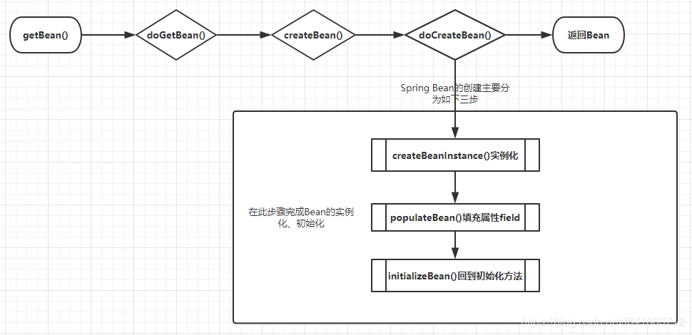

    这是spring系列的第五篇文章，主要介绍的是容器启动中的第11个步骤，创建Bean。

<style>
.my-code {
   color: orange;
}
.orange {
   color: rgb(255, 53, 2)
}
.red {
   color: red
}
code {
   color: #6260ff;
}
</style>

# 一、Spring
`spring框架`是Java生态中最主流的轻量级开源应用框架，其核心目标是简化企业级应用开发，通过`IOC（控制反转）`和`AOP（面向切面编程）`两大核心机制实现解耦、模块化和可维护性。

<!-- more -->

# 二、步骤11：finishBeanFactoryInitialization(beanFactory)
初始化所有的单例Bean、ioc、BeanPostProcessor的执行、Aop入口

```java
protected void finishBeanFactoryInitialization(ConfigurableListableBeanFactory beanFactory) {
    // 省略部分代码
    // Initialize LoadTimeWeaverAware beans early to allow for registering their transformers early.
    String[] weaverAwareNames = beanFactory.getBeanNamesForType(LoadTimeWeaverAware.class, false, false);
    for (String weaverAwareName : weaverAwareNames) {
        getBean(weaverAwareName);
    }

    // Stop using the temporary ClassLoader for type matching.
    beanFactory.setTempClassLoader(null);

    // Allow for caching all bean definition metadata, not expecting further changes.
    beanFactory.freezeConfiguration();
    // 这一步会遍历所有Bean定义，对应非抽象、非延迟加载的单例Bean，会调用CreateBean方法进行实例化。
    beanFactory.preInstantiateSingletons();
}
```

## 2.1、遍历所有Bean定义
调用`DefaultListableBeanFactory.preInstantiateSingletons`，遍历所有Bean定义，进行Bean的实例化 & 初始化
```java
public void preInstantiateSingletons() throws BeansException {
    List<String> beanNames = new ArrayList<>(this.beanDefinitionNames);

    // Trigger initialization of all non-lazy singleton beans...
    for (String beanName : beanNames) {
        RootBeanDefinition bd = getMergedLocalBeanDefinition(beanName);
        if (!bd.isAbstract() && bd.isSingleton() && !bd.isLazyInit()) {
            if (isFactoryBean(beanName)) {
                //处理FactoryBean
                Object bean = getBean(FACTORY_BEAN_PREFIX + beanName);
                if (bean instanceof FactoryBean) {
                    FactoryBean<?> factory = (FactoryBean<?>) bean;
                    boolean isEagerInit;
                    if (System.getSecurityManager() != null && factory instanceof SmartFactoryBean) {
                        isEagerInit = AccessController.doPrivileged(
                                (PrivilegedAction<Boolean>) ((SmartFactoryBean<?>) factory)::isEagerInit,
                                getAccessControlContext());
                    }
                    else {
                        isEagerInit = (factory instanceof SmartFactoryBean &&
                                ((SmartFactoryBean<?>) factory).isEagerInit());
                    }
                    if (isEagerInit) {
                        getBean(beanName);
                    }
                }
            }
            else {
                //普通Bean
                getBean(beanName);
            }
        }
    }
}
```

## 2.2、创建Bean
首先需要了解是Spring它创建Bean的流程，大致调用栈绘图如下：



### 2.2.1、doGetBean
<code class="red">涉及三级缓存：getSingleton(beanName)，会将Bean添加到二级缓存。</code>
```java
protected <T> T doGetBean(
			String name, @Nullable Class<T> requiredType, @Nullable Object[] args, boolean typeCheckOnly)
			throws BeansException {
    String beanName = transformedBeanName(name);
    Object beanInstance;

    // 第一步：重点方法：涉及到三级缓存，解决循环依赖问题
    // 循环依赖的情况，例如A-> B, B->A，在B.doGetBean()时，会将三级缓存添加到二级缓存
    Object sharedInstance = getSingleton(beanName);
    if (sharedInstance != null && args == null) {
        beanInstance = getObjectForBeanInstance(sharedInstance, name, beanName, null);
    }
    else {
        //三级缓存内没有，
        //第二步：聚焦createBean
        // Create bean instance.
        if (mbd.isSingleton()) {
            sharedInstance = getSingleton(beanName, () -> {
                try {
                    return createBean(beanName, mbd, args);
                }
                catch (BeansException ex) {
                    destroySingleton(beanName);
                    throw ex;
                }
            });
            beanInstance = getObjectForBeanInstance(sharedInstance, name, beanName, mbd);
        }
    }
    return adaptBeanInstance(name, beanInstance, requiredType);
}

```

#### 2.2.1.1、getSingleton(beanName)【获取单例Bean】
从三级缓存中快速判断对象是否已经存在。

注：`AbstractBeanFactory`继承自`DefaultSingletonBeanRegistry`~
- `singletonObjects`：用于存放完全初始化好的 bean，从该缓存中取出的 bean 可以直接使用
- `earlySingletonObjects`：提前曝光的单例对象的cache，存放原始的 bean 对象（尚未填充属性），用于解决循环依赖
- `singletonFactories`：单例对象工厂的cache，存放 bean 工厂对象，用于解决循环依赖
```java
//获取单例Bean
public Object getSingleton(String beanName) {
  return getSingleton(beanName, true);
}

protected Object getSingleton(String beanName, boolean allowEarlyReference) {
    // Quick check for existing instance without full singleton lock
    Object singletonObject = this.singletonObjects.get(beanName);
    if (singletonObject == null && isSingletonCurrentlyInCreation(beanName)) {
        singletonObject = this.earlySingletonObjects.get(beanName);
        if (singletonObject == null && allowEarlyReference) {
            synchronized (this.singletonObjects) {
                // Consistent creation of early reference within full singleton lock
                singletonObject = this.singletonObjects.get(beanName);
                if (singletonObject == null) {
                    singletonObject = this.earlySingletonObjects.get(beanName);
                    if (singletonObject == null) {
                        ObjectFactory<?> singletonFactory = this.singletonFactories.get(beanName);
                        if (singletonFactory != null) {
                            singletonObject = singletonFactory.getObject();
                            this.earlySingletonObjects.put(beanName, singletonObject);
                            this.singletonFactories.remove(beanName);
                        }
                    }
                }
            }
        }
    }
    return singletonObject;
}
...
public boolean isSingletonCurrentlyInCreation(String beanName) {
    return this.singletonsCurrentlyInCreation.contains(beanName);
}
protected boolean isActuallyInCreation(String beanName) {
    return isSingletonCurrentlyInCreation(beanName);
}

private final Set<String> singletonsCurrentlyInCreation =
        Collections.newSetFromMap(new ConcurrentHashMap<>(16));
...
```

1. 先从`一级缓存singletonObjects`中去获取。（如果获取到就直接return）
2. 如果获取不到或者对象正在创建中（`isSingletonCurrentlyInCreation()`），那就再从`二级缓存earlySingletonObjects`中获取。（如果获取到就直接return）
3. 如果还是获取不到，且允许singletonFactories（allowEarlyReference=true）通过`getObject()`获取。就从`三级缓存singletonFactory.getObject()`获取。（如果获取到了就从`singletonFactories`中移除，并且放进`earlySingletonObjects`。其实也就是从三级缓存移动（是剪切、不是复制哦~）到了二级缓存）


#### 2.2.1.2、getSingleton(String beanName, ObjectFactory<?> singletonFactory)
当缓存中不存在实例时，则进入如下代码
- 入参：
    - `beanName`：要获取的Bean的名称
    - `()->{...}`：一个`ObjectFactory`类型的函数式接口，用于在需要时创建bean
```java
sharedInstance = getSingleton(beanName, () -> {
      try {
          return createBean(beanName, mbd, args);
      } catch (BeansException ex) {
          destroySingleton(beanName);
          throw ex;
      }
});
```

进入`getSingleton(String beanName, ObjectFactory<?> singletonFactory)`方法，一级方法
- <code class="red">涉及三级缓存：将Bean添加到一级缓存</code>
```java
public Object getSingleton(String beanName, ObjectFactory<?> singletonFactory) {
    Assert.notNull(beanName, "Bean name must not be null");
    synchronized (this.singletonObjects) {
        Object singletonObject = this.singletonObjects.get(beanName);
        if (singletonObject == null) {
            beforeSingletonCreation(beanName);
            boolean newSingleton = false;
            try {
                //重点方法：执行传入的lambda表达式的createBean方法
                singletonObject = singletonFactory.getObject();
                newSingleton = true;
            }
            finally {
                afterSingletonCreation(beanName);
            }
            if (newSingleton) {
                //这一步，会添加到一级缓存中
                addSingleton(beanName, singletonObject);
            }
        }
        return singletonObject;
    }
}
```

> `ObjectFactory`：对象工厂
> 是spring框架中的一个函数式接口，用于定义一个工厂方法类创建指定类型的对象
> @FunctionalInterface：表示这是一个函数式接口，意味着它可以用lambda表达式来实现。
> 
> ```java
> @FunctionalInterface
> public interface ObjectFactory<T> {
    T getObject() throws BeansException;
}
> ```
> 其中{}中的代码相当于写在匿名内部类中getObject()的代码片段，等着getSingleton方法里面通过ObjectFactory<?> singletonFactory去显示调用，如singletonFactory.getObject()。上述代码可以反推成如下代码：
> ```java
> sharedInstance = getSingleton(beanName, new ObjectFactory<Object>() {
    @Override
    public Object getObject() {
        try {
            return createBean(beanName, mbd, args);
        } catch (BeansException ex) {
            destroySingleton(beanName);
            throw ex;
        }
    }
});
> ```


### 2.2.2、createBean

```java
protected Object createBean(String beanName, RootBeanDefinition mbd, @Nullable Object[] args)
			throws BeanCreationException {
      RootBeanDefinition mbdToUse = mbd;
....
      try {
          // 给BeanPostProcessor一个机会返回一个代理对象（如AOP代理），从而绕过spring的默认实例化和初始化流程。
          Object bean = resolveBeforeInstantiation(beanName, mbdToUse);
          if (bean != null) {
              return bean;
          }
      }
      try {
          Object beanInstance = doCreateBean(beanName, mbdToUse, args);
          return beanInstance;
      }
.....
  }
```

#### 2.2.2.1、resolveBeforeInstantiation
是Bean实例化阶段的关键方法，其核心作用是 在Bean实例化之前，给BeanPostProcessor一个机会返回一个代理对象（如AOP代理），从而绕过spring的默认实例化和初始化流程。
```java
protected Object resolveBeforeInstantiation(String beanName, RootBeanDefinition mbd) {
    Object bean = null;
    if (!Boolean.FALSE.equals(mbd.beforeInstantiationResolved)) {
        // Make sure bean class is actually resolved at this point.
        if (!mbd.isSynthetic() && hasInstantiationAwareBeanPostProcessors()) {
            Class<?> targetType = determineTargetType(beanName, mbd);
            if (targetType != null) {
                bean = applyBeanPostProcessorsBeforeInstantiation(targetType, beanName);
                if (bean != null) {
                    bean = applyBeanPostProcessorsAfterInitialization(bean, beanName);
                }
            }
        }
        mbd.beforeInstantiationResolved = (bean != null);
    }
    return bean;
}
```
遍历所有`BeanPostProcessor`，筛选出 `InstantiationAwareBeanPostProcessor` 类型的bean后置处理器

##### 1. 核心实现类：AnnotationAwareAspectJAutoProxyCreator
继承自`AbstractAutoProxyCreator`，而`AbstractAutoProxyCreator`实现了`InstantiationAwareBeanPostProcessor`，关键方法：`postProcessBeforeInstantiation`
```java
public Object postProcessBeforeInstantiation(Class<?> beanClass, String beanName) {
    Object cacheKey = getCacheKey(beanClass, beanName);
  ....
    TargetSource targetSource = getCustomTargetSource(beanClass, beanName);
    if (targetSource != null) {
        if (StringUtils.hasLength(beanName)) {
            this.targetSourcedBeans.add(beanName);
        }
        Object[] specificInterceptors = getAdvicesAndAdvisorsForBean(beanClass, beanName, targetSource);
        Object proxy = createProxy(beanClass, beanName, specificInterceptors, targetSource);
        this.proxyTypes.put(cacheKey, proxy.getClass());
        return proxy;
    }
    return null;
}
```
作用：
- 如果bean需要AOP代理（如被`@Aspect`切面增强），则生成代理对象并返回，跳过后续实例化。

### 2.2.2、doCreateBean

```java
protected Object doCreateBean(String beanName, RootBeanDefinition mbd, @Nullable Object[] args)
			throws BeanCreationException {

    // BeanWrapper是对Bean的包装，其接口中所定义的功能很简单包括设置获取被包装的对象，获取被包装bean的属性描述器
    BeanWrapper instanceWrapper = null;
    // 单例模型，则从未完成的 FactoryBean 缓存中删除
    if (mbd.isSingleton()) {
        instanceWrapper = this.factoryBeanInstanceCache.remove(beanName);
    }
  // 使用合适的实例化策略来创建新的实例：工厂方法、构造函数自动注入、简单初始化
    if (instanceWrapper == null) {
        //实例化
        instanceWrapper = createBeanInstance(beanName, mbd, args);
    }
    // 包装的实例对象
    final Object bean = instanceWrapper.getWrappedInstance();
    // 包装的实例对象的类型
    Class<?> beanType = instanceWrapper.getWrappedClass();
    if (beanType != NullBean.class) {
      mbd.resolvedTargetType = beanType;
    }

  // 检测是否有后置处理
  // 如果有后置处理，则允许后置处理修改 BeanDefinition
    synchronized (mbd.postProcessingLock) {
        if (!mbd.postProcessed) {
            try {
              // applyMergedBeanDefinitionPostProcessors
              // 后置处理修改 BeanDefinition
                applyMergedBeanDefinitionPostProcessors(mbd, beanType, beanName);
            }
            mbd.postProcessed = true;
        }
    }

  // 解决单例模式的循环依赖
  // 单例模式 & 允许循环依赖&当前单例 bean 是否正在被创建
    boolean earlySingletonExposure = (mbd.isSingleton() && this.allowCircularReferences &&
            isSingletonCurrentlyInCreation(beanName));
    if (earlySingletonExposure) {
      // 提前将创建的 bean 实例加入到ObjectFactory 中
      // 这里是为了后期避免循环依赖
        addSingletonFactory(beanName, () -> getEarlyBeanReference(beanName, mbd, bean));
    }

    // Initialize the bean instance.
    Object exposedObject = bean;
    try {
        //属性注入
        populateBean(beanName, mbd, instanceWrapper);
        //初始化
        exposedObject = initializeBean(beanName, exposedObject, mbd);
    }
   //.循环依赖处理
    if (earlySingletonExposure) {
        Object earlySingletonReference = getSingleton(beanName, false);
        if (earlySingletonReference != null) {
            if (exposedObject == bean) {
                exposedObject = earlySingletonReference;
            }
            else if (!this.allowRawInjectionDespiteWrapping && hasDependentBean(beanName)) {
                String[] dependentBeans = getDependentBeans(beanName);
                Set<String> actualDependentBeans = new LinkedHashSet<>(dependentBeans.length);
                for (String dependentBean : dependentBeans) {
                    if (!removeSingletonIfCreatedForTypeCheckOnly(dependentBean)) {
                        actualDependentBeans.add(dependentBean);
                    }
                }
            }
        }
    }
  // 注册 bean
    registerDisposableBeanIfNecessary(beanName, bean, mbd);

    return exposedObject;
}
```
大概流程如下：
- createBeanInstance() 实例化 bean
- populateBean() 属性填充
- 循环依赖的处理
- initializeBean() 初始化 bean


> 如上流程内容篇幅较多，在下一篇文章中继续详细说明。


参考文章：
[如何利用"三级缓存"巧妙解决Bean的循环依赖问题的](https://cloud.tencent.com/developer/article/1497692)
