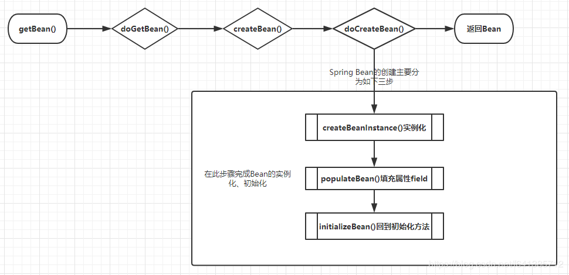

    这是spring系列的第六篇文章，主要介绍的是容器启动中的第11个步骤，创建bean的三大流程其中的实例化Bean。

<style>
.my-code {
   color: orange;
}
.orange {
   color: rgb(255, 53, 2)
}
.red {
   color: red
}
code {
   color: #6260ff;
}
</style>

# 一、Spring
`spring框架`是Java生态中最主流的轻量级开源应用框架，其核心目标是简化企业级应用开发，通过`IOC（控制反转）`和`AOP（面向切面编程）`两大核心机制实现解耦、模块化和可维护性。

<!-- more -->


# 二、doCreateBean
继续回顾一下Bean的创建流程：

首先需要了解是Spring它创建Bean的流程，大致调用栈绘图如下：


```java
protected Object doCreateBean(String beanName, RootBeanDefinition mbd, @Nullable Object[] args)
			throws BeanCreationException {

    // BeanWrapper是对Bean的包装，其接口中所定义的功能很简单包括设置获取被包装的对象，获取被包装bean的属性描述器
    BeanWrapper instanceWrapper = null;
    // 单例模型，则从未完成的 FactoryBean 缓存中删除
    if (mbd.isSingleton()) {
        instanceWrapper = this.factoryBeanInstanceCache.remove(beanName);
    }
  // 使用合适的实例化策略来创建新的实例：工厂方法、构造函数自动注入、简单初始化
    if (instanceWrapper == null) {
        //实例化
        instanceWrapper = createBeanInstance(beanName, mbd, args);
    }
    // 包装的实例对象
    final Object bean = instanceWrapper.getWrappedInstance();
    // 包装的实例对象的类型
    Class<?> beanType = instanceWrapper.getWrappedClass();
    if (beanType != NullBean.class) {
      mbd.resolvedTargetType = beanType;
    }

  // 检测是否有后置处理
  // 如果有后置处理，则允许后置处理修改 BeanDefinition
    synchronized (mbd.postProcessingLock) {
        if (!mbd.postProcessed) {
            try {
              // applyMergedBeanDefinitionPostProcessors
              // 后置处理修改 BeanDefinition
                applyMergedBeanDefinitionPostProcessors(mbd, beanType, beanName);
            }
            mbd.postProcessed = true;
        }
    }

  // 解决单例模式的循环依赖
  // 单例模式 & 允许循环依赖&当前单例 bean 是否正在被创建
    boolean earlySingletonExposure = (mbd.isSingleton() && this.allowCircularReferences &&
            isSingletonCurrentlyInCreation(beanName));
    if (earlySingletonExposure) {
      // 提前将创建的 bean 实例加入到ObjectFactory 中
      // 这里是为了后期避免循环依赖
        addSingletonFactory(beanName, () -> getEarlyBeanReference(beanName, mbd, bean));
    }

    // Initialize the bean instance.
    Object exposedObject = bean;
    try {
        //属性注入
        populateBean(beanName, mbd, instanceWrapper);
        //初始化
        exposedObject = initializeBean(beanName, exposedObject, mbd);
    }
   //.循环依赖处理
    if (earlySingletonExposure) {
        Object earlySingletonReference = getSingleton(beanName, false);
        if (earlySingletonReference != null) {
            if (exposedObject == bean) {
                exposedObject = earlySingletonReference;
            }
            else if (!this.allowRawInjectionDespiteWrapping && hasDependentBean(beanName)) {
                String[] dependentBeans = getDependentBeans(beanName);
                Set<String> actualDependentBeans = new LinkedHashSet<>(dependentBeans.length);
                for (String dependentBean : dependentBeans) {
                    if (!removeSingletonIfCreatedForTypeCheckOnly(dependentBean)) {
                        actualDependentBeans.add(dependentBean);
                    }
                }
            }
        }
    }
  // 注册 bean
    registerDisposableBeanIfNecessary(beanName, bean, mbd);

    return exposedObject;
}
```
大概流程如下：
- createBeanInstance() 实例化 bean
- populateBean() 属性填充
- 循环依赖的处理
- initializeBean() 初始化 bean


# 三、流程1：createBeanInstance() 实例化 bean

```java
protected BeanWrapper createBeanInstance(String beanName, RootBeanDefinition mbd, @Nullable Object[] args) {
    // 解析 bean，将 bean 类名解析为 class 引用
    Class<?> beanClass = resolveBeanClass(mbd, beanName);

    if (beanClass != null && !Modifier.isPublic(beanClass.getModifiers()) && !mbd.isNonPublicAccessAllowed()) {
        throw new BeanCreationException(mbd.getResourceDescription(), beanName,
                "Bean class isn't public, and non-public access not allowed: " + beanClass.getName());
    }

    // 如果存在 Supplier 回调，则使用给定的回调方法初始化策略
    Supplier<?> instanceSupplier = mbd.getInstanceSupplier();
    if (instanceSupplier != null) {
        return obtainFromSupplier(instanceSupplier, beanName);
    }

    // 如果工厂方法不为空，则使用工厂方法初始化策略,这里推荐看Factory-Method实例化Bean
    if (mbd.getFactoryMethodName() != null)  {
        return instantiateUsingFactoryMethod(beanName, mbd, args);
    }

    boolean resolved = false;
    boolean autowireNecessary = false;
    if (args == null) {
        // constructorArgumentLock 构造函数的常用锁
        synchronized (mbd.constructorArgumentLock) {
            // 如果已缓存的解析的构造函数或者工厂方法不为空，则可以利用构造函数解析
            // 因为需要根据参数确认到底使用哪个构造函数，该过程比较消耗性能，所有采用缓存机制
            if (mbd.resolvedConstructorOrFactoryMethod != null) {
                resolved = true;
                autowireNecessary = mbd.constructorArgumentsResolved;
            }
        }
    }
    // 已经解析好了，直接注入即可
    if (resolved) {
        // 自动注入，调用构造函数自动注入
        if (autowireNecessary) {
            return autowireConstructor(beanName, mbd, null, null);
        }
        else {
            // 使用默认构造函数构造
            return instantiateBean(beanName, mbd);
        }
    }

    // 确定解析的构造函数
    // 主要是检查已经注册的 SmartInstantiationAwareBeanPostProcessor
    Constructor<?>[] ctors = determineConstructorsFromBeanPostProcessors(beanClass, beanName);
    if (ctors != null ||
            mbd.getResolvedAutowireMode() == RootBeanDefinition.AUTOWIRE_CONSTRUCTOR ||
            mbd.hasConstructorArgumentValues() || !ObjectUtils.isEmpty(args))  {
        // 构造函数自动注入
        return autowireConstructor(beanName, mbd, ctors, args);
    }

    //使用默认构造函数注入
    return instantiateBean(beanName, mbd);
}
```
> 大部分的实例是采用的无参构造函数的方式实例化


# 四、流程2：循环依赖处理
如下代码，是<code class="red">处理单例Bean循环依赖的核心逻辑</code>。它决定了是否需要在Bean完全初始化之前，提前暴露其引用，从而解决循环依赖问题。
```java
// 解决单例模式的循环依赖
// 单例模式 & 允许循环依赖 & 当前单例 bean 是否正在被创建
boolean earlySingletonExposure = (mbd.isSingleton() //条件1：Bean是单例作用域
              && this.allowCircularReferences  //条件2：允许循环依赖
              && isSingletonCurrentlyInCreation(beanName)); //条件3：当前正在创建该单例Bean
if (earlySingletonExposure) {
  // 提前将创建的 bean 实例加入到ObjectFactory 中
  // 这里是为了后期避免循环依赖
    addSingletonFactory(beanName, () -> getEarlyBeanReference(beanName, mbd, bean));
}
//添加Bean的Factory到三级缓存
protected void addSingletonFactory(String beanName, ObjectFactory<?> singletonFactory) {
  Assert.notNull(singletonFactory, "Singleton factory must not be null");
  synchronized (this.singletonObjects) {
    if (!this.singletonObjects.containsKey(beanName)) {
      //将Bean的Factory放入三级缓存
      this.singletonFactories.put(beanName, singletonFactory);
      this.earlySingletonObjects.remove(beanName);
      this.registeredSingletons.add(beanName);
    }
  }
}
//获取早起暴露的Bean引用
protected Object getEarlyBeanReference(String beanName, RootBeanDefinition mbd, Object bean) {
  Object exposedObject = bean;
  if (!mbd.isSynthetic() && hasInstantiationAwareBeanPostProcessors()) {
    for (SmartInstantiationAwareBeanPostProcessor bp : getBeanPostProcessorCache().smartInstantiationAware) {
      exposedObject = bp.getEarlyBeanReference(exposedObject, beanName);
    }
  }
  return exposedObject;
}
```
> addSingletonFactory(beanName, () -> getEarlyBeanReference(beanName, mbd, bean));
> 其中{}中的代码相当于写在匿名内部类中getObject()的代码片段，等着addSingletonFactory方法里面通过ObjectFactory<?> singletonFactory去显示调用，如singletonFactory.getObject()。上述代码可以反推成如下代码：
> ```java
> addSingletonFactory(beanName, new ObjectFactory<Object>() {
    @Override
    public Object getObject() {
        getEarlyBeanReference(beanName, mbd, bean)
    }
});
> ```
> 


当三个条件同时满足时，表示需要提前暴露该单例Bean的引用。
- 具体做法：将Bean的Factory放入三级缓存，以便其它Bean在依赖时能够获取到该Bean实例。
  - <code class="red">添加到三级缓存内，三级缓存内的对象为工厂对象</code>

## 4.1、具体流程示例
假设存在`BeanA`和`BeanB`的循环依赖。
```java
@Component
class A {
    @Autowired
    private B b;
}

@Component
class B {
    @Autowired
    private A a;
}
```

### 4.1.1、创建BeanA的流程
1. **开始创建BeanA**：标记BeanA为“正在创建”（`currentlyCreatedSingletons.add("a")`）
2. **初始化BeanA**：在填充属性时，发现需要BeanB
3. **创建BeanB**：
   1. 创建BeanB时，同样需要BeanA
   2. 此时，检测BeanA是否在三级缓存中
      1. 如果存在（`earlySingletonExposure`为true），则通过Factory获取BeanA的实例（未完全初始化）。
      2. 如果不存在，抛出循环依赖异常。

> 创建BeanB时，如何获取BeanA呢？
> 
> 上文我们解析了创建BeanA时，通过addSingletonFactory(beanName, () -> getEarlyBeanReference(beanName, mbd, bean));将BeanA的Factory添加到三级缓存中
> 那么创建BeanB，在获取BeanA时，会调用`objectFactory.getObject()`方法，会执行`getEarlyBeanReference()`方法

## 4.2、getEarlyBeanReference()方法解析
方法作用：
- **提前暴露Bean引用**：在Bean初始化过程中，允许其他Bean提前获取该Bean的引用（即使它尚未完全初始化）
- **支持AOP代理**：通过BeanPostProcessor返回代理对象，确保即使Bean未完全初始化，其他Bean获取的已经是代理后的对象。

核心代码解析
```java
protected Object getEarlyBeanReference(String beanName, RootBeanDefinition mbd, Object bean) {
    Object exposedObject = bean; // 初始值为原始Bean实例
    if (!mbd.isSynthetic() && hasInstantiationAwareBeanPostProcessors()) {
        // 遍历所有SmartInstantiationAwareBeanPostProcessor
        for (SmartInstantiationAwareBeanPostProcessor bp : getBeanPostProcessorCache().smartInstantiationAware) {
            exposedObject = bp.getEarlyBeanReference(exposedObject, beanName);
        }
    }
    return exposedObject; // 返回处理后的Bean对象
}
```

典型应用场景：`AnnotationAwareAspectJAutoProxyCreator`

继承自`AbstractAutoProxyCreator`，而`AbstractAutoProxyCreator`实现了`SmartInstantiationAwareBeanPostProcessor`，关键方法：`postProcessBeforeInstantiation`
```java
public abstract class AbstractAutoProxyCreator extends ProxyProcessorSupport
        implements SmartInstantiationAwareBeanPostProcessor, BeanFactoryAware {
    @Override
    public Object getEarlyBeanReference(Object bean, String beanName) {
        Object cacheKey = getCacheKey(bean.getClass(), beanName);
        // 记录已被代理的对象
        this.earlyProxyReferences.put(cacheKey, bean);
        return wrapIfNecessary(bean, beanName, cacheKey);
    }
}
```

## 4.3、小结
在分析中，有两处都讲到了代理对象，分别是`resolveBeforeInstantiation`和`getEarlyBeanReference`，但它们的作用阶段、调用时机和功能存在显著差异。以下是两者的详细对比：

**关键区别总结**

| **对比维度**            | `resolveBeforeInstantiation`      | `getEarlyBeanReference`            |
|---------------------|-----------------------------------|------------------------------------|
| **调用阶段**            | 实例化**之前**                         | 实例化**之后**，初始化**之前**                |
| **核心目标**            | 决定是否直接返回代理对象，绕过实例化                | 生成早期引用的代理对象，解决循环依赖                 |
| **触发条件**            | 任何Bean的创建（但通常由AOP驱动）              | 仅在单例Bean且允许循环依赖时触发                 |
| **返回对象**            | 可能返回代理对象（如AOP代理）                  | 代理对象或原始Bean（若不需要代理）                |
| **对Bean生命周期的影响**    | 可能跳过后续实例化步骤                       | 不影响实例化，但影响后续依赖的获取                  |
| **解决的问题**           | **提前生成代理对象**，避免重复实例化。             | **处理循环依赖**，允许未完全初始化的Bean被其他Bean引用。 |
| **主要方法**            | postProcessBeforeInstantiation()  | getEarlyBeanReference()            |

---


参考文章：
[如何利用"三级缓存"巧妙解决Bean的循环依赖问题的](https://cloud.tencent.com/developer/article/1497692)
https://github.com/xuchengsheng/spring-reading/blob/master/spring-core/spring-core-resolveDependency/README.md