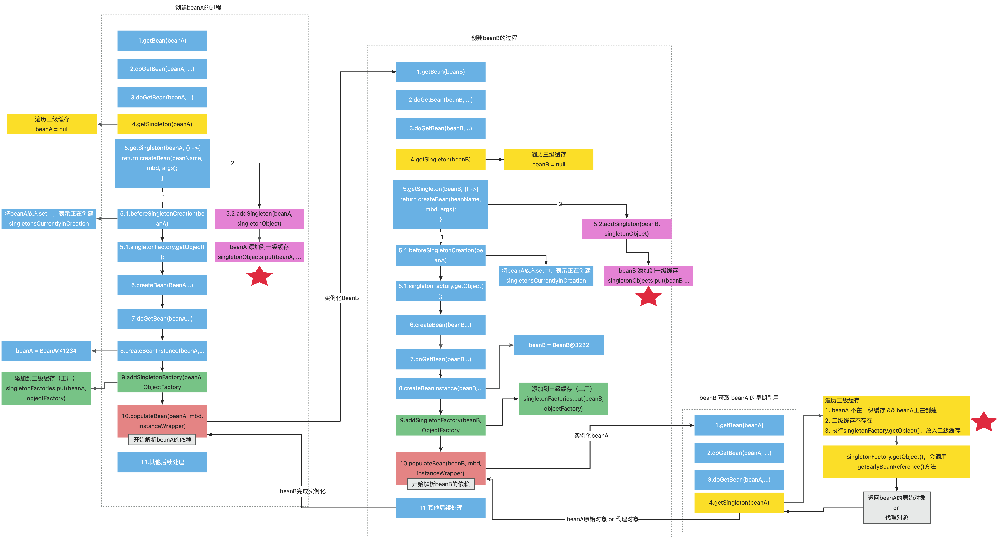

    这是spring系列的第九篇文章，主要介绍的是循环依赖及三级缓存。

<style>
.my-code {
   color: orange;
}
.orange {
   color: rgb(255, 53, 2)
}
.red {
   color: red
}
code {
   color: #0ABF5B;
}
</style>

# 一、Spring
`spring框架`是Java生态中最主流的轻量级开源应用框架，其核心目标是简化企业级应用开发，通过`IOC（控制反转）`和`AOP（面向切面编程）`两大核心机制实现解耦、模块化和可维护性。

<!-- more -->

# 二、三级缓存
在解析循环依赖之前，先了解一下三级缓存。

```java
public class DefaultSingletonBeanRegistry extends SimpleAliasRegistry implements SingletonBeanRegistry {
	...
	// 从上至下 分表代表这“三级缓存”
	private final Map<String, Object> singletonObjects = new ConcurrentHashMap<>(256); //一级缓存
	private final Map<String, Object> earlySingletonObjects = new HashMap<>(16); // 二级缓存
	private final Map<String, ObjectFactory<?>> singletonFactories = new HashMap<>(16); // 三级缓存
	...
	
	/** Names of beans that are currently in creation. */
	// 这个缓存也十分重要：它表示bean创建过程中都会在里面呆着~
	// 它在Bean开始创建时放值，创建完成时会将其移出~
	private final Set<String> singletonsCurrentlyInCreation = Collections.newSetFromMap(new ConcurrentHashMap<>(16));

	/** Names of beans that have already been created at least once. */
	// 当这个Bean被创建完成后，会标记为这个 注意：这里是set集合 不会重复
	// 至少被创建了一次的  都会放进这里~~~~
	private final Set<String> alreadyCreated = Collections.newSetFromMap(new ConcurrentHashMap<>(256));
}
```
1. `singletonObjects`：用于存放完全初始化好的 bean，**从该缓存中取出的 bean 可以直接使用**
2. `earlySingletonObjects`：提前曝光的单例对象的cache，存放原始的 bean 对象（尚未填充属性），用于解决循环依赖
3. `singletonFactories`：单例对象工厂的cache，存放 bean 工厂对象，用于解决循环依赖


# 三、循环依赖
先了解一下是如何从缓存中获取数据的
1. 先从一级缓存`singletonObjects`中去获取。（如果获取到就直接return）
2. 如果获取不到或者对象正在创建中（`isSingletonCurrentlyInCreation()`），那就再从二级缓存`earlySingletonObjects`中获取。（如果获取到就直接return）
3. 如果还是获取不到，且允许`singletonFactories（allowEarlyReference=true）`通过`getObject()`获取。就从三级缓存`singletonFactory.getObject()`获取。（如果获取到了就从`singletonFactories`中移除，并且放进`earlySingletonObjects`。其实也就是从三级缓存移动（是剪切、不是复制哦~）到了二级缓存）

```java
public class DefaultSingletonBeanRegistry extends SimpleAliasRegistry implements SingletonBeanRegistry {
	...
	@Override
	@Nullable
	public Object getSingleton(String beanName) {
		return getSingleton(beanName, true);
	}
	@Nullable
	protected Object getSingleton(String beanName, boolean allowEarlyReference) {
		Object singletonObject = this.singletonObjects.get(beanName);
		if (singletonObject == null && isSingletonCurrentlyInCreation(beanName)) {
			synchronized (this.singletonObjects) {
				singletonObject = this.earlySingletonObjects.get(beanName);
				if (singletonObject == null && allowEarlyReference) {
					ObjectFactory<?> singletonFactory = this.singletonFactories.get(beanName);
					if (singletonFactory != null) {
						singletonObject = singletonFactory.getObject();
						this.earlySingletonObjects.put(beanName, singletonObject);
						this.singletonFactories.remove(beanName);
					}
				}
			}
		}
		return singletonObject;
	}
	...
	public boolean isSingletonCurrentlyInCreation(String beanName) {
		return this.singletonsCurrentlyInCreation.contains(beanName);
	}
	protected boolean isActuallyInCreation(String beanName) {
		return isSingletonCurrentlyInCreation(beanName);
	}
	...
}
```

## 3.1、流程总结



# 四、相关问题
## 4.1、只需要一级和三级缓存也可以做到解决循环依赖的问题？
严格来讲，`第三级缓存`并非缺它不可，因为可以提前创建代理对象

提前创建代理对象只是会节省那么一丢丢内存空间，并不会带来性能上的提升，但是会破环 Spring 的设计原则
> Spring 的设计原则是尽可能保证普通对象创建完成之后，再生成其 AOP 代理（尽可能延迟代理对象的生成
> 所以 Spring 用了第三级缓存，既维持了设计原则，又处理了循环依赖；牺牲那么一丢丢内存空间是愿意接受的

## 4.2、为什么还要存一个ObjectFactory对象到第三级缓存中?
- 一个是因为不是每个Bean都会出现循环依赖，所以三级缓存只存了一个工厂对象
- 二是我们在@Autowired对象时，想要注入的不一定是Bean本身，而是想要注入一个修改过后的对象，如代理对象
> 在AbstractAutowireCapableBeanFactory.getEarlyBeanReference方法中循环调用了SmartInstantiationAwareBeanPostProcessor.getEarlyBeanReference方法，AbstractAutoProxyCreator对象就实现了该方法：

## 4.3、三级缓存的意义
测试证明，二级缓存也是可以解决循环依赖的。为什么 Spring 不选择二级缓存，而要额外多添加一层缓存，使用三级缓存呢？
- 如果 Spring 选择二级缓存来解决循环依赖的话，那么就意味着所有 Bean 都需要在实例化完成之后就立马为其创建代理，而 Spring 的设计原则是在 Bean 初始化完成之后才为其创建代理。
- 使用三级缓存而非二级缓存并不是因为只有三级缓存才能解决循环引用问题，其实二级缓存同样也能很好解决循环引用问题。使用三级而非二级缓存并非出于 IOC 的考虑，而是`出于 AOP 的考虑`，即若使用二级缓存，在 AOP 情形注入到其他 Bean的，不是最终的代理对象，而是原始对象。

参考文章：
[如何利用"三级缓存"巧妙解决Bean的循环依赖问题](https://cloud.tencent.com/developer/article/1497692)
https://www.shouxicto.com/article/2791.html