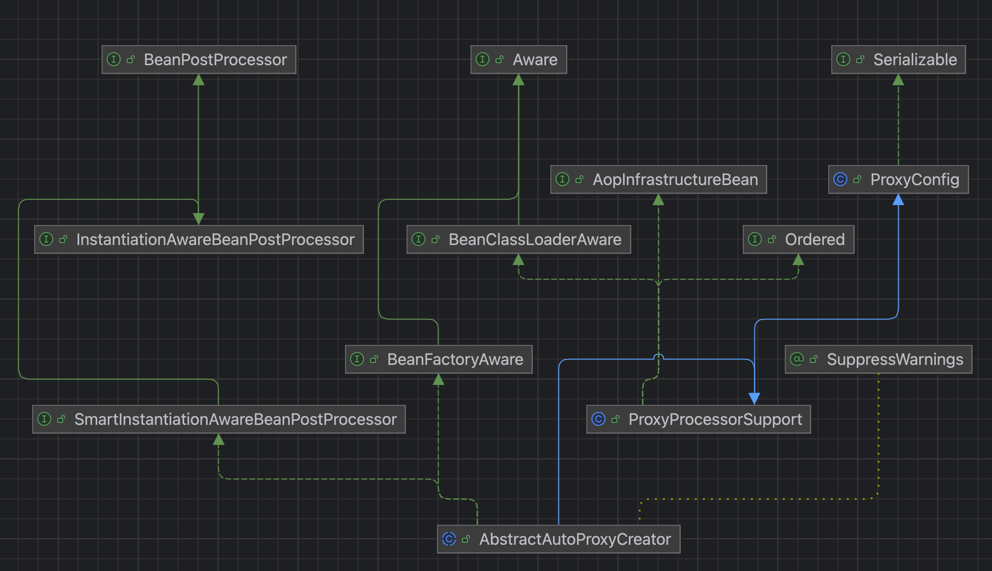

    这是spring系列的第十篇文章，主要介绍的是AOP。

<style>
.my-code {
   color: orange;
}
.orange {
   color: rgb(255, 53, 2)
}
.red {
   color: red
}
code {
   color: #0ABF5B;
}
</style>

# 一、Spring
`spring框架`是Java生态中最主流的轻量级开源应用框架，其核心目标是简化企业级应用开发，通过`IOC（控制反转）`和`AOP（面向切面编程）`两大核心机制实现解耦、模块化和可维护性。

<!-- more -->

# 二、AOP
AOP（Aspect-Oriented Programming），即 `面向切面编程`。

## 2.1、相应概念
可以使用`where when what `来进行理解。
- `切面（Aspect）`：what
- `切入点（Pointcut）`：where
- `通知（Advice）`：when 
- `织入（Weaving）`：how

### 2.1.1、切面（Aspect）
切面就像“插件”或“功能模块”，用来封装横跨多个类的通用逻辑（如日志、事务）。
- 定义`切入点（Pointcut）`和`通知（Advice）`，生成后续的 `Advisor`

### 2.1.2、切入点（Pointcut）
在哪些类，哪些方法上切入（`where`），即在哪些地方添加“插件”

切入点表达式
- 用@`Pointcut`注解标注

**示例1:**
```
@Pointcut("execution(public  * com.order.server.gateway.*.*(..))")
```
参数解析：
- `execution`：方法执行时触发
- `*`： 返回类型
- `.gateway.*`：方法名和类``名
- `(..)`： 参数名

**示例2:**``
```
@Pointcut("@annotation(com.order.server.aop.annotation.OrderRouter)")
```
- `@annotationn`: 限定匹配带有指定注解的连接点

### 2.1.3、通知（Advice）
在方法执行的什么时机（when:方法前/方法后/方法前后）做什么

分类
- `@Before`：前置通知(Before Advice)
- `@After`：后置通知(After Advice)
- `@AfterReturning`：返回通知(After-returning)
- `@AfterThrowing`：异常通知(After-throwing)
- `@Around`：环绕通知(Around)


### 2.1.4、织入（Weaving）
如何将插件代码“织入”目标位置的过程，即how。
- 动态代理：
- 字节码增强

**织入时机**
- 编译期
    切面在目标类编译时被织入，这种方式需要特殊的编译器。AspectJ 的织入编译器就是以这种方式织入切面的
- 类加载期
    切面在目标类加载到 JVM 时被织入，这种方式需要特殊的类加载器( ClassLoader )，它可以在目标类引入应用之前增强目标类的字节码
- 运行期
    切面在应用运行的某个时期被织入。一般情况下，在织入切面时，AOP容器会为目标对象动态创建一个代理对象，Spring AOP 采用的就是这种织入方式

## 2.2、具体案例
操作日志的切面：
```java
/**
 * 操作日志记录处理
 */
@Aspect
@Component
public class ControllerAspect {
    Logger logger = LoggerFactory.getLogger(ControllerAspect.class);

    @Pointcut("execution(* com.admin.controller.*.*(..))")
    private void pointCutMethodController() {
    }

    @Around("pointCutMethodController()")
    public Object doAroundService(ProceedingJoinPoint pjp) throws Throwable {
        long begin = System.nanoTime();
        Object obj = pjp.proceed();
        long end = System.nanoTime();
        logger.info("Controller method：{}，prams：{}，cost time：{} ns，cost：{} ms",
                pjp.getSignature().toString(), Arrays.toString(pjp.getArgs()), (end - begin), (end - begin) / 1000000);
        return obj;
    }

}
```
- `@Aspect`：声明这是一个切面Bean
- `@Component`：声明这是一个组件
- `@Pointcut("execution(* com.admin.controller.*.*(..))")`：对 `com.admin.controller`包下的所有类、所有方法进行进行拦截。
- `@Around("pointCutMethodController()")`：环绕通知，获取执行耗时。

# 三、AOP的实现
在spring中，是怎么解析AOP相关的注解生成代理类的呢？
- 重要内容：通过`AbstractAutoProxyCreator`来生成代理对象的。

## 3.1、AbstractAutoProxyCreator
`AbstractAutoProxyCreator`的类图如下：
- 实现了`BeanPostProcessor`接口，即 Bean的后置处理器，在Bean初始化后会执行`postProcessAfterInitialization`方法生成代理对象。
  
- `postProcessAfterInitialization`方法代码如下：
```java
public abstract class AbstractAutoProxyCreator extends ProxyProcessorSupport
    implements SmartInstantiationAwareBeanPostProcessor, BeanFactoryAware {
    @Override
    public Object postProcessAfterInitialization(@Nullable Object bean, String beanName) {
        if (bean != null) {
            Object cacheKey = getCacheKey(bean.getClass(), beanName);
            if (this.earlyProxyReferences.remove(cacheKey) != bean) {
                return wrapIfNecessary(bean, beanName, cacheKey);
            }
        }
        return bean;
    }
}
```
`AbstractAutoProxyCreator`：作为 `BeanPostProcessor`，负责在 `postProcessAfterInitialization`阶段生成代理对象。

### 3.1.1、生成时机
`AbstractAutoProxyCreator`的实例会被注册到Spring容器中，当且仅当以下条件之一满足时
- **使用注解驱动的AOP配置**：例如在spring boot中使用`@EnableAspectJAutoProxy`注解
- **XML配置中的AOP声明**：在spring XML配置文件中使用`<aop:config/> `或 `<aop:aspectj-autoproxy/>`标签
- **手动注册**：通过Java配置或XML显示定义一个`AbstractAutoProxyCreator`的子类Bean。

> **XML配置中的AOP声明**模式
> 
> AOP的命名空间`http\://www.springframework.org/schema/aop=org.springframework.aop.config.AopNamespaceHandler`
> ```java
public class AopNamespaceHandler extends NamespaceHandlerSupport {
	@Override
	public void init() {
		// In 2.0 XSD as well as in 2.1 XSD.
		registerBeanDefinitionParser("config", new ConfigBeanDefinitionParser());
		registerBeanDefinitionParser("aspectj-autoproxy", new AspectJAutoProxyBeanDefinitionParser());
		registerBeanDefinitionDecorator("scoped-proxy", new ScopedProxyBeanDefinitionDecorator());

		registerBeanDefinitionParser("spring-configured", new SpringConfiguredBeanDefinitionParser());
	}
}
```
> `AspectJAutoProxyBeanDefinitionParser`这一步中注册`AnnotationAwareAspectJAutoProxyCreator`的BeanDefinition


### 3.1.2、相关子类

#### 3.1.2.1、AnnotationAwareAspectJAutoProxyCreator
##### 核心职责
- **注解驱动的 AspectJ 切面处理**：  
  自动扫描并处理带有 `@Aspect` 注解的类，将其转换为 Spring 的 Advisor（通知器），并应用到匹配的目标 Bean。
- **集成 AspectJ 注解支持**：  
  支持 `@Pointcut`、`@Before`、`@Around` 等 AspectJ 注解，实现声明式切面定义。

##### 源码定位
- 继承链：  
  `AnnotationAwareAspectJAutoProxyCreator`  
  → `AspectJAwareAdvisorAutoProxyCreator`  
  → `AbstractAdvisorAutoProxyCreator`  
  → `AbstractAutoProxyCreator`
- **关键类**：`org.springframework.aop.aspectj.annotation.AnnotationAwareAspectJAutoProxyCreator`

##### 工作流程
1. **Bean 初始化后处理**：  
   作为 `BeanPostProcessor`，在 Bean 初始化完成后触发代理生成逻辑。
2. **扫描 `@Aspect` 类**：  
   从容器中获取所有标记 `@Aspect` 的 Bean，解析其注解定义的切面逻辑。
3. **生成 Advisor**：  
   将 `@Before`、`@Around` 等注解转换为对应的 `Advisor` 对象。
4. **匹配目标 Bean**：  
   根据切入点的表达式（如 `execution(* com.example.service.*.*(..))`）筛选需要代理的 Bean。
5. **创建代理对象**：  
   使用 JDK 动态代理或 CGLIB 生成代理，并将 Advisor 逻辑织入目标方法。

##### 配置方式
- 通过 `@EnableAspectJAutoProxy` 注解启用：
  ```java
  @Configuration
  @EnableAspectJAutoProxy
  public class AppConfig {}
  ```
- 或在 XML 中配置：
  ```xml
  <aop:aspectj-autoproxy/>
  ```

##### 典型应用场景
- 使用 `@Aspect` 注解定义日志、事务、权限等切面。
- 需要声明式配置 AOP 逻辑的场景。

---

#### 3.1.2.2、AspectJAwareAdvisorAutoProxyCreator
##### 核心职责
- **通用 Advisor 自动代理**：  
  自动应用容器中所有已注册的 `Advisor` 对象，无需依赖特定注解。
- **支持编程式 AOP 配置**：  
  适用于通过编程方式（而非注解）定义的切面逻辑。

##### 源码定位
- 继承链：  
  `AspectJAwareAdvisorAutoProxyCreator`  
  → `AbstractAdvisorAutoProxyCreator`  
  → `AbstractAutoProxyCreator`
- **关键类**：`org.springframework.aop.framework.autoproxy.AbstractAdvisorAutoProxyCreator`（实际类名可能因版本不同略有差异）

##### 工作流程
1. **Bean 初始化后处理**：  
   同样作为 `BeanPostProcessor` 触发代理生成。
2. **收集所有 Advisor**：  
   从容器中获取所有 `Advisor` 类型的 Bean（包括通过 XML 或编程方式定义的 Advisor）。
3. **匹配目标 Bean**：  
   根据每个 `Advisor` 的 `Pointcut` 判断是否匹配当前 Bean。
4. **创建代理对象**：  
   合并所有匹配的 `Advisor`，生成代理对象。

##### 配置方式
- 显式注册 `DefaultAdvisorAutoProxyCreator`（注意：在 Spring 中，`AspectJAwareAdvisorAutoProxyCreator` 可能是一个历史名称，实际常用的是 `DefaultAdvisorAutoProxyCreator`）：
  ```xml
  <bean class="org.springframework.aop.framework.autoproxy.DefaultAdvisorAutoProxyCreator"/>
  ```
- 所有 `Advisor` 需手动定义（如通过 `ProxyFactoryBean` 或 XML 配置）。


## 3.2、@Aspect注解的解析
上面的章节中，我们介绍了`AbstractAutoProxyCreator`，它实现了 `InstantiationAwareBeanPostProcessor`接口。
- 实例化Bean前后会执行 `InstantiationAwareBeanPostProcessor`接口的重写方法
  - `postProcessBeforeInstantiation`
```java
public abstract class AbstractAutoProxyCreator extends ProxyProcessorSupport
		implements SmartInstantiationAwareBeanPostProcessor, BeanFactoryAware {
    @Override
    public Object postProcessBeforeInstantiation(Class<?> beanClass, String beanName) throws BeansException {
        Object cacheKey = getCacheKey(beanClass, beanName);
        if (beanName == null || !this.targetSourcedBeans.contains(beanName)) {
            if (this.advisedBeans.containsKey(cacheKey)) {
                return null;
            }
            //重点：这里会去判断当前创建的bean是否有@Aspect注解
            if (isInfrastructureClass(beanClass) || shouldSkip(beanClass, beanName)) {
                //存在@Aspect注解，则添加到advisedBeans集合中
                this.advisedBeans.put(cacheKey, Boolean.FALSE);
                return null;
            }
        }
       
        return null;
    }
}
```

例如上面的具体案例中，`ControllerAspect`有两个注解：`@Aspect 和 @Component`，它作为一个组件，会被容器加载及实例化。

在实例化`ControllerAspect`的Bean之前，会执行`postProcessBeforeInstantiation`方法，判断当前Bean是否有`@Aspect`注解
```java
protected boolean isInfrastructureClass(Class<?> beanClass) {
    // super.isInfrastructureClass(beanClass) = false： 因为不是基础的类
    return (super.isInfrastructureClass(beanClass) || this.aspectJAdvisorFactory.isAspect(beanClass));
}
```
进入 `this.aspectJAdvisorFactory.isAspect(beanClass)`
```java
public abstract class AbstractAspectJAdvisorFactory implements AspectJAdvisorFactory {
    @Override
    public boolean isAspect(Class<?> clazz) {
        return (hasAspectAnnotation(clazz) && !compiledByAjc(clazz));
    }
    //通过反射，判断当前类是否有@Aspect注解
    private boolean hasAspectAnnotation(Class<?> clazz) {
        return (AnnotationUtils.findAnnotation(clazz, Aspect.class) != null);
    }
}
```


# 四、代理对象生成
```java
public abstract class AbstractAutoProxyCreator extends ProxyProcessorSupport
    implements SmartInstantiationAwareBeanPostProcessor, BeanFactoryAware {
    @Override
    public Object postProcessAfterInitialization(@Nullable Object bean, String beanName) {
        if (bean != null) {
            Object cacheKey = getCacheKey(bean.getClass(), beanName);
            if (this.earlyProxyReferences.remove(cacheKey) != bean) {
                return wrapIfNecessary(bean, beanName, cacheKey);
            }
        }
        return bean;
    }
}
```

## 4.1、wrapIfNecessary
用于决定是否为Bean创建代理对象。
- 判断当前Bean是否需要被代理
- 创建代理对象
```java
protected Object wrapIfNecessary(Object bean, String beanName, Object cacheKey) {
    // Create proxy if we have advice.
    Object[] specificInterceptors = getAdvicesAndAdvisorsForBean(bean.getClass(), beanName, null);
    if (specificInterceptors != DO_NOT_PROXY) {
        this.advisedBeans.put(cacheKey, Boolean.TRUE);
        Object proxy = createProxy(
                bean.getClass(), beanName, specificInterceptors, new SingletonTargetSource(bean));
        this.proxyTypes.put(cacheKey, proxy.getClass());
        return proxy;
    }
    this.advisedBeans.put(cacheKey, Boolean.FALSE);
    return bean;
}
```

## 4.2、getAdvicesAndAdvisorsForBean
根据当前Bean的类和名称，从系统中所有候选的`Advisor`(包含通知、切点等)中筛选出**适用于当前Bean的增强器**。

### 4.2.1、findEligibleAdvisors
获取符合条件的增强器
```java
protected List<Advisor> findEligibleAdvisors(Class<?> beanClass, String beanName) {
    List<Advisor> candidateAdvisors = findCandidateAdvisors();
    List<Advisor> eligibleAdvisors = findAdvisorsThatCanApply(candidateAdvisors, beanClass, beanName);
    extendAdvisors(eligibleAdvisors);
    if (!eligibleAdvisors.isEmpty()) {
        eligibleAdvisors = sortAdvisors(eligibleAdvisors);
    }
    return eligibleAdvisors;
}
```

#### 1. findCandidateAdvisors【获取候选增强器】
该方法用来查找`Advisor`实现类，默认使用工具类`BeanFactoryAdvisorRetrievalHelper`，最重要的一行代码是
```java
advisorNames = BeanFactoryUtils.beanNamesForTypeIncludingAncestors(this.beanFactory, Advisor.class, true, false);
```
在`beanFactory`中查找所有实现了`Advisor`接口或带有`@Aspect`注解的Bean。然后再循环调用`beanFactory`的`getBean()`方法初始化`advisor`。
- 直接实现Advisor接口的Bean（如通过XML配置的<aop:advisor>）。
- 通过@Aspect注解定义的切面类

并定义了`volatile`修饰的`cachedAdvisorBeanNames`变量将找到的`Advisor bean`缓存起来，以便下次直接使用。

#### 2. findAdvisorsThatCanApply
候选增强器中寻找到匹配项

先使用线程变量将当前bean暴露出来。
```java
ProxyCreationContext.setCurrentProxiedBeanName(beanName)
```
再使用`AopUtils.findAdvisorsThatCanApply(candidateAdvisors, beanClass)`方法返回匹配的Advisor。

一些通用的方法都抽出放到了`AopUtils`这个工具类中。

在Spring AOP 中可以分为两种Advisor：`IntroductionAdvisor`和`PointcutAdvisor`。一种用来增强类（为对象引入新的接口），另一种用来增强具体的方法。


## 4.3、createProxy创建代理对象
```java
protected Object createProxy(Class<?> beanClass, @Nullable String beanName,
                             @Nullable Object[] specificInterceptors, TargetSource targetSource) {

    if (this.beanFactory instanceof ConfigurableListableBeanFactory) {
        AutoProxyUtils.exposeTargetClass((ConfigurableListableBeanFactory) this.beanFactory, beanName, beanClass);
    }

    ProxyFactory proxyFactory = new ProxyFactory();
    proxyFactory.copyFrom(this);

    if (proxyFactory.isProxyTargetClass()) {
        // Explicit handling of JDK proxy targets and lambdas (for introduction advice scenarios)
        if (Proxy.isProxyClass(beanClass) || ClassUtils.isLambdaClass(beanClass)) {
            // Must allow for introductions; can't just set interfaces to the proxy's interfaces only.
            for (Class<?> ifc : beanClass.getInterfaces()) {
                proxyFactory.addInterface(ifc);
            }
        }
    }
    else {
        // No proxyTargetClass flag enforced, let's apply our default checks...
        if (shouldProxyTargetClass(beanClass, beanName)) {
            proxyFactory.setProxyTargetClass(true);//强制使用CGLIB
        }
        else {
            evaluateProxyInterfaces(beanClass, proxyFactory);//检查接口
        }
    }

    Advisor[] advisors = buildAdvisors(beanName, specificInterceptors);
    proxyFactory.addAdvisors(advisors);
    proxyFactory.setTargetSource(targetSource);
    customizeProxyFactory(proxyFactory);

    proxyFactory.setFrozen(this.freezeProxy);
    if (advisorsPreFiltered()) {
        proxyFactory.setPreFiltered(true);
    }

    // Use original ClassLoader if bean class not locally loaded in overriding class loader
    ClassLoader classLoader = getProxyClassLoader();
    if (classLoader instanceof SmartClassLoader && classLoader != beanClass.getClassLoader()) {
        classLoader = ((SmartClassLoader) classLoader).getOriginalClassLoader();
    }
    return proxyFactory.getProxy(classLoader);
}
```
### 步骤1：初始化代理工厂：
```java
ProxyFactory proxyFactory = new ProxyFactory();
```
- **ProxyFactory**是spring提供的代理工厂类，用于配置代理对象的生成规则。

### 步骤2：确定代理类型
根据以下条件选择代理类型：
- JDK动态代理：
  - 条件：目标Bean的类实现了接口（hasInterfaces=true），且未强制使用CGLIB
  - 参数控制：proxyTargetClass为false（默认值）
- CGLIB代理：
  - 条件：目标Bean未实现接口 或 强制设置 proxyTargetClass为true
  - 实现方式：通过生成目标类的子类

### 步骤3：配置代理工厂
```java
if (!proxyFactory.isProxyTargetClass()) {
    if (shouldProxyTargetClass(beanClass, beanName)) {
        proxyFactory.setProxyTargetClass(true);//强制使用CGLIB
    }
    else {
        evaluateProxyInterfaces(beanClass, proxyFactory);//检查接口
    }
}
```
- `shouldProxyTargetClass`：判断是否需要强制使用CGLIB（如目标类被标记为 `@Scope(proxyMode=ScopedProxyMode.TARGET_CLASS)`）
- `evaluateProxyInterface`s：收集目标类实现的接口，作为JDK代理的接口列表

### 步骤4：添加增强器（Advisors/Advice）
```java
Advisor[] advisors = buildAdvisors(beanName, specificInterceptors);
proxyFactory.addAdvisors(advisors);
```
`advisors`：包含所有适用于当前Bean的切面（`@Aspect`）中的通知（如`@Before， @Around`等）。

### 步骤5：设置目标源（TargetSource）
```java
proxyFactory.setTargetSource(targetSource);
```
`targetSource`：指向目标Bean的实例（如`SingletonTargetSource`表示单例模式）

### 步骤6：生成代理对象
```java
return proxyFactory.getProxy(classLoader);
```
- `getProxy`: 调用`ProxyFactory`的`getProxy`方法，最终生成代理对象
  - `JDK动态代理`：通过`Proxy.newProxyInstance`创建
  - `CGLIB代理`：通过`Enhancer`生成子类实例


## 4.4、proxyFactory.getProxy(classLoader)解析
```java
public class ProxyFactory extends ProxyCreatorSupport {
    public Object getProxy(@Nullable ClassLoader classLoader) {
        return createAopProxy().getProxy(classLoader);
    }
}
```

### 4.4.1、获取AopProxy【createAopProxy()】
`createAopProxy()` 方法返回 AopProxy。AopProxy是用于生成代理对象的顶层接口，定义了创建代理的核心方法。

`AopProxy`的核心作用：
- **动态代理生成**：根据目标对象和切面配置，生成代理对象。
- **统一代理接口**：屏蔽JDK动态代理和CGLIB的底层差异，对外提供一致的代理创建方法。
- **拦截方法调用**：代理对象拦截目标方法，执行关联的拦截器链（Advisor链）。
  
`AopProxy`的相关实现：
- `JdkDynamicAopProxy`: JDK动态代理
- `ObjenesisCglibAopProxy`: CGLIB动态代理
```java
public AopProxy createAopProxy(AdvisedSupport config) throws AopConfigException {
    if (!NativeDetector.inNativeImage() &&
            (config.isOptimize() || config.isProxyTargetClass() || hasNoUserSuppliedProxyInterfaces(config))) {
        Class<?> targetClass = config.getTargetClass();
        if (targetClass == null) {
            throw new AopConfigException("TargetSource cannot determine target class: " +
                    "Either an interface or a target is required for proxy creation.");
        }
        if (targetClass.isInterface() || Proxy.isProxyClass(targetClass) || ClassUtils.isLambdaClass(targetClass)) {
            return new JdkDynamicAopProxy(config);
        }
        return new ObjenesisCglibAopProxy(config);
    }
    else {
        return new JdkDynamicAopProxy(config);
    }
}
```

### 4.4.2、创建代理【AopProxy.getProxy(classLoader)】
以`JdkDynamicAopProxy`为示例，内部执行`getProxy(classLoader)`方法创建代理对象。
```java
final class JdkDynamicAopProxy implements AopProxy, InvocationHandler, Serializable {
    @Override
    public Object getProxy(@Nullable ClassLoader classLoader) {
        if (logger.isTraceEnabled()) {
            logger.trace("Creating JDK dynamic proxy: " + this.advised.getTargetSource());
        }
        return Proxy.newProxyInstance(classLoader, this.proxiedInterfaces, this);
    }
}
```
接下来解析是如何创建代理对象的。

#### 4.4.2.1、执行`Proxy.newProxyInstance`
`Proxy.newProxyInstance`是JDK动态代理核心方法，用于在运行时创建一个代理对象。该代理对象实现了指定的接口，并将方法调用委托给`InvocationHandler`处理。

# 五、代理对象的执行
之前我们有专门的一篇文章解析了动态代理，回顾一下JDK动态代理：

> 目标接口
> ```java
> public interface UserService {
>     void saveUser();
> }
> ```
> 生成的代理类（反编译后）
> ```java
> public final class $Proxy0 extends Proxy implements UserService {
    // 方法对象的静态引用
    private static Method m1; // hashCode()
    private static Method m2; // equals()
    private static Method m3; // toString()
    private static Method m4; // saveUser()
    public $Proxy0(InvocationHandler h) {
        super(h);
    }
    // 接口方法实现
    public final void saveUser() {
        try {
            // 调用 InvocationHandler.invoke()
            h.invoke(
                this, 
                m4,  // 对应 saveUser() 的 Method 对象
                null // 方法参数（无参数）
            );
        } catch (Throwable e) {
            throw new UndeclaredThrowableException(e);
        }
    }
    // 静态初始化块：通过反射获取接口方法
    static {
        try {
            m1 = Class.forName("java.lang.Object").getMethod("hashCode");
            m2 = Class.forName("java.lang.Object").getMethod("equals", Class.forName("java.lang.Object"));
            m3 = Class.forName("java.lang.Object").getMethod("toString");
            m4 = Class.forName("com.example.UserService").getMethod("saveUser");
        } 
    }
}
> ```

当我们调用代理对象的相应方法时，方法内部实际是执行`InvocationHandler.invoke()`方法。jdk动态代理则执行`JdkDynamicAopProxy.invoke()`方法。
> <code class="red">注意</code>：`JdkDynamicAopProxy`实现了`InvocationHandler`接口，重写了invoke()方法，代码简化后如下：
> ```java
> @Override
> @Nullable
> public Object invoke(Object proxy, Method method, Object[] args) throws Throwable {
>   Object oldProxy = null;
>   boolean setProxyContext = false;
>   TargetSource targetSource = this.advised.targetSource;
>   Object target = null;
>   try {
>       target = targetSource.getTarget();
>       Class<?> targetClass = (target != null ? target.getClass() : null);
> 
>       // 构建拦截器链：获取能够应用于该方法的所有拦截器（有序），不同的 AspectJ 根据 @Order 排序
>       List<Object> chain = this.advised.getInterceptorsAndDynamicInterceptionAdvice(method, targetClass);
> 
>       if (!chain.isEmpty()) {
>           //通过ReflectiveMethodInvocation驱动责任链模式，依次执行拦截器和目标方法
>           MethodInvocation invocation = new ReflectiveMethodInvocation(proxy, target, method, args, targetClass, chain);
>           //启动拦截器链的执行：会依次调用拦截器的invoke()方法，并最终调用目标方法
>           retVal = invocation.proceed();
>       }
>       return retVal;
>     }
> }
> ```

拦截器链的执行逻辑：
```java
public Object proceed() throws Throwable {
    // 如果所有拦截器已执行完毕，调用目标方法
    if (this.currentInterceptorIndex == this.interceptorsAndDynamicMethodMatchers.size() - 1) {
        return invokeJoinpoint();
    }
    // 获取下一个拦截器
    Object interceptorOrInterceptionAdvice = this.interceptorsAndDynamicMethodMatchers.get(++this.currentInterceptorIndex);
    // 如果是动态匹配的 MethodMatcher，检查当前方法是否匹配
    if (interceptorOrInterceptionAdvice instanceof InterceptorAndDynamicMethodMatcher) {
        InterceptorAndDynamicMethodMatcher dm = (InterceptorAndDynamicMethodMatcher) interceptorOrInterceptionAdvice;
        if (dm.methodMatcher.matches(this.method, this.targetClass, this.arguments)) {
            return dm.interceptor.invoke(this);
        } else {
            // 不匹配，跳过当前拦截器，继续执行下一个
            return proceed();
        }
    } else {
        // 直接执行拦截器的 invoke 方法
        return ((MethodInterceptor) interceptorOrInterceptionAdvice).invoke(this);
    }
}
```

执行流程图：
```
客户端调用代理对象 → 调用 JdkDynamicAopProxy.invoke()
  ├─ 特殊方法处理（equals/hashCode/DecoratingProxy/Advised）
  ├─ 设置代理上下文到 ThreadLocal
  ├─ 获取目标对象 Target
  ├─ 获取拦截器链（Interceptors）
  ├─ 构建 ReflectiveMethodInvocation
  ├─ 执行拦截器链（责任链模式）
  │  ├─ 前置通知（MethodBeforeAdvice）
  │  ├─ 环绕通知（AroundAdvice）
  │  ├─ 调用目标方法（method.invoke(target, args)）
  │  └─ 后置通知（AfterReturning/ThrowsAdvice）
  └─ 返回结果或异常
```


# 六、Advisor（顾问）
在spring AOP中，`Advisor`是连接`Advice（通知）`和`Pointcut（切入点）`的核心接口，用于定义“**在何处（Pointcut）执行何种逻辑（Advice）**”。它是spring AOP的底层抽象，提供了一种灵活的方式来组合横切逻辑的匹配与执行。

## 6.1、Advisor的核心结构

### 6.1.1、接口定义
```java
public interface Advisor {
    // 获取关联的 Advice（通知逻辑）
    Advice getAdvice();
    // 是否适用于所有目标对象（通常返回 false）
    boolean isPerInstance();
}
```

### 6.1.2、主要子接口
- `PointcutAdvisor`：包含 `Pointcut（切入点）`的Advisor，用于将Advice绑定到特定方法。
```java
public interface PointcutAdvisor extends Advisor {
    Pointcut getPointcut();
}
```
- `IntroductionAdvisor`：用于为类添加接口实现的特殊Advisor（如混入新功能）。

## 6.2、Advisor的实现类

### 6.2.1、DefaultPointcutAdvisor
**最简单的实现**：直接组合一个Pointcut和一个Advice

示例
```java
// 定义切入点（匹配所有Service类的方法）
Pointcut pointcut = new AspectJExpressionPointcut("execution(* com.example.service.*.*(..))");

// 定义通知（前置逻辑）
Advice advice = new MethodBeforeAdvice() {
    @Override
    public void before(Method method, Object[] args, Object target) {
        System.out.println("Before method: " + method.getName());
    }
};

// 创建Advisor
Advisor advisor = new DefaultPointcutAdvisor(pointcut, advice);
```

### 6.2.2、NameMatchMethodPointcutAdvisor
**基于方法名称的切入点**：通过方法名匹配

示例
```java
NameMatchMethodPointcutAdvisor advisor = new NameMatchMethodPointcutAdvisor();
advisor.setAdvice(new MethodBeforeAdvice() { /* ... */ });
advisor.setMappedNames("save*", "update*"); // 匹配以 save 或 update 开头的方法
```

### 6.2.3、RegexpMethodPointcutAdvisor
**基于正则表达式的切入点**：使用正则表达式匹配方法

示例
```java
RegexpMethodPointcutAdvisor advisor = new RegexpMethodPointcutAdvisor();
advisor.setAdvice(new AroundAdvice() { /* ... */ });
advisor.setPattern("com.example.service.*.save.*"); // 正则匹配
```

# 七、代理对象小结
纵观spring的整体执行逻辑，我们会发现有多出地方涉及到代理对象的生成。

| 方式                                                                                               | 	触发时机         | 	主要作用	                                       | 适用场景                                                                                                      |
|--------------------------------------------------------------------------------------------------|---------------|----------------------------------------------|-----------------------------------------------------------------------------------------------------------|
| Object bean = resolveBeforeInstantiation(beanName, mbdToUse);<br>postProcessBeforeInstantiation	 | Bean 实例化之前	   | 在实例化目标 Bean 之前尝试创建代理，跳过目标 Bean 的实例化。         | 	实现`InstantiationAwareBeanPostProcessors`接口 & 需要自定义 `TargetSource` 或强制使用 CGLIB 代理（如 proxyTargetClass = true）。 |
| postProcessAfterInitialization	                                                                  | Bean 初始化完成之后  | 在 Bean 完全初始化后（属性注入、初始化方法执行后）决定是否为 Bean 创建代理。 | 	普通代理场景（如 `@Transactional、切面匹配`等）。                                                                          |
| ObjectFactory.getObject                                                                          || 延迟初始化目标对象 or 动态生成代理对象                        | 循环依赖                                                                                                      |


参考文章：
https://qzztf.com/post/39fc/index.html

