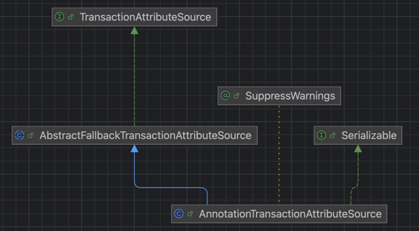
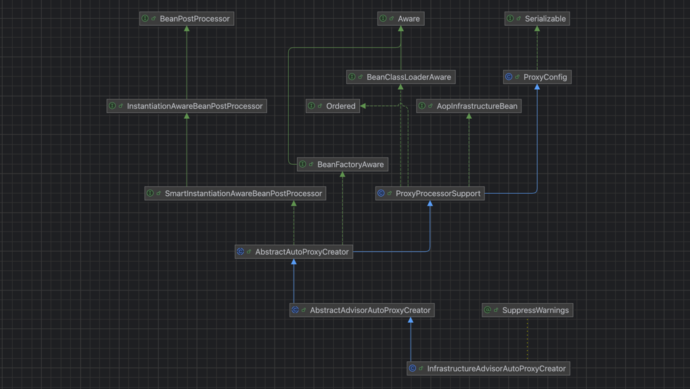

    这是spring系列的第11篇文章，主要介绍的是事务管理。

<style>
.my-code {
   color: orange;
}
.orange {
   color: rgb(255, 53, 2)
}
.red {
   color: red
}
code {
   color: #0ABF5B;
}
</style>

# 一、Spring
`spring框架`是Java生态中最主流的轻量级开源应用框架，其核心目标是简化企业级应用开发，通过`IOC（控制反转）`和`AOP（面向切面编程）`两大核心机制实现解耦、模块化和可维护性。

<!-- more -->

# 二、事务管理类型
两种实现方式
1. 声明式事务管理：`@Transactional`
2. 编程式事务管理：`TransactionTemplate`

## 方式1：声明式事务管理
通过`@Transactional`就可以进行事务操作，基于`Spring AOP`实现，有三种配置方式
1. XML文件配置方式 
2. config配置文件方式
3. springboot配置方式


### 2.1.1、XML文件配置方式
```
<!-- 配置数据源 -->
<bean id="dataSource" class="com.alibaba.druid.pool.DruidDataSource">
    <property name="url" value="jdbc:mysql://localhost:3306/mydb" />
    <property name="username" value="username" />
    <property name="password" value="password" />
    <property name="driverClassName" value="com.mysql.jdbc.Driver"/>
</bean>
<!-- 配置 SqlSessionFactory -->
<bean id="sqlSessionFactory" class="org.mybatis.spring.SqlSessionFactoryBean">
    <property name="configLocation" value="classpath:/mybatis/mybatis-config.xml"/>
    <property name="dataSource" ref="dataSource"/>
    <property name="mapperLocations" value="classpath:/mybatis/com.chw/*.xml"/>
</bean>
<!-- 配置事务管理器 -->
<bean id="transactionManager" class="org.springframework.jdbc.datasource.DataSourceTransactionManager">
    <property name="dataSource" ref="dataSource"/>
</bean>
<!-- 启用基于注解的事务管理 -->
<tx:annotation-driven transaction-manager="transactionManager"/>
```
`<tx:annotation-driven>`标签用于启用基于注解的事务管理
- `transaction-manager属性`： 指定用于事务管理的事务管理器 bean 的名称

#### 2.1.1.1、`<tx>`标签的解析
tx命名空间，通过 `TxNamespaceHandler`处理，会注册`AnnotationDrivenBeanDefinitionParser`，然后执行`AnnotationDrivenBeanDefinitionParser.parser()`方法
```java
@Override
public BeanDefinition parse(Element element, ParserContext parserContext) {
    registerTransactionalEventListenerFactory(parserContext);
    String mode = element.getAttribute("mode");
    if ("aspectj".equals(mode)) {
        // mode="aspectj"
        registerTransactionAspect(element, parserContext);
    }
    else {
        // mode="proxy"
        AopAutoProxyConfigurer.configureAutoProxyCreator(element, parserContext);
    }
    return null;
}
```
然后进入`AopAutoProxyConfigurer.configureAutoProxyCreator(element, parserContext);`，主要有5个步骤
1. 注册事务AOP的入口类：`InfrastructureAdvisorAutoProxyCreator`
2. 注册事务属性源：`AnnotationTransactionAttributeSource`
3. 创建事务拦截器：`TransactionInterceptor`
4. 拿到`transaction-manager`属性的值
5. 创建`advisor`【增强器】
```
private static class AopAutoProxyConfigurer {
    public static void configureAutoProxyCreator(Element element, ParserContext parserContext) {
        //0. 注册事务AOP的入口类：InfrastructureAdvisorAutoProxyCreator
        AopNamespaceUtils.registerAutoProxyCreatorIfNecessary(parserContext, element);
        String txAdvisorBeanName = TransactionManagementConfigUtils.TRANSACTION_ADVISOR_BEAN_NAME;
        //注册事务 Advisor 和属性源
        if (!parserContext.getRegistry().containsBeanDefinition(txAdvisorBeanName)) {
            Object eleSource = parserContext.extractSource(element);

            // 1. 注册事务属性源
            RootBeanDefinition sourceDef = new RootBeanDefinition(
                    "org.springframework.transaction.annotation.AnnotationTransactionAttributeSource");
            sourceDef.setSource(eleSource);
            .....
            // 2. 创建事务拦截器
            RootBeanDefinition interceptorDef = new RootBeanDefinition(TransactionInterceptor.class);
            interceptorDef.setSource(eleSource);
            interceptorDef.setRole(BeanDefinition.ROLE_INFRASTRUCTURE);
            // 3. 拿到transaction-manager属性的值
            registerTransactionManager(element, interceptorDef);
            interceptorDef.getPropertyValues().add("transactionAttributeSource", new RuntimeBeanReference(sourceName));
            // 4. 创建advisor【增强器】
            RootBeanDefinition advisorDef = new RootBeanDefinition(BeanFactoryTransactionAttributeSourceAdvisor.class);
            advisorDef.setSource(eleSource);
            advisorDef.setRole(BeanDefinition.ROLE_INFRASTRUCTURE);
            advisorDef.getPropertyValues().add("transactionAttributeSource", new RuntimeBeanReference(sourceName));
            advisorDef.getPropertyValues().add("adviceBeanName", interceptorName);
        }
    }
}
```

#### 2.1.1.2、注册事务AOP的入口类：`InfrastructureAdvisorAutoProxyCreator`
```java
public class InfrastructureAdvisorAutoProxyCreator extends AbstractAdvisorAutoProxyCreator {
	private ConfigurableListableBeanFactory beanFactory;
	@Override
	protected void initBeanFactory(ConfigurableListableBeanFactory beanFactory) {
		super.initBeanFactory(beanFactory);
		this.beanFactory = beanFactory;
	}
	@Override
	protected boolean isEligibleAdvisorBean(String beanName) {
		return (this.beanFactory.containsBeanDefinition(beanName) &&
				this.beanFactory.getBeanDefinition(beanName).getRole() == BeanDefinition.ROLE_INFRASTRUCTURE);
	}
}
```
`InfrastructureAdvisorAutoProxyCreator`继承了`AbstractAdvisorAutoProxyCreator`，优先级最低的，基本上不会起作用


#### 2.1.1.3、注册事务属性源：`AnnotationTransactionAttributeSource`
`AnnotationTransactionAttributeSource`类的作用就是封装事务注解`@Transactional`的属性（**解析@Transactional注解的元数据**），这里需要记住其继承体系以及熟悉该类和其父类的属性和方法，对后面分析事物切面执行原理有帮助：



#### 2.1.1.4、创建事务拦截器：`TransactionInterceptor`
紧接着就是创建了`TransactionInterceptor`对象，专门的事务拦截器，并且该类是`MethodInterceptor`的子类，看到这个应该不陌生了，我们知道AOP调用链在执行过程中主要就是调用该类的invoke的方法，因此它是事务切面执行的入口。
```java
public class TransactionInterceptor extends TransactionAspectSupport implements MethodInterceptor, Serializable {
  @Override
  public Object invoke(final MethodInvocation invocation) throws Throwable {
    Class<?> targetClass = (invocation.getThis() != null ? AopUtils.getTargetClass(invocation.getThis()) : null);
    // 执行 TransactionAspectSupport的 invokeWithinTransaction方法
    return invokeWithinTransaction(invocation.getMethod(), targetClass, new InvocationCallback() {
      @Override
      public Object proceedWithInvocation() throws Throwable {
        return invocation.proceed();
      }
    });
  }
}
```

#### 2.1.1.5、拿到`transaction-manager`属性的值

#### 2.1.1.6、创建`advisor`【增强器】
既然有了`Interceptor`，那么必不可少的还应该有`Advisor`，而`Advisor`又是**由Advice和Pointcut组成**的，这样才能构成一个完整的切面，所以该方法后面就是创建这两个对象。


### 2.1.2、config配置文件方式

### 2.1.3、springboot配置方式

## 方式2：编程式事务管理
编程式事务管理使用`TransactionTemplate`可实现更细粒度的事务控制。


# 三、@Transactional注解怎么解析的？
以下面的示例来解析`@Transactional`注解怎么解析的:
```java
@Service
public class OrderService {
    @Autowired
    private OrderMapper orderMapper;

    @Transactional
    public void saa() {
        orderMapper.selectByPrimaryKey(0L);
    }
}
```

## 3.1、解析流程
上文中我们讲解了`<tx>`标签的解析，解析过程中添加了`InfrastructureAdvisorAutoProxyCreator`这个Bean的后置处理器，在<code class="red">OrderService Bean</code>初始化后执行`postProcessAfterInitialization`方法

`InfrastructureAdvisorAutoProxyCreator`类图

`InfrastructureAdvisorAutoProxyCreator`继承了`AbstractAutoProxyCreator`，上一篇文章中解析了该抽象类，作为AOP的核心实现类，执行堆栈如下：
wrapIfNecessary：主要2个步骤
- getAdvicesAndAdvisorsForBean：筛选出适用于当前Bean的增强器（会解析@Transactonal注解）
- createProxy：创建代理对象
```
AbstractAutoProxyCreator.wrapIfNecessary()
1-> AbstractAdvisorAutoProxyCreator.getAdvicesAndAdvisorsForBean()
---> AbstractAdvisorAutoProxyCreator.findEligibleAdvisors()
----> AbstractAdvisorAutoProxyCreator.findCandidateAdvisors()
----> AbstractAdvisorAutoProxyCreator.findAdvisorsThatCanApply()
-----> AopUtils.findAdvisorsThatCanApply()
------> AopUtils.canApply()：判断 advisor 是否支持
-------> TransactionAttributeSourcePointcut.matches()
--------> BeanFactoryTransactionAttributeSourceAdvisor.getTransactionAttributeSource()
---------> AbstractFallbackTransactionAttributeSource.getTransactionAttribute()
----------> AbstractFallbackTransactionAttributeSource.computeTransactionAttribute()
-----------> AnnotationTransactionAttributeSource.findTransactionAttribute()
------------> AnnotationTransactionAttributeSource.determineTransactionAttribute()
-------------> SpringTransactionAnnotationParser.parseTransactionAnnotation()
--------------> AnnotatedElementUtils.getMergedAnnotationAttributes()：**解析transactional注解**
2-> AbstractAdvisorAutoProxyCreator.createProxy()//创建代理对象
```
解析完成后，最终返回一个`TransactionAttribute`对象（`RuleBasedTransactionAttribute`），

### 3.1.1、核心方法解析流程

#### 3.1.1.1、computeTransactionAttribute()方法
```java
protected TransactionAttribute computeTransactionAttribute(Method method, Class<?> targetClass) {
    // Don't allow no-public methods as required.
    //检查是否为非public方法（默认跳过）
    if (allowPublicMethodsOnly() && !Modifier.isPublic(method.getModifiers())) {
        return null;
    }
    // 查找方法上的@Transactional注解
    TransactionAttribute txAttr = findTransactionAttribute(specificMethod);
    if (txAttr != null) {
        return txAttr;
    }
    // 查找类上的@Transactional注解
    txAttr = findTransactionAttribute(specificMethod.getDeclaringClass());
    if (txAttr != null && ClassUtils.isUserLevelMethod(method)) {
        return txAttr;
    }
    // 其他逻辑（如接口或父类注解）
    return null;
}
```

#### 3.1.1.2、findTransactionAttribute()方法
```java
protected TransactionAttribute findTransactionAttribute(AnnotatedElement element) {
    // 遍历所有注册的TransactionAnnotationParser
    for (TransactionAnnotationParser parser : this.annotationParsers) {
        TransactionAttribute attr = parser.parseTransactionAnnotation(element);
        if (attr != null) {
            return attr;
        }
    }
    return null;
}
```


### 3.1.2、事务注解解析器（TransactionAnnotationParser）
默认使用`SpringTransactionAnnotationParser`，核心逻辑如下：

#### 3.1.2.1、解析方法或类上的注解
```java
public class SpringTransactionAnnotationParser implements TransactionAnnotationParser {
    @Override
    public TransactionAttribute parseTransactionAnnotation(AnnotatedElement element) {
        // 使用AnnotatedElementUtils获取合并后的注解属性
        AnnotationAttributes attributes = AnnotatedElementUtils.findMergedAnnotationAttributes(
            element, Transactional.class, false, false);
        if (attributes != null) {
            return parseTransactionAnnotation(attributes);
        }
        return null;
    }
}
```

#### 3.1.2.2、转换为 RuleBasedTransactionAttribute
```java
protected TransactionAttribute parseTransactionAnnotation(AnnotationAttributes attributes) {
    RuleBasedTransactionAttribute rbta = new RuleBasedTransactionAttribute();

    // 解析传播行为
    Propagation propagation = attributes.getEnum("propagation");
    rbta.setPropagationBehavior(propagation.value());

    // 解析隔离级别
    Isolation isolation = attributes.getEnum("isolation");
    rbta.setIsolationLevel(isolation.value());

    // 解析超时时间
    int timeout = attributes.getNumber("timeout");
    if (timeout >= 0) {
        rbta.setTimeout(timeout);
    }

    // 解析只读标志
    rbta.setReadOnly(attributes.getBoolean("readOnly"));

    // 解析回滚规则
    List<RollbackRuleAttribute> rollbackRules = new ArrayList<>();
    Class<?>[] rollbackFor = attributes.getClassArray("rollbackFor");
    for (Class<?> rbRule : rollbackFor) {
        rollbackRules.add(new RollbackRuleAttribute(rbRule));
    }
    // 处理其他回滚规则（如rollbackForClassName、noRollbackFor等）
    // ...

    rbta.setRollbackRules(rollbackRules);
    return rbta;
}
```

### 3.1.3、组件的协作
- `TransactionInterceptor`：使用解析后的`TransactionAttribute`决定事务行为。


# 四、事务代理对象的生成
wrapIfNecessary：主要2个步骤
- getAdvicesAndAdvisorsForBean：筛选出适用于当前Bean的增强器（会解析@Transactonal注解）
- createProxy：创建代理对象


## 4.1、wrapIfNecessary
用于决定是否为Bean创建代理对象。
- 判断当前Bean是否需要被代理
- 创建代理对象
```java
protected Object wrapIfNecessary(Object bean, String beanName, Object cacheKey) {
    // Create proxy if we have advice.
    Object[] specificInterceptors = getAdvicesAndAdvisorsForBean(bean.getClass(), beanName, null);
    if (specificInterceptors != DO_NOT_PROXY) {
        this.advisedBeans.put(cacheKey, Boolean.TRUE);
        Object proxy = createProxy(
                bean.getClass(), beanName, specificInterceptors, new SingletonTargetSource(bean));
        this.proxyTypes.put(cacheKey, proxy.getClass());
        return proxy;
    }
    this.advisedBeans.put(cacheKey, Boolean.FALSE);
    return bean;
}
```

## 4.2、getAdvicesAndAdvisorsForBean
根据当前Bean的类和名称，从系统中所有候选的`Advisor`(包含通知、切点等)中筛选出**适用于当前Bean的增强器**。

此时返回的拦截器是`BeanFactoryTransactionAttributeSourceAdvisor`

## 4.3、createProxy创建代理对象
```java
protected Object createProxy(Class<?> beanClass, @Nullable String beanName,
                             @Nullable Object[] specificInterceptors, TargetSource targetSource) {
    //通过 CglibAopProxy创建代理对象
    return proxyFactory.getProxy(classLoader);
}
```

### 4.3.1、创建代理【AopProxy.getProxy(classLoader)】
CglibAopProxy创建代理对象，内部执行`getProxy(classLoader)`方法创建代理对象。
```java
class CglibAopProxy implements AopProxy, Serializable {
    @Override
    public Object getProxy(ClassLoader classLoader) {
        try {
            // 创建并配置 Enhancer
            Enhancer enhancer = createEnhancer();
            if (classLoader != null) {
                enhancer.setClassLoader(classLoader);
            }
            //设置代理类的父类（即目标类）
            enhancer.setSuperclass(proxySuperClass);
            enhancer.setInterfaces(AopProxyUtils.completeProxiedInterfaces(this.advised));
            enhancer.setNamingPolicy(SpringNamingPolicy.INSTANCE);
            enhancer.setStrategy(new ClassLoaderAwareUndeclaredThrowableStrategy(classLoader));
            //设置回调过滤器和方法拦截器
            Callback[] callbacks = getCallbacks(rootClass);
            // fixedInterceptorMap only populated at this point, after getCallbacks call above
            enhancer.setCallbackFilter(new ProxyCallbackFilter(
                    this.advised.getConfigurationOnlyCopy(), this.fixedInterceptorMap, this.fixedInterceptorOffset));
            enhancer.setCallbackTypes(types);

            // 创建代理类并实例化
            return createProxyClassAndInstance(enhancer, callbacks);
        }
    }
}
```

#### 4.3.1.1、设置回调（callbacks）
通过`getCallbacks()`生成回调数组，包含不同类型的拦截器
- `DynamicAdvisedInterceptor`：核心拦截器，处理AOP拦截器
- `StaticUnadvisedInterceptor`：处理未增强的方法调用

##### 核心回调器：`DynamicAdvisedInterceptor`
```java
private static class DynamicAdvisedInterceptor implements MethodInterceptor, Serializable {
    private final AdvisedSupport advised;

    public Object intercept(Object proxy, Method method, Object[] args, MethodProxy methodProxy) throws Throwable {
        // 获取目标对象（原始Bean）
        Object target = this.advised.getTargetSource().getTarget();
        // 创建方法调用链
        List<Object> chain = this.advised.getInterceptorsAndDynamicInterceptionAdvice(method, target.getClass());
        // 构造CglibMethodInvocation
        CglibMethodInvocation invocation = new CglibMethodInvocation(proxy, target, method, args, targetClass, chain, methodProxy);
        // 执行拦截器链
        return invocation.proceed();
    }
}
```
`org.springframework.cglib.proxy.MethodInterceptor`是`Callback`的子接口，用于`Cglib`生成代理类时被动态织入代理类中【`enhancer.setCallbacks(callbacks)`】，在每次执行代理对象的方法时，都会执行`DynamicAdvisedInterceptor#intercept`方法，然后执行`aopalliance`包下的`MethodInterceptor`


#### 4.3.1.2、代理对象生成示例
假设目标类为`OrderService`（未实现接口），生成的代理类结构如下：
```java
@Service
public class OrderService {
    @Autowired
    private OrderMapper orderMapper;
    @Transactional
    public void selectById() {
        orderMapper.selectByPrimaryKey(0L);
    }
    public void find() {
        this.selectById();
    }
}
//代理对象
public class OrderService$$EnhancerBySpringCGLIB$$f4ad334b extends OrderService implements SpringProxy, Advised, Factory {
    private boolean CGLIB$BOUND;
    public static Object CGLIB$FACTORY_DATA;
    private static final ThreadLocal CGLIB$THREAD_CALLBACKS;
    private static final Callback[] CGLIB$STATIC_CALLBACKS;//通过enhancer.setCallbacks(callbacks)设置的回调
    private MethodInterceptor CGLIB$CALLBACK_0;//DynamicAdvisedInterceptor
    private MethodInterceptor CGLIB$CALLBACK_1;//StaticUnadvisedInterceptor
    private NoOp CGLIB$CALLBACK_2;//SerializableNoOp
    private Dispatcher CGLIB$CALLBACK_3;//StaticDispatcher
    private Dispatcher CGLIB$CALLBACK_4;//AdvisedDispatcher
    private MethodInterceptor CGLIB$CALLBACK_5;//EqualsInterceptor
    private MethodInterceptor CGLIB$CALLBACK_6;//HashCodeInterceptor
    private static Object CGLIB$CALLBACK_FILTER;
    private static final Method CGLIB$selectById$0$Method;
    private static final MethodProxy CGLIB$selectById$0$Proxy;
    private static final Object[] CGLIB$emptyArgs;
    private static final Method CGLIB$find$1$Method;
    private static final MethodProxy CGLIB$find$1$Proxy;
    private static final Method CGLIB$equals$2$Method;
    private static final MethodProxy CGLIB$equals$2$Proxy;
    private static final Method CGLIB$toString$3$Method;
    private static final MethodProxy CGLIB$toString$3$Proxy;
    private static final Method CGLIB$hashCode$4$Method;
    private static final MethodProxy CGLIB$hashCode$4$Proxy;
    private static final Method CGLIB$clone$5$Method;
    private static final MethodProxy CGLIB$clone$5$Proxy;
    //静态代码块
    static {
        CGLIB$STATICHOOK1();
    }
    static void CGLIB$STATICHOOK1() {
        CGLIB$THREAD_CALLBACKS = new ThreadLocal();
        CGLIB$emptyArgs = new Object[0];
        Class var0 = Class.forName("com.chw.service.OrderService$$EnhancerBySpringCGLIB$$f4ad334b");
        Class var1;
        Method[] var10000 = ReflectUtils.findMethods(new String[]{"equals", "(Ljava/lang/Object;)Z", "toString", "()Ljava/lang/String;", "hashCode", "()I", "clone", "()Ljava/lang/Object;"}, (var1 = Class.forName("java.lang.Object")).getDeclaredMethods());
        CGLIB$equals$2$Method = var10000[0];
        CGLIB$equals$2$Proxy = MethodProxy.create(var1, var0, "(Ljava/lang/Object;)Z", "equals", "CGLIB$equals$2");
        CGLIB$toString$3$Method = var10000[1];
        CGLIB$toString$3$Proxy = MethodProxy.create(var1, var0, "()Ljava/lang/String;", "toString", "CGLIB$toString$3");
        CGLIB$hashCode$4$Method = var10000[2];
        CGLIB$hashCode$4$Proxy = MethodProxy.create(var1, var0, "()I", "hashCode", "CGLIB$hashCode$4");
        CGLIB$clone$5$Method = var10000[3];
        CGLIB$clone$5$Proxy = MethodProxy.create(var1, var0, "()Ljava/lang/Object;", "clone", "CGLIB$clone$5");
        var10000 = ReflectUtils.findMethods(new String[]{"selectById", "()V", "find", "()V"}, (var1 = Class.forName("com.chw.service.OrderService")).getDeclaredMethods());
        CGLIB$selectById$0$Method = var10000[0];
        CGLIB$selectById$0$Proxy = MethodProxy.create(var1, var0, "()V", "selectById", "CGLIB$selectById$0");
        CGLIB$find$1$Method = var10000[1];
        CGLIB$find$1$Proxy = MethodProxy.create(var1, var0, "()V", "find", "CGLIB$find$1");
    }

    public OrderService$$EnhancerBySpringCGLIB$$f4ad334b() {
        try {
            super();
            CGLIB$BIND_CALLBACKS(this);
        } catch (Error | RuntimeException var1) {
            throw var1;
        } catch (Throwable var2) {
            throw new UndeclaredThrowableException(var2);
        }
    }
    private static final void CGLIB$BIND_CALLBACKS(Object var0) {
        OrderService$$EnhancerBySpringCGLIB$$f4ad334b var1 = (OrderService$$EnhancerBySpringCGLIB$$f4ad334b)var0;
        if (!var1.CGLIB$BOUND) {
            var1.CGLIB$BOUND = true;
            Object var10000 = CGLIB$THREAD_CALLBACKS.get();
            if (var10000 == null) {
                var10000 = CGLIB$STATIC_CALLBACKS;
                if (var10000 == null) {
                    return;
                }
            }
            Callback[] var10001 = (Callback[])var10000;
            var1.CGLIB$CALLBACK_6 = HashCodeInterceptor;
            var1.CGLIB$CALLBACK_5 = EqualsInterceptor;
            var1.CGLIB$CALLBACK_4 = AdvisedDispatcher;
            var1.CGLIB$CALLBACK_3 = StaticDispatcher;
            var1.CGLIB$CALLBACK_2 = SerializableNoOp;
            var1.CGLIB$CALLBACK_1 = StaticUnadvisedInterceptor;
            var1.CGLIB$CALLBACK_0 = DynamicAdvisedInterceptor;
        }
    }
    final void CGLIB$selectById$0() {
        super.selectById();
    }

    public final void selectById() {
        try {
            MethodInterceptor var10000 = this.CGLIB$CALLBACK_0;
            if (var10000 == null) {
                CGLIB$BIND_CALLBACKS(this);
                var10000 = this.CGLIB$CALLBACK_0;
            }

            if (var10000 != null) {
                var10000.intercept(this, CGLIB$selectById$0$Method, CGLIB$emptyArgs, CGLIB$selectById$0$Proxy);
            } else {
                super.selectById();
            }
        } catch (Error | RuntimeException var1) {
            throw var1;
        } catch (Throwable var2) {
            throw new UndeclaredThrowableException(var2);
        }
    }

    final void CGLIB$find$1() {
        super.find();
    }

    public final void find() {
        try {
            MethodInterceptor var10000 = this.CGLIB$CALLBACK_0;
            if (var10000 == null) {
                CGLIB$BIND_CALLBACKS(this);
                var10000 = this.CGLIB$CALLBACK_0;
            }

            if (var10000 != null) {
                var10000.intercept(this, CGLIB$find$1$Method, CGLIB$emptyArgs, CGLIB$find$1$Proxy);
            } else {
                super.find();
            }
        } catch (Error | RuntimeException var1) {
            throw var1;
        } catch (Throwable var2) {
            throw new UndeclaredThrowableException(var2);
        }
    }
}
```
> 如何生成字节码文件？
> 
> 添加vm参数：-Dcglib.debugLocation=/Users/learn/springdemo2024/target/classes

# 五、代理对象的执行
代理对象执行，例如执行`orderService.selectById()`方法
```java
public final void selectById() {
    try {
        MethodInterceptor var10000 = this.CGLIB$CALLBACK_0;
        if (var10000 == null) {
            CGLIB$BIND_CALLBACKS(this);
            var10000 = this.CGLIB$CALLBACK_0;
        }

        if (var10000 != null) {
            var10000.intercept(this, CGLIB$selectById$0$Method, CGLIB$emptyArgs, CGLIB$selectById$0$Proxy);
        } else {
            super.selectById();
        }
    } catch (Error | RuntimeException var1) {
        throw var1;
    } catch (Throwable var2) {
        throw new UndeclaredThrowableException(var2);
    }
}
```
会执行`this.CGLIB$CALLBACK_0.intercept()`方法，因为`this.CGLIB$CALLBACK_0 = DynamicAdvisedInterceptor`，实际调用`DynamicAdvisedInterceptor.intercept()`方法

## 5.1、DynamicAdvisedInterceptor.intercept()
```java
private static class DynamicAdvisedInterceptor implements MethodInterceptor, Serializable {

    private final AdvisedSupport advised;

    public DynamicAdvisedInterceptor(AdvisedSupport advised) {
        this.advised = advised;
    }

    public Object intercept(Object proxy, Method method, Object[] args, MethodProxy methodProxy) throws Throwable {
        Object target = this.advised.getTargetSource().getTarget(); // 获取目标对象
        Class<?> targetClass = (target != null ? target.getClass() : null);

        // 获取匹配当前方法的拦截器链
        List<Object> chain = this.advised.getInterceptorsAndDynamicInterceptionAdvice(method, targetClass);

        // 创建方法调用对象
        CglibMethodInvocation invocation = new CglibMethodInvocation(
                proxy, target, method, args, targetClass, chain, methodProxy);

        // 执行拦截器链及目标方法
        return invocation.proceed();
    }
}
```

### 5.1.1、内部流程1：List<Object> chain = this.advised.getInterceptorsAndDynamicInterceptionAdvice(method, targetClass)
获取匹配当前方法的拦截器链，此时返回的是`TransactionInterceptor`

#### `TransactionInterceptor`
第六章节详细说明。


### 5.1.2、内部流程2：new CglibMethodInvocation().proceed()
`CglibMethodInvocation`是用于**CGLIB代理**场景下的方法调用上下文对象，其`proceed()`方法负责驱动拦截器链（`Advice chain`）的执行，并最终调用目标方法。
```java
new CglibMethodInvocation(proxy, target, method, args, targetClass, chain, methodProxy).proceed()
```

```java
public class ReflectiveMethodInvocation implements ProxyMethodInvocation, Cloneable {
    @Override
    public Object proceed() throws Throwable {
        //	We start with an index of -1 and increment early.
        if (this.currentInterceptorIndex == this.interceptorsAndDynamicMethodMatchers.size() - 1) {
            return invokeJoinpoint();
        }

        Object interceptorOrInterceptionAdvice =
                this.interceptorsAndDynamicMethodMatchers.get(++this.currentInterceptorIndex);
        if (interceptorOrInterceptionAdvice instanceof InterceptorAndDynamicMethodMatcher) {
            // Evaluate dynamic method matcher here: static part will already have
            // been evaluated and found to match.
            InterceptorAndDynamicMethodMatcher dm =
                    (InterceptorAndDynamicMethodMatcher) interceptorOrInterceptionAdvice;
            if (dm.methodMatcher.matches(this.method, this.targetClass, this.arguments)) {
                return dm.interceptor.invoke(this);
            }
            else {
                // Dynamic matching failed.
                // Skip this interceptor and invoke the next in the chain.
                return proceed();
            }
        }
    }
}
```
**重要的点**：`++this.currentInterceptorIndex`，去chain list中获取`interceptor`，然后执行`TransactionInterceptor`的invoke()方法

# 六、TransactionInterceptor解析
`TransactionInterceptor`属于spring事务模块，用于在方法调用前后关管理事务。`invoke`方法是拦截器的核心，负责启动、提交或回滚事务。

## 6.1、TransactionInterceptor的注册
BeanDefinition的创建时间，会在解析`<tx>`标签时创建。
```java
class AnnotationDrivenBeanDefinitionParser implements BeanDefinitionParser {
    private static class AopAutoProxyConfigurer {
        public static void configureAutoProxyCreator(Element element, ParserContext parserContext) {
            AopNamespaceUtils.registerAutoProxyCreatorIfNecessary(parserContext, element);

            String txAdvisorBeanName = TransactionManagementConfigUtils.TRANSACTION_ADVISOR_BEAN_NAME;
            if (!parserContext.getRegistry().containsBeanDefinition(txAdvisorBeanName)) {
                Object eleSource = parserContext.extractSource(element);
                // 创建 TransactionInterceptor definition.
                RootBeanDefinition interceptorDef = new RootBeanDefinition(TransactionInterceptor.class);
                interceptorDef.setSource(eleSource);
                interceptorDef.setRole(BeanDefinition.ROLE_INFRASTRUCTURE);
                registerTransactionManager(element, interceptorDef);
                interceptorDef.getPropertyValues().add("transactionAttributeSource", new RuntimeBeanReference(sourceName));
                String interceptorName = parserContext.getReaderContext().registerWithGeneratedName(interceptorDef);

                // 注册Advisor并绑定Interceptor
                RootBeanDefinition advisorDef = new RootBeanDefinition(BeanFactoryTransactionAttributeSourceAdvisor.class);
                advisorDef.setSource(eleSource);
                advisorDef.setRole(BeanDefinition.ROLE_INFRASTRUCTURE);
                advisorDef.getPropertyValues().add("transactionAttributeSource", new RuntimeBeanReference(sourceName));
                advisorDef.getPropertyValues().add("adviceBeanName", interceptorName);
                if (element.hasAttribute("order")) {
                    advisorDef.getPropertyValues().add("order", element.getAttribute("order"));
                }
            }
        }
    }
}
```

## 6.2、TransactionInterceptor执行
```java
public class TransactionInterceptor extends TransactionAspectSupport implements MethodInterceptor, Serializable {
    @Override
    public Object invoke(final MethodInvocation invocation) throws Throwable {
        // Work out the target class: may be {@code null}.
        // The TransactionAttributeSource should be passed the target class
        // as well as the method, which may be from an interface.
        Class<?> targetClass = (invocation.getThis() != null ? AopUtils.getTargetClass(invocation.getThis()) : null);

        // Adapt to TransactionAspectSupport's invokeWithinTransaction...
        return invokeWithinTransaction(invocation.getMethod(), targetClass, new InvocationCallback() {
            @Override
            public Object proceedWithInvocation() throws Throwable {
                //继续执行拦截器链或目标方法
                return invocation.proceed();
            }
        });
    }
}
```

`org.aopalliance.intercept.MethodInterceptor`接口:
- **基本概念**：这是AOP联盟包中的一个核心接口，用于拦截方法调用。它继承自Interceptor接口，而Interceptor接口又继承自Advice接口。MethodInterceptor接口定义了一个invoke方法，该方法会在目标方法执行时被调用，允许在方法执行前后添加自定义逻辑。
- **应用场景**：Spring AOP中许多通知（），如@Befor、@After、@Around等，最终都会被包装成MethodInterceptor类型。这些通知会在方法执行的不同阶段执行相应的逻辑。
```java
package org.aopalliance.intercept;
public interface MethodInterceptor extends Interceptor {
    Object invoke(MethodInvocation invocation) throws Throwable;
}
```

## 事务处理核心流程：invokeWithinTransaction
实际<code class="red">**事务处理逻辑**</code>在该方法中完成。

```java
protected Object invokeWithinTransaction(Method method, Class<?> targetClass, final InvocationCallback invocation)
			throws Throwable {
    // 获取@Tranactional注解上的属性（在上文中有解析是如何封装的）
    final TransactionAttribute txAttr = getTransactionAttributeSource().getTransactionAttribute(method, targetClass);
    //获取事务管理器：若@Transactional制定了transactionManager，则按名称从容器获取。否则使用默认事务管理器（默认名称为transactionManager）
    final PlatformTransactionManager tm = determineTransactionManager(txAttr);
    final String joinpointIdentification = methodIdentification(method, targetClass, txAttr);

    if (txAttr == null || !(tm instanceof CallbackPreferringPlatformTransactionManager)) {
        //创建事务
        TransactionInfo txInfo = createTransactionIfNecessary(tm, txAttr, joinpointIdentification);
        Object retVal = null;
        try {
            //执行后续拦截器或目标方法
            retVal = invocation.proceedWithInvocation();
        }
        catch (Throwable ex) {
            // 异常处理
            completeTransactionAfterThrowing(txInfo, ex);
            throw ex;
        }
        finally {
            cleanupTransactionInfo(txInfo);
        }
        //提交事务
        commitTransactionAfterReturning(txInfo);
        return retVal;
    }
}
```

文章篇幅较长，将在下一篇文章进行解析。

# 七、MethodInterceptor
本文中有两个`MethodInterceptor`
- `org.springframework.cglib.proxy.MethodInterceptor`
- `org.aopalliance.intercept.MethodInterceptor`

## 7.1、`org.springframework.cglib.proxy.MethodInterceptor`
属于Spring对CGLIB库的封装接口，专用于CGLIB动态代理。
```java
package org.springframework.cglib.proxy;

public interface MethodInterceptor extends Callback {
    Object intercept(Object obj, Method method, Object[] args, MethodProxy proxy) throws Throwable;
}
```
用于在CGLIB生成的代理类中拦截方法调用，执行自定义逻辑（如方法增强）


## 7.2、`org.aopalliance.intercept.MethodInterceptor`
AOP联盟标准，是AOP联盟定义的接口，是AOP的通用标准。
```java
package org.aopalliance.intercept;

public interface MethodInterceptor extends Interceptor {
    Object invoke(MethodInvocation invocation) throws Throwable;
}
```
用于在方法调用前后执行增强逻辑（如事务、日志），是Spring AOP的通用拦截器接口


## 7.3、核心区别

| 特性                  | `org.aopalliance.intercept.MethodInterceptor`       | `org.springframework.cglib.proxy.MethodInterceptor` |
|----------------------|---------------------------------------------------|---------------------------------------------------|
| **所属包**            | `org.aopalliance.intercept`（标准接口）              | `org.springframework.cglib.proxy`（Spring 封装）    |
| **应用场景**          | 通用的 AOP 拦截器，适用于 JDK 代理和 CGLIB 代理       | 专用于 CGLIB 动态代理                               |
| **方法参数**          | `MethodInvocation`（封装方法调用上下文）              | `Object obj, Method method, Object[] args, MethodProxy proxy` |
| **调用原始方法的方式** | 通过 `MethodInvocation.proceed()`                   | 通过 `MethodProxy.invokeSuper(obj, args)`            |

## 7.4、关联与协作
尽管两者名称相似，但 **它们属于不同的层次和用途**。在 Spring AOP 中，二者的协作流程如下：

### **(1) Spring AOP 对两种代理的统一处理**
Spring AOP 的代理工厂（`ProxyFactory`）会根据目标对象是否实现接口，选择 JDK 动态代理或 CGLIB 代理。无论使用哪种代理，最终都会将 AOP 联盟的 `MethodInterceptor` 适配到代理机制中。

### **(2) CGLIB 代理如何整合 AOP 联盟接口**
当使用 CGLIB 代理时，Spring 通过 `CglibAopProxy` 将 AOP 联盟的 `MethodInterceptor` 适配到 CGLIB 的 `MethodInterceptor` 接口：

```java
public class CglibAopProxy implements AopProxy {
    // 将 AOP 联盟的 MethodInterceptor 适配为 CGLIB 的 MethodInterceptor
    private static class DynamicAdvisedInterceptor implements MethodInterceptor {
        private final AdvisedSupport advised;

        public Object intercept(Object proxy, Method method, Object[] args, MethodProxy methodProxy) throws Throwable {
            // 创建 AOP 联盟的 MethodInvocation
            MethodInvocation invocation = new CglibMethodInvocation(...);
            // 执行 AOP 联盟的拦截器链
            return invocation.proceed();
        }
    }
}
```

### **(3) 调用流程示例**
以事务管理为例：
1. 首先，CGLIB 代理对象的方法调用被 `DynamicAdvisedInterceptor.intercept()` 拦截。
2. 然后，在`DynamicAdvisedInterceptor.intercept()`中创建 AOP 联盟的 `MethodInvocation`，并执行拦截器链（包含 `TransactionInterceptor`）。
3. `TransactionInterceptor`（AOP 联盟的 `MethodInterceptor`）负责事务管理。

# 八、小结
- 首先，`<tx>`标签解析，注册`InfrastructureAdvisorAutoProxyCreator`（是一个`BeanPostProcessor`）
- 其次，实例化`OrderService`
- 其次，属性填充`OrderService`
  - 填充`OrderMapper属性
    - 先实例化`MapperFactoryBean`对象
    - 然后填充`MapperFactoryBean`对象`SqlSessionTemplate`属性（创建）
    - 最后调用`MapperFactoryBean`对象的getObject()，触发`MapperProxy`代理对象的生成
    - 最终注入到OrderService的是`MapperProxy`代理对象
- 然后，<code class="red">OrderService初始化</code>，执行`InfrastructureAdvisorAutoProxyCreator`的`postProcessAfterInitialization()`方法，内部执行`wrapIfNecessary`
  - `wrapIfNecessary`：主要2个步骤
    - `getAdvicesAndAdvisorsForBean`：筛选出适用于当前Bean的增强器（会解析@Transactonal注解）
      - `TransactionAnnotationParser`解析方法或类上的`@Transactional`注解，得到`RuleBasedTransactionAttribute`
    - `createProxy`：创建代理对象（CGLIB动态代理）
      - 代理对象设置`DynamicAdvisedInterceptor`拦截器
- 其次，执行OrderService代理对象的方法
  - 先执行代理对象拦截器：`DynamicAdvisedInterceptor`
  - 后执行AOP的拦截器：`TransactionInterceptor`，处理事务
  - 最后触发`MapperProxy`代理对象的执行


参考文章：
[Spring Transactional源码阅读笔记（二）](https://zhuanlan.zhihu.com/p/41785457)

