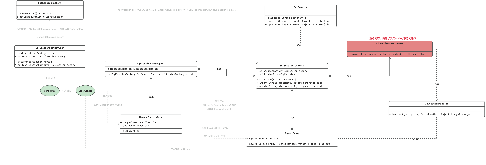

    这是Mybatis系列的第2篇文章，主要介绍的是Mybatis的执行过程。

<style>
.my-code {
   color: orange;
}
.orange {
   color: rgb(255, 53, 2)
}
.red {
   color: red
}
code {
   color: #0ABF5B;
}
</style>

# 一、Mybatis
`Mybatis`是持久层框架，通过XML或注解配置SQL映射，将Java对象与数据库操作解耦。与传统的JDBC相比，Mybatis简化了数据库交互，并提供了灵活的SQL控制能力。

<!-- more -->

# 二、MapperFactoryBean
> 工厂Bean，一种特殊的Bean。

在Mybatis的启动过程文章中，我们介绍了mapper的生成过程，回顾一下：
```java
@Service
public class OrderService {
    @Reource
    private OrderMapper orderMapper;
    @Transactional
    public synchronized void selectById() {
        orderMapper.selectByPrimaryKey(0L);
    }

    public void find() {
        this.selectById();
    }
}
```
`OrderService`注入`OrderMapper`，在创建OrderService时，会注入属性，此时会去创建OrderMapper。执行堆栈如下：
```
1. 创建 orderService
-> AbstractAutowireCapableBeanFactory.doCreateBean()
2. orderService属性注入
 -> AbstractAutowireCapableBeanFactory.populateBean()
  -> CommonAnnotationBeanPostProcessor.postProcessPropertyValues()
   -> InjectionMetadata.inject()
    -> CommonAnnotationBeanPostProcessor.getResourceToInject()
     -> CommonAnnotationBeanPostProcessor.getResource()
      -> CommonAnnotationBeanPostProcessor.autowireResource()
3. orderService属性注入，触发 orderMapper 的创建
       -> AbstractBeanFactory.getBean()
        |-> AbstractBeanFactory.doGetBean()
4. 第一步：调用getSingleton()去创建MapperFactoryBean对象
        |1 |-> DefaultSingletonBeanRegistry.getSingleton()
        |  | -> AbstractBeanFactory.getObject()
        |  |  -> AbstractAutowireCapableBeanFactory.createBean()
        |  |   -> AbstractAutowireCapableBeanFactory.doCreateBean()
                //实例化
        |  |    -> AbstractAutowireCapableBeanFactory.createBeanInstance()
        |  |     -> AbstractAutowireCapableBeanFactory.autowireConstructor()
        |  |      -> ConstructorResolver.autowireConstructor()
        |  |       -> SimpleInstantiationStrategy.instantiate()
        |  |        -> BeanUtils.instantiateClass()
					//调用MapperFactoryBean的构造函数，创建MapperFactoryBean对象
        |  |         -> Constructor.newInstance()
                //属性填充
        |  |    -> AbstractAutowireCapableBeanFactory.populateBean()
        |  |     -> AbstractNestablePropertyAccessor.setPropertyValue()
                  //创建 SqlSessionTemplate
        |  |      -> SqlSessionDaoSupport.setSqlSessionFactory()
5. 第二步：调用getObjectForBeanInstance去创建MapperProxy代理
        |2 |-> AbstractBeanFactory.getObjectForBeanInstance()
        |  | -> FactoryBeanRegistrySupport.getObjectFromFactoryBean()
        |  |  -> FactoryBeanRegistrySupport.doGetObjectFromFactoryBean()
        |  |   -> MapperFactoryBean.getObject()：重点！！！调用了工厂bean的getObject()方法
        |  |    -> SqlSessionTemplate.getMapper()
        |  |     -> Configuration.getMapper()
        |  |      -> MapperRegistry.getMapper()
        |  |       -> MapperProxyFactory.newInstance()
        |  |        -> Proxy.newProxyInstance()
```
最终，`OrderMapper`的实例创建成功（是一个<code class="red">MapperProxy对象</code>），并注入到了`OrderService`.
> 在mybatis的启动过程中，会读取mapper文件路径，为**每一个Mapper接口**都会对应一个`MapperFactoryBean`工厂bean，用于注入过程中通过该工厂bean生成代理对象，注入到目标类


# 三、MapperProxy执行过程
例如在service类中注入的mapper对象，其实是MapperProxy代理对象。

MapperProxy的源码如下，基于`JDK动态代理`实现，实现了`InvocationHandler`接口：
```java
public class MapperProxy<T> implements InvocationHandler, Serializable {
    public MapperProxy(SqlSession sqlSession, Class<T> mapperInterface, Map<Method, MapperMethod> methodCache) {
        this.sqlSession = sqlSession;
        this.mapperInterface = mapperInterface;
        this.methodCache = methodCache;
    }

    @Override
    public Object invoke(Object proxy, Method method, Object[] args) throws Throwable {
        try {
            //处理Object类方法（如toString, equals）或默认方法
            if (Object.class.equals(method.getDeclaringClass())) {
                return method.invoke(this, args);
            } else if (isDefaultMethod(method)) {
                return invokeDefaultMethod(proxy, method, args);
            }
        } catch (Throwable t) {
            throw ExceptionUtil.unwrapThrowable(t);
        }
        //获取 MapperMethod 并执行
        final MapperMethod mapperMethod = cachedMapperMethod(method);
        return mapperMethod.execute(sqlSession, args);
    }
}
```
## 3.1、MapperMethod执行SQL
`MapperMethod`根据方法类型（select、insert、update、delete）调用`SqlSession`对应方法。
```java
public Object execute(SqlSession sqlSession, Object[] args) {
    switch (command.getType()) {
        case SELECT:
            if (method.returnsVoid()) {
                executeWithResultHandler(sqlSession, args);
                return null;
            } else {
                return executeForList(sqlSession, args);
            }
        case INSERT:
            return rowCountResult(sqlSession.insert(command.getName(), param));
        // 其他类型处理...
    }
}
```

## 3.2、参数处理与SQL绑定
```java
public Object convertArgsToSqlCommandParam(Object[] args) {
  return paramNameResolver.getNamedParams(args);
}
```
- 参数转换：
通过ParamNameResolver解析@Param注解
- SQL映射匹配：
根据方法签名查找对应的MapperStatement（如UserMapper.selectById对应SQL语句）

## 3.3、sqlSession.selectOne示例
查询单个数据为例。
```java
public Object execute(SqlSession sqlSession, Object[] args) {
    Object result;
    switch (command.getType()) {
        case SELECT:
            if (method.returnsVoid() && method.hasResultHandler()) {
                executeWithResultHandler(sqlSession, args);
                result = null;
            } else if (method.returnsMany()) {
                result = executeForMany(sqlSession, args);
            } else if (method.returnsMap()) {
                result = executeForMap(sqlSession, args);
            } else if (method.returnsCursor()) {
                result = executeForCursor(sqlSession, args);
            } else {
                //查询单个结果
                Object param = method.convertArgsToSqlCommandParam(args);
                result = sqlSession.selectOne(command.getName(), param);
            }
            break;
        default:
            throw new BindingException("Unknown execution method for: " + command.getName());
    }
}
```

### 3.3.1、方法签名
```java
<T> T selectOne(String statement, Object parameter);
```
参数说明
- statement：SQL语句的唯一标识符，由namespace + id 组成。例如
```xml
<!-- XML 中的 SQL 定义 -->
<mapper namespace="com.example.mapper.UserMapper">
    <select id="selectUserById" resultType="User">
        SELECT * FROM user WHERE id = #{id}
    </select>
</mapper> 
```
对应的statement为：`com.example.mapper.UserMapper.selectUserById`
- parameter：传递的SQL参数，可以是基本类型、对象或Map


### 3.3.2、执行流程
`selectOne`的核心调用链如下：
```
MapperProxy.invoke()
│-> MapperMethod.execute()
│ │-> sqlSessionTemplate.selectOne()
│ │ │-> sqlSessionProxy.selectOne()
│ │ │ │-> SqlSessionInterceptor.invoke()
│ │ │ │ │-> DefaultSqlSession.selectOne()
│ │ │ │ │-> DefaultSqlSession.selectList()
│ │ │ │ │ │-> CachingExecutor.query()（检查二级缓存）
│ │ │ │ │ │-> BaseExecutor.query()（实际执行查询）
│ │ │ │ │ │-> BaseExecutor.queryFromDatabase()（实际执行查询）
│ │ │ │ │ │ │-> SimpleExecutor.doQuery()
│ │ │ │ │ │ │-> SimpleExecutor.prepareStatement()
│ │ │ │ │ │ │ │-> BaseExecutor.getConnection() (获取Connection)
│ │ │ │ │ │ │ │ │-> SpringManagedTransaction.getConnection()
│ │ │ │ │ │ │ │ │-> SpringManagedTransaction.openConnection()
│ │ │ │ │ │ │ │ │ │-> DataSourceUtils.getConnection()
│ │ │ │ │ │ │ │ │ │-> DataSourceUtils.doGetConnection()
│ │ │ │ │ │ │ │ │ │ │-> TransactionSynchronizationManager.getResource(dataSource)
│ │ │ │ │ │ │ │ │ │ │-> TransactionSynchronizationManager.getResource(dataSource)
│ │ │ │ │ │ │ │ │ │ │-> TransactionSynchronizationManager.getResource(dataSource)
│ │ │ │ │ │ │ │ │ │ │-> TransactionSynchronizationManager.getResource(dataSource)
│ │ │ │ │ │ │ │ │ │ │-> TransactionSynchronizationManager.getResource(dataSource)
│ │ │ │ │ │ │-> RoutingStatementHandler.prepare()
```

#### 步骤1：调用selectList
`selectOne`方法内部调用`selectList`，获取查询结果列表。
```java
public <T> T selectOne(String statement, Object parameter) {
    List<T> list = selectList(statement, parameter);
    if (list.size() == 1) {
        return list.get(0);
    } else if (list.size() > 1) {
        throw new TooManyResultsException("Expected one result (or null) to be returned by selectOne(), but found: " + list.size());
    } else {
        return null;
    }
}
```
`selectOne`的核心逻辑是通过`selectList`获取结果集后，检查结果数量并返回单个对象。

##### 1. 获取 MappedStatement：
根据 `statement`（如 `com.example.mapper.UserMapper.selectUserById`）从 `Configuration` 中获取对应的 `MappedStatement` 对象，该对象包含 SQL 配置（如 SQL 语句、参数类型、结果映射等）。
```java
public class DefaultSqlSession implements SqlSession {
    public <E> List<E> selectList(String statement, Object parameter, RowBounds rowBounds) {
        try {
            MappedStatement ms = configuration.getMappedStatement(statement);
            return executor.query(ms, wrapCollection(parameter), rowBounds, Executor.NO_RESULT_HANDLER);
        }
    }
}
```
executor.query()
```java
public abstract class BaseExecutor implements Executor {
    public <E> List<E> query(MappedStatement ms, Object parameter, RowBounds rowBounds, ResultHandler resultHandler) throws SQLException {
        BoundSql boundSql = ms.getBoundSql(parameter);
        CacheKey key = createCacheKey(ms, parameter, rowBounds, boundSql);
        return query(ms, parameter, rowBounds, resultHandler, key, boundSql);
    }
}
```

##### 2. 生成 SQL 语句：
通过 `BoundSql` 处理动态 SQL（如 `#{}` 占位符替换为 `?`）。
生成最终的 SQL 字符串（如 `SELECT * FROM user WHERE id = ?`）。
```java
public final class MappedStatement {
    public BoundSql getBoundSql(Object parameterObject) {
        BoundSql boundSql = sqlSource.getBoundSql(parameterObject);
        List<ParameterMapping> parameterMappings = boundSql.getParameterMappings();
        if (parameterMappings == null || parameterMappings.isEmpty()) {
            boundSql = new BoundSql(configuration, boundSql.getSql(), parameterMap.getParameterMappings(), parameterObject);
        }
        // check for nested result maps in parameter mappings (issue #30)
        for (ParameterMapping pm : boundSql.getParameterMappings()) {
            String rmId = pm.getResultMapId();
            if (rmId != null) {
                ResultMap rm = configuration.getResultMap(rmId);
                if (rm != null) {
                    hasNestedResultMaps |= rm.hasNestedResultMaps();
                }
            }
        }

        return boundSql;
    }
}
```
先忽略缓存

```java
public abstract class BaseExecutor implements Executor {
    public <E> List<E> query(MappedStatement ms, Object parameter, RowBounds rowBounds, ResultHandler resultHandler, CacheKey key, BoundSql boundSql) throws SQLException {
        ErrorContext.instance().resource(ms.getResource()).activity("executing a query").object(ms.getId());
        if (closed) {
            throw new ExecutorException("Executor was closed.");
        }
        if (queryStack == 0 && ms.isFlushCacheRequired()) {
            clearLocalCache();
        }
        List<E> list;
        try {
            queryStack++;
            list = resultHandler == null ? (List<E>) localCache.getObject(key) : null;
            if (list != null) {
                handleLocallyCachedOutputParameters(ms, key, parameter, boundSql);
            } else {
                list = queryFromDatabase(ms, parameter, rowBounds, resultHandler, key, boundSql);
            }
        } finally {
            queryStack--;
        }
        if (queryStack == 0) {
            for (DeferredLoad deferredLoad : deferredLoads) {
                deferredLoad.load();
            }
            // issue #601
            deferredLoads.clear();
            if (configuration.getLocalCacheScope() == LocalCacheScope.STATEMENT) {
                // issue #482
                clearLocalCache();
            }
        }
        return list;
    }
}
```

##### 3. 执行 SQL：
通过 `StatementHandler` 执行 `SQL` 查询，获取 `ResultSet`。
- `prepare`：获取Connection
- 生成statement
- 执行SQL

```java
private <E> List<E> queryFromDatabase(MappedStatement ms, Object parameter, RowBounds rowBounds, ResultHandler resultHandler, CacheKey key, BoundSql boundSql) throws SQLException {
    List<E> list;
    localCache.putObject(key, EXECUTION_PLACEHOLDER);
    try {
      list = doQuery(ms, parameter, rowBounds, resultHandler, boundSql);
    } finally {
      localCache.removeObject(key);
    }
    localCache.putObject(key, list);
    if (ms.getStatementType() == StatementType.CALLABLE) {
      localOutputParameterCache.putObject(key, parameter);
    }
    return list;
  }
```

```java
public <E> List<E> doQuery(MappedStatement ms, Object parameterObject, RowBounds rowBounds, ResultHandler resultHandler, BoundSql boundSql)
      throws SQLException {
    Statement stmt = null;
    try {
      flushStatements();
      Configuration configuration = ms.getConfiguration();
      StatementHandler handler = configuration.newStatementHandler(wrapper, ms, parameterObject, rowBounds, resultHandler, boundSql);
      Connection connection = getConnection(ms.getStatementLog());
      //生成Statement
      stmt = handler.prepare(connection, transaction.getTimeout());
      //给statement设置参数
      handler.parameterize(stmt);
      //执行Statement
      return handler.<E>query(stmt, resultHandler);
    } finally {
      closeStatement(stmt);
    }
  }
```
获取Connection
```java
protected Connection getConnection(Log statementLog) throws SQLException {
    Connection connection = transaction.getConnection();
    if (statementLog.isDebugEnabled()) {
      return ConnectionLogger.newInstance(connection, statementLog, queryStack);
    } else {
      return connection;
    }
}
public static Connection doGetConnection(DataSource dataSource) throws SQLException {
  Assert.notNull(dataSource, "No DataSource specified");

  ConnectionHolder conHolder = (ConnectionHolder) TransactionSynchronizationManager.getResource(dataSource);
  if (conHolder != null && (conHolder.hasConnection() || conHolder.isSynchronizedWithTransaction())) {
    conHolder.requested();
    if (!conHolder.hasConnection()) {
      logger.debug("Fetching resumed JDBC Connection from DataSource");
      conHolder.setConnection(dataSource.getConnection());
    }
    return conHolder.getConnection();
  }
  // Else we either got no holder or an empty thread-bound holder here.

  logger.debug("Fetching JDBC Connection from DataSource");
  Connection con = dataSource.getConnection();

  if (TransactionSynchronizationManager.isSynchronizationActive()) {
    logger.debug("Registering transaction synchronization for JDBC Connection");
    // Use same Connection for further JDBC actions within the transaction.
    // Thread-bound object will get removed by synchronization at transaction completion.
    ConnectionHolder holderToUse = conHolder;
    if (holderToUse == null) {
      holderToUse = new ConnectionHolder(con);
    }
    else {
      holderToUse.setConnection(con);
    }
    holderToUse.requested();
    TransactionSynchronizationManager.registerSynchronization(
            new ConnectionSynchronization(holderToUse, dataSource));
    holderToUse.setSynchronizedWithTransaction(true);
    if (holderToUse != conHolder) {
      TransactionSynchronizationManager.bindResource(dataSource, holderToUse);
    }
  }

  return con;
}
```


##### 4. 结果集封装：
通过 `ResultSetHandler` 将 `ResultSet` 封装为 Java 对象（如 `User` 对象）。
根据 `resultType` 或 `resultMap` 使用反射创建对象并填充属性。
关键要求：数据库字段名与对象属性名需一致，或通过别名匹配（如 `SELECT name AS username FROM ...`）。

# 四、SqlSessionFactory

## 4.1、创建时机
`SqlSessionFactoryBean`的实例化过程中执行`buildSqlSessionFactory()`方法，会创建`SqlSessionFactory`。

## 4.2、核心作用
- **创建SqlSession**：通过`openSession()`方法生成`SqlSession`实例，用于执行SQL操作。
- **管理全局配置**：解析并缓存`Mybatis`的全局配置（如数据源、类型处理器、插件等）。
- **加载映射文件**：加载所有`Mapper XML`文件，维护SQL映射关系（`MappedStatement`）


## 4.3、生命周期与线程安全
**初始化**：随应用启动一次性创建，通常为单例。
**运行期**：持续提供SqlSession实例。
是线程安全的。


# 五、SqlSession
`SqlSession`是Mybatis框架的核心接口，代表与数据库的一次会话。它封装了数据库连接（类似JDBC的Connection），并提高了执行SQL、管理事务、操作缓存等能力。

作用：
- **执行SQL**：通过`select、Insert、update、delete`等方法直接操作数据库。
- **事务管理**：通过`commit()、rollback()`控制事务提交或回滚。
- **访问mapper**：通过`getMapper()`获取Mapper接口的代理实例，实现面向对象的数据库操作。
- **缓存管理**：管理一级缓存（`SqlSession级别`）和二级缓存（`Mapper级别`）
```java
public interface SqlSession extends Closeable {
    <T> T selectOne(String statement, Object parameter);
    <E> List<E> selectList(String statement, Object parameter);
    <E> List<E> selectList(String statement, Object parameter, RowBounds rowBounds);
    <K, V> Map<K, V> selectMap(String statement, String mapKey);
    <T> Cursor<T> selectCursor(String statement, Object parameter, RowBounds rowBounds);
    void select(String statement, Object parameter, ResultHandler handler);
    int insert(String statement, Object parameter);
    int update(String statement, Object parameter);
    int delete(String statement, Object parameter);
    void commit();
    void rollback();
    void close();
    void clearCache();
    Configuration getConfiguration();
    <T> T getMapper(Class<T> type);
    Connection getConnection();
}
```


> 与SqlSessionFactory的关系
> - `创建SqlSession`： `SqlSessionFactory`是创建SqlSession的工厂，通常在应用启动时初始化
> 
> 创建流程如下（原生Mybatis）：
> ```java
> // 通过 DefaultSqlSessionFactory 的 openSession() 方法
> SqlSessionFactory sqlSessionFactory = new SqlSessionFactoryBuilder().build(inputStream);
> // 获取 SqlSession 对象。
> SqlSession sqlSession = sqlSessionFactory.openSession();
> // 获取 Mapper。
> UserMapper userMapper = sqlSession.getMapper(UserMapper.class);
> // 进行数据库查询操作
> User user = userMapper.getUser(1);
> ```


## 5.1、SqlSessionTemplate
`SqlSessionTemplate`是Mybatis-Spring整合模块中的核心组件，用于替代Mybatis原生的SqlSession，提供线程安全、事务集成及自动化资源管理能力。
```java
public class SqlSessionTemplate implements SqlSession, DisposableBean {

    private final SqlSessionFactory sqlSessionFactory;
    private final ExecutorType executorType;
    private final SqlSession sqlSessionProxy;
    private final PersistenceExceptionTranslator exceptionTranslator;
    @Override
    public <T> T selectOne(String statement, Object parameter) {
        return this.sqlSessionProxy.selectOne(statement, parameter);
    }
    @Override
    public int insert(String statement, Object parameter) {
        return this.sqlSessionProxy.insert(statement, parameter);
    }
    @Override
    public int update(String statement, Object parameter) {
        return this.sqlSessionProxy.update(statement, parameter);
    }
    @Override
    public int delete(String statement, Object parameter) {
        return this.sqlSessionProxy.delete(statement, parameter);
    }
    @Override
    public <T> T getMapper(Class<T> type) {
        return getConfiguration().getMapper(type, this);
    }
    @Override
    public void commit() {
        throw new UnsupportedOperationException("Manual commit is not allowed over a Spring managed SqlSession");
    }
    @Override
    public void rollback() {
        throw new UnsupportedOperationException("Manual rollback is not allowed over a Spring managed SqlSession");
    }
    @Override
    public Configuration getConfiguration() {
        return this.sqlSessionFactory.getConfiguration();
    }
    @Override
    public Connection getConnection() {
        return this.sqlSessionProxy.getConnection();
    }

}
```
`SqlSessionTemplate`实现`SqlSession`，提供了与原生SqlSession一致的方法，如：
- selectOne(String statement, Object parameter)
- insert(String statement, Object parameter)
- getMapper(Class<T> type)

### 5.1.1、SqlSessionTemplate创建时机
创建`MapperFactoryBean`对象后，对`MapperFactoryBean`对象进行属性填充，会调用`SqlSessionDaoSupport`类的`setSqlSessionFactory()`方法创建
```
1. 创建 orderService
-> AbstractAutowireCapableBeanFactory.doCreateBean()
2. orderService属性注入
 -> AbstractAutowireCapableBeanFactory.populateBean()
  -> CommonAnnotationBeanPostProcessor.postProcessPropertyValues()
   -> InjectionMetadata.inject()
    -> CommonAnnotationBeanPostProcessor.getResourceToInject()
     -> CommonAnnotationBeanPostProcessor.getResource()
      -> CommonAnnotationBeanPostProcessor.autowireResource()
3. orderService属性注入，触发 orderMapper 的创建
       -> AbstractBeanFactory.getBean()
        |-> AbstractBeanFactory.doGetBean()
4. 第一步：调用getSingleton()去创建MapperFactoryBean对象
        |1 |-> DefaultSingletonBeanRegistry.getSingleton()
        |  | -> AbstractBeanFactory.getObject()
        |  |  -> AbstractAutowireCapableBeanFactory.createBean()
        |  |   -> AbstractAutowireCapableBeanFactory.doCreateBean()
                //实例化MapperFactoryBean对象
        |  |    -> AbstractAutowireCapableBeanFactory.createBeanInstance()
        |  |     -> AbstractAutowireCapableBeanFactory.autowireConstructor()
        |  |      -> ConstructorResolver.autowireConstructor()
        |  |       -> SimpleInstantiationStrategy.instantiate()
        |  |        -> BeanUtils.instantiateClass()
					//调用MapperFactoryBean的构造函数，创建MapperFactoryBean对象
        |  |         -> Constructor.newInstance()
                //属性填充MapperFactoryBean对象
        |  |    -> AbstractAutowireCapableBeanFactory.populateBean()
        |  |     -> AbstractNestablePropertyAccessor.setPropertyValue()
                  //创建 SqlSessionTemplate
        |  |      -> SqlSessionDaoSupport.setSqlSessionFactory()
5. 第二步：调用getObjectForBeanInstance去创建MapperProxy代理
        |2 |-> AbstractBeanFactory.getObjectForBeanInstance()
        |  | -> FactoryBeanRegistrySupport.getObjectFromFactoryBean()
        |  |  -> FactoryBeanRegistrySupport.doGetObjectFromFactoryBean()
        |  |   -> MapperFactoryBean.getObject()：重点！！！调用了工厂bean的getObject()方法
        |  |    -> SqlSessionTemplate.getMapper()
        |  |     -> Configuration.getMapper()
        |  |      -> MapperRegistry.getMapper()
        |  |       -> MapperProxyFactory.newInstance()
        |  |        -> Proxy.newProxyInstance()
```

`SqlSessionDaoSupport`类的`setSqlSessionFactory()`方法
```java
public void setSqlSessionFactory(SqlSessionFactory sqlSessionFactory) {
    if (this.sqlSessionTemplate == null || sqlSessionFactory != this.sqlSessionTemplate.getSqlSessionFactory()) {
      this.sqlSessionTemplate = createSqlSessionTemplate(sqlSessionFactory);
    }
}

protected SqlSessionTemplate createSqlSessionTemplate(SqlSessionFactory sqlSessionFactory) {
    return new SqlSessionTemplate(sqlSessionFactory);
}
```

```java
public SqlSessionTemplate(SqlSessionFactory sqlSessionFactory) {
    this(sqlSessionFactory, sqlSessionFactory.getConfiguration().getDefaultExecutorType());
}
//SqlSessionTemplate构造函数
public SqlSessionTemplate(SqlSessionFactory sqlSessionFactory, ExecutorType executorType,
                          PersistenceExceptionTranslator exceptionTranslator) {
    notNull(sqlSessionFactory, "Property 'sqlSessionFactory' is required");
    notNull(executorType, "Property 'executorType' is required");

    this.sqlSessionFactory = sqlSessionFactory;
    this.executorType = executorType;
    this.exceptionTranslator = exceptionTranslator;
    this.sqlSessionProxy = (SqlSession) newProxyInstance(SqlSessionFactory.class.getClassLoader(),
            new Class[] { SqlSession.class }, new SqlSessionInterceptor());
}
```

### 5.1.2、SqlSession sqlSessionProxy;
```java
this.sqlSessionProxy = (SqlSession) newProxyInstance(SqlSessionFactory.class.getClassLoader(),
        new Class[] { SqlSession.class }, new SqlSessionInterceptor());
```
通过JDK动态代理，创建SqlSession的代理对象。
```java
@CallerSensitive
    public static Object newProxyInstance(ClassLoader loader,
                                          Class<?>[] interfaces,
                                          InvocationHandler h)
        throws IllegalArgumentException
    {
    Objects.requireNonNull(h);
    final Class<?>[] intfs = interfaces.clone();
    final SecurityManager sm = System.getSecurityManager();
    if (sm != null) {
        checkProxyAccess(Reflection.getCallerClass(), loader, intfs);
    }

    //
    Class<?> cl = getProxyClass0(loader, intfs);
    //
    try {
        if (sm != null) {
            checkNewProxyPermission(Reflection.getCallerClass(), cl);
        }

        final Constructor<?> cons = cl.getConstructor(constructorParams);
        final InvocationHandler ih = h;
        if (!Modifier.isPublic(cl.getModifiers())) {
            AccessController.doPrivileged(new PrivilegedAction<Void>() {
                public Void run() {
                    cons.setAccessible(true);
                    return null;
                }
            });
        }
        return cons.newInstance(new Object[]{h});
    }
}
```

## 5.2、SqlSessionInterceptor拦截器
一个**mapper代理对象**的执行逻辑如下，最终会执行拦截器`SqlSessionInterceptor`。
> orderServiceProxy.select() : <code class="my-code">orderService代理对象执行（cglib代理）</code>
> -> `DynamicAdvisedInterceptor.intercept()` ：<code class="my-code">cglib对象的拦截器执行</code>
> -> TransactionInterceptor.invoke()    ：<code class="my-code">AOP拦截器执行</code>
> -> TransactionAspectSupport.invokeWithinTransaction()：<code class="my-code">事务处理</code>
> -> MapperProxy.invoke() ：<code class="my-code">mapper代理对象执行（JDK代理）</code>
> -> MapperMethod.execute()
> -> SqlSessionTemplate.selectOne()
> -> this.sqlSessionProxy.selectOne()
> -> `SqlSessionInterceptor.invoke()`：<code class="my-code">mapper代理对象拦截器执行</code>

```java
private class SqlSessionInterceptor implements InvocationHandler {
    @Override
    public Object invoke(Object proxy, Method method, Object[] args) throws Throwable {
      SqlSession sqlSession = getSqlSession(SqlSessionTemplate.this.sqlSessionFactory,
          SqlSessionTemplate.this.executorType, SqlSessionTemplate.this.exceptionTranslator);
      try {
        Object result = method.invoke(sqlSession, args);
        if (!isSqlSessionTransactional(sqlSession, SqlSessionTemplate.this.sqlSessionFactory)) {
          // force commit even on non-dirty sessions because some databases require
          // a commit/rollback before calling close()
          sqlSession.commit(true);
        }
        return result;
      } catch (Throwable t) {
      } finally {
        if (sqlSession != null) {
          closeSqlSession(sqlSession, SqlSessionTemplate.this.sqlSessionFactory);
        }
      }
    }
}
```
核心作用，增强功能：
- `事务管理增强`
  - 可以在代理对象中添加对事务的自动管理功能。例如，确保在执行数据库操作之前自动开启事务，在操作完成后自动提交或回滚事务，而无需在每个数据库操作方法中显式地处理事务。
- `日志记录`
  - 可以在代理对象中添加日志记录功能，记录每个执行的 SQL 语句以及参数和执行时间，以便进行性能分析和故障排查。
- `缓存管理`
  - 可以增强缓存的管理功能，例如自动刷新缓存或根据特定条件清除缓存。

```java
public final class SqlSessionUtils {
    public static SqlSession getSqlSession(SqlSessionFactory sessionFactory, ExecutorType executorType,
                                           PersistenceExceptionTranslator exceptionTranslator) {
        notNull(sessionFactory, NO_SQL_SESSION_FACTORY_SPECIFIED);
        notNull(executorType, NO_EXECUTOR_TYPE_SPECIFIED);

        SqlSessionHolder holder = (SqlSessionHolder) TransactionSynchronizationManager.getResource(sessionFactory);

        SqlSession session = sessionHolder(executorType, holder);
        if (session != null) {
            return session;
        }
        LOGGER.debug(() -> "Creating a new SqlSession");
        session = sessionFactory.openSession(executorType);
        registerSessionHolder(sessionFactory, executorType, exceptionTranslator, session);
        return session;
    }
}
```
结合Spring的事务同步机制
- `TransactionSynchronizationManager`
  - Spring通过该类管理事务资源（如sqlSession），确保同一事务内多次数据库操作共享同一会话
- `SqlSessionHolder`
  - 存储当前事务绑定的sqlSession，事务提交或回滚后自动关闭


### 5.2.1、SqlSessionHolder
`SqlSessionHolder`的源码结构如下，实现了`ResourceHolder`接口
```java
public final class SqlSessionHolder extends ResourceHolderSupport {
    private final SqlSession sqlSession;

    private final ExecutorType executorType;

    private final PersistenceExceptionTranslator exceptionTranslator;
}
public abstract class ResourceHolderSupport implements ResourceHolder {
    private boolean synchronizedWithTransaction = false;

    private boolean rollbackOnly = false;

    private Date deadline;

    private int referenceCount = 0;

    private boolean isVoid = false;
}
```
`TransactionSynchronizationManager`内部获取资源时，判断是否是`ResourceHolder`类型
```java
public abstract class TransactionSynchronizationManager {
    private static Object doGetResource(Object actualKey) {
        Map<Object, Object> map = resources.get();
        if (map == null) {
            return null;
        }
        Object value = map.get(actualKey);
        // Transparently remove ResourceHolder that was marked as void...
        if (value instanceof ResourceHolder && ((ResourceHolder) value).isVoid()) {
            map.remove(actualKey);
            // Remove entire ThreadLocal if empty...
            if (map.isEmpty()) {
                resources.remove();
            }
            value = null;
        }
        return value;
    }
}
```

# 六、各对象的关联

|                       | 归属模块           | 作用                                                            | 创建时机                                                                                                   |
|-----------------------|----------------|---------------------------------------------------------------|--------------------------------------------------------------------------------------------------------|
| SqlSessionFactory     | Mybatis的原生接口   | 创建SqlSession                                                  | `SqlSessionFactoryBean`的实例化过程中执行`buildSqlSessionFactory()`方法，会创建`SqlSessionFactory`。                   |
| SqlSessionFactoryBean | Mybatis-Spring | 与Spring整合，创建`SqlSessionFactory`                               | 配置后，作为普通的一个Bean进行创建                                                                                    |
| SqlSession            | Mybatis的原生接口   | 封装数据库连接（类似JDBC的Connection），执行SQL、管理事务、操作缓存                    | 通过`SqlSessionFactory`的openSession()方法创建                                                                |
| SqlSessionTemplate    | Mybatis-Spring | Spring对`Mybatis`的`SqlSession` 的实现                             | 创建`MapperFactoryBean`后进行属性填充时，会调用`SqlSessionDaoSupport`类的`setSqlSessionFactory()`方法创建 |
| MapperFactoryBean     | Mybatis-Spring | 创建Mapper代理对象，实现`SqlSessionDaoSupport`，内部有属性`SqlSessionTemplate` |                                                                                                        |
| MapperProxy           | Mybatis | 实际注入到Service的对象，具体的执行对象                                       | `MapperFactoryBean`初始化后，执行`MapperFactoryBean`的`getObject()`方法创建                                              |


类图如下：


# 七、整体执行小结
- 首先，`<tx>`标签解析，注册`InfrastructureAdvisorAutoProxyCreator`（是一个`BeanPostProcessor`）
- 其次，实例化`OrderService`
- 其次，属性填充`OrderService`
  - 填充`OrderMapper属性
    - 先实例化`MapperFactoryBean`对象
    - 然后填充`MapperFactoryBean`对象`SqlSessionTemplate`属性（创建）
    - 最后调用`MapperFactoryBean`对象的getObject()，触发`MapperProxy`代理对象的生成
    - 最终注入到OrderService的是`MapperProxy`代理对象
- 然后，<code class="red">OrderService初始化</code>，执行`InfrastructureAdvisorAutoProxyCreator`的`postProcessAfterInitialization()`方法，内部执行`wrapIfNecessary`
  - `wrapIfNecessary`：主要2个步骤
    - `getAdvicesAndAdvisorsForBean`：筛选出适用于当前Bean的增强器（会解析@Transactonal注解）
      - `TransactionAnnotationParser`解析方法或类上的`@Transactional`注解，得到`RuleBasedTransactionAttribute`
    - `createProxy`：创建代理对象（CGLIB动态代理）
      - 代理对象设置`DynamicAdvisedInterceptor`拦截器
- 其次，执行OrderService代理对象的方法
  - 先执行代理对象拦截器：`DynamicAdvisedInterceptor`
  - 后执行AOP的拦截器：`TransactionInterceptor`，处理事务
  - 最后触发`MapperProxy`代理对象的执行
    - 内部会执行TransactionSynchronizationManager去获取Connection
    - 执行SQL

```
DefaultSqlSession#selectOne(java.lang.String, java.lang.Object)
executor.query
BaseExecutor#query
BaseExecutor#queryFromDatabase
SimpleExecutor#doQuery
SimpleExecutor#prepareStatement
内部流程1：transaction.getConnection()
SpringManagedTransaction#getConnection
SpringManagedTransaction#openConnection
DataSourceUtils.getConnection(this.dataSource)
ConnectionHolder conHolder = (ConnectionHolder) TransactionSynchronizationManager.getResource(dataSource)
内部流程2：handler.prepare
```
