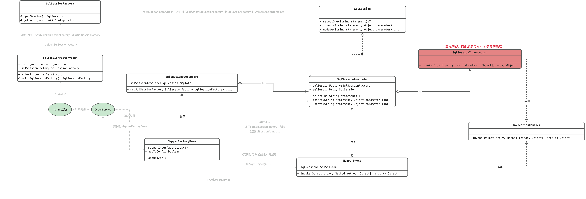

    这是Mybatis系列的第3篇文章，主要介绍的是Mybatis与spring的集成。

<style>
.my-code {
   color: orange;
}
.orange {
   color: rgb(255, 53, 2)
}
.red {
   color: red
}
code {
   color: #0ABF5B;
}
</style>

# 一、Mybatis
`Mybatis`是持久层框架，通过XML或注解配置SQL映射，将Java对象与数据库操作解耦。与传统的JDBC相比，Mybatis简化了数据库交互，并提供了灵活的SQL控制能力。

<!-- more -->


# 二、与spring集成
主要通过`MapperScannerConfigurer、SqlSessionFactoryBean、SqlSessionTemplate、MapperFactoryBean`这些类，集成到spring。

|                       | 归属模块           | 作用                                                            | 创建时机                                                                                                   |
|-----------------------|----------------|---------------------------------------------------------------|--------------------------------------------------------------------------------------------------------|
| SqlSessionFactory     | Mybatis的原生接口   | 创建SqlSession                                                  | `SqlSessionFactoryBean`的实例化过程中执行`buildSqlSessionFactory()`方法，会创建`SqlSessionFactory`。                   |
| SqlSessionFactoryBean | Mybatis-Spring | 与Spring整合，创建`SqlSessionFactory`                               | 配置后，作为普通的一个Bean进行创建                                                                                    |
| SqlSession            | Mybatis的原生接口   | 封装数据库连接（类似JDBC的Connection），执行SQL、管理事务、操作缓存                    | 通过`SqlSessionFactory`的openSession()方法创建                                                                |
| SqlSessionTemplate    | Mybatis-Spring | Spring对`Mybatis`的`SqlSession` 的实现                             | 创建`MapperFactoryBean`后进行属性填充时，会调用`SqlSessionDaoSupport`类的`setSqlSessionFactory()`方法创建 |
| MapperFactoryBean     | Mybatis-Spring | 创建Mapper代理对象，实现`SqlSessionDaoSupport`，内部有属性`SqlSessionTemplate` |                                                                                                        |
| MapperProxy           | Mybatis | 实际注入到Service的对象，具体的执行对象                                       | `MapperFactoryBean`初始化后，执行`MapperFactoryBean`的`getObject()`方法创建                                              |

类图如下：



# 三、与spring事务的集成
回顾一下**mapper代理对象**的执行逻辑如下，最终会执行拦截器`SqlSessionInterceptor`。
> orderServiceProxy.select() : <code class="my-code">orderService代理对象执行（cglib代理）</code>
> -> `DynamicAdvisedInterceptor.intercept()` ：<code class="my-code">cglib对象的拦截器执行</code>
> -> TransactionInterceptor.invoke()    ：<code class="my-code">AOP拦截器执行</code>
> -> TransactionAspectSupport.invokeWithinTransaction()：<code class="my-code">事务处理</code>
> -> MapperProxy.invoke() ：<code class="my-code">mapper代理对象执行（JDK代理）</code>
> -> MapperMethod.execute() 
> -> SqlSessionTemplate.selectOne() 
> -> this.sqlSessionProxy.selectOne() 
> -> `SqlSessionInterceptor.invoke()`：<code class="my-code">mapper代理对象拦截器执行</code>
> -> SqlSessionUtils.getSqlSession：<code class="my-code">获取sqlSession</code>
> └─> DefaultSqlSessionFactory.openSession()：<code class="my-code">创建DefaultSqlSession</code>
> └─> DefaultSqlSessionFactory.openSessionFromDataSource()
> └─> configuration.newExecutor()：<code class="my-code">创建Executor，涉及plugin的生成</code>
> -> SqlSessionUtils.registerSessionHolder：
> -> TransactionSynchronizationManager.bindResource(sessionFactory, holder); <code class="my-code">向事务同步器中绑定</code>

## 3.1、SqlSessionInterceptor拦截器
源码如下：
```java
private class SqlSessionInterceptor implements InvocationHandler {
    @Override
    public Object invoke(Object proxy, Method method, Object[] args) throws Throwable {
      SqlSession sqlSession = getSqlSession(SqlSessionTemplate.this.sqlSessionFactory,
          SqlSessionTemplate.this.executorType, SqlSessionTemplate.this.exceptionTranslator);
      try {
        Object result = method.invoke(sqlSession, args);
        if (!isSqlSessionTransactional(sqlSession, SqlSessionTemplate.this.sqlSessionFactory)) {
          // force commit even on non-dirty sessions because some databases require
          // a commit/rollback before calling close()
          sqlSession.commit(true);
        }
        return result;
      } catch (Throwable t) {
      } finally {
        if (sqlSession != null) {
          closeSqlSession(sqlSession, SqlSessionTemplate.this.sqlSessionFactory);
        }
      }
    }
}
```

## 3.2、是如何和spring事务集成的呢？
首先来看一下相关源码结构。
- `SqlSessionUtils.getSqlSession()`代码如下：
```java
public final class SqlSessionUtils {
    public static SqlSession getSqlSession(SqlSessionFactory sessionFactory, ExecutorType executorType,
                                           PersistenceExceptionTranslator exceptionTranslator) {
        notNull(sessionFactory, NO_SQL_SESSION_FACTORY_SPECIFIED);
        notNull(executorType, NO_EXECUTOR_TYPE_SPECIFIED);
        SqlSessionHolder holder = (SqlSessionHolder) TransactionSynchronizationManager.getResource(sessionFactory);
        SqlSession session = sessionHolder(executorType, holder);
        if (session != null) {
            return session;
        }
        LOGGER.debug(() -> "Creating a new SqlSession");
        //如果sqlSession为空，则使用SqlSessionFactory创建新的
        session = sessionFactory.openSession(executorType);
        //将资源注册到TransactionSynchronizationManager内。
        registerSessionHolder(sessionFactory, executorType, exceptionTranslator, session);
        return session;
    }
}
```
- `TransactionSynchronizationManager`，Spring通过该类管理事务资源（如sqlSession），确保同一事务内多次数据库操作共享同一会话
```java
public abstract class TransactionSynchronizationManager {
    //不同的平台的DB连接资源对象可能是不一样的，反映在 Spring 源码当中就是调用 TransactionSynchronizationManager#bindResource() 方法时，绑定的 DB 连接资源不同。
    //存储资源，这里的是key=DefaultSqlSessionFactory，value=
    private static final ThreadLocal<Map<Object, Object>> resources =
    new NamedThreadLocal<Map<Object, Object>>("Transactional resources");
    //存储事务同步器（回调接口）
    private static final ThreadLocal<Set<TransactionSynchronization>> synchronizations =
    new NamedThreadLocal<Set<TransactionSynchronization>>("Transaction synchronizations");
    //当前事务的名称、隔离级别、只读状态
    private static final ThreadLocal<String> currentTransactionName =
    new NamedThreadLocal<String>("Current transaction name");
    private static final ThreadLocal<Boolean> currentTransactionReadOnly =
    new NamedThreadLocal<Boolean>("Current transaction read-only status");
    private static final ThreadLocal<Integer> currentTransactionIsolationLevel =
    new NamedThreadLocal<Integer>("Current transaction isolation level");
    private static final ThreadLocal<Boolean> actualTransactionActive =
    new NamedThreadLocal<Boolean>("Actual transaction active");
}
```
- `SqlSessionHolder`，实现了`ResourceHolder`接口
```java
public final class SqlSessionHolder extends ResourceHolderSupport {
    private final SqlSession sqlSession;

    private final ExecutorType executorType;

    private final PersistenceExceptionTranslator exceptionTranslator;
}
public abstract class ResourceHolderSupport implements ResourceHolder {
    private boolean synchronizedWithTransaction = false;

    private boolean rollbackOnly = false;

    private Date deadline;

    private int referenceCount = 0;

    private boolean isVoid = false;
}
```
### 3.2.1、`TransactionSynchronizationManager`获取资源

`TransactionSynchronizationManager`内部获取资源时，判断是否是`ResourceHolder`类型
- Key：DefaultSqlSessionFactory
- value：SqlSessionHolder
  - sqlSession：DefaultSqlSession
- getResource方法如下：
```java
public abstract class TransactionSynchronizationManager {
    //此时Key=DefaultSqlSessionFactory
    public static Object getResource(Object key) {
        Object actualKey = TransactionSynchronizationUtils.unwrapResourceIfNecessary(key);
        Object value = doGetResource(actualKey);
        if (value != null && logger.isTraceEnabled()) {
            logger.trace("Retrieved value [" + value + "] for key [" + actualKey + "] bound to thread [" +
                    Thread.currentThread().getName() + "]");
        }
        return value;
    }
    private static Object doGetResource(Object actualKey) {
        Map<Object, Object> map = resources.get();
        if (map == null) {
            return null;
        }
        Object value = map.get(actualKey);
        // Transparently remove ResourceHolder that was marked as void...
        if (value instanceof ResourceHolder && ((ResourceHolder) value).isVoid()) {
            map.remove(actualKey);
            // Remove entire ThreadLocal if empty...
            if (map.isEmpty()) {
                resources.remove();
            }
            value = null;
        }
        return value;
    }
}
```

### 3.2.2、`TransactionSynchronizationManager`绑定资源
执行代码
```java
registerSessionHolder(sessionFactory, executorType, exceptionTranslator, session);

private static void registerSessionHolder(SqlSessionFactory sessionFactory, ExecutorType executorType,
                                          PersistenceExceptionTranslator exceptionTranslator, SqlSession session) {
    SqlSessionHolder holder;
    if (TransactionSynchronizationManager.isSynchronizationActive()) {
        Environment environment = sessionFactory.getConfiguration().getEnvironment();

        if (environment.getTransactionFactory() instanceof SpringManagedTransactionFactory) {
            LOGGER.debug(() -> "Registering transaction synchronization for SqlSession [" + session + "]");

            holder = new SqlSessionHolder(session, executorType, exceptionTranslator);
            TransactionSynchronizationManager.bindResource(sessionFactory, holder);
            TransactionSynchronizationManager
                    .registerSynchronization(new SqlSessionSynchronization(holder, sessionFactory));
            holder.setSynchronizedWithTransaction(true);
            holder.requested();
        } else {
            if (TransactionSynchronizationManager.getResource(environment.getDataSource()) == null) {
                LOGGER.debug(() -> "SqlSession [" + session
                        + "] was not registered for synchronization because DataSource is not transactional");
            } else {
                throw new TransientDataAccessResourceException(
                        "SqlSessionFactory must be using a SpringManagedTransactionFactory in order to use Spring transaction synchronization");
            }
        }
    } else {
        LOGGER.debug(() -> "SqlSession [" + session
                + "] was not registered for synchronization because synchronization is not active");
    }

}
```


