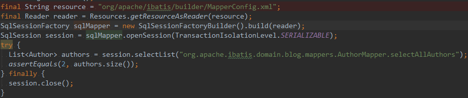
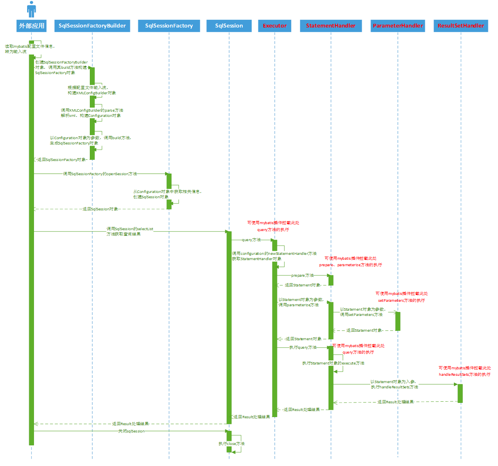

    这是Mybatis系列的第4篇文章，主要介绍的是Mybatis与plugin拦截器。

<style>
.my-code {
   color: orange;
}
.orange {
   color: rgb(255, 53, 2)
}
.red {
   color: red
}
code {
   color: #0ABF5B;
}
</style>

# 一、Mybatis
`Mybatis`是持久层框架，通过XML或注解配置SQL映射，将Java对象与数据库操作解耦。与传统的JDBC相比，Mybatis简化了数据库交互，并提供了灵活的SQL控制能力。

<!-- more -->


# 二、plugin【插件】
与其称为`Mybatis插件`，不如叫`Mybatis拦截器`，更加符合其功能定位，实际上它就是一个拦截器，应用代理模式，在方法级别上进行拦截

## 2.1、Mybatis插件典型适用场景
- `分页功能`
mybatis的分页默认是基于内存分页的（查出所有，再截取），数据量大的情况下效率较低，不过使用mybatis插件可以改变该行为，只需要拦截StatementHandler类的prepare方法，改变要执行的SQL语句为分页语句即可；
- `公共字段统一赋值`
一般业务系统都会有创建者，创建时间，修改者，修改时间四个字段，对于这四个字段的赋值，实际上可以在DAO层统一拦截处理，可以用mybatis插件拦截Executor类的update方法，对相关参数进行统一赋值即可；
- `性能监控`
对于SQL语句执行的性能监控，可以通过拦截Executor类的update, query等方法，用日志记录每个方法执行的时间；
- `其它`
其实mybatis扩展性还是很强的，基于插件机制，基本上可以控制SQL执行的各个阶段，如执行阶段，参数处理阶段，语法构建阶段，结果集处理阶段，具体可以根据项目业务来实现对应业务逻辑。


## 2.2、插件示例
首先，在`mybatis-config.xml`文件中进行配置
```xml
<configuration>

    <properties>
        <property name="dialect" value="MYSQL" />
        <property name="resultSetMaxSize" value="1000"/>
    </properties>
    <settings>
        <!-- 全局延迟加载 ,在启用延迟加载的同时，需要禁用"aggressiveLazyLoading"项 -->
        <setting name="lazyLoadingEnabled" value="false" />
        <setting name="aggressiveLazyLoading" value="false" />
        <!-- 暂时不使用cache -->
        <setting name="cacheEnabled" value="false"/>
    </settings>

    <plugins>
		//分页插件
        <plugin interceptor="com.cs.common.dsfbase.mybatis.PaginationInterceptor" />
		//
        <plugin interceptor="com.spat.dtracker.mybatis.plugin.MapperInterceptor" />
    </plugins>

</configuration>
```

实现 MyBatis 物理分页查询的插件
```java
import org.apache.ibatis.plugin.Interceptor;
import org.apache.ibatis.plugin.Intercepts;
@Intercepts({ @Signature(type = StatementHandler.class, method = "prepare", args = { Connection.class, Integer.class }) })
public class PaginationInterceptor implements Interceptor {
	@Override
	public Object intercept(Invocation invocation) throws Throwable {
		StatementHandler statementHandler = (StatementHandler) invocation.getTarget();
		MetaObject metaStatementHandler = MetaObject.forObject(statementHandler, new DefaultObjectFactory(),
				new DefaultObjectWrapperFactory(), new DefaultReflectorFactory());

		RowBounds rowBounds = (RowBounds) metaStatementHandler.getValue("delegate.rowBounds");
		if (rowBounds == null || (rowBounds.getOffset() == RowBounds.DEFAULT.getOffset()
				&& rowBounds.getLimit() == RowBounds.DEFAULT.getLimit())) {
			return invocation.proceed();
		}

		Configuration configuration = (Configuration) metaStatementHandler.getValue("delegate.configuration");
		String dialectStr = configuration.getVariables().getProperty("dialect");
		if (StringUtils.isBlank(dialectStr)) {
			LOG.warn(
					"配置文件 mybatis-config.xml 中没有指定数据库方言，无法进行物理分页查询，将使用 myBatis 默认的逻辑分页。\r\n配置方言示例：<property name=\"dialect\" value=\"MYSQL\"/>");
			return invocation.proceed();
		}

		Dialect dialect = null;
		try {
			Dialect.Type databaseType = Dialect.Type.valueOf(dialectStr.toUpperCase());
			switch (databaseType) {
				case ORACLE:
					dialect = new OracleDialect();
					break;
				case MYSQL:
					dialect = new MysqlDialect();
					break;
			}
		} catch (IllegalArgumentException e) {
			throw new DsfbaseException("方言 [" + dialectStr
					+ "] 无效，请修改配置文件 mybatis-config.xml 中 <property name=\"dialect\" /> 节点的 value 属性。");

		}

		String originalSql = (String) metaStatementHandler.getValue("delegate.boundSql.sql");
		String sql = dialect.getLimitString(originalSql, rowBounds.getOffset(), rowBounds.getLimit());
		metaStatementHandler.setValue("delegate.boundSql.sql", sql);
		metaStatementHandler.setValue("delegate.rowBounds.offset", RowBounds.NO_ROW_OFFSET);
		metaStatementHandler.setValue("delegate.rowBounds.limit", RowBounds.NO_ROW_LIMIT);
		if (LOG.isDebugEnabled()) {
			BoundSql boundSql = statementHandler.getBoundSql();
			LOG.debug("生成的分页查询 SQL： {}", boundSql.getSql());
		}
		return invocation.proceed();
	}
	@Override
	public Object plugin(Object target) {
		return Plugin.wrap(target, this);
	}
}
//创建代理对象
public class Plugin implements InvocationHandler {
    public static Object wrap(Object target, Interceptor interceptor) {
        Map<Class<?>, Set<Method>> signatureMap = getSignatureMap(interceptor);
        Class<?> type = target.getClass();
        Class<?>[] interfaces = getAllInterfaces(type, signatureMap);
        if (interfaces.length > 0) {
            return Proxy.newProxyInstance(
                    type.getClassLoader(),
                    interfaces,
                    new Plugin(target, interceptor, signatureMap));
        }
        return target;
    }
}
```

## 2.3、Mybatis插件介绍

### 2.3.1、什么是Mybatis插件#
与其称为`Mybatis插件`，不如叫`Mybatis拦截器`，更加符合其功能定位，实际上它就是一个拦截器，应用代理模式，在方法级别上进行拦截。

### 2.3.2、支持拦截的方法#
- 执行器`Executor`（update、query、commit、rollback等方法）；
- 参数处理器`ParameterHandler`（getParameterObject、setParameters方法）；
- 结果集处理器`ResultSetHandler`（handleResultSets、handleOutputParameters等方法）；
- SQL语法构建器`StatementHandler`（prepare、parameterize、batch、update、query等方法）；

### 2.3.3、拦截阶段#
那么这些类上的方法都是在什么阶段被拦截的呢？为理解这个问题，我们先看段简单的代码（摘自mybatis源码中的单元测试SqlSessionTest类），来了解下典型的mybatis执行流程，如下代码所示：

以上代码主要完成以下功能：
- 读取`mybatis`的xml配置文件信息
- 通过`SqlSessionFactoryBuilder`创建`SqlSessionFactory`对象
- 通过`SqlSessionFactory`获取`SqlSession`对象
- 执行`SqlSession`对象的`selectList`方法，查询结果
- 关闭`SqlSession`

如下是时序图，在整个时序图中，涉及到mybatis插件部分已标红，基本上就是体现在上文中提到的四个类上，对这些类上的方法进行拦截。


## 2.4、拦截器创建

### 2.4.1、Executor代理对象创建流程
回顾一下**mapper代理对象**的执行逻辑如下，最终会执行拦截器`SqlSessionInterceptor`。
> orderServiceProxy.select() : <code class="my-code">orderService代理对象执行（cglib代理）</code>
> -> `DynamicAdvisedInterceptor.intercept()` ：<code class="my-code">cglib对象的拦截器执行</code>
> -> TransactionInterceptor.invoke()    ：<code class="my-code">AOP拦截器执行</code>
> -> TransactionAspectSupport.invokeWithinTransaction()：<code class="my-code">事务处理</code>
> -> MapperProxy.invoke() ：<code class="my-code">mapper代理对象执行（JDK代理）</code>
> -> MapperMethod.execute()
> -> SqlSessionTemplate.selectOne()
> -> this.sqlSessionProxy.selectOne()
> -> `SqlSessionInterceptor.invoke()`：<code class="my-code">mapper代理对象拦截器执行</code>
> -> SqlSessionUtils.getSqlSession()：<code class="my-code">获取sqlSession</code>
> └─> DefaultSqlSessionFactory.openSession()：<code class="my-code">创建DefaultSqlSession</code>
> └─> DefaultSqlSessionFactory.openSessionFromDataSource()
> └─> <code class="red">configuration.newExecutor()：创建Executor，涉及plugin的生成</code>
> -> SqlSessionUtils.registerSessionHolder：
> -> TransactionSynchronizationManager.bindResource(sessionFactory, holder); <code class="my-code">向事务同步器中绑定</code>


在`SqlSessionUtils.getSqlSession()`执行中会去创建`Executor`执行器
```java
public Executor newExecutor(Transaction transaction, ExecutorType executorType) {
    executorType = executorType == null ? defaultExecutorType : executorType;
    executorType = executorType == null ? ExecutorType.SIMPLE : executorType;
    Executor executor;
    if (ExecutorType.BATCH == executorType) {
      executor = new BatchExecutor(this, transaction);
    } else if (ExecutorType.REUSE == executorType) {
      executor = new ReuseExecutor(this, transaction);
    } else {
      executor = new SimpleExecutor(this, transaction);
    }
    if (cacheEnabled) {
      executor = new CachingExecutor(executor);
    }
    //重点方法
    executor = (Executor) interceptorChain.pluginAll(executor);
    return executor;
  }
```
追踪`interceptorChain.pluginAll(executor)`方法，内部执行逻辑很简单，遍历拦截器，执行拦截器的`plugin()`方法
```java
public class InterceptorChain {
    public Object pluginAll(Object target) {
        for (Interceptor interceptor : interceptors) {
            target = interceptor.plugin(target);
        }
        return target;
    }
}
```
拦截器内部需要实现`plugin()`方法
```java
@Override
public Object plugin(Object target) {
	return Plugin.wrap(target, this);
}
```
继续追踪`Plugin.wrap`方法
```java
//创建代理对象
public class Plugin implements InvocationHandler {
    public static Object wrap(Object target, Interceptor interceptor) {
        Map<Class<?>, Set<Method>> signatureMap = getSignatureMap(interceptor);
        Class<?> type = target.getClass();
        Class<?>[] interfaces = getAllInterfaces(type, signatureMap);
        if (interfaces.length > 0) {
            return Proxy.newProxyInstance(
                    type.getClassLoader(),
                    interfaces,
                    new Plugin(target, interceptor, signatureMap));
        }
        return target;
    }
}
```
可以看到代码逻辑中会通过`JDK动态代理`创建代理对象：`Proxy.newProxyInstance`

### 2.4.2、StatementHandler代理对象创建流程
回顾一下**mapper代理对象**的执行逻辑如下，最终会执行拦截器`SqlSessionInterceptor`。
> orderServiceProxy.select() : <code class="my-code">orderService代理对象执行（cglib代理）</code>
> -> `DynamicAdvisedInterceptor.intercept()` ：<code class="my-code">cglib对象的拦截器执行</code>
> -> TransactionInterceptor.invoke()    ：<code class="my-code">AOP拦截器执行</code>
> -> TransactionAspectSupport.invokeWithinTransaction()：<code class="my-code">事务处理</code>
> -> MapperProxy.invoke() ：<code class="my-code">mapper代理对象执行（JDK代理）</code>
> -> MapperMethod.execute()
> -> SqlSessionTemplate.selectOne()
> -> this.sqlSessionProxy.selectOne()
> -> `SqlSessionInterceptor.invoke()`：<code class="my-code">mapper代理对象拦截器执行</code>
> -> SqlSessionUtils.getSqlSession()：<code class="my-code">获取sqlSession</code>
> └─> DefaultSqlSessionFactory.openSession()：<code class="my-code">创建DefaultSqlSession</code>
> └─> DefaultSqlSessionFactory.openSessionFromDataSource()
> └─> configuration.newExecutor()：<code class="my-code">创建Executor，涉及plugin的生成</code>
> -> `SimpleExecutor.doQuery()`：
> └─> <code class="red">configuration.newStatementHandler：创建StatementHandler，涉及plugin的生成</code>


```java
public StatementHandler newStatementHandler(Executor executor, MappedStatement mappedStatement, Object parameterObject, RowBounds rowBounds, ResultHandler resultHandler, BoundSql boundSql) {
    StatementHandler statementHandler = new RoutingStatementHandler(executor, mappedStatement, parameterObject, rowBounds, resultHandler, boundSql);
    statementHandler = (StatementHandler) interceptorChain.pluginAll(statementHandler);
    return statementHandler;
  }
```


### 2.4.3、ParameterHandler & ResultSetHandler 代理对象创建流程
回顾一下**mapper代理对象**的执行逻辑如下，最终会执行拦截器`SqlSessionInterceptor`。
> orderServiceProxy.select() : <code class="my-code">orderService代理对象执行（cglib代理）</code>
> -> `DynamicAdvisedInterceptor.intercept()` ：<code class="my-code">cglib对象的拦截器执行</code>
> -> TransactionInterceptor.invoke()    ：<code class="my-code">AOP拦截器执行</code>
> -> TransactionAspectSupport.invokeWithinTransaction()：<code class="my-code">事务处理</code>
> -> MapperProxy.invoke() ：<code class="my-code">mapper代理对象执行（JDK代理）</code>
> -> MapperMethod.execute()
> -> SqlSessionTemplate.selectOne()
> -> this.sqlSessionProxy.selectOne()
> -> `SqlSessionInterceptor.invoke()`：<code class="my-code">mapper代理对象拦截器执行</code>
> -> SqlSessionUtils.getSqlSession()：<code class="my-code">获取sqlSession</code>
> └─> DefaultSqlSessionFactory.openSession()：<code class="my-code">创建DefaultSqlSession</code>
> └─> DefaultSqlSessionFactory.openSessionFromDataSource()
> └─> configuration.newExecutor()：<code class="my-code">创建Executor，涉及plugin的生成</code>
> -> `SimpleExecutor.doQuery()`：
> └─> configuration.newStatementHandler：<code class="my-code">创建StatementHandler，涉及plugin的生成</code>
> └────> BaseStatementHandler.<init>
> └──────> <code class="red">configuration.newParameterHandler()</code>
> └──────> <code class="red">configuration.newResultSetHandler()</code>

`ParameterHandler & ResultSetHandler`，会在`BaseStatementHandler`构造函数中进行创建。

## 2.5、拦截器的执行
之前的章节，我们解析了拦截器代理对象的生成。 `Executor, StatementHandler, ParameterHandler, ResultSetHandler`都会创建相应的代理对象，所以在执行方法时，首先调用的是Plugin类（实现了InvocationHandler接口）的invoke方法，如下：


参考文章：
https://www.cnblogs.com/chenpi/p/10498921.html
