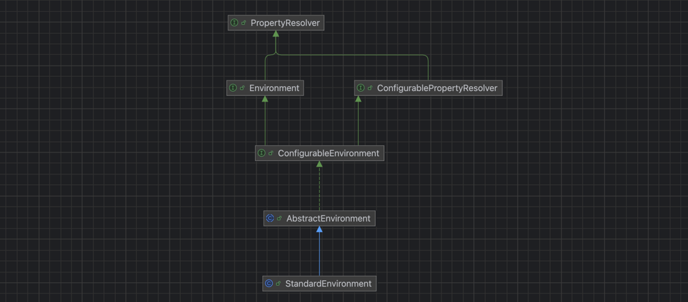

    这是springboot系列的第1篇文章，主要介绍的是springboot的启动过程。

<style>
.my-code {
   color: orange;
}
.orange {
   color: rgb(255, 53, 2)
}
.red {
   color: red
}
code {
   color: #0ABF5B;
}
</style>

# 一、springboot
`springboot`是一个基于spring框架的快速开发脚手架，旨在简化spring应用的初始搭建和开发过程。其核心思想是<code class="red">约定优于配置</code>，通过自动配置、起步依赖（starter）等机制大幅减少开发者的配置工作。
<!-- more -->

- <code class="red">脚手架</code>：指springboot提供的一整套开箱即用的工具和框架。脚手架的主要体现
  - **自动配置（`auto-Configuration`）**：springboot会根据项目中引入的依赖（如`spring-boot-starter-web`），自动配置相应的组件。例如如果项目依赖了`spring-boot-starter-web`，springboot会自动集成Tomcat作为内嵌服务器，无需手动部署到外部容器（如单独安装的Tomcat）。
  - **starter依赖**：springboot提供了一系列`spring-boot-starter-XXX`依赖（如`spring-boot-starter-web、spring-boot-starter-Mybatis`），这些依赖已经预置了常用的版本和基础配置，避免了手动管理依赖巴巴的繁琐。
- <code class="red">约定大于配置</code>
  - **默认配置文件**：springboot会自动默认加载`src/main/resources`目录下的`application.properties`或`application.yml`，无需在代码中指定配置文件路径。
  - **环境特定配置**：springboot通过扫描类路径下的`META-INF/spring.factories`文件，自动加载配置类（如`SpringBootApplication`启动类所在包下的`@Configuration`类），实现Bean的自动注册。
  - **条件化配置**：通过@Conditional配置，springboot会根据条件（如是否存在某个类、某个属性是否配置）动态启用或禁用配置。
  - **路径和包结构约定**：
    - **默认包扫描规则**：springboot启动类所在包及其子包会被自动扫描，无需显示配置`@ComponentScan`
    - **静态资源和模板路径**：默认静态资源路径为`src/main/resources/static`或`src/main/resources/public`，模板文件（如Thymeleaf）默认放在`src/main/resources/templates`。

# 二、springboot示例

```java
@SpringBootApplication
public class MyApp {
    public static void main(String[] args) {
        SpringApplication.run(MyApp.class, args);
    }
}
```
`@SpringBootApplication`是复合注解，包含
- `@SpringBootConfiguration`：标识为配置类
- `@EnableAutoConfiguration`：启用自动配置
- `@ComponentScan(excludeFilters = { @Filter(type = FilterType.CUSTOM, classes = TypeExcludeFilter.class), @Filter(type = FilterType.CUSTOM, classes = AutoConfigurationExcludeFilter.class) })`
  - 扫描当前包及其子包的组件

# 三、`SpringApplication.run` 启动流程解析


## 第一步：初始化SpringApplication
`new SpringApplication(primarySources)`

构造函数如下：
```java
public SpringApplication(ResourceLoader resourceLoader, Class<?>... primarySources) {
    this.resourceLoader = resourceLoader;
    Assert.notNull(primarySources, "PrimarySources must not be null");
    this.primarySources = new LinkedHashSet<>(Arrays.asList(primarySources));
    this.webApplicationType = WebApplicationType.deduceFromClasspath();
    this.bootstrapRegistryInitializers = new ArrayList<>(
            getSpringFactoriesInstances(BootstrapRegistryInitializer.class));
    setInitializers((Collection) getSpringFactoriesInstances(ApplicationContextInitializer.class));
    setListeners((Collection) getSpringFactoriesInstances(ApplicationListener.class));
    this.mainApplicationClass = deduceMainApplicationClass();
}
```
在SpringApplication实例初始化的时候，它会提前做几件事情：
1. 判断创建的`ApplicationContext`类型
2. 使用`SpringFactoriesLoader`在应用的`classpath`中查找并加载所有可用的`BootstrapRegistryInitializer`。
3. 使用`SpringFactoriesLoader`在应用的`classpath`中查找并加载所有可用的`ApplicationContextInitializer`。
4. 使用`SpringFactoriesLoader`在应用的`classpath`中查找并加载所有可用的`ApplicationListener`。

### 内部流程1：判断创建的ApplicationContext类型
执行`this.webApplicationType = WebApplicationType.deduceFromClasspath()`，根据`classpath`里面是否存在某个特征类`org.springframework.web.context.ConfigurableWebApplicationContext`来决定是否应该创建一个为Web应用使用的`ApplicationContext`类型。
```java
private static final String[] SERVLET_INDICATOR_CLASSES = { "javax.servlet.Servlet",
        "org.springframework.web.context.ConfigurableWebApplicationContext" };
private static final String WEBMVC_INDICATOR_CLASS = "org.springframework.web.servlet.DispatcherServlet";
private static final String WEBFLUX_INDICATOR_CLASS = "org.springframework.web.reactive.DispatcherHandler";
private static final String JERSEY_INDICATOR_CLASS = "org.glassfish.jersey.servlet.ServletContainer";

static WebApplicationType deduceFromClasspath() {
  if (ClassUtils.isPresent(WEBFLUX_INDICATOR_CLASS, null) && !ClassUtils.isPresent(WEBMVC_INDICATOR_CLASS, null)
          && !ClassUtils.isPresent(JERSEY_INDICATOR_CLASS, null)) {
    return WebApplicationType.REACTIVE;
  }
  for (String className : SERVLET_INDICATOR_CLASSES) {
    if (!ClassUtils.isPresent(className, null)) {
      return WebApplicationType.NONE;
    }
  }
  return WebApplicationType.SERVLET;
}
```

### 内部流程2：加载`BootstrapRegistryInitializer`
执行`getSpringFactoriesInstances(BootstrapRegistryInitializer.class);`方法，逻辑如下：
- 方法功能：从`META-INF/spring.factories`文件中加载指定接口的实现类。
- `type`：BootstrapRegistryInitializer.class
```java
private <T> Collection<T> getSpringFactoriesInstances(Class<T> type, Class<?>[] parameterTypes, Object... args) {
    ClassLoader classLoader = getClassLoader();
    // Use names and ensure unique to protect against duplicates
    //加载 工厂类
    Set<String> names = new LinkedHashSet<>(SpringFactoriesLoader.loadFactoryNames(type, classLoader));
    //创建 工厂类
    List<T> instances = createSpringFactoriesInstances(type, parameterTypes, classLoader, args, names);
    AnnotationAwareOrderComparator.sort(instances);
    return instances;
}
```

> `BootstrapRegistryInitializer`作用：
> - 提前注册BootstrapRegistry中的组件（如环境变量解析器、配置源等）。
> - 在spring上下文初始化之前，预先准备基础设施（如密钥管理、云平台配置）。
> - 适用于需要极早初始化的组件


首先执行`SpringFactoriesLoader.loadFactoryNames(type, classLoader)`
- 该方法是spring框架中用于加载**工厂类**的核心方法，在springboot的自动配置机制中起到关键作用：
- `type`：BootstrapRegistryInitializer.class
```java
public final class SpringFactoriesLoader {
    public static List<String> loadFactoryNames(Class<?> factoryType, @Nullable ClassLoader classLoader) {
        ClassLoader classLoaderToUse = classLoader;
        if (classLoaderToUse == null) {
            classLoaderToUse = SpringFactoriesLoader.class.getClassLoader();
        }
        String factoryTypeName = factoryType.getName();
        return loadSpringFactories(classLoaderToUse).getOrDefault(factoryTypeName, Collections.emptyList());
    }

    public static final String FACTORIES_RESOURCE_LOCATION = "META-INF/spring.factories";
    
    private static Map<String, List<String>> loadSpringFactories(ClassLoader classLoader) {
        //代码简化后
      //扫描 classpath 上所有 JAR 中的文件 META-INF/spring.factories
      Enumeration<URL> urls = classLoader.getResources(FACTORIES_RESOURCE_LOCATION);
      while (urls.hasMoreElements()) {
        URL url = urls.nextElement();
        UrlResource resource = new UrlResource(url);
        //解析文件内容：找到的每个 META-INF/spring.factories 文件都是一个 Properties 文件，将其内容加载到一个 Properties 对象然后处理其中的每个属性
        Properties properties = PropertiesLoaderUtils.loadProperties(resource);
        for (Map.Entry<?, ?> entry : properties.entrySet()) {
          String factoryTypeName = ((String) entry.getKey()).trim();
          String[] factoryImplementationNames =
                  StringUtils.commaDelimitedListToStringArray((String) entry.getValue());
          for (String factoryImplementationName : factoryImplementationNames) {
              //将实现类名存入Map
            result.computeIfAbsent(factoryTypeName, key -> new ArrayList<>())
                    .add(factoryImplementationName.trim());
          }
        }
      }
    }
}
```

### 内部流程3：查找并加载所有可用的`ApplicationContextInitializer`
还是执行`getSpringFactoriesInstances(ApplicationContextInitializer.class);`方法，执行逻辑和`BootstrapRegistryInitializer`一样。

### 内部流程4：查找并加载所有可用的`ApplicationListener`
还是执行`getSpringFactoriesInstances(ApplicationListener.class);`方法，执行逻辑和`BootstrapRegistryInitializer`一样。


版本变化与兼容性：
- springboot 2.7+：逐步弃用`spring.factories`，改为使用`META-INFO/spring/org.springframework.boot.autoconfigure.AutoConfiguration.imports`定义自动配置类。
- 例外：`BootstrapRegistryInitializer、ApplicationContextInitializer`等扔通过`spring.factories`加载。


## 第二步：运行SpringApplication.run()方法

```java
public ConfigurableApplicationContext run(String... args) {
    long startTime = System.nanoTime();
    DefaultBootstrapContext bootstrapContext = createBootstrapContext();
    ConfigurableApplicationContext context = null;
    configureHeadlessProperty();
    SpringApplicationRunListeners listeners = getRunListeners(args);
    listeners.starting(bootstrapContext, this.mainApplicationClass);
    try {
        ApplicationArguments applicationArguments = new DefaultApplicationArguments(args);
        ConfigurableEnvironment environment = prepareEnvironment(listeners, bootstrapContext, applicationArguments);
        configureIgnoreBeanInfo(environment);
        Banner printedBanner = printBanner(environment);
        context = createApplicationContext();
        context.setApplicationStartup(this.applicationStartup);
        prepareContext(bootstrapContext, context, environment, listeners, applicationArguments, printedBanner);
        refreshContext(context);
        afterRefresh(context, applicationArguments);
        Duration timeTakenToStartup = Duration.ofNanos(System.nanoTime() - startTime);
        if (this.logStartupInfo) {
            new StartupInfoLogger(this.mainApplicationClass).logStarted(getApplicationLog(), timeTakenToStartup);
        }
        listeners.started(context, timeTakenToStartup);
        callRunners(context, applicationArguments);
    }
    return context;
}
```

### 内部流程1：获取并启动`SpringApplicationRunListener`
`SpringApplicationRunListener`的主要作用是
- **监听应用启动的各个阶段**：在应用启动的不同阶段（如环境准备、上下文创建、启动完成等）触发回调方法。
- **插入自定义逻辑**：在特定阶段执行自定义操作，例如日志记录、资源初始化、配置验证等。
- **扩展启动流程**：通过监听器扩展springboot的默认启动行为，而无需修改框架源码。


### 内部流程2：prepareEnvironment()
方法分析：准备应用上下文环境

加载SpringBoot配置环境(`ConfigurableEnvironment`)，如果是通过web容器发布，会加载`StandardEnvironment`，其最终也是继承了`ConfigurableEnvironment`，类图如下

可以看出，`*Environment`最终都实现了`PropertyResolver`接口，我们平时通过`environment`对象获取配置文件中指定`Key`对应的`value`方法时，就是调用了`propertyResolver`接口的`getProperty`方法

### 内部流程3：createApplicationContext();
方法分析：实例化应用上下文，也在此创建了ioc容器
```java
this.applicationContextFactory.create(this.webApplicationType);
```
根据`初始化SpringBootApplication阶段`判断创建的`ApplicationContext`类型去创建具体的上下文对象。
```java
public AnnotationConfigServletWebServerApplicationContext() {
    this.reader = new AnnotatedBeanDefinitionReader(this);
    this.scanner = new ClassPathBeanDefinitionScanner(this);
}
```
`AnnotationConfigServletWebServerApplicationContext`是springboot中用于**基于注解配置的web应用**的核心容器类。它继承自`AnnotationConfigWebApplicationContext`，并进一步集成了对`servlet web`服务器（如`Tomcat、jetty`）的支持。
- `AnnotatedBeanDefinitionReader`：用于读取和注册**基于注解的Bean定义**，例如通过`@Configuration`类中`@Bean`方法定义的Bean。
- `ClassPathBeanDefinitionScanner`：用于扫描类路径，自动发现带有组件注解（如`@Component、@Service、@Repository、@Controller、@RestController`）的类，并将他们注册为spring Bean。


#### 1.AnnotatedBeanDefinitionReader
```java
public AnnotatedBeanDefinitionReader(BeanDefinitionRegistry registry, Environment environment) {
    Assert.notNull(registry, "BeanDefinitionRegistry must not be null");
    Assert.notNull(environment, "Environment must not be null");
    this.registry = registry;
    this.conditionEvaluator = new ConditionEvaluator(registry, environment, null);
    AnnotationConfigUtils.registerAnnotationConfigProcessors(this.registry);
}
```
跟踪代码，执行`AnnotationConfigUtils.registerAnnotationConfigProcessors(this.registry);`
```java
public static final String CONFIGURATION_ANNOTATION_PROCESSOR_BEAN_NAME =
        "org.springframework.context.annotation.internalConfigurationAnnotationProcessor";
public static Set<BeanDefinitionHolder> registerAnnotationConfigProcessors(
			BeanDefinitionRegistry registry, @Nullable Object source) {
    //省略部分代码
    Set<BeanDefinitionHolder> beanDefs = new LinkedHashSet<>(8);
    //重点：注册ConfigurationClassPostProcessor
    if (!registry.containsBeanDefinition(CONFIGURATION_ANNOTATION_PROCESSOR_BEAN_NAME)) {
        RootBeanDefinition def = new RootBeanDefinition(ConfigurationClassPostProcessor.class);
        def.setSource(source);
        beanDefs.add(registerPostProcessor(registry, def, CONFIGURATION_ANNOTATION_PROCESSOR_BEAN_NAME));
    }
  //重点：注册AutowiredAnnotationBeanPostProcessor
    if (!registry.containsBeanDefinition(AUTOWIRED_ANNOTATION_PROCESSOR_BEAN_NAME)) {
        RootBeanDefinition def = new RootBeanDefinition(AutowiredAnnotationBeanPostProcessor.class);
        def.setSource(source);
        beanDefs.add(registerPostProcessor(registry, def, AUTOWIRED_ANNOTATION_PROCESSOR_BEAN_NAME));
    }
    // Check for JSR-250 support, and if present add the CommonAnnotationBeanPostProcessor.
    if (jsr250Present && !registry.containsBeanDefinition(COMMON_ANNOTATION_PROCESSOR_BEAN_NAME)) {
        RootBeanDefinition def = new RootBeanDefinition(CommonAnnotationBeanPostProcessor.class);
        def.setSource(source);
        beanDefs.add(registerPostProcessor(registry, def, COMMON_ANNOTATION_PROCESSOR_BEAN_NAME));
    }
    // Check for JPA support, and if present add the PersistenceAnnotationBeanPostProcessor.
    if (jpaPresent && !registry.containsBeanDefinition(PERSISTENCE_ANNOTATION_PROCESSOR_BEAN_NAME)) {
        RootBeanDefinition def = new RootBeanDefinition();
        try {
            def.setBeanClass(ClassUtils.forName(PERSISTENCE_ANNOTATION_PROCESSOR_CLASS_NAME,
                    AnnotationConfigUtils.class.getClassLoader()));
        }
        beanDefs.add(registerPostProcessor(registry, def, PERSISTENCE_ANNOTATION_PROCESSOR_BEAN_NAME));
    }
    if (!registry.containsBeanDefinition(EVENT_LISTENER_PROCESSOR_BEAN_NAME)) {
        RootBeanDefinition def = new RootBeanDefinition(EventListenerMethodProcessor.class);
        def.setSource(source);
        beanDefs.add(registerPostProcessor(registry, def, EVENT_LISTENER_PROCESSOR_BEAN_NAME));
    }
    if (!registry.containsBeanDefinition(EVENT_LISTENER_FACTORY_BEAN_NAME)) {
        RootBeanDefinition def = new RootBeanDefinition(DefaultEventListenerFactory.class);
        def.setSource(source);
        beanDefs.add(registerPostProcessor(registry, def, EVENT_LISTENER_FACTORY_BEAN_NAME));
    }

    return beanDefs;
}
```
注册了几个`BeanPostProcessor`
- `ConfigurationClassPostProcessor`
  - **作用**：处理`@Configuration`类，解析`@Bean`方法、`@ComponentScan、@Import、@PropertySource`等注解。
  - **触发阶段**：在容器刷新（`refresh()`）时执行，加载所有配置类并生成对应的Bean定义。
- `AutowiredAnnotationBeanPostProcessor`
  - **作用**：处理`@Autowired、@Value、@Inject`等注解，实现依赖注入。
  - **触发阶段**：在Bean实例化后、属性填充阶段执行。
- `CommonAnnotationBeanPostProcessor`
  - **作用**：处理JSR-250注解（如`@PostConstruct、@PreDestroy`）和JAX-WS注解（如`@Resource`）。
  - **触发阶段**：在Bean初始化前后执行。
- `EventListenerMethodProcessor`
  - 解析@EventListener注解，将标注的方法注册为事件监听器。
- `DefaultEventListenerFactory`
  - 配合`EventListenerMethodProcessor`，创建事件监听器的适配器实例。


#### 2.ClassPathBeanDefinitionScanner


### 内部流程4：prepareContext
方法分析：准备上下文阶段，负责在容器刷新（refresh()）前完成环境配置、初始化器执行、主类注册等关键步骤。
```java
private void prepareContext(DefaultBootstrapContext bootstrapContext, ConfigurableApplicationContext context,
			ConfigurableEnvironment environment, SpringApplicationRunListeners listeners,
			ApplicationArguments applicationArguments, Banner printedBanner) {
    context.setEnvironment(environment);
    //应用后处理（post-processing）：设置资源加载器、设置类型转换器
    postProcessApplicationContext(context);
    applyInitializers(context);
    listeners.contextPrepared(context);
    // 注册特殊单例
    ConfigurableListableBeanFactory beanFactory = context.getBeanFactory();
    beanFactory.registerSingleton("springApplicationArguments", applicationArguments);
    if (printedBanner != null) {
        beanFactory.registerSingleton("springBootBanner", printedBanner);
    }
    if (beanFactory instanceof AbstractAutowireCapableBeanFactory) {
        ((AbstractAutowireCapableBeanFactory) beanFactory).setAllowCircularReferences(this.allowCircularReferences);
        if (beanFactory instanceof DefaultListableBeanFactory) {
            ((DefaultListableBeanFactory) beanFactory)
                    .setAllowBeanDefinitionOverriding(this.allowBeanDefinitionOverriding);
        }
    }
    if (this.lazyInitialization) {
        context.addBeanFactoryPostProcessor(new LazyInitializationBeanFactoryPostProcessor());
    }
    context.addBeanFactoryPostProcessor(new PropertySourceOrderingBeanFactoryPostProcessor(context));
    // Load the sources
    Set<Object> sources = getAllSources();
    Assert.notEmpty(sources, "Sources must not be empty");
    load(context, sources.toArray(new Object[0]));
    listeners.contextLoaded(context);
}
```
- `postProcessApplicationContext`
方法分析：对应用上下文进行后置处理。它在 Spring Boot 的启动过程中被调用，可以用于在应用上下文创建后进行一些额外的初始化或配置操作
- `applyInitializers(context)`
方法分析：执行初始化器的初始化方法。典型用途：添加自定义属性源、注册特殊Bean
```java
for (ApplicationContextInitializer initializer : initializers) {
    initializer.initialize(context);
}
```
- `load(context, sources.toArray(new Object[0]))`
  - 方法分析：加载**启动类**并组织好它的beanDefinition，只是添加了启动类的BeanDefinition
  - 因为我们传入的source是主启动类，所以会走参数为class的重载方法，又因为我们的主启动类间接的有@Component注解所以会执行annotatedReader.register方法。下面我们看一下这个register方法做了什么
    - 会new一个beanDefinitionLoader去load这个source，从而生成一个beanDefinition

```text
1. 绑定环境 → 2. 后处理配置 → 3. 执行初始化器 → 4. 发布初始化事件 → 
5. 注册主类 → 6. 加载其他配置 → 7. 注册命令行参数 → 8. 加载附加资源 → 9. 发布准备完成事件
```

### 内部流程5：refreshContext()
在上下文准备完成后，调用`AbstractApplicationContext.refresh()`触发容器刷新，加载所有Bean定义并初始化单例。

## 第三步：容器刷新：refresh()

### 1：obtainFreshBeanFactory()
获取Bean工厂

### 2：invokeBeanFactoryPostProcessors()
方法解析：执行工厂的后置处理器
```java
protected void invokeBeanFactoryPostProcessors(ConfigurableListableBeanFactory beanFactory) {
    PostProcessorRegistrationDelegate.invokeBeanFactoryPostProcessors(beanFactory, getBeanFactoryPostProcessors());

    // Detect a LoadTimeWeaver and prepare for weaving, if found in the meantime
    // (e.g. through an @Bean method registered by ConfigurationClassPostProcessor)
    if (!NativeDetector.inNativeImage() && beanFactory.getTempClassLoader() == null && beanFactory.containsBean(LOAD_TIME_WEAVER_BEAN_NAME)) {
        beanFactory.addBeanPostProcessor(new LoadTimeWeaverAwareProcessor(beanFactory));
        beanFactory.setTempClassLoader(new ContextTypeMatchClassLoader(beanFactory.getBeanClassLoader()));
    }
}
```
追踪代码，执行`PostProcessorRegistrationDelegate.invokeBeanFactoryPostProcessors(beanFactory, getBeanFactoryPostProcessors());`，该方法是spring处理所有`BeanFactoryPostProcessor`的核心逻辑，负责按优先级和类型触发后处理器的回调。这些后处理器可以修改或增强容器的Bean定义，是spring扩展机制的关键环境。
- `BeanDefinitionRegistryPostProcessor`是`BeanFactoryPostProcessor`的子类。
```java
简化后代码如下：
final class PostProcessorRegistrationDelegate {
  public static void invokeBeanFactoryPostProcessors(
          ConfigurableListableBeanFactory beanFactory,
          List<BeanFactoryPostProcessor> beanFactoryPostProcessors
  ) {
    // 1. 处理 BeanDefinitionRegistryPostProcessor（优先级分阶段处理）
    if (beanFactory instanceof BeanDefinitionRegistry) {
      BeanDefinitionRegistry registry = (BeanDefinitionRegistry) beanFactory;

      // 先处理手动注册的 BeanDefinitionRegistryPostProcessor（非通过 Bean 定义）
      for (BeanFactoryPostProcessor postProcessor : beanFactoryPostProcessors) {
        if (postProcessor instanceof BeanDefinitionRegistryPostProcessor) {
          ((BeanDefinitionRegistryPostProcessor) postProcessor)
                  .postProcessBeanDefinitionRegistry(registry);
        }
      }
      // 处理通过 Bean 定义注册的 BeanDefinitionRegistryPostProcessor
      String[] postProcessorNames = beanFactory.getBeanNamesForType(
              BeanDefinitionRegistryPostProcessor.class, true, false);

      // 按 PriorityOrdered → Ordered → 其他 的顺序处理
      List<BeanDefinitionRegistryPostProcessor> priorityOrderedPostProcessors = new ArrayList<>();
      for (String ppName : postProcessorNames) {
        if (beanFactory.isTypeMatch(ppName, PriorityOrdered.class)) {
          priorityOrderedPostProcessors.add(beanFactory.getBean(ppName, BeanDefinitionRegistryPostProcessor.class));
        }
      }
      sortPostProcessors(priorityOrderedPostProcessors, beanFactory);
      registryProcessors.addAll(priorityOrderedPostProcessors);
      //重点：调用ConfigurationClassPostProcessor.postProcessBeanDefinitionRegistry()方法
      invokeBeanDefinitionRegistryPostProcessors(priorityOrderedPostProcessors, registry);

      // 重复上述逻辑处理 Ordered 和其他 PostProcessor
      // ...
    }

    // 2. 处理普通 BeanFactoryPostProcessor
    String[] postProcessorNames = beanFactory.getBeanNamesForType(BeanFactoryPostProcessor.class, true, false);
    List<BeanFactoryPostProcessor> orderedPostProcessors = new ArrayList<>();
    for (String ppName : postProcessorNames) {
      if (beanFactory.isTypeMatch(ppName, Ordered.class)) {
        orderedPostProcessors.add(beanFactory.getBean(ppName, BeanFactoryPostProcessor.class));
      }
    }
    sortPostProcessors(orderedPostProcessors, beanFactory);
    invokeBeanFactoryPostProcessors(orderedPostProcessors, beanFactory);

    // 3. 调用所有 BeanDefinitionRegistryPostProcessor 的 postProcessBeanFactory()
    invokeBeanFactoryPostProcessors(registryProcessors, beanFactory);
  }
}
```

#### 典型应用场景
1. 自动配置类解析
- 处理器：<code class="red">ConfigurationClassPostProcessor.postProcessBeanDefinitionRegistry()</code>：实现BeanDefinitionRegistryPostProcessor和PriorityOrdered
- 作用：解析@Configuration类，注册@Bean方法、组件扫描结果等
2. 属性占位符替换
- 处理器：PropertySourcesPlaceholderConfigurer.postProcessBeanFactory()：普通BeanFactoryPostProcessor

执行顺序总结：
```text
1. 手动注册的 BeanDefinitionRegistryPostProcessor（通过 SpringApplication.addBeanFactoryPostProcessor()）
2. 所有实现 PriorityOrdered 的 BeanDefinitionRegistryPostProcessor
3. 所有实现 Ordered 的 BeanDefinitionRegistryPostProcessor
4. 剩余的 BeanDefinitionRegistryPostProcessor
5. 所有 BeanDefinitionRegistryPostProcessor 的 postProcessBeanFactory()
6. 手动注册的普通 BeanFactoryPostProcessor
7. 实现 PriorityOrdered 的 BeanFactoryPostProcessor
8. 实现 Ordered 的 BeanFactoryPostProcessor
9. 剩余的普通 BeanFactoryPostProcessor
```


重点关注：<code class="red">ConfigurationClassPostProcessor，自动装配</code>类，后续专门章节说明


### 3：onRefresh();
执行`ServletWebServerApplicationContext.onRefresh()`方法
```java
protected void onRefresh() {
    super.onRefresh();
    try {
        createWebServer();
    }
    catch (Throwable ex) {
        throw new ApplicationContextException("Unable to start web server", ex);
    }
}
```

重点关注：<code class="red">createWebServer()</code>，后续专门章节说明


### 4：finishBeanFactoryInitialization()
完成Bean的实例化

### 5：finishRefresh()

重点关注：`内置Tomcat的启动`


# 四、小结
在容器刷新方法`refresh()`中，`invokeBeanFactoryPostProcessors(beanFactory)`;会触发`ConfigurationClassPostProcessor`类的创建和执行。
- 自动装配：`ConfigurationClassPostProcessor`类