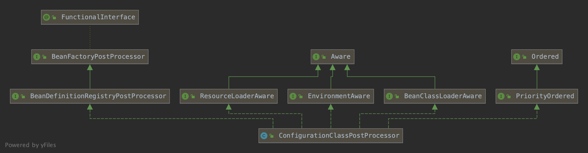

    这是springboot系列的第2篇文章，主要介绍的是springboot的自动装配。

<style>
.my-code {
   color: orange;
}
.orange {
   color: rgb(255, 53, 2)
}
.red {
   color: red
}
code {
   color: #0ABF5B;
}
</style>

# 一、springboot
`springboot`是一个基于spring框架的快速开发脚手架，旨在简化spring应用的初始搭建和开发过程。其核心思想是<code class="red">约定优于配置</code>，通过自动配置、起步依赖（starter）等机制大幅减少开发者的配置工作。
<!-- more -->

- <code class="red">脚手架</code>：指springboot提供的一整套开箱即用的工具和框架。脚手架的主要体现
  - **自动配置（`auto-Configuration`）**：springboot会根据项目中引入的依赖（如`spring-boot-starter-web`），自动配置相应的组件。例如如果项目依赖了`spring-boot-starter-web`，springboot会自动集成Tomcat作为内嵌服务器，无需手动部署到外部容器（如单独安装的Tomcat）。
  - **starter依赖**：springboot提供了一系列`spring-boot-starter-XXX`依赖（如`spring-boot-starter-web、spring-boot-starter-Mybatis`），这些依赖已经预置了常用的版本和基础配置，避免了手动管理依赖巴巴的繁琐。
- <code class="red">约定大于配置</code>
  - **默认配置文件**：springboot会自动默认加载`src/main/resources`目录下的`application.properties`或`application.yml`，无需在代码中指定配置文件路径。
  - **环境特定配置**：springboot通过扫描类路径下的`META-INF/spring.factories`文件，自动加载配置类（如`SpringBootApplication`启动类所在包下的`@Configuration`类），实现Bean的自动注册。
  - **条件化配置**：通过`@Conditional`配置，springboot会根据条件（如是否存在某个类、某个属性是否配置）动态启用或禁用配置。
  - **路径和包结构约定**：
    - **默认包扫描规则**：springboot启动类所在包及其子包会被自动扫描，无需显示配置`@ComponentScan`
    - **静态资源和模板路径**：默认静态资源路径为`src/main/resources/static`或`src/main/resources/public`，模板文件（如Thymeleaf）默认放在`src/main/resources/templates`。

# 二、自动装配入口
> <code class="red">ConfigurationClassPostProcessor</code>是自动装配入口。

在容器刷新方法`refresh()`中，`invokeBeanFactoryPostProcessors(beanFactory)`;会触发`ConfigurationClassPostProcessor`类的创建和执行。

`ConfigurationClassPostProcessor`是spring容器中处理基于注解的配置类（如`@Configuration、@ComponentScan、@Bean`）的核心处理器，属于`BeanDefinitionRegistryPostProcessor`的实现类。
```java
public class ConfigurationClassPostProcessor implements BeanDefinitionRegistryPostProcessor,
		PriorityOrdered, ResourceLoaderAware, ApplicationStartupAware, BeanClassLoaderAware, EnvironmentAware {
  @Override
  public void postProcessBeanDefinitionRegistry(BeanDefinitionRegistry registry) {
    int registryId = System.identityHashCode(registry);
    if (this.registriesPostProcessed.contains(registryId)) {
      throw new IllegalStateException(
              "postProcessBeanDefinitionRegistry already called on this post-processor against " + registry);
    }
    if (this.factoriesPostProcessed.contains(registryId)) {
      throw new IllegalStateException(
              "postProcessBeanFactory already called on this post-processor against " + registry);
    }
    this.registriesPostProcessed.add(registryId);

    processConfigBeanDefinitions(registry);
  }
  @Override
  public void postProcessBeanFactory(ConfigurableListableBeanFactory beanFactory) {
    int factoryId = System.identityHashCode(beanFactory);
    if (this.factoriesPostProcessed.contains(factoryId)) {
      throw new IllegalStateException(
              "postProcessBeanFactory already called on this post-processor against " + beanFactory);
    }
    this.factoriesPostProcessed.add(factoryId);
    if (!this.registriesPostProcessed.contains(factoryId)) {
      // BeanDefinitionRegistryPostProcessor hook apparently not supported...
      // Simply call processConfigurationClasses lazily at this point then.
      processConfigBeanDefinitions((BeanDefinitionRegistry) beanFactory);
    }

    enhanceConfigurationClasses(beanFactory);
    beanFactory.addBeanPostProcessor(new ImportAwareBeanPostProcessor(beanFactory));
  }
}
```
发挥作用和执行逻辑就在于两个PostProcessor的方法,分别是`postProcessBeanFactory`和`postProcessBeanDefinitionRegistry`.


## 2.1、`postProcessBeanDefinitionRegistry`执行逻辑 
`postProcessBeanDefinitionRegistry`内部主要执行`processConfigBeanDefinitions(registry)`方法
```java
public class ConfigurationClassPostProcessor implements BeanDefinitionRegistryPostProcessor,
        PriorityOrdered, ResourceLoaderAware, BeanClassLoaderAware, EnvironmentAware {
  /**
   * 构建和验证一个类是否被@Configuration修饰，并做相关的解析工作
   * 如果你对此方法了解清楚了，那么Springboot的自动装配原理就清楚了
   */
  public void processConfigBeanDefinitions(BeanDefinitionRegistry registry) {

    // 创建存放BeanDefinitionHolder的对象集合
    List<BeanDefinitionHolder> configCandidates = new ArrayList<>();
    // 当前registry就是DefaultListableBeanFactory，获取所有已经注册的BeanDefinition的beanName
    String[] candidateNames = registry.getBeanDefinitionNames();

    //----------------第一步-----------------
    // 遍历所有要处理的beanDefinition的名称,筛选对应的被注解修饰的beanDefinition
    for (String beanName : candidateNames) {
      // 获取指定名称的BeanDefinition对象
      BeanDefinition beanDef = registry.getBeanDefinition(beanName);

      // 判断当前BeanDefinition是否是一个配置类，并为BeanDefinition设置属性为lite或者full，此处设置属性值是为了后续进行调用
      // 如果Bean被 @Configuration 注解标记则为full。如果加了@Bean、@Component、@ComponentScan、@Import、@ImportResource注解，则设置为lite
      // 如果配置类上被 @Order注解标注，则设置BeanDefinition的order属性值
      if (ConfigurationClassUtils.checkConfigurationClassCandidate(beanDef, this.metadataReaderFactory)) {
        // 添加候选解析类到集合中
        configCandidates.add(new BeanDefinitionHolder(beanDef, beanName));
      }
    }
    // 根据注册Bean 的 @Order 优先级排序 
    configCandidates.sort((bd1, bd2) -> {
      int i1 = ConfigurationClassUtils.getOrder(bd1.getBeanDefinition());
      int i2 = ConfigurationClassUtils.getOrder(bd2.getBeanDefinition());
      return (i1 < i2) ? -1 : (i1 > i2) ? 1 : 0;
    });

    //----------------第二步-----------------
    // 解析每一个被 @Configuration注解标记的Class
    ConfigurationClassParser parser = new ConfigurationClassParser(
            this.metadataReaderFactory, this.problemReporter, this.environment,
            this.resourceLoader, this.componentScanBeanNameGenerator, registry);
    // 存放相关的BeanDefinitionHolder对象
    Set<BeanDefinitionHolder> candidates = new LinkedHashSet<>(configCandidates);
    // 存放扫描包下的所有bean
    Set<ConfigurationClass> alreadyParsed = new HashSet<>(configCandidates.size());
    do {
      // 解析带有@Controller、@Import、@ImportResource、@ComponentScan、@ComponentScans、@Bean的BeanDefinition
      parser.parse(candidates);
      // 将解析完的Configuration配置类进行校验，1、配置类不能是final，2、@Bean修饰的方法必须可以重写以支持CGLIB
      parser.validate();

      // 获取所有的bean,包括扫描的bean对象，@Import导入的bean对象
      Set<ConfigurationClass> configClasses = new LinkedHashSet<>(parser.getConfigurationClasses());
      // 清除掉已经解析处理过的配置类
      configClasses.removeAll(alreadyParsed);

      // Read the model and create bean definitions based on its content
      // 判断读取器是否为空，如果为空的话，就创建完全填充好的ConfigurationClass实例的读取器
      if (this.reader == null) {
        this.reader = new ConfigurationClassBeanDefinitionReader(
                registry, this.sourceExtractor, this.resourceLoader, this.environment,
                this.importBeanNameGenerator, parser.getImportRegistry());
      }


      //----------------第三步-----------------
      // 核心方法，将完全填充好的ConfigurationClass实例转化为BeanDefinition注册入IOC容器
      this.reader.loadBeanDefinitions(configClasses);
      // 添加到已经处理的集合中
      alreadyParsed.addAll(configClasses);

      candidates.clear();


      //----------------第四步-----------------
      // 这里判断registry.getBeanDefinitionCount() > candidateNames.length的目的是为了知道reader.loadBeanDefinitions(configClasses)这一步有没有            // 向BeanDefinitionMap中添加新的BeanDefinition
      // 实际上就是看配置类(例如XXXConfig类会向BeanDefinitionMap中添加bean)
      // 如果有，registry.getBeanDefinitionCount()就会大于candidateNames.length
      // 这样就需要再次遍历新加入的BeanDefinition，并判断这些bean是否已经被解析过了，如果未解析，需要重新进行解析
      // 这里的XXXConfig类向容器中添加的bean，实际上在parser.parse()这一步已经全部被解析了
      if (registry.getBeanDefinitionCount() > candidateNames.length) {
        String[] newCandidateNames = registry.getBeanDefinitionNames();
        Set<String> oldCandidateNames = new HashSet<>(Arrays.asList(candidateNames));
        Set<String> alreadyParsedClasses = new HashSet<>();
        for (ConfigurationClass configurationClass : alreadyParsed) {
          alreadyParsedClasses.add(configurationClass.getMetadata().getClassName());
        }
        // 如果有未解析的类，则将其添加到candidates中，这样candidates不为空，就会进入到下一次的while的循环中
        for (String candidateName : newCandidateNames) {
          if (!oldCandidateNames.contains(candidateName)) {
            BeanDefinition bd = registry.getBeanDefinition(candidateName);
            if (ConfigurationClassUtils.checkConfigurationClassCandidate(bd, this.metadataReaderFactory) &&
                    !alreadyParsedClasses.contains(bd.getBeanClassName())) {
              candidates.add(new BeanDefinitionHolder(bd, candidateName));
            }
          }
        }
        candidateNames = newCandidateNames;
      }
    }
    while (!candidates.isEmpty());
  }
}
```
上面的代码比较长，但流程很清晰，总结一下
1. 查找spring容器中的配置类bean定义，存储`候选列表`
2. 使用<code class="red">ConfigurationClassParser解析器</code>，解析`候选列表`中的配置类bean定义，根据配置的扫描范围把相关的类都解析为`ConfigurationClass`对象(其中`@CommpentScan`下扫描的类直接注册bean定义)
3. 使用读取器，读取上一步解析出的新未解析`ConfigurationClass`，注册相关bean定义
4. 清空`候选列表`
5. 继续查询spring容器，如果有新增的配置类bean定义，读取加入`候选列表`，跳转回第2步

### 筛选出`@Configuration`注解
`ConfigurationClassUtils.checkConfigurationClassCandidate(beanDef, this.metadataReaderFactory)`，找出来被`@Configuration`标注的BeanDefinition并加入到代处理集合`configCandidates`
```java
abstract class ConfigurationClassUtils {
    public static boolean checkConfigurationClassCandidate(BeanDefinition beanDef, MetadataReaderFactory metadataReaderFactory) {
        String className = beanDef.getBeanClassName();
        if (className == null || beanDef.getFactoryMethodName() != null) {
            return false;
        }
        // .... 省略
      
        // 如果注解了 @Configuration 则标记为full
        if (isFullConfigurationCandidate(metadata)) {
            beanDef.setAttribute(CONFIGURATION_CLASS_ATTRIBUTE, CONFIGURATION_CLASS_FULL);
        }
        // 如果不是接口、并且被@Component、@ComponentScan、@Import、@ImportResource 注解标记，则记为lite
        else if (isLiteConfigurationCandidate(metadata)) {
            beanDef.setAttribute(CONFIGURATION_CLASS_ATTRIBUTE, CONFIGURATION_CLASS_LITE);
        } else {
            return false;
        }

        // 设置处理的优先级
        Integer order = getOrder(metadata);
        if (order != null) {
            beanDef.setAttribute(ORDER_ATTRIBUTE, order);
        }
        return true;
    }
}
```


## 2.2、`ConfigurationClassParser`解析器
解析(parse)的重点责任就是根据传入的参数(bean定义列表)转化为`Map<ConfigurationClass, ConfigurationClass>`，下面重点分析分析方法：<code class="red">parse</code>方法:
```java
public void parse(Set<BeanDefinitionHolder> configCandidates) {
	// 循环
	for (BeanDefinitionHolder holder : configCandidates) {
		// 获取bean定义
		BeanDefinition bd = holder.getBeanDefinition();
		try {
			// 根据bean定义的类型走不通参数的重载parse方法
			if (bd instanceof AnnotatedBeanDefinition) {
				parse(((AnnotatedBeanDefinition) bd).getMetadata(), holder.getBeanName());
			}
			else if (bd instanceof AbstractBeanDefinition && ((AbstractBeanDefinition) bd).hasBeanClass()) {
				parse(((AbstractBeanDefinition) bd).getBeanClass(), holder.getBeanName());
			}
			else {
				parse(bd.getBeanClassName(), holder.getBeanName());
			}
		}
		// 省略catch...
	}
    //重点：延迟ImportSelectorHandler执行
	this.deferredImportSelectorHandler.process();
}
```
因为是多bean定义参数，所以这里主要是循环再根据不同类型**走重载的parse方法**，这些重载方法主要是适配各种情况，最终都会根据bean定义生成一个`ConfigurationClass`对象传入`processConfigurationClass()`方法
```java
protected final void parse(@Nullable String className, String beanName) throws IOException {
    Assert.notNull(className, "No bean class name for configuration class bean definition");
    MetadataReader reader = this.metadataReaderFactory.getMetadataReader(className);
    processConfigurationClass(new ConfigurationClass(reader, beanName), DEFAULT_EXCLUSION_FILTER);
}

protected final void parse(Class<?> clazz, String beanName) throws IOException {
    processConfigurationClass(new ConfigurationClass(clazz, beanName), DEFAULT_EXCLUSION_FILTER);
}

protected final void parse(AnnotationMetadata metadata, String beanName) throws IOException {
    processConfigurationClass(new ConfigurationClass(metadata, beanName), DEFAULT_EXCLUSION_FILTER);
}
```

### 2.2.1、processConfigurationClass
`processConfigurationClass`这个方法贴主要代码
```java
do {
	sourceClass = doProcessConfigurationClass(configClass, sourceClass, filter);
}
while (sourceClass != null);
// 
this.configurationClasses.put(configClass, configClass);
```
又是一个循环，调用`doProcessConfigurationClass`方法，如果有返回值，递归调用`doProcessConfigurationClass`，看spring的注释说递归解析配置类和他的父类，所以这代码的意思就是解析配置类，如果有父类再解析父类，如果父类有父类再一直解析下去。

最后`this.configurationClasses.put(configClass, configClass);`就是把上一步根据bean定义生成的`ConfigurationClass`对象存入解析的结果`map：configurationClasses`，**实际上，对解析结果的添加只有这一处代码**

重点在`doProcessConfigurationClass`方法

### 2.2.2、doProcessConfigurationClass
重点来到了`doProcessConfigurationClass`方法：
```java
protected final SourceClass doProcessConfigurationClass(
		ConfigurationClass configClass, SourceClass sourceClass, Predicate<String> filter)
		throws IOException {
	if (configClass.getMetadata().isAnnotated(Component.class.getName())) {
		// 1.内部类  这一步看看有没有内部类
		processMemberClasses(configClass, sourceClass, filter);
	}

	// 2.@PropertySource 这一步解析@PropertySource注解，更改配置文件位置时会使用，一般使用默认位置，不咋更改
	for (AnnotationAttributes propertySource : AnnotationConfigUtils.attributesForRepeatable(
			sourceClass.getMetadata(), PropertySources.class,
			org.springframework.context.annotation.PropertySource.class)) {
		if (this.environment instanceof ConfigurableEnvironment) {
			processPropertySource(propertySource);
		}
		// 省略...
	}

	// 3.@ComponentScan 这一步就很重要了，解析@ComponentScan注解
	Set<AnnotationAttributes> componentScans = AnnotationConfigUtils.attributesForRepeatable(
			sourceClass.getMetadata(), ComponentScans.class, ComponentScan.class);
	if (!componentScans.isEmpty() &&
			!this.conditionEvaluator.shouldSkip(sourceClass.getMetadata(), ConfigurationPhase.REGISTER_BEAN)) {
		for (AnnotationAttributes componentScan : componentScans) {
			// 开始扫描，把@ComponentScan指定包下的@Component类全部扫描出来，并且会注册bean定义至容器
			Set<BeanDefinitionHolder> scannedBeanDefinitions =
					this.componentScanParser.parse(componentScan, sourceClass.getMetadata().getClassName());
			// 把所有扫描到的beanClass递归解析
			for (BeanDefinitionHolder holder : scannedBeanDefinitions) {
				BeanDefinition bdCand = holder.getBeanDefinition().getOriginatingBeanDefinition();
				if (bdCand == null) {
					// 获取bean定义
					bdCand = holder.getBeanDefinition();
				}
				//判断是不是配置类
				if (ConfigurationClassUtils.checkConfigurationClassCandidate(bdCand, this.metadataReaderFactory)) {
					// 解析
					parse(bdCand.getBeanClassName(), holder.getBeanName());
				}
			}
		}
	}

	// 4.@Import 解析@Import注解
	processImports(configClass, sourceClass, getImports(sourceClass), filter, true);

	// 5.@ImportResource解析@ImportResource解析
	AnnotationAttributes importResource =
			AnnotationConfigUtils.attributesFor(sourceClass.getMetadata(), ImportResource.class);
	if (importResource != null) {
		String[] resources = importResource.getStringArray("locations");
		Class<? extends BeanDefinitionReader> readerClass = importResource.getClass("reader");
		for (String resource : resources) {
			String resolvedResource = this.environment.resolveRequiredPlaceholders(resource);
			configClass.addImportedResource(resolvedResource, readerClass);
		}
	}

	// 6.@Bean 解析带有@Bean注解的方法，加入到configClass的beanMethods属性中
	Set<MethodMetadata> beanMethods = retrieveBeanMethodMetadata(sourceClass);
	for (MethodMetadata methodMetadata : beanMethods) {
		configClass.addBeanMethod(new BeanMethod(methodMetadata, configClass));
	}

	// 6.接口@Bean 解析实现的接口中带有@Bean注解的默认方法，加入到configClass的beanMethods属性中
	processInterfaces(configClass, sourceClass);

	// 7.父类 如果有父类返回父类，以继续解析
	if (sourceClass.getMetadata().hasSuperClass()) {
		String superclass = sourceClass.getMetadata().getSuperClassName();
		if (superclass != null && !superclass.startsWith("java") &&
				!this.knownSuperclasses.containsKey(superclass)) {
			this.knownSuperclasses.put(superclass, configClass);
			// Superclass found, return its annotation metadata and recurse
			return sourceClass.getSuperClass();
		}
	}

	// 没有父类，解析结束
	return null;
}
```
这个方法很长，主要包含以下几个功能
- 解析内部类
- 解析`@PropertySource`注解
- 解析`@ComponentScan`注解，扫描指定包下的所有`@Component`类，直接注册bean定义至spring，并递归解析
- 解析`@Import`注解
- 解析`@ImportResource`注解
- 解析`@Bean`
- 解析实现接口中的`@Bean`
- 返回父类


#### 2.2.2.1、解析@ComponentScan
```java
Set<BeanDefinitionHolder> scannedBeanDefinitions =
                    this.componentScanParser.parse(componentScan, sourceClass.getMetadata().getClassName());
```
这个`componentScanParser`内部有个`scaner(扫描器)`，扫描`@Component`注解的类，包括子注解`@Configuration，@Service`等(这过程还会直接把扫描到的类注册bean定义)

循环判断扫描到的类是否是`ConfigurationClass`，如果是则**递归解析**
```java
// 如果是ConfigurationClass
if (ConfigurationClassUtils.checkConfigurationClassCandidate(bdCand, this.metadataReaderFactory)) {
    // 解析
    parse(bdCand.getBeanClassName(), holder.getBeanName());
}
```

#### 2.2.2.2、【重点】解析@Import注解
```java
processImports(configClass, sourceClass, getImports(sourceClass), filter, true);
```
这个也**比较重要**，参数`getImports()`方法获取到了当前配置类所有`@Import`注解指定的类集合，然后进入`processImports()`

`getImports()`方法获取所有使用了`@Import`注解引入的类的信息（类的全限定名称）
```java
private Set<SourceClass> getImports(SourceClass sourceClass) throws IOException {
    Set<SourceClass> imports = new LinkedHashSet<>();
    Set<SourceClass> visited = new LinkedHashSet<>();
    collectImports(sourceClass, imports, visited);
    return imports;
}
private void collectImports(SourceClass sourceClass, Set<SourceClass> imports, Set<SourceClass> visited)
        throws IOException {

  if (visited.add(sourceClass)) {
    for (SourceClass annotation : sourceClass.getAnnotations()) {
      String annName = annotation.getMetadata().getClassName();
      if (!annName.equals(Import.class.getName())) {
        collectImports(annotation, imports, visited);
      }
    }
    imports.addAll(sourceClass.getAnnotationAttributes(Import.class.getName(), "value"));
  }
}
```
将上一步获取到的集合传给`processImports()`方法
```java
private void processImports(ConfigurationClass configClass, SourceClass currentSourceClass,
		Collection<SourceClass> importCandidates, Predicate<String> exclusionFilter,
		boolean checkForCircularImports) {
	// 省略...
	// 循环所有@Import指定的类
	for (SourceClass candidate : importCandidates) {
		// 如果这个类实现了ImportSelector，即导入多个类
		if (candidate.isAssignable(ImportSelector.class)) {
			// 实例化这个导入的ImportSelector类
			ImportSelector selector = ParserStrategyUtils.instantiateClass(candidateClass, ImportSelector.class,
							this.environment, this.resourceLoader, this.registry);
			// 省略一些过滤...
			// 如果是延迟导入，交给deferredImportSelectorHandler处理
			if (selector instanceof DeferredImportSelector) {
				this.deferredImportSelectorHandler.handle(configClass, (DeferredImportSelector) selector);
			}
			// 普通的多个导入
			else {
				// 找到导入的多个类
				String[] importClassNames = selector.selectImports(currentSourceClass.getMetadata());
				Collection<SourceClass> importSourceClasses = asSourceClasses(importClassNames, exclusionFilter);
				// 递归调用当前方法
				processImports(configClass, currentSourceClass, importSourceClasses, exclusionFilter, false);
			}
		}
		// 如果这个类实现了ImportBeanDefinitionRegistrar
		else if (candidate.isAssignable(ImportBeanDefinitionRegistrar.class)) {
			// 实例化这个ImportBeanDefinitionRegistrar类
			ImportBeanDefinitionRegistrar registrar =
							ParserStrategyUtils.instantiateClass(candidateClass, ImportBeanDefinitionRegistrar.class,
									this.environment, this.resourceLoader, this.registry);
			// 加入该类到当前配置类解析对象ConfigurationClass的importBeanDefinitionRegistrars列表属性中
			configClass.addImportBeanDefinitionRegistrar(registrar, currentSourceClass.getMetadata());
		}
		// 排除上面两种情况，这个类就是个普通类
		else {
			// 省略...
			// 递归解析这个类
			processConfigurationClass(candidate.asConfigClass(configClass), exclusionFilter);
		}
	}
}
```
实例化`ImportSelector`类
- 如果是延迟导入，交给`deferredImportSelectorHandler`处理：
  - `this.deferredImportSelectorHandler.handle(configClass, (DeferredImportSelector) selector)`
  - 执行时机：在`ConfigurationClassParser.parse()`方法尾部，执行。
- 否则，执行其`selectImports()`方法


#### 2.2.2.3、解析@ImportResource注解
主要为了兼容之前的xml写法，不做研究

#### 2.2.2.4、解析@Bean
`@Bean`注解一般经常使用，使用工厂方法创建一个bean，一般就是`@Configuration+@Bean`，当然`@Component+@Bean`也可以
```java
// 获取所有@Bean注解方法
Set<MethodMetadata> beanMethods = retrieveBeanMethodMetadata(sourceClass);
// 包装成BeanMethod加入到配置类beanMethods属性中
for (MethodMetadata methodMetadata : beanMethods) {
	configClass.addBeanMethod(new BeanMethod(methodMetadata, configClass));
}
```
这里通过解析当前配置类`@Bean`方法，并将方法打包为`BeanMethod`存入配置类`beanMethods`属性中


#### 2.2.2.5、解析实现接口中的@Bean
这是对`@Bean`注解的一个扩展，解析配置类实现的接口中带有`@Bean`注解的默认方法，即某个配置类实现的接口有`@Bean`注解也会和普通的`@Bean`方法一样被加入到配置类`beanMethods`属性中


## 2.3、`ConfigurationClassBeanDefinitionReader`读取器
主要任务就是把`parser`解析出的`ConfigurationClass`集合读取并转换为bean定义，并最终注册到spring容器
```java
public void loadBeanDefinitions(Set<ConfigurationClass> configurationModel) {
	TrackedConditionEvaluator trackedConditionEvaluator = new TrackedConditionEvaluator();
	// 循环ConfigurationClass集合
	for (ConfigurationClass configClass : configurationModel) {
		// 读取ConfigurationClass并注册bean定义
		loadBeanDefinitionsForConfigurationClass(configClass, trackedConditionEvaluator);
	}
}
```
但是上面parser已经把@ComponentScan扫描到的配置类注册完了，reader注册什么呐，看一下loadBeanDefinitionsForConfigurationClass代码是如何注册每个ConfigurationClass对象的
```java
private void loadBeanDefinitionsForConfigurationClass(
		ConfigurationClass configClass, TrackedConditionEvaluator trackedConditionEvaluator) {

	// 省略的

	// 注册被Import引入的类，标识ConfigurationClass.isImported==true
	if (configClass.isImported()) {
		registerBeanDefinitionForImportedConfigurationClass(configClass);
	}
	// 注册@Bean的工厂方法，存储在ConfigurationClass.beanMethods属性中
	for (BeanMethod beanMethod : configClass.getBeanMethods()) {
		loadBeanDefinitionsForBeanMethod(beanMethod);
	}

	// ImportedResource(忽略)
	loadBeanDefinitionsFromImportedResources(configClass.getImportedResources());
	// 执行ImportBeanDefinitionRegistrar实现注册用户自定义bean定义，存储在ConfigurationClass.importBeanDefinitionRegistrars属性中
	loadBeanDefinitionsFromRegistrars(configClass.getImportBeanDefinitionRegistrars());
}
```

# 三、小结
`ConfigurationClassPostProcessor`是自动装配入口，通过`ConfigurationClassParser`解析器
- 解析内部类
- 解析`@PropertySource`注解
- 解析`@ComponentScan`注解，扫描指定包下的所有`@Component`类，直接注册bean定义至spring，并递归解析
- 解析`@Import`注解
- 解析`@ImportResource`注解
- 解析`@Bean`
- 解析实现接口中的`@Bean`
- 返回父类

解析`@Import`注解后，生成`ImportSelector`，根据`selector`类型
- 如果是延迟导入，交给`deferredImportSelectorHandler`处理：
  - `this.deferredImportSelectorHandler.handle(configClass, (DeferredImportSelector) selector)`
- 否则，执行其`selectImports()`方法


接下来还需详细解析`ImportSelector`。


参考文章：
https://juejin.cn/post/7164272494625423373#heading-15
