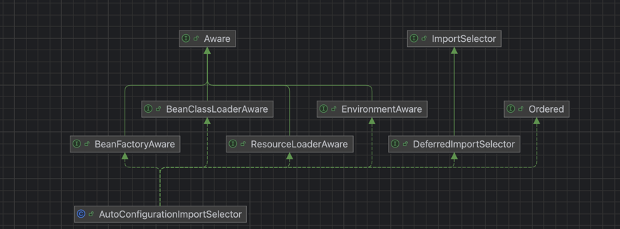
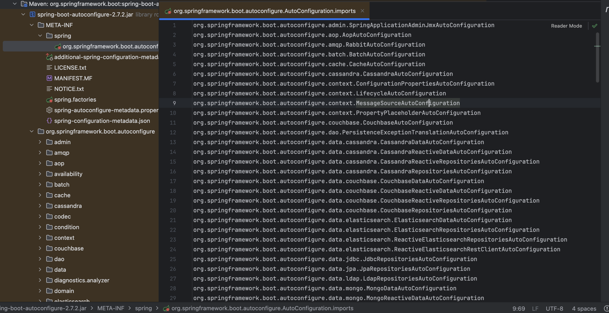
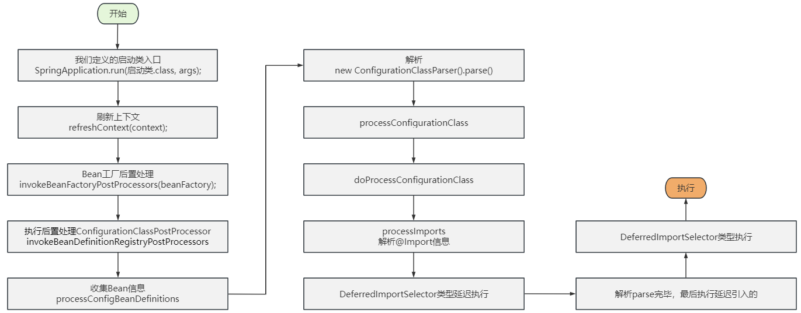
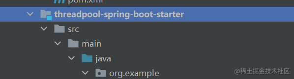
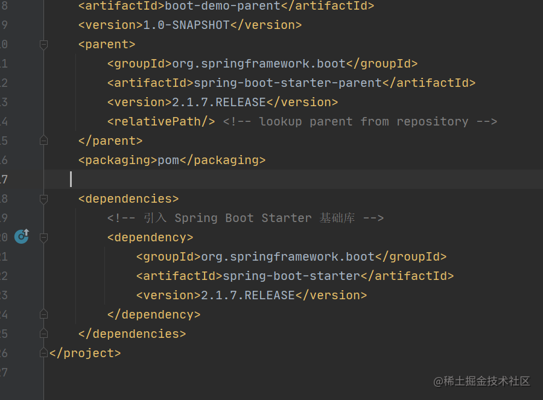
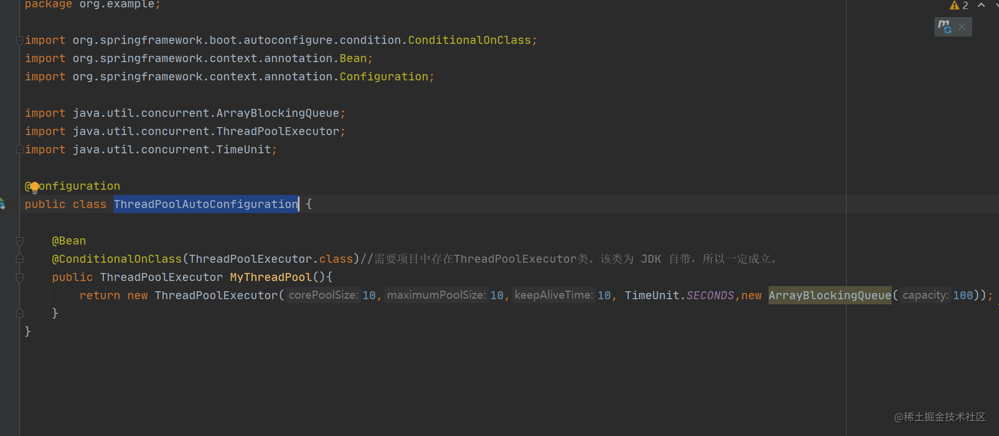
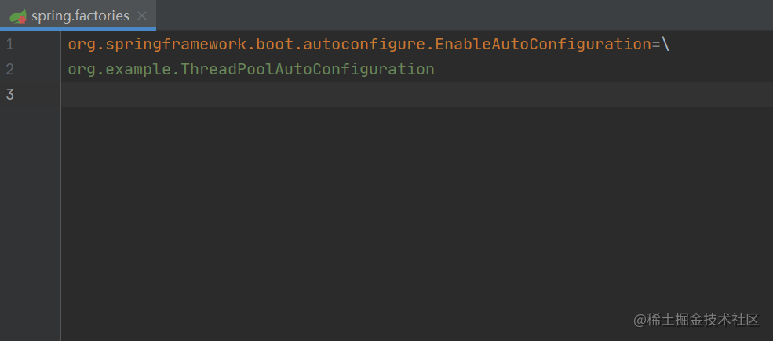

    这是springboot系列的第3篇文章，主要介绍的是springboot的自动装配，selector。

<style>
.my-code {
   color: orange;
}
.orange {
   color: rgb(255, 53, 2)
}
.red {
   color: red
}
code {
   color: #0ABF5B;
}
</style>

# 一、springboot
`springboot`是一个基于spring框架的快速开发脚手架，旨在简化spring应用的初始搭建和开发过程。其核心思想是<code class="red">约定优于配置</code>，通过自动配置、起步依赖（starter）等机制大幅减少开发者的配置工作。
<!-- more -->

- <code class="red">脚手架</code>：指springboot提供的一整套开箱即用的工具和框架。脚手架的主要体现
  - **自动配置（`auto-Configuration`）**：springboot会根据项目中引入的依赖（如`spring-boot-starter-web`），自动配置相应的组件。例如如果项目依赖了`spring-boot-starter-web`，springboot会自动集成Tomcat作为内嵌服务器，无需手动部署到外部容器（如单独安装的Tomcat）。
  - **starter依赖**：springboot提供了一系列`spring-boot-starter-XXX`依赖（如`spring-boot-starter-web、spring-boot-starter-Mybatis`），这些依赖已经预置了常用的版本和基础配置，避免了手动管理依赖巴巴的繁琐。
- <code class="red">约定大于配置</code>
  - **默认配置文件**：springboot会自动默认加载`src/main/resources`目录下的`application.properties`或`application.yml`，无需在代码中指定配置文件路径。
  - **环境特定配置**：springboot通过扫描类路径下的`META-INF/spring.factories`文件，自动加载配置类（如`SpringBootApplication`启动类所在包下的`@Configuration`类），实现Bean的自动注册。
  - **条件化配置**：通过`@Conditional`配置，springboot会根据条件（如是否存在某个类、某个属性是否配置）动态启用或禁用配置。
  - **路径和包结构约定**：
    - **默认包扫描规则**：springboot启动类所在包及其子包会被自动扫描，无需显示配置`@ComponentScan`
    - **静态资源和模板路径**：默认静态资源路径为`src/main/resources/static`或`src/main/resources/public`，模板文件（如Thymeleaf）默认放在`src/main/resources/templates`。

# 二、自动装配入口
回顾自动装配

`ConfigurationClassPostProcessor`是自动装配入口，通过`ConfigurationClassParser`解析器
- 解析内部类
- 解析`@PropertySource`注解
- 解析`@ComponentScan`注解，扫描指定包下的所有`@Component`类，直接注册bean定义至spring，并递归解析
- 解析`@Import`注解
- 解析`@ImportResource`注解
- 解析`@Bean`
- 解析实现接口中的`@Bean`
- 返回父类

解析`@Import`注解后，生成`ImportSelector`，根据`selector`类型
- 如果是延迟导入，交给`deferredImportSelectorHandler`处理：
  - `this.deferredImportSelectorHandler.handle(configClass, (DeferredImportSelector) selector)`
- 否则，执行其`selectImports()`方法


接下来还需详细解析`ImportSelector`。

# 三、`ImportSelector`
动态地选择并导入需要的类或配置到Spring容器中。它提供了一种灵活的机制，使得在运行时可以根据特定的需求来决定哪些类或配置应该被加载和注册到Spring容器中。
> 导入外部配置的核心接口

## 3.1、示例
```java
//@Configuration换成@Component效果也是一样的，习惯上放在@Configuration而已
@Configuration
@Import({AntPathMatcher.class}) // 这是Spring-code包里面的Bean，随便找的一个
public class MyConfig {

}
```

## 3.2、类型
使用`@Import`的时候，它的类可以是实现了`ImportSelector`或者`DeferredImportSelector`接口的类。

### 3.2.1、`ImportSelector`
先来看看`ImportSelector`接口的定义，其中有两个方法：
```java
public interface ImportSelector {
	String[] selectImports(AnnotationMetadata importingClassMetadata);
	@Nullable
	default Predicate<String> getExclusionFilter() {
		return null;
	}
}
```
- `String[] selectImports(AnnotationMetadata importingClassMetadata)` 返回一个包含了类全限定名的数组，这些类会注入到Spring容器当中。
- `Predicate<String> getExclusionFilter()` 返回一个谓词接口，该方法制定了一个对类全限定名的排除规则来过滤一些候选的导入类，默认不排除过滤。该接口可以不实现。

Spring容器会实例化这个实现类，并且执行其`selectImports方`法。

我们先来看一个`ImportSelector`的例子：
```java
public class MyImportSelector implements ImportSelector
        //虽然不能@Autowired，但是实现了这些接口是可以感知到的，下面看源码会发现，Spring会给它注入进去
        // 这样我们就可以根据特定的条件，来决定某些Bean能注入，有些Bean不能注入了
        //,BeanClassLoaderAware,BeanFactoryAware,EnvironmentAware,ResourceLoaderAware
{
    // 备注：这里各种@Autowired的注入都是不生效的，都是null
    // 了解Spring容器刷新过程的时候就知道，这个时候还没有开始解析@Autowired，所以肯定是不生效的
    @Autowired
    private HelloService helloService;
    /**
     * 容器在会在特定的时机，帮我们调用这个方法，向容器里注入Bean信息
     * @param importingClassMetadata 包含配置类上面所有的注解信息，以及该配置类本身
     *                               若有需要，可以根据这些其它注解信息，来判断哪些Bean应该注册进去，哪些不需要
     * @return 返回String数组，注意：都必须是类的全类名，才会被注册进去的（若你返回的全类名不存在该类，容器会抛错）
     */
    @Override
    public String[] selectImports(AnnotationMetadata importingClassMetadata) {
        System.out.println("this MyImportSelector...");
        //return new String[]{"com.buqiong.bean.Child"};
        // 一般建议这么玩 用字符串写死的方式只是某些特殊场合（比如这个类不一定存在之类的。。。）
        return new String[]{Child.class.getName()};
    }
}
```

### 3.2.2、`DeferredImportSelector`
- `DeferredImportSelector`是`ImportSelector`的一个扩展
```java
public interface DeferredImportSelector extends ImportSelector {
  @Nullable
  default Class<? extends Group> getImportGroup() {
    return null;
  }

  interface Group {
    void process(AnnotationMetadata metadata, DeferredImportSelector selector);
    Iterable<Entry> selectImports();
    class Entry {
      private final AnnotationMetadata metadata;
      private final String importClassName;
      public Entry(AnnotationMetadata metadata, String importClassName) {
        this.metadata = metadata;
        this.importClassName = importClassName;
      }
      public AnnotationMetadata getMetadata() {
        return this.metadata;
      }
      public String getImportClassName() {
        return this.importClassName;
      }

    }
  }
}
```
### 3.2.3、创建时机
selector的创建时机：
- ConfigurationClassParser解析器解析`@Import`注解，对引入的selector进行实例化。
```text
ConfigurationClassPostProcessor.postProcessBeanDefinitionRegistry() 
    -> ConfigurationClassPostProcessor.processConfigBeanDefinitions() 
        -> ConfigurationClassParser.parse() 
            -> ConfigurationClassParser.processConfigurationClass() 
                -> ConfigurationClassParser.doProcessConfigurationClass() 
                    -> ConfigurationClassParser.processImports() 
                        -> ImportSelector selector = ParserStrategyUtils.instantiateClass()：实例化
                        -> this.deferredImportSelectorHandler.handle()
                        -> selector.selectImports()
```

## 3.3、`DeferredImportSelector`执行逻辑
以`AutoConfigurationImportSelector`为例进行解析。

`AutoConfigurationImportSelector`的类图如下：

- 实现了`DeferredImportSelector`接口，处理逻辑可以分为2步
  - **handler**：添加到`deferredImportSelectors`延迟集合中
  - **process**：执行`deferredImportSelectors`延迟集合。

### 3.3.1、DeferredImportSelector 的保存
```java
class ConfigurationClassParser {
  public void parse(Set<BeanDefinitionHolder> configCandidates) {
    for (BeanDefinitionHolder holder : configCandidates) {
      BeanDefinition bd = holder.getBeanDefinition();
      try {
        if (bd instanceof AnnotatedBeanDefinition) {
            //解析@Import注解，添加到deferredImportSelectors中
          parse(((AnnotatedBeanDefinition) bd).getMetadata(), holder.getBeanName());
        }
      }
    }
    //执行
    this.deferredImportSelectorHandler.process();
  }
  
  private class DeferredImportSelectorHandler {
    //  添加到deferredImportSelectors中
    public void handle(ConfigurationClass configClass, DeferredImportSelector importSelector) {
        DeferredImportSelectorHolder holder = new DeferredImportSelectorHolder(configClass, importSelector);
        if (this.deferredImportSelectors == null) {
            DeferredImportSelectorGroupingHandler handler = new DeferredImportSelectorGroupingHandler();
            handler.register(holder);
            handler.processGroupImports();
        } else {
            this.deferredImportSelectors.add(holder);
        }
    }
    //延迟的ImportSelector执行
    public void process() {
      List<DeferredImportSelectorHolder> deferredImports = this.deferredImportSelectors;
      this.deferredImportSelectors = null;
      try {
        if (deferredImports != null) {
          DeferredImportSelectorGroupingHandler handler = new DeferredImportSelectorGroupingHandler();
          // 排序
          deferredImports.sort(DEFERRED_IMPORT_COMPARATOR);
          // 1. 根据不同的group 进行分组注册
          deferredImports.forEach(handler::register);
          // 2. 按照分组调用
          handler.processGroupImports();
        }
      }
    }
  }
}
```

由于 `DeferredImportSelector` 具有后处理的特性，所以在刚开始扫描出来`DeferredImportSelector` 的时候并不能立即处理，需要将其保存起来，在最后再进行统一的处理。


### 3.3.2、DeferredImportSelector 的真正处理
在 `ConfigurationClassParser#parse()` 中最后一句处理了` DeferredImportSelector`。

然后进入`ConfigurationClassParser.DeferredImportSelectorGroupingHandler#processGroupImports()：`分组调用方法：
```java
public void processGroupImports() {  
   for (DeferredImportSelectorGrouping grouping : this.groupings.values()) {  
      Predicate<String> exclusionFilter = grouping.getCandidateFilter();  
      // 获取分组导入的类，递归进行导入（按ImportSelector、ImportBeanDefinitionRegistrar和配置类）
      grouping.getImports().forEach(entry -> {  
         ConfigurationClass configurationClass = this.configurationClasses.get(entry.getMetadata());  
         try {  
            processImports(configurationClass, asSourceClass(configurationClass, exclusionFilter),  
                  Collections.singleton(asSourceClass(entry.getImportClassName(), exclusionFilter)),  
                  exclusionFilter, false);  
         }  
      });  
   }  
}
```
首先，获取分组：`getImports()`中会对每个分组进行处理，然后再获取配置类：
```java
public Iterable<Group.Entry> getImports() {
  for (DeferredImportSelectorHolder deferredImport : this.deferredImports) {
    // 执行分组规则，调用 DeferredImportSelector.Group#process
    this.group.process(deferredImport.getConfigurationClass().getMetadata(),
            deferredImport.getImportSelector());
  }
  // 获取分组的导入配置
  return this.group.selectImports();
}
```
进入`AutoConfigurationImportSelector#AutoConfigurationGroup.process()`方法

## 3.4、`AutoConfigurationImportSelector`处理
我们这里调用的是 `AutoConfigurationGroup`
```java
public class AutoConfigurationImportSelector implements DeferredImportSelector, BeanClassLoaderAware,
        ResourceLoaderAware, BeanFactoryAware, EnvironmentAware, Ordered {
  private static class AutoConfigurationGroup
          implements DeferredImportSelector.Group, BeanClassLoaderAware, BeanFactoryAware, ResourceLoaderAware {
    @Override
    public void process(AnnotationMetadata annotationMetadata, DeferredImportSelector deferredImportSelector) {
      Assert.state(deferredImportSelector instanceof AutoConfigurationImportSelector,
              () -> String.format("Only %s implementations are supported, got %s",
                      AutoConfigurationImportSelector.class.getSimpleName(),
                      deferredImportSelector.getClass().getName()));
      AutoConfigurationEntry autoConfigurationEntry = ((AutoConfigurationImportSelector) deferredImportSelector)
              .getAutoConfigurationEntry(annotationMetadata);
      this.autoConfigurationEntries.add(autoConfigurationEntry);
      for (String importClassName : autoConfigurationEntry.getConfigurations()) {
        this.entries.putIfAbsent(importClassName, annotationMetadata);
      }
    }
  }
}
```
概要逻辑：
1. `getAutoConfigurationEntry()`获得`AutoConfigurationEntry`
2. 通过`AutoConfigurationEntry` ，获得要导入的类的名称,存入内部的 `autoConfigurationEntries`中

### 3.4.1、getAutoConfigurationEntry()
`getAutoConfigurationEntry(autoConfigurationMetadata, annotationMetadata)`的实现如下
```java
public class AutoConfigurationImportSelector{
    //省略其他代码
  protected AutoConfigurationEntry getAutoConfigurationEntry(AutoConfigurationMetadata autoConfigurationMetadata,
        AnnotationMetadata annotationMetadata) {
     if (!isEnabled(annotationMetadata)) {
        return EMPTY_ENTRY;
     }
    AnnotationAttributes attributes = getAttributes(annotationMetadata);
    // 过 SpringFactoriesLoader 类提供的方法加载类路径中 META-INF 目录下的 spring.factories 文件中针对 EnableautoConfiguration 的注册配置类
    List<String> configurations = getCandidateConfigurations(annotationMetadata, attributes);
    // 对获得的注册配置类集合进行去重处理，防止多个项目引入同样的配置类
    configurations = removeDuplicates(configurations);
    // 获得注解中被 exclude 或 excludeName 所排除的类的集合
    Set<String> exclusions = getExclusions(annotationMetadata, attributes);
    // 检查被排除类是否可实例化，是否被自动注册配置所使用，不符合条件则抛出异常
    checkExcludedClasses(configurations, exclusions);
    // 从自动配置类集合中去除被排除的类
    configurations.removeAll(exclusions);
    // 检查配置类的注解是否符合 spring.factories 文件中 AutoConfigurationImportFilter 指定的注解检查条件
    configurations = getConfigurationClassFilter().filter(configurations);
    // 将饰选完成的配置类和排查的配置类构建为事件类，并传入监听器。监听器的配置在于 spring.factories 文件中，通过 AutoConfigurationImportlistener 指定
    fireAutoConfigurationImportEvents(configurations, exclusions);
    return new AutoConfigurationEntry(configurations, exclusions);
  }
}
```
概要逻辑：
- getAttributes获取注解的属性
- getCandidateConfiguration获取候选装配组件
- removeDuplicates删除重复的配置项
- getExclusions 获取排除的组件
- spring.autoconfigure.exclude，exclude，excludeName对应的值存储到set中
- checkExcludedClasses 当前类在classLoader中，但是不在候选列表中内抛出异常
- configurations.removeAll(exclusions)移除需要排除的配置项
- filter 过滤不满足条件的自动装配组件
- fireAutoConfigurationImportEvents 发送@EnableAutoConfiguration的自动装配事件


关键点在于`getCandidateConfigurations`方法中使用`SpringFactoriesLoader`加载`META-INF/spring/imports`文件中配置的`EnableAutoConfiguration`类型的自动配置类：
```java
protected List<String> getCandidateConfigurations(AnnotationMetadata metadata, AnnotationAttributes attributes) {
  List<String> configurations = new ArrayList<>(
          SpringFactoriesLoader.loadFactoryNames(getSpringFactoriesLoaderFactoryClass(), getBeanClassLoader()));
  ImportCandidates.load(AutoConfiguration.class, getBeanClassLoader()).forEach(configurations::add);
  Assert.notEmpty(configurations,
          "No auto configuration classes found in META-INF/spring.factories nor in META-INF/spring/org.springframework.boot.autoconfigure.AutoConfiguration.imports. If you "
                  + "are using a custom packaging, make sure that file is correct.");
  return configurations;
}

private static final String LOCATION = "META-INF/spring/%s.imports";
public static ImportCandidates load(Class<?> annotation, ClassLoader classLoader) {
  Assert.notNull(annotation, "'annotation' must not be null");
  ClassLoader classLoaderToUse = decideClassloader(classLoader);
  String location = String.format(LOCATION, annotation.getName());
  //通过类加载器加载所有匹配的资源（文件）
  Enumeration<URL> urls = findUrlsInClasspath(classLoaderToUse, location);
  List<String> autoConfigurations = new ArrayList<>();
  while (urls.hasMoreElements()) {
    URL url = urls.nextElement();
    autoConfigurations.addAll(readAutoConfigurations(url));
  }
  return new ImportCandidates(autoConfigurations);
}
```
- **文件路径**：路径为`META-INF/spring/org.springframework.boot.autoconfigure.AutoConfiguration.imports`，其中AutoConfiguration是注解类的全限定名。
  - `AutoConfiguration` 类：自动配置类，SpringBoot 的大量以 `xxxAutoConfiguration` 命名的自动配置类，定义了三方组件集成 Spring 所需初始化的 Bean 和条件；
- **文件格式**：每行一个类全限定名，支持注释（以#开头），无键值对格式：
  
- 资源遍历：会遍历所有类路径下匹配的文件（imports），合并所有类名。


**执行过程**
```text
| ConfigurationClassPostProcessor.postProcessBeanDefinitionRegistry()
| ConfigurationClassPostProcessor.processConfigBeanDefinitions()
| ConfigurationClassParser.parse()
|1.--> ConfigurationClassParser.doProcessConfigurationClass()
         //解析器：解析@Import注解
|------> ConfigurationClassParser.processImports()
|------> this.deferredImportSelectorHandler.handle()
         //AutoConfigurationImportSelector是延迟解析器，添加到延迟解析器集合内
|------> this.deferredImportSelectors.add(holder);
       //在ConfigurationClassParser.parse()方法尾部，执行操作
|2.--> this.deferredImportSelectorHandler.process()
|------> ConfigurationClassParser.DeferredImportSelectorGrouping.getImports()
|--------> AutoConfigurationImportSelector.AutoConfigurationGroup().process()
|--------> AutoConfigurationImportSelector.getCandidateConfigurations()
           //解析imports文件，将内部的XXXConfiguration类AutoConfigurationEntry对象
|--------> ImportCandidates.load()
|------> 遍历AutoConfigurationEntry集合，生成ConfigurationClass
|--------> 循环进入ConfigurationClassParser.processImports()，继续解析@Import注解
```


# 四、自动装配小结

## 4.1、什么是自动装配？
通过SPI机制，通过注解或者一些简单的配置就能在 Spring Boot 的帮助下实现某块功能。

| 旧方式（<=2.6）                                              | 新方式（>=2.7）                                      |
|---------------------------------------------------------|-------------------------------------------------|
| 通过`spring.factories`文件，以键值对形式定义`EnableAutoConfiguration`的值 | 通过`AutoConfiguration.imports`文件，以纯文本逐行列出自动配置类全限定名 |
| 使用`SpringFactoriesLoader`加载（SPI方式）                        | 使用`ImportCandidates`类加载                           |

## 4.2、自动装配原理
通过`@EnableAutoConfiguration`注解实现，这个注解通常通过`@SpringBootApplication`注解间接引入。

### 4.2.1、关键组件
1. 配置文件
`META-INF/spring.factories`和`META-INF/spring/org.springframework.boot.autoconfigure.AutoConfiguration.imports`文件。
2. 自动装配类
包含`@Configuration`和`@AutoConfiguration`注解的类。


### 4.2.2、自动装配入口
- `ConfigurationClassPostProcessor`工厂后置处理器，是自动装配入口，内部创建`ConfigurationClassParser`解析器。
- `ConfigurationClassParser`解析器，是自动装配的核心处理逻辑，内部解析`@Import`注解，生成对应的`selector`并触发其执行。
- `AutoConfigurationImportSelector`选择器，通过SPI机制，解析`META-INF/spring.factories`和`META-INF/spring/org.springframework.boot.autoconfigure.AutoConfiguration.imports`文件。

## 4.3、自定义示例

### 4.3.1、第一步，创建threadpool-spring-boot-starter工程


### 4.3.2、第二步，引入 Spring Boot 相关依赖


### 4.3.3、第三步，创建ThreadPoolAutoConfiguration


### 4.3.4、第四步，创建META-INF/spring.factories文件


最后打包


参考文章：
https://juejin.cn/post/7164272494625423373#heading-15
https://cloud.tencent.com/developer/article/2342977
https://www.cnblogs.com/Xianhuii/p/17105291.html
https://www.cnblogs.com/javaguide/p/springboot-auto-config.html