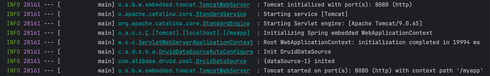

    这是springboot系列的第4篇文章，主要介绍的是springboot如何嵌入Tomcat。

<style>
.my-code {
   color: orange;
}
.orange {
   color: rgb(255, 53, 2)
}
.red {
   color: red
}
code {
   color: #0ABF5B;
}
</style>

# 一、springboot
`springboot`是一个基于spring框架的快速开发脚手架，旨在简化spring应用的初始搭建和开发过程。其核心思想是<code class="red">约定优于配置</code>，通过自动配置、起步依赖（starter）等机制大幅减少开发者的配置工作。
<!-- more -->

- <code class="red">脚手架</code>：指springboot提供的一整套开箱即用的工具和框架。脚手架的主要体现
  - **自动配置（`auto-Configuration`）**：springboot会根据项目中引入的依赖（如`spring-boot-starter-web`），自动配置相应的组件。例如如果项目依赖了`spring-boot-starter-web`，springboot会自动集成Tomcat作为内嵌服务器，无需手动部署到外部容器（如单独安装的Tomcat）。
  - **starter依赖**：springboot提供了一系列`spring-boot-starter-XXX`依赖（如`spring-boot-starter-web、spring-boot-starter-Mybatis`），这些依赖已经预置了常用的版本和基础配置，避免了手动管理依赖巴巴的繁琐。
- <code class="red">约定大于配置</code>
  - **默认配置文件**：springboot会自动默认加载`src/main/resources`目录下的`application.properties`或`application.yml`，无需在代码中指定配置文件路径。
  - **环境特定配置**：springboot通过扫描类路径下的`META-INF/spring.factories`文件，自动加载配置类（如`SpringBootApplication`启动类所在包下的`@Configuration`类），实现Bean的自动注册。
  - **条件化配置**：通过`@Conditional`配置，springboot会根据条件（如是否存在某个类、某个属性是否配置）动态启用或禁用配置。
  - **路径和包结构约定**：
    - **默认包扫描规则**：springboot启动类所在包及其子包会被自动扫描，无需显示配置`@ComponentScan`
    - **静态资源和模板路径**：默认静态资源路径为`src/main/resources/static`或`src/main/resources/public`，模板文件（如Thymeleaf）默认放在`src/main/resources/templates`。

# 二、Tomcat创建
当**自动装配**功能完成之后会接着执行 `ServletWebServerApplicationContext` 的 `onRefresh` 的方法，初始化特定上下文子类中的其它特殊的 Bean。
> `AbstractApplicationContext#onRefresh`

在 `onRefresh` 中会调用 `createWebServer` 创建 Web 服务，在创建 web 服务时，会调用 `getWebServerFactory` 获得 `ServletWebServerFactory`，默认创建的是 `Tomcat Web`服务。
```java
@Override
protected void onRefresh() {
   super.onRefresh();
   try {
      logger.info("【ServletWebServerApplicationContext】【onRefresh】-【开始创建 WEB 服务】");
      // 开始创建 WEB 服务
      createWebServer();
      logger.info("【ServletWebServerApplicationContext】【onRefresh】-【方法执行完毕，创建 WEB 服务完成】");
   }
   catch (Throwable ex) {
      throw new ApplicationContextException("Unable to start web server", ex);
   }
}

// 创建 WEB 服务
 private void createWebServer() {
  WebServer webServer = this.webServer;
  ServletContext servletContext = getServletContext();
  if (webServer == null && servletContext == null) {
   ServletWebServerFactory factory = getWebServerFactory();
   // 重点在这里，主要看这个方法的内部
   this.webServer = factory.getWebServer(getSelfInitializer());
  }
  else if (servletContext != null) {
   try {
    getSelfInitializer().onStartup(servletContext);
   }
   catch (ServletException ex) {
    throw new ApplicationContextException("Cannot initialize servlet context", ex);
   }
  }
  initPropertySources();
 }
```
其中 `ServletWebServerFactory` 接口主要有 `JettyServletWebServerFactory、UndertowServletWebServerFactory、TomcatServletWebServerFactory` 实现。

接下来仔细瞅瞅 `TomcatServletWebServerFactory` 对于 `getWebServer` 方法的实现。
> TomcatServletWebServerFactory#getWebServer

```java
// Tomcat 对象的初始化
@Override
public WebServer getWebServer(ServletContextInitializer... initializers) {
   if (this.disableMBeanRegistry) {
      Registry.disableRegistry();
   }
   // 完成 Tomcat 的 API 调用
   Tomcat tomcat = new Tomcat();
   File baseDir = (this.baseDirectory != null) ? this.baseDirectory : createTempDir("tomcat");
   tomcat.setBaseDir(baseDir.getAbsolutePath());
   for (LifecycleListener listener : this.serverLifecycleListeners) {
      tomcat.getServer().addLifecycleListener(listener);
   }
   Connector connector = new Connector(this.protocol);
   connector.setThrowOnFailure(true);
   tomcat.getService().addConnector(connector);
   customizeConnector(connector);
   tomcat.setConnector(connector);
   tomcat.getHost().setAutoDeploy(false);
   configureEngine(tomcat.getEngine());
   for (Connector additionalConnector : this.additionalTomcatConnectors) {
      tomcat.getService().addConnector(additionalConnector);
   }
   // 准备 TomcatEmbeddedContext 并设置到 Tomcat 中
   prepareContext(tomcat.getHost(), initializers);
   // 构建 TomcatWebServer
   return getTomcatWebServer(tomcat);
}

// 获取 Tomcat 服务
protected TomcatWebServer getTomcatWebServer(Tomcat tomcat) {
   return new TomcatWebServer(tomcat, getPort() >= 0, getShutdown());
}

public TomcatWebServer(Tomcat tomcat, boolean autoStart, Shutdown shutdown) {
   Assert.notNull(tomcat, "Tomcat Server must not be null");
   this.tomcat = tomcat;
   this.autoStart = autoStart;
   this.gracefulShutdown = (shutdown == Shutdown.GRACEFUL) ? new GracefulShutdown(tomcat) : null;
   // 调用  TomcatWebServer#initialize 方法
   initialize();
}

// 完成 Tomcat 的初始化
private void initialize() throws WebServerException {
   logger.info("Tomcat initialized with port(s): " + getPortsDescription(false));
   synchronized (this.monitor) {
      try {
         addInstanceIdToEngineName();
         Context context = findContext();
         context.addLifecycleListener((event) -> {
            if (context.equals(event.getSource()) && Lifecycle.START_EVENT.equals(event.getType())) {
               // Remove service connectors so that protocol binding doesn't
               // happen when the service is started.
               removeServiceConnectors();
            }
         });
         // Start the server to trigger initialization listeners
         //启动服务触发初始化监听器
         this.tomcat.start();
         // We can re-throw failure exception directly in the main thread
         rethrowDeferredStartupExceptions();
         try {
            ContextBindings.bindClassLoader(context, context.getNamingToken(), getClass().getClassLoader());
         }
         catch (NamingException ex) {
            // Naming is not enabled. Continue
         }
         // Unlike Jetty, all Tomcat threads are daemon threads. We create a
         // blocking non-daemon to stop immediate shutdown
         // Tomcat 的线程都是守护线程，我们创建一个阻塞非守护线程来避免立即关闭
         startDaemonAwaitThread();
      }
      catch (Exception ex) {
         stopSilently();
         destroySilently();
         throw new WebServerException("Unable to start embedded Tomcat", ex);
      }
   }
}
```
在 `getWebServer` 方法中会完成内嵌 `Tomcat API` 的调用以及 `TomcatServer` 的构建，并完成初始化操作，此时控制台打印如下。

至此就完成了内嵌 Tomcat 操作，接下来看看内嵌的 Tomcat 如何启动？

# 三、Tomcat启动
在 `finishRefresh()` 方法中完成了上下文生命周期处理器的初始化、bean 的启动、并发布上下文刷新的事件。
```java
protected void finishRefresh() {
   // Clear context-level resource caches (such as ASM metadata from scanning).
   clearResourceCaches();
   // Initialize lifecycle processor for this context.
   // 为此上下文初始化 lifecycle processor。
   initLifecycleProcessor();
   // Propagate refresh to lifecycle processor first.
   getLifecycleProcessor().onRefresh();
   // Publish the final event.
   publishEvent(new ContextRefreshedEvent(this));
   // Participate in LiveBeansView MBean, if active.
   if (!NativeDetector.inNativeImage()) {
      LiveBeansView.registerApplicationContext(this);
   }
}
```
初始化生命周期执行器：`initLifecycleProcessor()`
```java
protected void initLifecycleProcessor() {
    ConfigurableListableBeanFactory beanFactory = getBeanFactory();
    if (beanFactory.containsLocalBean(LIFECYCLE_PROCESSOR_BEAN_NAME)) {
        this.lifecycleProcessor = beanFactory.getBean(LIFECYCLE_PROCESSOR_BEAN_NAME, LifecycleProcessor.class);
    }
    else {
        DefaultLifecycleProcessor defaultProcessor = new DefaultLifecycleProcessor();
        defaultProcessor.setBeanFactory(beanFactory);
        this.lifecycleProcessor = defaultProcessor;
        beanFactory.registerSingleton(LIFECYCLE_PROCESSOR_BEAN_NAME, this.lifecycleProcessor);
    }
}
```
执行：`getLifecycleProcessor().onRefresh()`

调用 `DefaultLifecycleProcessor` 的 `onRefresh()` 方法。
```java
private void startBeans(boolean autoStartupOnly) {
    Map<String, Lifecycle> lifecycleBeans = getLifecycleBeans();
    Map<Integer, LifecycleGroup> phases = new TreeMap<>();
    lifecycleBeans.forEach((beanName, bean) -> {
        if (!autoStartupOnly || (bean instanceof SmartLifecycle && ((SmartLifecycle) bean).isAutoStartup())) {
            int phase = getPhase(bean);
            phases.computeIfAbsent(
                    phase,
                    p -> new LifecycleGroup(phase, this.timeoutPerShutdownPhase, lifecycleBeans, autoStartupOnly)
            ).add(beanName, bean);
        }
    });
    if (!phases.isEmpty()) {
        phases.values().forEach(LifecycleGroup::start);
    }
}
```
然后执行start方法，跟踪代码，最终执行`WebServerStartStopLifecycle#start()`
```java
class WebServerStartStopLifecycle implements SmartLifecycle {
    @Override
    public void start() {
        this.webServer.start();
        this.running = true;
        this.applicationContext
                .publishEvent(new ServletWebServerInitializedEvent(this.webServer, this.applicationContext));
    }
}
```
然后执行`TomcatWebServer#start()`
```java
public class TomcatWebServer implements WebServer {
  @Override
  public void start() throws WebServerException {
    synchronized (this.monitor) {
      if (this.started) {
        return;
      }
      try {
        addPreviouslyRemovedConnectors();
        Connector connector = this.tomcat.getConnector();
        if (connector != null && this.autoStart) {
          performDeferredLoadOnStartup();
        }
        checkThatConnectorsHaveStarted();
        this.started = true;
        logger.info("Tomcat started on port(s): " + getPortsDescription(true) + " with context path '"
                + getContextPath() + "'");
      }
      catch (ConnectorStartFailedException ex) {
        stopSilently();
        throw ex;
      }
      catch (Exception ex) {
        PortInUseException.throwIfPortBindingException(ex, () -> this.tomcat.getConnector().getPort());
        throw new WebServerException("Unable to start embedded Tomcat server", ex);
      }
      finally {
        Context context = findContext();
        ContextBindings.unbindClassLoader(context, context.getNamingToken(), getClass().getClassLoader());
      }
    }
  }
}
```
至此，Spring Boot 内嵌的 Tomcat 就启动成功了。


参考文章：
https://cloud.tencent.com/developer/article/1978470
https://www.cnblogs.com/krock/p/15142339.html
