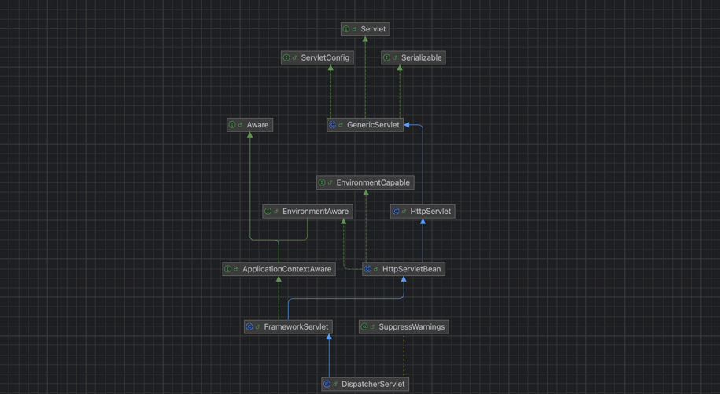

    这是springmvc系列的第1篇文章，主要介绍的是springmvc的启动过程。

<style>
.my-code {
   color: orange;
}
.orange {
   color: rgb(255, 53, 2)
}
.red {
   color: red
}
code {
   color: #0ABF5B;
}
</style>

# 一、什么是springMVC？
springmvc是spring框架中用于构建web应用程序的核心模块，它基于`MVC（model-view-controller）`设计模式，提供了一套灵活、高效的请求处理机制。
> MVC是一种设计模式，这种设计模式建议将一个请求由`M（Module）、V（View）、C（controller）`三个部分进行处理。请求先经过`controller`，controller调用其他服务层得到`Module`，最后将Module数据渲染成试图（View）返回客户端。Spring MVC是Spring生态圈的一个组件，一个遵守MVC设计模式的WEB MVC框架。这个框架可以和Spring无缝整合，上手简单，易于扩展。

<!--more-->

# 二、配置

## 2.1、添加依赖
在项目的pom.xml文件中添加springMVC及相关依赖
```java
<dependencies>
    <dependency>
        <groupId>org.springframework</groupId>
        <artifactId>spring-webmvc</artifactId>
        <version>5.3.22</version>
    </dependency>
    <!-- 其他依赖，如Spring Core、日志框架等 -->
</dependencies>
```

## 2.2、配置web.xml
在`web.xml`中配置前端控制器`DispatcherServlet`
```xml
<servlet>
    <servlet-name>springmvc</servlet-name>
    <servlet-class>org.springframework.web.servlet.DispatcherServlet</servlet-class>
    <init-param>
        <!-- contextConfigLocation 是参数名称，该参数的值包含 Spring MVC 的配置文件路径 -->
        <param-name>contextConfigLocation</param-name>
        <!-- Spring MVC 的配置文件可以放在任何地方 -->
        <param-value>classpath*:springmvc-config.xml</param-value>
    </init-param>
    <!-- 在 Web 应用启动时立即加载 Servlet -->
    <load-on-startup>1</load-on-startup>
</servlet>

<servlet-mapping>
    <servlet-name>springMVC</servlet-name>
    <url-pattern>/</url-pattern>
</servlet-mapping>
```

## 2.3、创建springmvc配置文件
创建`spring-mvc.xml`文件，配置组件扫描、视图解析器等。
```java
<beans xmlns="http://www.springframework.org/schema/beans"
    xmlns:context="http://www.springframework.org/schema/context"
    xmlns:mvc="http://www.springframework.org/schema/mvc"
    xmlns:xsi="http://www.w3.org/2001/XMLSchema-instance"
    xsi:schemaLocation="http://www.springframework.org/schema/beans
        http://www.springframework.org/schema/beans/spring-beans.xsd
        http://www.springframework.org/schema/context
        http://www.springframework.org/schema/context/spring-context.xsd
        http://www.springframework.org/schema/mvc
        http://www.springframework.org/schema/mvc/spring-mvc.xsd">

    <context:component-scan base-package="com.example.controller" />

    <mvc:annotation-driven />

    <bean class="org.springframework.web.servlet.view.InternalResourceViewResolver">
        <property name="prefix" value="/WEB-INF/views/" />
        <property name="suffix" value=".jsp" />
    </bean>
</beans>
```


# 三、启动过程

## 3.1、启动Tomcat
在Tomcat相关文章中，我们解析了Tomcat的启动过程，回顾一下。Tomcat的启动分成2个步骤：
- `load`过程
- `start`过程

### 3.1.1、实例化`DispatcherServlet`
`web.xml`中配置的`DispatcherServlet`设置了`<load-on-startup>`，会在`StandardContext.startInternal()`启动过程中，创建servlet并执行其`init()`方法，简化后代码如下：
```java
protected synchronized void startInternal() throws LifecycleException {
   //1、通知容器启动事件，去解析web.xml
   fireLifecycleEvent(Lifecycle.CONFIGURE_START_EVENT, null);
   //Start our child containers, if not already started
   for (Container child : findChildren()) {
      if (!child.getState().isAvailable()) {
         child.start();
      }
   }
   //2、进行listener的创建和启动
   if (ok) {
     if (!listenerStart()) {
         log.error(sm.getString("standardContext.listenerFail"));
         ok = false;
     }
   }
   // 3、filter的创建和启动
   if (ok) {
     if (!filterStart()) {
         log.error(sm.getString("standardContext.filterFail"));
         ok = false;
     }
   }
   //加载和实例化servlet
   // Load and initialize all "load on startup" servlets
   if (ok) {
     if (!loadOnStartup(findChildren())){
         log.error(sm.getString("standardContext.servletFail"));
         ok = false;
     }
   }
}
```

### 3.1.2、`DispatcherServlet`结构

`HttpServletBean`重写了`init()`方法
```java
public abstract class HttpServletBean extends HttpServlet implements EnvironmentCapable, EnvironmentAware {
    @Override
    public final void init() throws ServletException {
        if (logger.isDebugEnabled()) {
            logger.debug("Initializing servlet '" + getServletName() + "'");
        }
        // Set bean properties from init parameters.
        try {
            PropertyValues pvs = new ServletConfigPropertyValues(getServletConfig(), this.requiredProperties);
            BeanWrapper bw = PropertyAccessorFactory.forBeanPropertyAccess(this);
            ResourceLoader resourceLoader = new ServletContextResourceLoader(getServletContext());
            bw.registerCustomEditor(Resource.class, new ResourceEditor(resourceLoader, getEnvironment()));
            initBeanWrapper(bw);
            bw.setPropertyValues(pvs, true);
        }
        catch (BeansException ex) {
            if (logger.isErrorEnabled()) {
                logger.error("Failed to set bean properties on servlet '" + getServletName() + "'", ex);
            }
            throw ex;
        }
        // Let subclasses do whatever initialization they like.
        initServletBean();
        if (logger.isDebugEnabled()) {
            logger.debug("Servlet '" + getServletName() + "' configured successfully");
        }
    }
}
```

`HttpServlet`重写了`Servlet.service()`方法
```java
public abstract class HttpServlet extends GenericServlet {
    @Override
    public void service(ServletRequest req, ServletResponse res)
            throws ServletException, IOException {
        HttpServletRequest request;
        HttpServletResponse response;

        if (!(req instanceof HttpServletRequest &&
                res instanceof HttpServletResponse)) {
            throw new ServletException("non-HTTP request or response");
        }
        request = (HttpServletRequest) req;
        response = (HttpServletResponse) res;

        service(request, response);
    }
}
```

## 3.2、DispatcherServlet初始化流程

在Tomcat启动的`start`过程中，创建了`DispatcherServlet`，并执行其`init()`方法。初始化流程如下：
```text
Servlet.init()
    ↓
HttpServletBean.init() → 解析参数，设置属性
    ↓
FrameworkServlet.initServletBean() → 创建/刷新 WebApplicationContext
    ↓
DispatcherServlet.onRefresh()
    │
    ├─ 初始化 HandlerMappings
    ├─ 初始化 HandlerAdapters
    ├─ 初始化 ViewResolvers
    └─ 其他策略组件（异常解析器、文件上传等）
```
初始化时序图如下：


### 3.2.1、初始化容器
- `HttpServletBean`重写了`init()`方法
```java
public abstract class HttpServletBean extends HttpServlet implements EnvironmentCapable, EnvironmentAware {
    @Override
    public final void init() throws ServletException {
        if (logger.isDebugEnabled()) {
            logger.debug("Initializing servlet '" + getServletName() + "'");
        }
        // Set bean properties from init parameters.
        try {
            PropertyValues pvs = new ServletConfigPropertyValues(getServletConfig(), this.requiredProperties);
            BeanWrapper bw = PropertyAccessorFactory.forBeanPropertyAccess(this);
            ResourceLoader resourceLoader = new ServletContextResourceLoader(getServletContext());
            bw.registerCustomEditor(Resource.class, new ResourceEditor(resourceLoader, getEnvironment()));
            initBeanWrapper(bw);
            bw.setPropertyValues(pvs, true);
        }
        catch (BeansException ex) {
            if (logger.isErrorEnabled()) {
                logger.error("Failed to set bean properties on servlet '" + getServletName() + "'", ex);
            }
            throw ex;
        }
        // Let subclasses do whatever initialization they like.
        initServletBean();
        if (logger.isDebugEnabled()) {
            logger.debug("Servlet '" + getServletName() + "' configured successfully");
        }
    }
}
```
进入`FrameworkServlet`的`initServletBean()`方法：
```java
public abstract class FrameworkServlet extends HttpServletBean implements ApplicationContextAware {
    @Override
    protected final void initServletBean() throws ServletException {
        getServletContext().log("Initializing Spring FrameworkServlet '" + getServletName() + "'");
        if (this.logger.isInfoEnabled()) {
            this.logger.info("FrameworkServlet '" + getServletName() + "': initialization started");
        }
        long startTime = System.currentTimeMillis();
        try {
            //流程1：创建web上下文
            this.webApplicationContext = initWebApplicationContext();
            //
            initFrameworkServlet();
        }
    }
}
```
跟踪代码，进入`initWebApplicationContext();`，创建了spring的应用上下文。
```java
public abstract class FrameworkServlet extends HttpServletBean implements ApplicationContextAware {
    protected WebApplicationContext initWebApplicationContext() {
        //1. 获取父级上下文
        WebApplicationContext rootContext = WebApplicationContextUtils.getWebApplicationContext(getServletContext());
        WebApplicationContext wac = null;
        if (wac == null) {
            //2. 创建
            wac = createWebApplicationContext(rootContext);
        }
        if (!this.refreshEventReceived) {
            // Either the context is not a ConfigurableApplicationContext with refresh
            // support or the context injected at construction time had already been
            // refreshed -> trigger initial onRefresh manually here.
            onRefresh(wac);
        }
        return wac;
    }

    protected WebApplicationContext createWebApplicationContext(ApplicationContext parent) {
        Class<?> contextClass = getContextClass();
        ConfigurableWebApplicationContext wac = (ConfigurableWebApplicationContext) BeanUtils.instantiateClass(contextClass);
        wac.setEnvironment(getEnvironment());
        wac.setParent(parent);
        wac.setConfigLocation(getContextConfigLocation());
        //配置和刷新：触发refresh()方法，即刷新上下文，进行工厂设置、Bean实例化等操作
        configureAndRefreshWebApplicationContext(wac);
        return wac;
    }

    protected void configureAndRefreshWebApplicationContext(ConfigurableWebApplicationContext wac) {
        wac.setServletContext(getServletContext());
        wac.setServletConfig(getServletConfig());
        wac.setNamespace(getNamespace());
        wac.addApplicationListener(new SourceFilteringListener(wac, new ContextRefreshListener()));
        postProcessWebApplicationContext(wac);
        applyInitializers(wac);
        //重点方法，即刷新上下文，进行工厂设置、Bean实例化等操作
        wac.refresh();
    }
}
```


### 3.2.2、onRefresh(wac)
**初始化策略组件(九大核心策略组件)** 的核心方法。在`WebApplicationContext`刷新完成后触发，负责加载和配置springmvc处理请求所需的核心组件（如处理器映射、适配器、视图解析器等）。
```java
public class DispatcherServlet extends FrameworkServlet {
    @Override
    protected void onRefresh(ApplicationContext context) {
        initStrategies(context);
    }
    protected void initStrategies(ApplicationContext context) {
        initMultipartResolver(context);
        initLocaleResolver(context);
        initThemeResolver(context);
        //初始化HandlerMappings
        initHandlerMappings(context);
        //初始化 HandlerAdapters
        initHandlerAdapters(context);
        initHandlerExceptionResolvers(context);
        initRequestToViewNameTranslator(context);
        //初始化 viewResolvers
        initViewResolvers(context);
        initFlashMapManager(context);
    }
}
```

#### (1) 初始化HandlerMappings
- **作用**：将请求URL映射到对应的处理器（如`@Controller`的方法）
- **默认实现**：
  - `RequestMappingHandlerMapping`：处理`@RequestMapping`注解。
    - 如果想要 `RequestMapping` 注解生效，必须在 xml 文件中配置，`< mvc:annotation-driven/>`。
    - 通过`AnnotationDrivenBeanDefinitionParser`注册`RequestMappingHandlerMapping`的bean定义
  - `BeanNameUrlHandlerMapping`：根据Bean名称匹配URL。
- **加载规则**：
  - 自动检查所有实现`HandlerMapping`接口的bean。
  - 若无显示配置，默认注册`RequestMappingHandlerMapping`

简化后源码如下：
```java
private void initHandlerMappings(ApplicationContext context) {
    // 1. 从上下文中获取所有 HandlerMapping 类型的 Bean
    Map<String, HandlerMapping> mappings = BeanFactoryUtils.beansOfTypeIncludingAncestors(
        context, HandlerMapping.class, true, false);
    
    // 2. 按优先级排序（@Order 或 Ordered 接口）
    this.handlerMappings = new ArrayList<>(mappings.values());
    AnnotationAwareOrderComparator.sort(this.handlerMappings);
    
    // 3. 若未找到任何 HandlerMapping，注册默认配置
    if (this.handlerMappings.isEmpty()) {
        this.handlerMappings = getDefaultStrategies(context, HandlerMapping.class);
    }
}
//获取默认的HandlerMapping
protected <T> List<T> getDefaultStrategies(ApplicationContext context, Class<T> strategyInterface) {
  String key = strategyInterface.getName();
  String value = defaultStrategies.getProperty(key);
  if (value != null) {
    String[] classNames = StringUtils.commaDelimitedListToStringArray(value);
    List<T> strategies = new ArrayList<T>(classNames.length);
    for (String className : classNames) {
      try {
        Class<?> clazz = ClassUtils.forName(className, DispatcherServlet.class.getClassLoader());
        Object strategy = createDefaultStrategy(context, clazz);
        strategies.add((T) strategy);
      }
    }
    return strategies;
  }
}
//通过spirng工厂方法，创建bean
protected Object createDefaultStrategy(ApplicationContext context, Class<?> clazz) {
  return context.getAutowireCapableBeanFactory().createBean(clazz);
}
```
- `getDefaultStrategies()`：调用spring工厂的`createBean()`，走bean的创建流程。
- `defaultStrategies`变量的初始化，它是在`DispatcherServlet`的静态初始化代码块中加载的。
```java
static {
    //DEFAULT_STRATEGIES_PATH=spring-webmvc-4.3.7.RELEASE.jar!/org/springframework/web/servlet/DispatcherServlet.properties
    try {
        ClassPathResource resource = new ClassPathResource(DEFAULT_STRATEGIES_PATH, DispatcherServlet.class);
        defaultStrategies = PropertiesLoaderUtils.loadProperties(resource);
    }
    catch (IOException ex) {
        throw new IllegalStateException("Could not load 'DispatcherServlet.properties': " + ex.getMessage());
    }
}
```
`spring-webmvc-4.3.7.RELEASE.jar!/org/springframework/web/servlet/DispatcherServlet.properties`内容如下：
```text
org.springframework.web.servlet.LocaleResolver=org.springframework.web.servlet.i18n.AcceptHeaderLocaleResolver

org.springframework.web.servlet.ThemeResolver=org.springframework.web.servlet.theme.FixedThemeResolver

org.springframework.web.servlet.HandlerMapping=org.springframework.web.servlet.handler.BeanNameUrlHandlerMapping,\
	org.springframework.web.servlet.mvc.annotation.DefaultAnnotationHandlerMapping

org.springframework.web.servlet.HandlerAdapter=org.springframework.web.servlet.mvc.HttpRequestHandlerAdapter,\
	org.springframework.web.servlet.mvc.SimpleControllerHandlerAdapter,\
	org.springframework.web.servlet.mvc.annotation.AnnotationMethodHandlerAdapter

org.springframework.web.servlet.HandlerExceptionResolver=org.springframework.web.servlet.mvc.annotation.AnnotationMethodHandlerExceptionResolver,\
	org.springframework.web.servlet.mvc.annotation.ResponseStatusExceptionResolver,\
	org.springframework.web.servlet.mvc.support.DefaultHandlerExceptionResolver

org.springframework.web.servlet.RequestToViewNameTranslator=org.springframework.web.servlet.view.DefaultRequestToViewNameTranslator

org.springframework.web.servlet.ViewResolver=org.springframework.web.servlet.view.InternalResourceViewResolver

org.springframework.web.servlet.FlashMapManager=org.springframework.web.servlet.support.SessionFlashMapManager
```

至此，我们分析完了`initHandlerMappings(context)`方法的执行过程，其他的初始化过程与这个方法非常类似。所有初始化方法执行完后，SpringMVC正式完成初始化，静静等待Web请求的到来。

#### (2) 初始化 HandlerAdapters
- **作用**：执行处理器方法，处理参数绑定、返回值转换。
- **默认实现**：
  - `RequestMappingHandlerAdapter`：处理@RequestMapping注解。
  - `BeanNameUrlHandlerAdapter`：处理HttpRequestHandler接口（如静态资源处理）
- **加载规则**：
  - 自动检查所有实现`HandlerMapping`接口的bean。
  - 若无显示配置，默认注册`RequestMappingHandlerMapping`

#### (3) 初始化 `HandlerExceptionResolvers`
- **作用**：处理控制器抛出的异常，返回错误视图或 JSON 响应。
- **常见实现**：
    - `ExceptionHandlerExceptionResolver`：处理 `@ExceptionHandler` 注解。
    - `ResponseStatusExceptionResolver`：解析 `@ResponseStatus` 注解。
    - `DefaultHandlerExceptionResolver`：处理 Spring MVC 内置异常（如 404、405）。
- **自定义扩展**：实现 `HandlerExceptionResolver` 接口并注册为 Bean。

#### (4) 初始化 `ViewResolvers`
- **作用**：将逻辑视图名（如 `"home"`）解析为实际视图（如 JSP、Thymeleaf 模板）。
- **默认策略**：
    - `InternalResourceViewResolver`：解析为 JSP 或 Servlet 转发。
    - `ThymeleafViewResolver`：集成 Thymeleaf 模板引擎。
- **配置示例**：
  ```java
  @Bean
  public ViewResolver viewResolver() {
      InternalResourceViewResolver resolver = new InternalResourceViewResolver();
      resolver.setPrefix("/WEB-INF/views/");
      resolver.setSuffix(".jsp");
      return resolver;
  }
  ```

# 四、`RequestMappingHandlerMapping`
`RequestMappingHandlerMapping`是springmvc中处理`@RequestMapping`注解的核心组件，负责将HTTP请求映射到对应的控制器方法。

## 4.1、继承关系
`RequestMappingHandlerMapping`类通过继承，间接实现了`InitializingBean`接口。
```text
RequestMappingHandlerMapping
    extends AbstractHandlerMethodMapping<RequestMappingInfo>
    implements EmbeddedValueResolverAware

AbstractHandlerMethodMapping<T>
    implements InitializingBean, HandlerMapping, BeanFactoryAware
```

### 4.1.1、实例化
- 如果想要 `RequestMapping` 注解生效，必须在 xml 文件中配置，`< mvc:annotation-driven/>`。
- 通过`AnnotationDrivenBeanDefinitionParser`注册`RequestMappingHandlerMapping`的bean定义


## 4.2、`afterPropertiesSet()`
`afterPropertiesSet()`的主要职责：
- 扫描所有候选bean：检测容器中所有可能包含处理器方法（如`@Controller`或`@RequestMapping`注解）的bean。
- 解析并注册映射关系：提取处理器方法上的映射信息（如路径、HTTP方法），将其注册到内部存储结构中。

在`RequestMappingHandlerMapping`对象初始化时，执行`afterPropertiesSet()`方法。
```java
public class RequestMappingHandlerMapping extends RequestMappingInfoHandlerMapping
        implements MatchableHandlerMapping, EmbeddedValueResolverAware {
    @Override
    public void afterPropertiesSet() {
        this.config = new RequestMappingInfo.BuilderConfiguration();
        this.config.setUrlPathHelper(getUrlPathHelper());
        this.config.setPathMatcher(getPathMatcher());
        this.config.setSuffixPatternMatch(this.useSuffixPatternMatch);
        this.config.setTrailingSlashMatch(this.useTrailingSlashMatch);
        this.config.setRegisteredSuffixPatternMatch(this.useRegisteredSuffixPatternMatch);
        this.config.setContentNegotiationManager(getContentNegotiationManager());

        super.afterPropertiesSet();
    }
}
```
执行父类的`afterPropertiesSet()`
```java
public abstract class AbstractHandlerMethodMapping<T> extends AbstractHandlerMapping implements InitializingBean {
  @Override
  public void afterPropertiesSet() {
    initHandlerMethods();
  }

  //从ApplicationContext扫描所有的bean, 找到并且将handler method注册到容器中【将url和handlerMethod关联】
  protected void initHandlerMethods() {
    String[] beanNames = (this.detectHandlerMethodsInAncestorContexts ?
            BeanFactoryUtils.beanNamesForTypeIncludingAncestors(getApplicationContext(), Object.class) :
            getApplicationContext().getBeanNamesForType(Object.class));

    for (String beanName : beanNames) {
      if (!beanName.startsWith(SCOPED_TARGET_NAME_PREFIX)) {
        Class<?> beanType = null;
        try {
          beanType = getApplicationContext().getType(beanName);
        }
        //isHandler：判断是否有@Controller 或 RequestMapping注解
        if (beanType != null && isHandler(beanType)) {
            //检测 HandlerMethods
            detectHandlerMethods(beanName);
        }
      }
    }
    handlerMethodsInitialized(getHandlerMethods());
  }
}

@Override
protected boolean isHandler(Class<?> beanType) {
  return (AnnotatedElementUtils.hasAnnotation(beanType, Controller.class) ||
          AnnotatedElementUtils.hasAnnotation(beanType, RequestMapping.class));
}
```
- 在`RequestMappingHandlerMapping`中，`isHandler`方法检查类是否带有`@Controller `或 `RequestMapping`注解
- `detectHandlerMethods(beanName)`：检测并注册处理方法。

进入`detectHandlerMethods(beanName)`方法
```java
public abstract class AbstractHandlerMethodMapping<T> extends AbstractHandlerMapping implements InitializingBean {
    protected void detectHandlerMethods(final Object handler) {
        Class<?> handlerType = (handler instanceof String ?
                getApplicationContext().getType((String) handler) : handler.getClass());
        final Class<?> userType = ClassUtils.getUserClass(handlerType);

        //获取类中所有方法
        Map<Method, T> methods = MethodIntrospector.selectMethods(userType,
                new MethodIntrospector.MetadataLookup<T>() {
                    @Override
                    public T inspect(Method method) {
                        try {
                            return getMappingForMethod(method, userType);
                        } catch (Throwable ex) {
                            throw new IllegalStateException("Invalid mapping on handler class [" +
                                    userType.getName() + "]: " + method, ex);
                        }
                    }
                });
        if (logger.isDebugEnabled()) {
            logger.debug(methods.size() + " request handler methods found on " + userType + ": " + methods);
        }
        //注册每个方法及其映射关系
        for (Map.Entry<Method, T> entry : methods.entrySet()) {
            Method invocableMethod = AopUtils.selectInvocableMethod(entry.getKey(), userType);
            T mapping = entry.getValue();
            registerHandlerMethod(handler, invocableMethod, mapping);
        }
    }
}
```
- `getMappingForMethod()`：在`RequestMappingHandlerMapping`中，该方法解析`@RequestMapping`及其派生注解（如`@GetMapping`），生成`RequestMappingInfo`对象。

然后进入注册处理方法`registerHandlerMethod(handler, invocableMethod, mapping);`
```java
public abstract class AbstractHandlerMethodMapping<T> extends AbstractHandlerMapping implements InitializingBean {
    protected void registerHandlerMethod(Object handler, Method method, T mapping) {
        //注册映射关系
        this.mappingRegistry.register(mapping, handler, method);
    }
    class MappingRegistry {
        public void register(T mapping, Object handler, Method method) {
            //加锁
            this.readWriteLock.writeLock().lock();
            try {
                //创建 HandlerMethod对象（封装处理器Bean和方法）
                HandlerMethod handlerMethod = createHandlerMethod(handler, method);
                assertUniqueMethodMapping(handlerMethod, mapping);
                if (logger.isInfoEnabled()) {
                  logger.info("Mapped \"" + mapping + "\" onto " + handlerMethod);
                }
                this.mappingLookup.put(mapping, handlerMethod);
                List<String> directUrls = getDirectUrls(mapping);
                for (String url : directUrls) {
                  this.urlLookup.add(url, mapping);
                }
                String name = null;
                if (getNamingStrategy() != null) {
                  name = getNamingStrategy().getName(handlerMethod, mapping);
                  addMappingName(name, handlerMethod);
                }
        
                CorsConfiguration corsConfig = initCorsConfiguration(handler, method, mapping);
                if (corsConfig != null) {
                  this.corsLookup.put(handlerMethod, corsConfig);
                }
                //存储映射关系到内部注册表
                this.registry.put(mapping, new MappingRegistration<T>(mapping, handlerMethod, directUrls, name));
            }
            finally {
                this.readWriteLock.writeLock().unlock();
            }
        }
    }
}
```


## 4.3、核心数据结构

### 4.3.1、HandlerMethod
封装处理器方法及其所属Bean的元信息。
```java
public class HandlerMethod {
    private final Object bean;        // 处理器 Bean 实例或名称
    private final Method method;      // 目标方法
    private final Method bridgedMethod; // 桥接方法（泛型处理）
    // 其他辅助字段（如参数、返回值类型）
}
```


### 4.3.2、RequestMappingInfo
存储请求映射的完整条件
```java
public class RequestMappingInfo implements RequestCondition<RequestMappingInfo> {
    private final String name;                // 映射名称（可选）
    private final PatternsRequestCondition patternsCondition; // URL 路径模式
    private final RequestMethodsRequestCondition methodsCondition; // HTTP 方法
    private final ParamsRequestCondition paramsCondition;     // 请求参数条件
    private final HeadersRequestCondition headersCondition;   // 请求头条件
    private final ConsumesRequestCondition consumesCondition; // 内容类型（消费）
    private final ProducesRequestCondition producesCondition; // 响应类型（生产）
    // 其他条件（如自定义请求条件）
}
```

### 4.3.3、MappingRegistry
内部注册表，存储所有映射信息。
```java
class MappingRegistry {
    private final Map<T, MappingRegistration<T>> registry = new HashMap<>(); // 主映射表
    private final Map<T, HandlerMethod> mappingLookup = new LinkedHashMap<>(); // 快速查找表
    private final MultiValueMap<String, T> urlLookup = new LinkedMultiValueMap<>(); // URL 路径索引
    // 其他辅助数据结构（如跨域配置缓存）
}
```

## 4.4、示例
首先，定义一个带有`@RequestMapping`注解的控制器类：
```java
@RestController
@RequestMapping("api/admin")
public class AdminLoginController {
  @Autowired
  private AdminLoginService adminLoginService;

  @PostMapping(value = "/login", produces = "application/json")
  public CommonResult<SystemLoginResponse> SystemAdminLogin(@RequestBody @Validated SystemAdminLoginRequest systemAdminLoginRequest, HttpServletRequest request) {
    String ip = CrmebUtil.getClientIp(request);
    SystemLoginResponse systemAdminResponse = adminLoginService.login(systemAdminLoginRequest, ip);
    return CommonResult.success(systemAdminResponse, "login success");
  }

}
```

### 4.4.1、RequestMappingInfo解析


### 4.4.2、HandlerMethod封装


