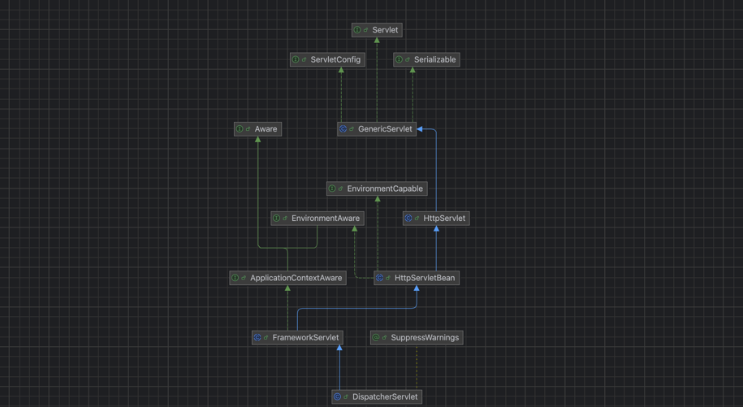
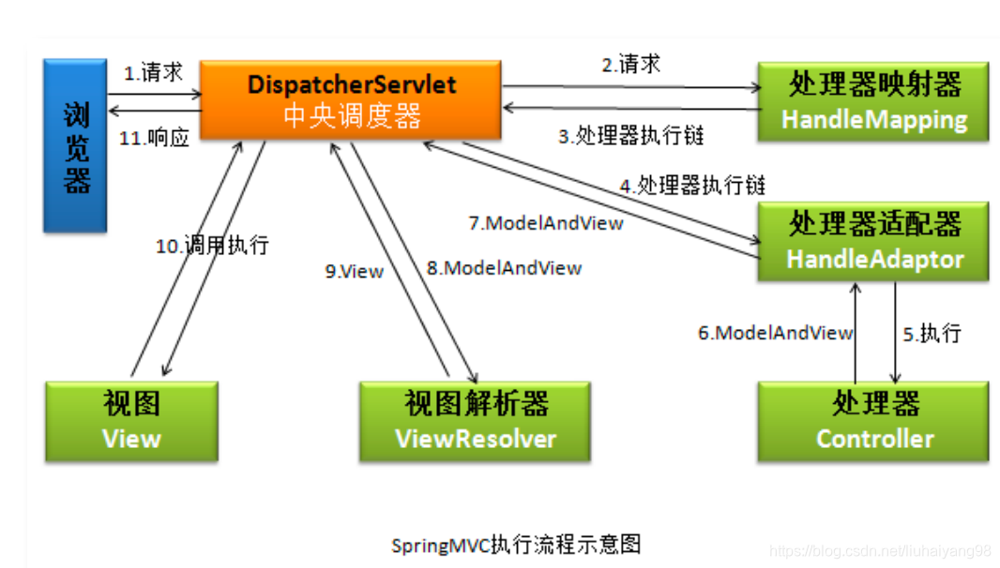
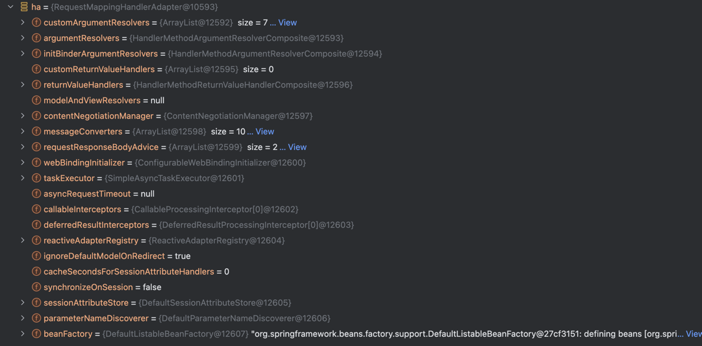

    这是springmvc系列的第2篇文章，主要介绍的是springmvc的请求处理过程。

<style>
.my-code {
   color: orange;
}
.orange {
   color: rgb(255, 53, 2)
}
.red {
   color: red
}
code {
   color: #0ABF5B;
}
</style>

# 一、什么是springMVC？
springmvc是spring框架中用于构建web应用程序的核心模块，它基于`MVC（model-view-controller）`设计模式，提供了一套灵活、高效的请求处理机制。
> MVC是一种设计模式，这种设计模式建议将一个请求由`M（Module）、V（View）、C（controller）`三个部分进行处理。请求先经过`controller`，controller调用其他服务层得到`Module`，最后将Module数据渲染成试图（View）返回客户端。Spring MVC是Spring生态圈的一个组件，一个遵守MVC设计模式的WEB MVC框架。这个框架可以和Spring无缝整合，上手简单，易于扩展。

<!--more-->


# 二、请求处理流程
在分析Tomcat的请求处理过程中，最终请求会执行`servlet.service()`方法。

springmvc中`HttpServlet.service()`方法是处理HTTP请求的核心入口方法，负责将请求分发到对应的HTTP方法处理器（如doGet()、doPost()）。
```java
public abstract class HttpServlet extends GenericServlet {
    //重写Servlet的service方法
    @Override
    public void service(ServletRequest req, ServletResponse res)
            throws ServletException, IOException
    {
        HttpServletRequest  request;
        HttpServletResponse response;
        if (!(req instanceof HttpServletRequest &&
                res instanceof HttpServletResponse)) {
          throw new ServletException("non-HTTP request or response");
        }
        //类型转换
        request = (HttpServletRequest) req;
        response = (HttpServletResponse) res;
        //执行service方法
        service(request, response);
    }
    //关键源码（简化版）
    protected void service(ServletRequest req, ServletResponse res)
            throws ServletException, IOException {
        //获取请求分发
        String method = request.getMethod();
        //根据不同类型，执行不同方法
        if (method.equals("GET")) {
          doGet(request, response);
        } else if (method.equals("POST")) {
          doPost(request, response);
        } else if (method.equals("HEAD")) {
          doHead(request, response);
        } else {
          response.sendError(HttpServletResponse.SC_NOT_IMPLEMENTED, "Method not supported");
        }
    }
}
```

## 2.1、doGet()

```java
public abstract class FrameworkServlet extends HttpServletBean implements ApplicationContextAware {
    @Override
    protected final void doGet(HttpServletRequest request, HttpServletResponse response)
            throws ServletException, IOException {

        processRequest(request, response);
    }
    protected final void processRequest(HttpServletRequest request, HttpServletResponse response)
            throws ServletException, IOException {
  
        long startTime = System.currentTimeMillis();
        Throwable failureCause = null;
    
        LocaleContext previousLocaleContext = LocaleContextHolder.getLocaleContext();
        LocaleContext localeContext = buildLocaleContext(request);
    
        RequestAttributes previousAttributes = RequestContextHolder.getRequestAttributes();
        ServletRequestAttributes requestAttributes = buildRequestAttributes(request, response, previousAttributes);
    
        WebAsyncManager asyncManager = WebAsyncUtils.getAsyncManager(request);
        asyncManager.registerCallableInterceptor(FrameworkServlet.class.getName(), new RequestBindingInterceptor());
    
        initContextHolders(request, localeContext, requestAttributes);
    
        try {
          doService(request, response);
        }
        publishRequestHandledEvent(request, response, startTime, failureCause);
    }
}
```
可以看到，`processRequest()`方法只是做了一些线程安全的隔离，真正的请求处理，发生在`doService()`方法中。点开`DispatcherServlet`类中的`doService()`方法。
```java
public class DispatcherServlet extends FrameworkServlet {
    @Override
    protected void doService(HttpServletRequest request, HttpServletResponse response) throws Exception {

        // Keep a snapshot of the request attributes in case of an include,
        // to be able to restore the original attributes after the include.
        Map<String, Object> attributesSnapshot = null;
        if (WebUtils.isIncludeRequest(request)) {
            attributesSnapshot = new HashMap<String, Object>();
            Enumeration<?> attrNames = request.getAttributeNames();
            while (attrNames.hasMoreElements()) {
                String attrName = (String) attrNames.nextElement();
                if (this.cleanupAfterInclude || attrName.startsWith("org.springframework.web.servlet")) {
                    attributesSnapshot.put(attrName, request.getAttribute(attrName));
                }
            }
        }

        // Make framework objects available to handlers and view objects.
        request.setAttribute(WEB_APPLICATION_CONTEXT_ATTRIBUTE, getWebApplicationContext());
        request.setAttribute(LOCALE_RESOLVER_ATTRIBUTE, this.localeResolver);
        request.setAttribute(THEME_RESOLVER_ATTRIBUTE, this.themeResolver);
        request.setAttribute(THEME_SOURCE_ATTRIBUTE, getThemeSource());

        FlashMap inputFlashMap = this.flashMapManager.retrieveAndUpdate(request, response);
        if (inputFlashMap != null) {
            request.setAttribute(INPUT_FLASH_MAP_ATTRIBUTE, Collections.unmodifiableMap(inputFlashMap));
        }
        request.setAttribute(OUTPUT_FLASH_MAP_ATTRIBUTE, new FlashMap());
        request.setAttribute(FLASH_MAP_MANAGER_ATTRIBUTE, this.flashMapManager);

        try {
            doDispatch(request, response);
        }
        finally {
            if (!WebAsyncUtils.getAsyncManager(request).isConcurrentHandlingStarted()) {
                // Restore the original attribute snapshot, in case of an include.
                if (attributesSnapshot != null) {
                    restoreAttributesAfterInclude(request, attributesSnapshot);
                }
            }
        }
    }
}
```
几个`request.setAttribute()`方法的调用，将前面在初始化流程中实例化的对象设置到http请求的属性中，供下一步处理使用，其中有容器的上下文对象、本地化解析器等SpringMVC特有的编程元素。

真正发生请求转发的方法`doDispatch()`中，它的参数是`HttpServletRequest`和`HttpServletResponse`对象。这给我们传递的意思也很明确，从request中能获取到一切请求的数据，从response中，我们又可以往服务器端输出任何响应，Http请求的处理，就应该围绕这两个对象来设计。
```java
public class DispatcherServlet extends FrameworkServlet {
    //请求转发
    protected void doDispatch(HttpServletRequest request, HttpServletResponse response) throws Exception {
        HttpServletRequest processedRequest = request;
        HandlerExecutionChain mappedHandler = null;
        boolean multipartRequestParsed = false;

        WebAsyncManager asyncManager = WebAsyncUtils.getAsyncManager(request);

        try {
            ModelAndView mv = null;
            Exception dispatchException = null;

            try {
                //处理文件上传
                processedRequest = checkMultipart(request);
                multipartRequestParsed = (processedRequest != request);

                // 决定当前请求的Handler
                mappedHandler = getHandler(processedRequest);
                if (mappedHandler == null || mappedHandler.getHandler() == null) {
                    noHandlerFound(processedRequest, response);
                    return;
                }

                // 决定当前请求的HandlerAdapter
                HandlerAdapter ha = getHandlerAdapter(mappedHandler.getHandler());

                // 处理last-modified请求头
                String method = request.getMethod();
                boolean isGet = "GET".equals(method);
                if (isGet || "HEAD".equals(method)) {
                    long lastModified = ha.getLastModified(request, mappedHandler.getHandler());
                    if (logger.isDebugEnabled()) {
                        logger.debug("Last-Modified value for [" + getRequestUri(request) + "] is: " + lastModified);
                    }
                    if (new ServletWebRequest(request, response).checkNotModified(lastModified) && isGet) {
                        return;
                    }
                }
                //拦截器的前置处理
                if (!mappedHandler.applyPreHandle(processedRequest, response)) {
                    return;
                }
                // Handler实际执行请求
                mv = ha.handle(processedRequest, response, mappedHandler.getHandler());
                if (asyncManager.isConcurrentHandlingStarted()) {
                    return;
                }
                //设置默认视图名
                applyDefaultViewName(processedRequest, mv);
                //拦截器后置处理
                mappedHandler.applyPostHandle(processedRequest, response, mv);
            } catch (Exception ex) {
                dispatchException = ex;
            } catch (Throwable err) {
                // As of 4.3, we're processing Errors thrown from handler methods as well,
                // making them available for @ExceptionHandler methods and other scenarios.
                dispatchException = new NestedServletException("Handler dispatch failed", err);
            }
            //选择视图并渲染视图
            processDispatchResult(processedRequest, response, mappedHandler, mv, dispatchException);
        }
    }
}
```
总结`dispatcherServlet`主要操作时序图


### 2.1.1、请求路由【getHandler()】
`getHandler`方法就是从`HandlerMapping`中查询匹配当前request的Handler。我们看到只要一匹配上 handler 就不再循环，直接返回
```java
protected HandlerExecutionChain getHandler(HttpServletRequest request) throws Exception {
    for (HandlerMapping hm : this.handlerMappings) {
        HandlerExecutionChain handler = hm.getHandler(request);
        if (handler != null) {
            return handler;
        }
    }
    return null;
}
```
`HandlerMapping`的`getHandler`方法在抽象基类`AbstractHandlerMapping`
```java
public final HandlerExecutionChain getHandler(HttpServletRequest request) throws Exception {
    // 由子类根据request获取Handler
    Object handler = getHandlerInternal(request);
    // 如果没匹配到，则获取默认Handler
    if (handler == null) {
        handler = getDefaultHandler();
    }
    if (handler == null) {
        return null;
    }
    // 如果返回的Handler为String，则使用Spring容器实例化
    if (handler instanceof String) {
        String handlerName = (String) handler;
        handler = getApplicationContext().getBean(handlerName);
    }

    // 查询匹配的拦截器，组装Handler生成HandlerExecutionChain
    HandlerExecutionChain executionChain = getHandlerExecutionChain(handler, request);
    if (CorsUtils.isCorsRequest(request)) {
        CorsConfiguration globalConfig = this.corsConfigSource.getCorsConfiguration(request);
        CorsConfiguration handlerConfig = getCorsConfiguration(handler, request);
        CorsConfiguration config = (globalConfig != null ? globalConfig.combine(handlerConfig) : handlerConfig);
        executionChain = getCorsHandlerExecutionChain(request, executionChain, config);
    }
    return executionChain;
}
```
最终返回的`Handler`是由**拦截器链和Handler**共同组成的，而具体匹配`Handler`的方法是交给子类来完成的。上一章组件初始化中提到生产环境下使用的是`RequestMappingHandlerMapping`，`getHandlerInternal`方法的实现在它的基类`AbstractHandlerMethodMapping`。
```java
protected HandlerMethod getHandlerInternal(HttpServletRequest request) throws Exception {
    // 从request获取匹配url
    String lookupPath = getUrlPathHelper().getLookupPathForRequest(request);
    if (logger.isDebugEnabled()) {
        logger.debug("Looking up handler method for path " + lookupPath);
    }
    this.mappingRegistry.acquireReadLock();
    try {
        // 查询匹配的HandlerMethod
        HandlerMethod handlerMethod = lookupHandlerMethod(lookupPath, request);
        return (handlerMethod != null ? handlerMethod.createWithResolvedBean() : null);
    }
    finally {
        this.mappingRegistry.releaseReadLock();
    }
}
```
可以看到返回的`Handler`的类型为`HandlerMethod`，它对应于`Controller`中的方法。上一章也提过，在`AbstractHandlerMethodMapping`中有一个`MappingRegistry`, **统一管理URL和Controller方法**的映射关系，`lookupHandlerMethod`就是对`MappingRegistry`的操作。
- 具体结构查看上一篇文章。

### 2.1.2、适配器【getHandlerAdapter】
```java
protected HandlerAdapter getHandlerAdapter(Object handler) throws ServletException {
    if (this.handlerAdapters != null) {
        for (HandlerAdapter adapter : this.handlerAdapters) {
            if (adapter.supports(handler)) {
                return adapter;
            }
        }
    }
    throw new ServletException("No adapter for handler [" + handler +
                               "]: The DispatcherServlet configuration needs to include a HandlerAdapter that supports this handler");
}
```
`handlerAdapters`里的每一个`HandlerAdapter`，谁支持适配这个请求处理，谁支持就返回谁。

进入 `RequestMappingHandlerAdapter#support()`，会进入`AbstractHandlerMethodAdapter#supports()`，其中`AbstractHandlerMethodAdapter`是`RequestMappingHandlerAdapter`的父类，其源码如下：
```java
public abstract class AbstractHandlerMethodAdapter extends WebContentGenerator implements HandlerAdapter, Ordered {
    //...
    public final boolean supports(Object handler) {
        return (handler instanceof HandlerMethod && supportsInternal((HandlerMethod) handler));
    }   
    //...
}
```


执行 `HandlerAdapter.handle()`方法处理请求。
```java
public class RequestMappingHandlerAdapter extends AbstractHandlerMethodAdapter implements BeanFactoryAware, InitializingBean {
    @Override
    protected ModelAndView handleInternal(HttpServletRequest request,
                                          HttpServletResponse response, HandlerMethod handlerMethod) throws Exception {
        ModelAndView mav;
        checkRequest(request);
        // Execute invokeHandlerMethod in synchronized block if required.
        if (this.synchronizeOnSession) {
            HttpSession session = request.getSession(false);
            if (session != null) {
                Object mutex = WebUtils.getSessionMutex(session);
                synchronized (mutex) {
                    mav = invokeHandlerMethod(request, response, handlerMethod);
                }
            } else {
                // No HttpSession available -> no mutex necessary
                mav = invokeHandlerMethod(request, response, handlerMethod);
            }
        } else {
            // No synchronization on session demanded at all...
            mav = invokeHandlerMethod(request, response, handlerMethod);
        }
        if (!response.containsHeader(HEADER_CACHE_CONTROL)) {
            if (getSessionAttributesHandler(handlerMethod).hasSessionAttributes()) {
                applyCacheSeconds(response, this.cacheSecondsForSessionAttributeHandlers);
            } else {
                prepareResponse(response);
            }
        }
        return mav;
    }
}
```
执行流程图解：
```text
DispatcherServlet.doDispatch()
    ↓
获取 HandlerAdapter（如 RequestMappingHandlerAdapter）
    ↓
HandlerAdapter.handle(request, response, handler)
    ├─ 参数解析（@RequestParam, @RequestBody 等）
    ├─ 反射调用控制器方法
    ├─ 处理返回值（JSON 序列化、视图名设置）
    └─ 异常处理（触发 @ExceptionHandler）
    ↓
返回 ModelAndView 或 null
    ↓
视图渲染或直接响应
```

# 三、小结
```text
客户端发起 HTTP 请求
    ↓
Servlet 容器调用 service(ServletRequest, ServletResponse)
    ↓
转换为 HttpServletRequest/HttpServletResponse
    ↓
获取请求方法（GET/POST/PUT...）
    ↓
调用对应的 doGet()/doPost()/doPut()...
    ↓
若方法未实现 → 返回 405 错误
    ↓
处理完毕，返回响应
```


参考文章：
https://www.cnblogs.com/java-chen-hao/p/11187414.html

