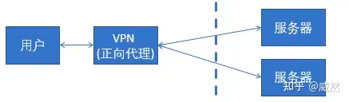

    这是nginx系列的第1篇文章，主要介绍的是nginx的架构。

<style>
.my-code {
   color: orange;
}
.orange {
   color: rgb(255, 53, 2)
}
.red {
   color: red
}
code {
   color: #0ABF5B;
}
</style>

# 一、Nginx是什么？
`Nginx`是一个高性能的http和反向代理服务器，其特点是占用内存小，并发能力强

<!--more-->

## 1.1、正向代理 & 反向代理

|       | 正向代理	                                | 反向代理                                   |
|-------|--------------------------------------|----------------------------------------|
|       |  | 	 |
| 代理谁：  | `代理客户端`，隐藏客户端真实IP                    | 	`代理服务器`，隐藏服务器真实IP                     |
| 安全性：  |                                      | 	防止服务器直接暴露                             |
| 典型场景： | 翻墙、内网访问外网资源                          | 	服务器集群、CDN、API网关                       |
| 配置：   | 在客户端主动设置                             | 	                                      |

正向代理配置：
```nginx
# 正向代理配置示例（监听本地8080端口，转发外部请求）
server {
    listen 8080;  # 客户端需设置本机8080端口为代理
    location / {
        proxy_pass http://$http_host$request_uri;  # 将请求转发给目标服务器
        resolver 8.8.8.8;  # DNS解析服务器
    }
}
```
- **客户端需主动设置**：在浏览器或系统中配置代理为`http://localhost:8080`

反向代理配置：
```nginx
# 反向代理配置示例（将请求转发到后端服务器集群）
server {
    listen 80;  # 客户端直接访问此端口
    server_name example.com;

    location / {
        proxy_pass http://backend_server;  # 后端服务器地址（如 http://192.168.1.100:3000）
        proxy_set_header Host $host;       # 传递原始Host头
        proxy_set_header X-Real-IP $remote_addr;  # 传递客户端真实IP
    }
}
```
- **客户端无需设置**：直接服务`http://example.com`，NGINX自动转发请求到后端服务器。

# 二、架构
| 架构图                                   | 中文架构图                                  |
|---------------------------------------|----------------------------------------|
|  |  |

Nginx 启动时，会生成两种类型的 进程：一个是 `主进程（master）`，一个 或 多个`工作进程（worker）`。
- `主进程`
主进程 并不处理网络请求，主要负责 `调度工作进程`，也就是图示的 3 项：`加载配置、启动工作进程 及 非停升级`。所以，Nginx 启动以后，查看操作系统的进程列表，我们就能看到 至少有两个 Nginx 进程。
- `工作进程`
服务器实际 `处理网络请求` 及 响应 的是 工作进程（worker），在类 unix 系统上，Nginx 可以配置 多个 worker，而每个 worker 进程 都可以同时处理 数以千计 的 网络请求
- `事件驱动模型`
基于 **异步及非阻塞** 的 **事件驱动模型**，可以说是 Nginx 得以获得 高并发、高性能 的关键因素，同时也得益于对 Linux、Solaris 及类 BSD 等操作系统内核中 事件通知 及 I/O 性能增强功能 的采用，如 kqueue、epoll 及 event ports。

> LVS：解决Nginx单点问题。

## 2.1、代码结构

```text
├── auto            自动检测系统环境以及编译相关的脚本
│   ├── cc          关于编译器相关的编译选项的检测脚本
│   ├── lib         nginx编译所需要的一些库的检测脚本
│   ├── os          与平台相关的一些系统参数与系统调用相关的检测
│   └── types       与数据类型相关的一些辅助脚本
├── conf            存放默认配置文件，在make install后，会拷贝到安装目录中去
├── contrib         存放一些实用工具，如geo配置生成工具（geo2nginx.pl）
├── html            存放默认的网页文件，在make install后，会拷贝到安装目录中去
├── man             nginx的man手册
└── src             存放nginx的源代码
    ├── core        nginx的核心源代码，包括常用数据结构的定义，以及nginx初始化运行的核心代码如main函数
    ├── event       对系统事件处理机制的封装，以及定时器的实现相关代码
    │   └── modules 不同事件处理方式的模块化，如select、poll、epoll、kqueue等
    ├── http        nginx作为http服务器相关的代码
    │   └── modules 包含http的各种功能模块
    ├── mail        nginx作为邮件代理服务器相关的代码
    ├── misc        一些辅助代码，测试c++头的兼容性，以及对google_perftools的支持
    └── os          主要是对各种不同体系统结构所提供的系统函数的封装，对外提供统一的系统调用接口
```

## 2.2、Nginx的模块化设计
`高度模块化` 的设计是 Nginx 的架构基础。Nginx 服务器被分解为 多个模块，每个模块就是一个 功能模块，只负责自身的功能，模块之间严格遵循 `“高内聚，低耦合”` 的原则。

`Nginx` 的模块化架构最基本的数据结构为 `ngx_module_t`，所有的模块都遵循着同样的接口设计规范。`ngx_module_t` 是 `ngx_module_s` 的别名，定义在 `src/core/ngx_core.h` 中：
```
typedef struct ngx_module_s          ngx_module_t;
```
而 `ngx_module_s` 在 `src/core/ngx_module.h` 中定义：
```
struct ngx_module_s {
    ngx_uint_t            ctx_index;                        // 模块在同类型模块数组中的索引序号
    ngx_uint_t            index;                            // 模块在所有模块数组中的索引序号
    char                 *name;                             // 模块的名称
    ngx_uint_t            spare0;                           // 保留变量
    ngx_uint_t            spare1;                           // 保留变量
    ngx_uint_t            version;                          // 模块的版本号 目前只有一种，默认为1
    const char           *signature;
    void                 *ctx;                              // 模块的上下文 不同的模块指向不同的上下文
    ngx_command_t        *commands;                         // 模块的命令集，指向一个 ngx_command_t 结构数组
    ngx_uint_t            type;                             // 模块类型 
    ngx_int_t           (*init_master)(ngx_log_t *log);     // master进程启动时回调
    ngx_int_t           (*init_module)(ngx_cycle_t *cycle); // 初始化模块时回调
    ngx_int_t           (*init_process)(ngx_cycle_t *cycle);// worker进程启动时回调
    ngx_int_t           (*init_thread)(ngx_cycle_t *cycle); // 线程启动时回调（nginx暂时无多线程模式）
    void                (*exit_thread)(ngx_cycle_t *cycle); // 线程退出时回调
    void                (*exit_process)(ngx_cycle_t *cycle);// worker进程退出时回调
    void                (*exit_master)(ngx_cycle_t *cycle); // master进程退出时回调
    uintptr_t             spare_hook0;                      // 保留字段
    uintptr_t             spare_hook1;
    uintptr_t             spare_hook2;
    uintptr_t             spare_hook3;
    uintptr_t             spare_hook4;
    uintptr_t             spare_hook5;
    uintptr_t             spare_hook6;
    uintptr_t             spare_hook7;
};

```


## 2.3、Nginx的进程模型
nginx分为`单进程模式`和`多进程模式`，`单进程模式`常常在开发环境调试时候使用，在对外服务时nginx多以`多进程方式`工作。多进程工作方式中为方便进程的统一管理，系统中分为一个master进程和多个work进程
- `master进程`主要负责信号处理以及work进程的管理，包括接收外界信号、向worker进程发送信号，监控worker进程的运行状态等，不直接对外提供web服务;
  - 服务器每当收到一个客户端时，就有 服务器主进程（master process）生成一个 子进程（worker process）出来和客户端建立连接进行交互，直到连接断开，该子进程就结束了。
- `worker进程`则主要对外提供web服务，各个work进程之间相互隔离且相互平等，从而避免进程之间的资源竞争导致的性能损耗，worker进程数目可以设置，一般设置为机器cpu核数

- 文件位置：`/src/os/unix/ngx_process_cycle.c`
  - 多进程模式`ngx_master_process_cycle`
  - 单进程模式`ngx_single_process_cycle`
### 2.3.1、master进程流程伪代码如下
```c++
void ngx_master_process_cycle(ngx_cycle_t *cycle){
	// 1.初始化信号位
    ngx_init_singal_flag();
    // 2.加载配置参数
    ngx_load_conf();
    // 3.fork创建worker进程
    ngx_start_worker_processes();
    // 4.启动缓存管理工作进程
    ngx_start_cache_manager_processes();
    //进入信号处理循环
    while(1){
        switch(singal){
            case delay:
                  ngx_delay_singal_handler();
                  break;
            case quit:
                  ngx_quit_singal_handler();
                  break;
            case terminate:
                  ngx_terminate_singal_handler();
                  break;
            case reconfigure:
                  ngx_reconfigure_singal_handler();
                  break;
            .....    
        }
    }
}
```

### 2.3.2、worker进程流程伪代码如下
```c++
static void ngx_worker_process_cycle(ngx_cycle_t *cycle, void *data)
{
    // 1.初始化worker进程
    ngx_worker_process_init(cycle, worker);
    while(1){	
		 // 1.处理退出信息
        if (ngx_exiting) {
            if (ngx_event_no_timers_left() == NGX_OK) {
                 ngx_worker_process_exit(cycle);
            }
        }
        // 2.事件处理 将在下一章节介绍
        ngx_process_events_and_timers(cycle);
		 // 3.
        if (ngx_terminate) {
            ngx_worker_process_exit(cycle);
        }
        if (ngx_quit) {
            if (!ngx_exiting) {
                ngx_exiting = 1;
                ngx_set_shutdown_timer(cycle);
                ngx_close_listening_sockets(cycle);
                ngx_close_idle_connections(cycle);
            }
        }
        if (ngx_reopen) {
           ngx_reopen_files(cycle, -1);
        }
    }
}
```

## 2.4、Nginx的事件驱动模型
`事件驱动`是一种比较古老的**响应事件**的模型。
> 事件驱动模型的基本思想应该是不主动轮询或等待事件，而是当事件发生时，系统能够及时处理。
> • 在传统的**同步IO模型**中，程序可能会在一个循环里不断检查是否有事件发生，这样会占用CPU资源，效率不高。
> • 而**事件驱动模型**则可能是当事件发生时，由系统或架构通知相应的处理函数来处理，这样程序不需要一直轮询，节省资源。我们常说的`Selector、poll、epoll`就是事件驱动模型。

`事件驱动处理库`又被称为`多路IO复用`方法，最常见的包括以下三种：select模型，poll模型和epoll模型。

事件驱动模型一般是由`事件收集器`，`事件发送器`，`事件处理器`三部分基本单元组成。
- `事件收集器`专门负责收集所有的事件。（技术代表：`select, poll, epoll`是这一层的核心实现）
- `事件发送器`负责将收集器收集到的事件分发到目标对象中。目标对象就是事件处理器所处的位置。
- `事件处理器`主要负责具体事件的响应工作，它往往要到实现阶段才完全确定。

核心流程如下：
1. **注册事件**：将 FD 及其关注的事件（如读、写）注册到内核。
2. **事件监听**：通过 `select`, `poll`, `epoll_wait` 阻塞等待事件就绪。
3. **事件分发**：就绪事件触发后，调用对应的回调函数处理。


## 2.5、Nginx的请求处理方式
`Nginx` 是一个 高性能 的 `Web` 服务器，能够同时处理 **大量的并发请求**。它结合 `多进程机制` 和 `事件驱动模型`。

整个配置文件的结构大致如下：
```
#全局块
#user  nobody;
worker_processes  1;

#event块
events {
    worker_connections  1024;
}

#http块
http {
    #http全局块
    include       mime.types;
    default_type  application/octet-stream;
    sendfile        on;
    keepalive_timeout  65;
    #server块
    server {
        #server全局块
        listen       8000;
        server_name  localhost;
        #location块
        location / {
            root   html;
            index  index.html index.htm;
        }
        error_page   500 502 503 504  /50x.html;
        location = /50x.html {
            root   html;
        }
    }
    #这边可以有多个server块
    server {
      ...
    }
}

```

# 三、配置文件
`Nginx`的主配置文件是`nginx.conf`，这个配置文件一共由三部分组成，分别为`全局块`、`events块`和`http块`。

## 第一部分 全局块
主要设置一些影响 `nginx` 服务器整体运行的配置指令

- `worker_processes 1;` 
> 运行工作进程个数，一般设置cpu的核心或者核心数x2
> worker_processes 值越大，可以支持的并发处理量就越多

- `worker_rlimit_nofile 65535;`
> Nginx最多可以打开文件数

## 第二部分 events块
`events` 块涉及的指令主要影响Nginx服务器与用户的网络连接

- `worker_connections 1024;` 
> 支持的最大连接数。 work_connections是单个worker进程允许客户端最大连接数

## 第三部分 http块
`http` 块又包括 `http 全局块`和 `server 块`，是服务器配置中最频繁的部分，包括配置代理、缓存、日志定义等绝大多数功能。
- sendfile on；
//开启高效文件传输模式，sendfile指令指定nginx是否调用sendfile函数来输出文件，对于普通应用设为 on，如果用来进行下载等应用磁盘IO重负载应用，可设置为off，以平衡磁盘与网络I/O处理速度，降低系统的负载

### server块
配置虚拟主机的相关参数。决定了Nginx如何处理特定域名或端口的请求。

server块的典型结构
```
server {
    # 监听端口和协议（如 HTTP 80 或 HTTPS 443）
    listen 80;
    listen [::]:80;        # IPv6 监听（可选）
    server_name example.com www.example.com;  # 绑定的域名

    # 配置访问日志（可选，默认继承全局日志配置）
    access_log /var/log/nginx/example.com.access.log;
    error_log  /var/log/nginx/example.com.error.log;

    # 根目录和默认文件（静态网站配置）
    root /var/www/example.com/html;
    index index.html index.htm;

    # 请求处理规则（通过 location 块细化）
    location / {
        try_files $uri $uri/ =404;  # 优先匹配静态文件，否则返回404
    }

    # 反向代理配置示例（将请求转发到后端应用）
    location /api/ {
        proxy_pass http://localhost:3000;
        proxy_set_header Host $host;
    }

    # SSL 配置（HTTPS 示例）
    # listen 443 ssl;
    # ssl_certificate     /path/to/cert.pem;
    # ssl_certificate_key /path/to/private.key;
}
```

## 3.1、配置示例
```
######Nginx配置文件nginx.conf中文详解#####

#定义Nginx运行的用户和用户组
user www www;

#nginx进程数，建议设置为等于CPU总核心数。
worker_processes 8;
 
#全局错误日志定义类型，[ debug | info | notice | warn | error | crit ]
error_log /usr/local/nginx/logs/error.log info;

#进程pid文件
pid /usr/local/nginx/logs/nginx.pid;

#指定进程可以打开的最大描述符：数目
#工作模式与连接数上限
#这个指令是指当一个nginx进程打开的最多文件描述符数目，理论值应该是最多打开文件数（ulimit -n）与nginx进程数相除，但是nginx分配请求并不是那么均匀，所以最好与ulimit -n 的值保持一致。
#现在在linux 2.6内核下开启文件打开数为65535，worker_rlimit_nofile就相应应该填写65535。
#这是因为nginx调度时分配请求到进程并不是那么的均衡，所以假如填写10240，总并发量达到3-4万时就有进程可能超过10240了，这时会返回502错误。
worker_rlimit_nofile 65535;


events
{
    #参考事件模型，use [ kqueue | rtsig | epoll | /dev/poll | select | poll ]; epoll模型
    #是Linux 2.6以上版本内核中的高性能网络I/O模型，linux建议epoll，如果跑在FreeBSD上面，就用kqueue模型。
    #补充说明：
    #与apache相类，nginx针对不同的操作系统，有不同的事件模型
    #A）标准事件模型
    #Select、poll属于标准事件模型，如果当前系统不存在更有效的方法，nginx会选择select或poll
    #B）高效事件模型
    #Kqueue：使用于FreeBSD 4.1+, OpenBSD 2.9+, NetBSD 2.0 和 MacOS X.使用双处理器的MacOS X系统使用kqueue可能会造成内核崩溃。
    #Epoll：使用于Linux内核2.6版本及以后的系统。
    #/dev/poll：使用于Solaris 7 11/99+，HP/UX 11.22+ (eventport)，IRIX 6.5.15+ 和 Tru64 UNIX 5.1A+。
    #Eventport：使用于Solaris 10。 为了防止出现内核崩溃的问题， 有必要安装安全补丁。
    use epoll;

    #单个进程最大连接数（最大连接数=连接数*进程数）
    #根据硬件调整，和前面工作进程配合起来用，尽量大，但是别把cpu跑到100%就行。每个进程允许的最多连接数，理论上每台nginx服务器的最大连接数为。
    worker_connections 65535;

    #keepalive超时时间。
    keepalive_timeout 60;

    #客户端请求头部的缓冲区大小。这个可以根据你的系统分页大小来设置，一般一个请求头的大小不会超过1k，不过由于一般系统分页都要大于1k，所以这里设置为分页大小。
    #分页大小可以用命令getconf PAGESIZE 取得。
    #[root@web001 ~]# getconf PAGESIZE
    #4096
    #但也有client_header_buffer_size超过4k的情况，但是client_header_buffer_size该值必须设置为“系统分页大小”的整倍数。
    client_header_buffer_size 4k;

    #这个将为打开文件指定缓存，默认是没有启用的，max指定缓存数量，建议和打开文件数一致，inactive是指经过多长时间文件没被请求后删除缓存。
    open_file_cache max=65535 inactive=60s;

    #这个是指多长时间检查一次缓存的有效信息。
    #语法:open_file_cache_valid time 默认值:open_file_cache_valid 60 使用字段:http, server, location 这个指令指定了何时需要检查open_file_cache中缓存项目的有效信息.
    open_file_cache_valid 80s;

    #open_file_cache指令中的inactive参数时间内文件的最少使用次数，如果超过这个数字，文件描述符一直是在缓存中打开的，如上例，如果有一个文件在inactive时间内一次没被使用，它将被移除。
    #语法:open_file_cache_min_uses number 默认值:open_file_cache_min_uses 1 使用字段:http, server, location  这个指令指定了在open_file_cache指令无效的参数中一定的时间范围内可以使用的最小文件数,如果使用更大的值,文件描述符在cache中总是打开状态.
    open_file_cache_min_uses 1;
    
    #语法:open_file_cache_errors on | off 默认值:open_file_cache_errors off 使用字段:http, server, location 这个指令指定是否在搜索一个文件时记录cache错误.
    open_file_cache_errors on;
}
 
 
 
#设定http服务器，利用它的反向代理功能提供负载均衡支持
http
{
    #文件扩展名与文件类型映射表
    include mime.types;

    #默认文件类型
    default_type application/octet-stream;

    #默认编码
    #charset utf-8;

    #服务器名字的hash表大小
    #保存服务器名字的hash表是由指令server_names_hash_max_size 和server_names_hash_bucket_size所控制的。参数hash bucket size总是等于hash表的大小，并且是一路处理器缓存大小的倍数。在减少了在内存中的存取次数后，使在处理器中加速查找hash表键值成为可能。如果hash bucket size等于一路处理器缓存的大小，那么在查找键的时候，最坏的情况下在内存中查找的次数为2。第一次是确定存储单元的地址，第二次是在存储单元中查找键 值。因此，如果Nginx给出需要增大hash max size 或 hash bucket size的提示，那么首要的是增大前一个参数的大小.
    server_names_hash_bucket_size 128;

    #客户端请求头部的缓冲区大小。这个可以根据你的系统分页大小来设置，一般一个请求的头部大小不会超过1k，不过由于一般系统分页都要大于1k，所以这里设置为分页大小。分页大小可以用命令getconf PAGESIZE取得。
    client_header_buffer_size 32k;

    #客户请求头缓冲大小。nginx默认会用client_header_buffer_size这个buffer来读取header值，如果header过大，它会使用large_client_header_buffers来读取。
    large_client_header_buffers 4 64k;

    #设定通过nginx上传文件的大小
    client_max_body_size 8m;

    #开启高效文件传输模式，sendfile指令指定nginx是否调用sendfile函数来输出文件，对于普通应用设为 on，如果用来进行下载等应用磁盘IO重负载应用，可设置为off，以平衡磁盘与网络I/O处理速度，降低系统的负载。注意：如果图片显示不正常把这个改成off。
    #sendfile指令指定 nginx 是否调用sendfile 函数（zero copy 方式）来输出文件，对于普通应用，必须设为on。如果用来进行下载等应用磁盘IO重负载应用，可设置为off，以平衡磁盘与网络IO处理速度，降低系统uptime。
    sendfile on;

    #开启目录列表访问，合适下载服务器，默认关闭。
    autoindex on;

    #此选项允许或禁止使用socke的TCP_CORK的选项，此选项仅在使用sendfile的时候使用
    tcp_nopush on;
     
    tcp_nodelay on;

    #长连接超时时间，单位是秒
    keepalive_timeout 120;

    #FastCGI相关参数是为了改善网站的性能：减少资源占用，提高访问速度。下面参数看字面意思都能理解。
    fastcgi_connect_timeout 300;
    fastcgi_send_timeout 300;
    fastcgi_read_timeout 300;
    fastcgi_buffer_size 64k;
    fastcgi_buffers 4 64k;
    fastcgi_busy_buffers_size 128k;
    fastcgi_temp_file_write_size 128k;

    #gzip模块设置
    gzip on; #开启gzip压缩输出
    gzip_min_length 1k;    #最小压缩文件大小
    gzip_buffers 4 16k;    #压缩缓冲区
    gzip_http_version 1.0;    #压缩版本（默认1.1，前端如果是squid2.5请使用1.0）
    gzip_comp_level 2;    #压缩等级
    gzip_types text/plain application/x-javascript text/css application/xml;    #压缩类型，默认就已经包含textml，所以下面就不用再写了，写上去也不会有问题，但是会有一个warn。
    gzip_vary on;

    #开启限制IP连接数的时候需要使用
    #limit_zone crawler $binary_remote_addr 10m;


    #负载均衡配置
    upstream jh.w3cschool.cn {
     
        #upstream的负载均衡，weight是权重，可以根据机器配置定义权重。weigth参数表示权值，权值越高被分配到的几率越大。
        server 192.168.80.121:80 weight=3;
        server 192.168.80.122:80 weight=2;
        server 192.168.80.123:80 weight=3;

        #nginx的upstream目前支持4种方式的分配
        #1、轮询（默认）
        #每个请求按时间顺序逐一分配到不同的后端服务器，如果后端服务器down掉，能自动剔除。
        #2、weight
        #指定轮询几率，weight和访问比率成正比，用于后端服务器性能不均的情况。
        #例如：
        #upstream bakend {
        #    server 192.168.0.14 weight=10;
        #    server 192.168.0.15 weight=10;
        #}
        #2、ip_hash
        #每个请求按访问ip的hash结果分配，这样每个访客固定访问一个后端服务器，可以解决session的问题。
        #例如：
        #upstream bakend {
        #    ip_hash;
        #    server 192.168.0.14:88;
        #    server 192.168.0.15:80;
        #}
        #3、fair（第三方）
        #按后端服务器的响应时间来分配请求，响应时间短的优先分配。
        #upstream backend {
        #    server server1;
        #    server server2;
        #    fair;
        #}
        #4、url_hash（第三方）
        #按访问url的hash结果来分配请求，使每个url定向到同一个后端服务器，后端服务器为缓存时比较有效。
        #例：在upstream中加入hash语句，server语句中不能写入weight等其他的参数，hash_method是使用的hash算法
        #upstream backend {
        #    server squid1:3128;
        #    server squid2:3128;
        #    hash $request_uri;
        #    hash_method crc32;
        #}

        #tips:
        #upstream bakend{#定义负载均衡设备的Ip及设备状态}{
        #    ip_hash;
        #    server 127.0.0.1:9090 down;
        #    server 127.0.0.1:8080 weight=2;
        #    server 127.0.0.1:6060;
        #    server 127.0.0.1:7070 backup;
        #}
        #在需要使用负载均衡的server中增加 proxy_pass http://bakend/;

        #每个设备的状态设置为:
        #1.down表示单前的server暂时不参与负载
        #2.weight为weight越大，负载的权重就越大。
        #3.max_fails：允许请求失败的次数默认为1.当超过最大次数时，返回proxy_next_upstream模块定义的错误
        #4.fail_timeout:max_fails次失败后，暂停的时间。
        #5.backup： 其它所有的非backup机器down或者忙的时候，请求backup机器。所以这台机器压力会最轻。

        #nginx支持同时设置多组的负载均衡，用来给不用的server来使用。
        #client_body_in_file_only设置为On 可以讲client post过来的数据记录到文件中用来做debug
        #client_body_temp_path设置记录文件的目录 可以设置最多3层目录
        #location对URL进行匹配.可以进行重定向或者进行新的代理 负载均衡
    }
     
     
     
    #虚拟主机的配置
    server
    {
        #监听端口
        listen 80;

        #域名可以有多个，用空格隔开
        server_name www.w3cschool.cn w3cschool.cn;
        index index.html index.htm index.php;
        root /data/www/w3cschool;

        #对******进行负载均衡
        location ~ .*.(php|php5)?$
        {
            fastcgi_pass 127.0.0.1:9000;
            fastcgi_index index.php;
            include fastcgi.conf;
        }
         
        #图片缓存时间设置
        location ~ .*.(gif|jpg|jpeg|png|bmp|swf)$
        {
            expires 10d;
        }
         
        #JS和CSS缓存时间设置
        location ~ .*.(js|css)?$
        {
            expires 1h;
        }
         
        #日志格式设定
        #$remote_addr与$http_x_forwarded_for用以记录客户端的ip地址；
        #$remote_user：用来记录客户端用户名称；
        #$time_local： 用来记录访问时间与时区；
        #$request： 用来记录请求的url与http协议；
        #$status： 用来记录请求状态；成功是200，
        #$body_bytes_sent ：记录发送给客户端文件主体内容大小；
        #$http_referer：用来记录从那个页面链接访问过来的；
        #$http_user_agent：记录客户浏览器的相关信息；
        #通常web服务器放在反向代理的后面，这样就不能获取到客户的IP地址了，通过$remote_add拿到的IP地址是反向代理服务器的iP地址。反向代理服务器在转发请求的http头信息中，可以增加x_forwarded_for信息，用以记录原有客户端的IP地址和原来客户端的请求的服务器地址。
        log_format access '$remote_addr - $remote_user [$time_local] "$request" '
        '$status $body_bytes_sent "$http_referer" '
        '"$http_user_agent" $http_x_forwarded_for';
         
        #定义本虚拟主机的访问日志
        access_log  /usr/local/nginx/logs/host.access.log  main;
        access_log  /usr/local/nginx/logs/host.access.404.log  log404;
         
        #对 "/" 启用反向代理
        location / {
            proxy_pass http://127.0.0.1:88;
            proxy_redirect off;
            proxy_set_header X-Real-IP $remote_addr;
             
            #后端的Web服务器可以通过X-Forwarded-For获取用户真实IP
            proxy_set_header X-Forwarded-For $proxy_add_x_forwarded_for;
             
            #以下是一些反向代理的配置，可选。
            proxy_set_header Host $host;

            #允许客户端请求的最大单文件字节数
            client_max_body_size 10m;

            #缓冲区代理缓冲用户端请求的最大字节数，
            #如果把它设置为比较大的数值，例如256k，那么，无论使用firefox还是IE浏览器，来提交任意小于256k的图片，都很正常。如果注释该指令，使用默认的client_body_buffer_size设置，也就是操作系统页面大小的两倍，8k或者16k，问题就出现了。
            #无论使用firefox4.0还是IE8.0，提交一个比较大，200k左右的图片，都返回500 Internal Server Error错误
            client_body_buffer_size 128k;

            #表示使nginx阻止HTTP应答代码为400或者更高的应答。
            proxy_intercept_errors on;

            #后端服务器连接的超时时间_发起握手等候响应超时时间
            #nginx跟后端服务器连接超时时间(代理连接超时)
            proxy_connect_timeout 90;

            #后端服务器数据回传时间(代理发送超时)
            #后端服务器数据回传时间_就是在规定时间之内后端服务器必须传完所有的数据
            proxy_send_timeout 90;

            #连接成功后，后端服务器响应时间(代理接收超时)
            #连接成功后_等候后端服务器响应时间_其实已经进入后端的排队之中等候处理（也可以说是后端服务器处理请求的时间）
            proxy_read_timeout 90;

            #设置代理服务器（nginx）保存用户头信息的缓冲区大小
            #设置从被代理服务器读取的第一部分应答的缓冲区大小，通常情况下这部分应答中包含一个小的应答头，默认情况下这个值的大小为指令proxy_buffers中指定的一个缓冲区的大小，不过可以将其设置为更小
            proxy_buffer_size 4k;

            #proxy_buffers缓冲区，网页平均在32k以下的设置
            #设置用于读取应答（来自被代理服务器）的缓冲区数目和大小，默认情况也为分页大小，根据操作系统的不同可能是4k或者8k
            proxy_buffers 4 32k;

            #高负荷下缓冲大小（proxy_buffers*2）
            proxy_busy_buffers_size 64k;

            #设置在写入proxy_temp_path时数据的大小，预防一个工作进程在传递文件时阻塞太长
            #设定缓存文件夹大小，大于这个值，将从upstream服务器传
            proxy_temp_file_write_size 64k;
        }
         
         
        #设定查看Nginx状态的地址
        location /NginxStatus {
            stub_status on;
            access_log on;
            auth_basic "NginxStatus";
            auth_basic_user_file confpasswd;
            #htpasswd文件的内容可以用apache提供的htpasswd工具来产生。
        }
         
        #本地动静分离反向代理配置
        #所有jsp的页面均交由tomcat或resin处理
        location ~ .(jsp|jspx|do)?$ {
            proxy_set_header Host $host;
            proxy_set_header X-Real-IP $remote_addr;
            proxy_set_header X-Forwarded-For $proxy_add_x_forwarded_for;
            proxy_pass http://127.0.0.1:8080;
        }
         
        #所有静态文件由nginx直接读取不经过tomcat或resin
        location ~ .*.(htm|html|gif|jpg|jpeg|png|bmp|swf|ioc|rar|zip|txt|flv|mid|doc|ppt|
        pdf|xls|mp3|wma)$
        {
            expires 15d; 
        }
         
        location ~ .*.(js|css)?$
        {
            expires 1h;
        }
    }
}
```

### 3.1.1、负载均衡
nginx的upstream目前支持4种方式的分配

#### 1、轮询（默认）
每个请求按时间顺序逐一分配到不同的后端服务器，如果后端服务器down掉，能自动剔除。
```
upstream myserver {   
  server 192.167.4.32:5000;
  server 192.168.4.32:8080;
}
```

#### 2、weight（权重）
指定轮询几率，weight和访问比率成正比，用于后端服务器性能不均的情况。
```
upstream bakend {
    server 192.168.0.14 weight=10;
    server 192.168.0.15 weight=10;
}
```

#### 3、ip_hash
每个请求按访问ip的hash结果分配，这样每个访客固定访问一个后端服务器，可以解决session的问题。

例如：
```
upstream bakend {
    ip_hash;
    server 192.168.0.14:88;
    server 192.168.0.15:80;
}
```

#### 4、fair（第三方）
按后端服务器的响应时间来分配请求，响应时间短的优先分配。
```
upstream backend {
    server server1;
    server server2;
    fair;
}
```

#### 5、url_hash（第三方）
按访问url的hash结果来分配请求，使每个url定向到同一个后端服务器，后端服务器为缓存时比较有效。

例：在upstream中加入hash语句，server语句中不能写入weight等其他的参数，hash_method是使用的hash算法
```
upstream backend {
    server squid1:3128;
    server squid2:3128;
    hash $request_uri;
    hash_method crc32;
}
```

参考文章：
[浅谈Nginx服务器的内部核心架构设计](https://juejin.cn/post/6844903638570123277)
[Nginx的模块化设计](https://mazhen.tech/p/nginx%E7%9A%84%E6%A8%A1%E5%9D%97%E5%8C%96%E8%AE%BE%E8%AE%A1/#%E6%A8%A1%E5%9D%97%E5%88%9D%E5%A7%8B%E5%8C%96)
[nginx分层模块设计](https://ruleless.github.io/2018/07/14/nginx-layer-design)
[Nginx配置文件详解](https://www.cnblogs.com/54chensongxia/p/12938929.html)