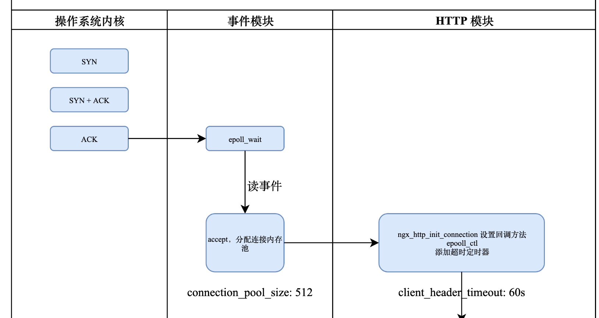

    这是nginx系列的第2篇文章，主要介绍的是nginx的请求处理过程。

<style>
.my-code {
   color: orange;
}
.orange {
   color: rgb(255, 53, 2)
}
.red {
   color: red
}
code {
   color: #0ABF5B;
}
</style>

# 一、Nginx是什么？
`Nginx`是一个高性能的http和反向代理服务器，其特点是占用内存小，并发能力强

<!--more-->

# 二、Nginx绑定端口
在Nginx启动文章中，我们解析了Nginx绑定端口流程。
```text
main()
├─ ngx_os_init()          // 操作系统初始化
├─ ngx_ssl_init()         // SSL 初始化
├─ ngx_init_cycle()       // 配置解析与周期初始化
│  ├─ ngx_conf_parse()    // 解析 nginx.conf
│  ├─ init_module()       // 调用模块的 init_module 回调
│  └─ nginx_open_listening_sockets() //监听端口绑定
└─ ngx_master_process_cycle()    //多进程模式
   ├─ ngx_start_worker_processes()   // 创建 & 启动 Worker 进程
   │  ├─ ngx_spawn_process()     // 循环执行该方法
   │  │  ├─ fork()               // 调用fork()创建 Worker 进程
   │  │  └─ proc()               // 子进程执行 ngx_worker_process_cycle()方法，Worker进程的主循环函数
   │  │     └─ ngx_worker_process_cycle() // 子进程执行 ngx_worker_process_cycle()方法，Worker进程的主循环函数
   │  │        ├─ ngx_worker_process_init() // Worker进程初始化
   │  │        └─ ngx_process_events_and_timers() // 处理事件
   │  └─ ngx_pass_open_channel() // 主子进程通信
   ├─ while(1)            // 主进程信号循环（处理reload, stop等信号）
   └─ Worker 事件循环 (epoll/kqueue)
```
在`ngx_init_cycle()`方法内部，`nginx_open_listening_sockets()`方法去绑定了端口，方法位于`src/core/ngx_connection.c`:
```c
// 简化后的逻辑
ngx_int_t ngx_open_listening_sockets(ngx_cycle_t *cycle) {
    for (port in all_listen_ports) {
        // 创建套接字
        fd = socket(addr->sockaddr->sa_family, SOCK_STREAM, 0);
        // 设置 SO_REUSEADDR
        setsockopt(fd, SOL_SOCKET, SO_REUSEADDR, &reuse, sizeof(int));
        // 绑定 IP:PORT
        bind(fd, addr->sockaddr, addr->socklen);
        // 开始监听
        listen(fd, backlog);
        // 将套接字存入 cycle->listening 数组
        cycle->listening.push(fd);
    }
    return NGX_OK;
}
```

# 三、Worker进程处理请求
`ngx_worker_process_cycle`子进程创建&执行流程如下：
```text
└─ ngx_start_worker_processes()   // 创建 & 启动 Worker 进程
   └─ ngx_spawn_process()     // 循环执行该方法
      ├─ fork()               // 调用fork()创建 Worker 进程
      └─ proc()               // 子进程执行 ngx_worker_process_cycle()方法，Worker进程的主循环函数
         └─ ngx_worker_process_cycle() // 子进程执行 ngx_worker_process_cycle()方法，Worker进程的主循环函数
            ├─ ngx_worker_process_init()       // 1. Worker进程初始化
            └─ ngx_process_events_and_timers() // 2. 处理事件
```
执行流程，主要进行：`Worker进程初始化 & 处理事件`
```c
static void ngx_worker_process_cycle(ngx_cycle_t *cycle, void *data)
{
    // 1.worker进程初始化
    ngx_worker_process_init(cycle, worker);
    //进入无限循环
    for(;;){	
        // 2.事件处理 将在下一章节介绍
        ngx_process_events_and_timers(cycle);
    }
}
```

## 3.1、Worker进程初始化阶段
`ngx_worker_process_init(cycle, worker)`方法是工作进程启动后的第一个关键函数，其核心职责包括：
- **初始化事件处理系统**：配置事件驱动引擎（如epoll）并注册监听套接字
- **设置进程间通信（IPC）**：通过`ngx_channel`机制监听来自主进程的指令（如配置更新、进程管理）
- **初始化全局数据结构**：如连接池、监听套接字列表、定时器等
- **调用模块的初始化函数**：确保各个模块（如事件模块、协议模块）在工作进程启动时正确初始化。

```c
static void
ngx_worker_process_init(ngx_cycle_t *cycle, ngx_int_t worker)
{
    // 设置环境变量
    if (ngx_set_environment(cycle, NULL) == NULL) {
        /* fatal */
        exit(2);
    }
    // 读取配置
    ccf = (ngx_core_conf_t *) ngx_get_conf(cycle->conf_ctx, ngx_core_module);
    // 1. 调用所有模块的init_process()，实际上只调用了 ngx_event_core_module 的 ngx_event_process_init()
    for (i = 0; cycle->modules[i]; i++) {
        if (cycle->modules[i]->init_process) {
            if (cycle->modules[i]->init_process(cycle) == NGX_ERROR) {
                /* fatal */
                exit(2);
            }
        }
    }

    // 2. 进程间通信（ICP）初始化
    if (ngx_add_channel_event(cycle, ngx_channel, NGX_READ_EVENT, ngx_channel_handler) == NGX_ERROR)
}
```

`ngx_process_events_and_timers`是`Nginx`工作进程的核心函数，负责处理所有IO事件（如网络连接、读写操作）和定时器事件。决定了Nginx如何高效处理高并发请求。

### 3.1.1、事件模块初始化
`ngx_event_core_module` 的 `ngx_event_process_init()`
- 初始化事件驱动引擎（如epoll）
- 注册监听套接字的accept事件（ngx_event_accept)
- 初始化定时器红黑树和信号处理。
```c
static ngx_int_t ngx_event_process_init(ngx_cycle_t *cycle) {
    // 1. 寻找事件模块（如 epoll）
    ngx_event_actions_t *actions;
    for (ngx_int_t m = 0; cycle->modules[m]; m++) {
        if (cycle->modules[m]->type == NGX_EVENT_MODULE) {
            actions = cycle->modules[m]->ctx->actions;
            actions->init(cycle, ngx_timer_resolution);  // 初始化 epoll/kqueue
            break;
        }
    }

    // 2. 注册监听套接字
    ngx_array_t *listening = &cycle->listening;
    for (size_t i = 0; i < listening->nelts; i++) {
        ngx_event_t *rev = listening->elts[i];
        ngx_connection_t *c = ngx_get_connection(rev->fd, cycle->log);
        rev->handler = ngx_event_accept;  // 设置 accept 回调
        ngx_add_event(rev, NGX_READ_EVENT, 0);  // 注册到 epoll
    }

    // 3. 初始化定时器红黑树
    ngx_rbtree_init(&ngx_event_timer_rbtree, &ngx_event_timer_sentinel, ngx_rbtree_insert_timer);
    // ...
    return NGX_OK;
}
```

### 3.1.2、进程间通信（ICP）初始化
`ngx_channel`的作用
- 用于主进程和工作进程通信，例如通知配置更新、广播新进程信息。


## 3.2、处理事件
`ngx_process_events_and_timers`是`Nginx`事件循环的核心函数，负责处理所有IO事件（如连接、读写）和定时器事件。它在每个工作进程的无限循环中被调用，是`Nginx`高性能和异步非阻塞模型的核心。
```text
└─ ngx_process_events_and_timers()   // 创建 & 启动 Worker 进程
   ├─ ngx_use_accept_mutex     // 先获取锁
   ├─ ngx_process_events()     // 调用事件驱动引擎，等待并收集已就绪的事件（可能会将事件放入队列）
   └─ ngx_event_process_posted()     // 循环执行该方法，处理队列中的数据
```


`ngx_process_events_and_timers`的源码在`src/event/ngx_event.c`文件下：
```c
void ngx_process_events_and_timers(ngx_cycle_t *cycle)
{
    //处理accept事件的负载均衡（ngx_use_accept_mutex）
    if (ngx_use_accept_mutex) {
        // 1. 检查进程是否过载（连接数超过阈值）
        if (ngx_accept_disabled > 0) {
            ngx_accept_disabled--;
        } else {
            // 2. 尝试获取 accept mutex 锁
            if (ngx_trylock_accept_mutex(cycle) == NGX_ERROR) {
                return; // 锁竞争失败，直接退出
            }
    
            if (ngx_accept_mutex_held) {
                // 3. 获取锁成功，设置延后处理标志
                flags |= NGX_POST_EVENTS; // 将 accept 事件延后处理
            } else {
                // 4. 未获取锁，设置最大等待时间
                if (timer > ngx_accept_mutex_delay) {
                    timer = ngx_accept_mutex_delay;
                }
            }
        }
    }
    delta = ngx_current_msec;
    // 2. 接下来，epoll要开始wait事件(调用 epoll/kqueue 等底层事件处理)
    // ngx_process_events的具体实现是对应到epoll模块中的ngx_epoll_process_events函数，这个过程在在下面也要详细的说明一下 
    (void) ngx_process_events(cycle, timer, flags);
    delta = ngx_current_msec - delta;
    // 3. 关键函数，遍历队列中的事件，调用其回调函数（如ngx_event_accept处理新连接）
    ngx_event_process_posted(cycle, &ngx_posted_accept_events);
}
```

### 3.2.1、ngx_process_events【调用事件驱动引擎】
然后就要介绍`(void) ngx_process_events(cycle, timer, flags)`这个过程了，有的人喜欢称这个为**钩子函数**，在我的理解他就是一个**回调函数**，这个函数的定义如下：
```
#define ngx_process_events   ngx_event_actions.process_events
```
注意这个`ngx_event_actions`，是Nginx事件驱动框架的核心抽象层，用于统一管理不同操作系统上的事件处理机制（如epoll、kqueue）。这个就是实现io复用的主要的**结构体**，它是一个全局变量，定义如下
```c
ngx_event_actions_t   ngx_event_actions;
typedef struct {
    void            (*init)(ngx_log_t *log);          // 初始化事件模块
    void            (*done)(ngx_cycle_t *cycle);      // 释放事件模块资源
    ngx_int_t       (*add_connection)(ngx_connection_t *c); // 添加连接到事件循环
    ngx_int_t       (*del_connection)(ngx_connection_t *c); // 从事件循环中移除连接
    ngx_int_t       (*add_event)(ngx_event_t *ev, int flags); // 添加事件（读/写）
    ngx_int_t       (*del_event)(ngx_event_t *ev, int flags); // 移除事件
    ngx_int_t       (*enable_connections)(ngx_uint_t flags); // 启用连接事件
    void            (*process_events)(ngx_cycle_t *cycle, ngx_uint_t flags); // 处理事件循环
    ngx_uint_t      (*flags); // 标志位（如是否支持多路复用）
} ngx_event_actions_t;
```
以epoll来说，其具体实现由`ngx_epoll_module`提供：
```c
static ngx_event_actions_t  ngx_epoll_module = {
    .init              = ngx_epoll_init,       // 初始化 epoll
    .add_connection    = ngx_epoll_add_conn,   // 添加连接到 epoll
    .del_connection    = ngx_epoll_del_conn,   // 移除连接
    .add_event         = ngx_epoll_add_event,  // 添加事件（读/写）
    .del_event         = ngx_epoll_del_event,  // 移除事件
    .process_events    = ngx_epoll_process_events, // 主事件循环
    .flags             = NGX_USE_EPOLL_EVENT   // 标志位（支持边缘触发）
};
```
这几种add,del等事件就不具体赘述了，详细说明下`ngx_epoll_process_events`，是`Nginx`处理`epoll`事件的核心函数。
```c
static ngx_int_t ngx_epoll_process_events(ngx_cycle_t *cycle, ngx_msec_t timer, ngx_uint_t flags) {
    struct epoll_event  events[NGX_EPOLL_MAX_EVENTS];
    // 等待并收集已就绪的事件
    int nevents = epoll_wait(epoll_fd, events, NGX_EPOLL_MAX_EVENTS, timer);
    // 处理就绪事件
    for (int i = 0; i < nevents; i++) {
        ngx_event_t *rev = events[i].data.ptr;
        if (flags & NGX_POST_EVENTS) {
            // 延后处理 accept 事件（锁已获取）
            //当Worker进程持有accept互斥锁（accept_mutex）时，为避免长时间占用锁，将事件放入队列延迟处理？
            ngx_post_event(rev, &ngx_posted_accept_events);
        } else {
            // 直接处理读写事件
            rev->handler(rev); // 调用事件回调（如 ngx_event_accept）
        }
    }
    return NGX_OK;
}
```
**队列类型**：
- `ngx_posted_accept_events`：专门存放新连接事件（`accept`），需快速处理。
- `ngx_posted_events`：存放普通读写事件，优先级较低。

为什么将新连接事件放入队列？
> <code class="red">核心目标：减少锁竞争</code>
> 
> 当多个Worker进程同时监听同一端口时（未启用`SO_REUSEPORT`），Nginx使用`accept_mutex`锁避免惊群效应。只有持有锁的`Worker`可以调用`accept()`接受新连接。
> 问题：如果Worker在持有锁时直接处理accept事件，锁的占用时机会变长，导致其他Worker无法及时获取锁，整体吞吐量下降。

### 3.2.2、`ngx_event_process_posted()`【遍历队列，处理事件】
关键函数`ngx_event_process_posted()`，负责处理被延迟的队列（2个队列），遍历队列中的事件，调用其回调函数（如`ngx_event_accept`处理新连接）。

事件处理要解决的两个问题：
1. `惊群` 问题，即多个 `worker` 子进程监听相同端口时，在 `accept` 建立新连接时会有争抢，引发不必要的上下文切换，增加系统开销。
2. `负载均衡`问题。

源码在`src/event/ngx_event_posted.c`文件下：
```c
void ngx_event_process_posted(ngx_cycle_t *cycle, ngx_queue_t *posted)
{
    ngx_queue_t  *q;
    ngx_event_t  *ev;

    while (!ngx_queue_empty(posted)) {
        q = ngx_queue_head(posted);//获取队列头部
        ev = ngx_queue_data(q, ngx_event_t, queue);//将队列元素转换为事件对象
        ngx_delete_posted_event(ev);//从队列中移除事件
        //调用事件的回调函数（如ngx_event_accept)
        ev->handler(ev);
    }
}
```


# 四、事件类型
| 事件类型      | 回调函数                 | 触发条件    | 核心功能           |
|-----------|----------------------|---------|----------------|
| accept事件  | ngx_event_accept     | 监听套接字可读 | 接收新连接，注册到事件循环  |
| 读事件（HTTP） | ngx_http_wait_request | 客户端发送数据 | 读取请求头/体，解析请求   |
| 写事件（HTTP） | ngx_http_output_filter | 内核缓冲区可写 | 发送响应头/体，管理连接状态 |
| 定时器事件     | 用户自定义回调           | 超时触发    | 处理超时关闭连接、重试等   |


## 4.1、新连接事件（accept events）
每个`监听待连接事件`的回调函数都是 `ngx_event_accept`，一旦监听到客户端发来的连接请求，就会调用该回调方法，是处理**新连接请求**的核心回调函数。

连接请求执行流程图如下：
```text
└─ ngx_process_events_and_timers()   // 创建 & 启动 Worker 进程
   ├─ ngx_use_accept_mutex         // 先获取锁
   └─ ngx_process_events()         
      └─ ngx_epoll_process_events()
         └─ epoll_wait()           // 等待并收集就绪事件
         └─ ngx_post_event()       // 添加到延迟队列中
   └─ ngx_event_process_posted()   // 循环执行该方法，处理延迟队列中的数据
      └─ handler() -> ngx_event_accept() //调用事件的回调函数
         └─ ngx_event_accept() -> handler() //调用事件的回调函数
            └─ handler() -> ngx_http_init_connection() //连接请求：调用HTTP模块的回调函数，是HTTP模块处理新TCP连接的核心入口。
```
`ngx_event_accept`回调函数源码位置：`src/event/ngx_event_accept.c`
```c
void ngx_event_accept(ngx_event_t *ev) {
    ngx_connection_t   *c;
    ngx_listening_t    *ls;
    ngx_socket_t        s;
    // 1. 获取监听对象（ngx_listening_t）
    ls = ev->data;
    // 2. 循环接受所有等待的连接（直到 EAGAIN 或达到 multi_accept 限制）
    do {
        // 2.1 接受连接
        s = accept(ls->fd, (struct sockaddr *)&sa, &socklen);
        if (s == -1) {
            // 处理错误（如 EAGAIN、EMFILE）
            if (errno == EAGAIN) {
                return; // 无更多连接可接受
            }
            ngx_accept_disabled = ngx_cycle->connection_n / 8;
            return;
        }
        // 2.2 创建新连接对象（ngx_connection_t）
        c = ngx_get_connection(s, ev->log);
        // 2.3 初始化连接属性（如地址、事件回调）
        c->pool = ngx_create_pool(ls->pool_size, ev->log);
        c->sockaddr = ngx_palloc(c->pool, socklen);
        ngx_memcpy(c->sockaddr, &sa, socklen);
        // 2.4 调用监听器回调（如 HTTP 模块的 ngx_http_init_connection）
        ls->handler(c);
    } while (ev->available--); // 受 multi_accept 和 available 影响
}
```

### 4.1.1、`惊群`问题解决
Worker进程通过锁竞争获取`accept`权限，避免多个进程同时`accept`导致的惊群效应。
```c
// 在 ngx_process_events_and_timers() 中
if (ngx_use_accept_mutex) {
    if (ngx_trylock_accept_mutex(cycle) == NGX_ERROR) {
        return;
    }
}
```

## 4.2、读写请求
读写请求执行流程图如下：
```text
└─ ngx_process_events_and_timers()   // 创建 & 启动 Worker 进程
   ├─ ngx_use_accept_mutex         // 先获取锁
   └─ ngx_process_events()         
      └─ ngx_epoll_process_events()
         └─ epoll_wait()           // 等待并收集就绪事件
         └─ handler() -> ngx_http_wait_request() //调用HTTP模块的回调函数
```


# 五、小结
事件的产生及处理流程如下图：

事件生成及处理，内容只解析到事件模块，HTTP模块的内部处理逻辑还没说明，下一篇文章进行详细解析。


