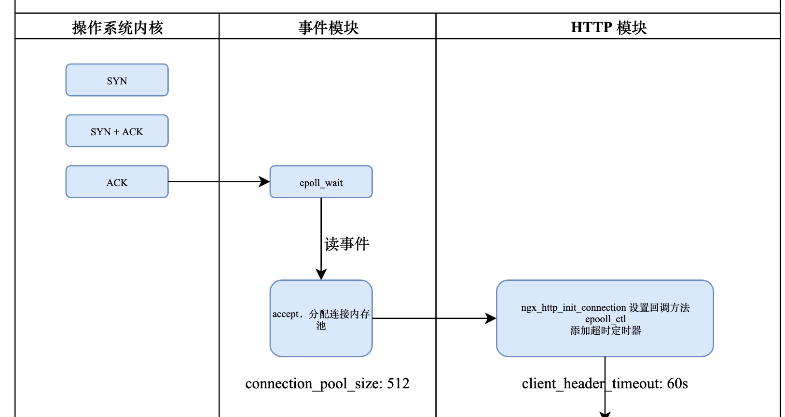

    这是nginx系列的第3篇文章，主要介绍的是nginx的HTTP请求处理过程，主要讲解HTTP模块的处理逻辑。

<style>
.my-code {
   color: orange;
}
.orange {
   color: rgb(255, 53, 2)
}
.red {
   color: red
}
code {
   color: #0ABF5B;
}
</style>

# 一、Nginx是什么？
`Nginx`是一个高性能的http和反向代理服务器，其特点是占用内存小，并发能力强

<!--more-->

# 二、事件处理流程
事件的产生及处理流程如下图：


# 三、解析完成请求行与请求头
`HTTP` 模块在启动时，会调用 `ngx_http_init_connection` 方法来设置回调方法，这个时候会把新建立连接的读事件通过 `epoll_ctl` 函数添加到 `epoll` 中，然后加一个超时定时器 `client_header_timeout: 60s`，这个定时器的作用是，如果超过 `60s` 还没有接收到客户端发来的请求，那么就会断开连接.

## 3.1、解析HTTP请求头
`ngx_event_accept`，用于接收socket连接，分配`connectio`n连接，并调用`ngx_listening_t`对象的处理函数（`ngx_http_init_connection`）。
```c
void ngx_event_accept(ngx_event_t *ev)
{
    s = accept4(lc->fd, (struct sockaddr *) sa, &socklen, SOCK_NONBLOCK);
 
    ngx_accept_disabled = ngx_cycle->connection_n / 8 - ngx_cycle->free_connection_n;
 
    c = ngx_get_connection(s, ev->log);
 
    ls->handler(c);
}
```

## 3.2、 `ngx_http_init_connection`

### 3.2.1、调用时机
当Worker进程通过`ngx_event_accept()`接受一个新连接后，会调用监听套接字（`ngx_listening_t`）的`handler`回调函数。对于HTTP模块，该回调函数即为`ngx_http_init_connection`.

### 3.2.2、核心流程与源码分析
源码位置：`src/http/ngx_http_request.c`

以下为简化后的逻辑：
```c
void ngx_http_init_connection(ngx_connection_t *c) {
    ngx_http_connection_t  *hc;

    // 1. 分配 HTTP 连接上下文结构
    hc = ngx_pcalloc(c->pool, sizeof(ngx_http_connection_t));
    c->data = hc; // 关联到 ngx_connection_t

    // 2. 初始化读写事件处理器
    c->read->handler = ngx_http_wait_request_handler; // 读事件回调
    c->write->handler = ngx_http_empty_handler;       // 写事件默认回调（可后续修改）

    // 3. 配置超时定时器
    ngx_add_timer(c->read, c->listening->client_header_timeout);

    // 4. 启用读事件监听（开始等待客户端发送请求）
    if (ngx_handle_read_event(c->read, 0) != NGX_OK) {
        ngx_http_close_connection(c);
        return;
    }

    // 5. 其他初始化（如 SSL 握手、PROXY 协议处理）
    if (c->ssl) {
        ngx_http_ssl_handshake(c); // SSL/TLS 握手
    }
}
```

## 3.3、ngx_http_wait_request_handler
函数ngx_http_wait_request_handler为解析HTTP请求的入口函数，实现如下：
```c
static void ngx_http_wait_request_handler(ngx_event_t *rev)
{
    //读事件已经超时
    if (rev->timedout) {
        ngx_log_error(NGX_LOG_INFO, c->log, NGX_ETIMEDOUT, "client timed out");
        ngx_http_close_connection(c);
        return;
    }
 
    n = c->recv(c, b->last, size);
 
    //创建请求对象ngx_http_request_t，HTTP请求整个处理过程都有用；
    c->data = ngx_http_create_request(c);
 
    //设置读事件处理函数（此次请求行可能没有读取完）
    rev->handler = ngx_http_process_request_line; 
    
    ngx_http_process_request_line(rev);
}
```
注意到当读事件超时时，nginx会直接关闭该链接；函数`ngx_http_create_request`创建并初始化`ngx_http_request_t`对象；解析请求行处理函数为`ngx_http_process_request_line`。
- 解析请求行与请求头的代码较为繁琐，重点在于读取socket数据，解析字符串，这里不做详述。

  
解析完成请求行与请求头，nginx就开始处理HTTP请求，并没有等到解析完请求体再处理。处理请求入口为`ngx_http_process_request`。


# 四、HTTP请求处理阶段
nginx将HTTP请求处理流程分为`11个阶段`，绝大多数HTTP模块都会将自己的handler添加到某个阶段（将handler添加到全局唯一的数组phases中），nginx处理HTTP请求时会挨个调用每个阶段的handler。需要注意的是其中有4个阶段不能添加自定义handler。11个阶段定义如下：
```c
typedef enum {
    NGX_HTTP_POST_READ_PHASE = 0, 
  
    NGX_HTTP_SERVER_REWRITE_PHASE,  //server块中配置了rewrite指令，重写url
  
    NGX_HTTP_FIND_CONFIG_PHASE,   //查找匹配的location配置；不能自定义handler；
    NGX_HTTP_REWRITE_PHASE,       //location块中配置了rewrite指令，重写url
    NGX_HTTP_POST_REWRITE_PHASE,  //检查是否发生了url重写，如果有，重新回到FIND_CONFIG阶段；不能自定义handler；
  
    NGX_HTTP_PREACCESS_PHASE,     //访问控制，比如限流模块会注册handler到此阶段
  
    NGX_HTTP_ACCESS_PHASE,        //访问权限控制，比如基于ip黑白名单的权限控制，基于用户名密码的权限控制等
    NGX_HTTP_POST_ACCESS_PHASE,   //根据访问权限控制阶段做相应处理；不能自定义handler；
  
    NGX_HTTP_TRY_FILES_PHASE,     //只有配置了try_files指令，才会有此阶段；不能自定义handler；
    NGX_HTTP_CONTENT_PHASE,       //内容产生阶段，返回响应给客户端
  
    NGX_HTTP_LOG_PHASE            //日志记录
} ngx_http_phases;
```


1. **POST_READ 阶段**
接收到完整的http头部后处理的阶段
2. **SERVER_REWRITE 阶段**
用于实现 `server{}` 配置里的 url 重写功能
3. **FIND_CONFIG 阶段**
这个阶段的功能是根据请求的 url 查找到匹配的 `locaiton{}`
4. **REWRITE 阶段**
用于处理 `location{}` 配置里的 url 重写
5. **POST_REWRITE 阶段**
6. **PREACCESS 阶段**
`ngx_http_limit_conn_module` 和 `ngx_http_limit_req_module` 模块工作在这个阶段，它们分别实现并发连接数限制和请求速率限制功能
7. **ACCESS 阶段**
`ngx_http_access_module` 和 `ngx_http_auth_basic_module` 工作在这个阶段，它们分别实现访问控制和基本认证的功能
8. **POST_ACCESS 阶段**
这个阶段是为了配合 ACCESS 阶段
9. **PRECONTENT 阶段**
`ngx_http_mirror_module` 工作在这个阶段，实现流量镜像的功能
10. **CONTENT 阶段**
这是最关键的一个阶段，也是外部模块最喜欢介入的阶段。`ngx_http_index_module、ngx_http_static_module` 工作在这个阶段实现返回静态页面的功能
        此步骤进行负载均衡的处理
11. **LOG 阶段**
`ngx_http_log_module` 模块工作在这个阶段，实现输出访问日志的功能
