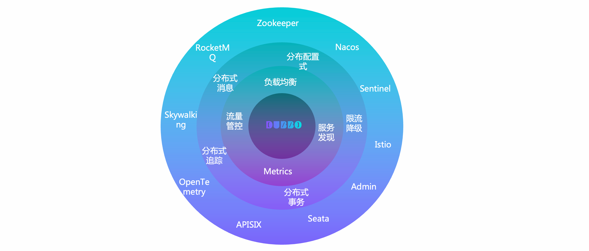
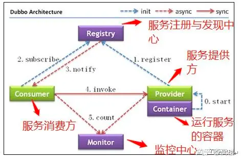
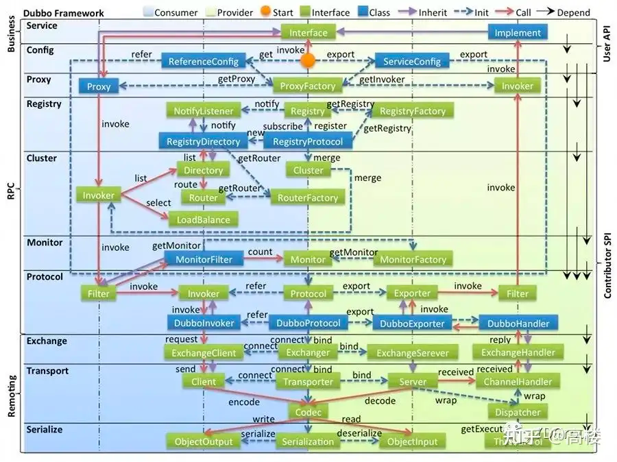
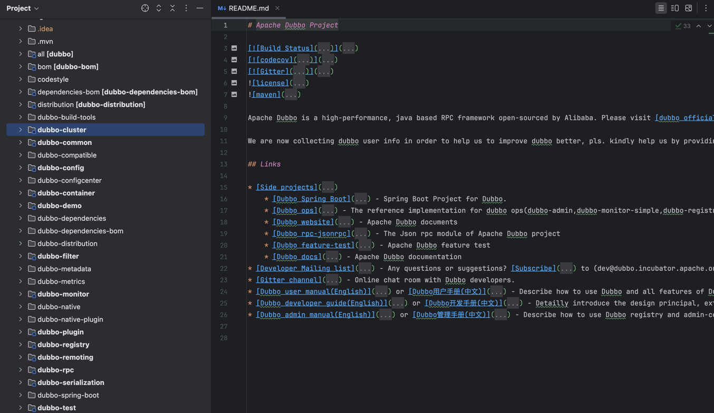

    这是dubbo系列的第1篇文章，主要介绍的是dubbo的架构。

<style>
.my-code {
   color: orange;
}
.orange {
   color: rgb(255, 53, 2)
}
.red {
   color: red
}
code {
   color: #0ABF5B;
}
</style>

# 一、dubbo
Dubbo 是一款微服务开发框架，它提供了 RPC通信 与 微服务治理 两大关键能力。这意味着，使用 Dubbo 开发的微服务，将具备相互之间的远程发现与通信能力， 同时利用 Dubbo 提供的丰富服务治理能力，可以实现诸如服务发现、负载均衡、流量调度等服务治理诉求。同时 Dubbo 是高度可扩展的，用户几乎可以在任意功能点去定制自己的实现，以改变框架的默认行为来满足自己的业务需求。

<!--more-->

Dubbo主要提供了`3大核心功能`：面向接口的远程方法调用，智能容错和负载均衡，以及服务自动注册和发现。
1. **远程方法调用**
网络通信框架，提供对多种NIO框架抽象封装，包括“同步转异步”和“请求-响应”模式的信息交换方式。

2. **智能容错和负载均衡**
提供基于接口方法的透明远程过程调用，包括多协议支持，以及软负载均衡，失败容错，地址路由，动态配置等集群支持。

3. **服务注册和发现**
服务注册，基于注册中心目录服务，使服务消费方能动态的查找服务提供方，使地址透明，使服务提供方可以平滑增加或减少机器。


# 二、Dubbo抽象架构

以上是 Dubbo 的工作原理图，从抽象架构上分为两层：**服务治理抽象控制面** 和 **Dubbo 数据面** 。
- **服务治理控制面**。服务治理控制面不是特指如注册中心类的单个具体组件，而是对 Dubbo 治理体系的抽象表达。控制面包含协调服务发现的注册中心、流量管控策略、Dubbo Admin 控制台等，如果采用了 Service Mesh 架构则还包含 Istio 等服务网格控制面。
- **Dubbo 数据面**。数据面代表集群部署的所有 Dubbo 进程，进程之间通过 RPC 协议实现数据交换，Dubbo 定义了微服务应用开发与调用规范并负责完成数据传输的编解码工作。
  - **服务消费者** (`Dubbo Consumer`)，发起业务调用或 RPC 通信的 `Dubbo` 进程
  - **服务提供者** (`Dubbo Provider`)，接收业务调用或 RPC 通信的 `Dubbo` 进程

## 2.1、通信协议
`Dubbo` 从设计上不绑定任何一款特定通信协议，`HTTP/2、REST、gRPC、JsonRPC、Thrift、Hessian2` 等几乎所有主流的通信协议，`Dubbo` 框架都可以提供支持。 这样的 `Protocol` 设计模式给构建微服务带来了最大的灵活性，开发者可以根据需要如性能、通用型等选择不同的通信协议，不再需要任何的代理来实现协议转换，甚至你还可以通过 `Dubbo` 实现不同协议间的迁移。

阿里内部使用**HSF 协议**
- HSF 协议针对阿里巴巴内部的高并发场景进行了优化，使用Netty作为网络通信框架，结合Hessian序列化协议。

## 2.2、服务治理
服务治理抽象

- 地址发现
Dubbo 服务发现具备高性能、支持大规模集群、服务级元数据配置等优势，默认提供 `Nacos、Zookeeper、Consul` 等多种注册中心适配，与 `Spring Cloud、Kubernetes Service` 模型打通，支持自定义扩展。

- 负载均衡
Dubbo 默认提供加权随机、加权轮询、最少活跃请求数优先、最短响应时间优先、一致性哈希和自适应负载等策略

- 流量路由
Dubbo 支持通过一系列流量规则控制服务调用的流量分布与行为，基于这些规则可以实现基于权重的比例流量分发、灰度验证、金丝雀发布、按请求参数的路由、同区域优先、超时配置、重试、限流降级等能力。

- 链路追踪
Dubbo 官方通过适配 `OpenTelemetry` 提供了对 `Tracing` 全链路追踪支持，用户可以接入支持 `OpenTelemetry` 标准的产品如 `Skywalking`、`Zipkin` 等。另外，很多社区如 `Skywalking`、`Zipkin` 等在官方也提供了对 Dubbo 的适配。

- 可观测性
Dubbo 实例通过 `Prometheus` 等上报 `QPS、RT、请求次数、成功率、异常次数`等多维度的可观测指标帮助了解服务运行状态，通过接入 `Grafana、Admin `控制台帮助实现数据指标可视化展示。

Dubbo 服务治理生态还提供了对 `API 网关、限流降级、数据一致性、认证鉴权`等场景的适配支持。


# 三、Dubbo的核心组件
Dubbo角色，主要包含如下几个核心组件：

## 3.1、核心组件
### a. Provider（服务提供者）
- **功能**：暴露服务接口的具体实现。
- **注册流程**：启动时向注册中心注册服务信息（IP、端口、接口等）。
- **示例配置**（XML）：
  ```xml
  <dubbo:service interface="com.example.UserService" ref="userService" />
  ```

### b. Consumer（服务消费者）
- **功能**：调用远程服务，通过代理与 Provider 通信。
- **订阅流程**：从注册中心获取 Provider 地址列表，通过负载均衡选择目标。
- **示例配置**：
  ```xml
  <dubbo:reference id="userService" interface="com.example.UserService" />
  ```

### c. Registry（注册中心）
- **作用**：服务发现与注册，维护服务提供者列表。
- **支持类型**：Zookeeper、Nacos、Redis、Consul 等。
  - **Zookeeper**：CP 系统，适合强一致性场景。
  - **Nacos**：AP/CP 可切换，支持动态配置，更适合云原生。

### d. Monitor（监控中心）
- **功能**：收集调用耗时、QPS、成功率等指标。
- **集成方式**：Dubbo Admin 或第三方监控系统（Prometheus + Grafana）。

### e. Container（容器）
- **角色**：管理服务生命周期（如 Spring 容器）。


# 四、分层架构
Dubbo 的架构设计采用分层模式，各层职责清晰、模块解耦，便于扩展和维护。以下是 Dubbo 的 **十层架构** 及其核心功能详解：


## 4.1、服务接口层（Service Layer）
- **职责**：定义业务服务接口（如 `UserService`），是开发者直接编写的业务代码。
- **示例**：
  ```java
  public interface UserService {
      User getUserById(String id);
  }
  ```

## 4.2、配置层（Config Layer）
- **职责**：解析和管理 Dubbo 的配置信息（XML、注解、YAML 等）。
- **关键类**：
  - `ServiceConfig`：服务提供者配置（如接口、实现类、超时时间）。
  - `ReferenceConfig`：服务消费者配置（如接口、负载均衡策略）。
- **配置方式**：
  ```xml
  <!-- XML 配置 -->
  <dubbo:service interface="com.example.UserService" ref="userService" />
  <dubbo:reference id="userService" interface="com.example.UserService" />
  ```

## 4.3、代理层（Proxy Layer）
- **职责**：为服务接口生成动态代理，屏蔽远程调用细节。
- **实现方式**：
  - **Javassist**（默认）：通过字节码生成高性能代理类。
  - **JDK Proxy**：基于接口生成代理（需接口明确）。
- **示例**：
  ```java
  // Consumer 调用远程服务时，实际调用的是代理对象
  UserService userService = proxyFactory.getProxy(invoker);
  userService.getUserById("1001"); // 触发远程调用
  ```

## 4.4、注册层（Registry Layer）
- **职责**：服务的注册与发现，管理 Provider 地址列表。
- **核心组件**：
  - **注册中心**：Zookeeper、Nacos、Consul 等。
  - **订阅/推送机制**：Consumer 订阅服务，注册中心推送地址变更。
- **流程**：
  1. Provider 启动时注册服务到注册中心。
  2. Consumer 启动时订阅服务地址列表。


## 4.5、路由层（Cluster Layer）
- **职责**：集群容错与负载均衡，确保调用高可用。
- **关键功能**：
  - **容错策略**：Failover（重试）、Failfast（快速失败）、Broadcast（广播）等。
  - **负载均衡**：Random（随机）、RoundRobin（轮询）、LeastActive（最少活跃）等。
- **配置示例**：
  ```yaml
  dubbo:
    consumer:
      cluster: failover
      loadbalance: leastactive
  ```


## 4.6、监控层（Monitor Layer）
- **职责**：收集并上报服务调用指标（QPS、耗时、成功率等）。
- **集成方式**：
  - **Dubbo Admin**：官方管控台，可视化监控。
  - **Prometheus + Grafana**：通过 Micrometer 导出指标数据。
- **配置**：
  ```yaml
  dubbo:
    metrics:
      enabled: true
      protocol: prometheus
  ```


## 4.8、协议层（Protocol Layer）
- **职责**：定义 RPC 通信协议，封装请求/响应模型。
- **支持协议**：
  - **Dubbo 协议**（默认）：基于 Netty + Hessian，长连接高性能。
  - **Triple 协议**（HTTP/2 + Protobuf）：兼容 gRPC，支持流式通信。
  - **HTTP/REST**：跨语言调用。
- **配置示例**：
  ```xml
  <dubbo:protocol name="dubbo" port="20880" />
  ```


## 4.8、交换层（Exchange Layer）
- **职责**：封装请求-响应模式，处理消息的编解码。
- **核心类**：
  - `Exchanger`：管理消息交换。
  - `ExchangeClient`/`ExchangeServer`：客户端和服务端的通信端点。
- **流程**：
  - 将 `Invocation` 对象编码为网络消息。
  - 接收响应后解码为结果对象。


## 4.9、传输层（Transport Layer）
- **职责**：网络数据传输，屏蔽底层通信细节。
- **实现方式**：
  - **Netty**（默认）：高性能异步网络框架。
  - **Mina**、**Grizzly**：可选的其他传输实现。
- **关键类**：
  - `Transporters`：创建网络服务端或客户端。
  - `Channel`：维护网络连接状态。


## 4.10、序列化层（Serialize Layer）
- **职责**：将对象转换为字节流（序列化）及反向转换（反序列化）。
- **支持协议**：
  - **Hessian 2**（默认）：高效二进制序列化。
  - **JSON**：可读性强，适合调试。
  - **Kryo**、**Protobuf**：高性能，需显式注册类。
- **配置示例**：
  ```yaml
  dubbo:
    protocol:
      serialization: hessian2
  ```
---

## **各层协作流程图**
```
Consumer 调用流程：
Service Layer → Proxy Layer → Cluster Layer → Protocol Layer → Exchange Layer → Transport Layer → Serialize Layer → 网络传输 → Provider 反向解析

Provider 处理流程：
Transport Layer → Serialize Layer → Exchange Layer → Protocol Layer → 反射调用 Service Layer 实现类 → 返回结果
```

---

### **分层架构的优势**
1. **模块解耦**：各层独立演化，例如替换序列化协议无需修改业务代码。
2. **扩展性**：通过 SPI 机制可自定义扩展（如新增负载均衡策略）。
3. **职责清晰**：每层聚焦单一职责，便于维护和调试。
4. **灵活性**：可根据场景选择协议、注册中心等组件。

---

### **实际应用场景**
- **跨语言调用**：使用 HTTP + JSON 协议，Consumer 为前端或其他语言服务。
- **高性能场景**：Dubbo 协议 + Hessian 序列化 + Netty 传输。
- **云原生集成**：Dubbo 3.0 + Triple 协议 + Kubernetes 服务发现。

---

### **总结**
Dubbo 的十层架构通过分层设计，将服务定义、配置管理、网络通信、序列化等职责清晰分离，既保证了高性能与灵活性，又为开发者提供了便捷的扩展能力。理解各层职责及协作关系，有助于优化调用链路、排查问题，并针对业务需求进行深度定制。


# 五、代码结构

核心模块：

| 模块名                  | 功能描述                                                                 |
|-------------------------|--------------------------------------------------------------------------|
| `dubbo-common`          | 公共工具类（URL 模型、SPI 加载器、序列化工具等）                          |
| `dubbo-config`          | `配置层实现`（XML/注解/YAML 解析，对应 `ServiceConfig`、`ReferenceConfig`） |
| `dubbo-rpc`             | RPC 核心（`协议`、`代理`、调用逻辑，支撑服务接口层和代理层）                   |
| `dubbo-registry`        | `注册层实现`（Zookeeper、Nacos 等注册中心集成）                             |
| `dubbo-cluster`         | `集群层实现`（负载均衡、容错策略、路由规则）                                 |
| `dubbo-remoting`        | `传输层`和`交换层`（Netty/Mina 网络通信、编解码）                              |
| `dubbo-serialization`   | `序列化层`（Hessian、JSON、Kryo 等协议实现）                                 |
| `dubbo-metadata`        | 元数据管理（服务暴露/订阅的元信息处理）                                    |
| `dubbo-filter`          | 过滤器链（扩展点，支持日志、鉴权、限流等拦截逻辑）                        |
| `dubbo-monitor`         | `监控层`（指标收集与上报）                                                  |

dubbo的代码结构通过模块化设计，将十层架构的每一层职责明确划分。

参考文章：
[了解 Dubbo 核心概念和架构](https://cn.dubbo.apache.org/zh-cn/overview/what/overview/)
