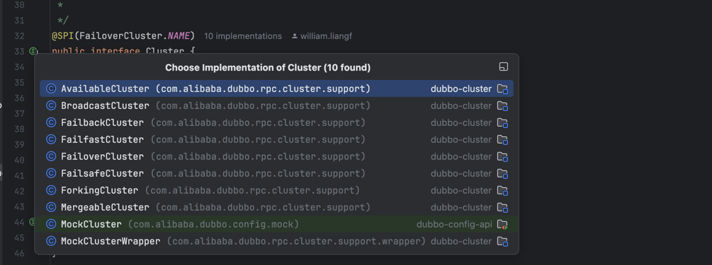
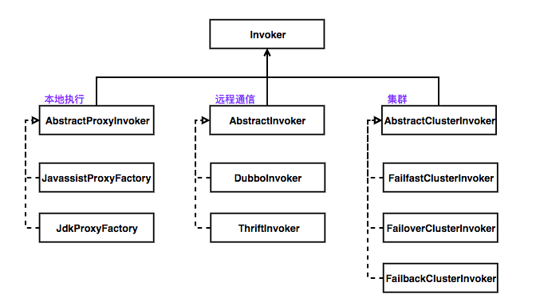

    这是dubbo系列的第3篇文章，主要介绍的是dubbo的Consumer启动流程。

<style>
.my-code {
   color: orange;
}
.orange {
   color: rgb(255, 53, 2)
}
.red {
   color: red
}
code {
   color: #0ABF5B;
}
</style>

# 一、dubbo
Dubbo 是一款微服务开发框架，它提供了 RPC通信 与 微服务治理 两大关键能力。这意味着，使用 Dubbo 开发的微服务，将具备相互之间的远程发现与通信能力， 同时利用 Dubbo 提供的丰富服务治理能力，可以实现诸如服务发现、负载均衡、流量调度等服务治理诉求。同时 Dubbo 是高度可扩展的，用户几乎可以在任意功能点去定制自己的实现，以改变框架的默认行为来满足自己的业务需求。

<!--more-->

Dubbo主要提供了`3大核心功能`：面向接口的远程方法调用，智能容错和负载均衡，以及服务自动注册和发现。
1. **远程方法调用**
网络通信框架，提供对多种NIO框架抽象封装，包括“同步转异步”和“请求-响应”模式的信息交换方式。

2. **智能容错和负载均衡**
提供基于接口方法的透明远程过程调用，包括多协议支持，以及软负载均衡，失败容错，地址路由，动态配置等集群支持。

3. **服务注册和发现**
服务注册，基于注册中心目录服务，使服务消费方能动态的查找服务提供方，使地址透明，使服务提供方可以平滑增加或减少机器。


# 二、示例代码
**启动类：**
```java
public class Consumer {
  public static void main(String[] args) {
    System.setProperty("java.net.preferIPv4Stack", "true");
    ClassPathXmlApplicationContext context = new ClassPathXmlApplicationContext(new String[]{"META-INF/spring/dubbo-demo-consumer.xml"});
    context.start();
    DemoService demoService = (DemoService) context.getBean("demoService"); // get remote service proxy
    while (true) {
      try {
        Thread.sleep(1000);
        String hello = demoService.sayHello("world"); // call remote method
        System.out.println(hello); // get result

      } catch (Throwable throwable) {
        throwable.printStackTrace();
      }
    }
  }
}
```
**配置文件：**
```xml
<beans xmlns:xsi="http://www.w3.org/2001/XMLSchema-instance"
       xmlns:dubbo="http://dubbo.apache.org/schema/dubbo"
       xmlns="http://www.springframework.org/schema/beans"
       xsi:schemaLocation="http://www.springframework.org/schema/beans http://www.springframework.org/schema/beans/spring-beans-4.3.xsd
       http://dubbo.apache.org/schema/dubbo http://dubbo.apache.org/schema/dubbo/dubbo.xsd">

  <dubbo:application name="demo-consumer"/>

  <dubbo:registry address="multicast://224.5.6.7:1234"/>

  <dubbo:reference id="demoService" check="false" interface="com.alibaba.dubbo.demo.DemoService"/>
</beans>
```

# 三、Consumer启动流程
`Consumer`启动流程包括
- **配置解析**
- **服务订阅**
- **代理生成**
- **调用准备**


## 3.1、配置解析与初始化
示例代码中，通过XML配置引入Dubbo。Dubbo的命名空间，相关的handler如下：
```java
public class DubboNamespaceHandler extends NamespaceHandlerSupport {
    static {
        Version.checkDuplicate(DubboNamespaceHandler.class);
    }
    @Override
    public void init() {
        registerBeanDefinitionParser("application", new DubboBeanDefinitionParser(ApplicationConfig.class, true));
        registerBeanDefinitionParser("module", new DubboBeanDefinitionParser(ModuleConfig.class, true));
        registerBeanDefinitionParser("registry", new DubboBeanDefinitionParser(RegistryConfig.class, true));
        registerBeanDefinitionParser("monitor", new DubboBeanDefinitionParser(MonitorConfig.class, true));
        registerBeanDefinitionParser("provider", new DubboBeanDefinitionParser(ProviderConfig.class, true));
        registerBeanDefinitionParser("consumer", new DubboBeanDefinitionParser(ConsumerConfig.class, true));
        registerBeanDefinitionParser("protocol", new DubboBeanDefinitionParser(ProtocolConfig.class, true));
        registerBeanDefinitionParser("service", new DubboBeanDefinitionParser(ServiceBean.class, true));
        registerBeanDefinitionParser("reference", new DubboBeanDefinitionParser(ReferenceBean.class, false));
        registerBeanDefinitionParser("annotation", new AnnotationBeanDefinitionParser());
    }
}
```
在`init()`方法中，注册了多个`BeanDefinitionParser`，每个解析器负责处理特定的`Dubbo XML`标签。

### 3.1.1、标签解析器
| XML 标签          | 解析器类                         | 对应配置类/Bean 类          | 关键参数说明          |
|-------------------|----------------------------------|----------------------------|----------------------|
| `application`     | `DubboBeanDefinitionParser`      | `ApplicationConfig`        | 应用全局配置（如应用名） |
| `module`          | `DubboBeanDefinitionParser`      | `ModuleConfig`             | 模块配置（已逐渐废弃）   |
| `registry`        | `DubboBeanDefinitionParser`      | `RegistryConfig`           | 注册中心配置（如 Zookeeper 地址） |
| `monitor`         | `DubboBeanDefinitionParser`      | `MonitorConfig`            | 监控中心配置          |
| `provider`        | `DubboBeanDefinitionParser`      | `ProviderConfig`           | 服务提供者默认配置    |
| `consumer`        | `DubboBeanDefinitionParser`      | `ConsumerConfig`           | 服务消费者默认配置    |
| `protocol`        | `DubboBeanDefinitionParser`      | `ProtocolConfig`           | 协议配置（如 Dubbo、HTTP） |
| `service`         | `DubboBeanDefinitionParser`      | `ServiceBean`              | 服务暴露配置          |
| `reference`       | `DubboBeanDefinitionParser`      | `ReferenceBean`            | 服务引用配置          |
| `annotation`      | `AnnotationBeanDefinitionParser` | -                          | 注解驱动配置（如包扫描） |

特殊解析器：`AnnotationBeanDefinitionParser`
- **功能**：处理 `<dubbo:annotation>` 标签，启用 `Dubbo` 注解扫描。
- **作用**：扫描 `@DubboService`（服务提供者）和 `@DubboReference`（服务消费者）注解，自动注册 Bean。
- **配置示例**：
  ```xml
  <dubbo:annotation package="com.example.service" />
  ```


## 3.2、核心类解析`ReferenceBean`
- **作用**：存储服务引用配置（接口、注册中心、负载均衡策略等），继承 `ReferenceConfig`。

`ReferenceBean`实现了`InitializingBean`接口，在Bean的初始化时，执行其`afterPropertiesSet()`方法：
```java
public class ReferenceBean<T> extends ReferenceConfig<T> implements FactoryBean<T>, ApplicationContextAware, InitializingBean {
  // ...

  @Override
  public void afterPropertiesSet() throws Exception {
    // 1. 检查必要配置是否缺失（如接口名）
    if (getInterface() == null) {
      throw new IllegalStateException("interface not specified");
    }
    // 2. 合并全局配置（如 ConsumerConfig、ApplicationConfig）
    checkAndUpdateSubConfigs();
    // 3. 初始化服务引用（生成代理对象）
    if (shouldInit()) {
      getObject(); // 触发服务引用流程
    }
  }
  @Override
  public T getObject() {
    return get(); // 调用父类 ReferenceConfig 的 get() 方法
  }
  private boolean shouldInit() {
    // 根据配置判断是否需要立即初始化（例如 lazy=false）
    return !isLazy() || (isLazy() && isInitialized());
  }
}
```
核心操作详解
- **必要属性校验**：确保`interface`（服务接口）已正确设置，否则抛出异常。
- **合并全局配置**：
  - 若未显示配置`consumer, application`等属性，从`spring`容器或`Dubbo`全局配置管理器（`ConfigManager`）中获取默认值。
  - 例如：未指定`<dubbo:consumer>`时，自动使用默认的`Consumer`配置（如超时时间）
- **触发服务引用**`get()`
  - **关键方法**：`getObject()`调用父类`ReferenceConfig`的`get()`方法，触发服务引用流程。
    - **订阅服务地址**：从注册中心（如）获取`provider`地址列表
    - **生成动态代理**：通过`ProxyFactory`创建远程服务调用的代理对象。
    - **初始化调用链**：加载`filter`链（如日志、鉴权）、集群容错策略（`Cluster`）、负载均衡策略（`loadBalance`）。


解析`get()`方法，其继承自`ReferenceConfig`，服务引用的核心流程:
```java
public synchronized T get() {
  // 1. 检查并更新缺省配置
  checkAndUpdateSubConfigs();

  if (destroyed) {
    throw new IllegalStateException("Already destroyed!");
  }
  // 如果ref 为null 则说明没有初始化，进行初始化。
  if (ref == null) {
    //2. 服务初始化
    init();
  }
  return ref;
}
```
`ReferenceConfig#init`，消费者服务的初始化，核心逻辑。
```java
private void init() {
    // 如果消费者服务已经初始化过，则直接返回
    if (initialized) {
        return;
    }
    initialized = true;
    // 检查存根合法性
    checkStubAndLocal(interfaceClass);
    // 检查mock合法性
    checkMock(interfaceClass);
    // 拼接参数
    Map<String, String> map = new HashMap<String, String>();
    // 添加 side、协议版本信息、时间戳和进程号等信息到 map 中
    map.put(Constants.SIDE_KEY, Constants.CONSUMER_SIDE);
    appendRuntimeParameters(map);
    // 不是泛化调用
    if (!isGeneric()) {
        // 获取版本
        String revision = Version.getVersion(interfaceClass, version);
        if (revision != null && revision.length() > 0) {
            map.put("revision", revision);
        }
         // 获取接口方法列表，并添加到 map 中
        String[] methods = Wrapper.getWrapper(interfaceClass).getMethodNames();
        if (methods.length == 0) {
            logger.warn("NO method found in service interface " + interfaceClass.getName());
            map.put("methods", Constants.ANY_VALUE);
        } else {
            map.put("methods", StringUtils.join(new HashSet<String>(Arrays.asList(methods)), ","));
        }
    }
    map.put(Constants.INTERFACE_KEY, interfaceName);
    // 添加参数到 map中
    appendParameters(map, application);
    appendParameters(map, module);
    appendParameters(map, consumer, Constants.DEFAULT_KEY);
    appendParameters(map, this);
    Map<String, Object> attributes = null;
    // 对 <method> 标签的解析
    if (methods != null && !methods.isEmpty()) {
        attributes = new HashMap<String, Object>();
        for (MethodConfig methodConfig : methods) {
            appendParameters(map, methodConfig, methodConfig.getName());
            // 重试参数解析
            String retryKey = methodConfig.getName() + ".retry";
            if (map.containsKey(retryKey)) {
                String retryValue = map.remove(retryKey);
                if ("false".equals(retryValue)) {
                    map.put(methodConfig.getName() + ".retries", "0");
                }
            }
            attributes.put(methodConfig.getName(), convertMethodConfig2AyncInfo(methodConfig));
        }
    }
     // 获取消费者要使用注册的 ip 地址，多网卡情况下需要可以指定ip
    String hostToRegistry = ConfigUtils.getSystemProperty(Constants.DUBBO_IP_TO_REGISTRY);
    if (hostToRegistry == null || hostToRegistry.length() == 0) {
        hostToRegistry = NetUtils.getLocalHost();
    } else if (isInvalidLocalHost(hostToRegistry)) {
        throw new IllegalArgumentException("Specified invalid registry ip from property:" + Constants.DUBBO_IP_TO_REGISTRY + ", value:" + hostToRegistry);
    }
    map.put(Constants.REGISTER_IP_KEY, hostToRegistry);
    // 创建提供者代理
    ref = createProxy(map);
    // 根据服务名，ReferenceConfig，代理类构建 ConsumerModel，
    // 并将 ConsumerModel 存入到 ApplicationModel 中
    ConsumerModel consumerModel = new ConsumerModel(getUniqueServiceName(), interfaceClass, ref, interfaceClass.getMethods(), attributes);
    ApplicationModel.initConsumerModel(getUniqueServiceName(), consumerModel);
}
```
上面的代码很多都和服务提供者的类似，前期工作都是对配置参数的处理，关键内容在于 代理的创建 `createProxy(map);`，这一步创建了引用服务的代理。

下面我们来看看 `ReferenceConfig#createProxy` 的实现过程。
```java
private T createProxy(Map<String, String> map) {
  URL tmpUrl = new URL("temp", "localhost", 0, map);
  final boolean isJvmRefer;
  /*******  1. 服务引用判断  ******/
  // 根据 isInjvm 参数判断是否指定了本地引用
  if (isInjvm() == null) {
    // 如果没有指定是否本地引用则 需要根据下面逻辑判断
    // 在指定本地引用的时候，但是 url 配置被指定，则不当做本地引用。
    // 该 url 在 ReferenceConfig#init 中 调用ReferenceConfig#resolveFile 方法解析获取。
    if (url != null && url.length() > 0) { // if a url is specified, don't do local reference
      isJvmRefer = false;
    } else {
      // by default, reference local service if there is
      // 根据 url 的协议、scope 以及 injvm 等参数检测是否需要本地引用
      // 比如如果用户显式配置了 scope=local，此时 isInjvmRefer 返回 true
      isJvmRefer = InjvmProtocol.getInjvmProtocol().isInjvmRefer(tmpUrl);
    }
  } else {
    //如果进行了本地引用配置，则按照配置的决定
    isJvmRefer = isInjvm();
  }
  // 确定了本地引用
  if (isJvmRefer) {
    /*******  2. 本地服务调用  ******/
    // 生成一个本地引用的URL，协议类型为 injvm
    URL url = new URL(Constants.LOCAL_PROTOCOL, NetUtils.LOCALHOST, 0, interfaceClass.getName()).addParameters(map);
    // 调用 refer 方法构建 InjvmInvoker 实例
    invoker = refprotocol.refer(interfaceClass, url);
  } else {
    /*******  3. 远程服务调用  ******/
    // 如果 url不为空，则说明可能会进行点对点调用，即服务直连
    // 这里的 url 是在 ReferenceConfig#init 中 调用 ReferenceConfig#resolveFile 方法解析获取。
    if (url != null && url.length() > 0) { // user specified URL, could be peer-to-peer address, or register center's address.
      // 当需要配置多个 url 时，可用分号进行分割，这里会进行切分
      String[] us = Constants.SEMICOLON_SPLIT_PATTERN.split(url);
      if (us != null && us.length > 0) {
        for (String u : us) {

          URL url = URL.valueOf(u);
          if (url.getPath() == null || url.getPath().length() == 0) {
            // 设置接口全限定名为 url 路径
            url = url.setPath(interfaceName);
          }
          // 如果 url 协议类型是 Registry，则说明需要使用指定的注册中心
          if (Constants.REGISTRY_PROTOCOL.equals(url.getProtocol())) {
            // 将 map 转换为查询字符串，并作为 refer 参数的值添加到 url 中,与服务暴露时的url 异曲同工
            urls.add(url.addParameterAndEncoded(Constants.REFER_KEY, StringUtils.toQueryString(map)));
          } else {
            // 合并 url，移除服务提供者的一些配置（这些配置来源于用户配置的 url 属性），
            // 比如线程池相关配置。并保留服务提供者的部分配置，比如版本，group，时间戳等
            // 最后将合并后的配置设置为 url 查询字符串中
            urls.add(ClusterUtils.mergeUrl(url, map));
          }
        }
      }
    } else { // assemble URL from register center's configuration
      // 如果没有服务直连，则需要从注册中心中获取提供者信息
      // 检查注册中心配置
      checkRegistry();
      // 加载注册中心 URL
      List<URL> us = loadRegistries(false);
      if (us != null && !us.isEmpty()) {
        for (URL u : us) {
          // 加载监控中心
          URL monitorUrl = loadMonitor(u);
          if (monitorUrl != null) {
            // 添加监控中心信息
            map.put(Constants.MONITOR_KEY, URL.encode(monitorUrl.toFullString()));
          }
          // 到这里说明存在注册中心， 则添加 refer 参数到 url 中，并将 url 添加到 urls 
          urls.add(u.addParameterAndEncoded(Constants.REFER_KEY, StringUtils.toQueryString(map)));
        }
      }
      // 未配置注册中心，抛出异常
      if (urls.isEmpty()) {
        throw new IllegalStateException("No such any registry to reference " + interfaceName + " on the consumer " + NetUtils.getLocalHost() + " use dubbo version " + Version.getVersion() + ", please config <dubbo:registry address=\"...\" /> to your spring config.");
      }
    }
    // 单个注册中心或服务提供者(服务直连)
    if (urls.size() == 1) {
      /*******  3.1 单URL场景的远程调用  ******/
      // 调用 RegistryProtocol 的 refer 构建 Invoker 实例
      invoker = refprotocol.refer(interfaceClass, urls.get(0));
    } else {
      /*******  3.2 多URL场景的远程调用  ******/
      // 多个注册中心或多个服务提供者，或者两者混合
      List<Invoker<?>> invokers = new ArrayList<Invoker<?>>();
      URL registryURL = null;
      // 获取所有的 Invoker
      for (URL url : urls) {
        // 通过 refprotocol 调用 refer 构建 Invoker，refprotocol 会在运行时
        // 根据 url 协议头加载指定的 Protocol 实例，并调用实例的 refer 方法
        // 这里 refprotocol 是 Protocol$Adaptive 适配器类型
        invokers.add(refprotocol.refer(interfaceClass, url));
        if (Constants.REGISTRY_PROTOCOL.equals(url.getProtocol())) {
          registryURL = url; // use last registry url
        }
      }
      if (registryURL != null) { // registry url is available
        // use RegistryAwareCluster only when register's cluster is available
        // 如果注册中心链接不为空，则将使用 RegistryAwareCluster
        URL u = registryURL.addParameter(Constants.CLUSTER_KEY, RegistryAwareCluster.NAME);
        // The invoker wrap relation would be: RegistryAwareClusterInvoker(StaticDirectory) -> FailoverClusterInvoker(RegistryDirectory, will execute route) -> Invoker
        // 创建 StaticDirectory 实例，并由 Cluster 对多个 Invoker 进行合并
        invoker = cluster.join(new StaticDirectory(u, invokers));
      } else { // not a registry url, must be direct invoke.
        invoker = cluster.join(new StaticDirectory(invokers));
      }
    }
  }
  // 是否检查提供者的可用性
  Boolean c = check;
  if (c == null && consumer != null) {
    c = consumer.isCheck();
  }
  if (c == null) {
    c = true; // default true
  }
  // 如果 为true，则消费者启动时对 invoker 进行可用性检查
  if (c && !invoker.isAvailable()) {
    // make it possible for consumer to retry later if provider is temporarily unavailable
    initialized = false;
    throw new IllegalStateException("Failed to check the status of the service " + interfaceName + ". No provider available for the service " + (group == null ? "" : group + "/") + interfaceName + (version == null ? "" : ":" + version) + " from the url " + invoker.getUrl() + " to the consumer " + NetUtils.getLocalHost() + " use dubbo version " + Version.getVersion());
  }
  /**
   * @since 2.7.0
   * ServiceData Store
   */
  // 2.7.0 版本后，元数据中心发布消费者服务信息
  /*******  4. 元数据中心服务发布  ******/
  MetadataReportService metadataReportService = null;
  if ((metadataReportService = getMetadataReportService()) != null) {
    URL consumerURL = new URL(Constants.CONSUMER_PROTOCOL, map.remove(Constants.REGISTER_IP_KEY), 0, map.get(Constants.INTERFACE_KEY), map);
    metadataReportService.publishConsumer(consumerURL);
  }
  // create service proxy
  /*******  5. 代理类的创建  ******/
  // 生成代理类
  return (T) proxyFactory.getProxy(invoker);
}
```
我们这里可以总结为五个过程：
1. `服务引用判断` ：首先需要根据用户参数确定当前服务引用是本地引用还是远程引用。二者的逻辑并不相同。
2. `本地服务调用` ：首先根据配置检查是否为本地调用，若是，则调用 `InjvmProtocol#refer` 方法生成 `InjvmInvoker` 实例。若不是，则读取直连配置项或注册中心 url，并将读取到的 url 存储到 urls 中。
3. `远程服务调用` ：远程服务的调用，分为两种情况，单URL 或 多URL场景。(这里的URL 指的是用户指定的注册中心或者直连URL)。通过这一步，将 URL 转化为了 `Invoker`。
  1. `单URL场景的远程调用` ：根据 `urls` 元素数量进行后续操作。若 urls 元素数量为1，则说明注册中心或直连URL只有一个，则直接通过 `Protocol` 自适应拓展类构建 Invoker 实例接口。
  2. `多URL的远程调用`：若 `urls` 元素数量大于1，即存在多个注册中心或服务直连 url，此时先根据 url 构建 `Invoker`。然后再通过 `Cluster` 合并多个 `Invoker`。
4. `元数据中心服务发布` ：`Dubbo 2.7` 版本之后新增了元数据中心和配置中心，其中元数据中心会存储当前暴露的服务信息。
5. `代理类的创建` ：在获取到Ref 的Invoker 后调用 `ProxyFactory` 生成代理类。

> 其中 ：Invoker 是 Dubbo 的核心模型，代表一个可执行体。在服务提供方，Invoker 用于调用服务提供类。在服务消费方，Invoker 用于执行远程调用。Invoker 是由 Protocol 实现类构建而来。


### 3.2.1、服务订阅（`directory.list()`）
**注册中心交互**：通过`RegistryDirectory`订阅服务地址，注册中心推送`provider`列表变更。
**地址缓存**：`Consumer`本地缓存`provider`地址，并监听注册中心事件动态更新。

```java
public class RegistryProtocol implements Protocol {
    private <T> Invoker<T> doRefer(Cluster cluster, Registry registry, Class<T> type, URL url) {
        RegistryDirectory<T> directory = new RegistryDirectory<T>(type, url);
        directory.setRegistry(registry);
        directory.setProtocol(protocol);
        // all attributes of REFER_KEY
        Map<String, String> parameters = new HashMap<String, String>(directory.getUrl().getParameters());
        URL subscribeUrl = new URL(Constants.CONSUMER_PROTOCOL, parameters.remove(Constants.REGISTER_IP_KEY), 0, type.getName(), parameters);
        if (!Constants.ANY_VALUE.equals(url.getServiceInterface())
                && url.getParameter(Constants.REGISTER_KEY, true)) {
            URL registeredConsumerUrl = getRegisteredConsumerUrl(subscribeUrl, url);
            registry.register(registeredConsumerUrl);
            directory.setRegisteredConsumerUrl(registeredConsumerUrl);
        }
        //向注册中心发起订阅
        directory.subscribe(subscribeUrl.addParameter(Constants.CATEGORY_KEY,
                Constants.PROVIDERS_CATEGORY
                        + "," + Constants.CONFIGURATORS_CATEGORY
                        + "," + Constants.ROUTERS_CATEGORY));

        Invoker invoker = cluster.join(directory);
        ProviderConsumerRegTable.registerConsumer(invoker, url, subscribeUrl, directory);
        return invoker;
    }
}
```
> 向注册中心（如ZK）订阅服务路径（如/dubbo/com.example.UserService/providers）。
> 注册中心返回当前provider地址列表，并持续推送变更事件。


### 3.2.2、集群容错（`Cluster.join()`）
**策略选择**：根据`cluster`配置（如`failover、failfast`）创建集群`invoker`。
**负载均衡**：在调用时通过`loadbalance`策略（如`random`）选择目标`provider`。

集群容错`Cluster`的实现类如下：


| 类型               | 功能                                                                     |
|------------------|------------------------------------------------------------------------|
| Failover Cluster | 失败自动切换，当出现失败，重试其它服务器。`通常用于读操作`，但重试会带来更长延迟。可通过 retries="2" 来设置重试次数(不含第一次) |
| Failfast Cluster | 快速失败，只发起一次调用，失败立即报错。通常用于非幂等性的`写操作`，比如新增记录                                |
| Failsafe Cluster | 失败安全，出现异常时，直接忽略。通常用于写入审计日志等操作                                          |
| Failback Cluster | 失败自动恢复，后台记录失败请求，定时重发。通常用于消息通知操作                                        |
| Forking Cluster  | 并行调用多个服务器，只要一个成功即返回。通常用于实时性要求较高的`读操作`，但需要浪费更多服务资源。可通过 forks="2" 来设置最大并行数 |

**如何配置？**（默认的策略是Failover，即失败自动切换）
```xml
<!-- 服务提供者配置 -->
<dubbo:service interface="com.example.DemoService" ref="demoServiceImpl" cluster="failover" retries="2" />

<!-- 服务消费者配置 -->
<dubbo:reference interface="com.example.DemoService" id="demoService" cluster="failover" retries="2" />
```

**注意事项：**
- **重试次数**：重试次数需要根据业务场景进行调整，过多的重试可能会增加系统负担，甚至导致雪崩效应。
- **非幂等操作**：对于非幂等的写操作，需要谨慎使用`failover`策略，避免因重试导致数据不一致。


### 3.2.3、动态代理生成（proxyFactory.getProxy()）
**实现方式**：默认使用`JavassistProxyFactory`生成字节码代理类。
**代理逻辑**：将本地方法调用转发到远程`provider`，处理序列化、网络通信等细节。

```java
public abstract class AbstractProxyFactory implements ProxyFactory {
    @Override
    public <T> T getProxy(Invoker<T> invoker, boolean generic) throws RpcException {
        Class<?>[] interfaces = null;
        String config = invoker.getUrl().getParameter("interfaces");
        if (config != null && config.length() > 0) {
            String[] types = Constants.COMMA_SPLIT_PATTERN.split(config);
            if (types != null && types.length > 0) {
                interfaces = new Class<?>[types.length + 2];
                interfaces[0] = invoker.getInterface();
                interfaces[1] = EchoService.class;
                for (int i = 0; i < types.length; i++) {
                    interfaces[i + 2] = ReflectUtils.forName(types[i]);
                }
            }
        }
        if (interfaces == null) {
            interfaces = new Class<?>[]{invoker.getInterface(), EchoService.class};
        }

        if (!invoker.getInterface().equals(GenericService.class) && generic) {
            int len = interfaces.length;
            Class<?>[] temp = interfaces;
            interfaces = new Class<?>[len + 1];
            System.arraycopy(temp, 0, interfaces, 0, len);
            interfaces[len] = GenericService.class;
        }

        return getProxy(invoker, interfaces);
    }
}
```
`JavassistProxyFactory`执行逻辑如下：
```java
public class JavassistProxyFactory extends AbstractProxyFactory {

    @Override
    @SuppressWarnings("unchecked")
    public <T> T getProxy(Invoker<T> invoker, Class<?>[] interfaces) {
        return (T) Proxy.getProxy(interfaces).newInstance(new InvokerInvocationHandler(invoker));
    }

    @Override
    public <T> Invoker<T> getInvoker(T proxy, Class<T> type, URL url) {
        // TODO Wrapper cannot handle this scenario correctly: the classname contains '$'
        final Wrapper wrapper = Wrapper.getWrapper(proxy.getClass().getName().indexOf('$') < 0 ? proxy.getClass() : type);
        return new AbstractProxyInvoker<T>(proxy, type, url) {
            @Override
            protected Object doInvoke(T proxy, String methodName,
                                      Class<?>[] parameterTypes,
                                      Object[] arguments) throws Throwable {
                return wrapper.invokeMethod(proxy, methodName, parameterTypes, arguments);
            }
        };
    }

}
```

## 3.3、ConsumerModel
代理对象生成后，会初始化`ConsumerModel`对象。
```java
private void init() {
    //创建代理对象
    ref = createProxy(map);
    ConsumerModel consumerModel = new ConsumerModel(getUniqueServiceName(), this, ref, interfaceClass.getMethods());
    ApplicationModel.initConsumerModel(getUniqueServiceName(), consumerModel);
}
```
`ConsumerModel`是一个重要概念，它代表了服务消费者的模型，用于管理和配置消费者的各种属性和行为。
```java
public class ConsumerModel {
    //配置管理：集中管理服务消费者的配置信息，包括服务接口、协议、负载均衡策略、超时时间、重试次数
    private ReferenceConfig metadata;
    //动态代理对象（如UserService的代理实例）
    private Object proxyObject;
    private String serviceName;
  
    private final Map<Method, ConsumerMethodModel> methodModels = new IdentityHashMap<Method, ConsumerMethodModel>();
}
```

```java
public class ReferenceConfig<T> extends AbstractReferenceConfig {
    //通信协议：如Dubbo协议、HTTP协议、gRPC协议等。
    private static final Protocol refprotocol = ExtensionLoader.getExtensionLoader(Protocol.class).getAdaptiveExtension();
    //负载均衡
    private static final Cluster cluster = ExtensionLoader.getExtensionLoader(Cluster.class).getAdaptiveExtension();
  
    private static final ProxyFactory proxyFactory = ExtensionLoader.getExtensionLoader(ProxyFactory.class).getAdaptiveExtension();
    private final List<URL> urls = new ArrayList<URL>();
    // interface name
    private String interfaceName;
    private Class<?> interfaceClass;
    // client type
    private String client;
    // url for peer-to-peer invocation
    private String url;
    // method configs
    private List<MethodConfig> methods;
    // default config
    private ConsumerConfig consumer;
    private String protocol;
    // 创建的代理对象
    private transient volatile T ref;
    private transient volatile Invoker<?> invoker;
    private transient volatile boolean initialized;
    private transient volatile boolean destroyed;
}
```


# 四、代理对象
`Dubbo`通过`JavassistProxyFactory`创建代理对象：
```java
public class JavassistProxyFactory extends AbstractProxyFactory {

    @Override
    @SuppressWarnings("unchecked")
    public <T> T getProxy(Invoker<T> invoker, Class<?>[] interfaces) {
        return (T) Proxy.getProxy(interfaces).newInstance(new InvokerInvocationHandler(invoker));
    }

    @Override
    public <T> Invoker<T> getInvoker(T proxy, Class<T> type, URL url) {
        // TODO Wrapper cannot handle this scenario correctly: the classname contains '$'
        final Wrapper wrapper = Wrapper.getWrapper(proxy.getClass().getName().indexOf('$') < 0 ? proxy.getClass() : type);
        return new AbstractProxyInvoker<T>(proxy, type, url) {
            @Override
            protected Object doInvoke(T proxy, String methodName,
                                      Class<?>[] parameterTypes,
                                      Object[] arguments) throws Throwable {
                return wrapper.invokeMethod(proxy, methodName, parameterTypes, arguments);
            }
        };
    }

}
```

## 4.1、核心类与接口
- `com.alibaba.dubbo.rpc.ProxyFactory`：代理工厂类，负责生成Proxy代理类
- `com.alibaba.dubbo.common.bytecode.Proxy`：代理类，负责生成动态代理类
- `com.alibaba.dubbo.rpc.Invoker`：封装调用逻辑，动态代理对象调用方法时最终委托给`Invoker`执行。
- `com.alibaba.dubbo.rpc.proxy.InvokerInvocationHandler`：

### 4.1.1、Proxy
Dubbo的`Proxy`类（通过`ProxyFactory`接口实现）负责生成代理对象。其核心职责包括：
- `接口代理生成`：为服务接口创建动态代理大小。
- `调用拦截与转发`：将本地方法调用转换为Invoker的调用。
- `参数与返回值的序列化/反序列化`：处理网络传输的数据格式：

```java
public abstract class Proxy {
    // JDK动态代理的逻辑处理器
    public static final InvocationHandler RETURN_NULL_INVOKER = new InvocationHandler() {
        @Override
        public Object invoke(Object proxy, Method method, Object[] args) {
            return null;
        }
    };
    public static final InvocationHandler THROW_UNSUPPORTED_INVOKER = new InvocationHandler() {
        @Override
        public Object invoke(Object proxy, Method method, Object[] args) {
            throw new UnsupportedOperationException("Method [" + ReflectUtils.getName(method) + "] unimplemented.");
        }
    };
    private static final AtomicLong PROXY_CLASS_COUNTER = new AtomicLong(0);
    private static final String PACKAGE_NAME = Proxy.class.getPackage().getName();
    private static final Map<ClassLoader, Map<String, Object>> ProxyCacheMap = new WeakHashMap<ClassLoader, Map<String, Object>>();

    private static final Object PendingGenerationMarker = new Object();

    protected Proxy() {
    }

    public static Proxy getProxy(ClassLoader cl, Class<?>... ics) {
      //省略部分代码
      //创建ClassGenerator，用于生成代理工厂类字节码
      ClassGenerator ccp = null, ccm = null;
      try {
        ccp = ClassGenerator.newInstance(cl);
        //省略了
        Class<?> pc = ccm.toClass();
        proxy = (Proxy) pc.newInstance();
      }
      return proxy;
    }
    
    abstract public Object newInstance(InvocationHandler handler);
}
```
`abstract public Object newInstance()`方法：是动态代理生成的核心入口，用于创建代理对象实例，并将调用逻辑（由InvocationHandler实现）注入到代理对象中。
> 看似是抽象方法，但实际上通过SPI机制由具体实现类（如JavassistProxyFactory或JdkProxyFactory）提供具体实现。

### 4.1.2、ProxyFactory
```java
@SPI("javassist") // 默认使用 Javassist 实现
public interface ProxyFactory {
    // 创建代理对象（Consumer 侧）
    @Adaptive({Constants.PROXY_KEY})
    <T> T getProxy(Invoker<T> invoker) throws RpcException;

    // 创建 Invoker（Provider 侧）
    @Adaptive({Constants.PROXY_KEY})
    <T> Invoker<T> getInvoker(T proxy, Class<T> type, URL url) throws RpcException;
}
```
SPI配置文件，通过META-INF/dubbo/org.apache.dubbo.rpc.ProxyFactory文件声明扩展实现：
```text
javassist=org.apache.dubbo.rpc.proxy.javassist.JavassistProxyFactory
jdk=org.apache.dubbo.rpc.proxy.jdk.JdkProxyFactory
```

### 4.1.3、Invoker
Dubbo内部定义的类，封装调用逻辑，动态代理对象调用方法时最终委托给`Invoker`执行。
```java
public interface Invoker<T> extends Node {
    Class<T> getInterface();
    Result invoke(Invocation invocation) throws RpcException;
}
```

#### 4.1.3.1、Invoker相关实现
`dubbo`中常用的`Invoker`类，如下：

- `AbstractProxyInvoker` 本地执行类的`Invoker`，实际通过Java反射的方式执行原始对象的方法。为`proxyFactory.getInvoker`生成的被`wrapper`包装过的`Invoker`-------`InvokerWrapper`。
- `AbstractInvoker`: 远程通信类的`Invoker`，实际通过通信协议发起远程调用请求，并接收响应。
- `AbstraceClusterInvoker` 多个远程通信类的`Invoker`聚合成的集群`Invoker`，加入了集群容错和负载均衡策略。`cluster`集群下的`Invoker`实现，采用模板方法设计模式，`abstract`定义方法框架，具体方法实现由子类实现。


### 4.1.4、InvokerInvocationHandler
实现了JDK动态代理的`InvocationHandler`接口，动态代理对象的执行，执行其`invoke()`方法，内部会调用`invoker`的`invoke()`方法。
- `Invoker`：Dubbo内部定义的类，封装具体的调用逻辑。
- `InvocationHandler`：JDK动态代理的接口
- `InvokerInvocationHandler`：Dubbo中对JDK动态代理的实现
```java
package com.alibaba.dubbo.rpc.proxy;
import com.alibaba.dubbo.rpc.Invoker;
import com.alibaba.dubbo.rpc.RpcInvocation;
import java.lang.reflect.InvocationHandler;
import java.lang.reflect.Method;
public class InvokerInvocationHandler implements InvocationHandler {
  private final Invoker<?> invoker;

  public InvokerInvocationHandler(Invoker<?> handler) {
    this.invoker = handler;
  }
  @Override
  public Object invoke(Object proxy, Method method, Object[] args) throws Throwable {
    String methodName = method.getName();
    Class<?>[] parameterTypes = method.getParameterTypes();
    if (method.getDeclaringClass() == Object.class) {
      return method.invoke(invoker, args);
    }
    if ("toString".equals(methodName) && parameterTypes.length == 0) {
      return invoker.toString();
    }
    if ("hashCode".equals(methodName) && parameterTypes.length == 0) {
      return invoker.hashCode();
    }
    if ("equals".equals(methodName) && parameterTypes.length == 1) {
      return invoker.equals(args[0]);
    }
    return invoker.invoke(new RpcInvocation(method, args)).recreate();
  }
}
```


# 五、小结
消费者定义的类在spring中的具体存储是咋样的？

**示例如下**：
```xml
<dubbo:reference id="demoService" check="false" interface="com.alibaba.dubbo.demo.DemoService"/>
```
```java
@Service
public class TestService {
    @Resource
    private DemoService demoService;
    
    public void get() {
        demoSercice.sayHello("String name");
    }
}
```

**XML配置解析过程**：
`DubboBeanDefinitionParser`将该配置，解析成`ReferenceBean`类型.
```java
public class ReferenceBean<T> extends ReferenceConfig<T> implements FactoryBean, ApplicationContextAware, InitializingBean, DisposableBean {
}
```
`ReferenceBean`，实现了`FactoryBean`和`InitializingBean`
- `InitializingBean`，在对象的创建流程中，当Bean的属性完成依赖注入后，执行初始化逻辑，例如资源加载、连接初始化
- `FactoryBean`是Spring框架提供的一个接口，用于自定义Bean的实例化逻辑。通过实现`FactoryBean`接口，可以返回一个复杂对象（通过`getObject()`方法），而`FactoryBean`本身也是一个Spring管理的Bean。

**注入过程**：
`TestService`属性注入时，会去获取`demoService`实例，如果未创建，则走创建链路，返回`ReferenceBean`类型实例，创建完成后，会判断是否是`FactoryBean`类型，如果是的话，调用其`getObject()`方法，返回代理对象。
- 所以实际填充到`TestService`的`demoService`对象，是代理对象。
```java
public abstract class AbstractBeanFactory extends FactoryBeanRegistrySupport implements ConfigurableBeanFactory {
  protected <T> T doGetBean(
          final String name, final Class<T> requiredType, final Object[] args, boolean typeCheckOnly)
          throws BeansException {
    // Create bean instance.
    if (mbd.isSingleton()) {
      sharedInstance = getSingleton(beanName, new ObjectFactory<Object>() {
        @Override
        public Object getObject() throws BeansException {
          try {
            return createBean(beanName, mbd, args);
          }
          catch (BeansException ex) {
            destroySingleton(beanName);
            throw ex;
          }
        }
      });
      //判断实例是不是FactoryBean类型，如果是，则调用其getObject()方法
      bean = getObjectForBeanInstance(sharedInstance, name, beanName, mbd);
    }
  }
}
```
代理对象的示例：
```java
public class proxy0 implements ClassGenerator.DC, EchoService, DemoService {
    // 方法数组
    public static Method[] methods;
    private InvocationHandler handler;

    public proxy0(InvocationHandler invocationHandler) {
        this.handler = invocationHandler;
    }

    public proxy0() {
    }

    public String sayHello(String string) {
        // 将参数存储到 Object 数组中
        Object[] arrobject = new Object[]{string};
        // 调用 InvocationHandler 实现类的 invoke 方法得到调用结果
        Object object = this.handler.invoke(this, methods[0], arrobject);
        // 返回调用结果
        return (String)object;
    }

    /** 回声测试方法 */
    public Object $echo(Object object) {
        Object[] arrobject = new Object[]{object};
        Object object2 = this.handler.invoke(this, methods[1], arrobject);
        return object2;
    }
}
```


参考文章：
[Dubbo源码跟踪](https://nnkwrik.github.io/2019/04/16/20190416/)
[服务调用方式](https://cn.dubbo.apache.org/zh-cn/docsv2.7/dev/source/service-invoking-process/#21-%E6%9C%8D%E5%8A%A1%E8%B0%83%E7%94%A8%E6%96%B9%E5%BC%8F)
[消费者启动流程](https://blog.csdn.net/qq_36882793/article/details/115726433)