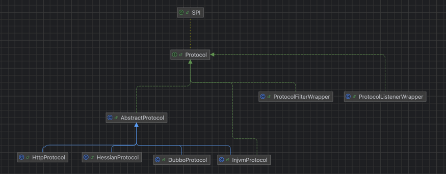

    这是dubbo系列的第4篇文章，主要介绍的是dubbo的protocol。

<style>
.my-code {
   color: orange;
}
.orange {
   color: rgb(255, 53, 2)
}
.red {
   color: red
}
code {
   color: #0ABF5B;
}
</style>

# 一、dubbo
Dubbo 是一款微服务开发框架，它提供了 RPC通信 与 微服务治理 两大关键能力。这意味着，使用 Dubbo 开发的微服务，将具备相互之间的远程发现与通信能力， 同时利用 Dubbo 提供的丰富服务治理能力，可以实现诸如服务发现、负载均衡、流量调度等服务治理诉求。同时 Dubbo 是高度可扩展的，用户几乎可以在任意功能点去定制自己的实现，以改变框架的默认行为来满足自己的业务需求。

<!--more-->

Dubbo主要提供了`3大核心功能`：面向接口的远程方法调用，智能容错和负载均衡，以及服务自动注册和发现。
1. **远程方法调用**
网络通信框架，提供对多种NIO框架抽象封装，包括“同步转异步”和“请求-响应”模式的信息交换方式。

2. **智能容错和负载均衡**
提供基于接口方法的透明远程过程调用，包括多协议支持，以及软负载均衡，失败容错，地址路由，动态配置等集群支持。

3. **服务注册和发现**
服务注册，基于注册中心目录服务，使服务消费方能动态的查找服务提供方，使地址透明，使服务提供方可以平滑增加或减少机器。

在Consumer启动过程中，我们大概了解了Invoker，但是具体的结构没有深入讲解。

# 二、Protocol
`Protocol`组件负责管理不同通信协议的实现，支持服务暴露（`export`）和引用（`refer`）。

## 2.1、定义
`Protocol`是`Dubbo`的扩展接口，定义了服务暴露和引用的核心方法：
```java
@SPI("dubbo")
public interface Protocol {
  @Adaptive
  <T> Exporter<T> export(Invoker<T> invoker) throws RpcException;
  @Adaptive
  <T> Invoker<T> refer(Class<T> type, URL url) throws RpcException;
}
```


## 2.2、Protocol的SPI扩展实现
dubbo中有很多`Protocol`的实现类，这些实现类是如何被加载和管理的呢？
> dubbo使用的是`SPI（service provider interface）`机制，通过扩展点加载不同的实现。具体来说，dubbo的SPI机制在`META-INF/dubbo`目录下配置接口和实现类的映射关系，然后通过`ExtensionLoader`来加载这些实现。

### 2.2.1、SPI配置文件
> 在`META-INF/dubbo/org.apache.dubbo.rpc.Protocal`中配置协议实现：
```text
dubbo=org.apache.dubbo.rpc.protocol.dubbo.DubboProtocol
http=org.apache.dubbo.rpc.protocol.http.HttpProtocol
tri=org.apache.dubbo.rpc.protocol.tri.TripleProtocol
```

### 2.2.2、Protocol相关实现

- `DubboProtocal`：默认的二进制RPC协议，基于Netty实现高性能通信。
- `HttpProtocol`：支持HTTP/1.1的`RESTful`协议。
- `TripleProtocol`：兼容gRpc的`HTTP/2`协议。


## 2.3、Protocol的包装类机制
Dubbo通过**装饰器模式**，为`Protocol`添加扩展功能（如过滤器、监听器），形成多层包装类。

### 2.3.1、常见包装类

| 包装类                     | 功能                |
|-------------------------|-------------------|
| `ProtocolFilterWrapper`   | 添加过滤器链（如日志、限流等）   |
| `ProtocolListenerWrapper` | 触发服务暴露/引用的事件通知    |
| `QosProtocolWrapper`      | 提供Qos服务治理功能       |

示例如下：
```java
public class ProtocolFilterWrapper implements Protocol {
    private final Protocol protocol;
    public ProtocolFilterWrapper(Protocol protocol) {
        this.protocol = protocol;
    }
    // 实现方法时添加过滤器逻辑
    @Override
    public <T> Invoker<T> refer(Class<T> type, URL url) {
        return buildInvokerChain(protocol.refer(type, url));
    }
}
```

### 2.3.2、包装顺序
通过`@Activate`注解的`order`属性或`SPI`配置文件顺序决定包装层次。
```java
@Activate(order = 100)
public class ProtocolFilterWrapper implements Protocol { ... }

@Activate(order = 200)
public class ProtocolListenerWrapper implements Protocol { ... }
```
最终形成的调用链：
```test
ProtocolFilterWrapper → ProtocolListenerWrapper → DubboProtocol
```


## 2.4、Protocol的创建与包装
```java
public class ReferenceConfig<T> extends AbstractReferenceConfig {
    private static final Protocol refprotocol = ExtensionLoader
            .getExtensionLoader(Protocol.class) //步骤一：获取ExtensionLoader实例
            .getAdaptiveExtension(); //步骤二：获取自适应扩展实例（重要逻辑，包含原始Protocol对象的创建、包装类处理等逻辑）
}
```
主要有2个步骤：
**步骤一：获取ExtensionLoader实例**
通过`ExtensionLoader`的静态方法获取`Protocol`接口的扩展加载器。关键点如下：
- **缓存机制**：如果`Protocol`的`ExtensionLoader`实例已经存在（缓存于`EXTENSION_LOADERS`），则直接返回；否则创建新实例。
- **SPI校验**：确保`Protocol`接口带有`@SPI`注解（如默认协议`dubbo`）。
```java
public static <T> ExtensionLoader<T> getExtensionLoader(Class<T> type) {
    if (type == null)
        throw new IllegalArgumentException("Extension type == null");
    if (!type.isInterface()) {
        throw new IllegalArgumentException("Extension type(" + type + ") is not interface!");
    }
    //判断是否有@SPI注解
    if (!withExtensionAnnotation(type)) {
        throw new IllegalArgumentException("Extension type(" + type +
                ") is not extension, because WITHOUT @" + SPI.class.getSimpleName() + " Annotation!");
    }
    ExtensionLoader<T> loader = (ExtensionLoader<T>) EXTENSION_LOADERS.get(type);
    if (loader == null) {
        EXTENSION_LOADERS.putIfAbsent(type, new ExtensionLoader<T>(type));
        loader = (ExtensionLoader<T>) EXTENSION_LOADERS.get(type);
    }
    return loader;
}
```

**步骤二：获取自适应扩展实例**
- `getExtensionClasses`：加载指定目录下的Protocol实现类
- `getAdaptiveExtensionClass`：获取自适应扩展实例。
```java
public T getAdaptiveExtension() {
  Object instance = cachedAdaptiveInstance.get();
  if (instance == null) {
    if (createAdaptiveInstanceError == null) {
      synchronized (cachedAdaptiveInstance) {
        instance = cachedAdaptiveInstance.get();
        if (instance == null) {
          try {
            instance = createAdaptiveExtension();
            cachedAdaptiveInstance.set(instance);
          } catch (Throwable t) {
            createAdaptiveInstanceError = t;
            throw new IllegalStateException("fail to create adaptive instance: " + t.toString(), t);
          }
        }
      }
    } else {
      throw new IllegalStateException("fail to create adaptive instance: " + createAdaptiveInstanceError.toString(), createAdaptiveInstanceError);
    }
  }
  return (T) instance;
}
//获取自适应的实现
private T createAdaptiveExtension() {
  try {
    return injectExtension((T) getAdaptiveExtensionClass().newInstance());
  } catch (Exception e) {
    throw new IllegalStateException("Can not create adaptive extension " + type + ", cause: " + e.getMessage(), e);
  }
}

private Class<?> getAdaptiveExtensionClass() {
    //获取Protocol的实现类
    getExtensionClasses();
    if (cachedAdaptiveClass != null) {
      return cachedAdaptiveClass;
    }
    return cachedAdaptiveClass = createAdaptiveExtensionClass();
}

private Class<?> createAdaptiveExtensionClass() {
  String code = createAdaptiveExtensionClassCode();
  ClassLoader classLoader = findClassLoader();
  com.alibaba.dubbo.common.compiler.Compiler compiler = ExtensionLoader.getExtensionLoader(com.alibaba.dubbo.common.compiler.Compiler.class).getAdaptiveExtension();
  return compiler.compile(code, classLoader);
}
```


### 2.4.1、获取Protocol扩展实现类的类名
`getExtensionClasses();`方法。
- 会去`META-INF/dubbo/、META-INF/dubbo/internal/、META-INF/services/`三个目录下加载实现`Protocol`扩展接口的实现类：
- 返回`Map<String, Class<?>>`：类名，未实例化。
```java
private Map<String, Class<?>> loadExtensionClasses() {
    final SPI defaultAnnotation = type.getAnnotation(SPI.class);
    Map<String, Class<?>> extensionClasses = new HashMap<String, Class<?>>();
    loadDirectory(extensionClasses, DUBBO_INTERNAL_DIRECTORY);
    loadDirectory(extensionClasses, DUBBO_DIRECTORY);
    loadDirectory(extensionClasses, SERVICES_DIRECTORY);
    return extensionClasses;
}
```
继续追踪`loadDirectory()`方法，其内部有关于封装类的相关判断。
```java
private void loadClass(Map<String, Class<?>> extensionClasses, java.net.URL resourceURL, Class<?> clazz, String name) throws NoSuchMethodException {
  if (clazz.isAnnotationPresent(Adaptive.class)) {
    if (cachedAdaptiveClass == null) {
      cachedAdaptiveClass = clazz;
    } else if (!cachedAdaptiveClass.equals(clazz)) {
      throw new IllegalStateException("More than 1 adaptive class found: "
              + cachedAdaptiveClass.getClass().getName()
              + ", " + clazz.getClass().getName());
    }
  } else if (isWrapperClass(clazz)) {
    Set<Class<?>> wrappers = cachedWrapperClasses;
    if (wrappers == null) {
      cachedWrapperClasses = new ConcurrentHashSet<Class<?>>();
      wrappers = cachedWrapperClasses;
    }
    wrappers.add(clazz);
  }
}
```
- `isWrapperClass(clazz)`：是封装类（构造函数入参是`Protocol`），加入到`cachedWrapperClasses`缓存中，后续使用（获取普通扩展实例时）


### 2.4.2、获取自适应扩展实例
```java
private Class<?> createAdaptiveExtensionClass() {
    //生成自适应类的源代码
    String code = createAdaptiveExtensionClassCode();
    //获取类加载器
    ClassLoader classLoader = findClassLoader();
    //获取编译器实例，比如JavassistCompiler
    com.alibaba.dubbo.common.compiler.Compiler compiler = ExtensionLoader.getExtensionLoader(com.alibaba.dubbo.common.compiler.Compiler.class).getAdaptiveExtension();
    //最后，调研编译器的compile方法将生成的源代码编译成字节码
    return compiler.compile(code, classLoader);
}
```
关键步骤：
- 检测接口方法的`@Adaptive`注解
  - 遍历接口的所有方法，检查是否包含`@Adaptive`注解
    - `@Adaptive`注解的范围：必须标准在接口方法上，告诉Dubbo，该接口方法需要动态选择具体的实现类。
  - 如果没有方法带有`@Adaptive`注解，抛出`IllegalStateException`
- 生成代码结构

生成的自适应扩展的`Adaptive`类结构如下：
```java
public class Protocol$Adaptive implements Protocol {
    @Override
    public <T> Invoker<T> refer(Class<T> serviceType, URL url) {
      if (url == null) {
        throw new IllegalArgumentException("url == null");
      }
      // 1. 从 URL 中获取协议名称（如 "dubbo" 或 "rmi"）
      String protocolName = url.getProtocol(); // 根据 @Adaptive("protocol") 获取参数
      if (protocolName == null) {
        throw new IllegalStateException("Failed to get extension name from URL");
      }
      // 2. 通过 SPI 加载具体的 Protocol 实现类
      Protocol protocol = ExtensionLoader.getExtensionLoader(Protocol.class).getExtension(protocolName);
      // 3. 调用具体实现的 refer() 方法
      return protocol.refer(serviceType, url);
    }
  
    // 其他未标注 @Adaptive 的方法会抛出异常
    @Override
    public void destroy() {
      throw new UnsupportedOperationException("Not adaptive method!");
    }
}
```


### 2.4.3、创建普通Protocol扩展类和创建wrapper封装类
在自适应扩展实例执行`refer`方法时，触发**普通Protocol扩展类**的创建和`wrapper`封装类的创建。
```java
public class Protocol$Adaptive implements Protocol {
  @Override
  public <T> Invoker<T> refer(Class<T> serviceType, URL url) {
    if (url == null) {
      throw new IllegalArgumentException("url == null");
    }
    // 1. 从 URL 中获取协议名称（如 "dubbo" 或 "rmi"）
    String protocolName = url.getProtocol(); // 根据 @Adaptive("protocol") 获取参数
    if (protocolName == null) {
      throw new IllegalStateException("Failed to get extension name from URL");
    }
    // 2. 通过 SPI 加载具体的 Protocol 实现类
    Protocol protocol = ExtensionLoader.getExtensionLoader(Protocol.class).getExtension(protocolName);
    // 3. 调用具体实现的 refer() 方法
    return protocol.refer(serviceType, url);
  }
}
```
追踪`getExtension()`方法
```java
public T getExtension(String name) {
    if (name == null || name.length() == 0)
        throw new IllegalArgumentException("Extension name == null");
    if ("true".equals(name)) {
        return getDefaultExtension();
    }
    //....
    Object instance = holder.get();
    if (instance == null) {
        synchronized (holder) {
            instance = holder.get();
            if (instance == null) {
                instance = createExtension(name);
                holder.set(instance);
            }
        }
    }
    return (T) instance;
}
```
`createExtension(name);`重点逻辑如下：
1. `clazz.newInstance()`：创建普通的`Protocol`扩展类，
2. `wrapperClass.getConstructor(type).newInstance(instance)`：将当前扩展实例传入`wrapper`封装类
```java
private T createExtension(String name) {
    Class<?> clazz = getExtensionClasses().get(name);
    if (clazz == null) {
        throw findException(name);
    }
    try {
        T instance = (T) EXTENSION_INSTANCES.get(clazz);
        //1. clazz.newInstance()：创建普通的Protocol扩展类，
        if (instance == null) {
            EXTENSION_INSTANCES.putIfAbsent(clazz, clazz.newInstance());
            instance = (T) EXTENSION_INSTANCES.get(clazz);
        }
        injectExtension(instance);
        //2. 将当前扩展实例传入wrapper封装类
        Set<Class<?>> wrapperClasses = cachedWrapperClasses;
        if (wrapperClasses != null && !wrapperClasses.isEmpty()) {
            for (Class<?> wrapperClass : wrapperClasses) {
                instance = injectExtension((T) wrapperClass.getConstructor(type).newInstance(instance));
            }
        }
        return instance;
    } catch (Throwable t) {
    }
}
```

封装链如下：
```text
Protocol$Adaptive.refer() → RegistryProtocol.refer() -> ProtocolFilterWrapper.refer() → ProtocolListenerWrapper.refer() → DubboProtocol.refer()
```
> RegistryProtocol是顶层的

## 2.5、Protocol小结

| 类名                    | 说明              |
|-----------------------|-----------------|
| DubboProtocol         | 普通的Protocol扩展类  |
| ProtocolFilterWrapper | Protocol的封装类    |
| Protocol&Adaptive     | 自适应Protocol扩展类  |


参考文章：
[消费者启动流程](https://blog.csdn.net/qq_36882793/article/details/115726433)