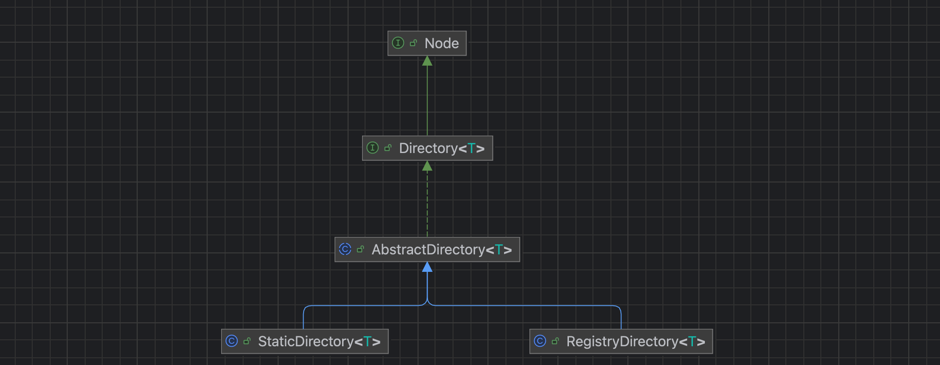
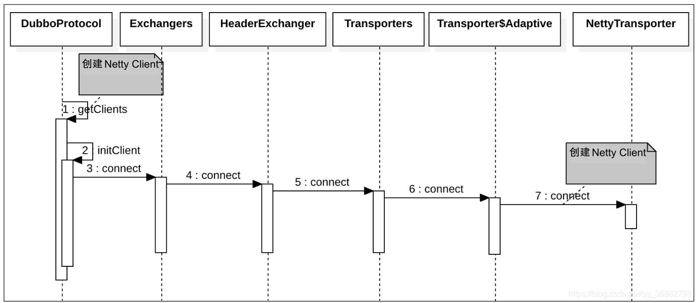

    这是dubbo系列的第5篇文章，主要介绍的是dubbo的Invoker。

<style>
.my-code {
   color: orange;
}
.orange {
   color: rgb(255, 53, 2)
}
.red {
   color: red
}
code {
   color: #0ABF5B;
}
</style>

# 一、dubbo
Dubbo 是一款微服务开发框架，它提供了 RPC通信 与 微服务治理 两大关键能力。这意味着，使用 Dubbo 开发的微服务，将具备相互之间的远程发现与通信能力， 同时利用 Dubbo 提供的丰富服务治理能力，可以实现诸如服务发现、负载均衡、流量调度等服务治理诉求。同时 Dubbo 是高度可扩展的，用户几乎可以在任意功能点去定制自己的实现，以改变框架的默认行为来满足自己的业务需求。

<!--more-->

Dubbo主要提供了`3大核心功能`：面向接口的远程方法调用，智能容错和负载均衡，以及服务自动注册和发现。
1. **远程方法调用**
网络通信框架，提供对多种NIO框架抽象封装，包括“同步转异步”和“请求-响应”模式的信息交换方式。

2. **智能容错和负载均衡**
提供基于接口方法的透明远程过程调用，包括多协议支持，以及软负载均衡，失败容错，地址路由，动态配置等集群支持。

3. **服务注册和发现**
服务注册，基于注册中心目录服务，使服务消费方能动态的查找服务提供方，使地址透明，使服务提供方可以平滑增加或减少机器。

在Consumer启动过程中，我们大概了解了Invoker，但是具体的结构没有深入讲解。

# 二、Invoker
Dubbo内部定义的类，封装调用逻辑，动态代理对象调用方法时最终委托给`Invoker`执行。
```java
public interface Invoker<T> extends Node {
    Class<T> getInterface();
    Result invoke(Invocation invocation) throws RpcException;
}
```

## 2.1、Invoker相关实现
`dubbo`中常用的`Invoker`类，如下：

- `AbstractProxyInvoker` 本地执行类的`Invoker`，实际通过Java反射的方式执行原始对象的方法。为`proxyFactory.getInvoker`生成的被`wrapper`包装过的`Invoker`-------`InvokerWrapper`。
- `AbstractInvoker`: 远程通信类的`Invoker`，实际通过通信协议发起远程调用请求，并接收响应。
- `AbstraceClusterInvoker` 多个远程通信类的`Invoker`聚合成的集群`Invoker`，加入了集群容错和负载均衡策略。`cluster`集群下的`Invoker`实现，采用模板方法设计模式，`abstract`定义方法框架，具体方法实现由子类实现。


## 2.2、Invoker和URL
通过`protocol.refer`创建`invoker`时，需要将`URL`传入。
```java
invoker = refprotocol.refer(interfaceClass, urls.get(0));
```

### 2.2.1、URL
**URL的作用**：统一资源定位符，在Dubbo中传递配置信息，格式如下：
```text
protocol://host:port/path?key1=value1&key2=value2
```

**URL参数传递示例**
```xml
<!--消费者配置-->
<dubbo:reference interface="com.example.UserService" timeout="5000" loadbalance="leastactive"/>
```


**关键参数**

| 参数          | 说明                 | 示例值               |
|---------------|----------------------|----------------------|
| `protocol`    | 协议类型             | `dubbo`, `http`      |
| `host:port`   | 服务提供者地址       | `192.168.1.100:20880`|
| `path`        | 服务接口全限定名     | `com.example.UserService` |
| `version`     | 服务版本             | `1.0.0`              |
| `timeout`     | 调用超时时间（ms）   | `3000`               |
| `loadbalance` | 负载均衡策略         | `random`, `roundrobin` |

### 2.2.2、Invoker与URL的关系

#### 2.2.2.1、创建Invoker时依赖URL
- **配置来源**：URL包含协议、地址、接口、参数等信息，决定如何创建Invoker。
- **示例代码**：
  ```java
  // 创建Dubbo协议的Invoker
  URL url = new URL("dubbo", "192.168.1.100", 20880, "com.example.UserService", params);
  Invoker<UserService> invoker = protocol.refer(UserService.class, url);
  ```

#### 2.2.2.2、Invoker行为由URL参数控制
- **超时时间**：`timeout=3000`。
- **重试策略**：`retries=2`。
- **负载均衡**：`loadbalance=random`。

**运行时动态调整**：通过Dubbo动态配置中心修改URL参数，实时生效。

#### 2.2.2.3、不同协议对应不同Invoker实现
| 协议    | Invoker实现类       | 说明                      |
|---------|---------------------|-------------------------|
| Dubbo   | `DubboInvoker`      | 基于Netty的二进制RPC调用，默认协议   |
| HTTP    | `HttpInvoker`       | 基于HTTP/JSON的RESTful调用   |
| gRPC    | `GrpcInvoker`       | 基于gRPC协议的调用             |


## 2.3、Invoker的创建
在创建代理对象的过程中去创建`Invoker`，简化后的执行逻辑如下：
```java
public class ReferenceConfig<T> extends AbstractReferenceConfig {
    private T createProxy(Map<String, String> map) {
        if (isJvmRefer) {
            //本地调用
            invoker = refprotocol.refer(interfaceClass, url);
        } else {
            //远程调用
            if (url != null && url.length() > 0) {
                //消费者通过配置直接指定了提供者的地址。
                urls.add(ClusterUtils.mergeUrl(url, map));
            } else {
                //消费者通过注册中心获取提供者的地址。
                List<URL> us = loadRegistries(false);
                if (us != null && !us.isEmpty()) {
                    for (URL u : us) {
                      URL monitorUrl = loadMonitor(u);
                      urls.add(u.addParameterAndEncoded(Constants.REFER_KEY, StringUtils.toQueryString(map)));
                    }
                }
            }
            if (urls.size() == 1) {
                //单URL场景的远程调用
                invoker = refprotocol.refer(interfaceClass, urls.get(0));
            } else {
                //多URL场景的远程调用
                List<Invoker<?>> invokers = new ArrayList<Invoker<?>>();
                URL registryURL = null;
                for (URL url : urls) {
                  invokers.add(refprotocol.refer(interfaceClass, url));
                }
                // 创建 StaticDirectory 实例，并由 Cluster 对多个 Invoker 进行合并
                invoker = cluster.join(new StaticDirectory(invokers));
            }
        }
    }
}
```
从代码中，我们可以分成以下流程
- 本地调用
- 远程调用
  - 第一步：获取URL，添加到`urls`集合
    - 消费者通过**配置**直接指定了提供者的地址
    - 消费者通过**注册中心**获取提供者的地址。
  - 第二步：根据URL构建`Invoker`
    - URL只有一个，直接创建：这里的单URL 场景指的是 单一注册中心或 单一直连URL(服务提供者)时 远程调用服务`Invoker` 的创建，会直接调用 `refprotocol.refer`
    - URL多个，通过 `Cluster` 对多个 `Invoker` 进行合并

从代码中可以看到，invoker都是通过`refprotocol.refer()`方法创建的。


# 三、本地调用`InjvmInvoker`
通过`InjvmProtocol#refer`创建，直接包装了一个`InjvmInvoker` 返回
```java
@Override
public <T> Invoker<T> refer(Class<T> serviceType, URL url) throws RpcException {
    return new InjvmInvoker<T>(serviceType, url, url.getServiceKey(), exporterMap);
}
```
当消费者进行服务调用时，会调用 `InjvmInvoker#doInvoke` 方法，其实现如下，我们可以看到，`InjvmInvoker#doInvoke` 通过 `exporterMap` 获取到 调用的本地服务 `Exporter` 再调用
```java
@Override
public Result doInvoke(Invocation invocation) throws Throwable {
    Exporter<?> exporter = InjvmProtocol.getExporter(exporterMap, getUrl());
    if (exporter == null) {
        throw new RpcException("Service [" + key + "] not found.");
    }
    RpcContext.getContext().setRemoteAddress(NetUtils.LOCALHOST, 0);
    return exporter.getInvoker().invoke(invocation);
}
```


# 四、远程调用
远程调用，创建Invoker会比较复杂，主要分成2步：
- 第一步：获取URL，添加到`urls`集合
  - 消费者通过**配置**直接指定了提供者的地址
  - 消费者通过**注册中心**获取提供者的地址。
- 第二步：根据URL构建`Invoker`
  - URL只有一个，直接创建：这里的单URL 场景指的是 单一注册中心或 单一直连URL(服务提供者)时 远程调用服务`Invoker` 的创建，会直接调用 `refprotocol.refer`
  - URL多个，通过 `Cluster` 对多个 `Invoker` 进行合并


## 4.1、配置示例

**单URL配置（单注册中心）**
- 场景：应用仅连接一个注册中心的单节点。
```xml
<!-- XML 配置 -->
<dubbo:registry address="zookeeper://127.0.0.1:2181" />
```

**多URL配置（同一注册中心集群）**
- 场景：注册中心多个节点
```xml
<dubbo:registry address="zookeeper://127.0.0.1:2181,127.0.0.2:2181,127.0.0.3:2181" />
<!-- 或使用 backup 参数 -->
<dubbo:registry address="zookeeper://127.0.0.1:2181?backup=127.0.0.2:2181,127.0.0.3:2181" />
```

**多注册中心配置**
- 场景：应用同时连接多个不同的注册中心。
```xml
<dubbo:registry id="nacosRegistry" address="nacos://127.0.0.1:8848" />
<dubbo:registry id="zookeeperRegistry" address="zookeeper://127.0.0.1:2181" default="false" />

<!-- 指定服务使用哪个注册中心 -->
<dubbo:service interface="com.example.UserService" registry="nacosRegistry" />
<dubbo:reference id="orderService" interface="com.example.OrderService" registry="zookeeperRegistry" />
```
**多注册中心的作用：**
- 高可用
- 负载均衡
- 跨区域部署

## 4.2、从注册中心获取URL
`loadRegistries`负责**加载并解析注册中心配置**，为后续服务注册或订阅提供基础信息。
```java
private T createProxy(Map<String, String> map) {
  if (isJvmRefer) {
      //省略部分代码
  } else {
      List<URL> us = loadRegistries(false);
  }
}
protected List<URL> loadRegistries(boolean provider) {
    
}
```
执行步骤如下：
- **解析配置**
从XML、注解或API配置中读取注册中心信息，例如：
```xml
<dubbo:registry address="zookeeper://localhost:2181" />
<dubbo:registry address="nacos://localhost:8848" />
```

- **转换为URL对象**
将配置字符串解析为URL对象，例如
```text
URL registryUrl = URL.valueOf("zookeeper://localhost:2181/org.apache.dubbo.registry.RegistryService");
```


## 4.3、执行protocol.refer
```text
refprotocol.refer =》 XxxProtocolWrapper#refer  => RegistryProtocol#refer =》  XxxProtocolWrapper#refer  => DubboProtocol#refer
```
**关键的两个方法**为 `RegistryProtocol#refer` 和 `DubboProtocol#refer`，而在`RegistryProtocol#refer` 过程中又调用了 `DubboProtocol#refer` 方法。
- `RegistryProtocol#refer` 主要处理和注册中心相关的内容
- `DubboProtocol#refer` 而是创建与提供者的连接。

我们先来介绍一下 `Directory`

### 4.3.1、Directory 的概念
`Directory` 即服务目录， 服务目录中存储了一些和服务提供者有关的信息，通过服务目录，服务消费者可获取到服务提供者的信息，比如 ip、端口、服务协议等。通过这些信息，服务消费者就可通过 `Netty` 等客户端进行远程调用。

服务目录目前内置的实现有两个，分别为 `StaticDirectory` 和 `RegistryDirectory`，它们均是 `AbstractDirectory` 的子类。`AbstractDirectory` 实现了 `Directory` 接口，这个接口包含了一个重要的方法定义，即 `list(Invocation)`，用于列举 `Invoker`。下面我们来看一下他们的继承体系图。


#### 4.3.1.1、AbstractDirectory
`AbstractDirectory` 封装了 `Invoker` 列举流程，具体的列举逻辑则由子类实现，这是典型的模板模式。`AbstractDirectory` 的整个实现很简单
```java
public abstract class AbstractDirectory<T> implements Directory<T> {
	// 当前 注册中心URL 或者 直连URL
    private final URL url;
	// 消费者URL
    private volatile URL consumerUrl;
    protected RouterChain<T> routerChain;
    public AbstractDirectory(URL url, URL consumerUrl, RouterChain<T> routerChain) {
        if (url == null) {
            throw new IllegalArgumentException("url == null");
        }
		// 如果是注册中心的协议，则进行进一步解析
        if (url.getProtocol().equals(Constants.REGISTRY_PROTOCOL)) {
            Map<String, String> queryMap = StringUtils.parseQueryString(url.getParameterAndDecoded(Constants.REFER_KEY));
            this.url = url.addParameters(queryMap).removeParameter(Constants.MONITOR_KEY);
        } else {
            this.url = url;
        }

        this.consumerUrl = consumerUrl;
        setRouterChain(routerChain);
    }
    
	// 根据调用信息获取到服务提供者列表
    @Override
    public List<Invoker<T>> list(Invocation invocation) throws RpcException {
        if (destroyed) {
            throw new RpcException("Directory already destroyed .url: " + getUrl());
        }
		// 这里直接交由子类实现，也就是 StaticDirectory 和 RegistryDirectory 的实现
        return doList(invocation);
    }

    @Override
    public URL getUrl() {
        return url;
    }
    protected abstract List<Invoker<T>> doList(Invocation invocation) throws RpcException;

}

```
#### 4.3.1.2、StaticDirectory
`StaticDirectory` 即静态服务目录，顾名思义，它内部存放的 `Invoker` 是不会变动的。所以，理论上它和不可变 `List` 的功能很相似

`StaticDirectory` 的应用场景主要有两种 ： 
- 多注册中心
- 多分组情况

#### 4.3.1.3、RegistryDirectory
`RegistryDirectory` 是一种动态服务目录，实现了 `NotifyListener` 接口。当注册中心服务配置发生变化后，`RegistryDirectory` 可收到与当前服务相关的变化。收到变更通知后，`RegistryDirectory` 可根据配置变更信息刷新 `Invoker` 列表。


在介绍完`Directory` 的概念后，我们这里开始对 `RegistryDirectory` 进行分析。一般情况下我们使用单注册中心，所以只会涉及到 `RegistryDirectory` 的内容。

### 4.3.2、`RegistryProtocol#refer`
`RegistryProtocol#refer` 是在存在注册中心的情况下才会调用，我们这里假设只有一个zk注册中心，服务协议为 `dubbo`。实现如下 ：
```java
public <T> Invoker<T> refer(Class<T> type, URL url) throws RpcException {
    //取 registry 参数值，并将其设置为协议头
    url = url.setProtocol(url.getParameter(REGISTRY_KEY, DEFAULT_REGISTRY)).removeParameter(REGISTRY_KEY);
    Registry registry = registryFactory.getRegistry(url);
    if (RegistryService.class.equals(type)) {
        return proxyFactory.getInvoker((T) registry, type, url);
    }
    // group="a,b" or group="*"
    // 将 url 查询字符串转为 Map
    Map<String, String> qs = StringUtils.parseQueryString(url.getParameterAndDecoded(REFER_KEY));
    // 获取 group 配置
    String group = qs.get(Constants.GROUP_KEY);
    if (group != null && group.length() > 0) {
        if ((COMMA_SPLIT_PATTERN.split(group)).length > 1 || "*".equals(group)) {
            // 1. 如果是多分组的情况下，通过 SPI 加载 MergeableCluster 实例，并调用 doRefer 继续执行服务引用逻辑。
            return doRefer(getMergeableCluster(), registry, type, url);
        }
    }
    // 2. 调用 doRefer 继续执行服务引用逻辑
    return doRefer(cluster, registry, type, url);
}
```
上面的逻辑可以总结为：
1. 获取注册中心协议类型，并获取注册中心实例。
2. 获取`group` 配置，根据 `group` 决定 `doRefer` 方法的 `Cluster` 参数。多分组情况下是 `MergeableCluster`，默认情况下是 `FailoverCluster`。
3. `doRefer` 方法创建一个 `RegistryDirectory` 实例，交由`RegistryDirectory` 建立路由链路、订阅节点、容错机制的包装，最终获取到服务节点的一个`Invoker`。

```java
private <T> Invoker<T> doRefer(Cluster cluster, Registry registry, Class<T> type, URL url) {
    // 创建 RegistryDirectory 实例
    RegistryDirectory<T> directory = new RegistryDirectory<T>(type, url);
    // 设置注册中心和协议
    directory.setRegistry(registry);
    directory.setProtocol(protocol);
    // all attributes of REFER_KEY
    Map<String, String> parameters = new HashMap<String, String>(directory.getUrl().getParameters());
     // 生成服务消费者订阅的 URL，供后面使用
    URL subscribeUrl = new URL(CONSUMER_PROTOCOL, parameters.remove(REGISTER_IP_KEY), 0, type.getName(), parameters);
    // 如果引用的接口不是 * && 消费者可以注册(register 属性为 true ) 则会注册服务消费者，在 consumers 目录下新节点
    if (!ANY_VALUE.equals(url.getServiceInterface()) && url.getParameter(REGISTER_KEY, true)) {
        registry.register(getRegisteredConsumerUrl(subscribeUrl, url));
    }
    //  1. 建立路由规则链,即 解析并设置了routerChain属性
    directory.buildRouterChain(subscribeUrl);
     // 2. 订阅 providers、configurators、routers 等节点数据
    directory.subscribe(subscribeUrl.addParameter(CATEGORY_KEY,
            PROVIDERS_CATEGORY + "," + CONFIGURATORS_CATEGORY + "," + ROUTERS_CATEGORY));
     // 3. 包装机器容错机制到invoker 
     // 一个注册中心可能有多个服务提供者，因此这里需要将多个服务提供者合并为一
    Invoker invoker = cluster.join(directory);
    ProviderConsumerRegTable.registerConsumer(invoker, url, subscribeUrl, directory);
    return invoker;
}
```
这里我们把 `RegistryProtocol#doRefer` 的代码我们划分为三个部分： 
- **构建路由链** ： `RegistryDirectory`通过 `RegistryDirectory#buildRouterChain` 构建了路由链。
- **服务订阅** ： `RegistryDirectory`订阅了`providers、configurators、routers`，以监听子节点的变化，并刷新自己服务信息。
```java
directory.subscribe(subscribeUrl.addParameter(CATEGORY_KEY,
PROVIDERS_CATEGORY + "," + CONFIGURATORS_CATEGORY + "," + ROUTERS_CATEGORY));
```
- **添加容错策略**：这里会将筛选出来的 `Invoker`包过一层 容错机制。
```java
Invoker invoker = cluster.join(directory);
```


#### 4.3.2.1、容错机制 Cluster
每个集群容错策略都会包装出一个对应的 `Invoker`，如 `MergeableCluster` 会返回`MergeableClusterInvoker` ，`FailoverCluster` 会返回 `FailoverClusterInvoker` 。

#### 4.3.2.2、directory.buildRouterChain(subscribeUrl);

路由
> 对于路由,官方描述如下：服务目录在刷新 `Invoker` 列表的过程中，会通过 `Router` 进行服务路由，筛选出符合路由规则的服务提供者。
> 
> 在详细分析服务路由的源码之前，先来介绍一下服务路由是什么？
> 
> **服务路由**包含一条路由规则，路由规则决定了服务消费者的调用目标，即规定了服务消费者可调用哪些服务提供者。Dubbo 目前提供了三种服务路由实现，分别为**条件路由 ConditionRouter**、**脚本路由 ScriptRouter** 和**标签路由 TagRouter**。】

`RegistryDirectory#buildRouterChain` 在这里构建了路由链路，实现如下：
```java
// RegistryDirectory#buildRouterChain 
public void buildRouterChain(URL url) {
    // 创建一个 RouterChain 并赋值给 RegistryDirectory#routerChain
    this.setRouterChain(RouterChain.buildChain(url));
}
```

#### 4.3.2.3、RegistryDirectory#subscribe
`RegistryDirectory#subscribe` 订阅并监听zk上的服务节点，通过节点回调完成了服务列表的动态更新功能。
```java
public void subscribe(URL url) {
    // 记录消费者 URL，记录当前 RegistryDirectory 代表哪个 URL
    setConsumerUrl(url);
    // 添加到监听器集合
    consumerConfigurationListener.addNotifyListener(this);
    serviceConfigurationListener = new ReferenceConfigurationListener(this, url);
    // 这里调用的是 ZookeeperRegistry#subscribe，会调用 FailbackRegistry#subscribe
    // url 为订阅的节点信息，this 即订阅结束后的回调监听器实例
    registry.subscribe(url, this);
}
```


### 4.3.2、`DubboProtocol#refer`
DubboProtocol#refer 根据URL 创建了 Invoker，在这里会建立与服务提供者的网络连接。其具体实现如下：
```java
@Override
public <T> Invoker<T> refer(Class<T> serviceType, URL url) throws RpcException {
    // 序列化优化
    optimizeSerialization(url);
    // create rpc invoker.
    // 创建与服务提供者的 Netty 连接。
    DubboInvoker<T> invoker = new DubboInvoker<T>(serviceType, url, getClients(url), invokers);
    invokers.add(invoker);
    return invoker;
}

...
// 获取连接客户端。
private ExchangeClient[] getClients(URL url) {
    // whether to share connection
    // 是否共享连接
    boolean service_share_connect = false;
    // 获取连接数，默认为0，表示未配置
    int connections = url.getParameter(Constants.CONNECTIONS_KEY, 0);
    // if not configured, connection is shared, otherwise, one connection for one service
     // 如果未配置 connections，则共享连接
    if (connections == 0) {
        service_share_connect = true;
        connections = 1;
    }

    ExchangeClient[] clients = new ExchangeClient[connections];
    for (int i = 0; i < clients.length; i++) {
        if (service_share_connect) {
            // 获取共享客户端 ： getSharedClient 中会从缓存中获取，如果没有命中，则会调用 initClient 方法创建客户端
            clients[i] = getSharedClient(url);
        } else {
            // 初始化新的客户端
            clients[i] = initClient(url);
        }
    }
    return clients;
}
```
这里需要注意的是在创建连接的过程中, 由于一台机器可以提供多个服务，那么消费者在引用这些服务时会考虑是与这些服务建立一个共享连接，还是与每一个服务单独建立一个连接。这里可以通过 connections 设置数量来决定创建多少客户端连接，默认是共享同一个客户端。
```java
/**
 * Get shared connection
 * 获取共享客户端
 */
private ExchangeClient getSharedClient(URL url) {
    String key = url.getAddress();
    // 获取带有“引用计数”功能的 ExchangeClient
    ReferenceCountExchangeClient client = referenceClientMap.get(key);
    if (client != null) {
        if (!client.isClosed()) {
            // 增加引用计数
            client.incrementAndGetCount();
            return client;
        } else {
            referenceClientMap.remove(key);
        }
    }

    locks.putIfAbsent(key, new Object());
    synchronized (locks.get(key)) {
        if (referenceClientMap.containsKey(key)) {
            return referenceClientMap.get(key);
        }
        // 如果缓存没命中，则创建 ExchangeClient 客户端
        ExchangeClient exchangeClient = initClient(url);
        // 将 ExchangeClient 实例传给 ReferenceCountExchangeClient，这里使用了装饰模式
        client = new ReferenceCountExchangeClient(exchangeClient, ghostClientMap);
        referenceClientMap.put(key, client);
        ghostClientMap.remove(key);
        locks.remove(key);
        return client;
    }
}


/**
 * Create new connection
 * 创建一个新的连接
 */
private ExchangeClient initClient(URL url) {

    // client type setting.
    // 从url获取客户端类型，默认为 netty
    String str = url.getParameter(Constants.CLIENT_KEY, url.getParameter(Constants.SERVER_KEY, Constants.DEFAULT_REMOTING_CLIENT));
    // 添加编解码和心跳包参数到 url 中
    url = url.addParameter(Constants.CODEC_KEY, DubboCodec.NAME);
    // enable heartbeat by default
    url = url.addParameterIfAbsent(Constants.HEARTBEAT_KEY, String.valueOf(Constants.DEFAULT_HEARTBEAT));

    // BIO is not allowed since it has severe performance issue.
     // 检测客户端类型是否存在，不存在则抛出异常
    if (str != null && str.length() > 0 && !ExtensionLoader.getExtensionLoader(Transporter.class).hasExtension(str)) {
        throw new RpcException("Unsupported client type: " + str + "," +
                " supported client type is " + StringUtils.join(ExtensionLoader.getExtensionLoader(Transporter.class).getSupportedExtensions(), " "));
    }

    ExchangeClient client;
    try {
        // connection should be lazy
        // 获取 lazy 配置，并根据配置值决定创建的客户端类型
        if (url.getParameter(Constants.LAZY_CONNECT_KEY, false)) {
            // 创建懒加载 ExchangeClient 实例
            client = new LazyConnectExchangeClient(url, requestHandler);
        } else {
            // 创建普通 ExchangeClient 实例
            client = Exchangers.connect(url, requestHandler);
        }
    } catch (RemotingException e) {
        throw new RpcException("Fail to create remoting client for service(" + url + "): " + e.getMessage(), e);
    }
    return client;
}
```
这里我们可以发现，无论是共享连接还是非共享连接，如果需要创建连接都会调用 `DubboProtocol#initClient` 方法来创建客户端。


`DubboProtocol#refer` 的作用一句话既可以总结， `DubboProtocol#refer` 根据URL 中的信息创建了`Netty` 客户端与服务提供者的`NettyServer`建立了连接。当消费者进行服务调用时，会调用`DubboInvoker#doInvoke` 方法，在 这个方法中会通过`NettyClient`，将调用的方法、方法入参等配置传递给 服务提供者的`NettyServer`，服务提供者根据这些信息调用本地的方法，并将结果写回通道，完成了一次调用。

参考文章：
[消费者启动流程](https://blog.csdn.net/qq_36882793/article/details/115726433)
[消费者启动流程 - RegistryProtocol#refer](https://blog.csdn.net/qq_36882793/article/details/116661370)