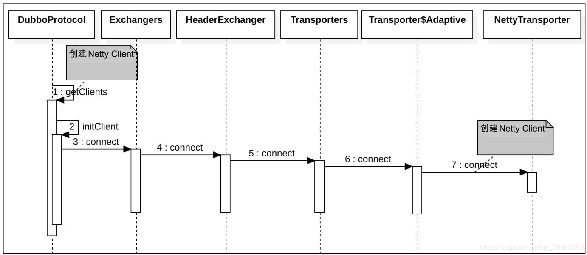

    这是dubbo系列的第5篇文章，主要介绍的是dubbo的Invoker的创建。

<style>
.my-code {
   color: orange;
}
.orange {
   color: rgb(255, 53, 2)
}
.red {
   color: red
}
code {
   color: #0ABF5B;
}
</style>

# 一、invoker创建【本地调用`InjvmInvoker`】
通过`InjvmProtocol#refer`创建，直接包装了一个`InjvmInvoker` 返回。

<!--more-->

```java
@Override
public <T> Invoker<T> refer(Class<T> serviceType, URL url) throws RpcException {
    return new InjvmInvoker<T>(serviceType, url, url.getServiceKey(), exporterMap);
}
```
当消费者进行服务调用时，会调用 `InjvmInvoker#doInvoke` 方法，其实现如下，我们可以看到，`InjvmInvoker#doInvoke` 通过 `exporterMap` 获取到 调用的本地服务 `Exporter` 再调用
```java
@Override
public Result doInvoke(Invocation invocation) throws Throwable {
    Exporter<?> exporter = InjvmProtocol.getExporter(exporterMap, getUrl());
    if (exporter == null) {
        throw new RpcException("Service [" + key + "] not found.");
    }
    RpcContext.getContext().setRemoteAddress(NetUtils.LOCALHOST, 0);
    return exporter.getInvoker().invoke(invocation);
}
```


# 二、invoker创建【远程调用】
远程调用，创建Invoker会比较复杂，主要分成2步：
- 第一步：获取URL，添加到`urls`集合
  - 消费者通过**配置**直接指定了提供者的地址
  - 消费者通过**注册中心**获取提供者的地址。
- 第二步：根据URL构建`Invoker`
  - URL只有一个，直接创建：这里的单URL 场景指的是 单一注册中心或 单一直连URL(服务提供者)时 远程调用服务`Invoker` 的创建，会直接调用 `refprotocol.refer`
  - URL多个，通过 `Cluster` 对多个 `Invoker` 进行合并


## 2.1、配置示例

**单URL配置（单注册中心）**
- 场景：应用仅连接一个注册中心的单节点。
```xml
<!-- XML 配置 -->
<dubbo:registry address="zookeeper://127.0.0.1:2181" />
```

**多URL配置（同一注册中心集群）**
- 场景：注册中心多个节点
```xml
<dubbo:registry address="zookeeper://127.0.0.1:2181,127.0.0.2:2181,127.0.0.3:2181" />
<!-- 或使用 backup 参数 -->
<dubbo:registry address="zookeeper://127.0.0.1:2181?backup=127.0.0.2:2181,127.0.0.3:2181" />
```

**多注册中心配置**
- 场景：应用同时连接多个不同的注册中心。
```xml
<dubbo:registry id="nacosRegistry" address="nacos://127.0.0.1:8848" />
<dubbo:registry id="zookeeperRegistry" address="zookeeper://127.0.0.1:2181" default="false" />

<!-- 指定服务使用哪个注册中心 -->
<dubbo:service interface="com.example.UserService" registry="nacosRegistry" />
<dubbo:reference id="orderService" interface="com.example.OrderService" registry="zookeeperRegistry" />
```
**多注册中心的作用：**
- 高可用
- 负载均衡
- 跨区域部署

## 2.2、源码
```java
private T createProxy(Map<String, String> map) {
  if (isJvmRefer) {
      //省略部分代码
  } else {
      List<URL> us = loadRegistries(false);
      //调用协议refer方法，创建invoker
      invoker = refprotocol.refer(interfaceClass, url);
      //创建代理对象
      return (T) proxyFactory.getProxy(invoker);
  }
}
protected List<URL> loadRegistries(boolean provider) {
    
}
```
invoker的创建可以分成2步：
1. 从注册中心获取URL
2. 根据URL创建服务提供者。

## 2.3、第一步：从注册中心获取URL
`loadRegistries`负责**加载并解析注册中心配置**，为后续服务注册或订阅提供基础信息。

执行步骤如下：
- **解析配置**
从XML、注解或API配置中读取注册中心信息，例如：
```xml
<dubbo:registry address="zookeeper://localhost:2181" />
<dubbo:registry address="nacos://localhost:8848" />
```

- **转换为URL对象**
将配置字符串解析为URL对象，例如
```text
URL registryUrl = URL.valueOf("zookeeper://localhost:2181/org.apache.dubbo.registry.RegistryService");
```


## 2.4、第二步：根据URL创建Invoker【refprotocol.refer】
```text
refprotocol.refer =》 XxxProtocolWrapper#refer  => RegistryProtocol#refer =》  XxxProtocolWrapper#refer  => DubboProtocol#refer
```
**关键的两个方法**为 `RegistryProtocol#refer` 和 `DubboProtocol#refer`，而在`RegistryProtocol#refer` 过程中又调用了 `DubboProtocol#refer` 方法。
- `RegistryProtocol#refer` 主要处理和注册中心相关的内容
- `DubboProtocol#refer` 而是创建与提供者的连接。

### 2.3.1、`RegistryProtocol#refer`
`RegistryProtocol#refer`的主要职责
1. **创建服务目录**（`Directory`）：维护服务提供者列表、动态配置和路由规则。
2. **注册中心订阅**：向注册中心订阅服务提供者、配置和路由的变更信息。
3. **集群容错封装**：通过`Cluster`策略将多个服务提供者`Invoker`聚合成一个逻辑`Invoker`
4. **协议桥接**：将注册中心协议（如`registry://`）转换为具体RPC协议（如`dubbo://`）。

`RegistryProtocol#refer` 是在存在注册中心的情况下才会调用，我们这里假设只有一个zk注册中心，服务协议为 `dubbo`。实现如下 ：
```java
public <T> Invoker<T> refer(Class<T> type, URL url) throws RpcException {
    //取 registry 参数值，并将其设置为协议头
    url = url.setProtocol(url.getParameter(REGISTRY_KEY, DEFAULT_REGISTRY)).removeParameter(REGISTRY_KEY);
    //获取注册中心实例的核心方法
    Registry registry = registryFactory.getRegistry(url);
    if (RegistryService.class.equals(type)) {
        return proxyFactory.getInvoker((T) registry, type, url);
    }
    // group="a,b" or group="*"
    // 将 url 查询字符串转为 Map
    Map<String, String> qs = StringUtils.parseQueryString(url.getParameterAndDecoded(REFER_KEY));
    // 获取 group 配置
    String group = qs.get(Constants.GROUP_KEY);
    if (group != null && group.length() > 0) {
        if ((COMMA_SPLIT_PATTERN.split(group)).length > 1 || "*".equals(group)) {
            // 1. 如果是多分组的情况下，通过 SPI 加载 MergeableCluster 实例，并调用 doRefer 继续执行服务引用逻辑。
            return doRefer(getMergeableCluster(), registry, type, url);
        }
    }
    // 2. 调用 doRefer 继续执行服务引用逻辑
    return doRefer(cluster, registry, type, url);
}
```

#### 2.3.1.1、获取注册中心实例
```java
Registry registry = registryFactory.getRegistry(url);
```

##### `RegistryFactory`
- **作用**：注册中心工厂，提供获取注册中心实例的统一入口。
- **实现类**：
  - `ZookeeperRegistryFactory`：Zookeeper注册中心
  - `RedisRegistryFactory`：Redis注册中心
  - `NacosRegistryFactory`：Nacos注册中心
  - `SimpleRegistryFactory`：Dubbo内置简单注册中心

##### `RegistryFactory` 的SPI加载
Dubbo通过SPI机制动态加载注册中心工厂：
```java
@SPI("dubbo")
public interface RegistryFactory {
    @Adaptive({"protocol"})
    Registry getRegistry(URL url);
}
```
**配置文件如下**：
```properties
// META-INF/dubbo/internal/org.apache.dubbo.registry.RegistryFactory 文件内容示例：
zookeeper=com.alibaba.dubbo.registry.zookeeper.ZookeeperRegistryFactory
redis=com.alibaba.dubbo.registry.redis.RedisRegistryFactory
```

##### 执行流程详解（以Zookeeper为例）

###### 步骤1：调用`registryFactory.getRegistry(url);`
**参数URL的配置示例**：
```properties
protocol=zookeeper
address=127.0.0.1:2181
group=dubbo
```
**关键代码**：
```java
public class ZookeeperRegistryFactory implements RegistryFactory {
    @Override
    public Registry getRegistry(URL url) {
        // 校验 URL 是否合法
        if (url.isAnyHost()) {
            throw new IllegalStateException("registry address == null");
        }
        // 根据 URL 协议选择对应的 Registry 实现
        return new ZookeeperRegistry(url, zookeeperTransporter);
    }
}
```

###### 步骤2：创建`ZookeeperRegistry`实例
构造函数逻辑：
```java
public class ZookeeperRegistry extends RegistrySupport {
    public ZookeeperRegistry(URL url, ZookeeperTransporter zkTransporter) {
        super(url);
        // 处理 group 参数（如拼接根路径）
        String group = url.getParameter(GROUP_KEY, DEFAULT_ROOT);
        if (!group.startsWith(PATH_SEPARATOR)) {
            group = PATH_SEPARATOR + group;
        }
        this.root = group;
        
        // 连接到 ZooKeeper 服务器
        zkClient = zkTransporter.connect(url);
        // 添加连接状态监听器（自动重连）
        zkClient.addStateListener((state) -> {
            if (state == RECONNECTED) {
                recover(); // 连接恢复后重试注册/订阅
            }
        });
    }
}
```

###### 步骤3：Zookeeper连接器（ZookeeperTransporter）
- **作用**：负责与Zookeeper服务器建立连接。
- **实现类**：
  - `ZkclientZookeeperTransporter`：基于ZkClient客户端
  - `CuratorZookeeperTransporter`：基于Apache Curator客户端
- **配置选择**：
```properties
# 通过 SPI 配置选择客户端（默认 ZkClient）
zkclient=com.alibaba.dubbo.remoting.zookeeper.zkclient.ZkclientZookeeperTransporter
curator=com.alibaba.dubbo.remoting.zookeeper.curator.CuratorZookeeperTransporter
```

#### 2.3.1.2、执行doRefer方法
```java
private <T> Invoker<T> doRefer(Cluster cluster, Registry registry, Class<T> type, URL url) {
    // 创建 RegistryDirectory 实例
    RegistryDirectory<T> directory = new RegistryDirectory<T>(type, url);
    // 设置注册中心和协议
    directory.setRegistry(registry);
    directory.setProtocol(protocol);
    // all attributes of REFER_KEY
    Map<String, String> parameters = new HashMap<String, String>(directory.getUrl().getParameters());
     // 生成服务消费者订阅的 URL，供后面使用
    URL subscribeUrl = new URL(CONSUMER_PROTOCOL, parameters.remove(REGISTER_IP_KEY), 0, type.getName(), parameters);
    // 如果引用的接口不是 * && 消费者可以注册(register 属性为 true ) 则会注册服务消费者，在 consumers 目录下新节点
    if (!ANY_VALUE.equals(url.getServiceInterface()) && url.getParameter(REGISTER_KEY, true)) {
        registry.register(getRegisteredConsumerUrl(subscribeUrl, url));
    }
     // 1. 订阅 providers、configurators、routers 等节点数据
    directory.subscribe(subscribeUrl.addParameter(CATEGORY_KEY,
            PROVIDERS_CATEGORY + "," + CONFIGURATORS_CATEGORY + "," + ROUTERS_CATEGORY));
     // 2. 包装机器容错机制到invoker 
     // 一个注册中心可能有多个服务提供者，因此这里需要将多个服务提供者合并为一
    Invoker invoker = cluster.join(directory);
    ProviderConsumerRegTable.registerConsumer(invoker, url, subscribeUrl, directory);
    return invoker;
}
```

这里我们把 `RegistryProtocol#doRefer` 的代码我们划分为三个部分：
- **创建RegistryDirectory**：创建时会加载Router（路由）
- **服务订阅** ： `RegistryDirectory`订阅了`providers、configurators、routers`，以监听子节点的变化，并刷新自己服务信息。
- **添加容错策略**：这里会将筛选出来的 `Invoker`包过一层 容错机制。

我们先来介绍一下 `Directory`。
##### 2.3.1.2.1、创建RegistryDirectory
`Directory` 即**服务目录**， 服务目录中存储了一些和服务提供者有关的信息，通过服务目录，服务消费者可获取到服务提供者的信息，比如 ip、端口、服务协议等。通过这些信息，服务消费者就可通过 `Netty` 等客户端进行远程调用。

**服务目录**目前内置的实现有两个，分别为 `StaticDirectory` 和 `RegistryDirectory`，它们均是 `AbstractDirectory` 的子类。`AbstractDirectory` 实现了 `Directory` 接口，这个接口包含了一个重要的方法定义，即 `list(Invocation)`，用于列举 `Invoker`。下面我们来看一下他们的继承体系图。


1. `AbstractDirectory`
`AbstractDirectory` 封装了 `Invoker` 列举流程，具体的列举逻辑则由子类实现，这是典型的模板模式。`AbstractDirectory` 的整个实现很简单
```java
public abstract class AbstractDirectory<T> implements Directory<T> {
	// 当前 注册中心URL 或者 直连URL
    private final URL url;
	// 消费者URL
    private volatile URL consumerUrl;
    protected RouterChain<T> routerChain;
    public AbstractDirectory(URL url, URL consumerUrl, RouterChain<T> routerChain) {
        if (url == null) {
            throw new IllegalArgumentException("url == null");
        }
		// 如果是注册中心的协议，则进行进一步解析
        if (url.getProtocol().equals(Constants.REGISTRY_PROTOCOL)) {
            Map<String, String> queryMap = StringUtils.parseQueryString(url.getParameterAndDecoded(Constants.REFER_KEY));
            this.url = url.addParameters(queryMap).removeParameter(Constants.MONITOR_KEY);
        } else {
            this.url = url;
        }
        this.consumerUrl = consumerUrl;
        setRouterChain(routerChain);
    }
    
	// 根据调用信息获取到服务提供者列表
    @Override
    public List<Invoker<T>> list(Invocation invocation) throws RpcException {
        if (destroyed) {
            throw new RpcException("Directory already destroyed .url: " + getUrl());
        }
		// 这里直接交由子类实现，也就是 StaticDirectory 和 RegistryDirectory 的实现
        return doList(invocation);
    }
    @Override
    public URL getUrl() {
        return url;
    }
    protected abstract List<Invoker<T>> doList(Invocation invocation) throws RpcException;

}
```
2. `StaticDirectory`
`StaticDirectory` 即静态服务目录，顾名思义，它内部存放的 `Invoker` 是不会变动的。所以，理论上它和不可变 `List` 的功能很相似，`StaticDirectory` 的应用场景主要有两种 ：
   - 多注册中心
   - 多分组情况

3. `RegistryDirectory`
`RegistryDirectory` 是一种动态服务目录，实现了 `NotifyListener` 接口。当注册中心服务配置发生变化后，`RegistryDirectory` 可收到与当前服务相关的变化。收到变更通知后，`RegistryDirectory` 可根据配置变更信息刷新 `Invoker` 列表。

在介绍完`Directory` 的概念后，我们这里开始对 `RegistryDirectory` 进行分析。一般情况下我们使用单注册中心，所以只会涉及到 `RegistryDirectory` 的内容。


###### 路由【`Router`】
在`RegistryDirectory`构造函数中，会执行`super(url)`方法。
```java
public abstract class AbstractDirectory<T> implements Directory<T> {
    public AbstractDirectory(URL url, URL consumerUrl, List<Router> routers) {
        if (url == null)
            throw new IllegalArgumentException("url == null");
        this.url = url;
        this.consumerUrl = consumerUrl;
        setRouters(routers);
    }
    protected void setRouters(List<Router> routers) {
      // copy list
      routers = routers == null ? new ArrayList<Router>() : new ArrayList<Router>(routers);
      // append url router
      String routerkey = url.getParameter(Constants.ROUTER_KEY);
      if (routerkey != null && routerkey.length() > 0) {
        RouterFactory routerFactory = ExtensionLoader.getExtensionLoader(RouterFactory.class).getExtension(routerkey);
        routers.add(routerFactory.getRouter(url));
      }
      // append mock invoker selector
      routers.add(new MockInvokersSelector());
      routers.add(new TagRouter());
      Collections.sort(routers);
      this.routers = routers;
    }
}
```
通过SPI方式加载Router。
> `Router`：**服务路由**包含一条路由规则，路由规则决定了服务消费者的调用目标，即规定了服务消费者可调用哪些服务提供者。Dubbo 目前提供了三种服务路由实现，分别为**条件路由 ConditionRouter**、**脚本路由 ScriptRouter** 和**标签路由 TagRouter**。】
```java
public class ConditionRouter extends AbstractRouter {
  @Override
  public <T> List<Invoker<T>> route(List<Invoker<T>> invokers, URL url, Invocation invocation)
          throws RpcException {
      if (!matchWhen(url, invocation)) {
          return invokers;
      }
  }
}
```


##### 2.3.1.2.2、订阅并监听zk上的服务节点【`RegistryDirectory#subscribe`】
`RegistryDirectory#subscribe` 订阅并监听zk上的服务节点，通过节点回调完成了服务列表的动态更新功能。
```java
directory.subscribe(subscribeUrl.addParameter(CATEGORY_KEY,
                    PROVIDERS_CATEGORY + "," + CONFIGURATORS_CATEGORY + "," + ROUTERS_CATEGORY));
```
订阅的三种数据类型：Dubbo通过分类（category）管理注册中心的数据，关键类型如下：

| 分类（category）  | 作用                                |
|---------------|-----------------------------------|
| providers     | 服务提供者地址列表，消费者据此发起RPC调用            |
| configurators | 动态配置规则（如权重调整、超时设置），覆盖服务提供者的默认配置。  |
| routers       | 路由规则（如标签路由、条件路由），控制请求如何分发到不同服务提供者 |

若使用Zookeeper作为注册中心，订阅路径结构如下：
```text
/dubbo
   └── com.example.Service
       ├── providers
       │   ├── dubbo://192.168.1.100:20880
       │   └── dubbo://192.168.1.101:20880
       ├── configurators
       │   └── override://0.0.0.0?timeout=5000
       └── routers
           └── tag://region=hangzhou
```

关键类：
- `RegistryDirectory, RegistryProtocol, ZookeeperRegistry, NotifyListener`
- 调用链：
```text
RegistryDirectory.subscribe()
  → ZookeeperRegistry.subscribe(URL url, NotifyListener listener)
    → FailbackRegistry.subscribe()
      → AbstractRegistry.subscribe()
        → ZookeeperRegistry.doSubscribe()
          → 创建 Watcher 监听注册中心节点变化
```

入口：`RegistryDirectory.subscribe()`
```java
// RegistryDirectory.java
public void subscribe(URL url) {
    // 设置订阅的 Consumer URL
    setConsumerUrl(url);
    // 调用注册中心的 subscribe 方法，传入自身作为监听器（NotifyListener）
    registry.subscribe(url, this);
}
```
注册中心订阅：`ZookeeperRegistry.subscribe()`
```java
// ZookeeperRegistry.java
public void subscribe(URL url, NotifyListener listener) {
    super.subscribe(url, listener);
    // 触发一次全量数据拉取（避免首次订阅无数据）
    notify(url, listener, getUrls(url));
}
```
订阅核心逻辑：`FailbackRegistry.doSubscribe()`
```java
// FailbackRegistry.java
protected void doSubscribe(final URL url, final NotifyListener listener) {
    // 解析订阅的类别（providers/configurators/routers）
    String[] categories = getCategories(url);
    for (String category : categories) {
        // 构建注册中心路径，例如：/dubbo/com.example.Service/providers
        String path = toCategoryPath(url, category);
        // 向注册中心添加 Watcher 监听该路径
        addWatcher(path, new Watcher() {
            public void process(WatchedEvent event) {
                // 节点变化时触发回调
                notify(url, listener, getUrls(url));
            }
        });
        // 首次订阅立即获取数据
        List<URL> urls = getUrls(path);
        notify(url, listener, urls);
    }
}
```
**数据变更通知与处理**：当注册中心数据变化时，触发`RegistryDirectory.notify()`方法：
```java
// RegistryDirectory.java
public synchronized void notify(List<URL> urls) {
    // 分类处理三种数据类型：providers/configurators/routers
    Map<String, List<URL>> categoryUrls = classifyUrls(urls);
    
    // 1. 更新服务提供者列表
    if (categoryUrls.containsKey(Constants.PROVIDERS_CATEGORY)) {
        List<URL> providerUrls = categoryUrls.get(Constants.PROVIDERS_CATEGORY);
        // 转换为 Invoker 列表（可调用的服务实例）
        refreshInvoker(providerUrls);
    }
    
    // 2. 更新动态配置（configurators）
    if (categoryUrls.containsKey(Constants.CONFIGURATORS_CATEGORY)) {
        List<URL> configuratorUrls = categoryUrls.get(Constants.CONFIGURATORS_CATEGORY);
        // 解析为 Configurator 对象，覆盖服务配置
        this.configurators = Configurator.toConfigurators(configuratorUrls);
    }
    
    // 3. 更新路由规则（routers）
    if (categoryUrls.containsKey(Constants.ROUTERS_CATEGORY)) {
        List<URL> routerUrls = categoryUrls.get(Constants.ROUTERS_CATEGORY);
        // 解析为 Router 对象，构建路由链
        this.routers = RouterChain.buildChain(routerUrls);
    }
}
```
关键方法：`refreshInvoker()`
```java
// RegistryDirectory.java
private void refreshInvoker(List<URL> invokerUrls) {
    // 将 URL 转换为 Invoker 对象（代表一个服务提供者）
    Map<URL, Invoker<T>> newUrlInvokerMap = toInvokers(invokerUrls);
    // 合并新旧 Invoker 列表
    this.urlInvokerMap = newUrlInvokerMap;
    // 销毁不再使用的 Invoker
    destroyUnusedInvokers(oldUrlInvokerMap, newUrlInvokerMap);
    // 触发路由链更新
    routerChain.setInvokers(new ArrayList<>(newUrlInvokerMap.values()));
}
```


##### 2.3.1.2.3、容错机制 Cluster
下面这行代码是服务消费者端集群容错和服务调用链构建的核心入口。他通过Cluster接口将多个服务提供者（Invoker）封装成一个统一的逻辑Invoker，并附加容错策略（如失败重试、快速失败等）：
```java
Invoker invoker = cluster.join(directory);
```
- `directory`：`RegistryDirectory`对象，包含服务提供者列表（`List<Invoker>`），动态配置和路由规则。
- `cluster`：Dubbo的集群容错策略（如`FailoverCluster`, `FailfastCluster`），通过SPI机制动态加载。
- `join()`：将`directory`中的多个`invoker`包装成一个逻辑`Invoker`，并附加容错逻辑。
```java
public class MockClusterWrapper implements Cluster {
    private Cluster cluster;
    public MockClusterWrapper(Cluster cluster) {
        this.cluster = cluster;
    }
    @Override
    public <T> Invoker<T> join(Directory<T> directory) throws RpcException {
        return new MockClusterInvoker<T>(directory,
                this.cluster.join(directory));
    }
}
```

```java
public class FailoverCluster implements Cluster {
    public final static String NAME = "failover";
    @Override
    public <T> Invoker<T> join(Directory<T> directory) throws RpcException {
        return new FailoverClusterInvoker<T>(directory);
    }
}
```

### 2.3.2、`DubboProtocol#refer`
DubboProtocol#refer 根据URL 创建了 Invoker，在这里会建立与服务提供者的网络连接。其具体实现如下：
```java
@Override
public <T> Invoker<T> refer(Class<T> serviceType, URL url) throws RpcException {
    // 序列化优化
    optimizeSerialization(url);
    // create rpc invoker.
    // 创建与服务提供者的 Netty 连接。
    DubboInvoker<T> invoker = new DubboInvoker<T>(serviceType, url, getClients(url), invokers);
    invokers.add(invoker);
    return invoker;
}

...
// 获取连接客户端。
private ExchangeClient[] getClients(URL url) {
    // whether to share connection
    // 是否共享连接
    boolean service_share_connect = false;
    // 获取连接数，默认为0，表示未配置
    int connections = url.getParameter(Constants.CONNECTIONS_KEY, 0);
    // if not configured, connection is shared, otherwise, one connection for one service
     // 如果未配置 connections，则共享连接
    if (connections == 0) {
        service_share_connect = true;
        connections = 1;
    }

    ExchangeClient[] clients = new ExchangeClient[connections];
    for (int i = 0; i < clients.length; i++) {
        if (service_share_connect) {
            // 获取共享客户端 ： getSharedClient 中会从缓存中获取，如果没有命中，则会调用 initClient 方法创建客户端
            clients[i] = getSharedClient(url);
        } else {
            // 初始化新的客户端
            clients[i] = initClient(url);
        }
    }
    return clients;
}
```
这里需要注意的是在创建连接的过程中, 由于一台机器可以提供多个服务，那么消费者在引用这些服务时会考虑是与这些服务建立一个共享连接，还是与每一个服务单独建立一个连接。这里可以通过 connections 设置数量来决定创建多少客户端连接，默认是共享同一个客户端。
```java
/**
 * Get shared connection
 * 获取共享客户端
 */
private ExchangeClient getSharedClient(URL url) {
    String key = url.getAddress();
    // 获取带有“引用计数”功能的 ExchangeClient
    ReferenceCountExchangeClient client = referenceClientMap.get(key);
    if (client != null) {
        if (!client.isClosed()) {
            // 增加引用计数
            client.incrementAndGetCount();
            return client;
        } else {
            referenceClientMap.remove(key);
        }
    }

    locks.putIfAbsent(key, new Object());
    synchronized (locks.get(key)) {
        if (referenceClientMap.containsKey(key)) {
            return referenceClientMap.get(key);
        }
        // 如果缓存没命中，则创建 ExchangeClient 客户端
        ExchangeClient exchangeClient = initClient(url);
        // 将 ExchangeClient 实例传给 ReferenceCountExchangeClient，这里使用了装饰模式
        client = new ReferenceCountExchangeClient(exchangeClient, ghostClientMap);
        referenceClientMap.put(key, client);
        ghostClientMap.remove(key);
        locks.remove(key);
        return client;
    }
}


/**
 * Create new connection
 * 创建一个新的连接
 */
private ExchangeClient initClient(URL url) {

    // client type setting.
    // 从url获取客户端类型，默认为 netty
    String str = url.getParameter(Constants.CLIENT_KEY, url.getParameter(Constants.SERVER_KEY, Constants.DEFAULT_REMOTING_CLIENT));
    // 添加编解码和心跳包参数到 url 中
    url = url.addParameter(Constants.CODEC_KEY, DubboCodec.NAME);
    // enable heartbeat by default
    url = url.addParameterIfAbsent(Constants.HEARTBEAT_KEY, String.valueOf(Constants.DEFAULT_HEARTBEAT));

    // BIO is not allowed since it has severe performance issue.
     // 检测客户端类型是否存在，不存在则抛出异常
    if (str != null && str.length() > 0 && !ExtensionLoader.getExtensionLoader(Transporter.class).hasExtension(str)) {
        throw new RpcException("Unsupported client type: " + str + "," +
                " supported client type is " + StringUtils.join(ExtensionLoader.getExtensionLoader(Transporter.class).getSupportedExtensions(), " "));
    }

    ExchangeClient client;
    try {
        // connection should be lazy
        // 获取 lazy 配置，并根据配置值决定创建的客户端类型
        if (url.getParameter(Constants.LAZY_CONNECT_KEY, false)) {
            // 创建懒加载 ExchangeClient 实例
            client = new LazyConnectExchangeClient(url, requestHandler);
        } else {
            // 创建普通 ExchangeClient 实例
            client = Exchangers.connect(url, requestHandler);
        }
    } catch (RemotingException e) {
        throw new RpcException("Fail to create remoting client for service(" + url + "): " + e.getMessage(), e);
    }
    return client;
}
```
这里我们可以发现，无论是共享连接还是非共享连接，如果需要创建连接都会调用 `DubboProtocol#initClient` 方法来创建客户端。


`DubboProtocol#refer` 的作用一句话既可以总结， `DubboProtocol#refer` 根据URL 中的信息创建了`Netty` 客户端与服务提供者的`NettyServer`建立了连接。当消费者进行服务调用时，会调用`DubboInvoker#doInvoke` 方法，在 这个方法中会通过`NettyClient`，将调用的方法、方法入参等配置传递给 服务提供者的`NettyServer`，服务提供者根据这些信息调用本地的方法，并将结果写回通道，完成了一次调用。

# 三、小结

## 3.1、invoker的核心分层结构
通过`cluster.join(directory)`生成的`invoker`是一个逻辑调用链，其结果如下：
```text
MockClusterInvoker (可选)
  → FailoverClusterInvoker (或其他 ClusterInvoker)
    → RegistryDirectory$InvokerDelegate
      → ListenerInvokerWrapper (可选)
        → DubboInvoker (或其他协议的具体 Invoker)
```

## 3.2、各层Invoker的功能解析

### 3.2.1、MockClusterInvoker（最外层）
- **作用**：实现本地伪装（Mock）功能，用于服务降级或测试。
- **示例配置**：
```xml
<dubbo:reference interface="com.example.Service" mock="true" />
```

### 3.2.2、clusterInvoker（如FailoverClusterInvoker）
- **作用**：实现集群容错策略（如失败重试、快速失败）
- **核心逻辑**：
  - 通过Directory获取所有可用的Invoker列表。
  - 结合RouterChain过滤符合条件的Invoker
  - 使用LoadBalance选择具体节点，执行调用并处理失败重试。
- 源码实例：
```java
public class FailoverClusterInvoker<T> extends AbstractClusterInvoker<T> {
  @Override
  @SuppressWarnings({"unchecked", "rawtypes"})
  public Result doInvoke(Invocation invocation, final List<Invoker<T>> invokers, LoadBalance loadbalance) throws RpcException {
      Invoker<T> invoker = select(loadbalance, invocation, copyinvokers, invoked);
      Result result = invoker.invoke(invocation);
  }
}
public abstract class AbstractClusterInvoker<T> implements Invoker<T> {
    protected Invoker<T> select(LoadBalance loadbalance, Invocation invocation, List<Invoker<T>> invokers, List<Invoker<T>> selected) throws RpcException {
        if (invokers == null || invokers.isEmpty())
          return null;
        String methodName = invocation == null ? "" : invocation.getMethodName();
        Invoker<T> invoker = doSelect(loadbalance, invocation, invokers, selected);
        return invoker;
    }

    private Invoker<T> doSelect(LoadBalance loadbalance, Invocation invocation, List<Invoker<T>> invokers, List<Invoker<T>> selected) throws RpcException {
        // 使用LoadBalance选择具体节点，执行调用并处理失败重试。
        Invoker<T> invoker = loadbalance.select(invokers, getUrl(), invocation);
        return invoker;
    }
    protected List<Invoker<T>> list(Invocation invocation) throws RpcException {
        List<Invoker<T>> invokers = directory.list(invocation);
        return invokers;
    }
}
```

### 3.2.3、InvokerDelegate（中间层）
- **作用**：代理`RegistryDirectory`中的Invoker，用于动态更新服务列表。
- **关键机制**
  - 当注册中心的服务提供者列表变化时，RegistryDirectory会更新内部的Invoker列表。

### 3.2.4、DubboInvoker（最底层）
- **作用**：封装Dubbo协议的远程调用逻辑，负责与服务提供者建立网络连接、序列化请求、发送数据。
- **核心流程**
1. 通过ExchangeClient管理长连接（如Netty客户端）
2. 使用 Codec2编解码请求和响应（如Dubbo协议头 + Hessian2序列化）
3. 处理超时、重试（网络层）和响应结果。
- **源码结构**
```java
public class DubboInvoker<T> extends AbstractInvoker<T> {
  protected Result doInvoke(Invocation invocation) {
    // 网络通信逻辑
    ExchangeClient client = getClient(url);
    RpcInvocation inv = (RpcInvocation) invocation;
    return client.request(inv, timeout).get();
  }
}
```

## 3.3、Invoker的协作流程
```text
Consumer Proxy → MockClusterInvoker → FailoverClusterInvoker → InvokerDelegate → DubboInvoker
```

参考文章：
[消费者启动流程](https://blog.csdn.net/qq_36882793/article/details/115726433)
[消费者启动流程 - RegistryProtocol#refer](https://blog.csdn.net/qq_36882793/article/details/116661370)