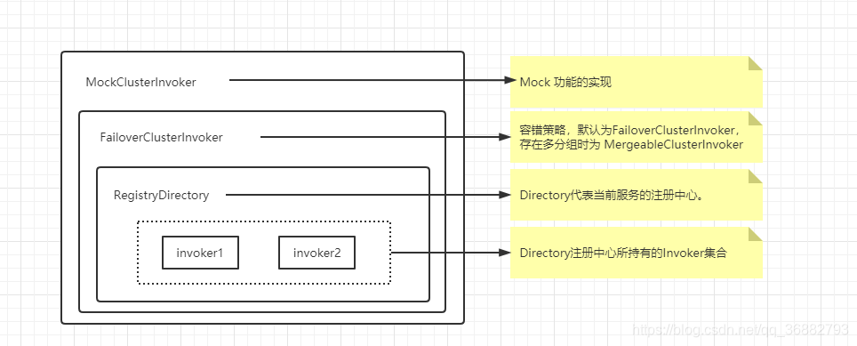
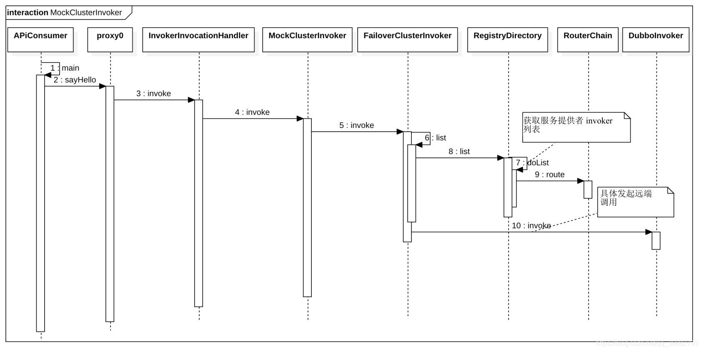

    这是dubbo系列的第6篇文章，主要介绍的是dubbo的服务调用过程。

<style>
.my-code {
   color: orange;
}
.orange {
   color: rgb(255, 53, 2)
}
.red {
   color: red
}
code {
   color: #0ABF5B;
}
</style>

# 一、dubbo
Dubbo 是一款微服务开发框架，它提供了 **RPC通信** 与 **微服务治理** 两大关键能力。这意味着，使用 Dubbo 开发的微服务，将具备相互之间的远程发现与通信能力， 同时利用 Dubbo 提供的丰富服务治理能力，可以实现诸如服务发现、负载均衡、流量调度等服务治理诉求。同时 Dubbo 是高度可扩展的，用户几乎可以在任意功能点去定制自己的实现，以改变框架的默认行为来满足自己的业务需求。

<!--more-->

Dubbo主要提供了`3大核心功能`：面向接口的远程方法调用，智能容错和负载均衡，以及服务自动注册和发现。
1. **远程方法调用**
网络通信框架，提供对多种NIO框架抽象封装，包括“同步转异步”和“请求-响应”模式的信息交换方式。

2. **智能容错和负载均衡**
提供基于接口方法的透明远程过程调用，包括多协议支持，以及软负载均衡，失败容错，地址路由，动态配置等集群支持。

3. **服务注册和发现**
服务注册，基于注册中心目录服务，使服务消费方能动态的查找服务提供方，使地址透明，使服务提供方可以平滑增加或减少机器。


# 二、示例代码
以当前示例，来进行服务调用过程的分析。

spring配置文件：
```xml
<dubbo:reference id="demoService" check="false" init="false" interface="com.alibaba.dubbo.demo.DemoService"/>
```
Java代码：
```java
@Service
public class TestService {
    @Resource
    private DemoService demoService;
    
    public void get() {
        demoSercice.sayHello("String name");
    }
}
```
在`Consumer`启动过程中，我们解析了注入过程，当前注入的对象，是执行`ReferenceBean.getObject()`方法返回的代理对象。

代理对象字节码反编译后的示例：
```java
public class proxy0 implements ClassGenerator.DC, EchoService, DemoService {
    // 方法数组
    public static Method[] methods;
    private InvocationHandler handler;

    public proxy0(InvocationHandler invocationHandler) {
        this.handler = invocationHandler;
    }
    public proxy0() {
    }

    public String sayHello(String string) {
        // 将参数存储到 Object 数组中
        Object[] arrobject = new Object[]{string};
        // 调用 InvocationHandler 实现类的 invoke 方法得到调用结果
        Object object = this.handler.invoke(this, methods[0], arrobject);
        // 返回调用结果
        return (String)object;
    }

    /** 回声测试方法 */
    public Object $echo(Object object) {
        Object[] arrobject = new Object[]{object};
        Object object2 = this.handler.invoke(this, methods[1], arrobject);
        return object2;
    }
}
```
- `Invoker`：Dubbo内部定义的类，封装具体的调用逻辑。
- `InvocationHandler`：JDK动态代理的接口
- `InvokerInvocationHandler`：Dubbo中对JDK动态代理的实现


# 三、代理对象执行
代理对象执行相应方法时，会先执行增强处理器： `InvokerInvocationHandler`
```java
public class InvokerInvocationHandler implements InvocationHandler {
  private final Invoker<?> invoker;

  public InvokerInvocationHandler(Invoker<?> handler) {
    this.invoker = handler;
  }
  @Override
  public Object invoke(Object proxy, Method method, Object[] args) throws Throwable {
    String methodName = method.getName();
    Class<?>[] parameterTypes = method.getParameterTypes();
    if (method.getDeclaringClass() == Object.class) {
      return method.invoke(invoker, args);
    }
    if ("toString".equals(methodName) && parameterTypes.length == 0) {
      return invoker.toString();
    }
    if ("hashCode".equals(methodName) && parameterTypes.length == 0) {
      return invoker.hashCode();
    }
    if ("equals".equals(methodName) && parameterTypes.length == 1) {
      return invoker.equals(args[0]);
    }
    return invoker.invoke(new RpcInvocation(method, args)).recreate();
  }
}
```

我们这里以在单注册中心为例，当前 `Invoker` 结构如下：


Invoker的协作流程
```text
Consumer Proxy → MockClusterInvoker → FailoverClusterInvoker → InvokerDelegate → DubboInvoker
```

## 3.1、AbstractClusterInvoker.invoke()方法
源码如下：
```java
public abstract class AbstractClusterInvoker<T> implements Invoker<T> {
    @Override
    public Result invoke(Invocation invocation) throws RpcException {
        // 1. 检查是否已销毁
        checkWhetherDestroyed();
  
        // 2. 绑定附加参数（如 RPC 上下文）
        Map<String, Object> contextAttachments = RpcContext.getServerContext().getObjectAttachments();
        if (contextAttachments != null && !contextAttachments.isEmpty()) {
          invocation.addObjectAttachments(contextAttachments);
        }
  
        // 3. 从 Directory 获取所有服务提供者 Invoker 列表
        List<Invoker<T>> invokers = list(invocation);
  
        // 4. 初始化负载均衡器（支持 SPI 扩展）
        LoadBalance loadbalance = initLoadBalance(invokers, invocation);
  
        // 5. 调用子类实现的容错逻辑（如 FailoverClusterInvoker.doInvoke()）
        return doInvoke(invocation, invokers, loadbalance);
    }

    protected List<Invoker<T>> list(Invocation invocation) throws RpcException {
        List<Invoker<T>> invokers = directory.list(invocation);
        return invokers;
    }
}
```

关键步骤如下：

### 3.1.1、获取服务列表
```java
protected List<Invoker<T>> list(Invocation invocation) throws RpcException {
    // 通过 Directory 获取所有 Invoker，并应用路由规则
    return directory.list(invocation);
}
```
调用`RouterChain.route()`过滤符合条件的Invoker
> `Router`：**服务路由**包含一条路由规则，路由规则决定了服务消费者的调用目标，即规定了服务消费者可调用哪些服务提供者。Dubbo 目前提供了三种服务路由实现，分别为**条件路由 ConditionRouter**、**脚本路由 ScriptRouter** 和**标签路由 TagRouter**。】
```java
public class ConditionRouter extends AbstractRouter {
  @Override
  public <T> List<Invoker<T>> route(List<Invoker<T>> invokers, URL url, Invocation invocation)
          throws RpcException {
      if (!matchWhen(url, invocation)) {
          return invokers;
      }
  }
}
```

### 3.1.2、初始化负载均衡器
```java
protected LoadBalance initLoadBalance(List<Invoker<T>> invokers, Invocation invocation) {
    // 1. 从 URL 参数中获取负载均衡策略（如 random、roundrobin）
    String loadbalanceName = invokers.get(0).getUrl()
        .getMethodParameter(RpcUtils.getMethodName(invocation), Constants.LOADBALANCE_KEY, Constants.DEFAULT_LOADBALANCE);
    
    // 2. 通过 SPI 加载 LoadBalance 实现
    return ExtensionLoader.getExtensionLoader(LoadBalance.class).getExtension(loadbalanceName);
}
```
- **默认策略**：random（随机）
- **SPI扩展**：支持自定义负载均衡算。

### 3.1.3、负载均衡

```java
public class FailoverClusterInvoker<T> extends AbstractClusterInvoker<T> {
  @Override
  @SuppressWarnings({"unchecked", "rawtypes"})
  public Result doInvoke(Invocation invocation, final List<Invoker<T>> invokers, LoadBalance loadbalance) throws RpcException {
    Invoker<T> invoker = select(loadbalance, invocation, copyinvokers, invoked);
    Result result = invoker.invoke(invocation);
  }
}
public abstract class AbstractClusterInvoker<T> implements Invoker<T> {
  protected Invoker<T> select(LoadBalance loadbalance, Invocation invocation, List<Invoker<T>> invokers, List<Invoker<T>> selected) throws RpcException {
    if (invokers == null || invokers.isEmpty())
      return null;
    String methodName = invocation == null ? "" : invocation.getMethodName();
    Invoker<T> invoker = doSelect(loadbalance, invocation, invokers, selected);
    return invoker;
  }

  private Invoker<T> doSelect(LoadBalance loadbalance, Invocation invocation, List<Invoker<T>> invokers, List<Invoker<T>> selected) throws RpcException {
    // 使用LoadBalance选择具体节点，执行调用并处理失败重试。
    Invoker<T> invoker = loadbalance.select(invokers, getUrl(), invocation);
    return invoker;
  }
  protected List<Invoker<T>> list(Invocation invocation) throws RpcException {
    List<Invoker<T>> invokers = directory.list(invocation);
    return invokers;
  }
}
```

### 3.1.4、服务消费方发送请求
发送请求时的调用链如上
```text
DubboInvoker#doInvoke -> ReferenceCountExchangeClient#request -> HeaderExchangeClient#request
-> HeaderExchangeChannel#request -> AbstractPeer#send -> AbstractClient#send -> NettyChannel#send
```
- `ReferenceCountExchangeClient`
  - 内部定义了一个引用计数变量 `referenceCount`，每当该对象被引用一次 `referenceCount` 都会进行自增
- `HeaderExchangeClient`
  - 加入心跳检测的逻辑,心跳检测会在构造方法中被开启,close()被调用后停止:
  - Dubbo 对于建立的每一个连接，同时在客户端和服务端开启了 2 个定时器，一个用于定时发送心跳，一个用于定时重连、断连，执行的频率均为各自检测周期的 1/3。定时发送心跳的任务负责在连接空闲时，向对端发送心跳包。定时重连、断连的任务负责检测 lastRead 是否在超时周期内仍未被更新，如果判定为超时，客户端处理的逻辑是重连，服务端则采取断连的措施
- `HeaderExchangeChannel`
  - 创建 `Request` 对象：<code class="red">Request req = new Request();</code>
  - 创建 `DefaultFuture` 对象：<code class="red">DefaultFuture future = new DefaultFuture(channel, req, timeout);</code>
  - 调用 `NettyClient` 的 `send` 方法发送请求：<code class="red">channel.send(req);</code>


消费者服务调用的时序图如下 ：



参考文章：
[消费者启动流程 - ReferenceConfig#get](https://blog.csdn.net/qq_36882793/article/details/115726433)