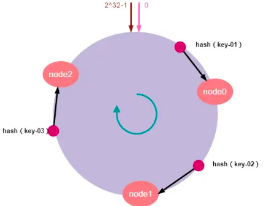

<style>
.my-code {
   color: red;
}
.orange {
   color: orange
}
.red {
   color: red
}
code {
   color: #0ABF5B;
}
</style>

# 一、负载均衡
**负载均衡**（`Load Balancing`）是分布式系统中的核心技术，用于将网络流量、计算任务或数据请求合理分配到多个服务器或资源节点，以提高系统性能、可用行和可扩展性。

<!--more-->


# 二、负载均衡的类型
## 2.1、按层级划分
- **网络层（L4）**：基于IP和端口进行流量分发（如TCP/UDP）。
- **应用层（L7）**：解析HTTP/HTTPS内容，按URL、Header等路由（如反向代理）。

## 2.2、按实现方式
- **硬件负载均衡器**：专用设备（如`F5 BIG-IP`），高性能但成本高。
- **软件负载均衡器**：灵活部署（如`NGINX、HAProxy、Envoy`），适合云环境。
- **云服务负载均衡器**：`AWS ALB/NLB、Azure Load Balancer、Google Clound LB.`


# 三、典型应用场景
1. **web服务集群**：分散HTTP请求到多台WEB服务器。
2. **数据库读写分离**：将读请求分发到从库，写请求导向主库。
3. **微服务架构**：通过服务网格（如I`Stio`）实现服务间流量管理。
4. **全球服务器负载均衡（GSLB）**：跨地域分发流量，实现低延迟和容灾（如CDN）。

# 四、负载均衡算法
常见负载均衡算法

| 算法                        | 描述                          | 适用场景                    |
|---------------------------|-----------------------------|-------------------------|
| 轮询（`Round Robin`）         | 依次将请求分发到每个服务器，均匀分配          | 服务器性能相近时使用              |
| 加权轮询（`Weighted RR`）       | 根据服务器性能分配权重，高性能服务器处理更多请求    | 服务器配置不均衡（如CPU、内存差异）     |
| 最少连接（`Least Connections`） | 将新请求发送到当前连接数最少的服务器          | 长连接场景（如websocket、数据库）   |
| IP哈希（`IP HASH`）           | 根据客户端IP计算哈希值，固定分配到同一服务器     | 需要会话保持的应用（如购物车）         |
| 响应时间（`Response Time`）     | 选择响应时间最短的服务器                | 实时性要求高的服务（如API网关）       |
| 一致性哈希算法                   |                 |        |


## 4.1、轮询算法
基础轮询算法（线程安全）：
```java
import java.util.List;
import java.util.concurrent.atomic.AtomicInteger;

public class RoundRobinBalancer {
    private final List<String> servers;
    private final AtomicInteger currentIndex = new AtomicInteger(0);

    // 初始化负载均衡器
    public RoundRobinBalancer(List<String> servers) {
        if (servers == null || servers.isEmpty()) {
            throw new IllegalArgumentException("Servers list cannot be empty");
        }
        this.servers = servers;
    }

    // 获取下一个服务器（线程安全）
    public String getNextServer() {
        int index = currentIndex.getAndUpdate(i -> (i + 1) % servers.size());
        return servers.get(index);
    }

    // 示例用法
    public static void main(String[] args) {
        List<String> servers = List.of("ServerA", "ServerB", "ServerC");
        RoundRobinBalancer balancer = new RoundRobinBalancer(servers);
        // 模拟5次请求分发
        for (int i = 0; i < 5; i++) {
            System.out.println("Request " + (i + 1) + " → " + balancer.getNextServer());
        }
    }
}
```

## 4.2、加权轮询算法
根据服务器权重分配请求：
```java
import java.util.ArrayList;
import java.util.List;
import java.util.concurrent.atomic.AtomicInteger;

public class WeightedRoundRobinBalancer {
    private static class Server {
        String name;
        int weight;
        int currentWeight;

        Server(String name, int weight) {
            this.name = name;
            this.weight = weight;
            this.currentWeight = 0;
        }
    }

    private final List<Server> servers = new ArrayList<>();
    private final AtomicInteger index = new AtomicInteger(0);

    // 添加带权重的服务器
    public void addServer(String name, int weight) {
        servers.add(new Server(name, weight));
    }

    // 获取下一个服务器（平滑加权轮询算法）
    public String getNextServer() {
        int totalWeight = servers.stream().mapToInt(s -> s.weight).sum();
        int maxCurrentWeight = Integer.MIN_VALUE;
        Server selected = null;

        // 遍历所有服务器，选择当前权重最大的
        for (Server server : servers) {
            server.currentWeight += server.weight;
            if (server.currentWeight > maxCurrentWeight) {
                maxCurrentWeight = server.currentWeight;
                selected = server;
            }
        }

        if (selected != null) {
            selected.currentWeight -= totalWeight;
            return selected.name;
        } else {
            throw new IllegalStateException("No servers available");
        }
    }

    // 示例用法
    public static void main(String[] args) {
        WeightedRoundRobinBalancer balancer = new WeightedRoundRobinBalancer();
        balancer.addServer("ServerA", 3); // 权重3
        balancer.addServer("ServerB", 2); // 权重2
        balancer.addServer("ServerC", 1); // 权重1

        // 模拟6次请求
        for (int i = 0; i < 6; i++) {
            System.out.println("Request " + (i + 1) + " → " + balancer.getNextServer());
        }
    }
}
```
输出:
```text
Request 1 → ServerA
Request 2 → ServerB
Request 3 → ServerA
Request 4 → ServerC
Request 5 → ServerA
Request 6 → ServerB
```

## 4.3、<code class="red">一致性哈希算法（Hash）</code>
- **定义**：一种在分布式系统中用于**数据分布**和**负载均衡**的算法
- **目的**：解决分布式系统的数据分区问题：当分布式集群移除或者添加一个服务器时，必须尽可能小地改变已存在的服务请求与处理请求服务器之间的映射关系。
- **优点**：一致性哈希算法保证了增加或减少服务器时，数据存储的改变最少，相比传统哈希算法大大节省了数据移动的开销 【部分数据还是需要移动】


> <code class="orange">传统hash算法</code>
> 
> - **算法原理**
>   - 给定一个 key，先对 key 进行哈希运算，将其除以系统中的节点数，然后将该 key 放入该节点
>   - `node_number = hash(key) % N` ，其中 N 为节点数。
> - **传统哈希取模算法的局限性**
>   - **节点减少的场景**：会导致key进行`hash(key)%N`计算得出的编号不一样，几乎所有映射关系会失败，导致大规模数据迁移，从而缓存雪崩等问题。
>   - **节点增加的场景**：和节点减少一样。


### 4.3.1、基本原理
1. **环形结构**
一致性哈希将整个哈希值空间组织成一个虚拟的环形结构。通常使用一个固定范围的整数空间来表示哈希值，例如 `0` 到 `2^32 - 1`。
2. **节点映射**
系统中的**每个节点**通过哈希函数计算出一个唯一的哈希值，并将其映射到环形空间上。例如，使用节点的 IP 地址、主机名或其他唯一标识作为输入，通过哈希函数计算出一个**整数哈希值**，然后将该**节点放置在环形空间的对应位置**上。
3. **数据映射**
要存储或访问的数据对象，同样使用哈希函数计算出一个哈希值，并将其映射到环形空间上。
4. **数据分配**
从数据对象在环形空间上的位置开始，顺时针方向查找最近的节点，将数据分配到该节点上。这样，每个数据对象都被分配到了环形空间上离它最近的节点上。

| 环形结构                              | 节点映射                              | 数据映射                              |
|-----------------------------------|-----------------------------------|-----------------------------------|
|  |  |  |
|| 3个节点                              |假设我们有“**key-01：张三**”、“**key-02：李四**”、“**key-03：王五**”三条缓存数据。经过哈希算法计算后，映射到哈希环上的位置如上数据映射图所示|

### 4.3.2、服务器扩容&缩容
| 扩容                                                              | 缩容                                                                 |
|-----------------------------------------------------------------|--------------------------------------------------------------------|
| 		                                 |                                       |
| 加入新的`node3`节点后，`key-01、key-02`不受影响，只有`key-04`的寻址被重定位到新节点`node3` | 节点`node2`发生故障时，数据`key-01`和`key-02`不会受到影响，只有`key-03`的请求被重定位到`node0` |
| 受影响的数据仅仅是会寻址到新节点和前一节点之间的数据                                      | 那么受影响的数据仅仅是会**寻址到此节点和前一节点之间的数据**。其他哈希环上的数据不会受到影响                   |


### 4.3.3、数据倾斜
前面说了一致性哈希算法的原理以及扩容缩容的问题。但是，由于哈希计算的随机性，导致一致性哈希算法存在一个致命问题：**数据倾斜**，也就是说大多数访问**请求都会集中少量几个节点**的情况。特别是节点太少情况下，容易因为节点分布不均匀造成数据访问的冷热不均。这就失去了集群和负载均衡的意义。如下图所示：

如上图所示，`key-1、key-2、key-3`可能被映射到同一个节点`node0`上。导致`node0`负载过大，而`node1`和`node2`却很空闲的情况。这有可能导致个别服务器数据和请求压力过大和崩溃，进而引起集群的崩溃。


#### 4.3.3.1、数据倾斜问题解决方案：`虚拟节点`
为了解决**数据倾斜**的问题，一致性哈希算法引入了**虚拟节点机制**，即对每一个物理服务节点映射多个虚拟节点，将这些虚拟节点计算哈希值并映射到哈希环上，当请求找到某个虚拟节点后，将被重新映射到具体的物理节点。虚拟节点越多，哈希环上的节点就越多，数据分布就越均匀，从而避免了数据倾斜的问题。

“虚拟节点”的 `hash` 计算可以采用对应节点的 `IP` 地址 + 数字后缀的方式。例如假设 `cache A` 的 IP 地址为 `202.168.14.241` 。
- 引入“虚拟节点”前，计算 `cache A` 的 hash 值： `Hash(“202.168.14.241”);`
- 引入“虚拟节点”后，计算“虚拟节”点 `cache A1` 和 `cache A2` 的 `hash` 值：
  - `Hash(“202.168.14.241#1”);` // cache A1
  - `Hash(“202.168.14.241#2”);` // cache A2

具体操作可以为服务器IP或主机名后加入编号来实现：例如虚拟节点引入5个
```text
hash(realNode1 + "&VN" + 1
hash(realNode1 + "&VN" + 2
hash(realNode1 + "&VN" + 3
hash(realNode1 + "&VN" + 4
hash(realNode1 + "&VN" + 5
```
	

### 4.3.4、手搓算法
- 环形结构：
  - 使用`TreeMap`实现环形结构，`private SortedMap<Long, T> circle = new TreeMap<>();`。
    - **key**：服务器hash值
    - **value**：具体的服务器地址

> TreeMap
> 
> - **基于红黑树实现**：保证所有操作（增删改查）的时间复杂度为O(log n)
> - **有效性**：默认按键的自然顺序排序（如数字、字符串）
> - 重要方法`tairMap(key)`：返回一个`SortedMap`，包含原映射中所有键**大于或等于**`key`的键值对。


```java
public class ConsistentHash<T> {
    // 哈希服务，获取数据的哈希值
    private IHashService hashService;
    // 虚拟节点：每个真实节点生成多个虚拟节点，这些虚拟节点均匀分布在哈希环上
    private int numbersOfReplicas;
    // 哈希环：通过SortedMap<Long, T> 存储虚拟节点和哈希值对应的节点，键为node的哈希值，值为真实节点。
    private SortedMap<Long, T> circle = new TreeMap<>();
    //nodes：真实节点
    public ConsistentHash(IHashService hashService, int numbersOfReplicas, Collection<T> nodes) {
        this.hashService = hashService;
        this.numbersOfReplicas = numbersOfReplicas;
        for (T node : nodes) {
            addNode(node);
        }
    }
    /**
     * 添加新机器节点
     * @param node 真实节点
     */
    public void addNode(T node) {
        for (int i = 0; i < numbersOfReplicas; i++) {
            // 虚拟节点和真实节点的映射
            circle.put(this.hashService.hash(node.toString() + i), node);
        }
    }

    //获取真实节点
    public T getNode(String key) {
        if (circle.isEmpty()) {
            return null;
        }
        //获取key的hash值
        long hash = hashService.hash(key);
        //如果不存在，
        if (!circle.containsKey(hash)) {
            //获取当前hash值的最近大于节点
            SortedMap<Long, T> tailMap = circle.tailMap(hash);
            //代表是尾节点，则取第一个节点
            hash = tailMap.isEmpty() ? circle.firstKey() : tailMap.firstKey();
        }
        return circle.get(hash);
    }
}
```
测试用例：
```java
public class ConsistentMainTest {
    // 机器节点IP前缀
    private static final String IP_PREFIX = "192.168.0.";
    public static void main(String[] args) {
        // 每台真实机器节点上保存的记录条数
        Map<String, Integer> map = new HashMap<String, Integer>();
        // 真实机器节点, 模拟5台
        List<Node<String>> nodes = new ArrayList<Node<String>>();
        for (int i = 1; i <= 5; i++) {
            map.put(IP_PREFIX + i, 0); // 初始化记录
            Node<String> node = new Node<String>(IP_PREFIX + i, "node" + i);
            nodes.add(node);
        }
        
        IHashService hashService = new HashService();
        // 构建环形结构，并创建虚拟节点
        ConsistentHash<Node<String>> consistentHash = new ConsistentHash<>(hashService, 3, nodes);
        //模拟5000个数据
        for (int i = 0; i < 5000; i++) {
            String data = UUID.randomUUID().toString() + i;
            Node<String> node = consistentHash.getNode(data);
            map.put(node.getIp(), map.get(node.getIp()) + 1);
        }

        for (int i = 1; i <= 10; i++) {
            System.out.println(IP_PREFIX + i + "节点记录条数：" + map.get(IP_PREFIX + i));
        }
    }
}
```
示例如下：


# 五、Nginx中的负载均衡
Nginx 常用的负载均衡策略如下：

1. **轮询（Round Robin）**
轮询是最基本的负载均衡策略，请求按时间顺序依次分配到不同的服务器上。如果服务器宕机，它能自动剔除故障机器，实现请求的均等分配。
```
http {
   upstream myapp {
      server server1.example.com;
      server server2.example.com;
      server server3.example.com;
   }

    server {
        listen 80;

        location / {
            proxy_pass http://myapp;
        }
    }
}
```

2. **最少连接（Least Connections）**
最少连接策略会将新的请求发送到当前连接数最少的服务器。这种策略适用于处理时间各异的请求。
```
http {
   upstream myapp {
      least_conn;
      server server1.example.com;
      server server2.example.com;
      server server3.example.com;
   }

    server {
        listen 80;

        location / {
            proxy_pass http://myapp;
        }
    }
}
```

3. **IP 哈希（IP Hash）**
IP 哈希策略根据客户端的 IP 地址进行哈希运算，然后根据运算结果将请求分配给后端服务器，确保来自同一客户端的请求总是被发送到同一服务器。
```
http {
   upstream myapp {
      ip_hash;
      server server1.example.com;
      server server2.example.com;
      server server3.example.com;
   }

    server {
        listen 80;

        location / {
            proxy_pass http://myapp;
        }
    }
}
```

4. **权重（Weighted）**
在轮询的基础上，给每个服务器设置一个权重，根据权重比例分配客户端请求。权重越高的服务器，被分配到的请求就越多。
```
http {
   upstream myapp {
      server server1.example.com weight=3;
      server server2.example.com weight=2;
      server server3.example.com weight=1;
   }

    server {
        listen 80;

        location / {
            proxy_pass http://myapp;
        }
    }
}
```

# 六、Dubbo中的负载均衡

## 6.1、随机（random）
原理：按权重随机选择provider，权重高的节点被选中的概率更高。
适用场景：节点性能差异较小，追求简单高效。
```xml
<!-- XML 配置 -->
<dubbo:reference interface="com.example.UserService" loadbalance="random" />
```
```java
// 注解配置
@Reference(loadbalance = "random")
private UserService userService;
```

## 6.2、轮询（roundrobin）
原理：按权重轮询分配请求，权重高的节点获得更多请求。
问题：若某节点响应慢，可能导致请求堆积。
```xml
<dubbo:reference interface="com.example.UserService" loadbalance="roundrobin" />
```
```java
@Reference(loadbalance = "roundrobin")
private UserService userService;
```

## 6.3、最少活跃调用数（LeastActive）
原理：选择当前活跃请求数（未完成调用数）最少的节点，动态感知负载。
使用场景：节点性能差异大，需避免慢节点过载。
```properties
# application.properties
dubbo.consumer.loadbalance=leastactive
```

## 6.4、负载均衡源码
```java
public class FailoverClusterInvoker<T> extends AbstractClusterInvoker<T> {
  @Override
  @SuppressWarnings({"unchecked", "rawtypes"})
  public Result doInvoke(Invocation invocation, final List<Invoker<T>> invokers, LoadBalance loadbalance) throws RpcException {
      Invoker<T> invoker = select(loadbalance, invocation, copyinvokers, invoked);
      Result result = invoker.invoke(invocation);
  }
}
public abstract class AbstractClusterInvoker<T> implements Invoker<T> {
    protected Invoker<T> select(LoadBalance loadbalance, Invocation invocation, List<Invoker<T>> invokers, List<Invoker<T>> selected) throws RpcException {
        if (invokers == null || invokers.isEmpty())
          return null;
        String methodName = invocation == null ? "" : invocation.getMethodName();
        Invoker<T> invoker = doSelect(loadbalance, invocation, invokers, selected);
        return invoker;
    }

    private Invoker<T> doSelect(LoadBalance loadbalance, Invocation invocation, List<Invoker<T>> invokers, List<Invoker<T>> selected) throws RpcException {
        // 使用LoadBalance选择具体节点，执行调用并处理失败重试。
        Invoker<T> invoker = loadbalance.select(invokers, getUrl(), invocation);
        return invoker;
    }
    protected List<Invoker<T>> list(Invocation invocation) throws RpcException {
        List<Invoker<T>> invokers = directory.list(invocation);
        return invokers;
    }
}
```
算法具体实现：
```java
public class RandomLoadBalance extends AbstractLoadBalance {
    @Override
    protected <T> Invoker<T> doSelect(List<Invoker<T>> invokers, URL url, Invocation invocation) {
        int length = invokers.size(); // Number of invokers
        int totalWeight = 0; // The sum of weights
        boolean sameWeight = true; // Every invoker has the same weight?
        for (int i = 0; i < length; i++) {
            int weight = getWeight(invokers.get(i), invocation);
            totalWeight += weight; // Sum
            if (sameWeight && i > 0
                    && weight != getWeight(invokers.get(i - 1), invocation)) {
                sameWeight = false;
            }
        }
        if (totalWeight > 0 && !sameWeight) {
            // If (not every invoker has the same weight & at least one invoker's weight>0), select randomly based on totalWeight.
            int offset = random.nextInt(totalWeight);
            // Return a invoker based on the random value.
            for (int i = 0; i < length; i++) {
                offset -= getWeight(invokers.get(i), invocation);
                if (offset < 0) {
                    return invokers.get(i);
                }
            }
        }
        // If all invokers have the same weight value or totalWeight=0, return evenly.
        return invokers.get(random.nextInt(length));
    }
}
```


负载均衡是现代系统设计的基石。

参考文章：
[负载均衡](https://www.archmanual.com/backend/loadbalance/)
