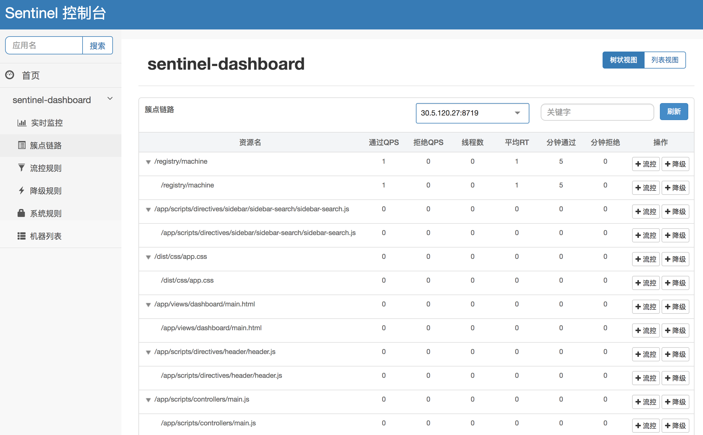
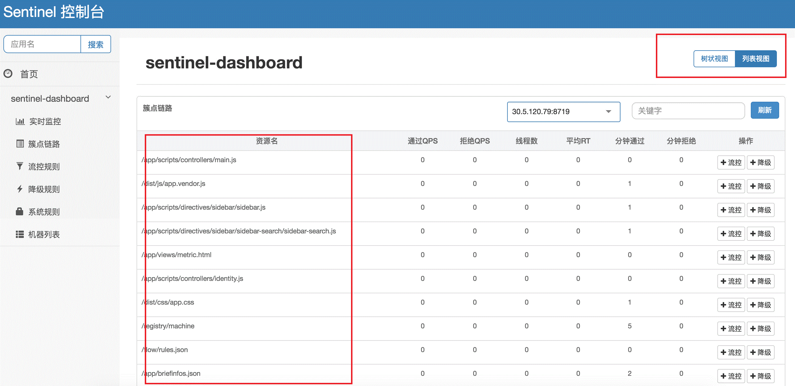
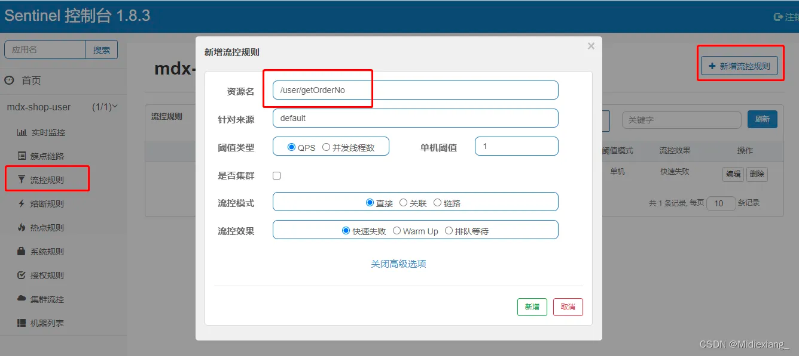
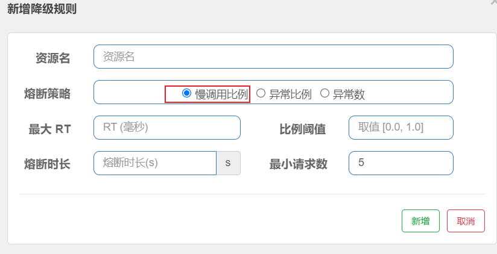
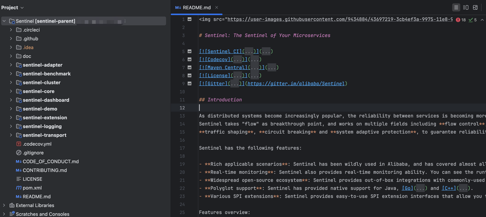
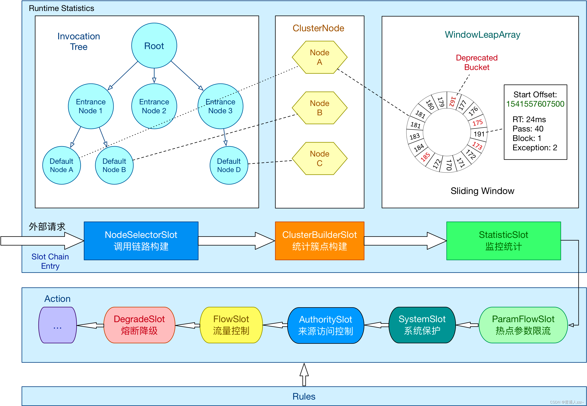

<style>
.my-code {
   color: orange;
}
.orange {
   color: rgb(255, 53, 2)
}
.red {
   color: red
}
code {
   color: #0ABF5B;
}
</style>

# 一、限流-熔断-降级
限流、熔断、降级是微服务架构中常用的保护机制。
<!--more-->


# 二、sentinel
流量治理组件，主要以流量为切入点，从**流量控制、流量路由、熔断降级、系统自适应保护**等多个维度来帮助用户保障微服务的稳定性

## 2.1、核心功能包括

### 2.1.1、限流（流量控制）
支持维度
- **QPS限流**：限制每秒请求数。
- **线程数限流**：限制并发线程数（防止资源耗尽）。
- **关联限流**：A服务限流触发后联动限制B服务。
- **链路限流**：基于调用链路进行限流。

算法：令牌桶、漏桶

### 2.1.2、熔断降级
熔断策略
- **异常比例**(`ERROR_RATIO`)：如1秒内40%的请求失败
- **慢调用比例**(`SLOW_REQUEST_RATIO`)：如响应时间超过100ms的请求占比超过阈值。
- **异常数**(`ERROR_COUNT`)：单位时间内异常数超过阈值。

熔断状态
- **关闭（closed）**：正常调用，统计指标。
- **打开（open）**：拒绝请求，触发降级逻辑。
- **半开（half-open）**：允许少量请求试探，决定是否恢复。


### 2.1.3、系统保护
保护维度
- **CPU使用率**：超过阈值（如80%）自动限流。
- **线程数**：防止线程池耗尽。
- **响应时间（RT）**：平均响应时间过长时触发降级。


# 三、架构

## 3.1、核心概念

### 3.1.1、资源（Resource）
**定义**：被保护的接口、服务、方法名或代码块。
**作用**：通过`sentinel API`定义资源，使其能够被`sentinel`监控和保护。
**示例**：
```java
@SentinelResource(value = "getUser", blockHandler = "handleBlock")
public String getUser() {
    return "正常访问";
}
```

#### 资源示例
簇点链路（单机调用链路）页面实时的去拉取指定客户端**资源**的运行情况。提供两种展示模式：一种用树状结构展示资源的调用链路，另外一种则不区分调用链路展示资源的运行情况。

| 树状链路                              | 平铺链路                             |
|-----------------------------------|----------------------------------|
|  |  |


### 3.1.2、规则（Rule）
**定义**：围绕资源设定的规则，包括流控规则、熔断规则、系统规则等。
**类型**：
- **流量控制规则**：QPS、线程数、热点参数限流。
- **熔断降级规则**：基于异常比例、RT（响应时间）、异常数。
- **系统保护规则**：CPU使用率、系统负载、平均RT。
- **授权规则**：控制资源的访问权限。


#### 规则示例
| 流控规则                                  | 熔断降级规则                            |
|---------------------------------------|-----------------------------------|
|  |  |


## 3.2、相关类定义


### 3.2.1、资源与上下文

#### 3.2.1.1、`ResourceWrapper`
- **定义**：资源的包装类，抽象了资源的名称和类型（如方法调用、HTTP接口等）。
- **实现类**：
  - `StringResourceWrapper`：通用资源包装（通过字符串标识资源）
  - `MethodResourceWrapper`：针对方法调用的资源包装。

```java
package com.alibaba.csp.sentinel.slotchain;
public abstract class ResourceWrapper {
    protected final String name;
    protected final EntryType entryType;
    protected final int resourceType;
}
```

#### 3.2.1.2、`Context`
- **定义**：请求的上下文环境，每个资源操作（如`entry/exit`）必须属于一个`Context`
- **作用**：管理资源操作的生命周期，保存线程级别的上下文信息（通过`ThreadLocal`）。
```java
package com.alibaba.csp.sentinel.context;
public class Context {
    //上下文名称
    private final String name;
    /**
     * The entrance node of current invocation tree.
     */
    private DefaultNode entranceNode;
    /**
     * Current processing entry.
     */
    private Entry curEntry;
    /**
     * The origin of this context (usually indicate different invokers, e.g. service consumer name or origin IP).
     */
    private String origin = "";
    private final boolean async;

}
```

#### 3.2.1.3、`Entry`
定义：表示一次资源操作的入口（Entry可以理解为每次进入资源的一个凭证），通过`SphU.entry()`或`SphO.entry()`创建。
作用：记录请求的入口信息（如开始时间、资源名），并在exit()时统计请求的完成情况。
```java
package com.alibaba.csp.sentinel;
public abstract class Entry implements AutoCloseable {
    private static final Object[] OBJECTS0 = new Object[0];

    private final long createTimestamp;
    private long completeTimestamp;

    private Node curNode;
    /**
     * {@link Node} of the specific origin, Usually the origin is the Service Consumer.
     */
    private Node originNode;

    private Throwable error;
    private BlockException blockError;

    protected final ResourceWrapper resourceWrapper;
}
```

### 3.2.2、统计与节点类

#### 3.2.2.1、StatisticNode
- **定义**：统计节点的基类，用于记录资源的实时指标（如QPS、线程数、响应时间）。
```java
public class StatisticNode implements Node {
    //秒级滑动时间窗口统计（如QPS）
    private transient volatile Metric rollingCounterInSecond = new ArrayMetric(SampleCountProperty.SAMPLE_COUNT,
            IntervalProperty.INTERVAL);

    //分钟级统计（如分钟级QPS）
    private transient Metric rollingCounterInMinute = new ArrayMetric(60, 60 * 1000, false);

    //当前并发线程数（用于线程数限流）
    private LongAdder curThreadNum = new LongAdder();

    /**
     * The last timestamp when metrics were fetched.
     */
    private long lastFetchTime = -1;
}
```
- **子类**：
  - `DefaultNode`：记录单个链路中资源的统计信息（用于链路模式限流）
  - `ClusterNode`：记录所有链路中资源的统计信息（用于全局或关联模式限流）


#### 3.2.2.2、Metric & MetricBucket
- **Metric**：统计指标的容器，基于滑动时间窗口（ArrayMetric实现）
```java
public interface Metric extends DebugSupport {
    /**
     * Get total success count.
     */
    long success();
    /**
     * Get max success count.
     */
    long maxSuccess();
    /**
     * Get total exception count.
     */
    long exception();

    /**
     * Get total block count.
     */
    long block();
}
```
- **MetricBucket**：存储具体统计值（如请求次数、响应时间）的桶。
```java
public class MetricBucket {
    private final LongAdder[] counters;

    private volatile long minRt;

    public MetricBucket() {
        MetricEvent[] events = MetricEvent.values();
        this.counters = new LongAdder[events.length];
        for (MetricEvent event : events) {
            counters[event.ordinal()] = new LongAdder();
        }
        initMinRt();
    }
}
```
- **作用**：通过滑动窗口机制实时统计资源的运行指标，为限流、熔断决策提供数据支持。


### 3.2.3、核心类

#### 3.2.3.1、SlotChain
- **定义**：sentinel的核心执行模型，以链式结构（类似责任链模式）处理请求。每个请求会经过多个`ProcessorSlot`（处理槽）的处理，完成流量控制、熔断、系统保护等逻辑。
- **作用**：将请求拦截并传递给各个处理槽，逐层执行限流、降级等规则。

```java
public interface SlotChainBuilder {
    /**
     * Build the processor slot chain.
     */
    ProcessorSlotChain build();
}

public abstract class ProcessorSlotChain extends AbstractLinkedProcessorSlot<Object> {
    /**
     * Add a processor to the head of this slot chain.
     */
    public abstract void addFirst(AbstractLinkedProcessorSlot<?> protocolProcessor);
    /**
     * Add a processor to the tail of this slot chain.
     */
    public abstract void addLast(AbstractLinkedProcessorSlot<?> protocolProcessor);
}
```

#### 3.2.3.2、ProcessorSlot
- **定义**：处理槽的基类，是**Sentinel核心逻辑**的实现单元。每个处理槽负责特定的流量治理功能（如流控、熔断、热点参数限流等）。
```java
public interface ProcessorSlot<T> {
    
    void entry(Context context, ResourceWrapper resourceWrapper, T param, int count, boolean prioritized,
               Object... args) throws Throwable;

    void fireEntry(Context context, ResourceWrapper resourceWrapper, Object obj, int count, boolean prioritized,
                   Object... args) throws Throwable;
}
```

- **子类**：
  - <code class="red">NodeSelectorSlot</code>：调用链路
    该节点的作用就是收集资源路径，并将资源路径以树状结构存储起来，用于根据调用路径来限流降级
  - <code class="red">ClusterBuilderSlot</code>：统计簇点
    此插槽用于构建资源的 `ClusterNode` 以及调用来源节点。`ClusterNode` 保持资源运行统计信息（响应时间、`QPS`、`block` 数目、线程数、异常数等）以及原始调用者统计信息列表。来源调用者的名字由 ContextUtil.enter(contextName，origin) 中的 origin 标记
  - <code class="red">LogSlot</code>：日志
    根据名字可知该节点是个日志记录节点，不过收集的是发生`BlockException`异常后的日志
  - <code class="red">StatisticSlot</code>：统计
    该节点是个用于统计实时的调用数据。比如资源节点通过的请求数量、线程数量等等。
  - <code class="red">AuthoritySlot</code>：来源访问控制
    在该节点中，可以配置我们应用的黑白名单
    授权规则中`RequestOriginParser`类的做用是什么
    对流控应用值进行解析，检查服务访问时传入的值是否与`RequestOriginParser的parseOrigin`方法返回值是否相同
  - <code class="red">SystemSlot</code>：系统保护
    该节点会根据对于当前系统的整体情况，对入口资源的调用进行动态调配
  - <code class="red">FlowSlot</code>：流量控制
    该节点主要根据预设的资源的统计信息，按照固定的次序，依次生效
  - <code class="red">DegradeSlot</code>：熔断降级
    该节点主要针对资源的平均响应时间（`RT`）以及异常比率，来决定资源是否在接下来的时间被自动熔断掉
  - <code class="red">ParamFlowSlot</code>：热点参数限流
    热点数据的访问出现限流以后底层异常是什么，`ParamFlowException`

### 3.2.4、熔断与降级类

#### 3.2.4.1、CircuitBreaker
- **定义**：熔断器接口，定义熔断逻辑的核心方法（如状态切换、规则判断）
```java
public interface CircuitBreaker {
    DegradeRule getRule();
    boolean tryPass(Context context);
    State currentState();
    enum State {
        OPEN,//熔断状态，直接拒绝请求。
        HALF_OPEN,//试探性恢复，允许少量请求通过
        CLOSED//正常状态，统计指标
    }
}
```

### 3.2.5、规则类

#### 3.2.5.1、FlowRule
- **定义**：流量控制规则类，定义限流策略。
```java
public class FlowRule extends AbstractRule {
    //
    private int grade = RuleConstant.FLOW_GRADE_QPS;

    // Flow control threshold count.
    private double count;

    // Flow control strategy based on invocation chain.
    private int strategy = RuleConstant.STRATEGY_DIRECT;

    // Reference resource in flow control with relevant resource or context.
    private String refResource;
}
```

#### 3.2.5.2、DegradeRule
- **定义**：熔断降级规则类，包含触发条件和策略
```java
public class DegradeRule extends AbstractRule {
    //资源
    public DegradeRule(String resourceName) {
        setResource(resourceName);
    }
    // 降级策略（ERROR_RATIO、EXCEPTION_COUNT、SLOW_REQUEST_RATIO）
    private int grade = RuleConstant.DEGRADE_GRADE_RT;

    // 阈值（如异常比例0.5表示50%
    private double count;

    // 熔断持续时间（秒）
    private int timeWindow;
}
```
	
### 3.2.6、SphU
- **定义**：构造Entry的工具类
```java
public class SphU {

    private static final Object[] OBJECTS0 = new Object[0];

    private SphU() {
    }

    // Record statistics and perform rule checking for the given resource.
    public static Entry entry(String name) throws BlockException {
        return Env.sph.entry(name, EntryType.OUT, 1, OBJECTS0);
    }

    // Checking all {@link Rule}s about the protected method.
    public static Entry entry(Method method) throws BlockException {
        return Env.sph.entry(method, EntryType.OUT, 1, OBJECTS0);
    }
}
```
- **使用示例**
```java
public class SphUTest {

    @Test
    public void testStringEntryNormal() throws BlockException {
        Entry e = SphU.entry("resourceName");

        assertNotNull(e);
        assertEquals(e.resourceWrapper.getName(), "resourceName");
        assertEquals(e.resourceWrapper.getEntryType(), EntryType.OUT);
        assertEquals(ContextUtil.getContext().getName(), Constants.CONTEXT_DEFAULT_NAME);

        e.exit();
    }

    @Test
    public void testMethodEntryNormal() throws BlockException, NoSuchMethodException, SecurityException {
        Method method = SphUTest.class.getMethod("testMethodEntryNormal");
        Entry e = SphU.entry(method);

        assertNotNull(e);
        assertTrue(StringUtil
                .equalsIgnoreCase(e.resourceWrapper.getName(),
                        "com.alibaba.csp.sentinel.SphUTest:testMethodEntryNormal()"));
        assertEquals(e.resourceWrapper.getEntryType(), EntryType.OUT);
        assertEquals(ContextUtil.getContext().getName(), Constants.CONTEXT_DEFAULT_NAME);

        e.exit();
    }
}
```

# 四、使用示例
## 4.1、定义资源
**资源** 是 `Sentinel` 中的核心概念之一。最常用的资源是我们代码中的 Java 方法。 当然，您也可以更灵活的定义你的资源，例如，把需要控制流量的代码用 `Sentinel API SphU.entry("HelloWorld")` 和 `entry.exit()` 包围起来即可。在下面的例子中，我们将 `System.out.println("hello world");` 作为资源（被保护的逻辑），用 `API` 包装起来。参考代码如下:
```java
public static void main(String[] args) {
    // 配置规则.
    initFlowRules();
    while (true) {
        // 1.5.0 版本开始可以直接利用 try-with-resources 特性
        try (Entry entry = SphU.entry("HelloWorld")) {
            // 被保护的逻辑
            System.out.println("hello world");
	} catch (BlockException ex) {
            // 处理被流控的逻辑
	    System.out.println("blocked!");
	}
    }
}
```
> 也可以通过**注解支持模块**，来定义资源，类似于下面的代码：
> ```java
> 
> @SentinelResource("HelloWorld")
> public void helloWorld() {
>   // 资源中的逻辑
>   System.out.println("hello world");
> }
> ```
> 这样，`helloWorld()` 方法就成了我们的一个资源。注意注解支持模块需要配合 `Spring AOP` 或者 `AspectJ` 一起使用。

## 4.2、定义规则
接下来，通过**流控规则**来指定允许该资源通过的请求次数，例如下面的代码定义了资源 `HelloWorld` 每秒最多只能通过 `20` 个请求。
```java
private static void initFlowRules(){
  List<FlowRule> rules = new ArrayList<>();
  //流控规则
  FlowRule rule = new FlowRule();
  rule.setResource("HelloWorld");
  rule.setGrade(RuleConstant.FLOW_GRADE_QPS);//QPS
  // Set limit QPS to 20.
  rule.setCount(20);
  rules.add(rule);
  FlowRuleManager.loadRules(rules);
}
```


如上就是一个完整的使用示例。

# 五、总结
组件之间的合作，可以参考下图：



> 参考文章：
> [快速开始](https://sentinelguard.io/zh-cn/docs/quick-start.html)
> [控制台](https://sentinelguard.io/zh-cn/docs/dashboard.html)
