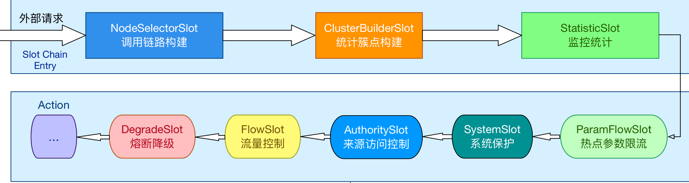

<style>
.my-code {
   color: orange;
}
.orange {
   color: rgb(255, 53, 2)
}
.red {
   color: red
}
code {
   color: #0ABF5B;
}
</style>

# 一、sentinel
流量治理组件，主要以流量为切入点，从**流量控制、流量路由、熔断降级、系统自适应保护**等多个维度来帮助用户保障微服务的稳定性

<!--more-->

# 二、执行流程
```java
public static void main(String[] args) {
    initFlowRules(); //初始化一个规则
    while(true){
        Entry entry=null;
        try{
            entry= SphU.entry(resource); //它做了什么
            System.out.println("Hello Word");
        }catch (BlockException e){//如果被限流了，那么会抛出这个异常
            e.printStackTrace();
        }finally {
            if(entry!=null){
                entry.exit();// 释放
            }
        }
    }
}
private static void initFlowRules(){
  List<FlowRule> rules = new ArrayList<>();
  //流控规则
  FlowRule rule = new FlowRule();
  rule.setResource("HelloWorld");
  rule.setGrade(RuleConstant.FLOW_GRADE_QPS);//QPS
  // Set limit QPS to 20.
  rule.setCount(20);
  rules.add(rule);
  FlowRuleManager.loadRules(rules);
}
```

入口：`Entry e = SphU.entry("resourceName");`

## 2.1、SphU.entry
`SphU.entry`是 Sentinel 的核心入口方法，用于对资源的访问控制。
```java
public class SphU {
    public static Entry entry(String name) throws BlockException {
        return Env.sph.entry(name, EntryType.OUT, 1, OBJECTS0);
    }
}
```
主要逻辑在`sph`内。

## 2.2、Sph接口
`Sph`接口，主要目的是定义**资源访问的入口**和出口控制逻辑，
- `entry`方法：用于获取资源访问的`Entry`对象，执行流量控制、熔断检查等逻辑。
```java
public interface Sph extends SphResourceTypeSupport {
    Entry entry(String name, EntryType trafficType, int batchCount, Object... args) throws BlockException;
}
```
| 参数        | 说明                            |
|-----------|-------------------------------|
| `name`      | 资源名称（字符串）                     |
| `EntryType` | 资源类型，包括：IN（入口流量）、out（出口流量）    |
| `count`     | 本次操作消耗的“令牌数”                  |
| `args`      | 可选参数，用于传递额外的上下文信息（如请求参数、用户ID等 |


`CtSph`是`Sph`接口的核心实现类，负责具体资源访问的控制逻辑。核心功能包括：
- 资源与`SlotChain`的映射：通过`chainMap`缓存资源对应的处理链
- 执行`SlotChain`链式处理：调用`SlotChain.entry()`执行流量控制、熔断等逻辑。
```java
public class CtSph implements Sph {
  private static volatile Map<ResourceWrapper, ProcessorSlotChain> chainMap = new HashMap<ResourceWrapper, ProcessorSlotChain>();
  private static final Object LOCK = new Object();
  public Entry entry(ResourceWrapper resourceWrapper, int count, Object... args) throws BlockException {
    return entryWithPriority(resourceWrapper, count, false, args);
  }
  private Entry entryWithPriority(ResourceWrapper resourceWrapper, int count, boolean prioritized, Object... args)
          throws BlockException {
    Context context = ContextUtil.getContext();
    if (context instanceof NullContext) {
      // The {@link NullContext} indicates that the amount of context has exceeded the threshold,
      // so here init the entry only. No rule checking will be done.
      return new CtEntry(resourceWrapper, null, context);
    }
    if (context == null) {
      // Using default context.
      context = InternalContextUtil.internalEnter(Constants.CONTEXT_DEFAULT_NAME);
    }
    // Global switch is close, no rule checking will do.
    if (!Constants.ON) {
      return new CtEntry(resourceWrapper, null, context);
    }
    //获取当前资源的处理器槽链
    ProcessorSlot<Object> chain = lookProcessChain(resourceWrapper);
    /*
     * Means amount of resources (slot chain) exceeds {@link Constants.MAX_SLOT_CHAIN_SIZE},
     * so no rule checking will be done.
     */
    if (chain == null) {
      return new CtEntry(resourceWrapper, null, context);
    }
    Entry e = new CtEntry(resourceWrapper, chain, context);
    try {
      chain.entry(context, resourceWrapper, null, count, prioritized, args);
    } catch (BlockException e1) {
      e.exit(count, args);
      throw e1;
    } catch (Throwable e1) {
      // This should not happen, unless there are errors existing in Sentinel internal.
      RecordLog.info("Sentinel unexpected exception", e1);
    }
    return e;
  }
}
```
总结`SphU.entry`流程
- **步骤1**：构建资源（`ResourceWrapper`）
- **步骤2**：获取或创建`Context`
- **步骤3**：获取处理器链（`ProcessorSlotChain`）
- **步骤4**：执行处理器链（`SlotChain`）的Entry方法
- **步骤5**：处理业务逻辑
- **步骤6**：调用`exit()`方法结束资源操作。

## 步骤1：构建资源（`ResourceWrapper`）
```java
MethodResourceWrapper resource = new MethodResourceWrapper(method, type);
StringResourceWrapper resource = new StringResourceWrapper(name, type);
```
## 步骤2：获取或创建`Context`
```java
Context context = ContextUtil.getContext();

public class ContextUtil {
    private static ThreadLocal<Context> contextHolder = new ThreadLocal<>();
    public static Context getContext() {
      return contextHolder.get();
    }
}
```
`contextHolder`是`Sentinel`中用于**线程间安全地存储和访问Context对象**的`ThreadLocal`变量。

## 步骤3：获取处理器链（`ProcessorSlotChain`）
```java
ProcessorSlot<Object> chain = lookProcessChain(resourceWrapper);
```
获取或创建与资源对应的处理器链（`ProcessorSlotChain`）
```java
public ProcessorSlot<Object> lookProcessChain(ResourceWrapper resourceWrapper) {
    // 1. 从缓存中查找已存在的链
    ProcessorSlotChain chain = chainMap.get(resourceWrapper);
    if (chain != null) {
        return chain;
    }
    // 2. 未找到时，加锁并重新检查（双重检查）
    synchronized (LOCK) {
        chain = chainMap.get(resourceWrapper);
        if (chain != null) {
            return chain;
        }
        // 3. 检查链表数量是否超过阈值（防止资源过多）
        if (chainMap.size() >= Constants.MAX_SLOT_CHAIN_SIZE) {
            return null; // 超过限制，直接返回空链
        }
        // 4. 创建新的 ProcessorSlotChain
        chain = SlotChainProvider.newSlotChain();
        // 5. 将新链加入缓存（原子操作）
        Map<ResourceWrapper, ProcessorSlotChain> newMap = new HashMap<>(chainMap);
        newMap.put(resourceWrapper, chain);
        chainMap = newMap;
    }
    return chain;
}
```

### 获取处理器链构造器【SlotChainBuilder】
`SlotChainProvider.newSlotChain()`，通过**SPI机制**动态加载`SlotChainBuilder`，支持扩展和自定义。
```java
public final class SlotChainProvider {
  private static volatile SlotChainBuilder slotChainBuilder = null;
  public static ProcessorSlotChain newSlotChain() {
    if (slotChainBuilder != null) {
      return slotChainBuilder.build();
    }
    // Resolve the slot chain builder SPI.
    slotChainBuilder = SpiLoader.of(SlotChainBuilder.class).loadFirstInstanceOrDefault();
    if (slotChainBuilder == null) {
      // Should not go through here.
      RecordLog.warn("[SlotChainProvider] Wrong state when resolving slot chain builder, using default");
      slotChainBuilder = new DefaultSlotChainBuilder();
    } else {
      RecordLog.info("[SlotChainProvider] Global slot chain builder resolved: {}",
              slotChainBuilder.getClass().getCanonicalName());
    }
    return slotChainBuilder.build();
  }
}
```

### 真正创建SlotChain
默认通过`DefaultSlotChainBuilder`构建处理器链，而`DefaultSlotChainBuilder`也是通过SPI机制加载`ProcessorSlot`的：
```java
@Spi(isDefault = true)
public class DefaultSlotChainBuilder implements SlotChainBuilder {
    @Override
    public ProcessorSlotChain build() {
        ProcessorSlotChain chain = new DefaultProcessorSlotChain();
        //通过SPI机制
        List<ProcessorSlot> sortedSlotList = SpiLoader.of(ProcessorSlot.class).loadInstanceListSorted();
        for (ProcessorSlot slot : sortedSlotList) {
            if (!(slot instanceof AbstractLinkedProcessorSlot)) {
                RecordLog.warn("The ProcessorSlot(" + slot.getClass().getCanonicalName() + ") is not an instance of AbstractLinkedProcessorSlot, can't be added into ProcessorSlotChain");
                continue;
            }
            chain.addLast((AbstractLinkedProcessorSlot<?>) slot);
        }
        return chain;
    }
}
```
```java
public final class SpiLoader<S> {
  private static final String SPI_FILE_PREFIX = "META-INF/services/";

  public List<S> loadInstanceList() {
    load();

    return createInstanceList(classList);
  }
}
```
`load()`方法内部逻辑
1. 读取`SPI`配置文件：`从 META-INF/services/com.alibaba.csp.sentinel.slotchain.ProcessorSlot`文件中读取所有实现类的全限定名。

> **Sentinel的SPI配置**
> 内置slot（如`NodeSelectorSlot、FlowSlot`）的实现类会在 `sentinel-core`的`META-INF/service`目录下配置。用户自定义的slot需要通过SPI配置文件或代码注册。
> ```text
> # Sentinel default ProcessorSlots
> com.alibaba.csp.sentinel.slots.nodeselector.NodeSelectorSlot
> com.alibaba.csp.sentinel.slots.clusterbuilder.ClusterBuilderSlot
> com.alibaba.csp.sentinel.slots.logger.LogSlot
> com.alibaba.csp.sentinel.slots.statistic.StatisticSlot
> com.alibaba.csp.sentinel.slots.block.authority.AuthoritySlot
> com.alibaba.csp.sentinel.slots.system.SystemSlot
> com.alibaba.csp.sentinel.slots.block.flow.FlowSlot
> com.alibaba.csp.sentinel.slots.block.degrade.DegradeSlot
> ```

### slot顺序
如下为默认slot规定的顺序号：
```java
/**
 * Order of default processor slots
 */
public static final int ORDER_NODE_SELECTOR_SLOT = -10000;
public static final int ORDER_CLUSTER_BUILDER_SLOT = -9000;
public static final int ORDER_LOG_SLOT = -8000;
public static final int ORDER_STATISTIC_SLOT = -7000;
public static final int ORDER_AUTHORITY_SLOT = -6000;
public static final int ORDER_SYSTEM_SLOT = -5000;
public static final int ORDER_FLOW_SLOT = -2000;
public static final int ORDER_DEGRADE_SLOT = -1000;
```
```text
NodeSelectorSlot → ClusterBuilderSlot → LogSlot -> StatisticSlot → AuthoritySlot → SystemSlot → FlowSlot → DegradeSlot 
```

### 链结构
```java
public class DefaultProcessorSlotChain extends ProcessorSlotChain {
    AbstractLinkedProcessorSlot<?> end = first;
  
    @Override
    public void addLast(AbstractLinkedProcessorSlot<?> protocolProcessor) {
      end.setNext(protocolProcessor);
      end = protocolProcessor;
    }
}
public abstract class ProcessorSlotChain extends AbstractLinkedProcessorSlot<Object> {
    public abstract void addLast(AbstractLinkedProcessorSlot<?> protocolProcessor);
}
public abstract class AbstractLinkedProcessorSlot<T> implements ProcessorSlot<T> {
    private AbstractLinkedProcessorSlot<?> next = null;
}
```

## 步骤4：执行处理器链（`SlotChain`）的Entry方法

```java
//创建Entry对象：记录资源调用的上下文和链路信息
Entry e = new CtEntry(resourceWrapper, chain, context);
//触发插槽链（SlotChain）的执行：调用插槽链中的各个处理器（slot）
chain.entry(context, resourceWrapper, null, count, prioritized, args);
```
`chain.entry()`执行逻辑如下：
```java
public class DefaultProcessorSlotChain extends ProcessorSlotChain {
    AbstractLinkedProcessorSlot<?> first = new AbstractLinkedProcessorSlot<Object>() {
  
      @Override
      public void entry(Context context, ResourceWrapper resourceWrapper, Object t, int count, boolean prioritized, Object... args)
              throws Throwable {
        super.fireEntry(context, resourceWrapper, t, count, prioritized, args);
      }
  
      @Override
      public void exit(Context context, ResourceWrapper resourceWrapper, int count, Object... args) {
        super.fireExit(context, resourceWrapper, count, args);
      }
  
    };
    AbstractLinkedProcessorSlot<?> end = first;
    @Override
    public void entry(Context context, ResourceWrapper resourceWrapper, Object t, int count, boolean prioritized, Object... args)
            throws Throwable {
        first.transformEntry(context, resourceWrapper, t, count, prioritized, args);
    }
}
```
取链表第一个，然后按链表顺序执行，执行各个`Slot`的`entry()`方法。


### NodeSelectorSlot处理逻辑
是SlotChain中的第一个插槽，其核心作用是：
- **构建资源调用的树状结构（调用链路树）**，用于后续的流量控制、统计和链路追踪。
- **为每个资源创建DefaultNode**，并将其挂载到调用树的相应位置，形成父子节点关系。
```java
public class NodeSelectorSlot extends AbstractLinkedProcessorSlot<Object> {
    @Override
    public void entry(Context context, ResourceWrapper resourceWrapper, Object obj, int count, boolean prioritized, Object... args) throws Throwable {
        //获取或创建DefaultNode
        DefaultNode node = map.get(context.getName());
        if (node == null) {
            synchronized (this) {
                node = map.get(context.getName());
                if (node == null) {
                    node = new DefaultNode(resourceWrapper, null);
                    //写时复制（Copy-on-write）保证线程安全
                    HashMap<String, DefaultNode> cacheMap = new HashMap<String, DefaultNode>(map.size());
                    cacheMap.putAll(map);
                    cacheMap.put(context.getName(), node);
                    map = cacheMap;
                    // Build invocation tree
                    ((DefaultNode) context.getLastNode()).addChild(node);
                }
            }
        }
        context.setCurNode(node);
        fireEntry(context, resourceWrapper, node, count, prioritized, args);
    }
```
调用链路树的结构
```text
Root（根节点）
├── EntranceNode（上下文节点）
│    └── DefaultNode（资源节点） → Entry 调用的具体资源
│         └── DefaultNode（子资源节点） → 资源调用过程中嵌套的其他资源
└── EntranceNode（另一个上下文）
     └── DefaultNode → 同一资源在不同上下文中的节点
```
- **Root**：整个应用进程的唯一根节点。
- **EntranceNode**：对应一个`Context`对象，表示一组资源调用的集合（如一个微服务接口的调用链路）
- **DefaultNode**：表示具体资源的调用节点（如`API_1、DB_1`），同一资源在不同`Context`中会有不同的`DefaultNode`。
- **父子关系**：通过`addChild()`方法将资源节点挂载到父节点下，形成调用链路。


### ClusterBuilderSlot
为资源创建或获取全局统计节点（`ClusterNode`），聚合不同`Context`下同一资源的统计信息。
```java
@Override
public void entry(Context context, ResourceWrapper resourceWrapper, DefaultNode node, int count, boolean prioritized, Object... args) throws Throwable {
    if (clusterNode == null) {
        synchronized (lock) {
            if (clusterNode == null) {
                // Create the cluster node.
                clusterNode = new ClusterNode(resourceWrapper.getName(), resourceWrapper.getResourceType());
                HashMap<ResourceWrapper, ClusterNode> newMap = new HashMap<>(Math.max(clusterNodeMap.size(), 16));
                newMap.putAll(clusterNodeMap);
                newMap.put(node.getId(), clusterNode);
                clusterNodeMap = newMap;
            }
        }
    }
    //将 clusterNode 关联到 DefaultNode
    node.setClusterNode(clusterNode);
    // 处理调用来源（Origin）的统计
    if (!"".equals(context.getOrigin())) {
        Node originNode = node.getClusterNode().getOrCreateOriginNode(context.getOrigin());
        context.getCurEntry().setOriginNode(originNode);
    }
    //执行责任链的下一个Slot
    fireEntry(context, resourceWrapper, node, count, prioritized, args);
}
```

### StatisticSlot
`StatisticSlot`的entry方法是sentinel责任链中的关键插槽，主要负责：
- **初始化统计指标**：线程数、QPS、阻塞QPS等
- **处理不同异常情况的统计**：区分正常请求、优先级等待、阻塞和业务异常。
- **触发自定义统计回调**：允许外部扩展统计逻辑（如监控系统集成）
```java
public class StatisticSlot extends AbstractLinkedProcessorSlot<DefaultNode> {
    @Override
    public void entry(Context context, ResourceWrapper resourceWrapper, DefaultNode node, int count,
                      boolean prioritized, Object... args) throws Throwable {
        try {
            // 执行责任链的下一个插槽
            fireEntry(context, resourceWrapper, node, count, prioritized, args);

            // 请求通过，更新统计信息
            node.increaseThreadNum();
            node.addPassRequest(count);
            //更新调用来源的统计
            if (context.getCurEntry().getOriginNode() != null) {
                // Add count for origin node.
                context.getCurEntry().getOriginNode().increaseThreadNum();
                context.getCurEntry().getOriginNode().addPassRequest(count);
            }
            //更新全局入口节点的统计
            if (resourceWrapper.getEntryType() == EntryType.IN) {
                // Add count for global inbound entry node for global statistics.
                Constants.ENTRY_NODE.increaseThreadNum();
                Constants.ENTRY_NODE.addPassRequest(count);
            }

            // 触发自定义的统计回调（如监控系统集成）
            for (ProcessorSlotEntryCallback<DefaultNode> handler : StatisticSlotCallbackRegistry.getEntryCallbacks()) {
                handler.onPass(context, resourceWrapper, node, count, args);
            }
        } catch (PriorityWaitException ex) {// 优先级等待异常
            // 处理优先级等待的统计
            node.increaseThreadNum();
            if (context.getCurEntry().getOriginNode() != null) {
                // Add count for origin node.
                context.getCurEntry().getOriginNode().increaseThreadNum();
            }
            // 触发回调
            if (resourceWrapper.getEntryType() == EntryType.IN) {
                // Add count for global inbound entry node for global statistics.
                Constants.ENTRY_NODE.increaseThreadNum();
            }
            // Handle pass event with registered entry callback handlers.
            for (ProcessorSlotEntryCallback<DefaultNode> handler : StatisticSlotCallbackRegistry.getEntryCallbacks()) {
                handler.onPass(context, resourceWrapper, node, count, args);
            }
        } catch (BlockException e) {// 被限流/熔断
            // 处理被阻塞的统计
            context.getCurEntry().setBlockError(e);

            // Add block count.
            node.increaseBlockQps(count);
            if (context.getCurEntry().getOriginNode() != null) {
                context.getCurEntry().getOriginNode().increaseBlockQps(count);
            }

            if (resourceWrapper.getEntryType() == EntryType.IN) {
                // Add count for global inbound entry node for global statistics.
                Constants.ENTRY_NODE.increaseBlockQps(count);
            }

            // 触发阻塞回调
            for (ProcessorSlotEntryCallback<DefaultNode> handler : StatisticSlotCallbackRegistry.getEntryCallbacks()) {
                handler.onBlocked(e, context, resourceWrapper, node, count, args);
            }

            throw e;
        } catch (Throwable e) {
            // Unexpected internal error, set error to current entry.
            context.getCurEntry().setError(e);

            throw e;
        }
    }
}
```
- **线程数统计**
  - 记录当前资源的活跃线程数（用于线程数控制规则）
- **请求计数统计**
  - 记录成功通过的请求数
- **来源节点统计**
  - 支持按调用来源（如客户端ID）的细粒度统计。
- **全局入口节点统计**
  - 统计全局入口资源的总流量（如微服务接口的总QPS）

> **为什么先执行责任链的下一个插槽？**
> `StatisticSlot`核心职责是记录请求的统计指标（如QPS、线程数、阻塞次数等）。为了确保统计的准确性，必须先知道请求的最终处理结果（例如是否被限流、熔断或成功通过），才能决定记录哪些指标。


**回调机制**
`onPass`和`onBlocked`回调
允许外部扩展统计逻辑（如将统计信息上报到Prometheus、日志系统等）
```java
StatisticSlotCallbackRegistry.register(new ProcessorSlotEntryCallback<DefaultNode>() {
    @Override
    public void onPass(Context context, ResourceWrapper resource, DefaultNode node, int count, Object[] args) {
        // 上报成功事件到监控系统
    }
    @Override
    public void onBlocked(BlockException e, Context context, ResourceWrapper resource, DefaultNode node, int count, Object[] args) {
        // 上报阻塞事件到监控系统
    }
});
```
通过`StatisticSlot`, `Sentinel`实现了流量控制、熔断降级和系统保护所需的数据基础，是`Sentinel`核心机制的重要组成部分。

### FlowSlot
`FlowSlot`也是核心插槽，负责流量控制（`Flow control`），其核心目标是：
- **防止系统过载**：通过限制资源的请求速率或并发线程数，避免因流量突增导致系统崩溃。
- **支持多维度限流**：基于资源名、调用来源（`Origin`）、调用链路等维度进行细粒度控制。
- **多种流控模式**：支持直接限流、关联限流、调用链限流等策略。
```java
public class FlowSlot extends AbstractLinkedProcessorSlot<DefaultNode> {
    private final FlowRuleChecker checker;
    @Override
    public void entry(Context context, ResourceWrapper resourceWrapper, DefaultNode node, int count,
                      boolean prioritized, Object... args) throws Throwable {
        //检查限流规则并执行限流判断
        checkFlow(resourceWrapper, context, node, count, prioritized);
        // 执行责任链的下一个插槽
        fireEntry(context, resourceWrapper, node, count, prioritized, args);
    }

    void checkFlow(ResourceWrapper resource, Context context, DefaultNode node, int count, boolean prioritized)
            throws BlockException {
        checker.checkFlow(ruleProvider, resource, context, node, count, prioritized);
    }
}
```
**关键代码分析**：
```java
public class FlowRuleChecker {
    public void checkFlow(Function<String, Collection<FlowRule>> ruleProvider, ResourceWrapper resource,
                          Context context, DefaultNode node, int count, boolean prioritized) throws BlockException {
        if (ruleProvider == null || resource == null) {
            return;
        }
        Collection<FlowRule> rules = ruleProvider.apply(resource.getName());
        if (rules != null) {
            for (FlowRule rule : rules) {
                if (!canPassCheck(rule, context, node, count, prioritized)) {
                    throw new FlowException(rule.getLimitApp(), rule);
                }
            }
        }
    }

    public boolean canPassCheck(FlowRule rule, Context context, DefaultNode node, int count, boolean prioritized) {
        String limitApp = rule.getLimitApp();
        if (limitApp == null) {
            return true; // 未配置来源，直接通过
        }

        if (rule.isClusterMode()) {
            //集群模式
            return passClusterCheck(rule, context, node, count, prioritized);
        } else {
            //单机模式
            return passLocalCheck(rule, context, node, count, prioritized);
        }
    }
}
```
- 单机模式：仅统计当前实例的指标
- 集群模式：通过ClusterNode统计集群全局指标（需依赖分布式协调，如Nacos）。
```java
private static boolean passClusterCheck(FlowRule rule, Context context, DefaultNode node, int acquireCount, boolean prioritized) {
    try {
        //获取集群服务
        TokenService clusterService = pickClusterService();
        if (clusterService == null) {
            //回退到单机模式
            return fallbackToLocalOrPass(rule, context, node, acquireCount, prioritized);
        }
        long flowId = rule.getClusterConfig().getFlowId();
        //向服务端请求令牌
        TokenResult result = clusterService.requestToken(flowId, acquireCount, prioritized);
        return applyTokenResult(result, rule, context, node, acquireCount, prioritized);
        // If client is absent, then fallback to local mode.
    } catch (Throwable ex) {
        RecordLog.warn("[FlowRuleChecker] Request cluster token unexpected failed", ex);
    }
    // Fallback to local flow control when token client or server for this rule is not available.
    // If fallback is not enabled, then directly pass.
    return fallbackToLocalOrPass(rule, context, node, acquireCount, prioritized);
}
public TokenResult requestToken(Long flowId, int acquireCount, boolean prioritized) {
    // 通过RPC调用服务端
    // 1. 发送请求到 Sentinel 控制台或集群服务端
    // 2. 服务端返回是否允许通行的决策
    // 3. 处理网络异常或超时（如回退到本地限流）
}
```
- `TokenService`
  - **客户端**：通过`TokenService`发起远程请求，获取限流决策。
  - **服务端**：维护全局流量统计信息，执行限流逻辑并返回结果。
    - 控制台是一个独立的Java应用，作为服务端。

规则配置示例
```java
FlowRule rule = new FlowRule("API_1");
rule.setClusterMode(true); // 启用集群模式
ClusterConfig clusterConfig = new ClusterConfig();
clusterConfig.setFlowId("CLUSTER_API_1"); // 全局唯一标识
rule.setClusterConfig(clusterConfig);
rule.setGrade(RuleConstant.FLOW_GRADE_QPS); // QPS 限流
rule.setCount(1000); // 集群总阈值为 1000 QPS
FlowRuleManager.loadRules(Collections.singletonList(rule));
```

### DegradeSlot
用于**服务熔断降级**的核心组件。其作用是根据预设的熔断规则，监控资源（如接口、方法）的实时运行状态（如响应时间、异常比例等），当达到熔断条件时，主动“熔断”该资源，拒绝后续请求，防止系统雪崩。
```java
public class DegradeSlot extends AbstractLinkedProcessorSlot<DefaultNode> {

    @Override
    public void entry(Context context, ResourceWrapper resourceWrapper, DefaultNode node, int count,
                      boolean prioritized, Object... args) throws Throwable {
        // 检测
        performChecking(context, resourceWrapper);
        // 执行责任链的下一个插槽
        fireEntry(context, resourceWrapper, node, count, prioritized, args);
    }

    void performChecking(Context context, ResourceWrapper r) throws BlockException {
        List<CircuitBreaker> circuitBreakers = DegradeRuleManager.getCircuitBreakers(r.getName());
        if (circuitBreakers == null || circuitBreakers.isEmpty()) {
            return;
        }
        // 遍历每个规则对应的断路器（CircuitBreaker），检查是否允许通过请求
        for (CircuitBreaker cb : circuitBreakers) {
            if (!cb.tryPass(context)) {
                throw new DegradeException(cb.getRule().getLimitApp(), cb.getRule());
            }
        }
    }
}
public boolean tryPass(Context context) {
    // Template implementation.
    if (currentState.get() == State.CLOSED) {
        return true;
    }
    if (currentState.get() == State.OPEN) {
        // For half-open state we allow a request for probing.
        return retryTimeoutArrived() && fromOpenToHalfOpen(context);
    }
    return false;
}
```
遍历每个规则对应的断路器（`CircuitBreaker`），检查是否允许通过请求，若所有规则校验通过，执行目标业务逻辑。
- 如果断路器处于`OPEN`状态，且未超过重试时间，则拒绝请求。
- 如果断路器处于`HALF-OPEN`状态，允许请求通过以测试资源状态。
- 如果断路器处于`CLOSED`状态，则直接通过。

#### 断路器实现
Sentinel提供两种断路器实现：
- `ExceptionCircuitBreaker`：处理基于异常数和异常比例的熔断。
- `ResponseTimeCircuitBreaker`：处理基于响应时间（RT)的熔断。

#### 熔断规则配置
```java
public class DegradeRule {
    private String resource;          // 资源名（必填）
    private double count;             // 阈值（如异常数、比例、RT）
    private int timeWindow;           // 熔断时间窗口（单位：秒）
    private int grade;                // 熔断策略类型（0=异常数，1=异常比例，2=RT）
    private int rtSlowRequestAmount;  // 慢请求连续次数（仅当 grade=2 时有效）
    private int minRequestAmount;     // 最小请求数（仅当 grade=1 时有效）
    // 其他内部字段...
}
```

#### 配置示例
```java
// 配置基于异常数的熔断规则
DegradeRule rule = new DegradeRule();
rule.setResource("API_1");            // 资源名
rule.setCount(10);                    // 单位时间内异常数 ≥ 10
rule.setTimeWindow(10);               // 熔断时间窗口 10 秒
rule.setGrade(RuleConstant.DEGRADE_GRADE_EXCEPTION_COUNT);
DegradeRuleManager.loadRules(Collections.singletonList(rule));
```

#### 状态更新
在`DegradeSlot.exit()`方法中，更新断路器状态。

```java
public class DegradeSlot extends AbstractLinkedProcessorSlot<DefaultNode> {
    @Override
    public void exit(Context context, ResourceWrapper r, int count, Object... args) {
        Entry curEntry = context.getCurEntry();
        if (curEntry.getBlockError() != null) {
            fireExit(context, r, count, args);
            return;
        }
        List<CircuitBreaker> circuitBreakers = DegradeRuleManager.getCircuitBreakers(r.getName());
        if (circuitBreakers == null || circuitBreakers.isEmpty()) {
            fireExit(context, r, count, args);
            return;
        }

        if (curEntry.getBlockError() == null) {
            // passed request
            for (CircuitBreaker circuitBreaker : circuitBreakers) {
                //更新统计并触发状态转换
                circuitBreaker.onRequestComplete(context);
            }
        }

        fireExit(context, r, count, args);
    }
}
```
重点代码`circuitBreaker.onRequestComplete(context);`，以`ExceptionCircuitBreaker`为例：
- `onRequestComplete`：用于在业务逻辑执行完毕后（即exit阶段），更新统计指标（如请求总数、错误数、响应时间等），并根据当前统计结果**判断是否需要触发熔断状态转换**。
```java
public class ExceptionCircuitBreaker extends AbstractCircuitBreaker {
    
    @Override
    public void onRequestComplete(Context context) {
        Entry entry = context.getCurEntry();
        if (entry == null) {
          return;
        }
        Throwable error = entry.getError();
        //获取统计计数器（当前时间窗口timeWindow，基于滑动窗口（sliding window）机制维护统计指标
        SimpleErrorCounter counter = stat.currentWindow().value();
        if (error != null) {
          counter.getErrorCount().add(1);
        }
        counter.getTotalCount().add(1);
        //变更状态当阈值
        handleStateChangeWhenThresholdExceeded(error);
    }

    private void handleStateChangeWhenThresholdExceeded(Throwable error) {
        if (currentState.get() == State.OPEN) {
          return;
        }
    
        if (currentState.get() == State.HALF_OPEN) {
          // In detecting request
          if (error == null) {
            fromHalfOpenToClose();
          } else {
            fromHalfOpenToOpen(1.0d);
          }
          return;
        }
      
        List<SimpleErrorCounter> counters = stat.values();
        long errCount = 0;
        long totalCount = 0;
        for (SimpleErrorCounter counter : counters) {
          errCount += counter.errorCount.sum();
          totalCount += counter.totalCount.sum();
        }
        if (totalCount < minRequestAmount) {
          return;
        }
        double curCount = errCount;
        if (strategy == DEGRADE_GRADE_EXCEPTION_RATIO) {
          // Use errorRatio
          curCount = errCount * 1.0d / totalCount;
        }
        if (curCount > threshold) {
          transformToOpen(curCount);
        }
    }
}
```


## 步骤5：处理业务逻辑
`SphU.entry()`方法执行完成后，就进入用户自定义的业务逻辑中了。


## 步骤6：调用`exit()`方法结束资源操作。
可参考上面章节`DegradeSlot`状态转换内容。


# 三、相关数据结构
核心数据结构：滑动窗口（`Sliding Window`）

`StatisticSlot`是直接使用滑动窗口（`Sliding Window`）进行流量统计的核心组件。核心数据结构如下：

| 组件           | 作用                                           |
|--------------|----------------------------------------------|
| `ArrayMetric`  | 滑动窗口的入口类，管理统计指标（如QPS、异常数），并基于`LeapArray`实现滑动窗口 |
| `LeapArray`    | 滑动窗口的顶层数据结构，使用环形数组（`Circular Array`）存储时间窗口的数据  |
| `MetricBucket` | 每个时间窗口的指标桶，记录该窗口内的具体统计值（如成功请求数、异常数）          |
| `WindowWrap`   | 包装`MetricBucket`，并记录窗口的起始时间，用于过期窗口的清理          |


**其他Slot**（如`FlowSlot、DegradeSlot`）：依赖`StatisticSlot`的统计结果，实现限流、熔断等具体逻辑。

## 3.1、小结
```text
StatisticSlot
├── 使用 ArrayMetric 进行统计
│   ├── ArrayMetric
│   │   ├── LeapArray（环形数组，存储 MetricBucket）
│   │   │   ├── MetricBucket（每个时间窗口的统计指标）
│   │   │   └── WindowWrap（包装 MetricBucket，记录窗口起始时间）
│   │   └── 根据时间窗口划分（sampleCount、intervalInMs）
│   └── 统计成功请求数、异常数等
└── 提供实时指标给其他 Slot（如 FlowSlot、DegradeSlot）
```