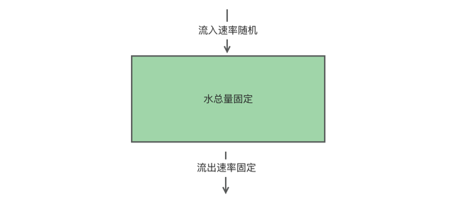
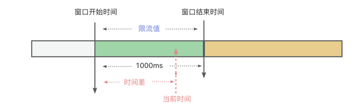
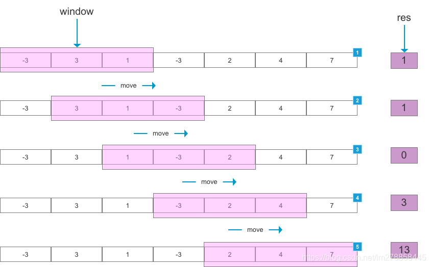
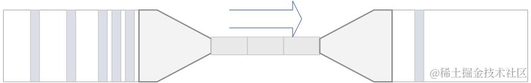

<style>
.my-code {
   color: red;
}
.orange {
   color: orange
}
.red {
   color: red
}
code {
   color: #0ABF5B;
}
</style>

# 一、限流
限流（Rate limiting）是一种通过控制**单位时间内**的**请求数量或频率**来保护系统免受过载的技术。

<!--more-->

# 二、限流的目的
- **防止资源耗尽**：避免服务器、数据库或API因突发流量崩溃。
- **保障服务质量**：确保系统在负载高峰时扔能稳定响应合法请求。
- **公平使用**：防止单一用户或客户端占用过多资源，保障其他用户权益。
- **防御攻击**：缓解DDoS攻击、暴力破解等恶意行为。


# 三、常见限流算法

| 算法     | 原理                                                      | 适用场景               |
|--------|---------------------------------------------------------|--------------------|
| 令牌桶算法  | 以固定速率向桶中添加令牌，请求需获取令牌才能通过。允许突发流量                         | 需要支持突发流量的场景（如电商秒杀） |
| 漏桶算法   | 以固定速率处理请求（如每秒10次），桶满则多余的请求被丢弃。平滑流量，但无法应对突发流量            | 需要一个限流的创建（如数据库写入）  |
| 滑动窗口算法 | 动态统计时间窗口内（多个1秒窗口组成1分钟），动态统计最近N个小窗口的总请求数，避免固定窗口的“流量突刺”问题 | 高精度限流需求（如API网关）    |
| 固定窗口计数 | 统计固定时间窗口（如1分钟）内的请求数，超时阈值则拒绝。实现简单，但存在流量突刺                | 简单场景（如接口调用限制）      |

## 3.1、令牌桶算法

```java
public class TokenBucketLimiter {
    // 上一次令牌发放时间
    public long lastTime = System.currentTimeMillis();
    // 桶的容量
    public int capacity = 2;
    // 令牌生成速度 /s
    public int rate = 2;
    // 当前令牌数量
    public AtomicInteger tokens = new AtomicInteger(0);
    ;

    //返回值说明：
    // false 没有被限制到
    // true 被限流
    public synchronized boolean isLimited(long taskId, int applyCount) {
        long now = System.currentTimeMillis();
        //时间间隔,单位为 ms
        long gap = now - lastTime;

        //计算时间段内的令牌数
        int reverse_permits = (int) (gap * rate / 1000);
        int all_permits = tokens.get() + reverse_permits;
        // 当前令牌数
        tokens.set(Math.min(capacity, all_permits));
        log.info("tokens {} capacity {} gap {} ", tokens, capacity, gap);

        if (tokens.get() < applyCount) {
            // 若拿不到令牌,则拒绝
            // log.info("被限流了.." + taskId + ", applyCount: " + applyCount);
            return true;
        } else {
            // 还有令牌，领取令牌
            tokens.getAndAdd(-applyCount);
            lastTime = now;

            // log.info("剩余令牌.." + tokens);
            return false;
        }

    }
}
```

## 3.2、漏桶算法

```java
public class LeakyBucketRateLimiter {
  private final int capacity; // 漏桶容量
  private final int rate; // 漏水速率
  private int water; // 当前水量
  private long lastLeakTime; // 上次漏水时间

  public LeakyBucketRateLimiter(int capacity, int rate) {
    this.capacity = capacity;
    this.rate = rate;
    this.water = 0;
    this.lastLeakTime = System.currentTimeMillis();
  }

  public synchronized boolean allowRequest() {
    long currentTime = System.currentTimeMillis();
    // 计算经过的时间
    long elapsedTime = currentTime - lastLeakTime;
    // 计算漏水量
    int leakedWater = (int) (elapsedTime * rate / 1000);
    // 更新上次漏水时间
    lastLeakTime = currentTime;
    // 漏桶中的水量减少
    water = Math.max(0, water - leakedWater);
    // 检查漏桶是否还有容量
    if (water < capacity) {
      // 漏桶中的水量增加
      water++;
      return true; // 请求通过限流
    } else {
      return false; // 请求被限流
    }
  }
}
```
漏桶的问题：
- 漏桶的出水速度固定，也就是请求放行速度是固定的。

## 3.3、固定窗口算法

- **固定窗口**：例如1000ms
  - **窗口开始时间**
  - **窗口结束时间** = 窗口开始时间 + 窗口时间
- 窗口限流值

```java
public class FixedWindowRateLimiter {
    private final int maxRequests;    // 窗口内最大请求数
    private final long windowMillis;  // 窗口时间（毫秒）
    private AtomicInteger counter;    // 当前窗口计数器
    private long windowStart;         // 窗口开始时间

    public FixedWindowRateLimiter(int maxRequests, long windowMillis) {
        this.maxRequests = maxRequests;
        this.windowMillis = windowMillis;
        this.counter = new AtomicInteger(0);
        this.windowStart = System.currentTimeMillis();
    }

    public synchronized boolean allowRequest() {
        long currentTime = System.currentTimeMillis();
        // 如果超过当前窗口，重置窗口
        if (currentTime - windowStart > windowMillis) {
            counter.set(0);
            windowStart = currentTime;
        }
        // 判断计数器是否超过阈值
        return counter.incrementAndGet() <= maxRequests;
    }
}
```

```java
// 使用示例：限制每秒最多10个请求
FixedWindowRateLimiter limiter = new FixedWindowRateLimiter(10, 1000);
if (limiter.allowRequest()) {
    // 处理请求
} else {
    // 拒绝请求
}
```

### 3.3.1、缺点
窗口边界可能产生流量突刺（如请求集中在前后窗口交界处）。

## 3.4、滑动窗口算法（简化版）

```java
public class SlidingWindowRateLimiter {
    private final int maxRequests;      // 窗口内最大请求数
    private final long windowMillis;    // 窗口总时间（毫秒）
    private final Queue<Long> timestamps; // 请求时间戳队列

    public SlidingWindowRateLimiter(int maxRequests, long windowMillis) {
        this.maxRequests = maxRequests;
        this.windowMillis = windowMillis;
        this.timestamps = new LinkedList<>();
    }

    public synchronized boolean allowRequest() {
        long currentTime = System.currentTimeMillis();
        // 移除窗口外的旧时间戳
        while (!timestamps.isEmpty() && 
                currentTime - timestamps.peek() > windowMillis) {
            timestamps.poll();
        }
        // 检查当前窗口内请求数
        if (timestamps.size() < maxRequests) {
            //将当前时间作为计数元素放入队列中，每请求一次就将当前时间放入。
            timestamps.offer(currentTime);
            return true;
        }
        return false;
    }
}
```


# 四、常见限流工具

## 4.1、Nginx漏桶限流

### 4.1.1、请求速率限制（limit_req_zone）
从请求参数里边，提取参数，进行限流的次数统计key。每六秒才处理一次请求,如下
```text
http {
    # 定义共享内存区域
    limit_req_zone $binary_remote_addr zone=req_limit:10m rate=10r/s;
}
```
- `$binary_remote_addr`：客户端IP的二进制形式（节省内存）
- `zone=req_limit:10m`：区域名称为req_limit，大小为10MB
- `rate=10r/s`：每秒最多处理10个请求
- 容量计算：
  - 1MB内存可存储约16000个IP的状态，因此10MB可存储约160000个IP。

### 4.1.2、连接数限制（limit_conn_zone）
```text
http {
    # 定义连接数限制区域
    limit_conn_zone $binary_remote_addr zone=conn_limit:10m;
}
```


## 4.2、Guava RateLimiter
`RateLimiter`通过动态管理令牌桶中的令牌，控制请求的通过速率。
```java
// 默认模式：SmoothBursty，每秒生成5个令牌
RateLimiter limiter = RateLimiter.create(5.0);

// 预热模式：初始速率逐渐提升到5个/秒，预热期3秒
RateLimiter warmingLimiter = RateLimiter.create(5.0, 3, TimeUnit.SECONDS);
```
两种限流模式：
- `SmoothBursty`（默认模式）
  - 令牌以**固定速率生成**，允许突发流量（令牌桶容量支持临时超额）
  - 适用于需要处理突发请求的场景（如缓存预热）
- `SmoothWarmingUp`（预热模式）
  - **初始速率较低**，逐渐提升到稳定速率（需配置`warmupPeriod`）
  - 适用于需要“冷启动”保护场景（如系统启动时避免流量突增）

获取令牌
```java
// 阻塞等待获取令牌（返回等待时间，单位秒）
double waitTime = limiter.acquire();

// 尝试立即获取令牌（非阻塞）
boolean success = limiter.tryAcquire();

// 一次获取多个令牌（支持预消费）
limiter.acquire(3); // 一次获取3个令牌
```

### 4.2.1、内部关键属性与原理

#### 4.2.1.1、SmoothBursty模式
核心属性：
- `storedPermits`：当前令牌桶中的令牌数
- `maxPermits`：最大令牌数（`maxBurstSeconds` x `stableIntervalMicros`）
- `stableIntervalMicros`：稳定速率下的令牌生成间隔（1秒/`permitsPerSecond`）。
- `nextFreeTicketMicros`：下次允许获取令牌的时间点（基于时间戳计算等待时间）

令牌生成与消费逻辑
- **令牌生成**：每隔`stableIntervalMicros` 微秒生成一个令牌，但实际通过时间差动态计算可用令牌数。
- **等待时间计算**：当请求到达时，若令牌不足，计算需等待的时间`nextFreeTicketMicros` - 当前时间，并更新 `nextFreeTicketMicros`


### 4.2.2、源码关键方法分析

#### 4.2.2.1、acquire()方法
```java
public double acquire() {
    return acquire(1);
}

public double acquire(int permits) {
    // 计算当前时间与nextFreeTicketMicros的差值，确定需等待的时间
    long now = stopwatch.now();
    double waitTime = 0.0;
    if (permits > 0) {
        // 计算允许获取令牌的时间点
        long freeTime = nextFreeTicketMicros;
        // 计算当前可用令牌数
        double permitsSinceLast = (now - lastRequestNanos) / stableIntervalNanos;
        storedPermits = Math.min(maxPermits, storedPermits + permitsSinceLast);
        // 消耗令牌并更新时间戳
        if (permits <= storedPermits) {
            storedPermits -= permits;
            waitTime = 0.0;
        } else {
            // 需要等待
            waitTime = (permits - storedPermits) * stableIntervalMicros;
        }
        nextFreeTicketMicros = freeTime + (permits * stableIntervalMicros);
        lastRequestNanos = now;
    }
    return waitTime;
}
```

#### 4.2.2.2、setRate()方法
```java
public void setRate(double permitsPerSecond) {
    doSetRate(permitsPerSecond, true /* checkPositive */);
}

private void doSetRate(double permitsPerSecond, boolean checkPositive) {
    if (checkPositive && permitsPerSecond <= 0.0) {
        throw new IllegalArgumentException("permitsPerSecond must be positive");
    }
    // 重新计算稳定间隔和最大令牌数
    stableIntervalMicros = 1_000_000.0 / permitsPerSecond;
    maxPermits = maxBurstSeconds * stableIntervalMicros;
}
```

### 4.2.3、典型应用场景
- 缓存预热与防击穿
  - 缓存未预热时，大量请求直接访问数据库导致击穿。
  - 解决方案：使用**SmoothBursty**模式，允许突发流量但限制平均速率。
```java
RateLimiter limiter = RateLimiter.create(100); // 每秒100个请求
// 在缓存未命中时，限流后访问数据库
if (!cache.containsKey(key)) {
    limiter.acquire();
    // 同步查询数据库并更新缓存
}
```
- API限流
  - 第三方API每秒请求限制（如100次/秒）
```java
RateLimiter apiLimiter = RateLimiter.create(100);
// 调用API前限流
apiLimiter.acquire();
response = callThirdPartyAPI();
```
- 预热启动
  - 系统启动时流量突增导致崩溃
```java
// 预热30秒，最终速率500次/秒
RateLimiter warmingLimiter = RateLimiter.create(500, 30, TimeUnit.SECONDS);
// 启动后请求逐步提升
warmingLimiter.acquire();
```


## 4.3、分布式限流

### 4.3.1、Sentinel

#### 4.3.1.1、核心理论基础
- 滑动窗口算法
- 令牌桶算法

#### 4.3.1.2、限流规则配置
限流模式
- QPS限流
- 并发线程数限流

#### 4.3.1.3、配置限流规则
- **通过代码配置**
```java
// 创建限流规则示例（QPS 限流）
FlowRule rule = new FlowRule("myResource"); // 资源名
rule.setCount(10);          // QPS 阈值为 10
rule.setGrade(RuleConstant.FLOW_GRADE_QPS); // QPS 模式
rule.setLimitApp("default"); // 限流应用（通常为 default）
FlowRuleManager.loadRules(Collections.singletonList(rule)); // 加载规则
```
- 通过控制台配置

使用方式：
```java
try (Entry entry = SphU.entry("myResource")) {
    // 业务逻辑
    return "Success";
} catch (BlockException e) {
    // 限流处理
    return "Blocked";
} finally {
    if (entry != null) entry.exit(); // 释放资源
}
```


### 4.3.2、Redis + LUA
优势
- **原子性**：LUA脚本在Redis中执行时为原子操作，避免并发问题。
- **高性能**：Redis的内存操作和LUA脚本的高效执行，支持高并发场景。
- **分布式支持**：通过Redis的集群模式，可实现跨节点的限流。


#### 固定窗口计数器
- 原理：统计固定时间窗口（如1秒）内的请求次数，超过阈值则拒绝请求。
- LUA脚本
```Lua
-- 固定窗口限流Lua脚本
local key = KEYS[1]
local limit = tonumber(ARGV[1])  -- 允许的最大请求数
local expire = tonumber(ARGV[2]) -- 时间窗口（秒）

local current = tonumber(redis.call('GET', key))
if current == false then
    -- 首次请求：设置计数器和过期时间
    redis.call('SET', key, 1)
    redis.call('EXPIRE', key, expire)
    return 1
else
    if current < limit then
        -- 未超限：递增计数器
        redis.call('INCR', key)
        return current + 1
    else
        -- 超限：返回0表示拒绝
        return 0
    end
end
```
`tonumber()`：将字符串转换成数字。
- Java调用示例
```java 
public boolean tryAcquire(String key, int limit, int expire) {
    String script = "..." // 上述Lua脚本内容
    Long result = (Long) redisTemplate.execute(
        new DefaultRedisScript<Long>(script, Long.class),
        Arrays.asList(key),
        String.valueOf(limit),
        String.valueOf(expire)
    );
    return result != 0;
}
```

#### 令牌桶
原理：令牌以固定速率生成，请求需消耗令牌，桶容量决定突发流量处理能力。
- Lua脚本示例
```lua
-- 令牌桶Lua脚本
local key = KEYS[1]
local rate = tonumber(ARGV[1])    -- 令牌生成速率（每秒）
local capacity = tonumber(ARGV[2])-- 桶最大容量
local now = tonumber(ARGV[3])     -- 当前时间戳（秒）
local requested = tonumber(ARGV[4])-- 需要的令牌数（通常为1）

-- 获取上次的令牌数量和时间
local last_tokens = tonumber(redis.call('GET', key) or capacity)
local last_time = tonumber(redis.call('GET', key..':time') or now)

-- 计算新增令牌数
local elapsed = now - last_time
local new_tokens = math.min(last_tokens + (elapsed * rate), capacity)

if new_tokens >= requested then
    -- 允许请求：扣除令牌并更新时间
    redis.call('SET', key, new_tokens - requested)
    redis.call('SET', key..':time', now)
    return 1
else
    return 0
end 
```
- java调用示例
```java
public boolean tryAcquireToken(String key, double rate, int capacity) {
  long now = System.currentTimeMillis() / 1000;
  String script = "..." // 上述Lua脚本内容
  Long result = (Long) redisTemplate.execute(
          new DefaultRedisScript<>(script, Long.class),
          Arrays.asList(key),
          String.valueOf(rate),
          String.valueOf(capacity),
          String.valueOf(now),
          "1"  // 请求1个令牌
  );
  return result == 1;
}
```


#### 结合AOP和自定义注解的实现
- 自定义限流注解
```java
@Retention(RetentionPolicy.RUNTIME)
@Target(ElementType.METHOD)
public @interface RedisLimit {
    String key() default "default_key"; // 限流键名
    int count() default 100;            // 每秒最大请求数
    int expire() default 60;           // 时间窗口（秒）
}
```
- AOP切面处理
```java
@Aspect
@Component
public class RateLimitAspect {
  @Resource
  private RedisTemplate<String, Object> redisTemplate;

  @Around("@annotation(redisLimit)")
  public Object doAround(ProceedingJoinPoint joinPoint, RedisLimit redisLimit) {
    String key = redisLimit.key();
    int count = redisLimit.count();
    int expire = redisLimit.expire();

    // 调用Lua脚本执行限流
    boolean allowed = tryAcquire(key, count, expire);
    if (!allowed) {
      throw new RuntimeException("请求频率过高，请稍后再试");
    }

    try {
      return joinPoint.proceed();
    } catch (Exception e) {
      throw new RuntimeException(e);
    }
  }

  // 调用固定窗口Lua脚本的方法（如上文示例）
  private boolean tryAcquire(String key, int limit, int expire) {
    // 实现与上述Lua脚本调用相同
  }
}
```


# 五、自适应限流
所谓的**自适应限流**是结合应用的 **Load、CPU 使用率、总体平均 RT、入口 QPS 和并发线程数**等几个维度的监控指标，通过自适应的流控策略，让系统的入口流量和系统的**负载**达到一个平衡，让系统尽可能跑在最大吞吐量的同时保证系统整体的稳定性。

## 5.1、实现思路
以 `Sentinel` 中的自适应限流来说，它的实现思路是用`负载（load1）`作为启动控制流量的值，而允许通过的流量由处理请求的能力，即请求的响应时间以及当前系统正在处理的请求速率来决定。

为什么要这样设计？
> 长期以来，系统**自适应保护的思路**是根据硬指标，即**系统的负载 (load1)** 来做系统过载保护。当系统负载高于某个阈值，就禁止或者减少流量的进入；当 `load` 开始好转，则恢复流量的进入。这个思路给我们带来了不可避免的两个问题：
> - **始终有延迟性**：load 是一个“果”，如果根据 load 的情况来调节流量的通过率，那么就始终有延迟性。也就意味着通过率的任何调整，都会过一段时间才能看到效果。当前通过率是使 load 恶化的一个动作，那么也至少要过 1 秒之后才能观测到；同理，如果当前通过率调整是让 load 好转的一个动作，也需要 1 秒之后才能继续调整，这样就浪费了系统的处理能力。所以我们看到的曲线，总是会有抖动。
> - **恢复慢**。想象一下这样的一个场景（真实），出现了这样一个问题，下游应用不可靠，导致应用 RT 很高，从而 load 到了一个很高的点。过了一段时间之后下游应用恢复了，应用 RT 也相应减少。这个时候，其实应该大幅度增大流量的通过率；但是由于这个时候 load 仍然很高，通过率的恢复仍然不高。

`TCP BBR` 的思想给了我们一个很大的启发。我们应该根据系统能够处理的请求，和允许进来的请求，来做平衡，而不是根据一个间接的指标（系统 load）来做限流。最终我们追求的目标是 在系统不被拖垮的情况下，提高系统的吞吐率，而不是 load 一定要到低于某个阈值。如果我们还是按照固有的思维，超过特定的 load 就禁止流量进入，系统 load 恢复就放开流量，这样做的结果是无论我们怎么调参数，调比例，都是按照果来调节因，都无法取得良好的效果。

所以，`Sentinel` 在系统自适应限流的做法是，用 `load1` 作为启动控制流量的值，而允许通过的流量由处理请求的能力，即**请求的响应时间**以及当前系统**正在处理的请求速率**来决定。

## 5.2、原理分析
先用经典图来镇楼:

我们把系统处理请求的过程想象为一个水管，到来的请求是往这个水管灌水，当系统处理顺畅的时候，请求不需要排队，直接从水管中穿过，这个请求的RT是最短的；反之，当请求堆积的时候，那么处理请求的时间则会变为：**排队时间 + 最短处理时间**。
> **推论一**：如果我们能够保证水管里的水量，能够让水顺畅的流动，则不会增加排队的请求；也就是说，这个时候的系统负载不会进一步恶化。

以 Sentinel 官方提供的自适应限流代码为例，我们可以再来了解一下它的具体使用：
```java
package com.alibaba.csp.sentinel.demo.system;

import java.util.ArrayList;
import java.util.Collections;
import java.util.List;
import java.util.concurrent.TimeUnit;
import java.util.concurrent.atomic.AtomicInteger;

import com.alibaba.csp.sentinel.util.TimeUtil;
import com.alibaba.csp.sentinel.Entry;
import com.alibaba.csp.sentinel.EntryType;
import com.alibaba.csp.sentinel.SphU;
import com.alibaba.csp.sentinel.slots.block.BlockException;
import com.alibaba.csp.sentinel.slots.system.SystemRule;
import com.alibaba.csp.sentinel.slots.system.SystemRuleManager;

public class SystemGuardDemo {
    private static AtomicInteger pass = new AtomicInteger();
    private static AtomicInteger block = new AtomicInteger();
    private static AtomicInteger total = new AtomicInteger();

    private static volatile boolean stop = false;
    private static final int threadCount = 100;

    private static int seconds = 60 + 40;

    public static void main(String[] args) throws Exception {
        // 统计线程
        tick();
        //初始化限流系统规则
        initSystemRule();
        //模拟并发
        for (int i = 0; i < threadCount; i++) {
            Thread entryThread = new Thread(new Runnable() {
                @Override
                public void run() {
                    while (true) {
                        Entry entry = null;
                        try {
                            entry = SphU.entry("methodA", EntryType.IN);
                            pass.incrementAndGet();
                            try {
                                TimeUnit.MILLISECONDS.sleep(20);
                            } catch (InterruptedException e) {
                                // ignore
                            }
                        } catch (BlockException e1) {
                            block.incrementAndGet();
                            try {
                                TimeUnit.MILLISECONDS.sleep(20);
                            } catch (InterruptedException e) {
                                // ignore
                            }
                        } catch (Exception e2) {
                            // biz exception
                        } finally {
                            total.incrementAndGet();
                            if (entry != null) {
                                entry.exit();
                            }
                        }
                    }
                }

            });
            entryThread.setName("working-thread");
            entryThread.start();
        }
    }
    
    private static void initSystemRule() {
        SystemRule rule = new SystemRule();
        // max load is 3
        rule.setHighestSystemLoad(3.0);
        // max cpu usage is 60%
        rule.setHighestCpuUsage(0.6);
        // max avg rt of all request is 10 ms
        rule.setAvgRt(10);
        // max total qps is 20
        rule.setQps(20);
        // max parallel working thread is 10
        rule.setMaxThread(10);

        SystemRuleManager.loadRules(Collections.singletonList(rule));
    }

    private static void tick() {
        Thread timer = new Thread(new TimerTask());
        timer.setName("sentinel-timer-task");
        timer.start();
    }

    static class TimerTask implements Runnable {
        @Override
        public void run() {
            System.out.println("begin to statistic!!!");
            long oldTotal = 0;
            long oldPass = 0;
            long oldBlock = 0;
            while (!stop) {
                try {
                    TimeUnit.SECONDS.sleep(1);
                } catch (InterruptedException e) {
                }
                long globalTotal = total.get();
                long oneSecondTotal = globalTotal - oldTotal;
                oldTotal = globalTotal;

                long globalPass = pass.get();
                long oneSecondPass = globalPass - oldPass;
                oldPass = globalPass;

                long globalBlock = block.get();
                long oneSecondBlock = globalBlock - oldBlock;
                oldBlock = globalBlock;

                System.out.println(seconds + ", " + TimeUtil.currentTimeMillis() + ", total:"
                    + oneSecondTotal + ", pass:"
                    + oneSecondPass + ", block:" + oneSecondBlock);
                if (seconds-- <= 0) {
                    stop = true;
                }
            }
            System.exit(0);
        }
    }
}
```


参考文章：
[限流](https://www.cnblogs.com/crazymakercircle/p/15187184.html#autoid-h2-5-4-0)
[自适应限流](https://cloud.tencent.com/developer/article/2419404)
