<style>
.my-code {
   color: red;
}
.orange {
   color: orange
}
.red {
   color: red
}
code {
   color: #0ABF5B;
}
</style>

# 一、分布式系统
分布式系统，是由多台计算机通过网络互联组成的系统，各节点通过消息传递协作完成任务。

<!--more-->

**核心特点**：
- **分布性**：节点物流上分散，逻辑上协同工作。
- **对等性**：节点地位平等，无中心控制。
- **并发性**：多个节点并行处理任务。
- **无全局时钟**：节点间时间无法严格同步。
- **故障常态性**：节点或网络故障随时可能发生。

# 二、分布式一致性算法
> 一致性算法的目的是保证在分布式系统中，多数据副本节点数据一致性。主要包含一致性Hash算法，Paxos算法，Raft算法，ZAB算法等。

## 2.1、一致性hash算法
**一致性Hash算法**是个经典算法，`Hash环`的引入是为解决`单调性(Monotonicity)`的问题；`虚拟节点`的引入是为了解决`平衡性(Balance)`问题

- **定义**：一种在分布式系统中用于**数据分布**和**负载均衡**的算法
- **目的**：解决分布式系统的数据分区问题：当分布式集群移除或者添加一个服务器时，必须尽可能小地改变已存在的服务请求与处理请求服务器之间的映射关系。
- **优点**：一致性哈希算法保证了增加或减少服务器时，数据存储的改变最少，相比传统哈希算法大大节省了数据移动的开销 【部分数据还是需要移动】


> <code class="orange">传统hash算法</code>
>
> - **算法原理**
>   - 给定一个 key，先对 key 进行哈希运算，将其除以系统中的节点数，然后将该 key 放入该节点
>   - `node_number = hash(key) % N` ，其中 N 为节点数。
> - **传统哈希取模算法的局限性**
>   - **节点减少的场景**：会导致key进行`hash(key)%N`计算得出的编号不一样，几乎所有映射关系会失败，导致大规模数据迁移，从而缓存雪崩等问题。
>   - **节点增加的场景**：和节点减少一样。


### 2.1.1、基本原理
1. **环形结构**
   一致性哈希将整个哈希值空间组织成一个虚拟的环形结构。通常使用一个固定范围的整数空间来表示哈希值，例如 `0` 到 `2^32 - 1`。
2. **节点映射**
   系统中的**每个节点**通过哈希函数计算出一个唯一的哈希值，并将其映射到环形空间上。例如，使用节点的 IP 地址、主机名或其他唯一标识作为输入，通过哈希函数计算出一个**整数哈希值**，然后将该**节点放置在环形空间的对应位置**上。
3. **数据映射**
   要存储或访问的数据对象，同样使用哈希函数计算出一个哈希值，并将其映射到环形空间上。
4. **数据分配**
   从数据对象在环形空间上的位置开始，顺时针方向查找最近的节点，将数据分配到该节点上。这样，每个数据对象都被分配到了环形空间上离它最近的节点上。

| 环形结构                              | 节点映射                              | 数据映射                              |
|-----------------------------------|-----------------------------------|-----------------------------------|
| 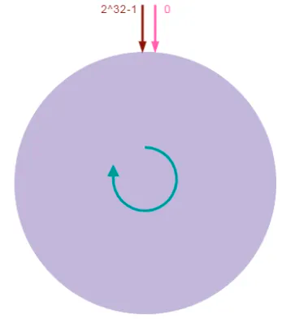 | 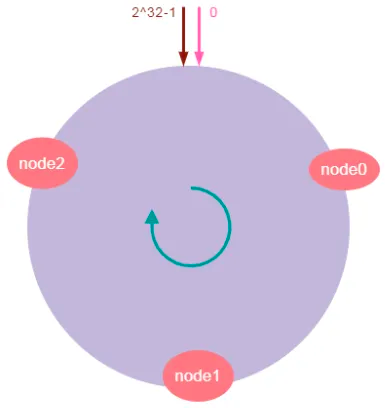 | 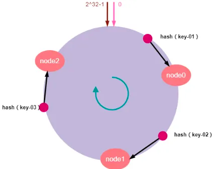 |
|| 3个节点                              |假设我们有“**key-01：张三**”、“**key-02：李四**”、“**key-03：王五**”三条缓存数据。经过哈希算法计算后，映射到哈希环上的位置如上数据映射图所示|

### 2.1.2、服务器扩容&缩容
| 扩容                                                              | 缩容                                                                 |
|-----------------------------------------------------------------|--------------------------------------------------------------------|
| 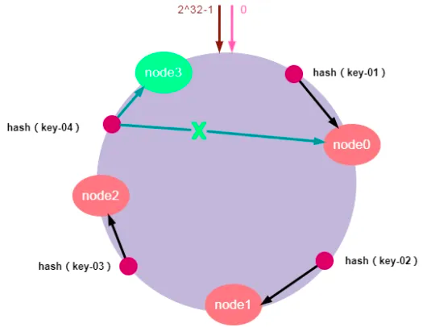		                                 | 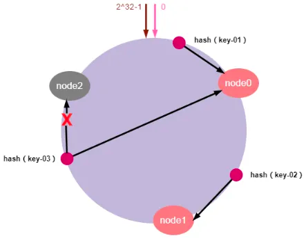                                      |
| 加入新的`node3`节点后，`key-01、key-02`不受影响，只有`key-04`的寻址被重定位到新节点`node3` | 节点`node2`发生故障时，数据`key-01`和`key-02`不会受到影响，只有`key-03`的请求被重定位到`node0` |
| 受影响的数据仅仅是会寻址到新节点和前一节点之间的数据                                      | 那么受影响的数据仅仅是会**寻址到此节点和前一节点之间的数据**。其他哈希环上的数据不会受到影响                   |


### 2.1.3、数据倾斜
前面说了一致性哈希算法的原理以及扩容缩容的问题。但是，由于哈希计算的随机性，导致一致性哈希算法存在一个致命问题：**数据倾斜**，也就是说大多数访问**请求都会集中少量几个节点**的情况。特别是节点太少情况下，容易因为节点分布不均匀造成数据访问的冷热不均。这就失去了集群和负载均衡的意义。如下图所示：
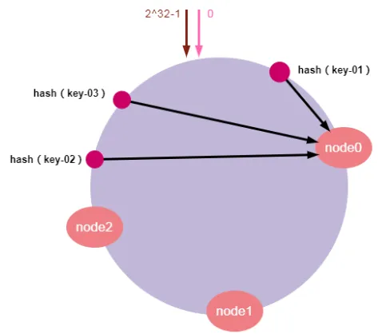
如上图所示，`key-1、key-2、key-3`可能被映射到同一个节点`node0`上。导致`node0`负载过大，而`node1`和`node2`却很空闲的情况。这有可能导致个别服务器数据和请求压力过大和崩溃，进而引起集群的崩溃。


#### 2.1.3.1、数据倾斜问题解决方案：`虚拟节点`
为了解决**数据倾斜**的问题，一致性哈希算法引入了**虚拟节点机制**，即对每一个物理服务节点映射多个虚拟节点，将这些虚拟节点计算哈希值并映射到哈希环上，当请求找到某个虚拟节点后，将被重新映射到具体的物理节点。虚拟节点越多，哈希环上的节点就越多，数据分布就越均匀，从而避免了数据倾斜的问题。
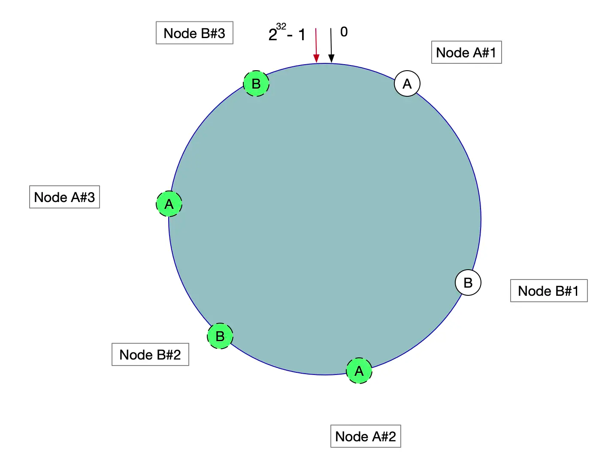
“虚拟节点”的 `hash` 计算可以采用对应节点的 `IP` 地址 + 数字后缀的方式。例如假设 `cache A` 的 IP 地址为 `202.168.14.241` 。
- 引入“虚拟节点”前，计算 `cache A` 的 hash 值： `Hash(“202.168.14.241”);`
- 引入“虚拟节点”后，计算“虚拟节”点 `cache A1` 和 `cache A2` 的 `hash` 值：
  - `Hash(“202.168.14.241#1”);` // cache A1
  - `Hash(“202.168.14.241#2”);` // cache A2

具体操作可以为服务器IP或主机名后加入编号来实现：例如虚拟节点引入5个
```text
hash(realNode1 + "&VN" + 1
hash(realNode1 + "&VN" + 2
hash(realNode1 + "&VN" + 3
hash(realNode1 + "&VN" + 4
hash(realNode1 + "&VN" + 5
```


### 2.1.4、手搓算法
- 环形结构：
  - 使用`TreeMap`实现环形结构，`private SortedMap<Long, T> circle = new TreeMap<>();`。
    - **key**：服务器hash值
    - **value**：具体的服务器地址

> TreeMap
>
> - **基于红黑树实现**：保证所有操作（增删改查）的时间复杂度为O(log n)
> - **有效性**：默认按键的自然顺序排序（如数字、字符串）
> - 重要方法`tairMap(key)`：返回一个`SortedMap`，包含原映射中所有键**大于或等于**`key`的键值对。


```java
public class ConsistentHash<T> {
    // 哈希服务，获取数据的哈希值
    private IHashService hashService;
    // 虚拟节点：每个真实节点生成多个虚拟节点，这些虚拟节点均匀分布在哈希环上
    private int numbersOfReplicas;
    // 哈希环：通过SortedMap<Long, T> 存储虚拟节点和哈希值对应的节点，键为node的哈希值，值为真实节点。
    private SortedMap<Long, T> circle = new TreeMap<>();
    //nodes：真实节点
    public ConsistentHash(IHashService hashService, int numbersOfReplicas, Collection<T> nodes) {
        this.hashService = hashService;
        this.numbersOfReplicas = numbersOfReplicas;
        for (T node : nodes) {
            addNode(node);
        }
    }
    /**
     * 添加新机器节点
     * @param node 真实节点
     */
    public void addNode(T node) {
        for (int i = 0; i < numbersOfReplicas; i++) {
            // 虚拟节点和真实节点的映射
            circle.put(this.hashService.hash(node.toString() + i), node);
        }
    }

    //获取真实节点
    public T getNode(String key) {
        if (circle.isEmpty()) {
            return null;
        }
        //获取key的hash值
        long hash = hashService.hash(key);
        //如果不存在，
        if (!circle.containsKey(hash)) {
            //获取当前hash值的最近大于节点
            SortedMap<Long, T> tailMap = circle.tailMap(hash);
            //代表是尾节点，则取第一个节点
            hash = tailMap.isEmpty() ? circle.firstKey() : tailMap.firstKey();
        }
        return circle.get(hash);
    }
}
```
测试用例：
```java
public class ConsistentMainTest {
    // 机器节点IP前缀
    private static final String IP_PREFIX = "192.168.0.";
    public static void main(String[] args) {
        // 每台真实机器节点上保存的记录条数
        Map<String, Integer> map = new HashMap<String, Integer>();
        // 真实机器节点, 模拟5台
        List<Node<String>> nodes = new ArrayList<Node<String>>();
        for (int i = 1; i <= 5; i++) {
            map.put(IP_PREFIX + i, 0); // 初始化记录
            Node<String> node = new Node<String>(IP_PREFIX + i, "node" + i);
            nodes.add(node);
        }
        
        IHashService hashService = new HashService();
        // 构建环形结构，并创建虚拟节点
        ConsistentHash<Node<String>> consistentHash = new ConsistentHash<>(hashService, 3, nodes);
        //模拟5000个数据
        for (int i = 0; i < 5000; i++) {
            String data = UUID.randomUUID().toString() + i;
            Node<String> node = consistentHash.getNode(data);
            map.put(node.getIp(), map.get(node.getIp()) + 1);
        }

        for (int i = 1; i <= 10; i++) {
            System.out.println(IP_PREFIX + i + "节点记录条数：" + map.get(IP_PREFIX + i));
        }
    }
}
```
示例如下：
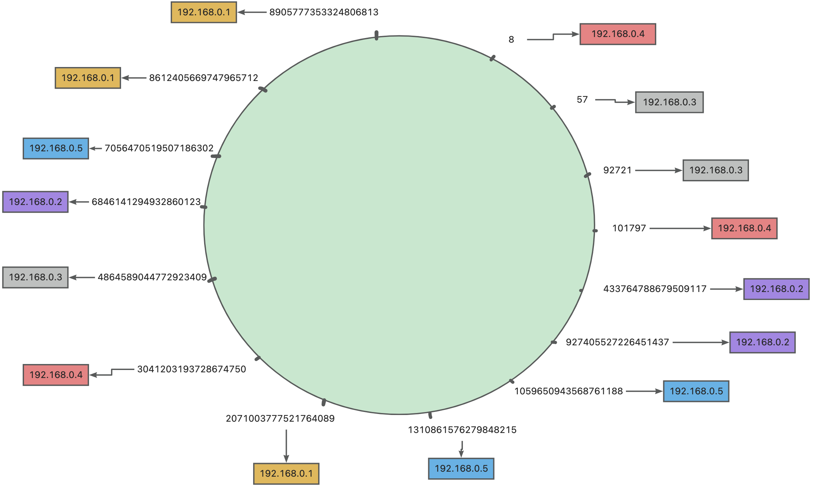


## 2.2、Basic Paxos算法
**Paxos算法**是Lamport宗师提出的一种基于消息传递的分布式一致性算法，使其获得2013年图灵奖。自`Paxos`问世以来就持续垄断了分布式一致性算法，`Paxos`这个名词几乎等同于分布式一致性, 很多分布式一致性算法都由`Paxos`演变而来
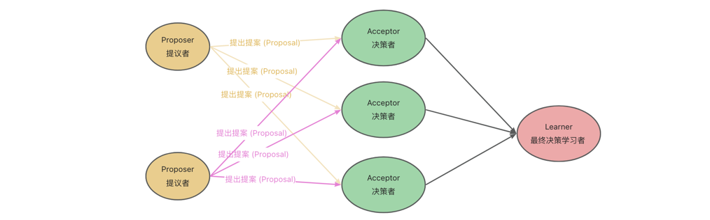
**Paxos**将系统中的角色分为<code class="red">提议者 (Proposer)</code>、<code class="red">决策者 (Acceptor)</code>和<code class="red">最终决策学习者 (Learner)</code>:
- <code class="red">提议者 (Proposer)</code>: 提出提案 (`Proposal`)。`Proposal`信息包括提案编号 (`Proposal ID`) 和提议的值 (`Value`)。
- <code class="red">决策者 (Acceptor)</code>: 参与决策，回应`Proposers`的提案。收到`Proposal`后可以接受提案，若`Proposal`获得多数`Acceptors`的接受，则称该`Proposal`被批准。
- <code class="red">最终决策学习者 (Learner)</code>: 不参与决策，从`Proposers/Acceptors`学习最新达成一致的提案(`Value`)。

### 2.2.1、三个阶段
如图所示，Paxos算法分为3个阶段
- **第一阶段**: `Prepare`阶段
- **第二阶段**: `Accept`阶段
- **第三阶段**: `Learn`阶段
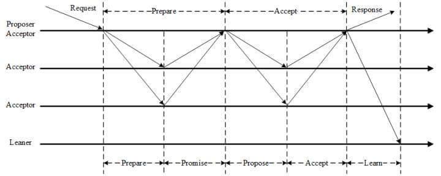

#### 2.2.1.1、第一阶段：`Prepare`阶段
<code class="red">提议者 (Proposer)</code>向<code class="red">决策者 (Acceptor)</code>发出`Prepare`请求，<code class="red">决策者 (Acceptor)</code>针对收到的`Prepare`请求进行`Promise`承诺。
- `Prepare`: <code class="red">提议者 (Proposer)</code>生成全局唯一且递增的`Proposal ID` (可使用时间戳加Server ID)，向所有<code class="red">决策者 (Acceptor)</code>发送Prepare请求，这里无需携带提案内容，只携带`Proposal ID`即可。
- `Promise`: <code class="red">决策者 (Acceptor)</code>收到`Prepare`请求后，做出“两个承诺，一个应答”。
  - **承诺1**: 不再接受`Proposal ID`小于等于(注意: 这里是<= )当前请求的`Prepare`请求;
  - **承诺2**: 不再接受`Proposal ID`小于(注意: 这里是< )当前请求的`Propose`请求;
  - **应答**: 不违背以前作出的承诺下，回复已经`Accept`过的提案中`Proposal ID`最大的那个提案的`Value`和`Proposal ID`，没有则返回空值。#

假设`客户端 1` 的提案编号是 `1`，`客户端 2` 的提案编号为 `5`，并假设`节点 A, B` 先收到来自`客户端 1` 的准备请求，`节点 C` 先收到来自`客户端 2` 的准备请求。 
客户端作为提议者，向所有的接受者发送包含提案编号的准备请求。注意在准备阶段，请求中不需要指定提议的值，只需要包含提案编号即可。
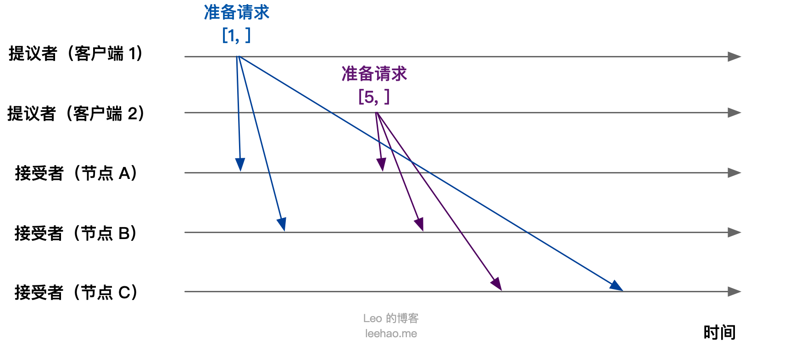
接下来，`节点 A，B` 接收到`客户端 1` 的准备请求（提案编号为 `1`），`节点 C` 接收到`客户端 2` 的准备请求（提案编号为 `5`）。
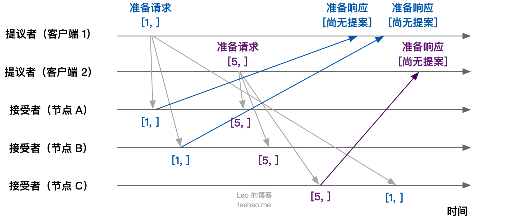
集群中各个节点在接收到第一个准备请求的处理：
- 节点 `A, B`：由于之前没有通过任何提案，所以节点 `A，B `将返回“尚无提案”的准备响应，并承诺以后不再响应提案编号小于等于 `1` 的准备请求，不会通过编号小于 `1` 的提案
- 节点 `C`：由于之前没有通过任何提案，所以节点 `C` 将返回“尚无提案”的准备响应，并承诺以后不再响应提案编号小于等于 `5` 的准备请求，不会通过编号小于 `5` 的提案

接下来，当节点 `A，B` 接收到提案编号为 `5` 的准备请求，节点 `C` 接收到提案编号为 `1` 的准备请求：
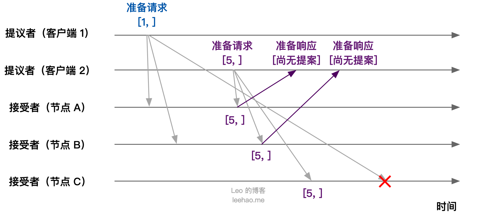
- 节点 `A, B`：由于提案编号 `5` 大于之前响应的准备请求的提案编号 `1`，且节点 `A, B` 都没有通过任何提案，故均返回“尚无提案”的响应，并承诺以后不再响应提案编号小于等于 `5` 的准备请求，不会通过编号小于 `5` 的提案
- 节点 `C`：由于节点 `C` 接收到提案编号 `1` 小于节点 `C` 之前响应的准备请求的提案编号 `5` ，所以丢弃该准备请求，不作响应


#### 2.2.1.2、第二阶段：`Accept`阶段
**客户端** `1，2` 在收到大多数节点的准备响应之后会开始**发送接受请求**。
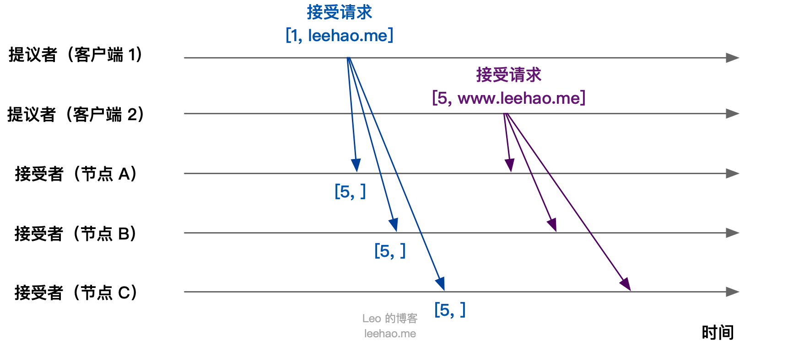
- _**节点A、B、C，三个节点承诺可以通过的最小提案编号 5**_
- **客户端 1**：客户端 1 接收到大多数的接受者（节点 A, B）的准备响应后，根据准备响应中的提案编号最大的提案的值，设置接受请求的值。由于节点 A, B 均返回“尚无提案”，即提案值为空，故客户端 1 把自己的提议值 `leehao.me` 作为提案的值，发送接受请求 `[1, "leehao.me"]`
- **客户端 2**：客户端 2 接收到大多数接受者的准备响应后，根据准备响应中的提案编号最大的提案的值，设置接受请求的值。由于节点 A, B, C 均返回“尚无提案”，即提案值为空，故客户端 2 把自己的提议值 `www.leehao.me` 作为提案的值，发送接受请求` [5, "www.leehao.me"]`


当节点 `A, B, C` 接收到客户端 `1, 2` 的接受请求时，对接受请求进行处理：
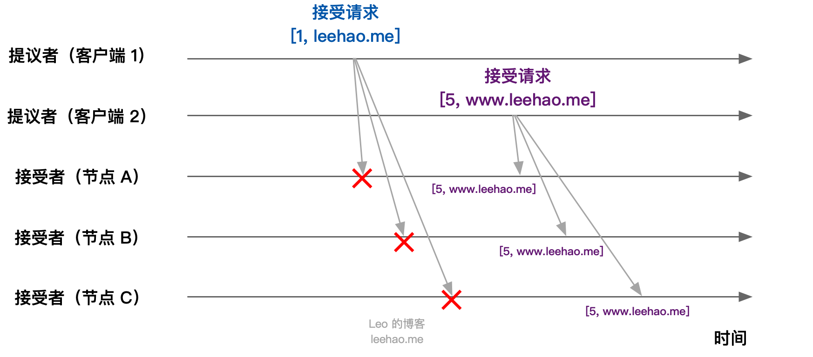
节点 `A, B, C` 接收到接受请求 `[1, "leehao.me"]` ，由于提案编号 1 小于三个节点承诺可以通过的最小提案编号 5，所以提案 `[1, "leehao.me"]` 被拒绝
节点 `A, B, C` 接收到接受请求 `[5, "www.leehao.me"]`，由于提案编号 5 不小于三个节点承诺可以通过的最小提案编号 5 ，所以通过提案 `[5, "www.leehao.me"]`，即三个节点达成共识，接受 X 的值为 `www.leehao.me`


#### 2.2.1.3、第三阶段：`Learn`阶段
<code class="red">提议者 (Proposer)</code>在收到多数<code class="red">决策者 (Acceptor)</code>的`Accept`之后，标志着本次`Accept`成功，决议形成，将形成的决议发送给所有`Learners`。

#### 2.2.1.4、三个阶段小结
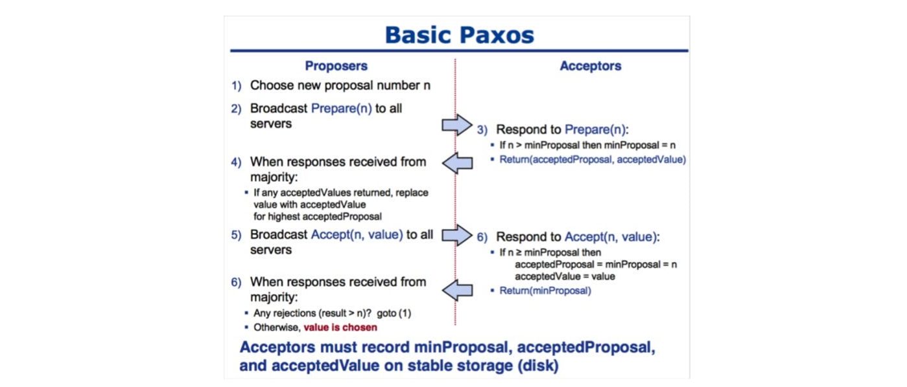

### 2.2.2、Basic Paxos算法存在的问题
活锁
> 当某<code class="red">提议者 (Proposer)</code>提交的`Proposal（提案）`被拒绝时，可能存在因为<code class="red">决策者 (Acceptor)</code>承诺返回了更大编号的`Proposal（提案）`，该<code class="red">提议者 (Proposer)</code>提高`Proposal（提案）`编号继续提交的情况。一旦出现这种情况，两个<code class="red">提议者 (Proposer)</code>都发现自己的编号过低转而提出更高编号的`Proposal（提案）`，显而易见。这会导致死循环，该现象被称为活锁。用一句通俗的话来描述活锁现象：你编号高，我再比你更高，反复如此，算法永远无法结束。

解决
> 当 <code class="red">提议者 (Proposer)</code> 接收到响应，发现支持它的 <code class="red">决策者 (Acceptor)</code> 小于半数时，不立即更新编号发起重试，而是随机延迟一小段时间，来错开彼此的冲突
可以设置一个 <code class="red">提议者 (Proposer)</code>的 Leader，集群全部由它来进行提案，等同于下文的 `Multi-Paxos` 算法。


## 2.3、Multi-Paxos算法
`Basic Paxos` 算法只能对单个值达成共识，对于多个值的情形，`Basic Paxos` 算法就不管用了。因此，`Basic Paxos` 算法几乎只是用来理论研究，并不直接应用在实际工作中。

`Lamport` 提出的 `Multi Paxos` 是一种思想，并不是算法。
`Multi Paxos` 算法则是一个统称，是指基于 `Multi Paxos` 思想，通过多个 `Basic Paxos` 实例实现一系列值的共识的算法（例如 `Raft` 算法等）。

如果直接通过多次执行 `Basic Paxos` 实例方式，来实现一系列值的共识，存在以下问题：

如果集群中多个提议者同时在准备阶段提交提案，可能会出现没有提议者接收到大多数准备响应，导致需要重新提交准备请求。例如，在一个 5 个节点的集群中，有 3 个节点同时作为提议者同时提交提案，那就会出现没有一个提议者获取大多数的准备响应，而需要重新提交
为了达成一个值的共识，需要进行 2 轮 RPC 通讯，分别是准备阶段和接受阶段，性能低下
为了解决以上问题，`Multi Paxos` 引入了领导者（`Leader`）和优化了 `Basic Paxos` 的执行过程。


## 2.4、Raft算法
`Raft` 算法是现在分布式系统开发首选的共识算法。文章 《图解 Paxos 算法》 介绍了 `Paxos` 共识算法，绝大多数选用 `Paxos` 算法的系统（比如 `Cubby`），都是在 `Raft` 算法发布前开发的，当时没得选。新系统绝大多数选择了 `Raft` 算法，例如，`Etcd`，`Consul`，等。就像作者 `Diego Ongaro` 在 `Raft` 论文 `In Search of an Understandable Consensus Algorithm` 说的，`Paxos` 太难理解了，无论是对于学生还是系统开发者来说，因此 `Diego Ongaro` 提出了易于理解和实现的 `Raft` 算法。

本文讲述 Raft 算法如何进行领导者选举。

### 2.4.1、基本概念

#### 2.4.1.1、节点状态
在 `Raft` 中，节点有以下三种状态：
- `leader`（**领导者**）：接收 `client` （客户端）的所有请求，霸道总裁，一切以我为准。领导者平常的工作包括 3 个部分：处理写请求，管理日志复制，不断发送心跳信息通知其他节点”我是领导者，我还活者，你们现在不要发起新的选举“。`Raft` 保证任何时刻只有一个 `leader`
- `follower`（**跟随者**）：相当于普通群众，被动接收和处理来自领导者的消息。当领导者心跳超时时，就主动站出来，推荐自己当选候选人
- `candidate`（**候选人**）：用于选举出一个新的 `leader`。候选人向其他节点发送投票 （`RequestVote`，参考下文 `Raft RPX` 通信的描述）`RPC` 消息，通知其他节点来投票，如果赢得子大多数选票，就升级为领导者

> 简单理解就是：老大挂了，我想当老大，推荐自己成为老大候选人，然后投票选择。

节点状态转换示意图如下图所示：
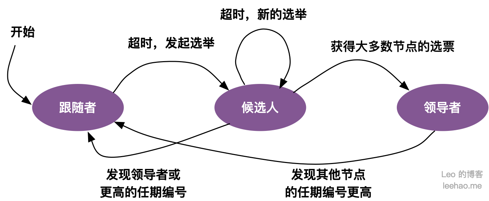

#### 2.4.1.2、任期
`Raft` 将时间划分为一个一个的任期（`term`），每一个·的开始都是`Leader`选举，每个任期由单调递增的数字（任期编号）标识，例如，`节点 A` 的任期编号为 `1`。在成功选举`Leader`之后，`Leader`会在整个`term`内管理整个集群。如果`Leader`选举失败，该`term`就会因为没有`Leader`而结束。

任期变化的示意图如下图所示：
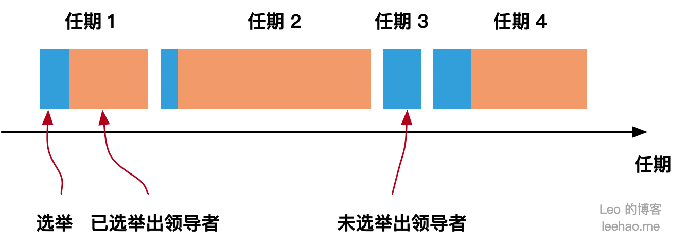
从上图可以看出，任期一般包含**两阶段**，第一阶段是**选举阶段**，第二阶段为**已选举出领导者的阶段**。但任期也可能只包含选举阶段。可以看到 `任期 3` 由于并没有成功选举出领导者（即论文所说的 `a split vote`，两个节点同时成为候选人同时发起选举，导致无法成功选出领导者），只包含了选举阶段。接下来马上进入 `任期 4`，接着进行新一轮的选举。

`Raft` 保证在一任期内，最多只有一个领导者。


### 2.4.2、Leader选举
`raft`算法学习平台[raft.github.io](https://raft.github.io/)，以可视化的方式描述`raft`算法的执行流程。

#### 2.4.2.1、初始状态
初始状态下，所有节点都是`follower（跟随者）`，但是每个节点的选举超时时间不一样，通常设置为随机值（`150-300`毫秒，为了避免多个`follower`同时超时，活锁问题）
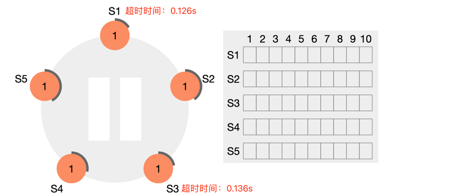
- s1节点：超时时间=126ms
- s3节点：超时时间=136ms

#### 2.4.2.2、各节点如何处理s1的投票请求？ 
- Time1
  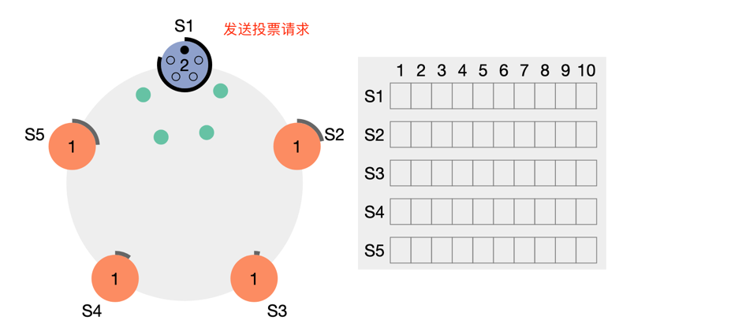
    - s1：先超时，变更成候选者，向其他所有节点先发送投票请求。
- Time2
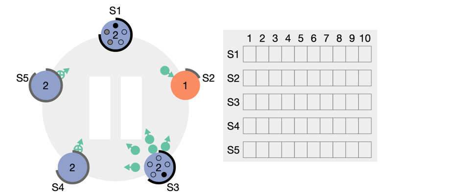
  - s2：暂时未收到请求
  - s3：超时之前未收到投票请求，变更成后候选者，向其他所有节点先发送投票请求。
  - s4：投票s1
  - s5：投票s1
- Time3
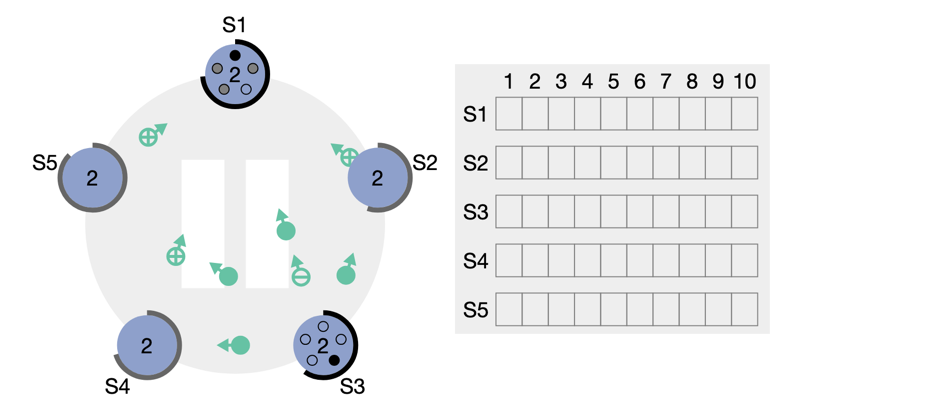
  - s2：投票s1
  - s3：因为自己是候选者，拒绝投票s1
- Time4
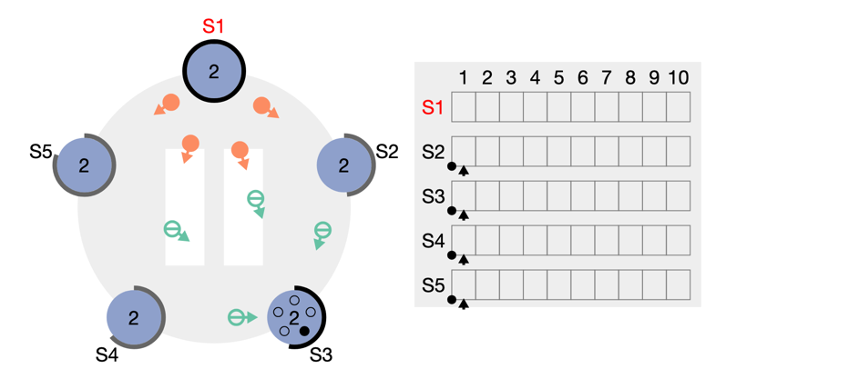
  - s1：收到大部分投票，成为Leader，同时更新自己的任期编号为 2，并向所有节点发送心跳信息。
  - s2、s4、s5：拒绝s3的投票请求
- Time5
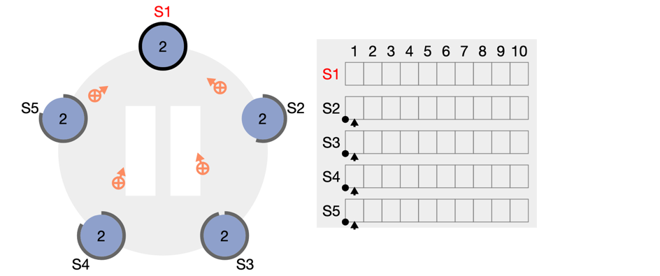
  - s3：收到心跳信息，更新自己状态成为follower，并返回心跳回应。
  - s2、s4、s5：返回心跳回应。

#### 2.4.2.3、维持心跳
接下来就是`Leader`按一定频率给所有节点发送心跳信息，通知状态。

### 2.4.3、节点通信
在 Raft，节点之间采用 RPC 进行通信，且包含两类 RPC：
- `RequestVote RPC`：**请求投票 RPC**，候选人在选举期间发起，用于通知其他节点投票
- `AppendEntries RPC`：**日志复制 RPC**，由领导者发起，用于复制日志和提供心跳消息。其中，心跳消息即为不包含日志项的日志复制 RPC 消息

### 2.4.4、超时时间
在选举中，可能会出现这种情况：在同一个任期内，多个候选人同时发起选举，选票被瓜分，导致没有一个候选人获得大多数的选票成为领导者，选举失败，即出现所谓的` a split vote`。

为了降低出现 `a split vote` 的概率，`Raft` 引入了随机超时时间的方法，把超时时间分散开来，大多数情况下只有一个节点发起选举，避免同时发起选举的情况出现。在 Raft 中，包含两种超时时间：
- `election timeout`: **选举超时时间**，跟随者等待成为候选人的超时时间，即跟随者在一段时间内没有接收到任何消息，那么它就假定集群内没有领导者，并开始新一轮的选举。选举超时时间为随机值 `150 ~ 300 ms`
- `heartbeat timeout`: **心跳超时时间**，领导者发送心跳的时间间隔，通常为`100ms`（远小于选举超时）

`Raft` 算法以领导者为中心，选举出领导者后，一切以领导者为准，以达成值的共识，实现各节点日志的一致。

### 2.4.5、日志
在 `Raft` 中，指令以日志形式存在。日志由日志项（`log entry`）构成。日志项包含日志项索引、任期编号以及指令：
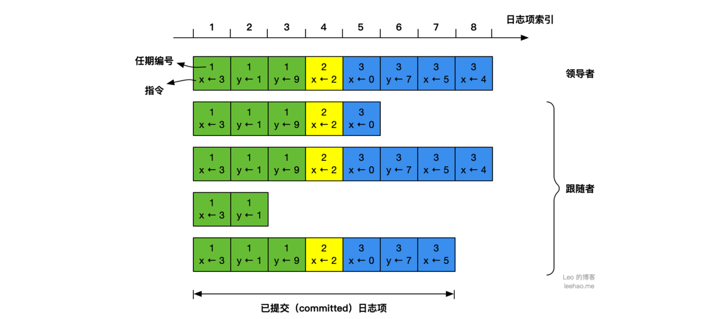
- **指令**：客户端请求状态机需要执行的命令，例如指令 `x <- 3` 表示将 `x` 变量赋值为 `3`
- **日志项索引**：日志项对应的索引值，是一个连续的、单调递增的整型号码
- **任期编号**：创建这条日志项的领导者的任期编号

#### 2.4.5.1、日志复制
领导者接收到客户端请求后，接下来会进行日志复制的操作，过程如下图所示：
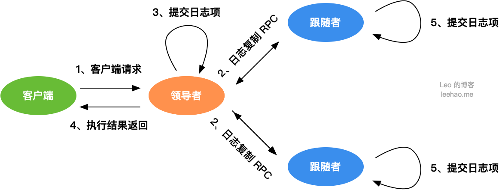
1. 客户端发送请求，领导者接收到客户端请求，根据请求中的指令，创建一个新的日志项，并附加（append）到领导者日志中
2. 领导者通过日志复制 RPC（`AppendEntries RPC`），将新的日志项复制至其他节点
3. 当领导者将日志项成功复制至集群大多数节点的时候，日志项处于 `committed` 状态，领导者可将这个日志项应用（`apply`）到自己的状态机中
4. 领导者将客户端请求结果返回给客户端
5. 当其他节点，即跟随者，接收到领导者的心跳消息，或新的日志复制消息（该消息均会附上领导者最大已提交日志项索引），如果跟随者发现领导者已提交某日志项，而自己还没将该日志项应用至状态机，那么，跟随者就将该日志项应用至自己的状态机中

### 2.4.6、脑裂问题
当网络恢复的时候,集群不再是双分区, `raft`会有如下操作：
- `leaderD`发现自己的`Term`小于`LeaderA`,会自动下台(`step down`)成为`follower`, `leaderA`保持不变依旧是集群中的`主leader`角色
- 分区中的所有节点会回滚`roll back`自己的数据日志,并匹配新`leader`的log日志,然后实现同步提交更新自身的值。通知旧`leaderA`也会主动匹配主`leader`节点的最新值,并加入到`follower`中
- 最终集群达到整体一致，集群存在唯一`leader`（节点A）

## 2.5、ZAB

### 2.5.1、ZAB和Raft的区别

|                 | raft                                                                                                                   | ZAB                                                                                                         |
|-----------------|------------------------------------------------------------------------------------------------------------------------|-------------------------------------------------------------------------------------------------------------|
| **角色**          | 角色有三种:`leader、candidate、follower`，只有选举时才会出现`candidate`           | 角色只有两种: `leader` 和 `follower`                                                                                 |
| **选举leader的方式** | 一样都是多数同意提交                                                                                                             | 一样都是多数同意提交                                                                                                  |
| **如果选举失败**      | 采用时间轮的方式重新选举，把时间划分为多个`term`，每个`term`都有一个`timeout`，是随机大小，如果`timeout`过期还没结果，会立马进行下一次选举，不会等待本轮的结果，并且每一个term编号递增(防止第三次选举接收第二次选举的结果) | 第一次选举没成功(一般都投票自己)，那后续会把选举结果发送到各个`follower`，follower根据结果重新选举(这时候各个follower会根据结果都投票server最大的那个follower成为leader) |
| **日志复制方式**      | 领导者将日志条目复制到跟随者，跟随者按照领导者的日志顺序进行应用。                                                                                      | 使用两阶段提交的方式进行日志复制。首先，领导者将事务提议广播给跟随者，跟随者进行预提交。然后，领导者在收到大多数跟随者的预提交响应后，进行事务的提交。                                 |


参考文章：
[图解 Paxos 算法](https://leehao.me/%E5%9B%BE%E8%A7%A3-Paxos-%E7%AE%97%E6%B3%95/)
[Raft 共识算法学习笔记 二：日志复制](https://leehao.me/Raft-%E5%85%B1%E8%AF%86%E7%AE%97%E6%B3%95%E5%AD%A6%E4%B9%A0%E7%AC%94%E8%AE%B0-%E4%BA%8C%EF%BC%9A%E6%97%A5%E5%BF%97%E5%A4%8D%E5%88%B6/)