<style>
.my-code {
   color: red;
}
.orange {
   color: orange
}
.red {
   color: red
}
code {
   color: #0ABF5B;
}
</style>

# 一、分布式系统
分布式系统，是由多台计算机通过网络互联组成的系统，各节点通过消息传递协作完成任务。

<!--more-->

**核心特点**：
- **分布性**：节点物流上分散，逻辑上协同工作。
- **对等性**：节点地位平等，无中心控制。
- **并发性**：多个节点并行处理任务。
- **无全局时钟**：节点间时间无法严格同步。
- **故障常态性**：节点或网络故障随时可能发生。

# 二、分布式事务
分布式事务是指在分布式系统中，跨越多个服务、数据库或节点的事务操作，需保证ACID特性（原子性、一致性、隔离性、持久性）。

# 三、分布式事务的解决方案

## 3.1、2PC（强一致性）
`2PC（Two-phase commit protocol）`，中文叫二阶段提交。
- **流程**：引入一个**事务协调者**的角色来协调管理各参与者
  - **准备阶段**：协调者询问参与者是否可提交。
  - **提交/回滚阶段**：若所有参与者同意，协调者发送提交命令；否则回滚。
- **优点**：强一致性
- **缺点**：同步阻塞、单点故障、性能低。
- **适用场景**：传统数据库集群（如XA协议）

假如在**第一阶段**所有参与者都返回准备成功，那么协调者则向所有参与者发送提交事务命令，然后等待所有事务都提交成功之后，返回事务执行成功。
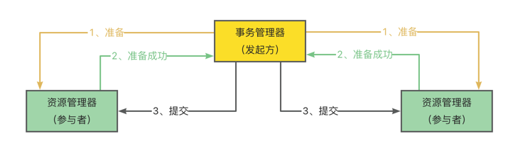

假如在**第一阶段**有一个参与者返回**失败**，那么协调者就会向所有参与者发送回滚事务的请求，即分布式事务执行失败。
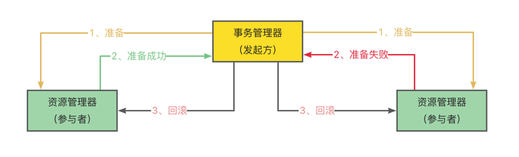

### 3.1.1、存在的问题

#### 3.2.1.1、单点故障
**协调者故障**：`2PC` 中协调者起着至关重要的作用。如果协调者出现故障，整个事务将无法进行下去。
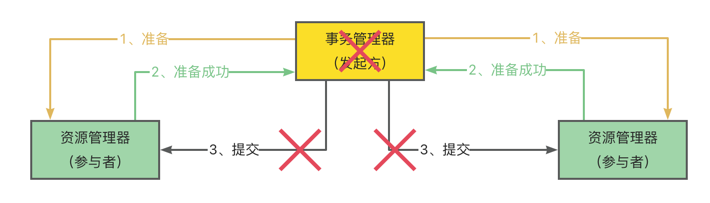
> 例如，在第一阶段完成后，协调者发生故障，参与者无法收到提交或回滚的指令，就会一直处于锁定资源的状态，直到协调者恢复或者人工干预。

#### 3.2.1.2、同步阻塞
1. **资源锁定**：在第一阶段，所有**参与事务的节点**都处于锁定资源的状态，等待协调者的指令。这意味着在事务执行过程中，这些资源无法被其他事务使用，极大地降低了系统的并发性能。
2. **长时间等待**：如果协调者出现故障或者网络延迟等问题，参与者可能会长时间处于等待状态，无法进行其他操作。这种长时间的阻塞可能会导致系统性能下降，甚至出现死锁的情况。

#### 3.2.1.3、数据不一致
在**第二阶段**中，当协调者向参与者发送提交事务请求之后，发生了局部网络异常或者在发送提交事务请求过程中协调者发生了故障，这会导致只有一部分参与者接收到了提交事务请求。而在这部分参与者接到提交事务请求之后就会执行提交事务操作。但是其他部分未接收到提交事务请求的参与者则无法提交事务。从而导致分布式系统中的数据不一致

#### 3.2.1.4、性能问题
1. **多次通信**：`2PC` 需要进行多次网络通信，包括协调者与参与者之间的请求和响应。这些通信会增加系统的开销，降低事务的执行效率。特别是在大规模分布式系统中，网络延迟和通信开销可能会更加明显。
2. **事务规模限制**：由于 `2PC` 的复杂性和性能问题，它通常不适合处理大规模的事务。对于涉及大量数据和复杂操作的事务，`2PC` 可能会导致系统性能急剧下降，甚至无法完成事务。


## 3.2、3PC（强一致性）
`3PC（Three-phase commit protocol）`是 `2PC` 的改进版，将 `2PC` 的 “提交事务请求” 过程一分为二，共形成了由`CanCommit（能否提交）`、`PreCommit（预提交）`和`doCommit（执行提交或回滚）`三个阶段组成的事务处理协议
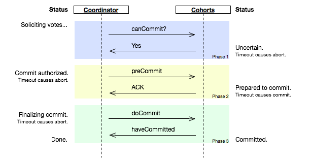

java代码示例：
```java
// 协调者（Coordinator）核心逻辑
public class Coordinator {
    private Map<String, TransactionState> transactions = new ConcurrentHashMap<>();

    // 启动事务
    public String beginTransaction(List<ParticipantProxy> participants) {
        String xid = generateXID();
        transactions.put(xid, new TransactionState(participants));
        return xid;
    }

    // 提交事务（3PC流程入口）
    public boolean commit(String xid) {
        TransactionState state = transactions.get(xid);
        if (state == null) return false;

        // CanCommit阶段：询问参与者是否可提交
        if (!canCommit(xid, state)) {
            abortTransaction(xid);
            return false;
        }

        // PreCommit阶段：预提交并锁定资源
        if (!preCommit(xid, state)) {
            abortTransaction(xid);
            return false;
        }

        // DoCommit阶段：最终提交或回滚
        return doCommit(xid, state);
    }

    // 其他方法（如回滚、超时处理等）
}

// 参与者（Participant）核心逻辑
public class Participant {
    public AckResponse handleCanCommit(String xid) {
        // 检查本地事务状态
        if (isReady()) {
            return new AckResponse(xid, AckType.YES);
        } else {
            return new AckResponse(xid, AckType.NO);
        }
    }

    public AckResponse handlePreCommit(String xid) {
        // 执行本地事务并记录日志
        try {
            executeLocalTransaction();
            return new AckResponse(xid, AckType.ACK);
        } catch (Exception e) {
            return new AckResponse(xid, AckType.ERROR);
        }
    }

    public void handleDoCommit(String xid) {
        // 提交或回滚本地事务
        if (isCommitted()) {
            commit();
        } else {
            rollback();
        }
    }
}
```

### 阶段一 CanCommit
**事务询问**：`Coordinator` 向各参与者发送 `CanCommit` 的请求，询问是否可以执行事务提交操作，并开始等待各参与者的响应；

参与者向 `Coordinator` 反馈询问的响应：参与者收到 `CanCommit` 请求后，正常情况下，如果自身认为可以顺利执行事务，那么会反馈 `Yes` 响应，并进入预备状态，否则反馈 `No`。

### 阶段二 PreCommit
**执行事务预提交**：如果 `Coordinator` 接收到各参与者反馈都是`Yes`，那么执行事务预提交：
1. **发送预提交请求**：`Coordinator` 向各参与者发送 `preCommit` 请求，并进入 `prepared` 阶段；
2. **事务预提交**：参与者接收到 `preCommit` 请求后，会执行事务操作，并将 `Undo` 和 `Redo` 信息记录到事务日记中；
3. 各参与者向 `Coordinator` **反馈事务执行的响应**：如果各参与者都成功执行了事务操作，那么反馈给协调者 `ACK` 响应，同时等待最终指令，提交 `commit` 或者终止 `abort`，结束流程；

**中断事务**：如果任何一个参与者向 `Coordinator` 反馈了 `No` 响应，或者在`等待超时`后，`Coordinator` 无法接收到所有参与者的反馈，那么就会中断事务。
1. **发送中断请求**：`Coordinator` 向所有参与者发送 `abort` 请求；
2. **中断事务**：无论是收到来自 `Coordinator` 的 `abort` 请求，还是**_等待超时_**，参与者都中断事务。

| 场景   | 场景1：都响应yes                               | 场景2：部分响应失败                              | 场景3：响应超时                                |
|------|------------------------------------------|-----------------------------------------|-----------------------------------------|
|      | 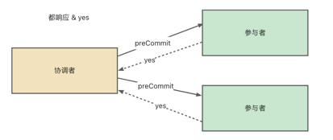 | 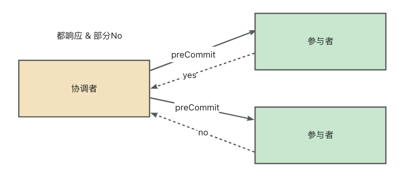 |  |
| 处理逻辑 | 写redo, undo后，进入**阶段三**                   | 中断事务，发送abort请求                          | 中断事务，发送abort请求                          |


### 阶段三 doCommit
**执行提交**
1. **发送提交请求**：假设 `Coordinator` 正常工作，接收到了所有参与者的 `ack` 响应，那么它将从预提交阶段进入提交状态，并向所有参与者发送 `doCommit` 请求；
2. **事务提交**：参与者收到 `doCommit` 请求后，正式提交事务，并在完成事务提交后释放占用的资源；
3. **反馈事务提交结果**：参与者完成事务提交后，向 `Coordinator` 发送 `ACK` 信息；
4. **完成事务**：`Coordinator` 接收到所有参与者 `ack` 信息，完成事务。

**中断事务**：假设 `Coordinator` 正常工作，并且有任一参与者反馈 `No`，或者在***等待超时***后无法接收所有参与者的反馈，都会中断事务
1. **发送中断请求**：`Coordinator` 向所有参与者节点发送 `abort` 请求；
2. **事务回滚**：参与者接收到 `abort` 请求后，利用 `undo` 日志执行事务回滚，并在完成事务回滚后释放占用的资源；
3. **反馈事务回滚结果**：参与者在完成事务回滚之后，向 `Coordinator` 发送 `ack` 信息；
4. **中断事务**：`Coordinator` 接收到所有参与者反馈的 `ack` 信息后，中断事务。


| 场景    | 场景1：都响应yes                              | 场景2：部分响应失败                             | 场景3：响应超时                               |
|-------|-----------------------------------------|----------------------------------------|----------------------------------------|
|       | 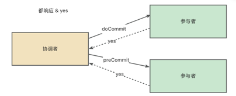 | 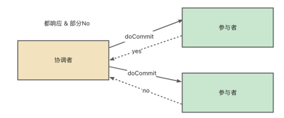 |  |
| 处理逻辑  | 事务完成                                    | 中断事务，发送abort请求                         | 中断事务，发送abort请求                         |
| 存在的问题 || 响应yes的参与者未收到abort请求，导致数据不一致            | 例如部分参与者事务执行完成，未收到abort请求，导致数据不一致       |


> 分析：3PC 虽然解决了 Coordinator 与参与者都异常情况下导致数据不一致的问题，3PC 依然带来其他问题：比如，网络分区问题，在 preCommit 消息发送后突然两个机房断开，这时候 Coordinator 所在机房会 abort, 另外剩余参与者的机房则会 commit。
> 
> 而且由于3PC 的设计过于复杂，在解决2PC 问题的同时也引入了新的问题，所以在实际上应用不是很广泛。


## 3.3、TCC
`TCC（Try-Confirm-Cancel）` 实际上是服务化的两阶段提交协议，业务开发者需要实现这**三个服务接口**：第一阶段服务由业务代码编排来调用 `Try` 接口进行资源预留，所有参与者的 `Try` 接口都成功了，事务管理器会提交事务，并调用每个参与者的 `Confirm` 接口真正提交业务操作，否则调用每个参与者的 `Cancel` 接口回滚事务。
- `T`：try阶段，预留资源。
- `C`：Confirm阶段，确认提交。
- `C`：Cancel阶段，补偿回滚。


代码示例：
```java
// 订单服务定义TCC接口
public interface OrderServiceTCC {
    // Try阶段：冻结库存、预扣款
    @TccAction(
        tryMethod = "tryCreateOrder",
        confirmMethod = "confirmCreateOrder",
        cancelMethod = "cancelCreateOrder"
    )
    boolean createOrder(OrderDTO order);
    // Try操作
    boolean tryCreateOrder(OrderDTO order);
    // Confirm操作
    boolean confirmCreateOrder(OrderDTO order);
    // Cancel操作
    boolean cancelCreateOrder(OrderDTO order);
}
// 业务实现
@Service
public class OrderServiceImpl implements OrderServiceTCC {
    @Autowired
    private InventoryClient inventoryClient;
    @Autowired
    private PaymentClient paymentClient;

    @Override
    public boolean tryCreateOrder(OrderDTO order) {
        // 冻结库存
        inventoryClient.freezeStock(order.getProductId(), order.getQuantity());
        // 预扣款
        paymentClient.preDeduct(order.getUserId(), order.getAmount());
        // 创建订单（标记为“待支付”）
        orderRepository.save(order);
        return true;
    }

    @Override
    public boolean confirmCreateOrder(OrderDTO order) {
        // 确认扣减库存
        inventoryClient.confirmStock(order.getProductId(), order.getQuantity());
        // 确认扣款
        paymentClient.confirmPayment(order.getUserId(), order.getAmount());
        // 更新订单状态为“已支付”
        order.setStatus("PAID");
        orderRepository.save(order);
        return true;
    }

    @Override
    public boolean cancelCreateOrder(OrderDTO order) {
        // 解冻库存
        inventoryClient.unfreezeStock(order.getProductId(), order.getQuantity());
        // 退回预扣款
        paymentClient.rollbackPayment(order.getUserId(), order.getAmount());
        // 删除订单
        orderRepository.delete(order);
        return true;
    }
}
```
优点
- **高可靠性**：通过分阶段操作保证数据一致性。
- **灵活性**：可定制化补充逻辑，适应复杂业务场景。
- **减少资源锁定时间**：try阶段仅预留资源，Confirm阶段才真正执行。

缺点
- **业务侵入性强**：需显示编写Try/Confirm/cancel逻辑
- **补偿逻辑复杂**：需确保Cancel操作与try完全可逆。
- **开发成本高**：需处理幂等性、超时、重试等细节。

### 3.3.1、TCC相关问题
- _**空回滚**_
  - 在没有调用 TCC 资源 Try 方法的情况下，调用了二阶段的 Cancel 方法，Cancel 方法需要识别出这是一个空回滚，然后直接返回成功。
  - **解决方法**：为了避免空回滚，可以在 Cancel 方法中判断是否已经执行了 Try 方法。如果没有执行 Try 方法，则直接返回，不进行任何操作。可以通过在数据库中记录事务的状态或者使用分布式锁等方式来实现这种判断。
- **_幂等_**
  - 定义：幂等是指同一个操作执行多次产生的效果与执行一次是相同的。在 `TCC` 模式中，由于网络异常或者服务故障等原因，可能会导致 `Try、Confirm` 或者 `Cancel` 方法被重复执行。因此，这些方法必须是幂等的，以保证事务的一致性。
  - **解决方法**：为了实现幂等性，可以在数据库中记录每个事务的执行状态，或者使用唯一的事务标识符来判断是否已经执行过某个操作。在执行 `Try`、`Confirm` 和 `Cancel` 方法时，首先检查事务的状态或者标识符，如果已经执行过，则直接返回，不进行任何操作。
- **_悬挂_**
  - 悬挂就是对于一个分布式事务，其二阶段 `Cancel` 接口比 `Try` 接口先执行。
  - 出现原因是在 `RPC` 调用分支事务try时，先注册分支事务，再执行RPC调用，如果此时 RPC 调用的网络发生拥堵，RPC 超时以后，TM就会通知RM回滚该分布式事务，可能回滚完成后，Try 的 RPC 请求才到达参与者真正执行
  - **解决方案**
    - 只需要去保证cancel接口执行完成以后，try接口不能再执行
    - **如何判断**：生成一条事务控制表，try接口执行过程中，去判断事务的执行状态，

## 3.4、本地消息表【最终一致性方案】
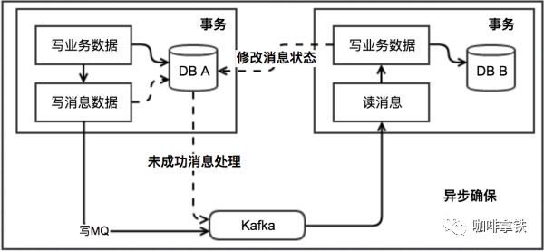
基本思路
- 消息生产方，需要额外建立一个消息表，并记录消息发送状态。消息表和业务数据要在一个事务里提交，保证了业务和发消息的原子性，要么他们全都成功，要么全都失败。然后消息会经过MQ发送到消息的消费方。如果消息发送失败，会进行重试发送。

**一些缺陷**
- 本地消息表与业务耦合在一起，难以做成通用性，不可独立伸缩。
- 本地消息表是基于数据库来做的，而数据库是要读写磁盘IO的，因此在高并发下是有性能瓶颈的

> 58dj：退款失败本地消息表，异步重试退款

## 3.5、MQ事务消息【可靠消息最终一致性方案】
**事务消息**，是一种通过消息队列实现分布式事务一致性的机制，其核心目标是确保**消息的可靠传递**与**本地事务的执行结果**之间的一致性。如下是rocketmq的事务消息：
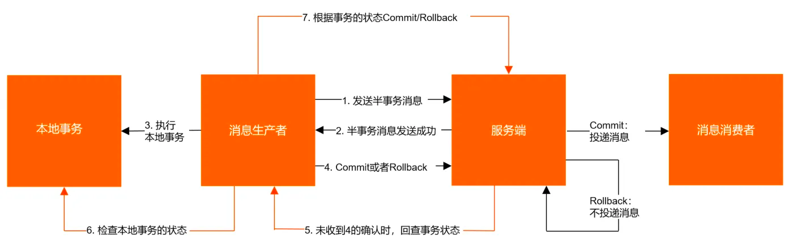
通过两阶段提交（2PC）实现分布式事务最终一致性。
- 特点：
  - 消息发送分为 `PREPARED` 和 `COMMIT` 两个阶段。
  - 支持事务状态回查机制。
- 使用场景：
  - 跨系统事务操作（如：扣减库存 + 生成订单）
  - 金融系统中的资金转账。


示例代码：
- 事务日志表
```sql
CREATE TABLE `transaction_log` (
    `id` BIGINT AUTO_INCREMENT PRIMARY KEY,
    `tx_id` VARCHAR(64) NOT NULL UNIQUE COMMENT 'RocketMQ事务ID',
    `biz_id` VARCHAR(64) NOT NULL COMMENT '订单ID',
    `status` TINYINT NOT NULL DEFAULT 0 COMMENT '0:处理中 1:成功 2:失败',
    `create_time` DATETIME NOT NULL,
    `update_time` DATETIME NOT NULL,
    UNIQUE KEY `uk_biz_id` (`biz_id`)
);
```
- 生产者
```java
// 1. 配置RocketMQ事务生产者
TransactionMQProducer producer = new TransactionMQProducer("OrderProducerGroup");
producer.setNamesrvAddr("localhost:9876");
producer.setTransactionListener(new OrderTransactionListener());
producer.start();

// 2. 发送事务消息方法
public void createOrder(OrderDTO orderDTO) {
    // (1) 创建订单（本地事务第一步）
    Order order = orderService.createOrder(orderDTO); // 返回订单ID

    // (2) 构造消息体
    Message msg = new Message("OrderTopic", "TagA", order.toJson().getBytes());
    msg.putUserProperty("biz_id", order.getOrderId());

    // (3) 发送事务消息
    producer.sendMessageInTransaction(msg, null);
}

// 3. 实现TransactionListener
class OrderTransactionListener implements TransactionListener {
    //半消息发送成功后，执行本地事务
    @Override
    public LocalTransactionState executeLocalTransaction(Message msg, Object arg) {
        try {
            // 从消息中解析订单信息
            OrderDTO orderDTO = JSON.parseObject(msg.getBody(), OrderDTO.class);

            // (1) 执行本地事务：扣减库存（假设库存服务通过API调用）
            boolean stockSuccess = stockService.reduceStock(orderDTO.getProductID(), orderDTO.getQuantity());

            // (2) 记录事务状态到事务日志表
            transactionService.logTransaction(
                msg.getTransactionId(), // RocketMQ事务ID
                orderDTO.getOrderId(), // 业务ID
                stockSuccess ? TransactionStatus.SUCCESS : TransactionStatus.FAILED
            );

            return stockSuccess ? LocalTransactionState.COMMIT_MESSAGE : LocalTransactionState.ROLLBACK_MESSAGE;
        } catch (Exception e) {
            // 异常时回滚
            return LocalTransactionState.ROLLBACK_MESSAGE;
        }
    }

    @Override
    public LocalTransactionState checkLocalTransaction(MessageExt msg) {
        // 回查时根据biz_id查询事务状态
        String bizId = msg.getUserProperty("biz_id");
        TransactionStatus status = transactionService.getStatusByBizId(bizId);
        
        if (status == TransactionStatus.SUCCESS) {
            return LocalTransactionState.COMMIT_MESSAGE;
        } else if (status == TransactionStatus.FAILED) {
            return LocalTransactionState.ROLLBACK_MESSAGE;
        } else {
            // 状态未知，可重试或超时处理
            return LocalTransactionState.UNKNOW;
        }
    }
}
```
- 消费者
```java
// 消费者配置（Spring Boot示例）
@RocketMQMessageListener(
        topic = "OrderTopic",
        consumerGroup = "StockConsumerGroup"
)
@Component
public class StockConsumer implements RocketMQListener<MessageExt> {
  @Override
  public void onMessage(MessageExt msg) {
    try {
      // 解析订单信息
      String body = new String(msg.getBody(), "UTF-8");
      OrderDTO orderDTO = JSON.parseObject(body, OrderDTO.class);

      // 执行扣减库存（幂等性设计）
      stockService.reduceStock(orderDTO.getProductID(), orderDTO.getQuantity());

      // 更新库存状态到数据库
      stockService.updateStockStatus(orderDTO.getProductID(), "DEDUCTED");
    } catch (Exception e) {
      // 消息重试或补偿
      throw new RuntimeException("库存扣减失败，消息重试");
    }
  }
}
```


## 3.6、saga模式
`Saga`是这一篇数据库论文`sagas`提到的一个方案。其核心思想是将**长事务拆分为多个本地短事务**，由**Saga事务协调器**协调，如果正常结束那就正常完成，如果某个步骤失败，则根据相反顺序一次调用补偿操作。Saga 是一种补偿协议
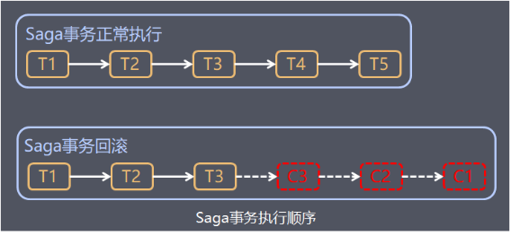
- 每个`Saga`由一系列`sub-transaction Ti`组成。每个`Ti`都有对应的补偿动作`Ci`

**saga**事务有两种恢复策略：
- **向前恢复（`forward recovery`）**，也就是“勇往直前”。对于执行不通过的事务，会尝试重试事务，这里有一个假设就是每个子事务最终都会成功。这种方式适用于必须要成功的场景。如上图的第一个流程。
- **向后恢复（`backward recovery`）**，在执行事务失败时，补偿所有已完成的事务，是“一退到底”的方式。如图2所示，下面的图例，子事务依旧从左往右执行，在执行到事务T3的时候，该事务执行失败了，于是按照红线的方向开始执行补偿事务，先执行C3、然后是C2和C1，直到T0、T1、T2的补偿事务C1、C2、C3都执行完毕。也就是回滚整个Saga的执行结果。

### 3.6.1、协调逻辑
如果在执行子事务的过程中遇到子事务对应的本地事务失败，则`Saga`会按照相反的顺序执行补偿事务。通常来说我们把这种`Saga`执行事务的顺序称为个`Saga`的协调逻辑。这种协调逻辑有两种模式，编排（`Choreography`）和控制（`Orchestration`）分别如下：
- `编排（Choreography）`：参与者（子事务）之间的调用、分配、决策和排序，通过交换事件进行进行。是一种去中心化的模式，参与者之间通过消息机制进行沟通，通过监听器的方式监听其他参与者发出的消息，从而执行后续的逻辑处理。由于没有中间协调点，靠参与靠自己进行相互协调。
- `控制（Orchestration）`：`Saga`提供一个控制类，其方便参与者之前的协调工作。事务执行的命令从控制类发起，按照逻辑顺序请求`Saga`的参与者，从参与者那里接受到反馈以后，控制类在发起向其他参与者的调用。所有`Saga`的参与者都围绕这个控制类进行沟通和协调工作。


`编排（Choreography）`示例如下：
- 由于没有中心的控制类参与参与者操作之间的协调工作，因此通过消息发送的方式进行协调。
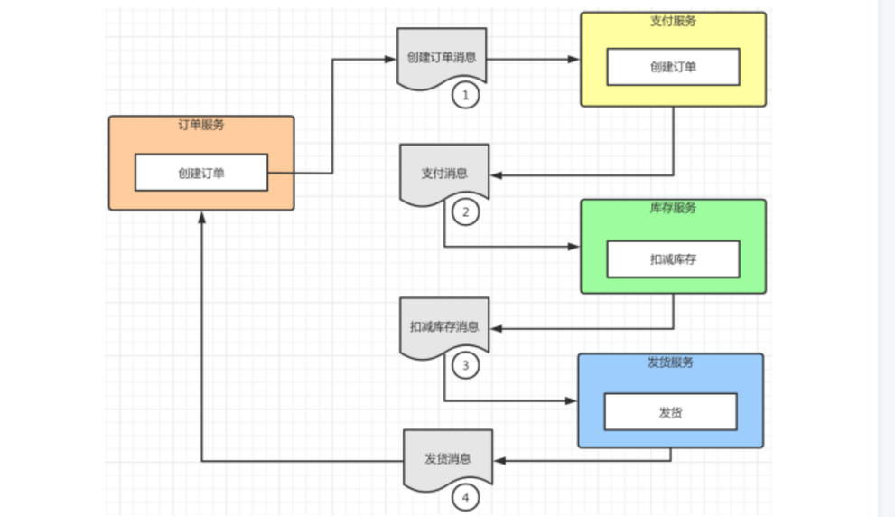
- **编排恢复**
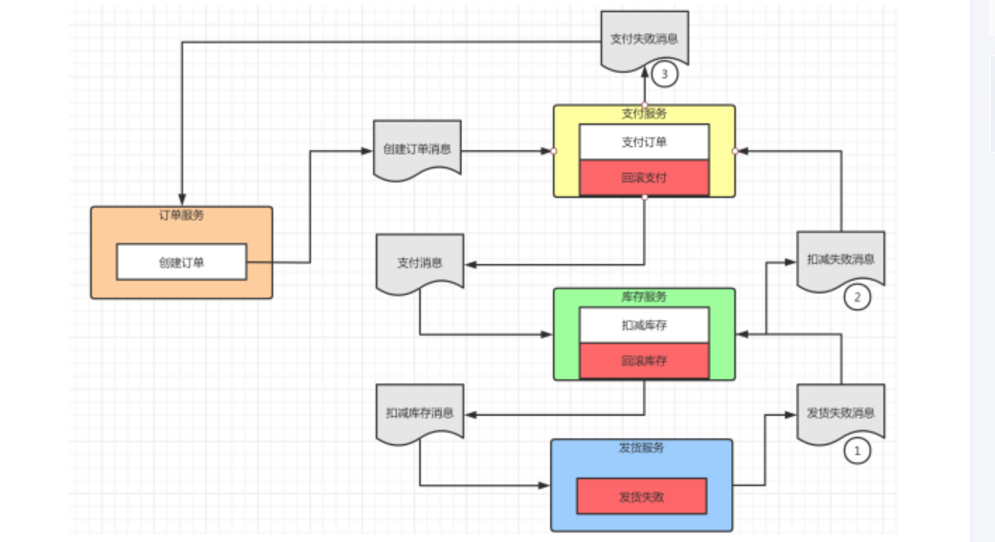
- **编排缺点**
  - 存在服务的循环依赖
  - 紧耦合风险：每个参与者执行的方法都依赖于上一步参与者发出的消息，但是上一步的参与者的所有消息都需要被订阅，才能了解参与者的真实状态，无形中增加了两个服务的耦合度。


`控制（Orchestration）`示例如下：
- 其核心是定义一个控制类，它会告诉参与者（服务）应该执行哪些操作（子事务）。 Saga控制类通过命令以及异步回复的方式与参与者进行交互。
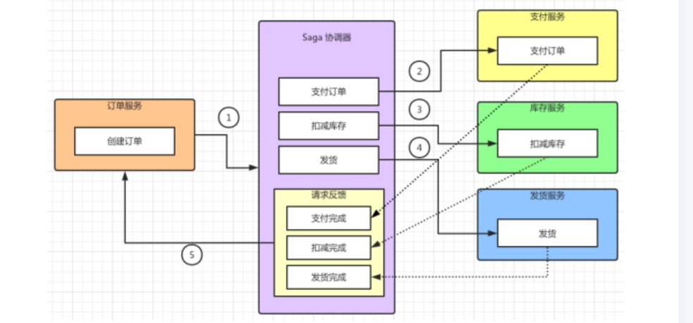
- 控制恢复
  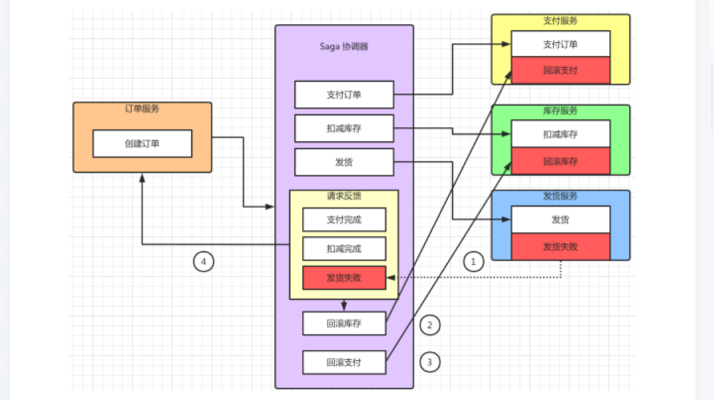


## 3.7、XA协议
`XA` 协议本就是为一个分布式事务协议，它规定了 `XA PREPARE、XA COMMIT、XA ROLLBACK` 等命令。`XA` 协议规定了**事务管理器（协调者）**和**资源管理器（数据节点）**如何交互，共同完成分布式 `2PC` 过程。
> **具体实现**：需依赖支持XA协议的数据库（如oracle、MySQL 8.0+）和事务管理器（如Bitronix、seata的XA模式）

| 维度   | XA                                      | 2PC                              |
|------|-----------------------------------------|----------------------------------|
| 定位   | 基于`2PC`的具体实现标准                            | 分布式事务的通用协议模型                     |
| 实现方式 | 通过数据库驱动和事务管理器完成两阶段提交                    | 一种理论模型，不依赖具体技术栈                  |
| 角色划分 | `TM`（事务管理器）协调全局事务，`RM`（如MySQL、Oracle）管理本地事务 | 协调者（`Coordinate`）、参与者（`participant`） |
| 应用场景 | 数据库集群、传统单体应用的事务扩展                       | 任何需要跨节点强一致性的场景                   |

- **关键结论：**
`XA`是`2PC`的工业级实现，`XA`协议依赖`2PC`的流程，但通过标准化接口（如`X/OPEN DTP(Distributed Transaction Processing)`模型）将事务管理解构，使不同数据库厂商（RM）能兼容同一套事务协调机制。


### 3.7.1、XA 事务语法介绍
xa 事务的语法如下：
- **三阶段的第一阶段**：开启 xa 事务，这里 xid 为全局事务 id：
```text
XA {START|BEGIN} xid [JOIN|RESUME]
```
- 结束 xa 事务：
```text
XA END xid [SUSPEND [FOR MIGRATE]]
```
- **三阶段的第二阶段**，即 `prepare`：
```text
XA PREPARE xid
```
- **三阶段的第三阶段**，即 `commit/rollback`：
```text
XA COMMIT xid [ONE PHASE]
XA ROLLBACK xid
```
- 查看处于 PREPARE 阶段的所有事务：
```text
XA RECOVER XA RECOVER [CONVERT XID]
```

### 3.7.2、事务协调器
MySQL 启动时，`init_server_components()` 函数按以下规则选择**事务协调器**（本文代码都取自 MySQL 8.0.21，为了方便阅读会做适当精简。下同）：
```text
tc_log = &tc_log_dummy;
if (total_ha_2pc > 1 || (1 == total_ha_2pc && opt_bin_log)) {
  if (opt_bin_log)
    tc_log = &mysql_bin_log;
  else
    tc_log = &tc_log_mmap;
}
```
1. 如果 `binlog` 开启，使用 `mysql_binlog` 事务日志
2. 否则，如果支持 `2PC` 的存储引擎多于 `1` 个，使用 `tc_log_mmap` 事务日志
3. 否则，使用 `tc_log_dummy` 事务日志，它是一个空的实现，实际上就是不记日志

而 `TC_LOG` 是这三种事务日志具体实现的基类，它定义了事务日志需要实现的接口：
```text
/** Transaction Coordinator Log */
class TC_LOG {
 public:
  virtual int open(const char *opt_name) = 0;
  virtual void close() = 0;
  virtual enum_result commit(THD *thd, bool all) = 0;
  virtual int rollback(THD *thd, bool all) = 0;
  virtual int prepare(THD *thd, bool all) = 0;
};
```
其中 `tc_log_mmap` 协调器是一个比较标准的**事务协调器**实现，它会创建一个名为 `tc.log` 的日志并使用操作系统的内存映射（`memory-map，mmap`）机制将内容映射到内存中。`tc.log` 文件中分为一个一个 `PAGE`，每个 `PAGE` 上有多个事务 `ID（xid）`，这些就是由它记录的已经确定提交的事务。
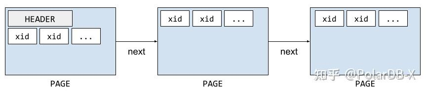
更多的时候，我们用到的都是 `mysql_bin_log` 这个基于 `binlog` 实现的事务日志：既然 `binlog` 反正都是要写的，不妨所有的 `Engine` 都统一以 `binlog` 为准，这的确是个很聪明的主意。`binlog` 中除了 `XID` 以外还包含许多的信息（比如所有的写入），但对于 `TC_LOG` 来说只要存在 `XID` 就足以胜任了。

### 3.7.3、内部 2PC 事务提交 —— 以 binlog 协调器为例
事务的提交过程入口点位于 `ha_commit_trans` 函数，事务提交的过程如下：
1. 首先调用存储引擎的 `prepare` 接口
2. 调用 `TC_LOG` 的 `commit` 接口写入事务日志
3. 调用存储引擎的 `commit` 接口
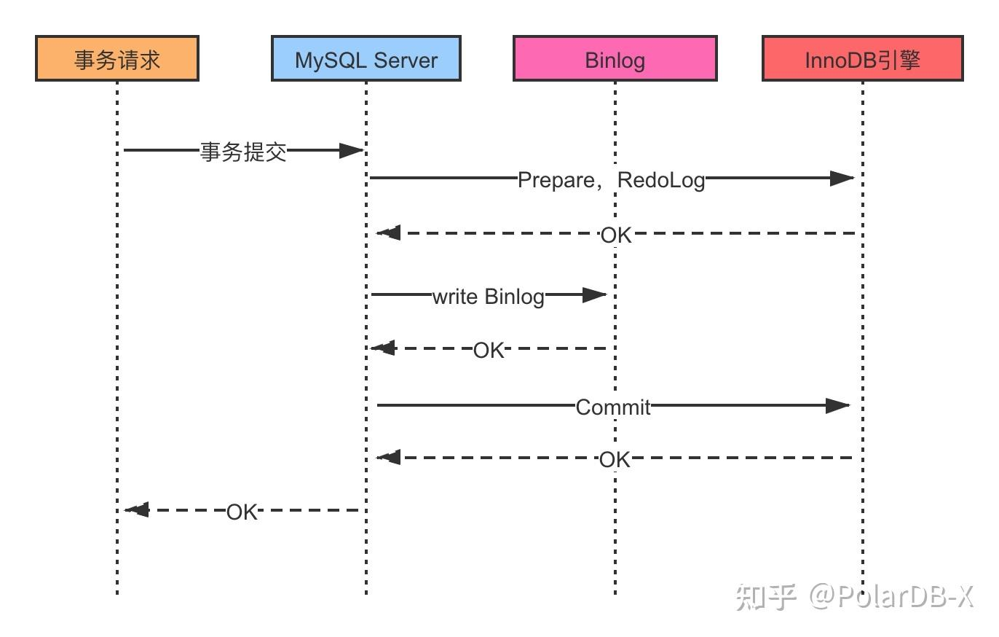

各个存储引擎会将自己的 `prepare`、`commit` 等函数注册到 `MySQL Server` 层，也就是 `handlerton` 这个结构体，注册的过程在 `ha_innodb.cc` 中：
```text
innobase_hton->commit = innobase_commit;
innobase_hton->rollback = innobase_rollback;
innobase_hton->prepare = innobase_xa_prepare;
// 省略了很多其他函数
```
- 首先是 2PC 的 prepare 阶段，trans_commit_stmt 调用 `binlog` 协调器的 `prepare` 接口，但是它什么也不会做，直接去调用存储引擎（以 `InnoDB` 为例）的 `prepare` 接口。
```text
trans_commit_stmt(THD * thd, bool ignore_global_read_lock) (sql/transaction.cc:532)
  ha_commit_trans(THD * thd, bool all, bool ignore_global_read_lock) (sql/handler.cc:1740)
    MYSQL_BIN_LOG::prepare(MYSQL_BIN_LOG * const this, THD * thd, bool all) (sql/binlog.cc:7911)
      ha_prepare_low(THD * thd, bool all) (sql/handler.cc:2320)    
        innobase_xa_prepare(handlerton * hton, THD * thd, bool prepare_trx) (storage/innobase/handler/ha_innodb.cc:19084)
```
- `2PC` 的 `commit` 阶段，`trans_commit_stmt` 调用 `binlog` 协调器的 `commit` 接口写入 `binlog`，事务日志被持久化。这一步之后，即使节点宕机，重启恢复时也会将事务恢复至已提交的状态。
```text
trans_commit_stmt(THD * thd, bool ignore_global_read_lock) (sql/transaction.cc:532)
  ha_commit_trans(THD * thd, bool all, bool ignore_global_read_lock) (sql/handler.cc:1755)
    MYSQL_BIN_LOG::commit(MYSQL_BIN_LOG * const this, THD * thd, bool all) (sql/binlog.cc:7943)
```
- 最后 `binlog` 协调器调用存储引擎的 `commit` 接口，完成事务提交：
```text
trans_commit_stmt(THD * thd, bool ignore_global_read_lock) (sql/transaction.cc:532)
  ha_commit_trans(THD * thd, bool all, bool ignore_global_read_lock) (sql/handler.cc:1755)
    MYSQL_BIN_LOG::commit(MYSQL_BIN_LOG * const this, THD * thd, bool all) (sql/binlog.cc:8171)
      MYSQL_BIN_LOG::ordered_commit(MYSQL_BIN_LOG * const this, THD * thd, bool all, bool skip_commit) (sql/binlog.cc:8924)
        MYSQL_BIN_LOG::process_commit_stage_queue(MYSQL_BIN_LOG * const this, THD * thd, THD * first) (sql/binlog.cc:8407)
          ha_commit_low(THD * thd, bool all, bool run_after_commit) (sql/handler.cc:1935)
            innobase_commit(handlerton * hton, THD * thd, bool commit_trx) (storage/innobase/handler/ha_innodb.cc:5283)
```
以上仅仅是一条更新语句执行的行为，如果是多个事物并发提交，MySQL 会通过 `group commit` 的方式优化性能，推荐这篇 《[`图解 MySQL 组提交(group commit)`](https://developer.aliyun.com/article/617776)》。


### 3.7.4、分布式 XA 事务
回到分布式事务上，我们知道 XA 协议本就是为一个分布式事务协议，它规定了 XA PREPARE、XA COMMIT、XA ROLLBACK 等命令。XA 协议规定了事务管理器（协调者）和资源管理器（数据节点）如何交互，共同完成分布式 2PC 过程。

为了验证这一点，我们执行一条 XA PREPARE 命令，可以看到果然又来到了 innobase_xa_prepare。没错，上文中 InnoDB handlerton 中的 prepare 的接口就叫 innobase_xa_prepare，名字中还带着 xa 的字样。
```text
Sql_cmd_xa_prepare::execute(Sql_cmd_xa_prepare * const this, THD * thd) (sql/xa.cc:1228)
  Sql_cmd_xa_prepare::trans_xa_prepare(Sql_cmd_xa_prepare * const this, THD * thd) (sql/xa.cc:1194)
    ha_xa_prepare(THD * thd) (sql/handler.cc:1412)
      prepare_one_ht(THD * thd, handlerton * ht) (sql/handler.cc:1345)
        innobase_xa_prepare(handlerton * hton, THD * thd, bool prepare_trx) (storage/innobase/handler/ha_innodb.cc:19084)
```
**对于存储引擎来说，外部 `XA` 还是内部 `XA` 并没有什么区别，都走的是同一条代码路径。**

那为什么之前很多人认为 `XA` 事务性能差呢？我认为主要有两个原因：
- 一是分布式本身引入的**网络代价**，例如事务协调者和存储节点往往不在同一个节点上，这必然会增加少许延迟，并引入更多的 `IO` 中断代价。
- 二是因为提交延迟增加导致事务从开始到 `commit` 之间的持有锁的时间增加了。熟悉并发编程的老手一定知道，加锁并不会让性能下降，锁竞争才是性能的最大敌人。

1. 对于原因一，很大程度上是无可避免的，我们认为这就是“分布式的代价”之一。
2. 对于原因二，其实无论是在单机还是在分布式数据库中，都应该尽可能在业务上避免锁竞争。


## 3.8、seata框架
`seata`(`simple extensible autonomous transaction architecture`)是一个分布式事务框架（整合多种模式，包括`AT、TCC、SAGA、XA` 四种模式），是分布式事务的工程化解决方案。

### 3.8.1、Seata 产品模块
`Seata` 中有三大模块，分别是 `TM`、`RM` 和 `TC`。 其中 `TM` 和 `RM` 是作为 `Seata` 的客户端与业务系统集成在一起，`TC` 作为 `Seata` 的服务端独立部署。
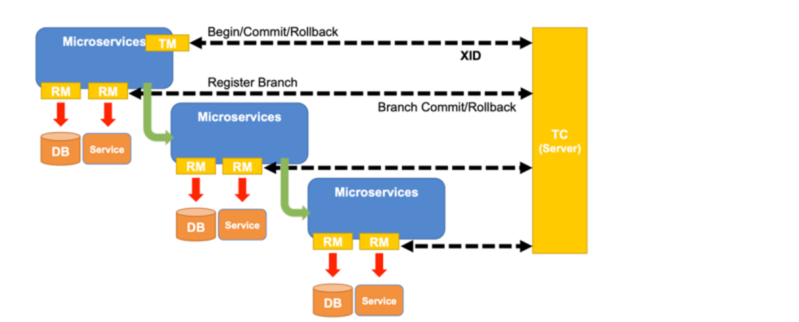
在 `Seata` 中，分布式事务的执行流程：
- `TM` 开启分布式事务（`TM` 向 `TC` 注册全局事务记录）；
- 按业务场景，编排数据库、服务等事务内资源（`RM` 向 `TC` 汇报资源准备状态 ）；
- `TM` 结束分布式事务，事务一阶段结束（`TM` 通知 `TC` 提交/回滚分布式事务）；
- `TC` 汇总事务信息，决定分布式事务是提交还是回滚；
- `TC` 通知所有 `RM` 提交/回滚 资源，事务二阶段结束；

|      | TM                         | RM                        | TC                                |
|------|----------------------------|---------------------------|-----------------------------------|
| 名称   | `transaction manager`（事务管理器） | `resource manager`（资源管理器）   | `transaction Coordinate`（事务协调器）     |
| 功能   | 定义全局事务的边界，控制提交/回滚          | 管理本地资源，记录undo日志，响应TC的指令执行 | 维护全局事务状态（初始化、提交、回滚），协调各分支事务的提交/回滚 |
| 部署方式 | 与业务系统集成在一起                 | 与业务系统集成在一起                | 服务端独立部署                           |

如下示例：
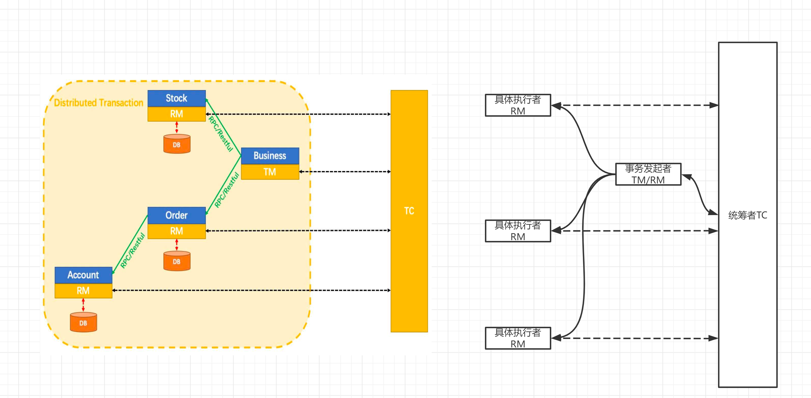
例如`Business`(下单系统)作为事务发起者`TM`发起事务，订单、库存、账户作为`RM`参与事务。

### 3.8.2、AT 模式
AT 模式是一种无侵入的分布式事务解决方案。在 `AT` 模式下，用户只需关注自己的“业务 SQL”，用户的 “业务 SQL” 作为一阶段，`Seata` 框架会自动生成事务的二阶段提交和回滚操作。

- **一阶段**：
在一阶段，`Seata` 会拦截“业务 SQL”，首先解析 `SQL` 语义，找到“业务 SQL”要更新的业务数据，在业务数据被更新前，将其保存成“`before image`”，然后执行“业务 SQL”更新业务数据，在业务数据更新之后，再将其保存成“`after image`”，最后生成行锁。以上操作全部在一个数据库事务内完成，这样保证了一阶段操作的原子性。
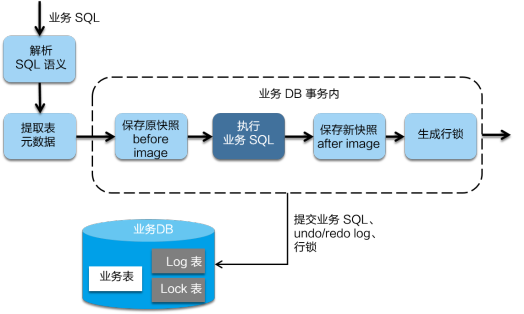
- **二阶段提交**：
二阶段如果是提交的话，因为“业务 SQL”在一阶段已经提交至数据库， 所以 `Seata` 框架只需将一阶段保存的快照数据和行锁删掉，完成数据清理即可。
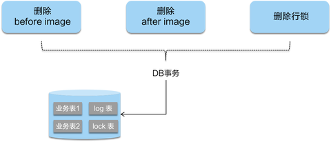
- **二阶段回滚**：
二阶段如果是回滚的话，`Seata` 就需要回滚一阶段已经执行的“业务 SQL”，还原业务数据。回滚方式便是用“`before image`”还原业务数据；但在还原前要首先要校验脏写，对比“数据库当前业务数据”和 “`after image`”，如果两份数据完全一致就说明没有脏写，可以还原业务数据，如果不一致就说明有脏写，出现脏写就需要转人工处理。
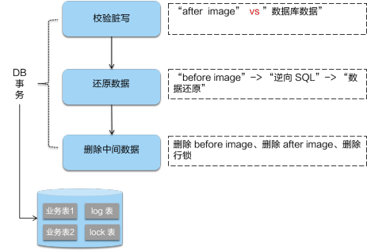

`AT` 模式的一阶段、二阶段提交和回滚均由 `Seata` 框架自动生成，用户只需编写“业务 SQL”，便能轻松接入分布式事务，`AT` 模式是一种对业务无任何侵入的分布式事务解决方案。


### 3.8.3、TCC 模式
TCC 三个方法描述：
- `Try`：资源的检测和预留；
- `Confirm`：执行的业务操作提交；要求 `Try` 成功 `Confirm` 一定要能成功；
- `Cancel`：预留资源释放；

以“扣钱”场景为例，在接入 `TCC` 前，对 `A` 账户的扣钱，只需一条更新账户余额的 `SQL` 便能完成；但是在接入 `TCC` 之后，用户就需要考虑如何将原来一步就能完成的扣钱操作，拆成**两阶段**，实现成三个方法，并且保证一阶段 `Try` 成功的话 二阶段 `Confirm` 一定能成功。
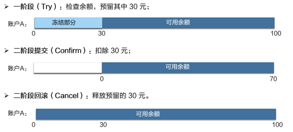


参考文章：
[无处不在的 MySQL XA 事务](https://zhuanlan.zhihu.com/p/372300181)
[10分钟说透Saga分布式事务](https://cloud.tencent.com/developer/article/1839642)
[分布式事务 Seata 及其三种模式详解](https://seata.apache.org/zh-cn/blog/seata-at-tcc-saga/)