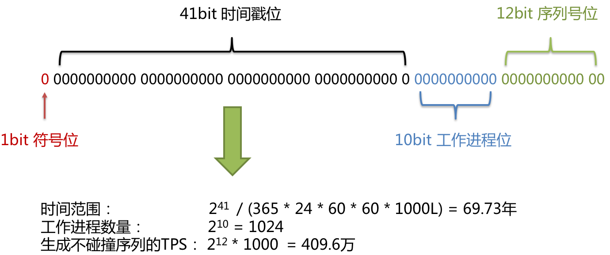
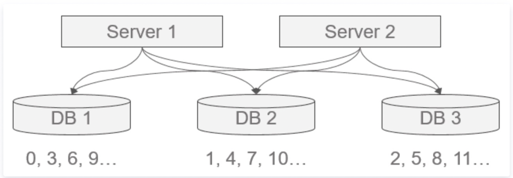
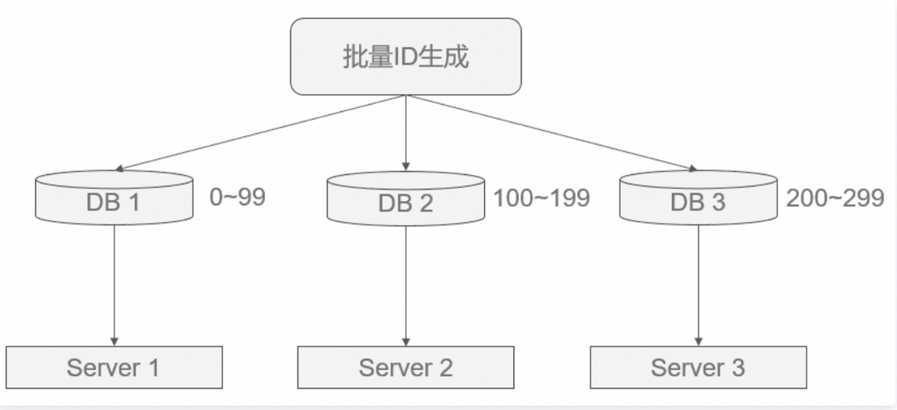

<style>
.my-code {
   color: red;
}
.orange {
   color: orange
}
.red {
   color: red
}
code {
   color: #0ABF5B;
}
</style>

# 一、分布式主键
在分布式系统中，分布式主键的设计是实现**数据分片（如分库分表）**和**高并发**写入的核心基础，需满足全局唯一、有序性、高性能等要求。

<!--more-->

分布式主键的核心挑战

| 挑战   | 描述                            |
|------|-------------------------------|
| 全局唯一 | 跨多个数据库、服务生成的ID不能重复            |
| 有序性  | 主键趋势递增（如时间有序），避免数据库页分裂，提升写入性能 |
| 高性能  | 支持每秒数十万设置上百万级的ID生成，无单点瓶颈      |
| 容灾性  | 生成服务需高可用，避免因节点宕机导致系统不可用       |
| 扩展性  | 适应业务增长，支持动态扩容（如新增分片）          |

# 二、分布式ID生成器

## 2.1、Snowflake算法（64位Long型ID）
结构

```text
0 | 41位时间戳（毫秒） | 10位机器ID | 12位序列号
```
特点
- **符号位**：1位，固定为0，保证ID为正数。
- **高性能**：单机每秒可生成约`409.6`万个ID（同一毫秒内序列上限为 `2 ^ 12 = 4096`条，如果超过，会等到下个毫秒继续生成）
- **趋势递增**：基于时间戳有序，适合`innodb`的聚簇索引。

存在的问题
**时间回拨问题**：由于机器的时间是动态的调整的，有可能会出现时间跑到之前几毫秒，如果这个时候获取到了这种时间，则会出现数据重复
**机器id分配及回收问题**：目前机器id需要每台机器不一样，这样的方式分配需要有方案进行处理，同时也要考虑，如果改机器宕机了，对应的`workerId`分配后的回收问题
**机器id上限**：机器id是固定的bit，那么也就是对应的机器个数是有上限的，在有些业务场景下，需要所有机器共享同一个业务空间，那么10bit表示的`1024`台机器是不够的。

### 2.1.1、代码实现
```java
public class SnowflakeIdGenerator {
    // 起始时间（2021-01-01 00:00:00 UTC）
    private static final long START_TIMESTAMP = 1609459200000L;
    // 机器ID位数（10位）
    private static final long MACHINE_BITS = 10L;
    // 序列号位数（12位）
    private static final long SEQUENCE_BITS = 12L;

    private final long machineId;  // 机器ID（0~1023）
    private long lastTimestamp = -1L;  // 上次生成时间
    private long sequence = 0L;       // 序列号

    public SnowflakeIdGenerator(long machineId) {
        if (machineId < 0 || machineId >= (1 << MACHINE_BITS)) {
            throw new IllegalArgumentException("机器ID超出范围");
        }
        this.machineId = machineId;
    }

    public synchronized long nextId() {
        long timestamp = System.currentTimeMillis();
        // 处理时钟回拨
        if (timestamp < lastTimestamp) {
            throw new RuntimeException("时钟回拨，拒绝生成ID");
        }
        // 同一毫秒内递增序列号
        if (timestamp == lastTimestamp) {
            sequence = (sequence + 1) & ((1 << SEQUENCE_BITS) - 1);
            if (sequence == 0) {  // 当前毫秒序列号耗尽，等待下一毫秒
                timestamp = waitNextMillis(lastTimestamp);
            }
        } else {
            sequence = 0L;  // 新毫秒重置序列号
        }
        lastTimestamp = timestamp;
        // 组合各部分生成ID
        return ((timestamp - START_TIMESTAMP) << (MACHINE_BITS + SEQUENCE_BITS))
                | (machineId << SEQUENCE_BITS)
                | sequence;
    }

    //短暂回拨（毫秒级）：等待时钟追平后继续生成
    private long waitNextMillis(long lastTimestamp) {
        long timestamp = System.currentTimeMillis();
        while (timestamp <= lastTimestamp) {
            timestamp = System.currentTimeMillis();
        }
        return timestamp;
    }
}
```

### 2.1.1、时钟回拨问题
**出现原因**：
> - **原因1**：我们的硬件时钟可能会因为各种原因变得不准（ 快了 或 慢了 ），此时就需要 `ntp` 服务来做时间校准，做校准的时候就会发生服务器时钟的 **跳跃** 或者 **回拨** 的问题。（互联网中有一种网络时间协议 `ntp` 全称 (`Network Time Protocol`) ，专门用来同步、校准网络中各个计算机的时间。这就是为什么，我们的手机现在不用手动校对时间，可每个人的手机时间还都是一样的。）
> - **原因2**：人为调整导致时间倒退。

如何解决？
- 短暂回拨：
  - **方案一**：采用直接抛异常方式（这种很不友好，太粗暴）
  - **方案二**：采用等待跟上次时间的一段范围（这种算是简单解决，可以接受，但是如果等待一段时间后再出现回拨，则抛异常，可接受，但是不算彻底解决）
- 严重回拨：
  - 记录最后一次生成时间戳至持久化存储（数据库、本地文件）。
  - 触发告警，人工介入处理，从持久化存储恢复时间戳并继续生成。


### 2.1.2、机器ID分配问题
动态分配：
- **Zookeeper**：节点启动时注册临时节点，自动分配唯一ID。
- **数据库**：维护机器ID分配表，节点启动时申请并续租。

### 2.1.3、机器id上限问题
该问题在业内都没有处理，也就是说如果采用雪花算法，则必定会存在该问题，但是该问题也只有需要大量的业务机器共享的场景才会出现，这种情况，采用客户端双`Buffer+DB`这种非雪花算法的方案也未尝不可（[参考文章](https://cloud.tencent.com/developer/news/678423)）。


## 2.2、UUID
1. 生成规则：
  * 基于时间戳&时钟序列生成
  * 基于名字空间/名字的散列值 (`MD5/SHA1`) 生成
  * 基于随机数生成
2. 优点
  * 无需网络，单机自行生成
  * 速度快，QPS高（支持`100ns`级并发）
  * 使用简单
  * 不会泄漏商业机密
3. 缺点
  * 可读性差
  * 占用空间太多(16个字节)
  * 影响数据库的性能,


## 2.3、数据库
数据库**自增ID**可能是大家最熟悉的一种唯一ID生成方式，其具有使用简单，满足基本需求，天然有序的优点，但也有缺陷：
- 并发性不好
- 数据库写压力大
- 数据库故障后不可使用
- 存在数量泄露风险

因此这里给出两种优化方案。

### 2.3.1、数据库水平拆分，设置不同的初始值和相同的步长

如图所示，可保证每台数据库生成的ID是不冲突的，但这种固定步长的方式也会带来扩容的问题，很容易想到当扩容时会出现无ID初始值可分的窘境，解决方案有：
- 根据扩容考虑决定步长
- 增加其他位标记区分扩容

这其实都是在需求与方案间的权衡，根据需求来选择最适合的方式。

### 2.3.2、号段模式（Segment）批量生成一批ID
如果要使用单台机器做ID生成，避免固定步长带来的扩容问题，可以每次批量生成一批ID给不同的机器去慢慢消费，这样数据库的压力也会减小到N分之一，且故障后可坚持一段时间。

如图所示，但这种做法的缺点是服务器重启、单点故障会造成ID不连续。
> 阿里内部很多系统采用批量生成的方式。

数据库表设计
```sql
CREATE TABLE id_segment (
    biz_tag VARCHAR(128) PRIMARY KEY COMMENT '业务标识（如order、user）',
    max_id BIGINT NOT NULL COMMENT '当前最大ID',
    step INT NOT NULL COMMENT '号段步长（如1000）',
    description VARCHAR(256) COMMENT '业务描述',
    update_time DATETIME NOT NULL COMMENT '更新时间'
);
```

## 2.4、Redis
基于Redis的原子自增（INCR命令）
```bash
127.0.0.1:6379> set seq_id 1     // 初始化自增ID为1
OK
127.0.0.1:6379> incr seq_id      // 增加1，并返回递增后的数值
(integer) 2
```

Java示例：
```java
import redis.clients.jedis.Jedis;

public class RedisIdGenerator {
    private Jedis jedis;

    public RedisIdGenerator(String host, int port) {
        this.jedis = new Jedis(host, port);
    }

    public long generateId(String key) {
        return jedis.incr(key);
    }
}
```
缺点：
- 单点故障：Redis宕机后需要依赖持久化（AOF、RDB）恢复。
- 扩容限制：单个键无法支持超大规模ID（如超过Long.MAX_VALUE）

### 2.4.1、redisson的RIdGenerator
原理：
- `redisson`提供了一个分布式ID生成器`RIdGenerator`，通过**批量获取ID**并缓存到本地，减少`Redis`访问次数。
- `tryInit(initialValue, cacheSize)`：初始化时从`Redis`获取初始化值，并缓存`cacheSize`个ID到本地。

代码示例
```java
import org.redisson.Redisson;
import org.redisson.api.RIdGenerator;
import org.redisson.api.RedissonClient;
import org.redisson.config.Config;

@Component
public class RedissonIdGenerator {
    private RIdGenerator generator;

    @PostConstruct
    public void init() {
        Config config = new Config();
        config.useSingleServer().setAddress("redis://127.0.0.1:6379");
        RedissonClient redisson = Redisson.create(config);
        generator = redisson.getIdGenerator("my_id");
        // 初始值为1，缓存1000个ID
        generator.tryInit(1, 1000);
    }

    public long nextId() {
        return generator.nextId();
    }
}
```


# 三、订单ID生成示例
订单ID为Long类型，Long类型64位，设计如下：

| 时间戳 | 服务器 | 用户基因 | 序号 |
|-----|-----|------|----|
| 42位 | 8位  | 9位   | 5位 |

```java
public static long getOrderIdByUid(long uid){
        IdGenerator generator = new IdGenerator("clusterName");
        long dbShardinguid = uid >> 22;//uid 右移22位，去除掉雪花算法后22位，得到毫秒数
        long orderId =  prefixNum + generator.nextId(dbShardinguid);
        return orderId;
    }

    public synchronized long nextId(long dbShardingId){
        if (dbShardingId < 0L) {
            throw new IllegalArgumentException(String.format("生成数据库分库Id非法,必须是正整数"));
        } else {
            long dbFlagBit = dbShardingId & 0b111111111;//提取低9位，降低碰撞冲突概率
            long timeStamp = this.timeGen();//获取当前时间戳
            if (timeStamp < this.lastTimeStamp) {
                throw new RuntimeException(String.format("服务器时间被修改滞后，滞后时间%d", this.lastTimeStamp - timeStamp));
            } else {
                if (timeStamp == this.lastTimeStamp) {
                    if (this.sequenceLoop >= this.sequenceLoopMax) {
                        timeStamp = this.tilNextMills(timeStamp);//等待下一个毫秒
                        this.sequenceLoop = 0;//重置序列号
                    } else {
                        ++this.sequenceLoop;//序列化递增
                    }
                } else {
                    this.sequenceLoop = 0;//重置序列号
                }

                this.sequence &= 31L;//序列号限制在5位
                this.lastTimeStamp = timeStamp;//更新上次时间戳
                // 时间戳 | 服务器 | 用户基因 | 序号 |
                // 42位  | 8位    | 9位     | 5位
                // 序号=5，所以用户基因需要 << 5
                // 9+5=14，所以服务器需要 << 14
                // 9+5+8=22， 所以时间戳 << 22
                return (timeStamp - 1577808000000L) << 22 | this.serverId << 14 | dbFlagBit << 5 | this.sequence++;
            }
        }
    }
```
示例订单：`8703573522638764352`

