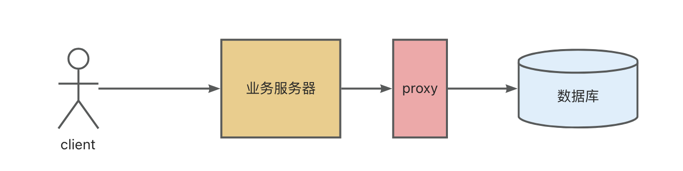

<style>
.orange {
   color: orange
}
.red {
   color: red
}
code {
   color: #0ABF5B;
}
</style>

# 一、分库分表
**分库分表**，是将单个数据库或单张表的数据拆分到多个数据库或表中的技术手段，目的是解决**海量数据**和**高并发场景**下的性能瓶颈。

<!--more-->

## 1.1、核心目标：
- **提升性能**：减少单个数据库或表的访问压力。
- **扩展性**：支持数据量的线性扩展。
- **高可用性**：避免单点故障，增加容错性。
- **负载均衡**：分散热点数据的访问压力。


## 1.2、分库分表常见拆分方式
- **垂直拆分**
  - **垂直分库**：按业务模块拆分库（如用户、订单、商品）
  - **垂直分表**：将大表按字典冷热拆分（如用户表拆分为`user_base`和`user_detail`）
- **水平拆分**
  - **水平分库**：将同一表的数据按规则分布到不同数据库实例。
  - **水平分表**：将同一表的数据按规则分布到同一库的不同物理表（如`order_0`, `order_1`）

## 1.3、分片策略（路由规则）
- **哈希取模**：`分片键 % 分片数`，简单但扩容复杂（如用户ID取模）
- **范围分片**：按时间或ID区间分片（如每月一张表），易冷热不均
- **一致性哈希**：减少扩容时数据迁移量
- **地理位置**：按用户地域路由到就近数据库。


## 1.4、分库分表的挑战
- **跨库join**：需业务层聚合或冗余数据（如ES辅助查询）。
- **分布式事务**：需使用`Seata、TCC、Saga` 等方案保证一致性。
- **全局唯一ID**：雪花是算法（`snowflake`）、`UUID`、数据库分段分配）
- **分页排序**：需多分片查询后归并，性能较差。
- **扩容迁移**：动态扩缩容需数据再平衡（如双写迁移）


## 1.5、常见中间件与工具
- `shardingjdbc`：支持`JDBC`透明化分片、读写分离。
- `mycat`：基于`proxy`的分布式数据库中间件
- `TIDB`：分布式`NewSQL`数据库（天然支持水平扩展）

# 二、分库分表示例
订单业务，随着业务发展，订单数据越来越多，保姆总量1000万+，日增1万；保洁总量5000万+，日增4万； 月嫂总量1000万+，日增5000左右。伴随着系统逐步接入，订单数据量将不断扩大，提前考虑容量规划以应对不同业务的快速接入。

## 2.1、目标
优化现有订单表，减少单表数据，提高插入查询效率，持续满足订单的快速增长

## 2.2、优化思路
- **垂直拆分分表**：按订单基础信息、购买信息、订单拓展属性信息分开存储新的订单数据；
- **水平拆分分库**：按用户维度进行分库；

## 2.3、订单ID生成策略
**思路**：需要满足根据**订单id**和**用户id**的查询
* `uid`：通过雪花算法生成
* `orderId`：往订单ID中添加用户的因子，保证可以基于`uid`和`orderId`查

订单ID为Long类型，Long类型64位

| 时间戳 | 服务器  | 用户基因  | 序号  |
|-----|------|-------|-----|
| 42位 | 8位   | 9位    | 5位  |

### 1、基于订单ID获取分片索引
* `orderId >> 5` ：订单右移3位，舍弃掉了序号
* `orderId >> 5 & 0b111111111111`：取9位的用户基因
* `(orderId >> 5 & 0b111111111111) % dbCount`：对数据库数量进行取余，得到库索引

### 2、基于用户ID获取分片索引
* `uid >> 22`：去除掉雪花算法后22位
* `uid >> 22 & & 0b111111111111`：取9位的用户基因
* `(uid >> 22 & 0b111111111111) % dbCount`：对数据库数量进行取余，得到库的索引


# 三、分库分表工具
分库分表工具主要有2种模式： **客户端模式**、 **代理模式**；

|         | 客户端模式                                         | 代理模式                                                            |
|---------|-----------------------------------------------|-----------------------------------------------------------------|
| 架构      |         |                             |
| 常见开源中间件 | `Apache`的`Sharding-JDBC`、淘宝的`TDDL`、美团的`Zebra` | `Apache`的 `Sharding-Proxy`、阿里的 `cobar`、国产的 `MyCat`、360的 `Atlas` |
| 优缺点     | 客户端模式比较轻量，性能也会比较好                             | 代理模式需要部署额外的服务器，所以对于该服务器的稳定性和性能等都需要保障。                           |


## 3.1、ShardingJDBC
轻量级Java框架，定位于增强JDBC层，为应用提供透明的分库分表功能，使开发者能够像操作单一数据库一样处理分布式数据。

### 3.1.1、核心概念
| 概念                             | 定义                                            | 作用                     | 示例                                                            |
|--------------------------------|-----------------------------------------------|------------------------|---------------------------------------------------------------|
| **逻辑表**（`LogicTable`）          | 开发者视角中的虚拟表，对应业务逻辑中的表名（如`user`）                | 屏蔽底层分片的复杂性，业务代码直接操作逻辑表 | 逻辑表`user`，可能对应物理表`user_0, user_1`                             |
| **真实表**（`Actual Table`）        | 数据库中实际存在的物理表，如`user_0, user_1`                | 逻辑表通过分片规则映射到真实表        | 逻辑表`user`的分表规则为`user_${0..1}`，则真实表为`user_0, user_1`           |
| **数据节点**（`Data Node`）          | 数据分片的最小单元，由数据源名称和真实表组成，数据源名.表名（如`ds0.user_0`） | 明确数据在分库分表中的具体位置        | 逻辑表`user`的数据节点可能为`ds0.user_0,ds0.user1,ds1.user_0,ds1.user_1` |
| **分片键**（`Sharding key`）        | 用于分片的字段（如`user_id`），决定数据如何分布到库或表中             |                        |                                                               |
| **分片算法**（`sharding algorithm`） | 根据分片键的值，计算数据应路由到哪个库或表的算法                      | 精确分片算法、范围分片算法等等        | `user_id % 2` -> `ds0`或`ds1`                                  |
| **分片策略**（`sharding strategy`）  | 分片键和分片算法的组合，分为**分库策略**和**分表策略**               |                        |                                                               |
| **分布式主键**（`Distributed primary key`） | 全局唯一的ID生成策略，解决分库分表后主键冲突问题                     | 常见`snowflake, uuid`, 数据库 ||

### 3.1.2、使用示例
```java
public class ShardingJDBCDemo {
    public static void main(String[] args) throws SQLException {
        // 1. 配置数据源（2个库）
        Map<String, DataSource> dataSourceMap = new HashMap<>();
        dataSourceMap.put("ds0", createDataSource("jdbc:mysql://localhost:3306/ds0"));
        dataSourceMap.put("ds1", createDataSource("jdbc:mysql://localhost:3306/ds1"));

        // 2. 配置分片规则
        ShardingRuleConfiguration shardingRuleConfig = new ShardingRuleConfiguration();

        // 2.1 定义 user 表的分片规则
        ShardingTableRuleConfiguration userTableRule = new ShardingTableRuleConfiguration(
                "user", // 逻辑表名
                "ds${0..1}.user_${0..1}" // 实际数据节点：ds0.user_0, ds0.user_1, ds1.user_0, ds1.user_1
        );

        // 2.2 分库策略：按 user_id % 2 选择库（奇偶分库）
        userTableRule.setDatabaseShardingStrategy(new StandardShardingStrategyConfiguration(
                "user_id",
                "dbShardingAlgorithm"
        ));

        // 2.3 分表策略：按 (user_id / 2) % 2 选择表（解决奇偶库内表分布问题）
        userTableRule.setTableShardingStrategy(new StandardShardingStrategyConfiguration(
                "user_id",
                "tableShardingAlgorithm"
        ));

        shardingRuleConfig.getTables().add(userTableRule);

        // 3. 配置分片算法
        // 分库算法：user_id % 2 → ds0/ds1
        Properties dbShardingProps = new Properties();
        dbShardingProps.setProperty("algorithm-expression", "ds${user_id % 2}");
        shardingRuleConfig.getShardingAlgorithms().put("dbShardingAlgorithm",
                new AlgorithmConfiguration("INLINE", dbShardingProps));

        // 分表算法：(user_id / 2) % 2 → user_0/user_1
        Properties tableShardingProps = new Properties();
        tableShardingProps.setProperty("algorithm-expression", "user_${(user_id / 2) % 2}");
        shardingRuleConfig.getShardingAlgorithms().put("tableShardingAlgorithm",
                new AlgorithmConfiguration("INLINE", tableShardingProps));

        // 4. 创建 ShardingSphere 数据源
        DataSource dataSource = ShardingDataSourceFactory.createDataSource(
                dataSourceMap,
                Collections.singleton(shardingRuleConfig),
                new Properties()
        );

        // 5. 测试数据插入
        testInsertData(dataSource);
    }

    private static DataSource createDataSource(String url) {
        HikariConfig config = new HikariConfig();
        config.setJdbcUrl(url);
        config.setUsername("root");
        config.setPassword("root");
        return new HikariDataSource(config);
    }

    private static void testInsertData(DataSource dataSource) {
        try (Connection conn = dataSource.getConnection();
             PreparedStatement ps = conn.prepareStatement("INSERT INTO user (user_id, name) VALUES (?, ?)")) {

            // 插入测试数据（验证分片逻辑）
            insertUser(ps, 1001L, "Alice");   // ds1.user_0
            insertUser(ps, 1002L, "Bob");    // ds0.user_1
            insertUser(ps, 1003L, "Charlie");// ds1.user_1
            insertUser(ps, 1004L, "David");   // ds0.user_0

            System.out.println("数据插入成功，请检查数据库验证分布结果！");

        } catch (SQLException e) {
            e.printStackTrace();
        }
    }

    private static void insertUser(PreparedStatement ps, Long userId, String name) throws SQLException {
        ps.setLong(1, userId);
        ps.setString(2, name);
        ps.executeUpdate();
    }
}
```

`shardingjdbc`的源码分析，在后续章节。