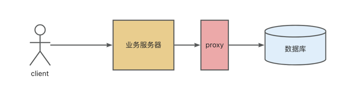
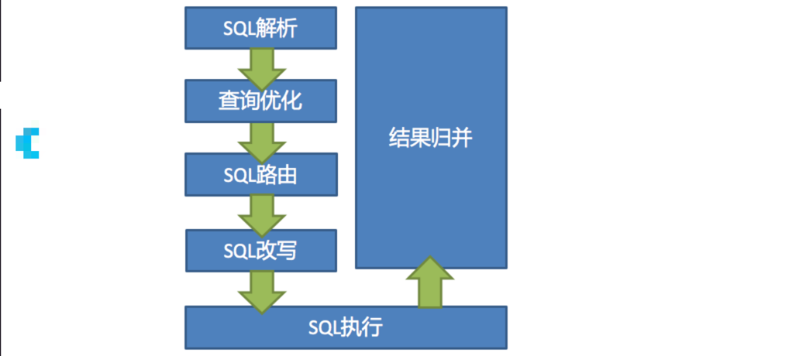
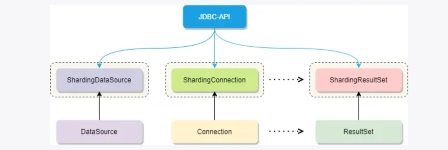
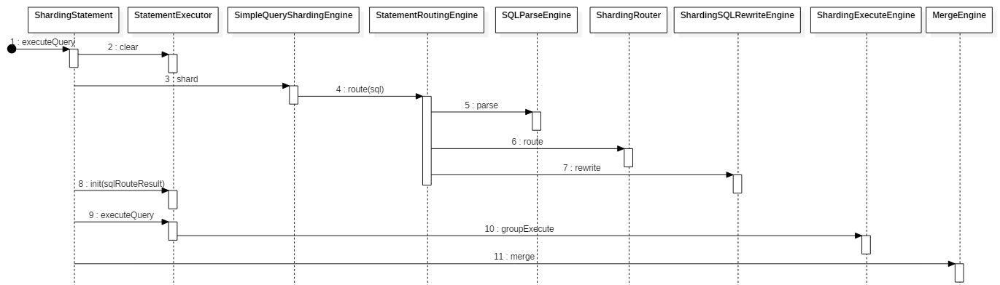

<style>
.orange {
   color: orange
}
.red {
   color: red
}
code {
   color: #0ABF5B;
}
</style>

# 一、分库分表工具
分库分表工具主要有2种模式： **客户端模式**、 **代理模式**；

|         | 客户端模式                                         | 代理模式                                                            |
|---------|-----------------------------------------------|-----------------------------------------------------------------|
| 架构      |         |                             |
| 常见开源中间件 | `Apache`的`Sharding-JDBC`、淘宝的`TDDL`、美团的`Zebra` | `Apache`的 `Sharding-Proxy`、阿里的 `cobar`、国产的 `MyCat`、360的 `Atlas` |
| 优缺点     | 客户端模式比较轻量，性能也会比较好                             | 代理模式需要部署额外的服务器，所以对于该服务器的稳定性和性能等都需要保障。                           |

<!-- more -->


# 二、ShardingJDBC
轻量级Java框架，定位于增强JDBC层，为应用提供透明的分库分表功能，使开发者能够像操作单一数据库一样处理分布式数据。

## 2.1、核心概念
| 概念                             | 定义                                            | 作用                     | 示例                                                            |
|--------------------------------|-----------------------------------------------|------------------------|---------------------------------------------------------------|
| **逻辑表**（`LogicTable`）          | 开发者视角中的虚拟表，对应业务逻辑中的表名（如`user`）                | 屏蔽底层分片的复杂性，业务代码直接操作逻辑表 | 逻辑表`user`，可能对应物理表`user_0, user_1`                             |
| **真实表**（`Actual Table`）        | 数据库中实际存在的物理表，如`user_0, user_1`                | 逻辑表通过分片规则映射到真实表        | 逻辑表`user`的分表规则为`user_${0..1}`，则真实表为`user_0, user_1`           |
| **数据节点**（`Data Node`）          | 数据分片的最小单元，由数据源名称和真实表组成，数据源名.表名（如`ds0.user_0`） | 明确数据在分库分表中的具体位置        | 逻辑表`user`的数据节点可能为`ds0.user_0,ds0.user1,ds1.user_0,ds1.user_1` |
| **分片键**（`Sharding key`）        | 用于分片的字段（如`user_id`），决定数据如何分布到库或表中             |                        |                                                               |
| **分片算法**（`sharding algorithm`） | 根据分片键的值，计算数据应路由到哪个库或表的算法                      | 精确分片算法、范围分片算法等等        | `user_id % 2` -> `ds0`或`ds1`                                  |
| **分片策略**（`sharding strategy`）  | 分片键和分片算法的组合，分为**分库策略**和**分表策略**               |                        |                                                               |
| **分布式主键**（`Distributed primary key`） | 全局唯一的ID生成策略，解决分库分表后主键冲突问题                     | 常见`snowflake, uuid`, 数据库 ||

## 2.2、使用示例
```java
public class ShardingJDBCDemo {
    public static void main(String[] args) throws SQLException {
        // 1. 配置数据源（2个库）
        Map<String, DataSource> dataSourceMap = new HashMap<>();
        dataSourceMap.put("ds0", createDataSource("jdbc:mysql://localhost:3306/ds0"));
        dataSourceMap.put("ds1", createDataSource("jdbc:mysql://localhost:3306/ds1"));

        // 2. 配置分片规则
        ShardingRuleConfiguration shardingRuleConfig = new ShardingRuleConfiguration();

        // 2.1 定义 user 表的分片规则
        ShardingTableRuleConfiguration userTableRule = new ShardingTableRuleConfiguration(
                "user", // 逻辑表名
                "ds${0..1}.user_${0..1}" // 实际数据节点：ds0.user_0, ds0.user_1, ds1.user_0, ds1.user_1
        );

        // 2.2 分库策略：按 user_id % 2 选择库（奇偶分库）
        userTableRule.setDatabaseShardingStrategy(new StandardShardingStrategyConfiguration(
                "user_id",
                "dbShardingAlgorithm"
        ));

        // 2.3 分表策略：按 (user_id / 2) % 2 选择表（解决奇偶库内表分布问题）
        userTableRule.setTableShardingStrategy(new StandardShardingStrategyConfiguration(
                "user_id",
                "tableShardingAlgorithm"
        ));

        shardingRuleConfig.getTables().add(userTableRule);

        // 3. 配置分片算法
        // 分库算法：user_id % 2 → ds0/ds1
        Properties dbShardingProps = new Properties();
        dbShardingProps.setProperty("algorithm-expression", "ds${user_id % 2}");
        shardingRuleConfig.getShardingAlgorithms().put("dbShardingAlgorithm",
                new AlgorithmConfiguration("INLINE", dbShardingProps));

        // 分表算法：(user_id / 2) % 2 → user_0/user_1
        Properties tableShardingProps = new Properties();
        tableShardingProps.setProperty("algorithm-expression", "user_${(user_id / 2) % 2}");
        shardingRuleConfig.getShardingAlgorithms().put("tableShardingAlgorithm",
                new AlgorithmConfiguration("INLINE", tableShardingProps));

        // 4. 创建 ShardingSphere 数据源
        DataSource dataSource = ShardingDataSourceFactory.createDataSource(
                dataSourceMap,
                Collections.singleton(shardingRuleConfig),
                new Properties()
        );

        // 5. 测试数据插入
        testInsertData(dataSource);
    }

    private static DataSource createDataSource(String url) {
        HikariConfig config = new HikariConfig();
        config.setJdbcUrl(url);
        config.setUsername("root");
        config.setPassword("root");
        return new HikariDataSource(config);
    }

    private static void testInsertData(DataSource dataSource) {
        try (Connection conn = dataSource.getConnection();
             PreparedStatement ps = conn.prepareStatement("INSERT INTO user (user_id, name) VALUES (?, ?)")) {

            // 插入测试数据（验证分片逻辑）
            insertUser(ps, 1001L, "Alice");   // ds1.user_0
            insertUser(ps, 1002L, "Bob");    // ds0.user_1
            insertUser(ps, 1003L, "Charlie");// ds1.user_1
            insertUser(ps, 1004L, "David");   // ds0.user_0

            System.out.println("数据插入成功，请检查数据库验证分布结果！");

        } catch (SQLException e) {
            e.printStackTrace();
        }
    }

    private static void insertUser(PreparedStatement ps, Long userId, String name) throws SQLException {
        ps.setLong(1, userId);
        ps.setString(2, name);
        ps.executeUpdate();
    }
}
```

## 2.3、核心类

### 2.3.1、总分片规则（ShardingRuleConfiguration）
定义全局分库分表的策略，包含分片键、分片算法、数据节点分布等。
```java
public class ShardingRuleConfiguration {
    private Collection<ShardingTableRuleConfiguration> tables; // 表分片规则
    private Collection<String> bindingTableGroups;            // 绑定表组
    private Collection<String> broadcastTables;               // 广播表
    private ShardingStrategyConfiguration defaultDatabaseShardingStrategy; // 默认分库策略
    private ShardingStrategyConfiguration defaultTableShardingStrategy;     // 默认分表策略
    // 其他配置（如分布式主键生成器）
}
```

### 2.3.2、表分片规则（ShardingTableRuleConfiguration）
定义单个逻辑表的分片规则（**分库策略**、**分表策略**）
```java
public class ShardingTableRuleConfiguration {
    private final String logicTable;           // 逻辑表名（如 `user`）
    private final String actualDataNodes;      // 实际数据节点表达式（如 `ds${0..1}.user_${0..1}`）
    private ShardingStrategyConfiguration databaseShardingStrategy; // 分库策略
    private ShardingStrategyConfiguration tableShardingStrategy;    // 分表策略
}
```
具体使用如下：
```java
// 2.1 定义 user 表的分片规则
ShardingTableRuleConfiguration userTableRule = new ShardingTableRuleConfiguration(
        "user", // 逻辑表名
        "ds${0..1}.user_${0..1}" // 实际数据节点：ds0.user_0, ds0.user_1, ds1.user_0, ds1.user_1
);
// 2.2 分库策略：按 user_id % 2 选择库（奇偶分库）
userTableRule.setDatabaseShardingStrategy(new StandardShardingStrategyConfiguration(
        "user_id",
        "dbShardingAlgorithm"
));
// 2.3 分表策略：按 (user_id / 2) % 2 选择表（解决奇偶库内表分布问题）
userTableRule.setTableShardingStrategy(new StandardShardingStrategyConfiguration(
        "user_id",
        "tableShardingAlgorithm"
));
```

### 2.3.3、分片策略（ShardingStrategyConfiguration）
- **作用**：定义分片键和分片算法的组合，分片**分库策略**、**分表策略**。
- **实现类**：
  - `StandardShardingStrategyConfiguration`：基于单个分片键的标准分片策略。
  - `ComplexShardingStrategyConfiguration`：基于多个分片键的复合分片策略。
  - `HintShardingStrategyConfiguration`：强制路由策略（不依赖分片键）
- **示例**：
```java
public class ShardingTableRuleConfiguration {
    private final String logicTable;           // 逻辑表名（如 `user`）
    private final String actualDataNodes;      // 实际数据节点表达式（如 `ds${0..1}.user_${0..1}`）
    private ShardingStrategyConfiguration databaseShardingStrategy; // 分库策略
    private ShardingStrategyConfiguration tableShardingStrategy;    // 分表策略
}
```


### 2.3.4、分片算法（ShardingAlgorithm）
- 作用：根据分片键值计算目标库或表。
- 核心接口：
```java
public interface ShardingAlgorithm<T extends Comparable<?>> {
    // 计算分片目标
    Collection<String> doSharding(
        Collection<String> availableTargetNames, // 可选数据节点（如 ["ds0", "ds1"]）
        Range<T> shardingValueRange              // 分片键值范围
    );
}
```
- **常用实现类**：
  - `InlineShardingAlgorithm`：基于表达式的简单分片算法（如`user_id % 2`）。
  - `StandardShardingAlgorithm`：自定义复杂分片逻辑（如范围分片）。


### 2.3.5、数据节点
- **作用**：描述数据实际存储位置（库名 + 表名）
- **核心结构**：
```java
public final class DataNode {
    private final String dataSourceName; // 数据源名称（如 `ds0`）
    private final String tableName;      // 物理表名（如 `user_0`）
}
```

### 2.3.6、路由结果（RouteResult）
- **作用**：记录SQL执行时路由到的目标数据节点。
- **关键结构**：
```java
public class RouteResult {
    private final Collection<RouteUnit> routeUnits; // 路由单元集合
}

public class RouteUnit {
    private final String dataSourceName;     // 目标数据源
    private final Collection<DataNode> dataNodes; // 目标表节点
}
```

### 2.3.7、SQL解析结果（SQLStatement）
- **作用**：解析`SQL`后的抽象语法树（`AST`），用于提取分片键和路由逻辑。
- **关键实现类**：
  - `SelectStatement`：`Select` 语句的解析结果
  - `InsertStatement`：`insert` 语句的解析结果
  - `UpdateStatement`：`Update` 语句的解析结果
  - `DeleteStatement`：`Delete` 语句的解析结果
- 示例：
```java
// 解析 SELECT 语句
SQLStatement sqlStatement = SQLParserEngine.parse("SELECT * FROM user WHERE user_id = 1001", false);
if (sqlStatement instanceof SelectStatement) {
SelectStatement selectStatement = (SelectStatement) sqlStatement;
// 提取 WHERE 条件中的分片键值
}
```


### 2.3.8、执行计划（ExecutionPlan）
- **作用**：将逻辑`SQL`转换为物理`SQL`的执行计划。
- **关键步骤**：
  * **SQL解析**：生成`sqlStatement`
  * **路由决策**：生成`RouteResult`
  * **SQL改写**：将逻辑表名替换为真实表名。
  * **执行引擎**：分发`SQL`到目标数据源执行。


## 2.4、分片主要流程
数据分片主要流程，核心由`SQL解析 => 执行器优化 => SQL路由 => SQL改写 => SQL执行 => 结果归并`的流程组成。


|| 流程        | 作用                                                           |
|-|-----------|--------------------------------------------------------------|
|1| **SQL解析** | 词法解析、语法解析、拆分后的SQL转换为抽象语法树                                    |
|2| **执行器优化** | 合并和优化分片条件，如OR等。                                              |
|3| **SQL路由** | 解析上下文匹配用户配置的分片策略，并生成路由路径。目前支持分片路由和广播路由                       |
|4| **SQL改写** | 将SQL改写为在真实数据库中可以正确执行的语句。SQL改写分为正确性改写和优化改写                    |
|5| **SQL执行** |                                                              |
|6| **结果归并**  | 将多个执行结果集归并以便于通过统一的JDBC接口输出。结果归并包括流式归并、内存归并和使用装饰者模式的追加归并这几种方式 |


# 三、ShardingJDBC 执行流程分析
`JDBC` 四大对象 `DataSource、Connection、Statement、ResultSet`，shardingjdbc都有进行封装的，如下结构：


以`ShardingStatement` 作为执行入口，其执行过程如下：

shardingjdbc的Engine是其核心处理引擎，采用模块化设计，主要包含以下子引擎，协同完成分片操作
- **查询分片引擎**（`SimpleQueryShardingEngine`）：完成 SQL 解析、路由、改写，本质是对 `ShardingRouteEngine、SQLParseEngine、ShardingSQLRewriteEngine` 的封装。
- **路由引擎**（`ShardingRouteEngine`）：由引擎包装了 SQL 解析、路由、改写三点。SQL 路由分两步，先进行数据分片路由(ShardingRouter)，再进行主从路由(ShardingMasterSlaveRouter)。
- **解析引擎**（`SQLParseEngine`）
- **改写引擎**（`ShardingSQLRewriteEngine`）
- **执行引擎**（`ShardingExecuteEngine`）
- **合并引擎**（`MergeEngine`）


## 3.1、执行入口（ShardingPreparedStatement.executeQuery()）
```java
public final class ShardingPreparedStatement extends AbstractShardingPreparedStatementAdapter {
  public ResultSet executeQuery() throws SQLException {
    ResultSet result;
    try {
      this.clearPrevious();
      this.prepare();//准备工作：完成SQL解析、路由、改写操作
      this.initPreparedStatementExecutor();//初始化SQL执行器
      MergedResult mergedResult = this.mergeQuery(this.preparedStatementExecutor.executeQuery());//SQL执行
      result = new ShardingResultSet(this.preparedStatementExecutor.getResultSets(), mergedResult, this, this.executionContext);
    } finally {
      this.clearBatch();
    }
    this.currentResultSet = result;
    return result;
  }
}
```
`this.prepare();`准备工作逻辑如下：执行`SimpleQueryPrepareEngine`引擎的`prepare()`方法，内部的逻辑还是比较清晰的：先去路由，再改写SQL。
```java
private void prepare() {
    this.executionContext = this.prepareEngine.prepare(this.sql, this.getParameters());
    this.findGeneratedKey().ifPresent((generatedKey) -> this.generatedValues.add(generatedKey.getGeneratedValues().getLast()));
}

public abstract class BasePrepareEngine {
  public ExecutionContext prepare(String sql, List<Object> parameters) {
    List<Object> clonedParameters = this.cloneParameters(parameters);
    RouteContext routeContext = this.executeRoute(sql, clonedParameters);
    ExecutionContext result = new ExecutionContext(routeContext.getSqlStatementContext());
    result.getExecutionUnits().addAll(this.executeRewrite(sql, clonedParameters, routeContext));
    if ((Boolean)this.properties.getValue(ConfigurationPropertyKey.SQL_SHOW)) {
      SQLLogger.logSQL(sql, (Boolean)this.properties.getValue(ConfigurationPropertyKey.SQL_SIMPLE), result.getSqlStatementContext(), result.getExecutionUnits());
    }

    return result;
  }
}
```
- `this.executeRoute()`：处理SQL解析 & 路由
  - `SqlParserEngine.parse()`
  - `shardingRouteEngine.route()`
- `this.executeRewrite()`：处理SQL重写


## 3.2、第一步：SQL解析
追踪`this.executeRoute()`方法，调用解析引擎对SQL进行解析
```java
public final class DataNodeRouter {
    private RouteContext executeRoute(String sql, List<Object> parameters, boolean useCache) {
        //第一步：SQL解析
        RouteContext result = this.createRouteContext(sql, parameters, useCache);
        //第二步：装饰模式，SQL路由
        for (Map.Entry<BaseRule, RouteDecorator> entry : this.decorators.entrySet()) {
            result = ((RouteDecorator) entry.getValue()).decorate(result, this.metaData, (BaseRule) entry.getKey(), this.properties);
        }

        return result;
    }
    private RouteContext createRouteContext(String sql, List<Object> parameters, boolean useCache) {
        //sql解析
        SQLStatement sqlStatement = this.parserEngine.parse(sql, useCache);
        try {
          SQLStatementContext sqlStatementContext = SQLStatementContextFactory.newInstance(this.metaData.getSchema(), sql, parameters, sqlStatement);
          return new RouteContext(sqlStatementContext, parameters, new RouteResult());
        } catch (IndexOutOfBoundsException var6) {
          return new RouteContext(new CommonSQLStatementContext(sqlStatement), parameters, new RouteResult());
        }
    }
}
```
具体解析过程：`this.parserEngine.parse(sql, useCache);`
```java
public final class SQLParserEngine {
    private final String databaseTypeName;
    private final SQLParseResultCache cache = new SQLParseResultCache();
    
    public SQLStatement parse(final String sql, final boolean useCache) {
        ParsingHook parsingHook = new SPIParsingHook();
        parsingHook.start(sql);
        try {
            SQLStatement result = parse0(sql, useCache);
            parsingHook.finishSuccess(result);
            return result;
            // CHECKSTYLE:OFF
        } catch (final Exception ex) {
            // CHECKSTYLE:ON
            parsingHook.finishFailure(ex);
            throw ex;
        }
    }
    //实际解析逻辑，包含缓存机制
    private SQLStatement parse0(final String sql, final boolean useCache) {
        if (useCache) {
            Optional<SQLStatement> cachedSQLStatement = cache.getSQLStatement(sql);
            if (cachedSQLStatement.isPresent()) {
                return cachedSQLStatement.get();
            }
        }
        //生成语法树
        ParseTree parseTree = new SQLParserExecutor(databaseTypeName, sql).execute().getRootNode();
        //通过访问者模式遍历语法树，生成SQLStatement
        SQLStatement result = (SQLStatement) ParseTreeVisitorFactory.newInstance(databaseTypeName, VisitorRule.valueOf(parseTree.getClass())).visit(parseTree);
        if (useCache) {
            cache.put(sql, result);
        }
        return result;
    }
}
```
`SQLParserEngine`是核心解析组件，通过缓存、访问者模式和插件化钩子实现高效、可扩展的SQL解析。
- **缓存机制**：避免重复解析相同SQL，提升性能。

示例解析：
以SQL select name from user where id = 1为例，其AST可能的结构如下（简化版）
```text
SelectStatement
├─ Projections
│  └─ ColumnProjection (name="name")
├─ Table
│  └─ SimpleTable (name="user")
└─ WhereClause
   └─ Predicate
      ├─ LeftExpression: Column (name="id")
      ├─ Operator: "="
      └─ RightExpression: Literal (value=1)
```
关键节点说明

| 节点类型             | 说明             |
|------------------|----------------|
| `SelectStatement`  | 根节点，表示`SELECT`语句 |
| `Projections`      | 查询的投影列（如`name`）  |
| `ColumnProjection` | 具体列名或表达式       |
| `SimpleTable`      | 查询的表名（如user）   |
| `WhereClause`      | `where`条件子树      |
| `Predicate`        | 条件表达式（如`id=1`）   |
| `Column/Literal`   | 列名或字面量值        |

进一步将原始语法树转换为自定义的`SQLStatement`对象，简化后续处理。
```java
public class SelectStatement extends SQLStatement {
    private List<Projection> projections; // 投影列（如 name）
    private Table table;                  // 目标表（如 user）
    private WhereSegment where;           // WHERE 条件（如 id = 1）
    // 其他字段（GROUP BY, ORDER BY 等）
}
```

## 3.2、第二步：SQL路由
通过装饰模式，调用路由引擎进行路由。
- `ShardingRouteDecorator`：分片路由，根据分片键和算法确定目标数据源于表
- `MasterSlaveRouteDecorator`：主从读写分离路由。
```java
public final class ShardingRouteDecorator implements RouteDecorator<ShardingRule> {
    public RouteContext decorate(RouteContext routeContext, ShardingSphereMetaData metaData, ShardingRule shardingRule, ConfigurationProperties properties) {
        SQLStatementContext sqlStatementContext = routeContext.getSqlStatementContext();
        List<Object> parameters = routeContext.getParameters();
        ShardingStatementValidatorFactory.newInstance(sqlStatementContext.getSqlStatement()).ifPresent((validator) -> validator.validate(shardingRule, sqlStatementContext.getSqlStatement(), parameters));
        //1. 解析分片条件（where、insert values）
        ShardingConditions shardingConditions = this.getShardingConditions(parameters, sqlStatementContext, metaData.getSchema(), shardingRule);
        boolean needMergeShardingValues = this.isNeedMergeShardingValues(sqlStatementContext, shardingRule);
        if (sqlStatementContext.getSqlStatement() instanceof DMLStatement && needMergeShardingValues) {
          this.checkSubqueryShardingValues(sqlStatementContext, shardingRule, shardingConditions);
          this.mergeShardingConditions(shardingConditions);
        }
        //2. 选择路由引擎（标准、广播、笛卡尔积）
        ShardingRouteEngine shardingRouteEngine = ShardingRouteEngineFactory.newInstance(shardingRule, metaData, sqlStatementContext, shardingConditions, properties);
        //3. 执行分片路由，生成物流DataNodes
        RouteResult routeResult = shardingRouteEngine.route(shardingRule);
        if (needMergeShardingValues) {
          Preconditions.checkState(1 == routeResult.getRouteUnits().size(), "Must have one sharding with subquery.");
        }
        return new RouteContext(sqlStatementContext, parameters, routeResult);
    }
}
```

对`ShardingStandardRoutingEngine`标准路由引擎进行解析，核心职责：
- `分片键解析`：从SQL的`where`或`insert`字句中提取分片键的值
- `分片策略匹配`：根据分片算法（`ShardingAlgorithm`）计算目标数据源（库）和表名（表）
- `生成路由结果`：返回包含物流数据节点（`DataNode`）的`RouteContext`，供后续执行引擎使用。

其核心方法`route`如下（简化提炼后）
```java
public final class ShardingStandardRoutingEngine implements ShardingRouteEngine {
  @Override
  public RouteContext route(final ShardingRule shardingRule) {
    // 1. 获取逻辑表的分片规则（TableRule）
    TableRule tableRule = shardingRule.getTableRule(logicTableName);

    // 2. 处理分片条件，生成分片值集合
    Collection<ShardingValue> databaseShardingValues = getShardingValues(shardingConditions, tableRule.getDatabaseShardingColumns());
    Collection<ShardingValue> tableShardingValues = getShardingValues(shardingConditions, tableRule.getTableShardingColumns());

    // 3. 计算目标数据库和表名
    Collection<String> routedDataSources = routeDataSources(shardingRule, databaseShardingValues);
    Collection<String> routedTables = routeTables(shardingRule, tableShardingValues, routedDataSources);

    // 4. 生成路由单元（RouteUnit）
    RouteContext result = new RouteContext();
    for (String dataSource : routedDataSources) {
      for (String table : routedTables) {
        result.getRouteUnits().add(new RouteUnit(dataSource, new RouteMapper(logicTableName, table)));
      }
    }
    return result;
  }
}
```

### 3.2.1、分片条件提取
从shardingConditions中提取与分片规则（TableRule）中定义的分片键匹配的条件。

- **示例**：
  - **分片规则**：`databaseShardingColumns = user_id, tableShardingColumns = order_id`
  - **sql**：`where user_id = 100 AND order_id in（1, 2, 3）`
- **提取结果**
  - `databaseShardingValues` = [100]
  - `tableShardingValues` = [1, 2, 3]

### 3.2.2、分片算法调用
- **路由数据源**：调用数据库分片算法（DatabaseShardingStrategy）计算目标数据源
- **路由表名**：调用表分片算法（TableShardingStrategy）计算目标物理表名。
- **代码片段**：
```java
private Collection<String> routeDataSources(ShardingRule shardingRule, Collection<ShardingValue> shardingValues) {
    ShardingStrategy databaseShardingStrategy = shardingRule.getDatabaseShardingStrategy(tableRule);
    return databaseShardingStrategy.doSharding(shardingRule.getDataSourceNames(), shardingValues);
}

private Collection<String> routeTables(ShardingRule shardingRule, Collection<ShardingValue> shardingValues, Collection<String> routedDataSources) {
    ShardingStrategy tableShardingStrategy = shardingRule.getTableShardingStrategy(tableRule);
    return tableShardingStrategy.doSharding(shardingRule.getActualTableNames(logicTableName), shardingValues);
}
```

### 3.2.3、分片结果合并
**笛卡尔积生成**：若存在多个分片键（如分库键和分表键独立），将数据源和表名的分片结果组成笛卡尔积。
```text
数据源分片结果：ds0, ds1
表分片结果：order_0, order_1
最终路由单元：
  ds0.order_0
  ds0.order_1
  ds1.order_0
  ds1.order_1
```
返回`RouteResult`路由结果


## 3.3、第三步：SQL重写：`this.executeRewrite()`
```java
private Collection<ExecutionUnit> executeRewrite(String sql, List<Object> parameters, RouteContext routeContext) {
    this.registerRewriteDecorator();
    SQLRewriteContext sqlRewriteContext = this.rewriter.createSQLRewriteContext(sql, parameters, routeContext.getSqlStatementContext(), routeContext);
    return routeContext.getRouteResult().getRouteUnits().isEmpty() ? this.rewrite(sqlRewriteContext) : this.rewrite(routeContext, sqlRewriteContext);
}

private Collection<ExecutionUnit> rewrite(SQLRewriteContext sqlRewriteContext) {
    SQLRewriteResult sqlRewriteResult = (new SQLRewriteEngine()).rewrite(sqlRewriteContext);
    String dataSourceName = (String)this.metaData.getDataSources().getAllInstanceDataSourceNames().iterator().next();
    return Collections.singletonList(new ExecutionUnit(dataSourceName, new SQLUnit(sqlRewriteResult.getSql(), sqlRewriteResult.getParameters())));
}
```

## initPreparedStatementExecutor方法
这个方法里面主要做的事情包含真实数据源连接的建立以及真实`Statement`对象的建立
```java
private void initPreparedStatementExecutor() throws SQLException {
  this.preparedStatementExecutor.init(this.executionContext);
  //为PreparedStatement对象参数赋实际的值
  this.setParametersForStatements();
  this.replayMethodForStatements();
}
```
我们重点关注的对象应该放在`preparedStatementExecutor.init(executionContext)` ;
```java
public void init(ExecutionContext executionContext) throws SQLException {
  this.setSqlStatementContext(executionContext.getSqlStatementContext());
  this.getInputGroups().addAll(this.obtainExecuteGroups(executionContext.getExecutionUnits()));
  this.cacheStatements();
}
```
1. 第一步设置当前`SqlStatement`上下文
2. 第二步可以看到是给一个内部的集合添加一些所谓的执行组
3. 缓存部分对象


我们针对第二步来进行分析点击进入`obtainExecuteGroups`方法
```java
private Collection<InputGroup<StatementExecuteUnit>> obtainExecuteGroups(Collection<ExecutionUnit> executionUnits) throws SQLException {
  return this.getSqlExecutePrepareTemplate().getExecuteUnitGroups(executionUnits, new SQLExecutePrepareCallback() {
      //根据数据库名称获取真实的数据库连接
      public List<Connection> getConnections(ConnectionMode connectionMode, String dataSourceName, int connectionSize) throws SQLException {
          //这里的方法就是真实的获取数据源连接的地方，很重要，可以看到有一个参数是dataSourceName，我们猜测这个dataSourceName就是最开始提到的datasourceMap中的key，如果是的话，又是什么时候调用到这个方法呢，我们接着往下看
          return PreparedStatementExecutor.super.getConnection().getConnections(connectionMode, dataSourceName, connectionSize);
      }
  
      public StatementExecuteUnit createStatementExecuteUnit(Connection connection, ExecutionUnit executionUnit, ConnectionMode connectionMode) throws SQLException {
          //创建JDBC执行联合对象
          return new StatementExecuteUnit(executionUnit, PreparedStatementExecutor.this.createPreparedStatement(connection, executionUnit.getSqlUnit().getSql()), connectionMode);
      }
  });
}

private PreparedStatement createPreparedStatement(Connection connection, String sql) throws SQLException {
  return this.returnGeneratedKeys ? connection.prepareStatement(sql, 1) : connection.prepareStatement(sql, this.getResultSetType(), this.getResultSetConcurrency(), this.getResultSetHoldability());
}
```

## 3.4、第四步：SQL执行
这里，`callback`是一个非常巧妙的设计，`executeSQL`即是需要执行的`sql`，这里可以根据需要去灵活实现，例如`select、update`等等操作，而`executeCallback(executeCallback)`便是真正的执行者，`executeCallback`调用`sqlExecuteTemplate的executeGroup`，把执行分组传入`ShardingExecuteEngine`执行引擎。
```java
public final class PreparedStatementExecutor extends AbstractStatementExecutor {
  public List<QueryResult> executeQuery() throws SQLException {
    boolean isExceptionThrown = ExecutorExceptionHandler.isExceptionThrown();
    //定义回调
    SQLExecuteCallback<QueryResult> executeCallback = new SQLExecuteCallback<QueryResult>(this.getDatabaseType(), isExceptionThrown) {
      protected QueryResult executeSQL(String sql, Statement statement, ConnectionMode connectionMode) throws SQLException {
        return PreparedStatementExecutor.this.getQueryResult(statement, connectionMode);
      }
    };
    //将回调传入
    return this.executeCallback(executeCallback);
  }
  
  private QueryResult getQueryResult(Statement statement, ConnectionMode connectionMode) throws SQLException {
    PreparedStatement preparedStatement = (PreparedStatement) statement;
    ResultSet resultSet = preparedStatement.executeQuery();
    this.getResultSets().add(resultSet);
    return (QueryResult)(ConnectionMode.MEMORY_STRICTLY == connectionMode ? new StreamQueryResult(resultSet) : new MemoryQueryResult(resultSet));
  }
    //真正执行者，调用执行引擎
  protected final <T> List<T> executeCallback(SQLExecuteCallback<T> executeCallback) throws SQLException {
    List<T> result = this.sqlExecuteTemplate.execute(this.inputGroups, executeCallback);
    this.refreshMetaDataIfNeeded(this.connection.getRuntimeContext(), this.sqlStatementContext);
    return result;
  }
}
```
进入`SQLExecutePrepareTemplate`的`execute`方法，执行`ExecutorEngine`的`execute`方法。
```java
public final class SQLExecuteTemplate {
  public <T> List<T> execute(Collection<InputGroup<? extends StatementExecuteUnit>> inputGroups, SQLExecuteCallback<T> firstCallback, SQLExecuteCallback<T> callback) throws SQLException {
    try {
      return this.executorEngine.execute(inputGroups, firstCallback, callback, this.serial);
    } catch (SQLException ex) {
      ExecutorExceptionHandler.handleException(ex);
      return Collections.emptyList();
    }
  }
}
```
注意这里的`serial`参数，表示执行`sql`的方式是串行还是并行。这是在`PreparedStatementExecutor`父类`AbstractStatementExecutor`构造`SQLExecutePrepareTemplate`时传入的。
```java
public final class ExecutorEngine implements AutoCloseable {
    public <I, O> List<O> execute(Collection<InputGroup<I>> inputGroups, GroupedCallback<I, O> firstCallback, GroupedCallback<I, O> callback, boolean serial) throws SQLException {
        if (inputGroups.isEmpty()) {
            return Collections.emptyList();
        } else {
            return serial ? this.serialExecute(inputGroups, firstCallback, callback) : this.parallelExecute(inputGroups, firstCallback, callback);
        }
    }
}
```
`serial`取决于`ShardingConnection#isHoldTransaction`，其含义就是，如果在事务中返回`true`；否则返回`false`。也就是说，在**本地事务**中或**XA事务**中时，串行执行sql；其他情况下，并行执行sql。
```java
public boolean isHoldTransaction() {
  // 本地事务中
  return (TransactionType.LOCAL == transactionType && !getAutoCommit())
          // XA事务中
          || (TransactionType.XA == transactionType && isInShardingTransaction());
}
```
并行执行和串行执行差不多，看并行执行。并行执行将第二个及之后的任务提交到线程池执行，第一个任务同步执行，最终合并结果。对于执行sql来说，一个任务需要处理一个`InputGroup`分组内的sql，一个`InputGroup`对应一个`Connection`，也就是说一个任务对应一个`Connection`。
```java
private <I, O> List<O> parallelExecute(final Collection<InputGroup<I>> inputGroups, final GroupedCallback<I, O> firstCallback, final GroupedCallback<I, O> callback) throws SQLException {
    Iterator<InputGroup<I>> inputGroupsIterator = inputGroups.iterator();
    InputGroup<I> firstInputs = inputGroupsIterator.next();
    // 异步执行第2个开始的任务
    Collection<ListenableFuture<Collection<O>>> restResultFutures = asyncExecute(Lists.newArrayList(inputGroupsIterator), callback);
    // 同步执行第1个任务
    Collection<O> syncExecute = syncExecute(firstInputs, null == firstCallback ? callback : firstCallback);
    // 合并执行结果
    return getGroupResults(syncExecute, restResultFutures);
}

// 合并执行结果
private <O> List<O> getGroupResults(final Collection<O> firstResults, final Collection<ListenableFuture<Collection<O>>> restFutures) throws SQLException {
  List<O> result = new LinkedList<>(firstResults);
  for (ListenableFuture<Collection<O>> each : restFutures) {
      try {
          result.addAll(each.get()); // 等待Future执行完成
      } catch (final InterruptedException | ExecutionException ex) {
          return throwException(ex);
      }
  }
  return result;
}
```
`ExecutorEngine#asyncExecute`异步执行。
```java
// 线程池
private final ShardingSphereExecutorService executorService;

private <I, O> Collection<ListenableFuture<Collection<O>>> asyncExecute(final List<InputGroup<I>> inputGroups, final GroupedCallback<I, O> callback) {
  Collection<ListenableFuture<Collection<O>>> result = new LinkedList<>();
  for (InputGroup<I> each : inputGroups) {
      ListenableFuture<Collection<O>> future = asyncExecute(each, callback);
      result.add(future);
  }
  return result;
}

private <I, O> ListenableFuture<Collection<O>> asyncExecute(final InputGroup<I> inputGroup, final GroupedCallback<I, O> callback) {
  final Map<String, Object> dataMap = ExecutorDataMap.getValue();
  return executorService.getExecutorService()
       .submit(() -> callback.execute(inputGroup.getInputs(), false, dataMap));
}
```
进入`SQLExecuteCallback`（实现`GroupedCallback`接口）执行`execute`方法。循环所有sql，每个sql执行前后先执行`SQLExecutionHook`的钩子方法，最终调用由`SQLExecuteCallbackFactory`创建的匿名类的`executeSQL`方法，仅仅是执行`Statement.execute`（往上翻）。
```java
public abstract class SQLExecuteCallback<T> implements GroupedCallback<StatementExecuteUnit, T> {
  public final Collection<T> execute(Collection<StatementExecuteUnit> statementExecuteUnits, boolean isTrunkThread, Map<String, Object> dataMap) throws SQLException {
    Collection<T> result = new LinkedList();
    // 循环sql
    for(StatementExecuteUnit each : statementExecuteUnits) {
      // 执行单个sql
      result.add(this.execute0(each, isTrunkThread, dataMap));
    }

    return result;
  }

  private T execute0(StatementExecuteUnit statementExecuteUnit, boolean isTrunkThread, Map<String, Object> dataMap) throws SQLException {
    ExecutorExceptionHandler.setExceptionThrown(this.isExceptionThrown);
    // 获取元数据信息
    DataSourceMetaData dataSourceMetaData = this.getDataSourceMetaData(statementExecuteUnit.getStatement().getConnection().getMetaData());
    // 持有所有钩子集合
    SQLExecutionHook sqlExecutionHook = new SPISQLExecutionHook();
    try {
      ExecutionUnit executionUnit = statementExecuteUnit.getExecutionUnit();
      // 执行所有start钩子（Trace、Seata...）
      sqlExecutionHook.start(executionUnit.getDataSourceName(), executionUnit.getSqlUnit().getSql(), executionUnit.getSqlUnit().getParameters(), dataSourceMetaData, isTrunkThread, dataMap);
      // 执行sql
      T result = (T)this.executeSQL(executionUnit.getSqlUnit().getSql(), statementExecuteUnit.getStatement(), statementExecuteUnit.getConnectionMode());
      // 执行所有success钩子（Trace、Seata...）
      sqlExecutionHook.finishSuccess();
      return result;
    } catch (SQLException ex) {
      sqlExecutionHook.finishFailure(ex);
      ExecutorExceptionHandler.handleException(ex);
      return null;
    }
  }
}
```
执行`PreparedStatementExecutor`的`executeCallback`，执行`getQueryResult()`方法
```java
public final class PreparedStatementExecutor extends AbstractStatementExecutor {
  public List<QueryResult> executeQuery() throws SQLException {
    boolean isExceptionThrown = ExecutorExceptionHandler.isExceptionThrown();
    //定义回调
    SQLExecuteCallback<QueryResult> executeCallback = new SQLExecuteCallback<QueryResult>(this.getDatabaseType(), isExceptionThrown) {
      protected QueryResult executeSQL(String sql, Statement statement, ConnectionMode connectionMode) throws SQLException {
        return PreparedStatementExecutor.this.getQueryResult(statement, connectionMode);
      }
    };
    //将回调传入
    return this.executeCallback(executeCallback);
  }
  
  private QueryResult getQueryResult(Statement statement, ConnectionMode connectionMode) throws SQLException {
    PreparedStatement preparedStatement = (PreparedStatement) statement;
    //重点，执行具体的SQL，例如MySQL的实现
    ResultSet resultSet = preparedStatement.executeQuery();
    this.getResultSets().add(resultSet);
    return (QueryResult)(ConnectionMode.MEMORY_STRICTLY == connectionMode ? new StreamQueryResult(resultSet) : new MemoryQueryResult(resultSet));
  }
}
```
- connectionMode：连接模式，决定结果集的加载方式（流式或内存缓存）


# 四、小结
整体执行堆栈如下：
```text
| ShardingPreparedStatement.executeQuery()
| -->ShardingPreparedStatement.prepare()
| ----> BasePrepareEngine.prepare() // sql解析 & SQL路由
| ------> BasePrepareEngine.executeRoute()
| --------> BasePrepareEngine.registerRouteDecorator()
| --------> SimpleQueryPrepareEngine.route()
| ----------> DataNodeRouter.route()
| ----------> DataNodeRouter.executeRoute()
| ------------> DataNodeRouter.createRouteContext()
| sql解析--------------> parserEngine.parse()   //sql解析
| ------------> DataNodeRouter.decorate()
| --------------> ShardingRouteDecorator.decorate()
| SQL路由----------------> shardingRouteEngine.route() //SQL路由
| ----> BasePrepareEngine.executeRewrite() //SQL重写
| SQL重写------> SQLRewriteEngine.rewrite //SQL重写
| -->ShardingPreparedStatement.initPreparedStatementExecutor() //初始化执行器
| SQL执行-->PreparedStatementExecutor.executeQuery() // SQL执行
```


参考文章：
[Sharding-Jdbc 源码分析](https://www.cnblogs.com/binarylei/p/12234545.html)
[从源码看ShardingSphere设计-总览篇](https://www.jianshu.com/p/d927ad6a1b3e)