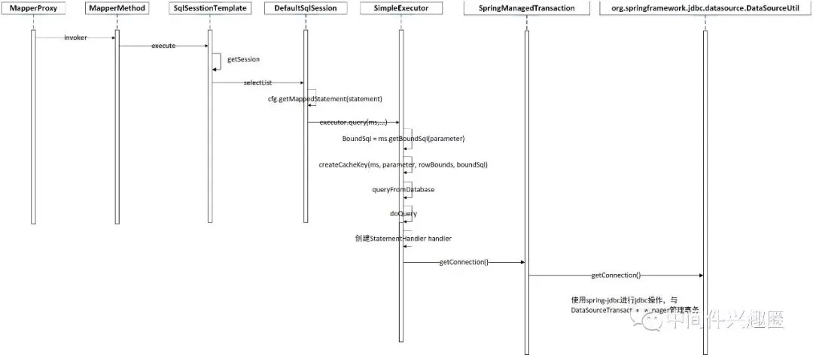
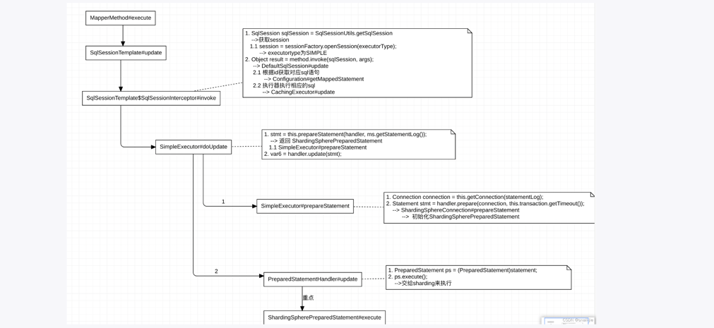

<style>
.orange {
   color: orange
}
.red {
   color: red
}
code {
   color: #0ABF5B;
}
</style>

# 一、shardingjdbc和Mybatis的集成
`shardingjdbc + Mybatis + spring`集成示例：

<!-- more -->

`spring xml`配置如下：
```xml
<?xml version="1.0" encoding="UTF-8"?>
<beans xmlns="http://www.springframework.org/schema/beans"
       xmlns:xsi="http://www.w3.org/2001/XMLSchema-instance"
       xsi:schemaLocation="http://www.springframework.org/schema/beans
                           http://www.springframework.org/schema/beans/spring-beans.xsd">

    <!-- =================================== -->
    <!-- 1. 配置分库分表的数据源 -->
    <!-- =================================== -->

    <!-- 数据源 ds0（对应分库 db0） -->
    <bean id="ds0" class="com.alibaba.druid.pool.DruidDataSource" init-method="init" destroy-method="close">
        <property name="url" value="jdbc:mysql://localhost:3306/db0?useSSL=false&serverTimezone=UTC"/>
        <property name="username" value="root"/>
        <property name="password" value="root"/>
        <property name="driverClassName" value="com.mysql.cj.jdbc.Driver"/>
        <!-- Druid 连接池配置 -->
        <property name="initialSize" value="5"/>
        <property name="minIdle" value="5"/>
        <property name="maxActive" value="20"/>
    </bean>

    <!-- 数据源 ds1（对应分库 db1） -->
    <bean id="ds1" class="com.alibaba.druid.pool.DruidDataSource" init-method="init" destroy-method="close">
        <property name="url" value="jdbc:mysql://localhost:3306/db1?useSSL=false&serverTimezone=UTC"/>
        <property name="username" value="root"/>
        <property name="password" value="root"/>
        <property name="driverClassName" value="com.mysql.cj.jdbc.Driver"/>
        <property name="initialSize" value="5"/>
        <property name="minIdle" value="5"/>
        <property name="maxActive" value="20"/>
    </bean>

    <!-- =================================== -->
    <!-- 2. 配置分片规则 -->
    <!-- =================================== -->

    <!-- 分片策略配置 -->
    <bean id="shardingRuleConfiguration" class="org.apache.shardingsphere.sharding.api.config.ShardingRuleConfiguration">
        <!-- 分片表配置 -->
        <property name="tables">
            <map>
                <entry key="t_order">
                    <bean class="org.apache.shardingsphere.sharding.api.config.rule.ShardingTableRuleConfiguration">
                        <property name="actualDataNodes" value="ds$->{0..1}.t_order_$->{0..3}"/>
                        <!-- 分库策略 -->
                        <property name="databaseShardingStrategy">
                            <bean class="org.apache.shardingsphere.sharding.api.config.strategy.StandardShardingStrategyConfiguration">
                                <constructor-arg index="0" value="user_id"/>
                                <constructor-arg index="1">
                                    <bean class="org.apache.shardingsphere.sharding.api.config.strategy.inline.InlineShardingAlgorithmConfiguration">
                                        <property name="shardingAlgorithmExpression" value="ds$->{user_id % 2}"/>
                                    </bean>
                                </constructor-arg>
                            </bean>
                        </property>
                        <!-- 分表策略 -->
                        <property name="tableShardingStrategy">
                            <bean class="org.apache.shardingsphere.sharding.api.config.strategy.StandardShardingStrategyConfiguration">
                                <constructor-arg index="0" value="order_id"/>
                                <constructor-arg index="1">
                                    <bean class="org.apache.shardingsphere.sharding.api.config.strategy.inline.InlineShardingAlgorithmConfiguration">
                                        <property name="shardingAlgorithmExpression" value="t_order_$->{order_id % 4}"/>
                                    </bean>
                                </constructor-arg>
                            </bean>
                        </property>
                        <!-- 主键生成策略（Snowflake） -->
                        <property name="keyGeneratorConfig">
                            <bean class="org.apache.shardingsphere.sharding.api.config.KeyGeneratorConfiguration">
                                <property name="column" value="order_id"/>
                                <property name="keyGeneratorClass" value="org.apache.shardingsphere.shardingjdbc.core.keygen.SnowflakeKeyGenerator"/>
                            </bean>
                        </property>
                    </bean>
                </entry>
            </map>
        </property>
    </bean>

    <!-- 构建分片数据源 -->
    <bean id="shardingDataSource" class="org.apache.shardingsphere.shardingjdbc.api.ShardingDataSourceFactoryBean">
        <property name="dataSourceMap">
            <map>
                <entry key="ds0" value-ref="ds0"/>
                <entry key="ds1" value-ref="ds1"/>
            </map>
        </property>
        <property name="shardingRuleConfiguration" ref="shardingRuleConfiguration"/>
    </bean>

    <!-- =================================== -->
    <!-- 3. 配置 MyBatis -->
    <!-- =================================== -->

    <!-- MyBatis SqlSessionFactory -->
    <bean id="sqlSessionFactory" class="org.mybatis.spring.SqlSessionFactoryBean">
        <property name="dataSource" ref="shardingDataSource"/>
        <property name="configLocation" value="classpath:mybatis-config.xml"/>
        <property name="mapperLocations" value="classpath*:mapper/*.xml"/>
    </bean>

    <!-- 扫描 Mapper 接口 -->
    <bean class="org.mybatis.spring.mapper.MapperScannerConfigurer">
        <property name="basePackage" value="com.example.mapper"/>
        <property name="sqlSessionFactoryBeanName" value="sqlSessionFactory"/>
    </bean>

</beans>
```

# 二、Mybatis执行过程
先回顾一下`Mybatis`是执行过程：

`service`调用`mapper`，实际执行的是`MapperProxy`，代理对象执行逻辑梳理：

`shardingDataSource`被`spring`管理，`mybatis`在`executor`执行的时候，通过`shardingDataSource`创建`ShardingConnection`，然后创建`ShardingPreparedStatement`，如下代码为获取`Connection`的逻辑：
```java
protected Connection getConnection(Log statementLog) throws SQLException {
    Connection connection = transaction.getConnection();
    if (statementLog.isDebugEnabled()) {
      return ConnectionLogger.newInstance(connection, statementLog, queryStack);
    } else {
      return connection;
    }
}
public static Connection doGetConnection(DataSource dataSource) throws SQLException {
  Assert.notNull(dataSource, "No DataSource specified");

  ConnectionHolder conHolder = (ConnectionHolder) TransactionSynchronizationManager.getResource(dataSource);
  if (conHolder != null && (conHolder.hasConnection() || conHolder.isSynchronizedWithTransaction())) {
    conHolder.requested();
    if (!conHolder.hasConnection()) {
      logger.debug("Fetching resumed JDBC Connection from DataSource");
      conHolder.setConnection(dataSource.getConnection());
    }
    return conHolder.getConnection();
  }
  // Else we either got no holder or an empty thread-bound holder here.

  logger.debug("Fetching JDBC Connection from DataSource");
  Connection con = dataSource.getConnection();

  if (TransactionSynchronizationManager.isSynchronizationActive()) {
    logger.debug("Registering transaction synchronization for JDBC Connection");
    // Use same Connection for further JDBC actions within the transaction.
    // Thread-bound object will get removed by synchronization at transaction completion.
    ConnectionHolder holderToUse = conHolder;
    if (holderToUse == null) {
      holderToUse = new ConnectionHolder(con);
    }
    else {
      holderToUse.setConnection(con);
    }
    holderToUse.requested();
    TransactionSynchronizationManager.registerSynchronization(
            new ConnectionSynchronization(holderToUse, dataSource));
    holderToUse.setSynchronizedWithTransaction(true);
    if (holderToUse != conHolder) {
      TransactionSynchronizationManager.bindResource(dataSource, holderToUse);
    }
  }

  return con;
}
```


