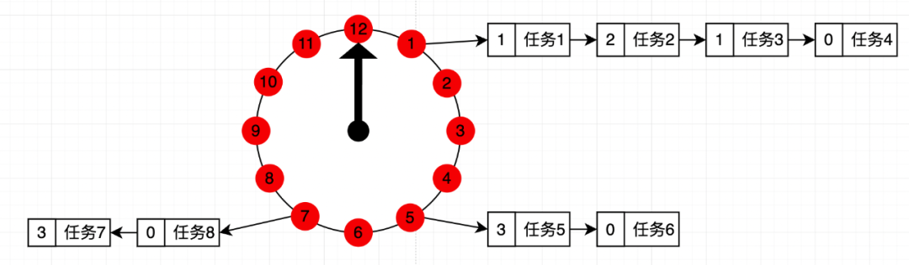
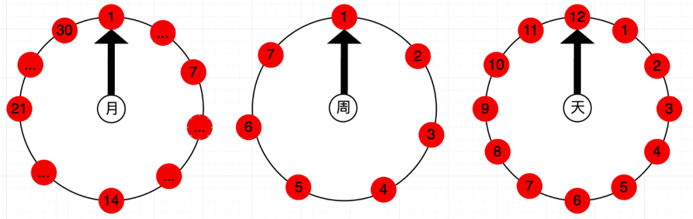

<style>
.orange {
   color: orange
}
.red {
   color: red
}
code {
   color: #0ABF5B;
}
</style>


# 一. 定时任务
主要考虑的点：
- **定时任务如何存储？（持久化或临时保存到特定的数据结构中）**
- **定时任务如何执行？（调度策略和资源管理）**。

<!-- more -->


# 二. 定时任务存储

| 方案     | 适用场景          | 优缺点                                     |
|--------|---------------|-----------------------------------------|
| 内存存储   | 单机、任务少、允许数据丢失 | 优点：速度快，实现简单；缺点：数据易失，重启后任务丢失             |
| 关系型数据库 | 中小规模、需事务支出    | 优点：ACID，支持复杂查询；缺点：高并发下性能差（如MySQL的定时任务表） |
| Redis  | 高频任务、分布式场景    | 优点：高性能，支持有序集合（ZSet）；缺点：需处理持久化和数据恢复      |
| 分布式数据库 | 大规模、高可用需求     | 优点：强一致性，分布式锁；缺点：复杂度高，运维成本大              |
| 消息队列   | 异步解耦、任务分发     | 优点：削峰填谷，支持重试；缺点：需额外处理延迟消息               |


## 2.1. redis数据结构设计

- **有序集合（ZSet）**：以任务触发时间为`score`，快速获取最近需执行的任务。
```bash
# 添加任务（任务ID为唯一键，触发时间戳为Score）
ZADD scheduled_tasks <timestamp> <task_id>

# 查询最近1分钟内需执行的任务
ZRANGEBYSCORE scheduled_tasks <current_time> <current_time+60>
```

- **hash表**：存储任务详情（如回调参数、重试次数）
```bash
HSET task_metadata <task_id> <JSON序列化的任务数据>
```

## 2.2. 时间轮
时间轮（`Timing Wheel`）可以被视为一种用于定时任务管理的`特殊内存存储结构`。在实际系统中，**时间轮通常不独立作为存储层，而是与持久化存储结合，形成分层结构**：
1. **持久化存储层（如Redis、MySQL）**
    * 长期存储所有任务元数据（如触发时间、回调参数、重试次数）
    * 支持任务状态查询和故障恢复。
2. **时间轮（内存存储层）**
    * 仅缓存**即将触发**的任务（如未来1小时内的任务）
    * 通过高效的内存操作快速调度任务。


### 2.2.1. 简单时间轮结构
单层时间轮是一种基于环形数组的定时器管理结构，通过将时间划分为固定大小的时间槽（`slot`），每个槽位存储对应时间段内需要执行的任务。如下图：

时间轮的核心组件包括：
- **时间槽（slot）**：固定大小的数组，每个元素表示一个时间单位（如`1ms、1s`）
- **指针（Cursor）**：标记当前时间位置，每隔一个时间单位向前推进。
- **任务队列**：每个时间槽维护一个任务列表，用于存储该时间段内到期的任务。

#### 2.2.1.1. 任务分配
当添加一个延迟任务时，根据**当前时间**和**延迟时间**计算目标时间槽索引，将任务插入对应槽位的任务队列中。例如：
- 时间轮总槽数为 _`N`_，每个槽位跨度为 _`T`_ ms
- 延迟时间为 _`D`_ ms，则目标槽索引为`（current_slot + [D/T]) % N`

> `N = 100`, `T = 1ms`，当前时间=`23ms`，任务在`1分12秒`执行，则目标槽索引为 `(23 + (49/1)) % 100`，则在**索引=72**的时间槽内。

#### 2.2.1.2. 缺点
不支持长周期任务，主要原因是单层时间轮的核心是一个固定大小的环形数组（时间槽），每个槽位代表一个固定时间间隔，**最大延迟时间 = 槽位数 x 槽位时间间隔**
> 若时间轮有100个槽位，每个槽位1ms，则最大延迟时间为100ms，如果任务延迟时间超过该范围（如200ms），单层时间轮无法直接处理，需额外机制。
> 
> 解决方案:
> 1. 加 `circle` 计数器。此方法相当于给双向链表中存储的任务加多一个 “**圈数**” 的维度，如某任务需要 30s 后执行，当前指针刻度在 1s，那么该任务的圈数就是 2，放在第 6 格中，即时间轮转 2 圈加 6 个格子后，触发此任务；
> 2. 多层级时间轮

### 2.2.2. 层级时间轮结构
层级时间轮是一种多级结构的时间轮算法，通过多个时间轮的嵌套协作，解决单层时间轮无法处理长周期任务的问题。

- **核心思想**：
  - **低级时间轮**负责高精度短延迟任务（如毫秒级）
  - **高级时间轮**负责大时间跨度的长延迟任务（如分钟、小时级）
  - 当任务延迟超出当前时间轮的范围时，递归地将任务提交到更高一层的时间轮；当任务接近执行时间时，降低到底层时间轮以触发精确执行。

| 层级     | 槽数量 | 槽位间隔 | 总覆盖时间       |  
|--------|-----|------|-------------|  
| L1（底层） | 60  | 1ms  | 6oms        |  
| L2（中层） | 60  | 60ms | 3.6s        |  
| L3（上层） | 60  | 3.6s | 216s(3.6分钟) |  

- **层级关系**：
   - 高层时间轮的槽位间隔等于下层时间轮的总覆盖时间。
   - 例如，L2的槽位间隔为60ms，正好是L1的总覆盖时间（**60ms=60*1ms**）


#### 2.2.2.1. 代码示例
- 核心组件设计
  - `HierarchicalTimeWheel`：主类，管理多级时间轮。
  - `TimeWheel`：每一层时间轮，包含槽位、指针、调度器等。
  - `TimerTask`：封装任务及剩余延迟时间（单独线程遍历各自的时间轮数据）。
  - `slot`：槽位，用于存储到期的任务列表。（多种数据结构，链表、数组、队列、最小堆）
```java
import java.util.*;
import java.util.concurrent.*;

public class HierarchicalTimeWheel {
    // 多个个层级时间轮
    private final List<TimeWheel> wheels;
    // 当前最高层级
    private int currentLevel;

    public HierarchicalTimeWheel(int levels, long baseTickMs, int baseSlots) {
        this.wheels = new ArrayList<>();
        TimeWheel prev = null;
        for (int i = 0; i < levels; i++) {
            long tickMs = i == 0 ? baseTickMs : wheels.get(i - 1).getInterval();
            TimeWheel wheel = new TimeWheel(tickMs, baseSlots, prev);
            wheels.add(wheel);
            prev = wheel;
        }
        this.currentLevel = levels - 1;
    }

    // 添加任务
    public void addTask(Runnable task, long delayMs) {
        wheels.get(0).add(task, delayMs);
    }

    // 关闭所有层级时间轮
    public void shutdown() {
        for (TimeWheel wheel : wheels) {
            wheel.shutdown();
        }
    }

    // =================== TimeWheel 类 ===================
    static class TimeWheel {
        private final long interval;      // 槽位间隔（ms）
        private final int slots;          // 槽数量
        private final Slot[] buckets;     // 槽位数组
        private int currentSlot = 0;      // 当前指针位置
        private final ScheduledExecutorService scheduler; // 调度器
        private final TimeWheel higherWheel; // 上层时间轮

        public TimeWheel(long interval, int slots, TimeWheel higherWheel) {
            this.interval = interval;
            this.slots = slots;
            this.higherWheel = higherWheel;
            this.buckets = new Slot[slots];
            for (int i = 0; i < slots; i++) {
                buckets[i] = new Slot();
            }
            this.scheduler = Executors.newSingleThreadScheduledExecutor();
            start();
        }

        // 启动时间轮
        private void start() {
            scheduler.scheduleAtFixedRate(this::advance, interval, interval, TimeUnit.MILLISECONDS);
        }

        // 推进指针并执行任务
        private void advance() {
            Slot currentBucket = buckets[currentSlot];
            executeTasks(currentBucket);

            // 如果存在上层时间轮，则向上提交任务
            if (higherWheel != null) {
                higherWheel.addOverflowingTasks(currentBucket);
            }

            currentSlot = (currentSlot + 1) % slots;
        }

        // 执行槽位中的任务
        private void executeTasks(Slot slot) {
            List<TimerTask> tasks = slot.pollAll();
            for (TimerTask task : tasks) {
                task.run();
            }
        }

        // 添加溢出任务到上层时间轮
        void addOverflowingTasks(Slot overflowBucket) {
            List<TimerTask> tasks = overflowBucket.pollAll();
            for (TimerTask task : tasks) {
                if (task.remainingDelay > 0) {
                    add(task.task, task.remainingDelay);
                }
            }
        }

        // 添加任务
        void add(Runnable task, long delayMs) {
            if (delayMs <= 0) {
                task.run();
                return;
            }

            if (delayMs < interval) {
                // 放入当前时间轮
                int index = (int) ((delayMs / interval) + currentSlot) % slots;
                buckets[index].add(new TimerTask(task, delayMs));
            } else {
                // 提交到上层时间轮
                if (higherWheel != null) {
                    higherWheel.add(task, delayMs);
                } else {
                    throw new IllegalStateException("无法处理超出范围的延迟: " + delayMs + "ms");
                }
            }
        }

        // 获取槽位间隔
        public long getInterval() {
            return interval * slots;
        }

        // 关闭时间轮
        public void shutdown() {
            scheduler.shutdownNow();
        }
    }

    // =================== 辅助类 ===================
    static class TimerTask {
        private final Runnable task;
        private long remainingDelay;

        public TimerTask(Runnable task, long delayMs) {
            this.task = task;
            this.remainingDelay = delayMs;
        }

        public void run() {
            task.run();
        }
    }

    static class Slot {
        private final Queue<TimerTask> queue = new ConcurrentLinkedQueue<>();

        public void add(TimerTask task) {
            queue.offer(task);
        }

        public List<TimerTask> pollAll() {
            List<TimerTask> tasks = new ArrayList<>();
            queue.drainTo(tasks);
            return tasks;
        }
    }
}
```

> 每个层级时间轮都有对应的一个线程去遍历。

#### 2.2.2.2. 时间轮升级 & 降级
时间轮的**升级和降级**是层级时间轮的核心机制，用于处理长周期任务和动态调整任务精度的问题。

##### 升级
当任务的延迟时间超出当前时间轮的总覆盖时间时，任务会被提交到上层时间轮，这一过程称为升级。一般是在提交任务时，先从底层时间轮计算，一步步的往上升级。

- **触发条件**
  - 任务延迟时间 > 当前时间轮的 槽数 * 槽位间隔（即当前时间轮的最大支持延迟时间）
- **示例**：假设存在以下三层时间轮：
  - **L1（底层）**：`60`个槽位，每个槽位`1ms `-> 总覆盖时间60ms
  - **L2（中层）**：`60`个槽位，每个槽位`60ms` -> 总覆盖时间3.6s
  - **L3（上层）**：`60`个槽位，每个槽位`3.6s` -> 总覆盖时间216s
- 场景
  - 添加一个延迟时间为`400ms`的任务
    - L1无法容纳，因此任务被升级到L2，插入到L2的第7个槽位（`400ms/60ms ≈ 6.67` -> 索引7).
  - 添加一个延迟时间为`200s`的任务
    - `L1、L2`均无法容纳，任务被逐级升级到L3.


##### 降级
当前时间轮的指针推进到某个槽位时，该槽位中的任务如果**剩余延迟时间小于下层时间轮的总覆盖时间**，则会被重新提交到下层时间轮，这一过程称为**降级**。

- 时间轮的降级通常会逐层向下传递，直到任务被插入到最低层时间轮或满足执行条件为止。


## 2.3. 最小堆
所谓最小堆方案，正如我们上面所说的，每当有新任务加入的时候，会把需要即将要执行的任务排到前面，同时会有一个线程不断的轮询判断，如果当前某个任务已经到达执行时间点，就会立即执行，具体实现代表就是 `JDK` 中的 `Timer` 定时器！


### 2.3.1. Timer示例
```java
Timer timer = new Timer();
// 创建新任务
TimerTask task = new TimerTask() {
    @Override
    public void run() {
        System.out.println("任务执行中...");
        if (someCondition) {
            this.cancel(); // 取消任务
            System.out.println("任务已取消");
        }
    }
};
timer.schedule(task, 1000, 2000);
// 清理已取消任务
timer.purge();
```

### 2.3.2. Timer源码

```java
public class Timer {
    // 任务队列，内部使用数组存储任务，最小堆
    private final TaskQueue queue = new TaskQueue();
    // 定时器内部线程，用于循环执行，从queue中获取数据并执行。
    private final TimerThread thread = new TimerThread(queue);

    class TimerThread extends Thread {
        private TaskQueue queue;
        public void run() {
            try {
                mainLoop();
            } finally {
                synchronized(queue) {
                  newTasksMayBeScheduled = false;
                  queue.clear();  // Eliminate obsolete references
                }
            }
        }
    }
    //任务队列，内部采用数组实现最小堆
    class TaskQueue {
        private TimerTask[] queue = new TimerTask[128];
        private int size = 0;
        int size() {
            return size;
        }
        void add(TimerTask task) {
            if (size + 1 == queue.length)
                queue = Arrays.copyOf(queue, 2 * queue.length);
  
            queue[++size] = task;
            fixUp(size);
        }
        // 维护最小堆的结构
        private void fixUp(int k) {
            while (k > 1) {
                int j = k >> 1;
                if (queue[j].nextExecutionTime <= queue[k].nextExecutionTime)
                    break;
                TimerTask tmp = queue[j];
                queue[j] = queue[k];
                queue[k] = tmp;
                k = j;
            }
        }
    }
}
```
- **周期任务**：执行完以后，计算下次执行的任务，然后再入堆
- **普通任务**：执行完以后，移除

### 2.3.3. Timer 问题：
- **任务执行时间长影响其他任务**：如果 `TimerTask` 抛出未检查的异常，`Timer` 将会产生无法预料的行为。`Timer` 线程并不捕获异常，所以 `TimerTask` 抛出的未检查的异常会终止 `timer` 线程。此时，已经被安排但尚未执行的 `TimerTask` 永远不会再执行了，新的任务也不能被调度了。
- **任务异常影响其他任务**：`Timer` 里面的任务如果执行时间太长，会独占 `Timer` 对象，使得后面的任务无法几时的执行 ，`ScheduledExecutorService` 不会出现 `Timer` 的问题(除非你只搞一个单线程池的任务区)。


# 三. 定时任务执行
定时任务的执行，是值调度器根据存储的任务信息，在指定时间或条件满足时调用任务逻辑。执行的核心是**调度策略**和**资源管理**。

## 3.1. 单线程执行
Java Timer，上面的章节解析过了。

## 3.2. 多线程执行

### 3.2.1. Java ScheduledExecutorService
使用线程池并发执行任务，避免单线程阻塞。

- 示例代码：
```java
ScheduledExecutorService executor = Executors.newScheduledThreadPool(10);
executor.scheduleWithFixedDelay(() -> {
    // 任务逻辑
}, initialDelay, delay, TimeUnit.SECONDS);
```

#### 3.2.1.1. 源码解析
`ScheduledExecutorService`是一个接口，提供了延迟执行任务和周期性执行任务的功能。是替代传统`Timer`和`TimerTask`的更强大工具。
```java
public interface ScheduledExecutorService extends ExecutorService {
    // 在指定延迟后执行一次任务
    public <V> ScheduledFuture<V> schedule(Callable<V> callable, long delay, TimeUnit unit);
    // 以固定频率周期性执行任务（从初始延迟开始）
    public ScheduledFuture<?> scheduleAtFixedRate(Runnable command,
                                                long initialDelay,
                                                long period,
                                                TimeUnit unit);
}
```
`ScheduledThreadPoolExecutor`是Java并发包中用于延迟执行和周期性执行任务的线程池，继承自`ThreadPoolExecutor`，实现了`ScheduledExecutorService`接口。

其核心功能是通过`DelayedWorkQueue`（基于小根堆的延迟队列）和`ScheduledFutureTask`实现任务的定时调度，源码解析：
```java
public class ScheduledThreadPoolExecutor extends ThreadPoolExecutor implements ScheduledExecutorService {
    // 构造函数，实际创建的是DelayedWorkQueue延迟队列
    public ScheduledThreadPoolExecutor(int corePoolSize) {
      super(corePoolSize, Integer.MAX_VALUE, 0, NANOSECONDS, new DelayedWorkQueue());
    }
    
    private class ScheduledFutureTask<V> extends FutureTask<V> implements RunnableScheduledFuture<V> {
        private final long sequenceNumber; // 相同延迟时间下的任务排序编号（FIFO）
        private long time; // 下次执行时间（纳秒级）
        private final long period; // 周期时间（正数：固定速率；负数：固定延迟；0：非周期）
        private volatile int heapIndex; // 在 DelayedWorkQueue 中的索引
    }
    //延迟队列结构
    static class DelayedWorkQueue extends AbstractQueue<Runnable> implements BlockingQueue<Runnable> {
        private RunnableScheduledFuture<?>[] queue; // 小根堆数组
        private final ReentrantLock lock = new ReentrantLock(); // 排他锁
        private int size; // 当前队列大小
        private Thread leader; // 当前等待任务的线程（leader）
        private final Condition available = lock.newCondition(); // 等待条件
    }
}
```

`DelayedWorkQueue`
- 基于小根堆实现的优先队列，按任务的触发时间排序。队首任务是最近可执行的任务。
- 关键特性：
  - **无界队列**：支持无限任务堆积（OOM）

#### 3.2.1.2. 核心流程

- 任务提交
  - 通过`scheduleXXX`方法提交任务，最终调用`delayedExecute`方法
```java
private void delayedExecute(RunnableScheduledFuture<?> task) {
    if (isShutdown()) 
        reject(task); // 如果线程池已关闭，拒绝任务
    else {
        super.getQueue().add(task); // 将任务加入 DelayedWorkQueue
        if (isShutdown() && !canRunInCurrentRunState(task.isPeriodic()) && remove(task))
            task.cancel(false);
        else
            ensurePrestart(); // 确保至少有一个线程在运行
    }
}
```
  - `ensurePrestart()`：若当前线程数小于`corePoolSize`，则创建新线程。
- 任务执行
  - `Worker`线程逻辑
    - 从`DelayedWorkQueue`中获取最早到期的任务
    - 执行任务逻辑
    - 若为周期性任务，调用 `setNextRunTime()`计算下次执行时间，并重新入队
  - `run()`方法关键逻辑：
```java
public void run() {
    boolean periodic = isPeriodic();
    if (!canRunInCurrentRunState(periodic)) {
        cancel(false);
    } else if (!periodic) {
        ScheduledFutureTask.super.run(); // 非周期任务直接执行
    } else if (ScheduledFutureTask.super.runAndReset()) { // 周期任务执行成功且不中断
        setNextRunTime(); // 设置下次执行时间
        reExecutePeriodic(outerTask); // 重新入队
    }
}
```


### 3.2.2. quartz框架
后续章节详细介绍。

## 3.3. 分布式执行

### 3.3.1. 阿里巴巴  
后续章节详细介绍。


参考文章：
[定时任务的实现原理](https://cloud.tencent.com/developer/article/1769812)


