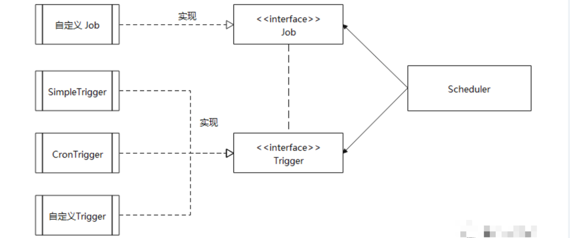

<style>
.orange {
   color: orange
}
.red {
   color: red
}
code {
   color: #0ABF5B;
}
</style>


# 一. 定时任务
主要考虑的点：
- **定时任务如何存储？（持久化或临时保存到特定的数据结构中）**
- **定时任务如何执行？（调度策略和资源管理）**。

<!-- more -->

---

**定时任务执行**：定时任务的执行，是值调度器根据存储的任务信息，在指定时间或条件满足时调用任务逻辑。执行的核心是**调度策略**和**资源管理**。
- **单线程执行**：`Java Timer`，上篇文章做了解析。
- **多线程执行**
  - `Java ScheduledExecutorService`：上篇文章做了解析。
  - `quartz`框架
- **分布式执行** 
  - 阿里巴巴 `schedulerx2.0`


# 二. quartz框架
`quartz`是一个功能强大的开源任务调度框架，专为Java应用程序设计，广泛用于企业级开发中。

## 2.1. 入门示例
- **任务类**：需要实现 `Job` 接口
```java

/**
 * 功能描述: 任务
 */
public class HelloJob implements Job {

    @Override
    public void execute(JobExecutionContext context) throws JobExecutionException {
        // 获取当前时间,并格式化
        Date date = new Date();
        SimpleDateFormat format = new SimpleDateFormat("yyyy-MM-dd HH:mm:ss");
        String dateSrting = format.format(date);
        // 业务功能模拟
        System.out.println("开始备份数据库,时间：" + dateSrting);
    }
}
```
- **调度器 + 触发器**
```java
import org.quartz.*;
import org.quartz.impl.StdSchedulerFactory;
/**
 * 功能描述: 定时器配置
 */
public class HelloSchedulerDemo {
    public static void main(String[] args) throws SchedulerException {
        // 1、调度器 - 从工厂获取调度实例
        Scheduler scheduler = StdSchedulerFactory.getDefaultScheduler();

        // 2、任务实例 - 执行的任务对象
        JobDetail job = JobBuilder.newJob(HelloJob.class)
                .withIdentity("job1", "group1") // 任务名称,组名称
                .build();

        // 3、触发器 - 控制执行次数和执行时间
        Trigger trigger = TriggerBuilder.newTrigger()
                .withIdentity("trigger1", "group1") // 同上
                .startNow() // 立刻启动
                .withSchedule(SimpleScheduleBuilder.simpleSchedule().
                        withIntervalInSeconds(3).
                        withRepeatCount(10))   // 循环10次,每次间隔3s
                .build();

        // 调度器关联触发器,并启动
        scheduler.scheduleJob(job,trigger);
        scheduler.start();
    }
}
```


## 2.2. 核心概念

- `Scheduler`（调度器）
  - **作用**：负责管理任务的注册、触发和执行。
  - **功能**：
    - 启动、暂停、恢复和关闭任务。
    - 将`job`和`Trigger`关联起来。
    - 支持单机和分布式环境下的任务调度。
- `Job`（任务）
  - **作用**：定义具体的业务逻辑，开发者需要实现Job接口并重写`execute(JobExecutionContext context)`方法
  - **特点**：
    - 支持无状态和有状态任务
- `JobDetail`（任务详情）
  - 作用：封装任务的元数据（如名称、组名、描述），并与具体的`Job`类绑定。
- `Trigger`（触发器）
  - **作用**：定义任务的执行规则，定义任务（`Job`）何时被调度器（`Scheduler`）触发执行。
  - **主要类型**
    - `SimpleTrigger`：简单重复任务（固定间隔时间）
    - `CronTrigger`：基于`Cron`表达式的复杂调度（如每天凌晨2点执行）
- `JobStore`（任务存储）
  - **作用**：存储任务和触发器的信息，支持两种模式
    - **内存存储**：适合单机、临时任务。
    - **数据库存储**


## 2.3. 源码解析

### 2.3.1. Scheduler（调度器）
`Scheduler`是一个接口，定义了一系列方法，如启动、暂停、添加。
```java
public interface Scheduler {
  void start() throws SchedulerException;
  void shutdown() throws SchedulerException;
  void addJob(JobDetail var1, boolean var2) throws SchedulerException;
  Date scheduleJob(JobDetail var1, Trigger var2) throws SchedulerException;
}
```
如下为`Scheduler`的创建，通过工厂`StdSchedulerFactory`创建标准的调度器`StdScheduler`:
```java
public class StdSchedulerFactory implements SchedulerFactory {
    public static Scheduler getDefaultScheduler() throws SchedulerException {
        StdSchedulerFactory fact = new StdSchedulerFactory();
        return fact.getScheduler();
    }
    public Scheduler getScheduler() throws SchedulerException {
      if (this.cfg == null) {
        this.initialize();
      }
      SchedulerRepository schedRep = SchedulerRepository.getInstance();
      Scheduler sched = schedRep.lookup(this.getSchedulerName());
      if (sched != null) {
        if (!sched.isShutdown()) {
          return sched;
        }
  
        schedRep.remove(this.getSchedulerName());
      }
      sched = this.instantiate();
      return sched;
    }
}
```
标准调度器`StdScheduler`源码如下，重要内部属性：`QuartzScheduler sched`（任务存储啥的都是靠它）
```java
public class StdScheduler implements Scheduler {
  private QuartzScheduler sched;
  public void start() throws SchedulerException {
    this.sched.start();
  }
}
```

#### 2.3.1.1. 启动 start()
```java
public class QuartzScheduler implements RemotableQuartzScheduler {
  public void start() throws SchedulerException {
    if (!this.shuttingDown && !this.closed) {
      this.notifySchedulerListenersStarting();
//          判断首次启动或恢复启动
      if (this.initialStart == null) {
//          记录初始启动时间
        this.initialStart = new Date();
//        调用JobStore的schedulerStarted方法，初始化底层存储（如打开数据库连接、加载持久化任务）
        this.resources.getJobStore().schedulerStarted();
//        启动插件，激活扩展功能（如日志、监控等）
        this.startPlugins();
      } else {
//          恢复启动
        this.resources.getJobStore().schedulerResumed();
      }
// 启动调度线程，schedThread 是主调度线程，负责轮询触发器并触发任务执行（togglePause，表示取消线程的暂停状态）
      this.schedThread.togglePause(false);
      this.getLog().info("Scheduler " + this.resources.getUniqueIdentifier() + " started.");
      // 通知监听器：调度器已完全启动
      this.notifySchedulerListenersStarted();
    } else {
      throw new SchedulerException("The Scheduler cannot be restarted after shutdown() has been called.");
    }
  }
}
```

#### 2.3.1.2. 启动调度线程
`QuartzSchedulerThread`是调度线程，负责管理任务触发逻辑和协调调度线程与线程池的交互。

核心职责
- **触发器扫描**：定期检查`jobStore`中的触发器（`Trigger`），找出当前时间需执行的任务。
- **任务分发**：将符合条件的任务封装为 `JobRunShell`，提交给线程池（`ThreadPool`）执行。
- **线程管理**：控制自身的启停状态（`Raused/Unpaused`），管理线程的阻塞与唤醒。
- **分布式协调**：在集群环境中，通过锁机制（如`JDBCJobStore`或`RedisJobStore`）确保任务在多节点的唯一性。

```java
public class QuartzSchedulerThread extends Thread {
    
    public void run() {
        // 从 JobStore 批量获取触发器
        List<OperableTrigger> triggers;
        try {
            triggers = this.qsRsrcs.getJobStore().acquireNextTriggers(now + this.idleWaitTime, Math.min(availThreadCount, this.qsRsrcs.getMaxBatchSize()), this.qsRsrcs.getBatchTimeWindow());
        }
        if (triggers != null && !triggers.isEmpty()) {
            now = System.currentTimeMillis();
            long triggerTime = ((OperableTrigger) triggers.get(0)).getNextFireTime().getTime();
            // 获取触发器后，计算其下次触发时间（TriggerTime）与当前时间的差值（timeUntilTrigger）。若差值超过2ms，精确阻塞至触发时间点
            // 2毫秒阈值设计：避免线程唤醒开销导致的时间误差
            for (long timeUntilTrigger = triggerTime - now; timeUntilTrigger > 2L; timeUntilTrigger = triggerTime - now) {
                synchronized (this.sigLock) {
                    if (this.halted.get()) {
                        break;
                    }
                  ....省略
                }
            }
        }
        if (!triggers.isEmpty()) {
            List<TriggerFiredResult> bndles = new ArrayList();
            boolean goAhead = true;
            synchronized (this.sigLock) {
                goAhead = !this.halted.get();
            }

            if (goAhead) {
                try {
                    //触发任务执行，triggersFired将触发器状态更新为“执行中”，防止其他节点重复触发
                    List<TriggerFiredResult> res = this.qsRsrcs.getJobStore().triggersFired(triggers);
                }
            }
        }
    }
}
```


### 2.3.2. 任务存储
首先解析任务的提交过程，解析任务是如何存储的。
```java
public class QuartzScheduler implements RemotableQuartzScheduler {
    private QuartzSchedulerResources resources;
    private QuartzSchedulerThread schedThread;
    private ThreadGroup threadGroup;
    private SchedulerContext context = new SchedulerContext();
    
    public Date scheduleJob(JobDetail jobDetail, Trigger trigger) throws SchedulerException {
        //任务存储
        this.resources.getJobStore().storeJobAndTrigger(jobDetail, trig);
        this.notifySchedulerListenersJobAdded(jobDetail);
        this.notifySchedulerThread(trigger.getNextFireTime().getTime());
        this.notifySchedulerListenersSchduled(trigger);
    }
}
```
```java
public class QuartzSchedulerResources {
    private JobStore jobStore;
}
```

在`StdSchedulerFactory`的`instantiate()`方法中，会去判断创建什么类型的`JobStore`
- `RAMJobStore`：内存存储
- `DefaultClusteredJobStore`：集群存储
- `JDBCJobStore`：数据库存储
```java
public class RAMJobStore implements JobStore {
    //按任务键（jobKey）快速查找任务详情
    protected HashMap<JobKey, JobWrapper> jobsByKey = new HashMap(1000);
    // 按触发器键快速查找触发器详情
    protected HashMap<TriggerKey, TriggerWrapper> triggersByKey = new HashMap(1000);
    // 按任务组分类任务，支持批量操作
    protected HashMap<String, HashMap<JobKey, JobWrapper>> jobsByGroup = new HashMap(25);
//    按触发器组分类触发器，支持批量操作
    protected HashMap<String, HashMap<TriggerKey, TriggerWrapper>> triggersByGroup = new HashMap(25);
//    按触发时间排序的触发器集合，调度器从中选取最近需执行的触发器
    protected TreeSet<TriggerWrapper> timeTriggers = new TreeSet(new TriggerWrapperComparator());
    protected HashMap<String, Calendar> calendarsByName = new HashMap(25);
//    关联任务与其所有触发器，便于触发器变更时更新任务状态
    protected Map<JobKey, List<TriggerWrapper>> triggersByJob = new HashMap(1000);
}
```


### 2.3.3. JobDetail（任务详情）
```java
public class JobDetailImpl implements Cloneable, Serializable, JobDetail {
//    任务名
    private String name;
    private String group;
    private String description;
    private Class<? extends Job> jobClass;
    private JobDataMap jobDataMap;
    private boolean durability;
    private boolean shouldRecover;
    private transient JobKey key;
    public JobDetailImpl() {
        this.group = "DEFAULT";
        this.durability = false;
        this.shouldRecover = false;
        this.key = null;
    }
}
```


### 2.3.4. Trigger（触发器）
定义任务的执行规则，定义任务（Job）何时被调度器（Scheduler）触发执行。
```java
//触发器 - 控制执行次数和执行时间
Trigger trigger = TriggerBuilder.newTrigger()
        .withIdentity("trigger1", "group1") // 同上
        .startNow() // 立刻启动
        .withSchedule(SimpleScheduleBuilder.simpleSchedule().
                withIntervalInSeconds(3).
                withRepeatCount(10))   // 循环10次,每次间隔3s
        .build();
```


### 2.3.5. 任务（Job）执行

#### 2.3.5.1. 首先，注册Job和Trigger
`JobDetail`：定义任务的具体逻辑（实现Job接口的`execute()`方法），并设置元数据（如名称、组名）。
`Trigger`：定义任务的执行规则（如时间间隔、cron表达式）。每个`Trigger`必须绑定一个`JobDetail`。
> 上文中有解析 `JobStore`，内部存储 `JobDetail` 和 `Trigger`。

#### 2.3.5.2. 然后，Scheduler启动与监听
- 调用`scheduler.start()`启动调度器
- 调度器内部会启动一个线程池（`ThreadPool`），用于并发执行任务。

#### 2.3.5.3. 触发器触发任务
1. 扫描可执行的`Trigger`
   * 调度器从数据库或内存中查询当前时间 `>= nextFireTime` 的 `Trigger`。
2. 竞争锁（集群模式）
   * 在分布式环境中，多个调度器实例通过数据库锁竞争资源，确保每个 `Trigger` 只被一个实例处理。
3. 标记 `Trigger` 状态为“已获取”
   * 将 `Trigger` 的状态更新为 `ACQUIRED`，防止其他调度器实例重复触发。
4. 生成`FiredTrigger`实例
   * 创建对象，记录触发时间和上下文信息。


参考文章：
[定时任务的实现原理](https://cloud.tencent.com/developer/article/1769812)


