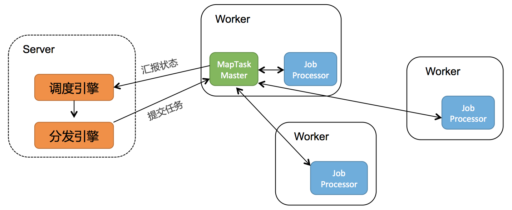

<style>
.orange {
   color: orange
}
.red {
   color: red
}
code {
   color: #0ABF5B;
}
</style>


# 一. Schedulerx2.0
`Schedulerx2.0`是阿里中间件自研的基于`Akka`架构的新一代分布式任务调度平台，提供定时、任务编排、分布式跑批等功能。

<!-- more -->

---

> **定时任务执行**：定时任务的执行，是值调度器根据存储的任务信息，在指定时间或条件满足时调用任务逻辑。执行的核心是**调度策略**和**资源管理**。
> - **单线程执行**：`Java Timer`，上篇文章做了解析。
> - **多线程执行**
>   - `Java ScheduledExecutorService`：上篇文章做了解析。
>   - `quartz`框架
> - **分布式执行** 
>   - 阿里巴巴 `schedulerx2.0`


# 二. 架构
`schedulerx2.0`是中心化的调度框架，包括`Server`和`Worker`。
- `server`：负责任务的触发和回调，通过分发引擎提交任务给`Worker`。
- `work`执行引擎：负责任务的执行。





## 2.1. server


## 2.2. worker执行引擎
分为`TaskMaster, Container, Processor`三层：
- `TaskMaster`: 支持可扩展的**分布式执行框架**，进行整个`jobInstance`的生命周期管理、`container`的资源管理，同时还有`failover`等能力。默认实现`StandaloneTaskMaster`（单机执行），`BroadcastTaskMaster`（广播执行），`MapTaskMaster`（并行计算、内存网格、网格计算），`MapReduceTaskMaster`（并行计算、内存网格、网格计算）。
- `Container`: 执行业务逻辑的容器框架，支持线程/进程/docker/actor等。
- `processor`: 业务逻辑框架，不同的`processor`表示不同的任务类型。


# 三、示例

## 3.1. MapReduce模型

### 3.1.1. 处理分库分表数据
```java
@Component
public class ScanShardingTableJobProcessor extends MapJobProcessor {

    @Autowired
    private XXXService xxxService;

    private final int PAGE_SIZE = 500;

    @Override
    public ProcessResult process(JobContext context) throws Exception {
        String taskName = context.getTaskName();
        Object task = context.getTask();
        if (isRootTask(context)) {
            //先分库
            List<String> dbList = getDbList();
            return map(dbList, "DbTask");
        } else if (taskName.equals("DbTask")) {
            //根据分库去分表
            String dbName = (String)task;
            List<String> tableList = getTableList(dbName);
            return map(tableList, "TableTask");
        } else if (taskName.equals("TableTask")) {
            //如果一个分表也很大，再分页
            String tableName = (String)task;
            Pair<Long, Long> idPair = queryMinAndMaxId(tableName);
            long minId = idPair.getFirst();
            long maxId = idPair.getSecond();
            List<PageTask> tasks = Lists.newArrayList();
            int step = (int) ((maxId - minId) / PAGE_SIZE); //计算分页数量
            if (step > 0) {
                for (long i = minId; i < maxId; i+=step) {
                    tasks.add(new PageTask(tableName, i, (i+step > maxId ? maxId : i+step)));
                }
            } else {
                tasks.add(new PageTask(tableName, minId, maxId));
            }
            return map(tasks, "PageTask");
        } else if (taskName.equals("PageTask")) {
            PageTask pageTask = (PageTask)task;
            String tableName = pageTask.getTableName();
            long startId = pageTask.getStartId();
            long endId = pageTask.getEndId();
            List<Record> records = queryRecord(tableName, startId, endId);
            //TODO handle records
            return new ProcessResult(true);
        }

        return new ProcessResult(false);
    }

    private List<String> getDbList() {
        List<String> dbList = Lists.newArrayList();
        //TODO 返回分库列表
        return dbList;
    }

    private List<String> getTableList(String dbName) {
        List<String> tableList = Lists.newArrayList();
        //TODO 返回分表列表
        return tableList;
    }

    private Pair<Long, Long> queryMinAndMaxId(String tableName) {
        //TODO select min(id),max(id) from [tableName]
        return new Pair<Long, Long>(1L, 10000L);
    }

    private List<Record> queryRecord(String tableName, long startId, long endId) {
        List<Record> records = Lists.newArrayList();
        //TODO select * from [tableName] where id>=[startId] and id<[endId]
        return records;
    }
}
```


参考文章：
[Schedulerx2.0分布式计算原理](https://developer.aliyun.com/article/704121)
