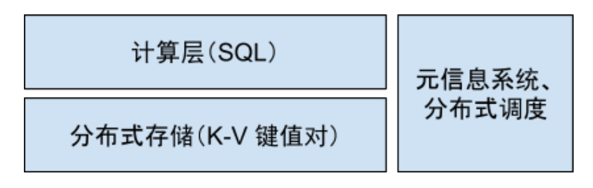
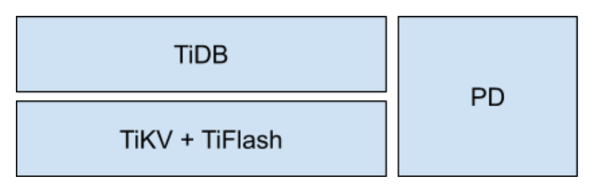
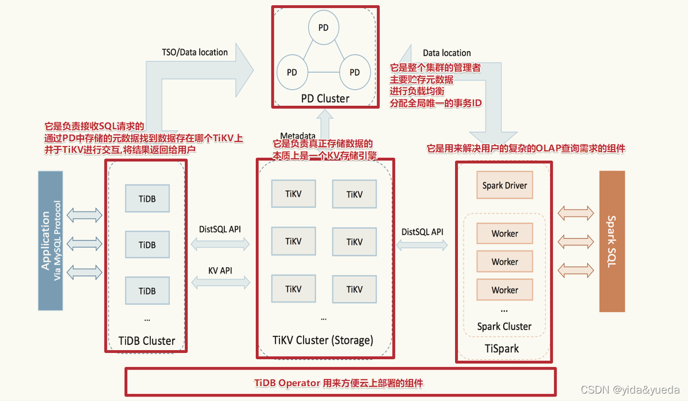
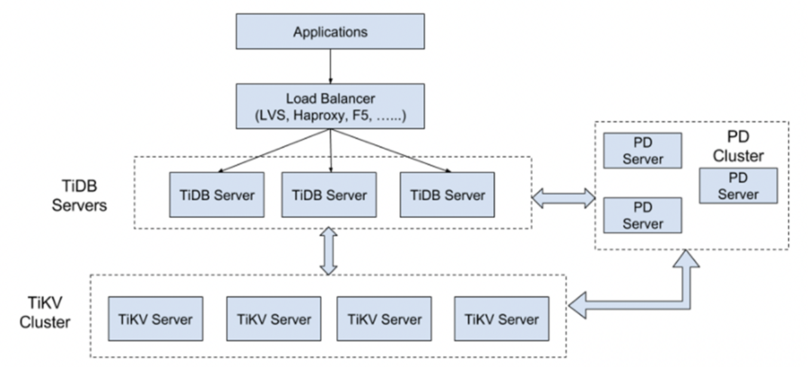
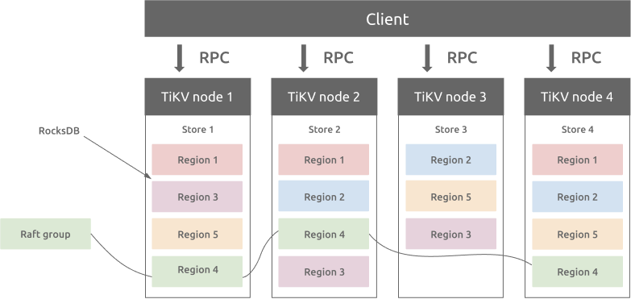
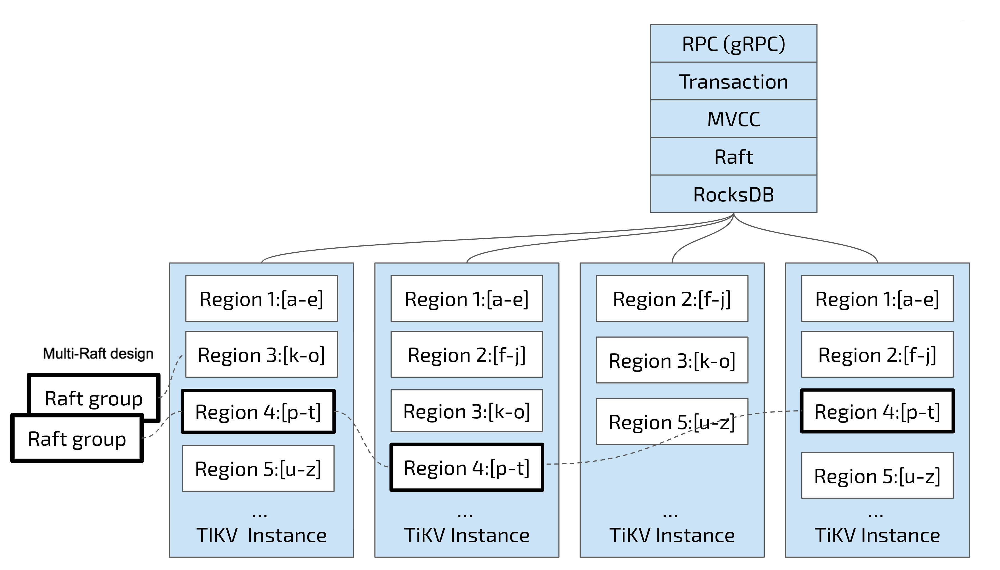
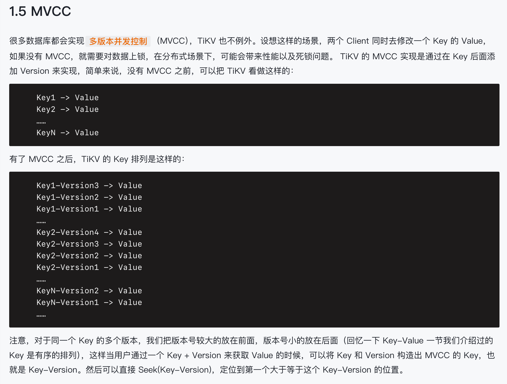
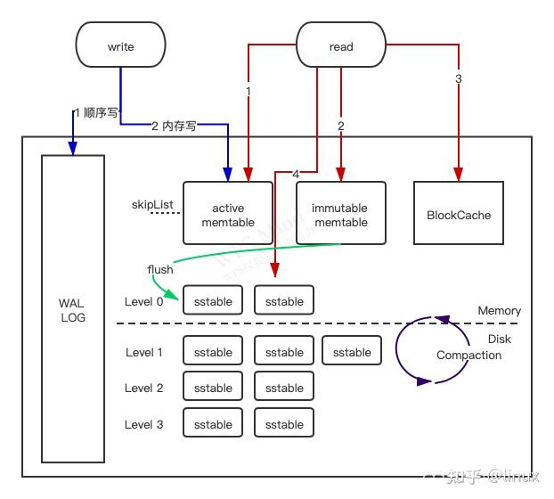
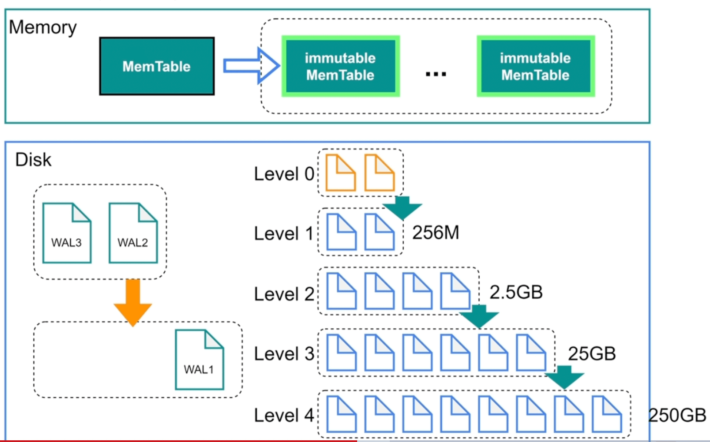

<style>
.my-code {
   color: green;
}
.orange {
   color: rgb(255, 53, 2)
}
.red {
   color: red
}
code {
   color: #6260ff;
}
</style>

# 一、tidb
传统的单机数据库已经在很多场景下表现的力不从心，为了解决海量数据平台的扩展性的问题，TiDB 分布式数据库应运而生

<!--more-->

# 二、特性
相比传统的单机数据库，TiDB 有以下的一些优势：
- 纯分布式架构，拥有良好的扩展性，支持弹性的扩缩容
- 支持 SQL，对外暴露 MySQL 的网络协议，并兼容大多数 MySQL 的语法，在大多数场景下可以直接替换 MySQL
- 默认支持高可用，在少数副本失效的情况下，数据库本身能够自动进行数据修复和故障转移，对业务透明
- 支持 ACID 事务，对于一些有强一致需求的场景友好，例如：银行转账
- 具有丰富的工具链生态，覆盖数据迁移、同步、备份等多种场景

# 三、架构
TiDB 分布式数据库最初的设计受到 Google 内部开发的知名分布式数据库 Spanner 和 F1 的启发，在内核设计上将整体的架构拆分成多个大的模块，大的模块之间互相通信，组成完整的 TiDB 系统。大的架构如下：

这三个大模块相互通信，每个模块都是分布式的架构，在 TiDB 中，对应的这几个模块叫做：


- `TiDB (tidb-server, https://github.com/pingcap/tidb)`: SQL 层，对外暴露 MySQL 协议的连接 endpoint，**负责接受客户端的连接，执行 SQL 解析和优化，最终生成分布式执行计划**。TiDB 层本身是无状态的，实践中可以启动多个 TiDB 实例，客户端的连接可以均匀的分摊在多个 TiDB 实例上以达到负载均衡的效果。tidb-server 本身并不存储数据，只是解析 SQL，将实际的数据读取请求转发给底层的存储层 TiKV。

- `TiKV (tikv-server, https://github.com/pingcap/tikv) `: 分布式 KV 存储，类似 NoSQL 数据库，作为 TiDB 的默认分布式存储引擎，支持完全弹性的扩容和缩容，数据分布在多个 TiKV 存储节点中，系统会动态且自动地进行均衡，绝大多数情况下不需要人工介入。与普通的 NoSQL 系统不一样的是，TiKV 的 API 能够在 KV 键值对层面提供对分布式事务的原生支持，默认提供了 SI （Snapshot Isolation）的隔离级别，这也**是 TiDB 在 SQL 层面支持分布式事务的核心**，上面提到的 TiDB SQL 层做完 SQL 解析后，会将 SQL 的执行计划转换为实际对 TiKV API 的调用。所以实际上数据都是存储在 TiKV 中。另外，TiKV 中的数据都会自动维护多副本（默认为 3），天然支持高可用和自动故障转移。TiFlash 是一类特殊的存储节点，和普通 TiKV 节点不一样的是，在 TiFlash 内部，数据是以列式的形式进行存储，主要的功能是为分析型的场景加速。后面的章节会详细介绍。

- `Placement Driver (pd-server，简称 PD，https://github.com/pingcap/pd)`: 整个 TiDB 集群的元信息管理模块，负责存储每个 TiKV 节点实时的数据分布情况和集群的整体拓扑结构，提供 Dashboard 管控界面，并为分布式事务分配事务 ID。PD 不仅仅是单纯的元信息存储，同时 PD 会根据 TiKV 节点实时上报的数据分布状态，下发数据调度命令给具体的 TiKV 节点，可以说是整个集群的「大脑」，另外 PD 本身也是由至少 3 个对等节点构成，拥有高可用的能力。


个人理解：

| 模块          | MySQL对应模块     | 描述                              |
|-------------|---------------|---------------------------------|
| tidb-server | mysql server端 | server端，负责与客户端交互，进行SQL解析，生成执行计划 |
| tikv-server | innodb        | 负责数据的存储                         |
| pd-server   | zookeeper     | 元数据管理                           |




## 3.1、架构小结
如下图为`TIDB`的整体架构。

- `应用层` 发起查询请求，通过 MySQL 协议连接到 TiDB 集群
- `LVS` 负载均衡层 将请求分发到某个 TiDB Server 实例
- `TiDB Server` 解析、优化查询语句，生成执行计划，向 PD Server 查询数据分布，并通过 TiKV Client 发起查询
- `PD Server` 返回相关 Region 的分布和位置信息
- `TiKV Server` 根据请求从对应的 Region 检索数据，并进行过滤、排序等操作，返回给 TiDB Server
- `TiDB Server` 整合数据并将最终结果返回给应用程序

# 五、核心组件【PD Server】

## 5.1、PD Server 主要工作有三个
- 一是存储集群的元信息（某个 Key 存储在哪个 TiKV 节点）
  - tikv server会心跳上报信息
- 二是对 TiKV 集群进行调度和负载均衡（如数据的迁移、Raft group leader 的迁移等）
- 三是分配全局唯一且递增的事务 ID

## 5.2、PD Server 架构
PD 通过 Raft 协议保证数据的安全性。Raft 的 leader server 负责处理所有操作，其余的 PD server 仅用于保证高可用。建议部署奇数个 PD 节点。


# 六、核心组件【TIDB Server】


# 七、核心组件【Tikv Server】
`TiKV` 是一个分布式事务型的键值数据库，提供了满足 `ACID` 约束的分布式事务接口，并且通过 `Raft` 协议保证了多副本数据一致性以及高可用。`TiKV` 作为 `TiDB` 的存储层，为用户写入 `TiDB` 的数据提供了持久化以及读写服务，同时还存储了 `TiDB` 的统计信息数据。

将数据按照 `key` 的范围划分成大致相等的切片（下文统称为 `Region`），每一个切片会有多个副本（通常是 3 个），其中一个副本是 Leader，提供读写服务。TiKV 通过 PD 对这些 Region 以及副本进行调度，以保证数据和读写负载都均匀地分散在各个 TiKV 上，这样的设计保证了整个集群资源的充分利用并且可以随着机器数量的增加水平扩展。


## 7.1、Region分区机制

### 7.1.1、数据分片

- 数据按Key范围划分为多个 Region（默认大小约`90-120MB`），每个Region是独立的数据分片单元。
  - 基于Key的字节序范围划分，tikv 启动时，整个键空间被划分为一个初始 Region，其范围是["","")（即从空字符串到无穷大）
- 每个Region有多个副本（默认3个），其中一个副本作为leader，负责处理写请求，其他副本作为follower同步数据。

#### 具体分片
在Tikv中，每个Region的数据范围由start_key和end_key定义，这两个键值（Key）是基于数据的编码规则生成的，用于唯一标识一个Region管理的键值对范围。

TIDB中的数据（表、索引等）在存储到Tikv时，会通过编码规则转换成一个全局有序的字节流（key-value）。编码规则如下：

**表数据的Key结构：**
```
tablePrefix + tableID + recordPrefixSep + rowID
```
- `tablePrefix`：标识表数据的固定前缀（如t）
- `tableID`：表的唯一ID。
- `recordPrefixSep`：分隔符（如_r）
- `rowID`：行数据的主键值

**索引数据的Key结构**
```
tablePrefix + tableID + indexPrefixSep + indexID + indexedColumnsValue
```
- `indexPrefixSep`：索引分隔符（如_i）
- `indexID`：索引的唯一ID
- `indexedColumnsValue`：索引列的值组合

通过这种编码，所有表、索引的Key在Tikv中是全局有序的。

##### 示例
假设有一个表 user，其 tableID 为100，主键为 id。

表结构
```
CREATE TABLE user (
  id INT PRIMARY KEY,
  name VARCHAR(20)
```
插入数据
```
INSERT INTO user VALUES (1, 'Alice'), (2, 'Bob'), (3, 'Charlie');
```
编码后的Key（简化表示）
```
t100_r1 -> {id=1, name='Alice'}
t100_r2 -> {id=2, name='Bob'}
t100_r3 -> {id=3, name='Charlie'}
```
region范围：
```
start_key: t100_r1
end_key:   t100_r3
```
该`region`包含`id=1` 到 `id=3` 之间的所有数据


### 7.1.2、动态扩展
- `Region分裂`：当数据量超过阈值时，自动分裂为两个子Region
- `Region合并`：当数据因删除操作变得过小，相邻Region可合并（需手动触发）。

假设上述Region因数据量过大需要分裂，选择分裂点为 t100_r2

**原Region**
```
start_key: t100_r1
end_key:   t100_r2
```
**新Region**
```
start_key: t100_r2
end_key:   t100_r3
```
分离后，原Region管理 id=1 到 id=2 的数据，新 region 管理 id=2 到 id=3 的数据

## 7.2、Raft协议与数据一致性
副本管理
- 每个Region的副本通过`raft协议`维护数据一致性。
- 写请求必须在leader上执行，并同步到多数分布（超过半数）后才视为成功。
- leader故障时，副本通过raft选举新leader，确保服务连续性

## 7.3、事务模型与MVCC

### 7.3.1、percolator 事务模型
依赖`全局唯一时间戳（TSO）`，由PD Server分配，保证事务的顺序性和一致性。

事务流程：
1. 客户端向PD获取`StarTS`（事务开始时间戳）
2. 执行读写操作，最终提交时获取`CommitTS`（提交时间戳）
3. 通过`两阶段提交（2PC）`确保事务原子性。

### 7.3.2、MVCC（多版本并发控制）
- 每个键值对保存多个版本（基于时间戳），支持快照读取和历史数据查询。
- 通过`RocksDB`的底层实现管理版本，自动清理过期数据。



## 7.4、存储引擎：RocksDB
RocksDB 是一个基于键值对存储接口的存储引擎库，其中键和值是任意字节流。RocksDB 将所有数据按排序顺序组织起来，常用的操作有Get(key), NewIterator(), Put(key, val), Delete(key), 和SingleDelete(key)。

### 7.4.1、RocksDB的核心架构
RocksDB 基于 **LSM-Tree（Log-Structured Merge Tree）** 设计，核心组件包括：
- **MemTable**：内存中的可变数据结构（如跳表），用于缓存写入的键值对。
- **Immutable MemTable**：当 MemTable 写满后变为只读状态，等待刷入磁盘。
- **SSTable（Sorted String Table）**：磁盘上的不可变有序文件，分为多个层级（Level 0 到 Level N）。
- **Write-Ahead Log (WAL)**：持久化写入日志，防止数据丢失。
- **Compaction**：后台进程合并和整理 SSTable 文件，删除过期数据，优化读取性能。
  

#### LSM-Tree
LSM树，即日志结构合并树(Log-Structured Merge-Tree)。其实它并不属于一个具体的数据结构，它更多是一种数据结构的设计思想。大多NoSQL数据库核心思想都是基于LSM来做的，只是具体的实现不同。

传统关系型数据库使用btree或一些变体作为存储结构，能高效进行查找。但保存在磁盘中时它也有一个明显的缺陷，那就是逻辑上相离很近但物理却可能相隔很远，这就可能造成大量的磁盘随机读写。随机读写比顺序读写慢很多，为了提升IO性能，我们需要一种能将随机操作变为顺序操作的机制，于是便有了LSM树。

TiKV的存储数据结构是基于[`rocksdb`](https://github.com/facebook/rocksdb) 的 LSM-Tree (全称是 *Log-Structured Merge*-*tree*)，存储的格式是KV键值对，通过分块 + 二分查找的方式找到对应的记录。

LSM-Tree会在内存中分配1个`MemTable`块和若干个 `immutable MemTable`，这些块以链表的形式连接在一起；同理磁盘中的 `SSTable` 也会按照层级串联起来且大小不断递增；需要注意的是 `Level 0` 的 SSTable 数据是 `immutable MemTable` 数据的复刻 (rocksdb会尽可能块地将 immutable MemTables 刷盘到 L0的SSTable中)。

> 内存中的`immutable MemTable` = 磁盘中的 `Level 0 SSTable`

当 `MemTable` 填满时，会刷盘到`immutable MemTable`，后台进程会将`immutable MemTable` 的数据刷新到磁盘中Level 0 的 SSTable ，当Level 0 的SSTABLE文件达到4个时，会进行压缩并存储到Level 1，以此类推。

写操作时，直接将写请求记录在内存的`MemTable` 和磁盘的 `WAL` 日志即可

读操作时，TiKV在 MemTable 上有提供了一个`Block Cache` 的缓存，用于缓存最近最常读取的数据，`Block Cache` 中没有再依次读取`MemTable`、`immutable MemTable`、`SSTable`

还需要注意一点数据写入都是到内存的MemTable，那么如何保证一致性？

答案是：WAL —— `Write Ahead Log`


### 7.4.2、RocksDB 的写入流程
1. **写入 WAL**：所有写入操作首先追加到 WAL 文件，确保数据持久性。
2. **更新 MemTable**：数据写入内存中的 MemTable（跳表结构保证有序性）。
3. **MemTable 切换**：当 MemTable 写满后，转为 Immutable MemTable，并创建新的 MemTable。
4. **刷盘（Flush）**：后台线程将 Immutable MemTable 刷入磁盘，生成 Level 0 的 SSTable 文件。

### 7.4.3、RocksDB 的读取流程
1. **查询 MemTable**：优先从内存中的 MemTable 查找数据。
2. **查询 Immutable MemTable**：若未找到，检查待刷盘的 Immutable MemTable。
3. **查询 SSTable**：逐层查询磁盘上的 SSTable 文件（从 Level 0 到最高层），利用布隆过滤器（Bloom Filter）加速查找。


参考文章：
https://book.tidb.io/SUMMARY.html
http://v5blog.cn/pages/ff1759/#_2%E3%80%81tidb-server%E6%A0%B8%E5%BF%83%E8%83%BD%E5%8A%9B
https://www.cnblogs.com/luohaixian/p/18303793
https://www.qtmuniao.com/2023/06/05/how-rocksdb-works/