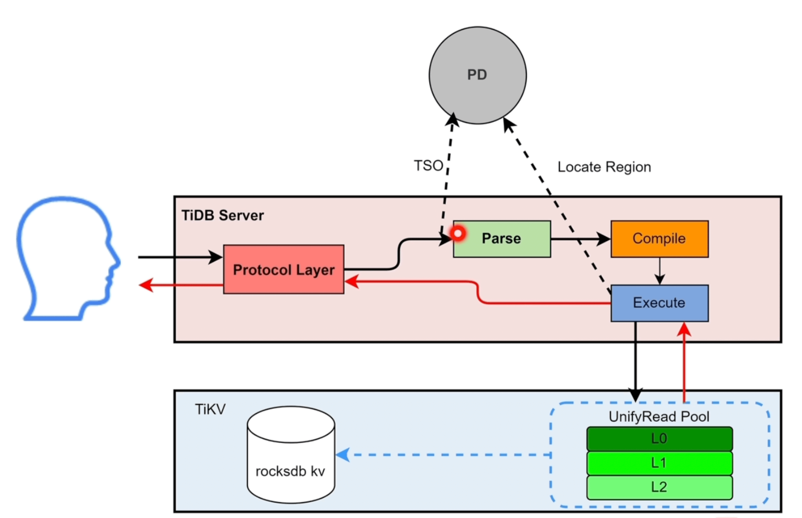
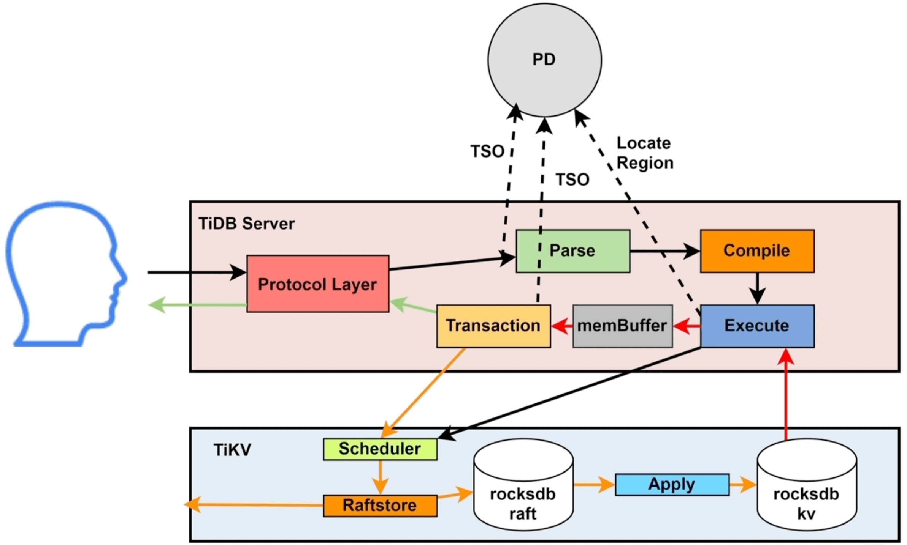

# 一、tidb
传统的单机数据库已经在很多场景下表现的力不从心，为了解决海量数据平台的扩展性的问题，TiDB 分布式数据库应运而生

<!--more-->

# 二、SQL运算

## 2.1、DML - 读操作

1. SQL 会被**TiDB Server** 中的`Protocol Layer` 协议层接收
2. **TiDB Server** 请求 PD 节点获取 TSO，标记为 `start_ts` 开始执行时间
3. 进入`Parse` 解析模块，将SQL语句解析为 AST 语法树
4. 将 AST 语法树交给`Compile` 模块，通过编译优化后，生成对应的`SQL Plan` 执行计划
5. SQL Plan 进入`Execute` 模块，`Execute` 先去`information schema` 缓存中获取表的元数据信息。如果是简单的点查，会下发到 `kv` 模块；如果是相对复杂的任务，会下发到 `DistSQL` 模块，由它们具体调用 client 请求 **TiKV**
6. 读请求到达 **TiKV** 后，会生成 snapshot 快照，进入`UnifyRead Pool`线程池
7. TiKV 会从`read pool`中拿到快照，并请求 `rocksdb kv` 执行查询&#x20;
   
   

## 2.2、DML - 写操作

前4步和读操作基本类似，这里我们直接从第5步开始
1. `Execute` 模块去 **TiKV** 查询需要修改的数据，此步骤和读操作类似
2. **TiDB Server** 拿到需要修改的原始数据后，将数据更新到 `memBuffer` 缓存；如果此时发生写冲突，需要请求PD获取 `for_update_ts` 时间戳 (悲观锁)
3. 用户发起提交后，调用 `Transaction` 模块发起两阶段提交 (2PC)，写操作都是`Transaction` 通过`KV`模块调用**TiKV**
4. 写操作会先发送给 **TiKV** 的`Scheduler`模块，它负责负责协调事务并发写入冲突，并将收到的写请求向下传递给`Raftsotre`
5. `Raftsotre` 模块拿到请求后会生成 `raft log` ，将`raft log`写入本地(*leader*)的 `rocksdb raft` 后，同步给 *follower*
6. 当过半follower将`raft log`写入本地`rocksdb raft` 并返回成功后，调用Apply模块将数据持久化到 `rocksdb kv` ，成功后返回 **TiDB Server**，至此2PC 的第一步完成
7. **TiDB Server** 再次请求 PD 获取 `commit_ts` 提交的TSO，再次调用**TiKV** 写入`commit_ts`
8. 最终将提交成功返回给用户
   

参考文章：
https://tidb.net/blog/fe4f7b05#%E5%88%86%E5%8A%9F%E8%83%BD%E6%A2%B3%E7%90%86/DML%20-%20%E8%AF%BB%E6%93%8D%E4%BD%9C