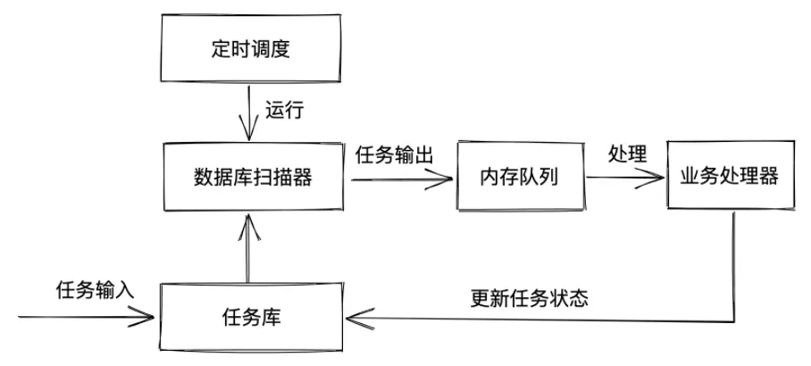
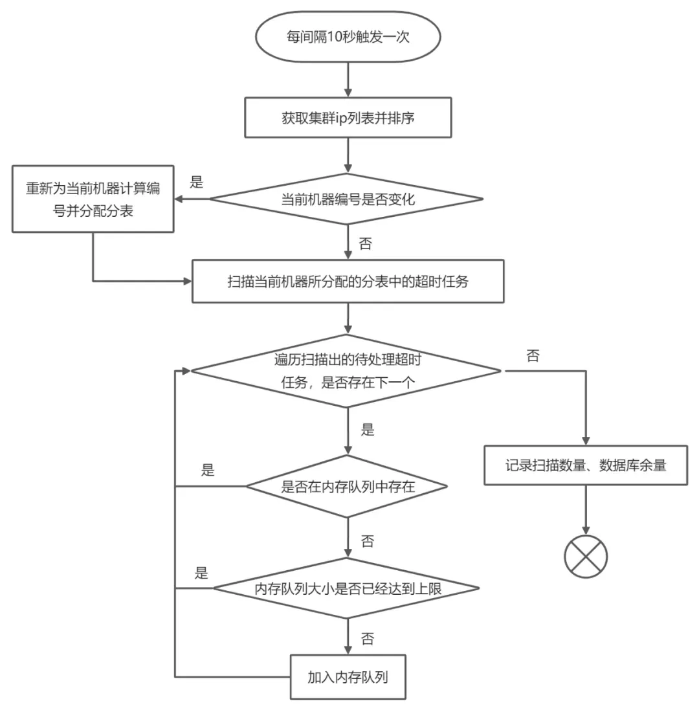
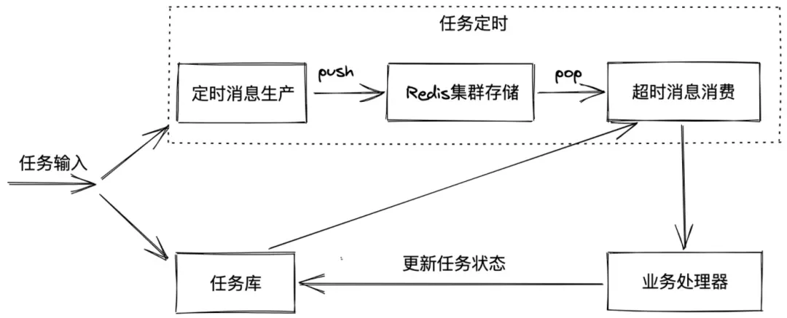
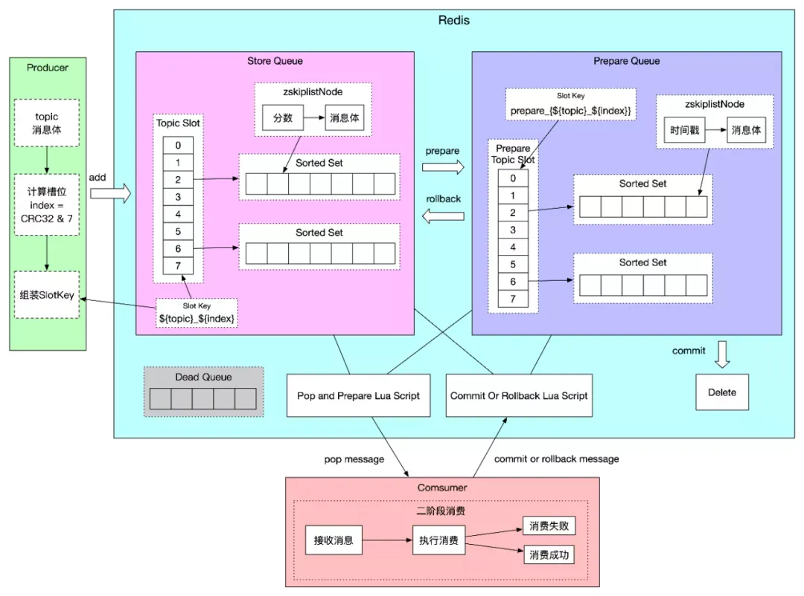

<style>
.orange {
   color: orange
}
.red {
   color: red
}
code {
   color: #0ABF5B;
}
</style>


# 一. 超时中心
在很多产品中都存在生命周期相关的设计，时间节点到了之后需要做对应的事情。

**超时中心**（`TimeOutCenter，TOC`）负责存储和调度生命周期节点上面的超时任务，当超时任务设置的超时时间到期后，超时中心需要立即调度处理这些超时任务。对于一些需要低延迟的超时场景，超时中心调度延迟会给产品带来不可估量的影响。

因此本文提出一种低延迟的**超时中心**实现方式，首先介绍传统的超时中心的实现方案，以及传统方案中的缺点，然后介绍低延迟的方案，说明如何解决传统方案中的延迟问题。

<!-- more -->

# 二. 传统高延迟方案

## 2.1. 整体框架
传统的超时中心整体框架如下所示，任务输入后存储在超时任务库中，定时器触发运行数据库扫描器，数据库扫描器从超时任务库中扫描已经到达超时时间的任务，已经到达超时时间的任务存储在机器的内存队列中，等待交给业务处理器进行处理，业务处理器处理完成后更新任务状态。

在大数据时代，超时任务数量肯定是很大的，传统的超时中心通过分库分表支持存储海量的超时任务，定时器触发也需要做相应的改变，需要充分利用集群的能力，下面分别从超时任务库和定时器触发两方面详细介绍。


## 2.2. 任务库设计
任务库数据模型如下所示，采用分库分表存储，一般可设计为8个库1024个表，具体可以根据业务需求调整。biz_id为分表键，job_id为全局唯一的任务ID，status为超时任务的状态，action_time为任务的执行时间，attribute存储额外的数据。只有当action_time小于当前时间且status为待处理时，任务才能被扫描器加载到内存队列。任务被处理完成后，任务的状态被更新成已处理。
```
job_id                        bigint unsigned      超时任务的ID，全局唯一
gmt_create                    datetime             创建时间
gmt_modified                  datetime             修改时间
biz_id                        bigint unsigned      业务id，一般为关联的主订单或子订单id
biz_type                      bigint unsigned      业务类型
status                        tinyint              超时任务状态（0待处理，2已处理，3取消）
action_time                   datetime             超时任务执行时间
attribute                     varchar              额外数据
```

## 2.3. 定时调度设计
定时调度流程图如下所示，定时器每间隔10秒触发一次调度，从集群`configserver`中获取集群ip列表并为当前机器编号，然后给所有`ip`分配表。分配表时需要考虑好几件事：
- 一张表只属于一台机器，不会出现重复扫描；
- 机器上线下线需要重新分配表。当前机器从所分配的表中扫描出所有状态为待处理的超时任务，遍历扫描出的待处理超时任务。

对于每个超时任务，当内存队列不存在该任务且内存队列未满时，超时任务才加入内存队列，否则循环检查等待。


## 2.4. 缺点
- 需要定时器定时调度，定时器调度间隔时间加长了超时任务处理的延迟时间；
- 数据库扫描器为避免重复扫描数据，一张表只能属于一台机器，任务库分表的数量就是任务处理的并发度，并发度受限制；
- 当单表数据量庞大时，即使从单张表中扫描所有待处理的超时任务也需要花费很长的时间；
- 本方案总体处理步骤为：先扫描出所有超时任务，再对单个超时任务进行处理；超时任务处理延迟时间需要加上超时任务扫描时间；
- 本方案处理超时任务的最小延迟为定时器的定时间隔时间，在任务数量庞大的情况下，本方案可能存在较大延迟。


# 三. 低延迟方案

## 3.1. 整体框架
任务输入后分为两个步骤。
- **第一个步骤**是将任务存储到任务库，本方案的任务库模型设计和上面方案中的任务库模型设计一样；
- **第二步骤**是任务定时，将任务的`jobId`和`actionTime`以一定方式设置到`Redis`集群中，当定时任务的超时时间到了之后，从`Redis`集群`pop`超时任务的`jobId`，根据`jobId`从任务库中查询详细的任务信息交给业务处理器进行处理，最后更新任务库中任务的状态。

本方案与上述方案最大的不同点就是**超时任务的获取部分**，上述方案采用定时调度扫描任务库，本方案采用基于`Redis`的任务定时系统，接下来将具体讲解任务定时的设计。


## 3.2. Redis存储设计


### 3.2.1. Topic的设计
`Topic`的定义有三部分组成:
- `topic`表示主题名称
- `slotAmount`表示消息存储划分的槽数量
- `topicType`表示消息的类型。

主题名称是一个`Topic`的唯一标示，相同主题名称`Topic`的`slotAmount`和`topicType`一定是一样的。消息存储采用`Redis`的`Sorted Set`结构，为了支持大量消息的堆积，需要把消息分散存储到很多个槽中，`slotAmount`表示该`Topic`消息存储共使用的槽数量，槽数量一定需要是`2的n`次幂。在消息存储的时候，采用对指定数据或者消息体哈希求余得到槽位置。

### 3.2.2. StoreQueue的设计

上图中topic划分了8个槽位，编号`0-7`。计算消息体对应的`CRC32`值，`CRC32`值对槽数量进行取模得到槽序号，`SlotKey`设计为`#{topic}_#{index}`（也即Redis的键），其中#{}表示占位符。

`StoreQueue`结构采用`Redis`的`Sorted Set`，Redis的`Sorted Set`中的数据按照分数排序，实现定时消息的关键就在于如何利用分数、如何添加消息到`Sorted Set`、如何从`Sorted Set`中弹出消息。定时消息将时间戳作为分数，消费时每次弹出分数大于当前时间戳的一个消息。

### 3.2.3. PrepareQueue的设计

为了保障每条消息至少消费一次，消费者不是直接pop有序集合中的元素，而是将元素从`StoreQueue`移动到`PrepareQueue`并返回消息给消费者，等消费成功后再从`PrepareQueue`从删除，或者消费失败后从`PrepareQueue`重新移动到`StoreQueue`，这便是根据二阶段提交的思想实现的二阶段消费。

在后面将会详细介绍二阶段消费的实现思路，这里重点介绍下`PrepareQueue`的存储设计。`StoreQueue`中每一个Slot对应`PrepareQueue`中的`Slot`，`PrepareQueue`的`SlotKey`设计为`prepare_{#{topic}#{index}}`。`PrepareQueue`采用`Sorted Set`作为存储，消息移动到`PrepareQueue`时刻对应的（秒级时间戳*1000+重试次数）作为分数，字符串存储的是消息体内容。这里分数的设计与重试次数的设计密切相关，所以在重试次数设计章节详细介绍。

`PrepareQueue`的`SlotKey`设计中需要注意的一点，由于消息从`StoreQueue`移动到`PrepareQueue`是通过`Lua`脚本操作的，因此需要保证Lua脚本操作的`Slot`在同一个`Redis`节点上，如何保证`PrepareQueue`的`SlotKey`和对应的`StoreQueue`的`SlotKey`被`hash`到同一个`Redis`槽中呢。Redis的`hash tag`功能可以指定`SlotKey`中只有某一部分参与计算hash，这一部分采用`{}`包括，因此`PrepareQueue`的`SlotKey`中采用`{}`包括了`StoreQueue`的`SlotKey`。

### 3.2.4. DeadQueue的设计

消息重试消费16次后，消息将进入`DeadQueue`。`DeadQueue`的`SlotKey`设计为`prepare{#{topic}#{index}}`，这里同样采用`hash tag`功能保证`DeadQueue`的`SlotKey`与对应StoreQueue的SlotKey存储在同一Redis节点。

## 3.3. 定时消息生产

生产者的任务就是将消息添加到StoreQueue中。首先，需要计算出消息添加到Redis的SlotKey，如果发送方指定了消息的slotBasis（否则采用content代替），则计算slotBasis的CRC32值，CRC32值对槽数量进行取模得到槽序号，SlotKey设计为#{topic}_#{index}，其中#{}表示占位符。发送定时消息时需要设置actionTime，actionTime必须大于当前时间，表示消费时间戳，当前时间大于该消费时间戳的时候，消息才会被消费。因此在存储该类型消息的时候，采用actionTime作为分数，采用命令zadd添加到Redis。

## 3.4. 超时消息消费

每台机器将启动多个Woker进行超时消息消费，Woker即表示线程，定时消息被存储到Redis的多个Slot中，因此需要zookeeper维护集群中Woker与slot的关系，一个Slot只分配给一个Woker进行消费，一个Woker可以消费多个Slot。Woker与Slot的关系在每台机器启动与停止时重新分配，超时消息消费集群监听了zookeeper节点的变化。

`Woker`与Slot关系确定后，Woker则循环不断地从Redis拉取订阅的Slot中的超时消息。在StoreQueue存储设计中说明了定时消息存储时采用Sorted Set结构，采用定时时间actionTime作为分数，因此定时消息按照时间大小存储在Sorted Set中。因此在拉取超时消息进行只需采用Redis命令ZRANGEBYSCORE弹出分数小于当前时间戳的一条消息。

为了保证系统的可用性，还需要考虑保证定时消息至少被消费一次以及消费的重试次数，下面将具体介绍如何保证至少消费一次和消费重试次数控制。

至少消费一次

至少消费一次的问题比较类似银行转账问题，A向B账户转账100元，如何保障A账户扣减100同时B账户增加100，因此我们可以想到二阶段提交的思想。第一个准备阶段，A、B分别进行资源冻结并持久化undo和redo日志，A、B分别告诉协调者已经准备好；第二个提交阶段，协调者告诉A、B进行提交，A、B分别提交事务。本方案基于二阶段提交的思想来实现至少消费一次。

Redis存储设计中`PrepareQueue`的作用就是用来冻结资源并记录事务日志，消费者端即是参与者也是协调者。第一个准备阶段，消费者端通过执行Lua脚本从StoreQueue中Pop消息并存储到PrepareQueue，同时消息传输到消费者端，消费者端消费该消息；第二个提交阶段，消费者端根据消费结果是否成功协调消息队列服务是提交还是回滚，如果消费成功则提交事务，该消息从PrepareQueue中删除，如果消费失败则回滚事务，消费者端将该消息从PrepareQueue移动到StoreQueue，如果因为各种异常导致PrepareQueue中消息滞留超时，超时后将自动执行回滚操作。二阶段消费的流程图如下所示。


## 3.5. 至少消费一次

至少消费一次的问题比较类似银行转账问题，A向B账户转账100元，如何保障A账户扣减100同时B账户增加100，因此我们可以想到二阶段提交的思想。第一个准备阶段，A、B分别进行资源冻结并持久化undo和redo日志，A、B分别告诉协调者已经准备好；第二个提交阶段，协调者告诉A、B进行提交，A、B分别提交事务。本方案基于二阶段提交的思想来实现至少消费一次。

Redis存储设计中`PrepareQueue`的作用就是用来冻结资源并记录事务日志，消费者端即是参与者也是协调者。第一个准备阶段，消费者端通过执行Lua脚本从StoreQueue中Pop消息并存储到PrepareQueue，同时消息传输到消费者端，消费者端消费该消息；第二个提交阶段，消费者端根据消费结果是否成功协调消息队列服务是提交还是回滚，如果消费成功则提交事务，该消息从PrepareQueue中删除，如果消费失败则回滚事务，消费者端将该消息从PrepareQueue移动到StoreQueue，如果因为各种异常导致PrepareQueue中消息滞留超时，超时后将自动执行回滚操作。二阶段消费的流程图如下所示。

## 3.6. 

参考文章：
[一种低延迟的超时中心实现方式](https://developer.aliyun.com/article/784457)
