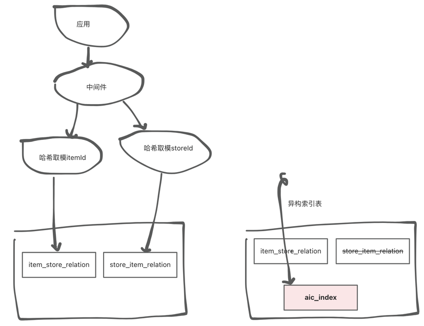

    这是性能优化系列的第二篇文章，主要介绍的是数据库使用的相关优化。

### 一、背景
在阿里的工作中，经历的业务繁多，也累积了丰富的数据库使用优化经验。   
本文通过分享多个优化案例来对该部分内容进行说明。    

    1、商品货架关系优化。
    2、交易定时任务查询优化。

<!-- more -->

### 二 案例1：商品货架关系优化
| 术语        | 描述    |
|:---| ---:|
| 商品适用门店    | 商品能够销售的门店 |
| 货架关系 | 展示商品  |

商品和店铺有2个关联表，item_store_relation和store_item_relation表，单库64表。   
**表结构如下：**
```dtd
商品适用门店表：
item_store_relation {
    item_id: long 分表键
    store_id: long
    UNIQUE (item_id, store_id)
} 
货架关系表：
store_item_relation {
    store_id: long 分表键
    item_id,
    UNIQUE (store_id, item_id)
}
```

**商品货架关系业务场景：**
*业务说明：*
在更新商品业务中，会更新商品的可销售门店信息，此时会先根据itemId去查item_store_relation & store_item_relation2张表得到所有的storeId，2者进行业务计算，最终去更新数据库。

participant 业务
participant 商品发布系统
database mysql

业务->商品发布系统 : 更新商品门店信息
商品发布系统->mysql: 根据itemId分页查询出所有的item_store_relation
mysql-->商品发布系统: 返回store_id
商品发布系统->mysql: 根据itemId分页查询出所有的store_item_relation
mysql-->商品发布系统: 返回store_id
商品发布系统->商品发布系统: 业务计算，得出结果集。
商品发布系统->mysql: 更新数据库



整个业务过程存在问题（主要是大的连锁品牌，存在1W+个门店）：
> 问题1：分库分表的查询问题，在查询store_item_relation时，只能通过itemId遍历所有的store_item_relation表（itemId不是分布键，storeId才是），导致性能特别差，最终导致接口耗时高，业务调用时频繁出现接口超时问题，也会导致商品分布系统MySQL的负载增加，影响系统稳定性。
> 问题1：分库分表的查询问题，一般情况下，商品适用门店和货架关系，数据量是会一致的，但是某些场景，会存在2者数据量不一致的情况（例如item_store_relation < store_item_relation），因此不能通过item_store_relation获取的storeId去查询store_item_relation，只能通过itemId遍历所有的store_item_relation表，导致性能特别差，最终导致接口耗时高，业务调用时频繁出现接口超时问题，也会导致商品分布系统MySQL的负载增加，影响系统稳定性。

#### ⭐️优化1：采用“游标” + “并发”优化查询

##### “游标”
分页查询，加入游标后，可提升查询效率。     
优化前SQL：
```dtd
select store_d from item_store_relation where item_id = ? order by store_id limit 0, 100;
```
优化后SQL：
```dtd

select store_id from item_store_relation where item_id = ? and store_id > ? order by store_id limit 0, 100;
```

##### “并发”
针对性能问题，采用的方案是先从item_store_relation获取所有的storeId，再通过分组、多线程异步去获取store_item_relation数据。 
示例代码如下：
```java
public static List<Long> queryAllStoreId(Long itemId) {
    //此处省略具体的service方法
    List<ItemStoreRelation> itemStoreRelationList = new ArrayList<>();
    //对storeId分组
    Map<Long, List<Long>> groupedObjects = itemStoreRelationList.stream()
            .map(ItemStoreRelation::getStoreId)
            .collect(Collectors.groupingBy(obj -> obj % 64));

    List<CompletableFuture<List<StoreItemRelation>>> futures = new ArrayList<>();
    // 遍历分组后的结果
    for (List<Long> storeIdList : groupedObjects.values()) {
        CompletableFuture<List<StoreItemRelation>> future = CompletableFuture.supplyAsync(() -> 
                //查询store_item_relation
                queryByStoreIds(storeIdList)
        );
        futures.add(future);
    }

    return futures.stream()
            .map(CompletableFuture::join)
            .flatMap(List::stream)
            .map(StoreItemRelation::getStoreId)
            .collect(Collectors.toList());
}
```

- 优化结果：
  - 接口由原来的3s+优化到了100ms，解决了性能问题。
- 带来的问题：
  - 因为对业务的不熟悉，以为2张关联表的数据是正反关系，数据量是会一致的，实际在某些场景，会存在2者数据量不一致的情况（例如item_store_relation < store_item_relation），因此不能通过item_store_relation获取的storeId去查询store_item_relation。

因此接下来就是考虑其他方案了，考虑如何保存store_item_relation的数据，最终内部讨论，引入索引表，方案如下。

#### ⭐️解决分库分表的查询问题
本文重点：“异构索引表”是可以解决这个问题的。

##### 引入异构索引表 
简单来说，“异构索引表”是一个拿空间换时间的设计。具体如下：  
 
引入异构索引表，代替store_item_relation功能，索引ID=itemId，索引值=storeId，再需要去获取货架关系时，只需要通过itemId去异构索引表获取数据，能充分利用分表键从而大大的提高查询效率。  
表结构如下：  
```dtd
aic_index {
    id: 主键ID
    index_id: 索引ID  (itemId，分表键)
    index_value: 索引值  (storeId)
    UNIQUE (index_id, index_value)
}
```
更新后的时序图：    

participant 业务
participant 商品发布系统
database mysql

业务->商品发布系统 : 更新商品门店信息
商品发布系统->mysql: select store_id from item_store_relation where item_id=?
mysql-->商品发布系统: 返回store_id
商品发布系统-[#red]>mysql: select store_id from <color red>aic_index </color> where index_id=itemId
mysql-->商品发布系统: 返回store_id
商品发布系统->商品发布系统: 业务计算，得出结果集。
商品发布系统->mysql: 更新数据库


解决了分库分表的查询问题，性能得到一定的提升，但是还是存在性能问题。  
> 问题：串行查询，一次次分页查询表，仍然存在性能问题。


participant 商品发布系统
database mysql

商品发布系统->mysql: select store_id from aic_index where index_id=itemId limit 0,100;
mysql-->商品发布系统: 返回store_id
商品发布系统->mysql: select store_id from aic_index where index_id=itemId limit 100,100;
mysql-->商品发布系统: 返回store_id
商品发布系统->mysql: select store_id from aic_index where index_id=itemId limit 200,100;
mysql-->商品发布系统: 返回store_id



> 思路是并发的去分页查询数据。 
> - 前提1：控制并发线程数量，注意数据库连接资源、CPU资源、IO资源。 
> - 前提2：相关场景并发不高，1W+的数据量，数据结构简单，有覆盖索引，并发查询不会有性能问题。
> - 前提3：


participant 商品发布系统
database mysql

商品发布系统->mysql: select count(*) from aic_index where index_id=itemId;
mysql-->商品发布系统: 返回数量
商品发布系统->mysql: select store_id from aic_index where index_id=itemId limit 0,100;
商品发布系统->mysql: select store_id from aic_index where index_id=itemId limit 100,100;
商品发布系统->mysql: select store_id from aic_index where index_id=itemId limit 200,100;
mysql-->商品发布系统: 返回store_id
mysql-->商品发布系统: 返回store_id
mysql-->商品发布系统: 返回store_id



### 三、总结：
- 优化结果：大门店场景，接口由原来的3s+优化到了100ms。

More info: [异构索引表](https://mp.weixin.qq.com/s/qWYfIK8FmlS0yLgy8mhROw)
