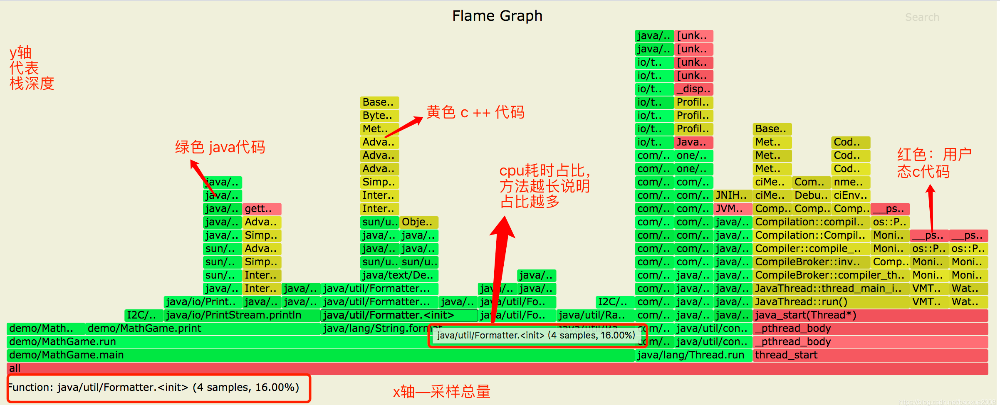

    这是性能优化系列的第五篇文章，主要介绍的是服务RT上升问题的分析及原理。

### 一、背景
某一个时期，交易服务经常会出现服务RT上升问题，导致业务成功率下降，然后业务就找过来了，交易应用作为核心应用，需要及时响应和处理。

<!-- more -->

机器配置如下：
```
CPU=8核
内存=16GB
磁盘=60GB
```

JVM配置如下：
```
JDK1.8
-Xms12g
-Xmx12g
-Xmn8g
-XX:+UseG1GC
```

### 二、分析流程

#### 问题表现
交易服务某个接口的RT上升，导致上游业务成功率下降。

##### 1 初步分析
当时从几个方面去做了考虑：
- 是不是业务流量骤增，导致应用负载升高，从而导致服务RT上升？
- 是不是应用GC频率高、GC耗时长导致的？
- 是不是最近有发布新需求或者更新导致的？

##### 2 查询监控
业务监控：
- 首先去Sunfire查看应用的业务监控项，找到对应的业务场景，分析RT99监控项，跟昨日对比上升明显。
- 再次去查看流量上涨情况，分析流量，数据跟昨日同时段差不多。

> 分析结果：业务流量没有上涨，不是业务原因导致的。

基础监控：
- 查看GC（ygc, fgc），没有明显上涨；查看内存使用情况（新生代、老年代、metaspace），没有明显上涨。
- 查看CPU，没有明显上涨；查看磁盘IO，没有明显上涨。
- 查看线程数量，没有明显上涨。
- 查看MySQL监控项；查看tair监控项；

> 分析结果：未发现问题。

##### 3 分析应用热点问题
执行arthas的profiler命令，生成应用热点的火焰图。
```
profiler start
```
> 默认情况下，生成的是 cpu 的火焰图，即 event 为cpu。 

未贴实际的情况，参考下图：


> 分析结果：未发现明显问题。

##### 4 执行Arthas的trace命令
trace 能方便的帮助你定位和发现因 RT 高而导致的性能问题缺陷。
```
trace com.alibaba.***.**OrderFacade  queryOrder
```
未贴实际的情况，参考下图：


> 分析结果：未发现明显问题。

##### 5 机器摘流
分析了一段时间后，未发现明显情况，于是对问题机器进行摘流处理。然后进行其他的分析，例如dump、GC啥的。

##### 6 分析最近上线功能
- 变更1：CMS升级成G1。
- 变更2：拉单优化。
- 变更3：scheduler jar升级。

使用排除法，对变更2 & 变更3进行代码的review和与中间件的沟通，不是造成RT上升的原因。最后怀疑是垃圾收集器的问题造成的。

##### 7 应用更新重新部署
将G1还原成CMS，应用部署上线后，未发现问题。    

为什么要升级G1呢？

##### 8 思考：为什么G1会影响RT呢？
- 适应期问题：
新的垃圾收集器在应用程序运行初期可能需要一定的时间来适应应用的内存使用模式和对象分配特点。在这个适应期内，可能会出现性能波动，导致接口 RT 上升。
G1 垃圾收集器在初始阶段可能会进行一些额外的后台活动，如初始的堆空间划分和记忆集（Remembered Set）的建立等。
- 配置问题：
G1 的默认配置可能并不完全适合特定的应用程序。例如，堆大小、年轻代和老年代的比例、并发标记周期的启动阈值等参数可能需要根据应用的实际情况进行调整。
如果堆大小设置不合理，可能导致频繁的垃圾收集，从而增加接口响应时间。
- 应用程序特性：
某些应用程序的特性可能与 G1 的工作方式不太匹配。例如，如果应用程序有大量的短期存活对象，G1 的分代收集策略可能不如 CMS 高效。
如果应用程序的内存分配模式非常不均匀，可能会导致 G1 在某些区域进行过多的垃圾收集，影响性能。
