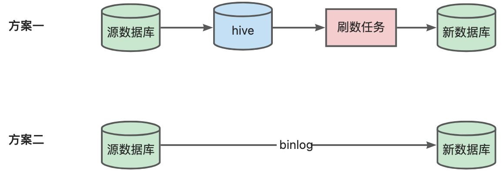
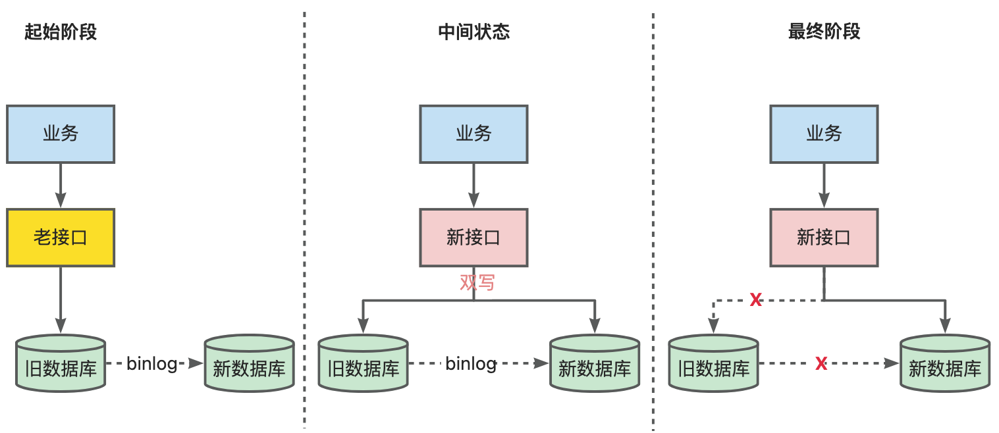
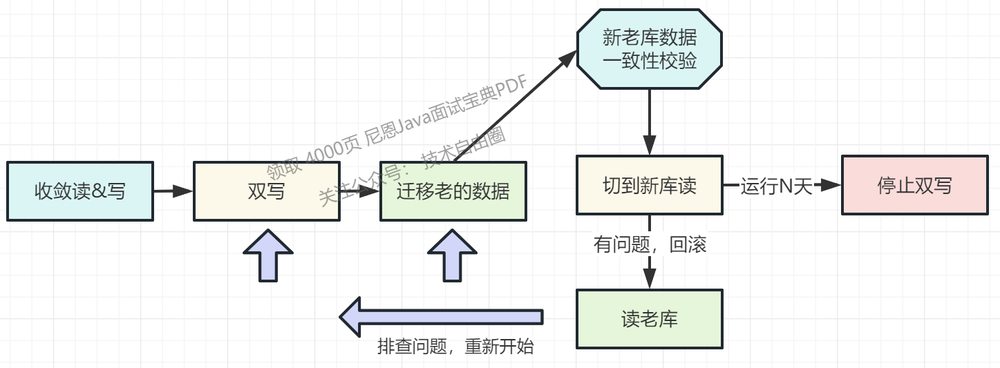

    这是系统重构系列的总结性文章，总结系统重构的一般流程和经验。

### 一、愿景
整个开发生涯中，经历了非常多的系统重构、系统合并，也总结了一些经验，记录下来。
<!-- more -->
### 二、项目管理流程
较大型的项目，都会经历如图步骤：

本文主要讲解分析设计过程部分。
### 三、常见问题及解决方案

#### 3.1、数据一致性问题：
数据一致性，需要特别关注。可以分为存量数据一致性、增量数据一致性问题和数据一致性保障方案。
##### 3.1.1、存量数据一致性：

1. 离线方式：
   1. 通过全量表+日增表，但是离线表一般是T+1（最快也是小时表），存在数据延迟问题，适用于数据变更频率低场景。
2. binlog方式：
   1. 延迟低，可靠性高。

##### 3.1.2、增量数据一致性：

增量数据，一般是通过接口双写的方式，来保障数据一致性，同时还会通过binlog作为冗余方式，保障高可用。

##### 3.1.3、使用离线表方式，先开双写还是先存量同步？
如果不得不使用离线表的方式进行数据迁移，应该怎么做？考虑先开双写还是先迁移存量数据？
###### 先开双写（灰度完成后），再做存量同步
主要流程：先开双写（灰度完成后），再做一次完整的存量同步操作。

1. 存量数据更新时，新库不存在数据，需要回查，性能会有影响。
   1. 解决办法：前期已旧库为准，新库可以采用异步+稳定性方案，降低影响。
2. 大批量数据更新，查询旧库，会造成旧库资源的冲击并影响现有业务。
   1. 解决办法：可以结合灰度计划，控制流量，减少对现有业务的影响。

###### 先存量同步，再开双写

> - 2个任务：
>   - 存量数据同步：执行一次。
>   - 增量数据同步：每日执行，直至全部灰度完成，并没有数据差异。
> - 灰度数据，新库不存在或被更新，需要查询旧库，再做更新。
> - 

###### ⭐️方案对比
> 先双写，后存量同步：
> - 方案更简单。
> 
> 先存量同步，后双写：
> - 方案更复杂，考虑点较多。

##### 3.1.4、数据一致性保障方案

1. 离线核对
   1. 通过D-1离线表进行全量核对。
2. 查询异步核对。
3. 实时核对。
   1. 可通过MQ的方式，进行数据核对。

#### 3.2、ID问题
在系统重构迁移时，需要考虑ID的问题。如下示例：将Place系统功能重构到ap内。

participant 业务
participant ap #ee6f6f
participant place #99FF99
database placemysql #99FF99
database apmysql #ee6f6f

== 初始状态 ==
业务->place : 创建商户
place->placemysql: 生成商户ID，增加sequence
place-->业务:返回商户ID

== 灰度状态 ==
业务->ap : 创建商户
ap->place:获取商户ID
place->placemysql: 生成商户ID，增加sequence
place-->ap:返回商户ID
ap-->业务:返回商户ID

== 最终状态 ==
业务->ap : 创建商户
ap->apmysql: 生成商户ID，增加sequence
ap-->业务:返回商户ID



ID的生成，在迁移过程中通常会有3个状态：
1. 初始状态：由原系统生成。
2. 灰度状态：由新系统调用原系统提供的接口生成（实际上由原系统生成）。
3. 最终状态：由新系统生成。

这里需要新系统考虑sequence问题，一般做法是新sequence需要抬高到一定值，防止生成的ID和旧ID重复，那需要抬高多少呢？
1. 抬高值 = 日创建量最高值 * 日期。（例如日最高创建量为10000，灰度时间为30天，这个时间尽量多估算点，那么需要抬高值为 10000 * 30 = 300000）

参考文章：[数据迁移方案设计](https://www.cnblogs.com/crazymakercircle/p/17531894.html#%E6%95%B0%E6%8D%AE%E8%BF%81%E7%A7%BB%E6%96%B9%E6%A1%88%E8%AE%BE%E8%AE%A1)