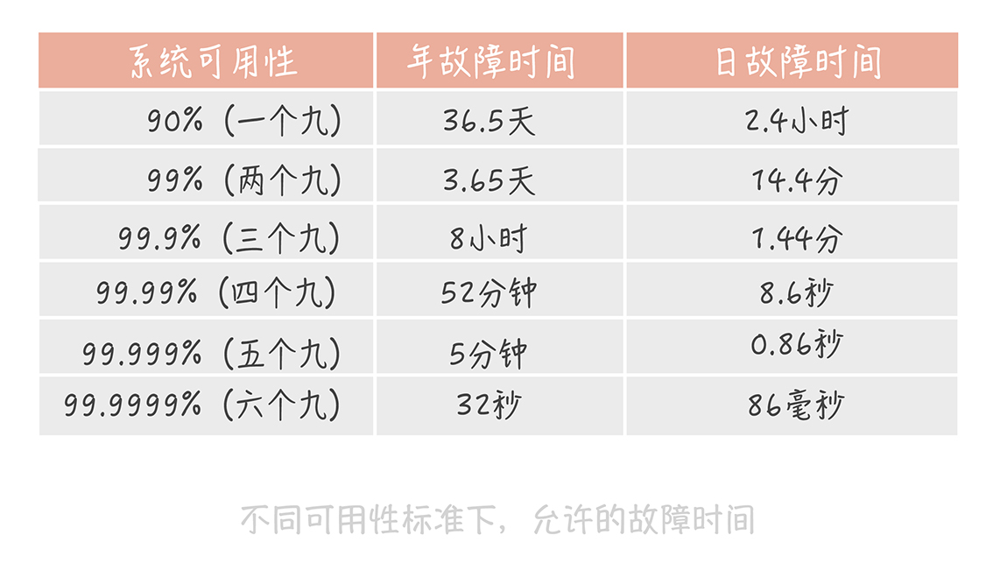
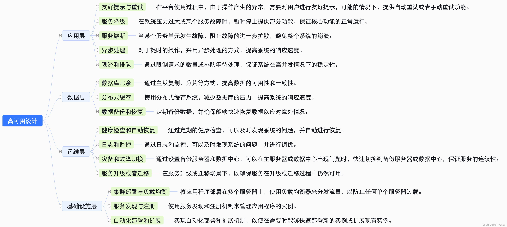

### 一、基础概念
在软件设计中，“三高” 是高并发（High - Concurrency）、高性能（High - Performance）、高可用（High - Availability），它们是构建高质量软件系统的关键目标。
<!--more-->

#### 1.1、高并发（High - Concurrency）
高并发(High Concurrency)通常是指系统能够同时并行处理很多请求。一般用响应时间、并发吞吐量TPS, 并发用户数等指标来衡量。

▲ 点击查看“并发&并行”相关定义

##### 什么是并发？
并发是指在**一段时间内**，多个任务交替执行。
> 并发的关键在于 “同时处理多个任务” 的外在表现，但在计算机系统的实际执行层面，特别是在**单核处理器**环境下，由于物理资源的限制（同一时刻只有一个核心能够执行指令），这些任务无法真正在同一时刻被执行。所以，通过操作系统的调度机制，让这些任务在一段时间内看起来像是同时在执行，这就形成了交替运行的情况。

##### 什么是并行？
并行是指在**同一时刻**，多个任务真正地同时执行。

**并发&并行的区别与联系**
- 区别
  - **执行时间：** 并发是多个任务在一段时间内交替执行，同一时刻只有一个任务在执行；而并行是多个任务在同一时刻真正地同时执行。例如，并发的多个任务就像在单车道的道路上多辆车交替行驶；而并行的多个任务则像在多车道的高速公路上多辆车同时行驶。
  - **硬件要求：** 并发可以在单处理器（CPU）系统中实现，通过操作系统的调度机制来实现任务的交替执行；而并行需要多个处理器（CPU）或多核处理器来支持，每个任务在不同的处理器或核心上运行。
  - **性能提升方式：** 并发主要是通过充分利用等待时间（如 I/O 等待）来提高系统的整体效率；并行则是通过同时利用多个计算资源来加速任务的完成。例如，并发在处理 I/O 密集型任务时效果显著；而并行在处理计算密集型任务时优势明显。
- 联系
  - **目的相同：** 并发和并行的目的都是为了提高系统的处理能力和效率，以应对多个任务同时存在的情况。
  - **可以结合使用：** 在实际的系统设计中，常常会将并发和并行结合使用。例如，在一个多核服务器上，通过多线程并发地处理多个任务，并且每个线程在不同的核心上实现并行执行，从而最大限度地发挥系统的性能。

##### 1.1.1、高并发的度量指标
并发的指标一般有QPS、TPS、IOPS，这几个指标都是可归为系统吞吐率，QPS越高系统能hold住的请求数越多，但光关注这几个指标不够，我们还需要关注RT，即响应时间，也就是从发出request到收到response的时延，这个指标跟吞吐往往是此消彼长的，我们追求的是一定时延下的高吞吐。

比如有100万次请求，99万次请求都在10毫秒内响应，其他次数10秒才响应，平均时延不高，但时延高的用户受不了，所以，就有了TP90/TP99指标，这个指标不是求平均，而是把时延从小到大排序，取排名90%/99%的时延，**这个指标越大，对慢请求越敏感。**

> TP90: 表示在所有的请求响应时间数据中，按照响应时间从小到大排序后，取排在 90% 位置的响应时间值。例如，有 100 个请求的响应时间数据，将它们排序后，第 90 个数据对应的响应时间就是 TP90。

##### 1.1.2、高并发的设计思路
高并发的设计思路有两个方向：
1. 垂直方向扩展，也叫竖向扩展
2. 水平方向扩展，也叫横向扩展

**垂直方向：** 提升单机能力（提升单机处理能力又可分为硬件和软件两个方面）
- 硬件方向，很好理解，花钱升级机器，更多核更高主频更大存储空间更多带宽
- 软件方向，包括用各快的数据结构，改进架构，应用多线程、协程，以及上性能优化各种手段，但这玩意儿天花板低，就像提升个人产出一样，996、007、最多24 X 7。

**水平方向：** 分布式集群
- 为了解决分布式系统的复杂性问题，一般会用到架构分层和服务拆分，通过分层做隔离，通过微服务解耦。
  这个理论上没有上限，只要做好层次和服务划分，加机器扩容就能满足需求，但实际上并非如此，一方面分布式会增加系统复杂性，另一方面集群规模上去之后，也会引入一堆AIOps、服务发现、服务治理的新问题。
  因为垂直向的限制，所以，我们通常更关注水平扩展，高并发系统的实施也主要围绕水平方向展开。

##### 1.1.3、高并发的关键技术
###### 集群化：负载均衡
负载均衡就是把负载（request）均衡分配到不同的服务实例，利用集群的能力去对抗高并发，负载均衡是服务集群化的实施要素，它分3种：
1. **DNS负载均衡，** 客户端通过URL发起网络服务请求的时候，会去DNS服务器做域名解释，DNS会按一定的策略（比如就近策略）把URL转换成IP地址，同一个URL会被解释成不同的IP地址，这便是DNS负载均衡，它是一种粗粒度的负载均衡，它只用URL前半部分，因为DNS负载均衡一般采用就近原则，所以通常能降低时延，但DNS有cache，所以也会更新不及时的问题。
2. **硬件负载均衡，** 通过布置特殊的负载均衡设备到机房做负载均衡，比如F5，这种设备贵，性能高，可以支撑每秒百万并发，还能做一些安全防护，比如防火墙。
3. **软件负载均衡，** 根据工作在ISO 7层网络模型的层次，可分为四层负载均衡（比如章文嵩博士的LVS）和七层负载均衡（NGINX），软件负载均衡配置灵活，扩展性强，阿某云的SLB作为服务对外售卖，Nginx可以对URL的后半部做解释承担API网关的职责。

###### 数据库层面：分库分表+读写分离
负载均衡解决了无状态服务的水平扩展问题，但我们的系统不全是无状态的，后面通常还有有状态的数据库，所以解决了前面的问题，存储有可能成为系统的瓶颈，我们需要对**有状态存储做分片路由。**

数据库的单机QPS一般不高，也就几千，显然满足不了高并发的要求。

所以，我们需要做分库分表 + 读写分离。

就是把一个库分成多个库，部署在多个数据库服务上，主库承载写请求，从库承载读请求。从库可以挂载多个，因为很多场景写的请求远少于读的请求，这样就把对单个库的压力降下来了。

如果写的请求上升就继续分库分表，如果读的请求上升就挂更多的从库，但数据库天生不是很适合高并发，而且数据库对机器配置的要求一般很高，导致单位服务成本高，所以，这样加机器抗压力成本太高，还得另外想招。

###### 读多写少：缓存
缓存的理论依据是局部性原理。

一般系统的写入请求远少于读请求，针对写少读多的场景，很适合引入缓存集群。

在写数据库的时候同时写一份数据到缓存集群里，然后用缓存集群来承载大部分的读请求，因为缓存集群很容易做到高性能，所以，这样的话，通过缓存集群，就可以用更少的机器资源承载更高的并发。

缓存的命中率一般能做到很高，而且速度很快，处理能力也强（单机很容易做到几万并发），是理想的解决方案。

CDN本质上就是缓存，被用户大量访问的静态资源缓存在CDN中是目前的通用做法。

**缓存也有很多需要谨慎处理的问题：**
1. 一致性问题：(a)更新db成功+更新cache失败 -> 不一致 (b)更新db失败+更新cache成功 -> 不一致 ©更新db成功+淘汰缓存失败 -> 不一致
2. 缓存穿透：查询一定不存在的数据，会穿透缓存直接压到数据库，从而导致缓存失去作用，如果有人利用这个漏洞，大量查询一定不存在的数据，会对数据库造成压力，甚至打挂数据库。解决方案：布隆过滤器 或者 简单的方案，查询不存在的key，也把空结果写入缓存（设置较短的过期淘汰时间），从而降低命失
3. 缓存雪崩：如果大量缓存在一个时刻同时失效，则请求会转到DB，则对DB形成压迫，导致雪崩。简单的解决方案是为缓存失效时间添加随机值，降低同一时间点失效淘汰缓存数，避免集体失效事件发生

但缓存是针对读，如果写的压力很大，怎么办？

###### 高写入：消息中间件
通过跟主库加机器，耗费的机器资源是很大的，这个就是数据库系统的特点所决定的。

相同的资源下，数据库系统太重太复杂，所以并发承载能力就在几千/s的量级，所以此时你需要引入别的一些技术。

比如说消息中间件技术，也就是MQ集群，它是非常好的做写请求异步化处理，实现削峰填谷的效果。

消息队列能做解耦，在只需要最终一致性的场景下，很适合用来配合做流控。

假如说，每秒是1万次写请求，其中比如5千次请求是必须请求过来立马写入数据库中的，但是另外5千次写请求是可以允许异步化等待个几十秒，甚至几分钟后才落入数据库内的。

那么此时完全可以引入消息中间件集群，把允许异步化的每秒5千次请求写入MQ，然后基于MQ做一个削峰填谷。比如就以平稳的1000/s的速度消费出来然后落入数据库中即可，此时就会大幅度降低数据库的写入压力。

消息队列本身也跟缓存系统一样，可以用很少的资源支撑很高的并发请求，用它来支撑部分允许异步化的高并发写入是很合适的，比使用数据库直接支撑那部分高并发请求要减少很多的机器使用量。

###### 避免挤兑：流控
再强大的系统，也怕流量短事件内集中爆发，就像银行怕挤兑一样，所以，高并发另一个必不可少的模块就是流控。

流控的关键是流控算法，有4种常见的流控算法。
1. **计数器算法（固定窗口）：** 计数器算法是使用计数器在周期内累加访问次数，当达到设定的限流值时，触发限流策略，下一个周期开始时，进行清零，重新计数，实现简单。计数器算法方式限流对于周期比较长的限流，存在很大的弊端，有严重的临界问题。
2. **滑动窗口算法：** 将时间周期分为N个小周期，分别记录每个小周期内访问次数，并且根据时间滑动删除过期的小周期，当滑动窗口的格子划分的越多，那么滑动窗口的滚动就越平滑，限流的统计就会越精确。此算法可以很好的解决固定窗口算法的临界问题。
3. **漏桶算法：** 访问请求到达时直接放入漏桶，如当前容量已达到上限（限流值），则进行丢弃（触发限流策略）。漏桶以固定的速率进行释放访问请求（即请求通过），直到漏桶为空。分布式环境下实施难度高。
4. **令牌桶算法：** 程序以r（r=时间周期/限流值）的速度向令牌桶中增加令牌，直到令牌桶满，请求到达时向令牌桶请求令牌，如获取到令牌则通过请求，否则触发限流策略。分布式环境下实施难度高。

#### 1.2、高性能（High - Performance）
高性能是指程序处理速度非常快，所占内存少，CPU占用率低。**高性能的指标经常和高并发的指标紧密相关，想要提高性能，那么就要提高系统发并发能力。**

##### 1.2.1、高性能的衡量指标
性能的常用的衡量指标包括响应时间RT（完成一个请求所花费的时间）、资源利用率（如 CPU 使用率、内存占用率等）、每秒事务处理量（TPS）等。例如，一个高性能的数据库系统，其查询响应时间可能在毫秒级别，CPU 使用率能够维持在一个合理的范围内，并且每秒能够处理大量的事务。

##### 1.2.2、高性能的设计思路
可以从计算机体系结构的底层原理去思考，系统优化离不开计算性能(CPU)和存储性能(IO)两个维度，每次谈到高性能设计，经常会面临几个名词：IO多路复用、零拷贝、线程池、冗余等等，总结如下方法：

**如何设计高性能计算(CPU)**
- 减少计算成本：代码优化计算的时间复杂度O(N^2)->O(N)，合理使用同步/异步、限流减少请求次数等；
- 让更多的核参与计算：多线程代替单线程、集群代替单机等等；

**如何提升系统IO**
- 加快IO速度：顺序读写代替随机读写、硬件上SSD提升等；
- 减少IO次数：索引/分布式计算代替全表扫描、零拷贝减少IO复制次数、DB批量读写、分库分表增加连接数等；
- 减少IO存储：数据过期策略、合理使用内存、缓存、DB等中间件，做好消息压缩等；

##### 1.2.3、高性能的关键技术
高性能的关键技术，包含高并发的关键技术，例如缓存、分库分表、读写分离。

###### 算法和数据结构优化
选择高效的算法 & 优化数据结构。

###### 硬件资源优化与适配
根据系统的负载特点选择服务器的硬件配置。对于计算密集型的应用，优先考虑配置高性能的 CPU 和足够的内存。例如，一个进行 3D 图形渲染的服务器，需要配备多核、高频的 CPU 和大容量的高速内存，以满足复杂图形计算的需求。

###### 代码优化与性能调优
减少不必要的计算和操作：     
在代码编写过程中，避免重复计算和不必要的循环嵌套。例如，将可以提前计算的结果放在循环体外进行计算，减少循环内部的计算量。对于复杂的条件判断，可以通过调整判断顺序来减少不必要的计算。

优化数据库访问代码：    
减少数据库查询的次数。例如，通过使用连接查询或子查询来一次性获取需要的数据，而不是多次执行简单的查询。对于频繁查询的数据库字段，合理地添加索引可以提高查询速度，但要注意避免过度索引导致的数据更新和存储成本增加。

###### 异步处理与并行处理
异步处理机制应用：   
通过异步处理可以提高系统的整体性能，特别是对于一些不需要立即返回结果的操作。例如，在 Web 应用中，用户提交表单后，可以先返回一个确认信息给用户，然后在后台异步地进行数据验证、存储等操作。可以使用消息队列（如 RabbitMQ 或 Kafka）来实现异步处理，将任务放入消息队列后，由专门的消费者进程或线程在后台进行处理。

#### 1.3、高性能 & 高并发 的区别
高性能和高并发确实有一些相似之处，但他们也有明显的区别：

相似点：
- **目标导向有重合：** 高并发和高性能的最终目标都是为了让系统能够更好地应对各种请求，提供优质的服务。在当今互联网应用场景下，如电商平台的促销活动、热门社交媒体的信息发布时段等，**高并发场景往往也要求系统具备高性能，这样才能在大量请求涌入时依然保证系统的流畅运行，为用户提供良好的体验。**
- **部分优化策略重叠：** 为了实现高并发和高性能，都可能会采用一些相同的技术手段。例如，缓存技术在两者中都经常被使用。在高性能系统中，缓存可以减少数据查询和处理的时间，提高系统的响应速度；在高并发系统中，缓存能够减轻后端服务器的压力，使得系统在大量请求下依然能够快速响应，避免反复从数据源获取相同的数据。

不同点：
- 侧重点不同：
  - 高并发：侧重于系统同时处理大量请求的能力。它更关注系统在多任务环境下的架构设计和资源分配，要确保系统在大量并发请求到来时不会崩溃，并且能够合理地调度资源，让各个请求都能得到及时处理。
  - 高性能：更强调系统的处理效率和资源利用率。高性能系统追求的是在给定的资源条件下（如 CPU、内存、磁盘 I/O、网络带宽等），能够以最短的时间完成单个请求的处理，并且尽可能地充分利用资源，避免浪费。
- 衡量指标不同：
  - 高并发：主要通过系统能够同时处理的请求数量、请求队列长度、吞吐量（单位时间内处理的请求数量）等指标来衡量。
  - 高性能：常用的衡量指标包括响应时间（完成一个请求所花费的时间）、资源利用率（如 CPU 使用率、内存占用率等）、每秒事务处理量（TPS）等。例如，一个高性能的数据库系统，其查询响应时间可能在毫秒级别，CPU 使用率能够维持在一个合理的范围内，并且每秒能够处理大量的事务。
- 实现策略的重点不同：
  - 高并发：
    - 架构层面：重点在于采用分布式架构、微服务架构等方式将系统进行拆分，通过负载均衡将请求均匀分配到多个节点或服务实例上，同时利用消息队列等异步处理机制来缓解系统压力。
    - 资源管理层面：需要关注资源的竞争和协调，例如数据库连接池的合理设置，避免过多的请求同时占用数据库连接导致系统阻塞。同时，对服务器资源进行动态调整和扩展，以适应不同并发水平的需求。
  - 高性能：
    - 算法和数据结构优化：选择高效的算法和数据结构是高性能的关键。例如，在数据搜索场景中，使用哈希表可以实现快速的数据查找，相比简单的线性查找算法，能够大大提高系统的性能。
    - 硬件优化和适配：根据系统的需求合理选择硬件设备，并进行优化配置。例如，对于计算密集型的高性能应用，可以选择高性能的 CPU 和 GPU，同时优化服务器的内存和存储系统，以提高数据读写速度。
    - 代码层面的精细优化：编写高效的代码，减少不必要的计算、内存分配和释放操作等。例如，在循环中避免重复计算，优化函数调用，减少对象的创建和销毁次数等，这些细节优化能够有效提高系统的性能。

#### 1.4、高可用（High - Availability）
高可用(High Availability，HA)核心目标是保障业务的连续性，从用户视角来看，业务永远是正常稳定的对外提供服务，业界一般用几个9来衡量系统的可用性。通常采用一系列专门的设计(冗余、去单点等)，减少业务的停工时间，从而保持其核心服务的高度可用性。

CAP理论和BASE理论、通过集群来提高系统整体稳定性、超时和重试机制、应对接口级故障：降级、熔断、限流、排队。我们在很多开源组件的文档中看到的 HA 方案就是提升组件可用性，让系统免于宕机无法服务的方案。

##### 1.4.1、高可用的衡量指标
可用性是一个抽象的概念，你需要知道要如何来度量它，与之相关的概念是： MTBF 和 MTTR。
- **MTBF（Mean Time Between Failure）** 是平均故障间隔的意思，代表两次故障的间隔时间，也就是系统正常运转的平均时间。这个时间越长，系统稳定性越高。
- **MTTR（Mean Time To Repair）** 表示故障的平均恢复时间，也可以理解为平均故障时间。这个值越小，故障对于用户的影响越小。

可用性与 MTBF 和 MTTR 的值息息相关，我们可以用下面的公式表示它们之间的关系：
> Availability = MTBF / (MTBF + MTTR)

这个公式计算出的结果是一个比例，而这个比例代表着系统的可用性。一般来说，我们会使用几个九来描述系统的可用性。

##### 1.4.2、高可用的设计思路

###### 冗余设计
通过冗余的硬件设备和软件组件，提高系统的可靠性。
- 硬件冗余
  - 服务器冗余：采用多台服务器来提供相同的服务，例如在 Web 服务中，使用负载均衡器将用户请求分配到多个 Web 服务器上。如果其中一台服务器出现故障，负载均衡器会将请求转发到其他正常的服务器，确保服务不中断。在一些关键业务场景中，甚至可以采用双机热备（Active - Active 或 Active - Standby）的方式，两台服务器同时运行相同的服务或一台处于备用状态，实时同步数据，当主服务器出现故障时，备用服务器能立即接管工作。
  - 存储设备冗余：对于存储系统，使用磁盘阵列（RAID）技术来实现存储冗余。不同的 RAID 级别提供不同程度的冗余和性能。例如，RAID 1 通过镜像技术将数据同时写入两块磁盘，当一块磁盘出现故障时，另一块磁盘的数据仍然可用；RAID 5 则是通过奇偶校验信息分布在多个磁盘上，允许一块磁盘故障后通过奇偶校验恢复数据，这种方式在提供一定冗余的同时也兼顾了存储效率。
- 软件组件冗余
  - 服务实例冗余：在微服务架构中，每个微服务可以部署多个实例。例如，订单服务部署多个实例并分布在不同的服务器上，通过服务注册与发现机制，当一个实例出现故障时，其他实例可以继续处理请求。同时，使用熔断器（Circuit Breaker）模式，当某个服务实例频繁出现故障时，暂时切断对该实例的请求，避免故障扩散，直到该实例恢复正常。
  - 数据备份与冗余存储：定期对数据进行备份，并且将备份数据存储在不同的地理位置或存储介质上。除了本地备份外，还可以使用云存储服务进行异地备份。在数据丢失或损坏的情况下，可以从备份数据中恢复。对于分布式系统中的数据，采用多副本策略，如在分布式数据库中，数据会在多个节点上保存副本，通过一致性算法（如 Paxos、Raft）来保证副本之间的数据一致性。
    
###### 故障检测与自动恢复
监控和预警：实时监控系统的运行状态，及时发现问题并发出预警。
- 健康检查机制
  - 服务器健康检查：通过心跳检测、端口扫描、服务响应检查等方式来监测服务器的健康状态。例如，负载均衡器每隔一段时间向后端服务器发送心跳包，如果在规定时间内没有收到服务器的响应，就认为该服务器出现故障，将其从服务列表中移除。在容器化环境（如 Docker、Kubernetes）中，容器编排工具也会定期检查容器的健康状态，当容器出现问题时，会自动重启或重新调度。
  - 服务健康检查：对于每个服务实例，检查其提供的接口是否能够正常响应。可以通过发送模拟请求或调用服务的健康检查接口来实现。例如，一个支付服务可以提供一个健康检查端点，该端点返回服务的状态信息，监控系统定期访问这个端点，如果返回的状态异常，就采取相应的恢复措施。
- 自动恢复策略
  - 服务器自动重启：当检测到服务器出现故障（如系统崩溃、软件故障等）时，自动重启服务器。在一些云服务环境中，云平台会自动检测到虚拟机或容器的故障，并自动重启它们。同时，为了避免频繁重启导致的问题，可以设置重启的次数限制和时间间隔。
  - 服务自动切换和重新部署：当一个服务实例出现故障时，自动切换到其他正常的服务实例。对于微服务架构，服务发现工具可以动态地更新服务实例列表，将请求导向可用的实例。在某些情况下，还可以自动触发服务的重新部署，例如，当检测到某个服务的代码更新后出现故障，可以回滚到之前的稳定版本或者重新部署经过修复的版本。

###### 负载均衡与流量控制
- 负载均衡策略
  - 硬件负载均衡器：如 F5 Big - IP 等硬件设备，可以根据服务器的负载情况（如 CPU 使用率、内存使用率、连接数等）将流量均匀地分配到多个服务器上。这种方式性能高、可靠性强，适用于对流量处理要求较高的大型企业网络或数据中心。
  - 软件负载均衡：例如 Nginx、HAProxy 等开源软件负载均衡器，它们可以在软件层面实现类似的功能。通过配置不同的负载均衡算法（如轮询、加权轮询、IP 哈希等），将请求合理地分配到后端服务器。在云环境中，云服务提供商的负载均衡服务（如 AWS Elastic Load Balancing）也可以根据用户的需求灵活地配置负载均衡策略。
- 流量控制与限流
  - 入口流量控制：在系统的入口处设置流量限制，防止大量突发流量涌入导致系统崩溃。可以根据系统的处理能力和资源情况，设定每秒允许进入的请求数量上限。例如，通过 API 网关对外部 API 请求进行限流，当请求数量超过阈值时，返回错误信息或引导用户稍后重试。
  - 服务间流量控制：在微服务架构中，为了防止某个微服务被过多的请求淹没，对服务间的调用进行限流。可以使用令牌桶算法或漏桶算法来实现限流。例如，当订单服务调用库存服务时，库存服务可以根据自己的处理能力设置限流策略，确保自身的稳定性。

###### 数据一致性与可靠性保障
- 数据一致性策略
  - 强一致性模型：在某些对数据准确性要求极高的场景下，如金融交易系统，采用强一致性模型。这通常需要通过分布式事务协议（如两阶段提交、三阶段提交）来保证所有副本的数据在任何时刻都是完全一致的。但这种方式会带来一定的性能开销，因为需要等待所有节点的数据更新完成才能返回结果。
  - 最终一致性模型：对于大多数互联网应用等对实时一致性要求不是特别严格的场景，采用最终一致性模型。例如，在分布式缓存系统中，数据更新后可能需要一段时间才能在所有副本中完全一致，但最终所有副本会达到一致状态。可以通过异步复制、版本号控制等方式来实现最终一致性。
- 数据可靠性措施
  - 数据校验与纠错：在数据存储和传输过程中，采用数据校验机制（如 CRC 校验、哈希校验等）来检测数据是否出现错误。如果发现错误，可以尝试通过纠错码（如汉明码）或重新获取数据来纠正错误。例如，在存储系统中，每次写入数据后计算数据的校验和，在读取数据时再次计算校验和并与之前的结果进行比较，如果不一致，则采取相应的纠错措施。
  - 数据存储可靠性保障：除了前面提到的存储设备冗余外，还可以通过数据加密、访问控制等方式来保障数据的存储安全。例如，对敏感数据进行加密存储，只有经过授权的用户才能解密和访问数据，防止数据泄露和篡改。

参考文章：
[软件系统“三高”的高并发，你了解吗？](https://bbs.huaweicloud.com/blogs/194361#H22)      
[系统怎样做到高可用？](https://zq99299.github.io/note-architect/hc/01/04.html#%E5%8F%AF%E7%94%A8%E6%80%A7%E7%9A%84%E5%BA%A6%E9%87%8F)