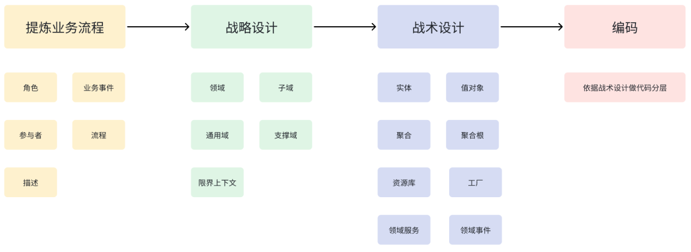
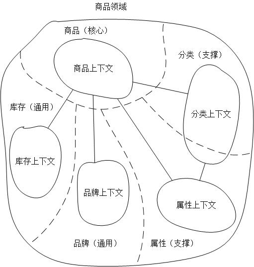
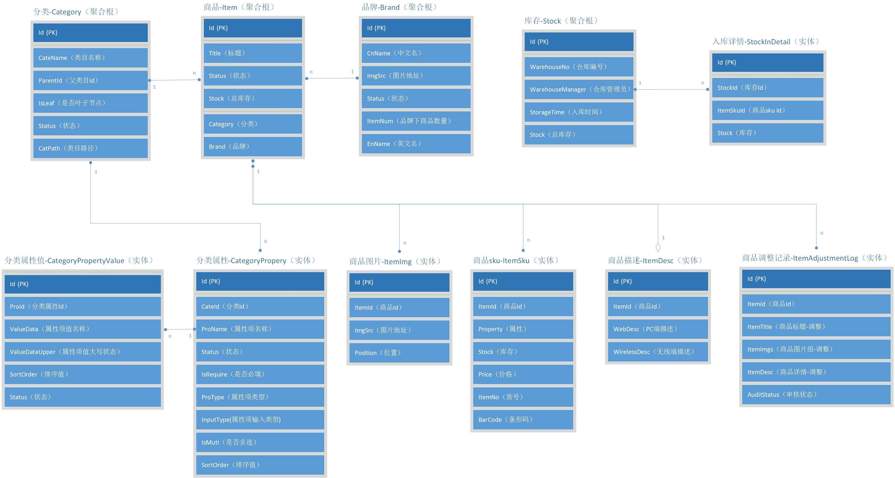

#  一. DDD实施过程？

<!--more-->

1. 首先第一步，根据业务诉求， 提炼出整体的业务流程 ，同时拆解出里面的关键事件，角色，参与者等核心实例。
   - 整个拆解和梳理的方法论：目前业界有一些比较成熟的，比如事件风暴，四色建模法等，后面单独讲。
2. 提炼完整个业务流程后，进入战略设计阶段，这个阶段主要是从全局和顶层的视角， 把整个业务语义转换为结构化分层 。通过领域和子域的划分，同时结合通用域、支撑域、限界上下文等设计，分解问题复杂度，其实就是前面说到的“分而治之”的思想。
3. 接下来就会到具体的战术设计阶段，通过前面的战略设计阶段，已经把整个领域、边界、上下文等关键模块都梳理完成，现在就是从各个域中再次拆解更细粒度的模块，去指导最终的编码实现，这些更细粒度的模块包括实体、聚合、聚合根等。
4. 最后就到了编码实现阶段，DDD有一个关键价值，叫做“ 设计即实现 ”，所以在战术阶段的设计，理论上是可以直接作用于代码的分层结构，如果架构和战术阶段有出入，说明之前的设计有问题，可以复盘重新推演。

##  步骤1：提炼业务流程
通用语言（Ubiquitous language）是指在软件设计中，业务人员和开发人员需要使用无歧义的统一语言来对话。

这些语言包括对概念的统一理解和定义，以及业务人员参与到软件建模中，否则业务的变化会造成软件巨大的变化。

方法论：
- 事件风暴
- 四色建模法

##  步骤2：战略设计
侧重于高层次、宏观上去划分和集成限界上下文。

战略建模（包含概念）：领域（Domain）、核心域、子域、界限上下文（Bounded Context）、上下文映射图（Context Mapping）。

战略设计结果**示例**如下：

> 首先，在商品领域中，商品是核心域，并对应一个商品上下文，库存被设计为一个通用子域，因为以后交易的业务场景会被用到，并对应一个库存上下文，品牌通用子域也一样，业务场景可能会对品牌的单独处理（比如品牌街，这是和商品不想关的），所以设计成通用子域会相对好些，分类支撑子域和属性子域相对复杂点，其实这里的分类和属性都是相对于商品而言的，你可以成为商品分类和商品属性，独立于商品之外，分类和属性是没有任何存在的业务意义的，所以，把它们设计为商品领域的支撑子域会比较好些。

##  步骤3：战术设计
梳理清楚上下文之间的关系后，细化上下文，我们需要从战术层面上剖析上下文内部的组织关系，进行建模。首先看下DDD中的一些定义。

战术建模（包含概念）：聚合（Aggregate）、实体（Entity）、值对象（Value Objects）、资源库（Repository）、领域服务（Domain Services）、领域事件（Domain Events）、模块（Modules）。

战术设计结果示例如下：

**示例 ：** 最后得到的结果可以是如下的：

##  步骤4：编码实现阶段
DDD工程实现，在对上下文进行细化后，我们开始在工程中真正落地DDD。

###  4.1、确定代码的分层架构
传统架构上，我们一般会使用MVC+三层架构，进行构建应用的代码结构。随着代码和业务的复杂度增加，三层结构存在业务逻辑分散问题，可以通过分层架构、清晰架构来解决业务逻辑分散问题。

#  二. 总结

参考文章：
[DDD 概念参考](https://domain-driven-design.org/zh/ddd-concept-reference.html)        
[DDD领域驱动设计理论](https://tech.dewu.com/article?id=113)      
