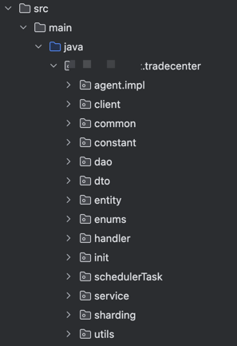
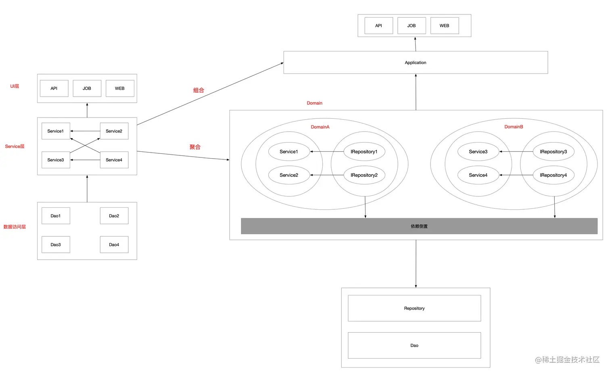
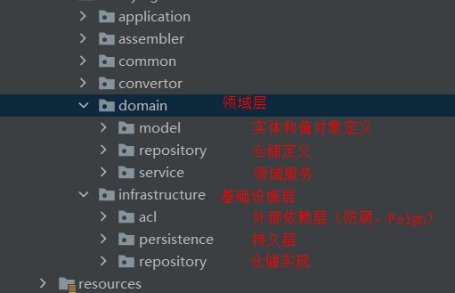

# 一. 三层架构的问题
尽管三层架构有其优点，在处理复杂业务时，三层架构也可能面临一些问题。具体有：
- **业务逻辑分散：** 在三层架构中，业务逻辑往往分散在不同的层中，导致业务流程难以理清，影响了代码的可读性和可维护性。
- **领域模型贫血：** 三层架构中，领域逻辑和数据存储混合在一起，导致领域模型的业务方法受限，难以表达复杂的业务规则。
- **过度依赖数据存储：** 不同层之间对数据存储的依赖紧密，当切换数据存储介质时，需要大量修改代码。

<!--more-->

旧代码结构示例：        

随着业务的不断复杂化，service层变得越来越庞大，服务之间的引用也变得越来越混乱，这为项目带来了风险和不确定性。

# 二. 三层架构演化到DDD
通过如下方法，将DDD思想融入现有的三层架构中，以实现更高内聚、更低耦合的代码架构。
- **领域的划分：** DDD将service层按业务场景划分成不同的领域，每个领域内包含实体、值对象、聚合根等元素。
- **内聚的领域：** 在领域内，业务尽量内聚，避免领域之间的耦合。每个领域内部可以根据需要建立更细粒度的子域，进一步提高内聚性。
- **应用层的组合：** 引入一个Application层，将领域内的service组合调用，形成业务服务，避免服务之间直接引用，降低耦合度。

经过我们的修改，三层架构可以（组合和聚合）演进到右侧架构模式，通过这种方式，我们能够更好地组织和管理代码，实现领域内高内聚低耦合的目标。

包结构如下：

展开包结构如下：

> Tips：阿里内部很多项目都是以DDD分层结构为模板进行构建的。

参考文章：
[领域驱动设计(DDD): 三层架构到DDD架构演化](https://juejin.cn/post/7270393208776785960)         
[DDD领域驱动设计落地实践](https://www.cnblogs.com/dennyzhangdd/p/14376904.html#_label1_0)     
[DDD落地：从阿里商品域，看DDD在大厂如何落地？](https://www.cnblogs.com/crazymakercircle/p/17897418.html#autoid-h3-6-1-0)       
[DDD领域驱动设计](https://juejin.cn/post/7171064476366536741#heading-25)